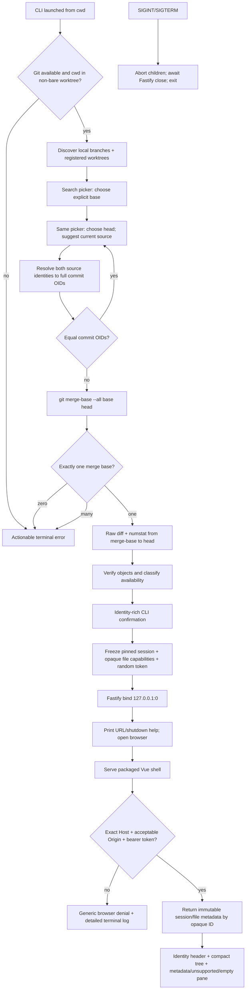

# Phase 1: Pinned Local Comparison - Research

**Researched:** 2026-07-11
**Domain:** Native-Git committed comparison, local CLI/server/browser session, and secure immutable metadata inventory
**Confidence:** HIGH for Git behavior and locked product scope; MEDIUM for library-specific implementation details; LOW where an MVP policy threshold remains discretionary

<user_constraints>
## User Constraints (from CONTEXT.md)

### Locked Decisions

### Base/head picker experience
- **D-01:** Reuse one searchable picker in an explicit two-step flow: choose base first, then head. The active role must be prominent at each step, followed by an identity-rich confirmation before launch.
- **D-02:** Present one result list grouped into **Local branches** and **Worktrees**. Preserve separate entries even when they resolve to the same commit because source identity, worktree path, detached state, and dirty-state context differ.
- **D-03:** Every candidate shows its type, human label, short commit ID, worktree path when applicable, detached state, and clean/dirty indicator. Those identifying fields remain searchable.
- **D-04:** Suggest the current worktree or current branch as the head, but require an explicit base. Do not guess a base from branch names, remote tracking data, or naming conventions.
- **D-05:** Keep equal-commit candidates visible so the list remains truthful, but prevent launch and explain that both selections resolve to the same commit.

### Pinned identity and dirty-state cues
- **D-06:** Show dirty state on worktree rows, repeat it in the launch confirmation, and retain a persistent browser badge for selected dirty worktrees. Do not require a blocking modal.
- **D-07:** Dirty-state copy must say that the worktree's committed `HEAD` is reviewed and staged, unstaged, and untracked bytes are ignored.
- **D-08:** The browser's persistent comparison header uses source labels and short object IDs. An always-accessible identity panel exposes copyable full base, head, and merge-base commit IDs.
- **D-09:** Before opening the browser, confirm the ordered source labels, resolved full base/head commits, computed merge base, selected worktree paths, and any ignored dirty-state warnings.
- **D-10:** State that the open session is pinned to the displayed commits and does not follow moving refs. Active selector-drift detection remains Phase 3 scope.

### Changed-file inventory
- **D-11:** Use a hierarchical changed-file tree with compacted single-child directories and deterministic path ordering. Preserve a lossless path value independently from its safe visual representation.
- **D-12:** Each file row shows a status badge, path, available additions/deletions, and a clear unsupported indicator. Renames and copies render as old path → new path while retaining Git's exact record identity.
- **D-13:** Select the first changed entry initially. In Phase 1, selection opens a read-only metadata/availability pane containing status, paths, counts, mode information, and any unsupported reason; Monaco text diff remains Phase 2 scope.
- **D-14:** Visually escape control characters such as tabs and newlines without changing the underlying path. Provide the exact path through a copy/details affordance. Git record parsing must not depend on line-oriented human output.

### Errors and empty states
- **D-15:** Keep pre-session failures in the CLI: missing Git, invalid/bare/empty repository, unresolved commits or objects, equal commits, unrelated histories, and multiple merge bases. Preserve valid prior selections when the user can recover by changing one endpoint.
- **D-16:** Failures after a valid session starts appear in the browser with concise recovery guidance and a detailed terminal diagnostic. Session expiry or server shutdown instructs the user to relaunch rather than silently attaching to a new identity.
- **D-17:** A valid pinned comparison with no merge-base-to-head changes opens the browser and shows a deliberate empty state with the comparison identities. It is not an error.
- **D-18:** Unsupported files remain in the inventory with a specific reason. Security denials use non-leaking browser messages while the terminal records the actionable cause; no fallback may broaden repository, object, path, token, or origin access.

### the agent's Discretion
The user explicitly delegated all four discussed areas to Claude's recommendations. Within the locked decisions above, planners may choose visual styling, exact copy, keyboard details for the picker, and internal implementation structure consistent with the project constraints.

### Deferred Ideas (OUT OF SCOPE)
None — discussion stayed within phase scope.
</user_constraints>

<phase_requirements>
## Phase Requirements

| ID | Description | Research support |
|---|---|---|
| SEL-01 | Resolve repository root from any directory inside a non-bare worktree. | Repository discovery state machine and `rev-parse` verification below. |
| SEL-02 | Actionable missing-Git, invalid/bare/empty-repository errors. | Typed Git-runner errors and repository probes below. |
| SEL-03 | One searchable branch/worktree picker, including detached worktrees. | `for-each-ref` plus `worktree list --porcelain -z` discovery below. |
| SEL-04 | Identity-rich entries including dirty state. | Candidate DTO and per-worktree `status --porcelain=v1 -z` guidance below. |
| SEL-05 | Explicit ordered base then head. | Two-step prompt state machine below. |
| SEL-06 | Block equal resolved commits. | Full-OID equality check before merge-base/server startup below. |
| SEL-07 | Explain ignored dirty bytes and committed `HEAD`. | Immutable-resolution boundary and required copy/state below. |
| SEL-08 | Bind, print URL/instructions, then open default browser. | Fastify/open lifecycle ordering below. |
| CMP-01 | Compare merge base of selected base/head to selected head. | Exactly-one merge-base algorithm and pinned diff endpoints below. |
| CMP-02 | Show labels and full base/head/merge-base identities. | Comparison schema and identity panel boundary below. |
| CMP-03 | Error on unrelated histories, multiple bases, or unavailable objects. | `merge-base --all` cardinality and object verification below. |
| CMP-04 | Preserve statuses, modes, exact paths, renames, and copies. | Raw `-z` parser and explicit rename/copy detection below. |
| CMP-05 | Show Git-derived counts when available. | Separate `--numstat -z` grammar and join invariant below. |
| CMP-06 | Use immutable pinned blobs, never working-tree bytes. | Raw diff blob IDs and `cat-file` object access boundary below. |
| CMP-07 | Handle spaces, Unicode, controls, and leading dashes safely. | Byte-preserving path model and argument-array execution below. |
| CMP-08 | Valid no-change empty state. | Empty inventory as a successful session state below. |
| CMP-09 | Explain binary/non-UTF-8/oversized/submodule/unsupported files. | Ordered availability classifier below. |
| DIFF-01 | Navigate deterministic changed-file tree with status/counts. | Pure tree projection and compact-directory rules below. |
| DIFF-06 | Explicit unsupported placeholder. | Discriminated `availability` contract and Phase-1 metadata pane below. |
| SAFE-01 | Listen only on `127.0.0.1` with OS-assigned port. | Explicit Fastify listen options and socket assertion below. |
| SAFE-02 | Reject missing token or unexpected origin. | Exact Host/Origin plus bearer-token gate below. |
| SAFE-03 | Deny arbitrary repository/ref/object/path/export selection after launch. | Closure-owned capability registry and opaque file IDs below. |
| SAFE-05 | Interrupt stops server without incomplete accepted writes. | Idempotent signal shutdown and child abort below; Phase 1 has no draft/export writes. |
</phase_requirements>

## Summary

Phase 1 should be planned as one immutable data pipeline, not as a UI that happens to call Git. The CLI discovers truthful source candidates, resolves the chosen ordered pair to full commit object IDs, rejects equality, requires exactly one best common ancestor, then computes a metadata inventory only from `mergeBase` and `head` object identities. After confirmation, a process-scoped capability registry and token are frozen, the loopback server binds, and only then is the browser opened. This ordering directly implements the locked boundary and prevents moving refs or dirty files from changing the open session. [VERIFIED: `.planning/phases/01-pinned-local-comparison/01-CONTEXT.md`; `.planning/PROJECT.md`]

Native Git already supplies stable machine protocols for the hard parts: `git worktree list --porcelain -z`, explicit `%00` fields in `for-each-ref`, `git merge-base --all`, raw diff records with `-z`, `--numstat -z`, and `cat-file --batch-command -Z`. The implementation should retain Git stdout as bytes until record boundaries are parsed, retain paths as bytes (plus an encoded transport value), and use raw diff object IDs for immutable content. Human diff output, `git status` text, filesystem reads, shell command strings, and `ref:path` expressions are all wrong boundaries for this phase. [CITED: https://git-scm.com/docs/git-worktree] [CITED: https://git-scm.com/docs/git-for-each-ref] [CITED: https://git-scm.com/docs/diff-format] [CITED: https://git-scm.com/docs/git-cat-file]

The greenfield project should stay a single npm package with explicit internal modules rather than introducing workspace/publishing overhead. Vite builds the Vue application to packaged static assets; Fastify serves those assets and a narrow API from the same origin. Monaco is deliberately behind a future `FileContentProvider`/editor adapter and is not instantiated in Phase 1; Phase 1 renders only metadata, availability, and unsupported placeholders. Zod schemas own every process-to-browser boundary, while internal Git byte structures remain richer than JSON. [VERIFIED: `.planning/PROJECT.md`; `.planning/phases/01-pinned-local-comparison/01-CONTEXT.md`] [CITED: https://vite.dev/guide/backend-integration]

**Primary recommendation:** Plan three vertical slices—(1) real-Git discovery/resolution and immutable inventory, (2) secure loopback session/API and lifecycle, (3) packaged Vue metadata workspace with fixture/API/E2E coverage—sharing one Zod comparison contract but never sharing arbitrary Git command capability with the browser.

## Architectural Responsibility Map

| Capability | Primary tier | Secondary tier | Rationale |
|---|---|---|---|
| Repository/worktree/ref discovery and dirty-state probes | CLI / local process | Native Git subprocess | Discovery precedes the browser and must fail in the terminal. |
| Ordered selection and launch confirmation | CLI / local process | — | Inquirer owns the explicit base-then-head interaction; no API can change it later. |
| Commit resolution, merge-base cardinality, diff metadata, blob classification | Domain/application core | Native Git subprocess | Pure comparison services freeze source identities before serving. |
| Session token, capability registry, origin/host checks, lifecycle | API / backend | OS process | Fastify exposes only the already-created session and closes with the CLI process. |
| File tree, identity header, metadata/unsupported states | Browser / client | API / backend | Vue projects immutable session DTOs; it does not resolve refs or paths. |
| Monaco diff editor | Browser / client (Phase 2) | Blob API (Phase 2) | D-13 explicitly excludes text-diff rendering from Phase 1. [VERIFIED: `01-CONTEXT.md`] |
| Repository persistence | None in Phase 1 | — | Draft/export persistence starts in later phases; Phase 1 is read-only toward the repository. [VERIFIED: `.planning/ROADMAP.md`] |

## Standard Stack

The project stack itself is locked. Versions below were queried from npm on 2026-07-11. Packages marked warning received `SUS` only because the legitimacy seam treats a very recent latest release as “too-new”; the planner must insert the required human-verification checkpoint before installing that exact version. No audited package exposed a registry `postinstall` script. [VERIFIED: npm registry and `gsd-tools query package-legitimacy check`]

### Runtime and core

| Library/tool | Version observed | Purpose | Recommendation/provenance |
|---|---:|---|---|
| Node.js | 24.15.0 installed | Runtime, process, crypto, child processes, HTTP foundation | Locked Node 24 baseline. [VERIFIED: local `node --version`; `.planning/PROJECT.md`] |
| Git CLI | 2.50.1 Apple Git-155 installed | Source of truth for refs, worktrees, merge bases, metadata, objects | Do not replace with a JS Git library. [VERIFIED: local `git --version`; `.planning/PROJECT.md`] |
| `commander` | 15.0.0 | CLI command/help and async entry | Use `parseAsync()` for the asynchronous action. [VERIFIED: npm registry] [CITED: https://github.com/tj/commander.js] |
| `@inquirer/search` | 4.2.1 | One searchable picker with grouped separators and disabled explanations | Use one prompt implementation twice, with role-specific message/default/filter. [VERIFIED: npm registry] [CITED: https://github.com/SBoudrias/Inquirer.js/tree/main/packages/search] |
| `fastify` | 5.10.0 | Loopback API and graceful server lifecycle | `SUS` warning: latest release is very recent; human-verify before install. [CITED: https://fastify.dev/docs/latest/Reference/Server/] |
| `@fastify/static` | 9.3.0 | Serve packaged Vite assets from an absolute build root | `SUS` warning: latest release is very recent; v9 is documented compatible with Fastify 5. [CITED: https://github.com/fastify/fastify-static] |
| `zod` | 4.4.3 | Shared strict wire contracts and explicit error shapes | Derive TypeScript types from schemas; do not duplicate interfaces. [VERIFIED: npm registry] [CITED: https://github.com/colinhacks/zod] |
| `open` | 11.0.0 | Cross-platform default-browser launch | Await only after bind; catch launch failure and keep printed URL/server usable. [VERIFIED: npm registry] [CITED: https://github.com/sindresorhus/open] |

### Browser and build

| Library/tool | Version observed | Purpose | Phase-1 boundary/provenance |
|---|---:|---|---|
| `vue` | 3.5.39 | Browser workspace | `SUS` warning: very recent release; use Composition API and plain local state for one immutable session. [CITED: https://vuejs.org/] |
| `vite` | 8.1.4 | Browser dev/build and packaged static output | `SUS` warning: very recent release; Fastify serves the production output. [CITED: https://vite.dev/guide/backend-integration] |
| `@vitejs/plugin-vue` | 6.0.7 | Vue SFC compilation | Official Vite Vue plugin. [VERIFIED: npm registry] [CITED: https://github.com/vitejs/vite-plugin-vue] |
| `monaco-editor` | 0.55.1 | Phase-2 side-by-side editor | Record compatible contracts now, but do not instantiate or fetch blob text in Phase 1. [VERIFIED: npm registry] [VERIFIED: `01-CONTEXT.md` D-13] |
| TypeScript | 7.0.2 | End-to-end static types/build | `SUS` warning: latest release is very recent; human-verify compatibility with Vite/Vue before pinning. [CITED: https://www.typescriptlang.org/] |
| `@types/node` | pin latest 24.x (24.11.1 observed) | Node 24 API types | `SUS` warning applies to latest registry publication; pin the Node-24 major rather than the registry’s Node-26 latest. [VERIFIED: npm registry] |
| `vue-tsc` | 3.3.7 | Vue SFC type checking | `SUS` warning: latest release is very recent; keep separate from Vite build. [CITED: https://github.com/vuejs/language-tools] |

### Testing

| Library | Version observed | Purpose | Provenance |
|---|---:|---|---|
| `vitest` | 4.1.10 | Unit, parser, real-Git fixture, API injection tests | `SUS` warning: latest release is very recent. Async setup/cleanup is documented. [CITED: https://vitest.dev/] |
| `@playwright/test` | 1.61.1 | Packaged browser/session smoke flows | `SUS` warning: recent release; local command reported 1.61.1. [CITED: https://playwright.dev/docs/test-webserver] |

### Deliberately omitted

- Do not add a Git library, state-management library, router, database, CORS plugin, Zod/Fastify bridge, tree widget, filename escaping package, or Monaco Vue wrapper in Phase 1. The native/platform APIs and small pure projections are sufficient, and each added abstraction would create a second authority. [RECOMMENDATION]
- Do not install Monaco merely to render a Phase-1 placeholder if dependency timing can be deferred cleanly. If the greenfield skeleton pins all locked UI dependencies up front, ensure no Phase-1 route returns text and no Monaco component is mounted. [RECOMMENDATION]

**Installation shape (after required human checkpoints):**

```bash
npm install commander @inquirer/search fastify @fastify/static zod open vue
npm install --save-dev typescript@7 @types/node@24 vite @vitejs/plugin-vue vue-tsc vitest @playwright/test
# Defer to Phase 2 unless the packaging skeleton requires it now:
npm install monaco-editor
```

## Package Legitimacy Audit

| Package | Registry | Age | Weekly downloads observed | Source repository | Verdict | Disposition |
|---|---|---:|---:|---|---|---|
| `commander` | npm | ~15 years | 365,538,388 | github.com/tj/commander.js | OK | Approved |
| `@inquirer/search` | npm | ~2 years | 20,872,246 | github.com/SBoudrias/Inquirer.js | OK | Approved |
| `fastify` | npm | ~10 years | 9,366,051 | github.com/fastify/fastify | SUS: too-new latest | Flagged checkpoint |
| `@fastify/static` | npm | ~4 years | 3,065,663 | github.com/fastify/fastify-static | SUS: too-new latest | Flagged checkpoint |
| `zod` | npm | ~6 years | 221,769,809 | github.com/colinhacks/zod | OK | Approved |
| `open` | npm | ~14 years | 95,441,357 | github.com/sindresorhus/open | OK | Approved |
| `vue` | npm | ~13 years | 13,274,279 | github.com/vuejs/core | SUS: too-new latest | Flagged checkpoint |
| `vite` | npm | ~6 years | 128,498,982 | github.com/vitejs/vite | SUS: too-new latest | Flagged checkpoint |
| `@vitejs/plugin-vue` | npm | ~6 years | 7,272,203 | github.com/vitejs/vite-plugin-vue | OK | Approved |
| `monaco-editor` | npm | ~10 years | 5,740,732 | github.com/microsoft/monaco-editor | OK | Approved/defer install |
| `typescript` | npm | ~14 years | 223,564,696 | github.com/microsoft/TypeScript | SUS: too-new latest | Flagged checkpoint |
| `@types/node` | npm | ~10 years | 310,835,009 | github.com/DefinitelyTyped/DefinitelyTyped | SUS: too-new latest | Flagged checkpoint; pin 24.x |
| `vue-tsc` | npm | ~5 years | 4,035,687 | github.com/vuejs/language-tools | SUS: too-new latest | Flagged checkpoint |
| `vitest` | npm | ~5 years | 75,033,961 | github.com/vitest-dev/vitest | SUS: too-new latest | Flagged checkpoint |
| `@playwright/test` | npm | ~6 years | 44,736,392 | github.com/microsoft/playwright | SUS: too-new latest | Flagged checkpoint |

**Packages removed due to SLOP verdict:** none.  
**Packages flagged as suspicious (SUS):** `fastify`, `@fastify/static`, `vue`, `vite`, `typescript`, `@types/node`, `vue-tsc`, `vitest`, `@playwright/test`. The seam’s recorded reason was release freshness, not missing registry/source/download signals; nevertheless the planner must insert the mandated human-verification checkpoint before installing each flagged exact release. [VERIFIED: `gsd-tools query package-legitimacy check`]

### Exact-release approval record required before installation

The coarse legitimacy signals above do not approve a release. Plan 01-01 must generate and present one row for every exact runtime and development release to be installed. Each row records: official npm URL; exact version; maintainers and publisher; source repository; publication timestamp; provenance/signature field when the registry exposes one; lifecycle scripts; `engines`; peer dependencies; compatibility evidence; and the human disposition `approve exact release` or `replace with <exact version>`. Registry metadata that is absent must be recorded as `not published by registry`, never silently omitted.

Compatibility evidence must explicitly cover the paired release sets `fastify@5.10.0` + `@fastify/static@9.3.0` and `vite@8.1.4` + `@vitejs/plugin-vue@6.0.7` + `vue@3.5.39` + `typescript@7.0.2` + `vue-tsc@3.3.7`, including relevant Node engines and peer ranges. The executor must emit available registry fields with exact-version `npm view` queries, then pause for auditable per-row human approval. The resulting approved or replaced table is copied verbatim into `01-01-SUMMARY.md`; no install begins while any row is undecided.

## Recommended Project Skeleton

Use one publishable package and one dependency graph. This is easier to package than a workspace monorepo and still provides enforceable internal boundaries. [RECOMMENDATION]

```text
package.json                 # ESM package, bin entry, engines.node >=24, build/test scripts
package-lock.json            # exact install graph
tsconfig.json                # shared strict options
vite.config.ts               # web root/output; Vue plugin
vitest.config.ts             # node tests; focused include patterns
playwright.config.ts         # packaged app lifecycle
src/
├── cli/
│   ├── main.ts              # Commander entry; exit-code mapping only
│   ├── launch.ts            # orchestration state machine
│   └── picker.ts            # candidate presentation/search/confirmation adapter
├── git/
│   ├── runner.ts            # shell-free Buffer subprocess primitive + typed errors
│   ├── repository.ts        # worktree/repository validation
│   ├── candidates.ts        # refs/worktrees/dirty discovery
│   ├── comparison.ts        # resolution, equality, merge-base cardinality
│   ├── raw-diff.ts          # raw -z parser
│   ├── numstat.ts           # numstat -z parser
│   ├── objects.ts           # cat-file object verification/read boundary
│   └── availability.ts      # size/type/UTF-8/support policy
├── domain/
│   ├── path-bytes.ts        # exact bytes, safe display, base64url transport
│   ├── file-tree.ts         # deterministic hierarchy/compaction pure projection
│   └── errors.ts            # actionable domain failure taxonomy
├── contracts/
│   ├── comparison.ts        # Zod schemas + inferred DTO types
│   └── api.ts               # success/error discriminated unions
├── server/
│   ├── app.ts               # Fastify factory for inject tests
│   ├── security.ts          # host/origin/token/header hooks
│   ├── capabilities.ts      # frozen launch-scoped opaque-ID map
│   ├── routes.ts            # session/file metadata only
│   ├── static.ts            # packaged Vite assets
│   └── lifecycle.ts         # listen/open/signal/close orchestration
└── web/
    ├── index.html
    ├── main.ts
    ├── App.vue
    ├── api/client.ts        # fragment token -> in-memory Authorization header
    ├── components/          # identity header, file tree, metadata/empty/error panes
    └── model/               # browser-only tree selection/projection

tests/
├── helpers/git-fixture.ts   # isolated real repositories and commit DAG builders
├── unit/                    # byte parsers, path display, tree, schemas
├── git/                     # discovery/comparison/inventory contracts
├── api/                     # Fastify inject security/capability tests
└── e2e/                     # packaged Vue session flows
```

The Fastify app factory must accept a frozen `PinnedSession` and security material; it must not accept a repository path from a request. The CLI launch orchestrator is the only composition root that knows both picker identities and server construction. [RECOMMENDATION]

## Architecture Patterns

### System Architecture Diagram



### Pattern 1: shell-free byte-oriented Git runner

Use `spawn('git', args, { cwd, shell: false, signal, stdio: ['pipe','pipe','pipe'] })`. Collect stdout as `Buffer` with an explicit operation-specific ceiling; collect bounded diagnostic stderr separately; report spawn `ENOENT`, signal/timeout, exit code, and stderr as different typed failures. Never interpolate a shell command. Node documents that `spawn` does not use a shell by default and accepts `AbortSignal`; `exec`/`execFile` buffering has a default `maxBuffer` and is a poor fit for repository-sized diff output. [CITED: https://nodejs.org/docs/latest-v24.x/api/child_process.html]

```ts
// Source: Node.js 24 child_process docs
const child = spawn('git', args, {
  cwd,
  shell: false,
  signal,
  stdio: ['pipe', 'pipe', 'pipe'],
});
```

Planning implications:
- Keep arguments as discrete strings/bytes and insert `--` or `--end-of-options` at every Git option/revision boundary that supports it. Leading-dash paths must never become options. [CITED: https://git-scm.com/docs/git-rev-parse]
- Do not set `encoding: 'utf8'` on machine-protocol stdout. Parse NUL delimiters from bytes first. [CITED: https://git-scm.com/docs/diff-format]
- Every operation gets a name, timeout/abort signal, stdout limit, and safe diagnostic mapper. A giant diff must become an actionable bounded failure, not an allocation explosion. [RECOMMENDATION]

### Pattern 2: discovery preserves source identity separately from commit identity

Build branch candidates from `git for-each-ref refs/heads` using explicit fields such as full refname and full object name. Git’s format supports `%00`; ref records may use an LF record boundary because Git refnames cannot contain LF, but all fields should still be parsed explicitly rather than split on whitespace. Build worktree candidates from `git worktree list --porcelain -z`; the stable porcelain format provides `worktree`, `HEAD`, `branch`, `detached`, `bare`, `locked`, and `prunable` attributes with NUL terminators. [CITED: https://git-scm.com/docs/git-for-each-ref] [CITED: https://git-scm.com/docs/git-worktree]

Recommended candidate model:

```ts
type SourceCandidate =
  | { kind: 'branch'; id: string; label: string; refName: string; commitOid: string }
  | {
      kind: 'worktree'; id: string; label: string; pathBytes: PathBytes;
      branchRef?: string; detached: boolean; commitOid: string;
      dirty: 'clean' | 'dirty' | 'unavailable'; unavailableReason?: string;
    };
```

Run `git -C <worktree> status --porcelain=v1 -z --untracked-files=normal` for each usable worktree; any output means dirty, and staged, unstaged, and untracked entries are intentionally collapsed to one warning state. Never parse the human long-status format. [CITED: https://git-scm.com/docs/git-status]

Preserve branch and worktree rows even when `commitOid` is equal. A branch row has dirty state “not applicable”; a worktree row owns its own dirty state. A prunable or inaccessible registered worktree should remain truthful but disabled with an “unavailable” explanation rather than being silently omitted; this is the only way to reconcile “every registered worktree” with inability to inspect its committed state. [RECOMMENDATION]

The picker’s `source(term)` can return `Separator('Local branches')`, filtered branch choices, `Separator('Worktrees')`, and filtered worktree choices. The official prompt supports separators, default cursor, disabled reason strings, and a source `AbortSignal`. [CITED: https://github.com/SBoudrias/Inquirer.js/tree/main/packages/search]

### Pattern 3: explicit repository and endpoint resolution state machine

Recommended probes, in order:

1. Spawn `git --version`; map `ENOENT` to “Git is not installed or not on PATH.” [RECOMMENDATION]
2. From the launch cwd, run `git rev-parse --path-format=absolute --show-toplevel`; a nonzero result means “not inside a Git worktree.” [CITED: https://git-scm.com/docs/git-rev-parse]
3. Run `git rev-parse --is-bare-repository` and reject `true`; also require a nonempty worktree top-level path. [CITED: https://git-scm.com/docs/git-rev-parse]
4. Discover candidates and verify each launchable candidate as a commit with `git rev-parse --verify --end-of-options '<source>^{commit}'`. An unborn/empty repository has no launchable commit candidates. [CITED: https://git-scm.com/docs/git-rev-parse]
5. Resolve again after both selections, immediately before confirmation. Freeze the returned full OIDs; never retain a ref as the comparison input. [RECOMMENDATION]
6. Compare full OID strings for equality. If equal, preserve the valid base and return to head selection with the D-05 explanation. [VERIFIED: `01-CONTEXT.md`]

Do not assume 40-character SHA-1. Query `git rev-parse --show-object-format` and accept the repository’s full object format (commonly SHA-1 or SHA-256); obtain display abbreviations through `git rev-parse --short=12 <fullOid>` rather than slicing. [CITED: https://git-scm.com/docs/git-rev-parse]

### Pattern 4: require exactly one merge base

Run `git merge-base --all <baseOid> <headOid>` and parse complete OID lines. Zero outputs means unrelated histories; one is the pinned merge base; more than one is the locked “multiple merge bases” CLI error. Do not omit `--all`: Git documents that criss-cross history can have multiple equally best common ancestors, while the default form emits only one unspecified choice. [CITED: https://git-scm.com/docs/git-merge-base]

Then verify base, head, and merge-base objects still exist and are commits (for example `cat-file -e '<oid>^{commit}'`) before launching. Object disappearance between selection and launch is an unavailable-object error, not permission to re-resolve a moving ref. [CITED: https://git-scm.com/docs/git-cat-file]

### Pattern 5: two exact Git diff protocols joined by record identity

Use the same deterministic options and endpoints for two commands:

```text
git diff --raw -z --no-abbrev --find-renames=50% --find-copies=50% \
  --find-copies-harder --no-ext-diff --no-textconv <mergeBase> <head> --

git diff --numstat -z --find-renames=50% --find-copies=50% \
  --find-copies-harder --no-ext-diff --no-textconv <mergeBase> <head> --
```

Raw records provide source/destination modes, source/destination object IDs, status plus optional similarity score, and one path or two paths for rename/copy. With `-z`, paths are verbatim NUL-terminated bytes. Status `M` includes content or mode changes; `T` is a type change; unknown/unexpected statuses must become a specific unsupported record, not a parser crash. [CITED: https://git-scm.com/docs/diff-format]

Numstat has a different grammar. Read additions and deletions up to tabs, then read the first NUL field. For an ordinary record it is the path; for a rename/copy it is empty and is followed by old-path NUL and new-path NUL. Binary entries use `-` for both counts. Never split numstat by lines and never parse brace-compacted human rename text. [CITED: https://git-scm.com/docs/diff-format] [CITED: https://git-scm.com/docs/git-diff]

Join raw and numstat records by an exact byte key `(status family, oldPathBytes?, newPathBytes)` and assert one-to-one cardinality. A mismatch is an internal Git-protocol/invocation error; do not attach counts by display path or array index alone. `--find-copies-harder` is needed to detect copies whose source was not itself modified, but Git documents that it is more expensive; this is a correctness/performance risk to cover with a large-fixture smoke test. [CITED: https://git-scm.com/docs/git-diff]

### Pattern 6: immutable blobs and ordered availability classification

Raw diff object IDs are the authority for old/new content. Once the inventory is built, content code receives only a file capability plus side; it looks up the corresponding frozen object ID and mode. It must never call `readFile(worktreePath + relativePath)`, `git show <movingRef>:<path>`, filters, textconv, or external diff drivers. `cat-file` returns raw uncompressed object contents, while `--textconv`/`--filters` intentionally transform them and must remain unused. [CITED: https://git-scm.com/docs/git-cat-file]

For repeated reads in later phases, `git cat-file --batch-command -Z` provides NUL-delimited commands/results and explicit `missing`/`ambiguous` states; Phase 1 may use one-shot `cat-file -e/-s/-t` if simpler, but `objects.ts` should hide that choice. [CITED: https://git-scm.com/docs/git-cat-file]

Recommended classifier precedence:

1. Git mode `160000` → `unsupported: submodule` (the object is a commit/gitlink, not a blob).
2. Missing/wrong object type → post-launch `unavailable: missing-object`; never re-resolve the ref.
3. Blob size above an explicit `MAX_INLINE_BLOB_BYTES` → `unsupported: oversized`, including actual size and configured limit.
4. Git numstat `-/-` or a NUL-byte content signal → `unsupported: binary`.
5. Strict `TextDecoder('utf-8', { fatal: true })` failure → `unsupported: non-utf8`.
6. Otherwise → `available: text` for Phase 2, while Phase 1 still renders metadata only.

The exact oversized threshold is not locked or documented. A conservative 1 MiB per blob side is recommended for the MVP, centralized as one policy constant and tested at limit/limit+1; this is an `[ASSUMED]` product/performance policy and must be confirmed during planning. Do not read a blob into memory before checking its Git-reported size. [ASSUMED]

Mode `120000` symlinks contain a blob with link-target bytes. Recommend classifying them as text metadata only in Phase 1 and deferring whether Monaco renders link targets to Phase 2; never follow the symlink through the filesystem. [CITED: https://git-scm.com/docs/git-fast-import] [RECOMMENDATION]

### Pattern 7: lossless path model and safe display projection

A Git path is a byte sequence; a JavaScript string is not a lossless general representation of arbitrary repository path bytes. Keep `Buffer`/`Uint8Array` internally, compare/sort by bytes, and serialize a base64url representation into the API. Derive a separate safe visual string that escapes `\t`, `\n`, `\r`, C0 controls, DEL, and backslash visibly. Do not Unicode-normalize. [CITED: https://git-scm.com/docs/diff-format] [RECOMMENDATION]

Recommended wire shape:

```ts
const ExactPathSchema = z.strictObject({
  bytesBase64url: z.string(),
  display: z.string(),
  utf8: z.string().optional(),
});
```

The opaque `fileId` should be derived from record position plus a process-random namespace or a hash of the exact record; the browser uses `fileId` for selection and API routes, never a path. For ordinary valid UTF-8 paths, the details/copy affordance can expose the exact decoded path. For non-UTF-8 path bytes, a browser clipboard cannot faithfully represent a POSIX byte path as text, so expose the base64url bytes and an explicit explanation rather than claiming a textual copy is exact. CMP-07’s required spaces/Unicode/tabs/newlines/leading-dash cases remain exactly representable. [RECOMMENDATION]

Tree ordering should be a pure deterministic bytewise order on the effective display path (new path for additions/renames/copies, old path for deletions), with a stable old-path tie-breaker. Tree compaction is a view projection: compact only directory nodes with exactly one directory child and no file children; never concatenate or mutate the exact path identity. [RECOMMENDATION]

### Pattern 8: Zod owns the wire, not the Git parser

Define strict discriminated schemas for:

- `PinnedIdentity { objectFormat, base, head, mergeBase, labels, selectedWorktrees, dirtyWarnings }`
- `ChangedFile { id, status, oldPath?, newPath?, oldMode?, newMode?, oldBlob?, newBlob?, additions?, deletions?, availability }`
- `availability: { kind: 'text' } | { kind: 'unsupported'; reason: ...; detail? } | { kind: 'unavailable'; reason: ... }`
- `SessionResponse`, `FileMetadataResponse`, and generic non-leaking API errors.

Use `safeParse` at API/client boundaries and infer static types from the schema. Zod documents strict object validation, `safeParse`, discriminated unions, and inferred types. Do not use Zod to decode raw Git bytes; first parse the Git protocol into trusted internal values, then validate the serializable DTO. [CITED: https://github.com/colinhacks/zod]

### Pattern 9: loopback is a network security boundary

Bind with `await fastify.listen({ host: '127.0.0.1', port: 0 })`. Fastify documents that `port: 0` requests an available port and that `127.0.0.1` is IPv4-only; do not use omitted host, `localhost`, `::`, or `0.0.0.0`. [CITED: https://github.com/fastify/fastify/blob/main/docs/Reference/Server.md]

After bind:

1. Read the assigned numeric port and freeze `expectedOrigin = http://127.0.0.1:<port>` and `expectedHost = 127.0.0.1:<port>`.
2. Generate at least 32 random bytes with `node:crypto.randomBytes`, encode base64url, and keep it only in process memory. Node documents `randomBytes` as cryptographically strong pseudorandom data. [CITED: https://nodejs.org/docs/latest-v24.x/api/crypto.html#cryptorandombytessize-callback]
3. Print/open `http://127.0.0.1:<port>/#token=<encoded>`. URI fragments are processed by the browser and are not sent in the initial HTTP request. [CITED: https://developer.mozilla.org/en-US/docs/Web/URI/Reference/Fragment]
4. The SPA immediately removes the fragment from the visible URL with `history.replaceState`, retains the token only in memory, and sends `Authorization: Bearer <token>` on every `/api/*` request. [RECOMMENDATION]
5. For every API request, require exact Host, reject an `Origin` header unless it exactly equals `expectedOrigin`, and require a constant-time token comparison. Same-origin GETs may omit Origin, so absence may be accepted only when exact Host and token both pass; an unexpected present Origin is always denied. [RECOMMENDATION]
6. Do not enable CORS. Add `Cache-Control: no-store`, `Referrer-Policy: no-referrer`, `X-Content-Type-Options: nosniff`, `frame-ancestors 'none'`, `base-uri 'none'`, and a CSP allowing only packaged same-origin scripts/styles/connects. [RECOMMENDATION]

A loopback address only limits reachability; public pages can attempt local-network requests, so token and origin/capability checks remain necessary. [CITED: https://wicg.github.io/local-network-access/]

### Pattern 10: closure-owned API capabilities

Construct routes over a frozen `Map<FileId, FrozenChangedFile>`. Recommended Phase-1 API:

```text
GET /api/session
GET /api/files/:fileId
```

There is no request field for repository root, Git cwd, ref, commit ID, blob ID, source path, destination path, Git options, export path, or filesystem path. Unknown file IDs return the same generic 404 shape. API errors never echo secrets, absolute repository paths, attempted object IDs, or command stderr; the terminal logger receives an error correlation ID plus actionable details. [RECOMMENDATION]

This is stronger and simpler than validating arbitrary inputs: prohibited capability is absent from the API grammar. SAFE-03 should be tested by sending extra query/body fields and arbitrary-looking IDs and proving no Git runner invocation occurs. [RECOMMENDATION]

### Pattern 11: bind-before-open and idempotent shutdown

Commander async actions require `parseAsync()`. Build and validate the session before binding; bind before printing the final URL/opening the browser. Await `open(url)` but catch opener failure as a recoverable warning because the printed URL remains usable. [CITED: https://github.com/tj/commander.js] [VERIFIED: npm package `open` official repository]

Register `SIGINT` and `SIGTERM` handlers around one idempotent `shutdown()` promise. It should stop accepting new work, abort active Git subprocesses, await `fastify.close()`, remove handlers, and then set/return the intended exit status. Fastify’s `close()` is promise-based and triggers close hooks. Phase 1 has no accepted draft/export writes, but the same lifecycle boundary is where later atomic writes will drain. [CITED: https://github.com/fastify/fastify/blob/main/docs/Reference/Server.md] [VERIFIED: `.planning/REQUIREMENTS.md`]

Do not automatically terminate merely because one browser tab closes; reliable tab-close detection is not a safe process ownership primitive. The terminal process is the owner and prints interrupt instructions. [RECOMMENDATION]

## Do Not Hand-Roll

| Problem | Do not build | Use instead | Why |
|---|---|---|---|
| Git graph semantics | JS ancestry walker | `git merge-base --all` | Native Git handles replace/graft/object-format/history semantics and multiple best bases. |
| Git repository/worktree internals | Read `.git` files/directories | `rev-parse`, `for-each-ref`, `worktree list --porcelain -z` | Linked worktrees and per-worktree refs have nontrivial layouts. |
| Rename/copy classification | Filename/content heuristics | Native `git diff` rename/copy detection | Status, score, modes, and blobs must match Git. |
| Binary line counts | Decode and count lines | `--numstat -z` (`-/-` for binary) | Counts are required to be Git-derived. |
| Object retrieval | Worktree filesystem reads or `ref:path` API input | Raw diff object IDs + `cat-file` | This preserves pinning and avoids path/revision ambiguity. |
| Shell quoting | Escaped command strings | `spawn('git', args, { shell:false })` | Spaces, controls, leading dashes, and injection remain data. |
| Search prompt terminal UI | Custom raw-mode key handling | `@inquirer/search` | Search, grouping, disabled explanations, defaults, and cancellation already exist. |
| Default-browser platform commands | `open`/`start`/`xdg-open` branching | `open` package | Cross-platform launch edge cases are outside product value. |
| API types duplicated across tiers | Hand-maintained TS interfaces | Zod schemas + `z.infer` | Runtime and static contracts stay aligned. |
| Client access control | Sanitizing arbitrary requested paths/OIDs | Opaque launch-scoped capability IDs | The unsafe operation is unrepresentable. |

**Key insight:** almost every difficult Phase-1 edge case is a boundary-encoding or authority problem. Native Git should decide Git facts; the CLI should decide the comparison; the server should expose only frozen capabilities; the browser should decide presentation only. [RECOMMENDATION]

## Common Pitfalls and Planning Risks

### 1. Calling `merge-base` without `--all`
**Failure:** A criss-cross history silently chooses one merge base, violating CMP-03.  
**Prevention:** Count `merge-base --all` outputs and require exactly one. [CITED: https://git-scm.com/docs/git-merge-base]

### 2. Treating labels as identities
**Failure:** A branch moves between selection and server start or while the browser is open, changing content.  
**Prevention:** Resolve to full commit IDs immediately before confirmation; all later operations accept only pinned OIDs. Active drift detection remains Phase 3. [VERIFIED: `01-CONTEXT.md` D-09/D-10]

### 3. Reading worktree files to classify/render
**Failure:** Dirty staged/unstaged/untracked bytes leak into a supposedly committed review.  
**Prevention:** Use modes/blob IDs from the merge-base-to-head raw diff and `cat-file`; filesystem access is limited to launch/discovery and packaged application assets. [VERIFIED: `.planning/PROJECT.md`] [CITED: https://git-scm.com/docs/git-cat-file]

### 4. Line-oriented parsing
**Failure:** Tabs/newlines in filenames split records, brace-formatted renames are mistaken for paths, and counts attach to the wrong file.  
**Prevention:** Parse exact `-z` grammars as bytes and cover every unusual-name fixture. [CITED: https://git-scm.com/docs/diff-format]

### 5. Combining raw and numstat assumptions
**Failure:** A parser assumes both formats have the same path layout or joins records only by new display path.  
**Prevention:** Separate parsers, shared exact record key, one-to-one join assertions. [CITED: https://git-scm.com/docs/diff-format]

### 6. Hardcoding SHA-1
**Failure:** Full-ID validation, zero OIDs, copy fields, or abbreviations fail in SHA-256 repositories.  
**Prevention:** Query object format; treat OIDs as opaque validated full strings; ask Git for abbreviations. [CITED: https://git-scm.com/docs/git-rev-parse]

### 7. Copy detection incompleteness
**Failure:** `-C` alone misses copies from unchanged source files.  
**Prevention:** Use `--find-copies-harder` for CMP-04 and test performance on a representative larger repository. Git explicitly documents the additional cost. [CITED: https://git-scm.com/docs/git-diff]

### 8. Configuration-dependent diff behavior
**Failure:** user `diff.renames`, external diff, textconv, or attributes alter results unexpectedly or execute repository-configured programs.  
**Prevention:** pass explicit rename/copy flags, `--no-ext-diff`, and `--no-textconv`; retrieve raw objects without filters. Reviewing must not execute repository code. [CITED: https://git-scm.com/docs/git-diff] [VERIFIED: `.planning/REQUIREMENTS.md` Out of Scope]

### 9. Assuming every registered worktree is accessible
**Failure:** prunable, locked, moved, or unmounted worktree paths make dirty-state probes fail.  
**Prevention:** preserve an unavailable disabled worktree record and actionable reason; do not silently call it clean. [CITED: https://git-scm.com/docs/git-worktree] [RECOMMENDATION]

### 10. Token in query string
**Failure:** token appears in initial HTTP request, logs, referrers, and history.  
**Prevention:** URL fragment, in-memory bearer header, immediate fragment removal, no-store/no-referrer. [CITED: https://developer.mozilla.org/en-US/docs/Web/URI/Reference/Fragment]

### 11. “Loopback means trusted”
**Failure:** a hostile web page probes the service; DNS rebinding/Host confusion or permissive CORS broadens access.  
**Prevention:** explicit `127.0.0.1`, exact Host, reject unexpected Origin, random bearer token, no CORS, opaque capabilities. [CITED: https://wicg.github.io/local-network-access/]

### 12. Opening before successful bind
**Failure:** browser shows a connection error or points at a guessed port.  
**Prevention:** await `listen({ host:'127.0.0.1', port:0 })`, derive URL, print, then open. [CITED: https://github.com/fastify/fastify/blob/main/docs/Reference/Server.md]

### 13. UI tree mutates identity
**Failure:** compacted labels become API paths or rename/copy identity is lost.  
**Prevention:** tree nodes refer to immutable file IDs; compaction affects labels only. [VERIFIED: `01-CONTEXT.md` D-11/D-12]

### 14. Unsupported policy conflates reasons
**Failure:** binary, invalid UTF-8, oversized, submodule, missing object, and unknown type all show “cannot load,” making tests and recovery ambiguous.  
**Prevention:** discriminated reason codes with safe user copy and detailed terminal diagnostics. [VERIFIED: `.planning/REQUIREMENTS.md` CMP-09; `01-CONTEXT.md` D-18]

### 15. Greenfield build works only in dev
**Failure:** Vite dev proxy hides broken packaged asset paths, token bootstrap, or CLI distribution.  
**Prevention:** Phase-1 gate must build assets and run one Playwright flow against the actual Fastify-served output and package/bin entry. [CITED: https://vite.dev/guide/backend-integration] [VERIFIED: `.planning/REQUIREMENTS.md` acceptance criterion 8]

## Requirement-Oriented Test Strategy

Although `.planning/config.json` explicitly disables the formal Nyquist Validation Architecture section, Phase 1 still requires focused behavior tests because the roadmap success criteria depend on real Git and packaged browser behavior. [VERIFIED: `.planning/config.json`; `.planning/ROADMAP.md`]

### Test layers

1. **Pure unit tests (Vitest):** NUL parsers, byte-path representation/display, raw+numstat join, availability precedence, tree ordering/compaction, Zod success/failure, constant-time token gate helpers. [RECOMMENDATION]
2. **Real-Git fixture tests (Vitest):** repository discovery, candidates, dirty states, resolution, merge-base cardinality, statuses/modes/blobs/counts, unusual names, no-change, missing objects. Do not mock Git facts. [RECOMMENDATION]
3. **Fastify injection/socket tests (Vitest):** protected routes, opaque IDs, generic denials, exact Host/Origin/token behavior, and actual loopback bind address/ephemeral port. [RECOMMENDATION]
4. **Packaged browser tests (Playwright):** serve the Vite build through Fastify; validate identity header, first selection, tree, metadata, unsupported and empty states, expiry/shutdown copy. [CITED: https://playwright.dev/docs/test-webserver]
5. **CLI orchestration tests:** inject prompt/opener interfaces around real domain services so explicit order, preserved base selection, confirmation, bind-before-open, printed fallback URL, and interrupt shutdown can be observed deterministically. Do not snapshot ANSI frames. [RECOMMENDATION]

### Real-Git fixture builder

Each test creates a unique `mkdtemp` directory, initializes an explicit default branch, configures `user.name`/`user.email` locally, writes bytes with Node `fs`, and invokes Git with argument arrays. Cleanup is registered per test. Do not depend on global Git config, system default branch, user hooks, remote network, wall-clock commit ordering, or the repository containing the implementation. Vitest documents asynchronous per-test setup/cleanup support. [CITED: https://vitest.dev/guide/test-context.html] [CITED: https://vitest.dev/guide/]

Provide helpers for:

- ordinary commits/branches and linked/detached worktrees;
- fixed commit dates/environment for deterministic IDs where asserted;
- raw filenames as `Buffer` where the platform permits;
- DAG construction with `git commit-tree` for graph-only cases;
- gitlink insertion via `git update-index --cacheinfo 160000,...` in isolated fixtures;
- deliberate loose-object removal only inside disposable fixtures for missing-object behavior.

### Required fixture matrix

| Requirements | Fixture/behavior | Assertions |
|---|---|---|
| SEL-01/02 | nested cwd; non-repo; bare repo; unborn repo; Git spawn ENOENT | canonical root or exact actionable typed CLI error |
| SEL-03/04 | two branches; linked branch worktree; detached worktree; dirty staged/unstaged/untracked; inaccessible/prunable record | grouped separate candidates, identity fields searchable, truthful dirty/unavailable state |
| SEL-05/06/07 | base then head; two labels at same OID; dirty selected worktree | order explicit, equal launch blocked while base preserved, exact ignored-bytes warning |
| SEL-08/SAFE-01/05 | fake opener + real bind + interrupt | address is `127.0.0.1`, port nonzero assigned by OS, URL printed before opener result, close awaited once |
| CMP-01/02 | diverged base/head | one merge base; diff endpoints are merge-base/head; all full IDs and labels preserved |
| CMP-03 | two independent root commits; criss-cross DAG; removed required object | unrelated/multiple/missing each produce distinct pre-session error |
| CMP-04/05 | add, edit, delete, rename, copy-from-unchanged, chmod-only, type/gitlink, binary | exact status/modes/blob IDs/paths; Git counts or unavailable counts; no dropped record |
| CMP-06/SEL-07 | commit, then create staged/unstaged/untracked dirty bytes | inventory/blob identity unchanged and dirty bytes absent |
| CMP-07 | `space name`, Unicode (including decomposed form), tab, newline, `-leading`, rename/copy involving controls | parser retains exact bytes, safe display escapes controls, opaque ID selects correct record |
| CMP-08 | distinct commits with identical trees or changes only on base side after merge base | successful session with empty inventory and identities |
| CMP-09/DIFF-06 | NUL binary, invalid UTF-8 bytes, size at limit+1, gitlink, missing blob, unexpected mode/status test double | precise availability reason and placeholder; no decoded/rendered content |
| DIFF-01 | nested paths with single-child chains plus rename/delete | stable ordering, correct directory compaction, first record selected, exact IDs unchanged |
| SAFE-02 | missing/wrong bearer; wrong Origin; hostile Host; valid token+Host with absent Origin; valid same Origin | denials before handler; valid same-session request succeeds |
| SAFE-03 | arbitrary file ID, path traversal text, extra repo/ref/object/path fields, unknown route/method | generic rejection; spy proves Git/object service receives no request-controlled authority |

### Criss-cross multiple-base fixture

Use one tree and `git commit-tree` to construct root `R`; sibling commits `A(R)` and `B(R)`; merge commits `X(A,B)` and `Y(B,A)`. Neither `A` nor `B` is an ancestor of the other, and both are best common ancestors of `X` and `Y`, so `merge-base --all X Y` returns two IDs. This directly defends the regression that plain `merge-base` would hide. [CITED: https://git-scm.com/docs/git-merge-base]

### Boundary tests that must fail plausible bugs

- Feed a raw rename whose old path contains tab/newline and confirm two exact paths survive; this fails any whitespace/line parser. [RECOMMENDATION]
- Put two records with the same display-escaped path but different bytes and confirm opaque IDs remain distinct; this fails display-as-identity code. [RECOMMENDATION]
- Advance the selected ref after the pinned session is constructed and confirm metadata/object IDs do not change; this fails ref reuse. [RECOMMENDATION]
- Dirty the selected worktree after commit and confirm blob service does not touch its filesystem path; this fails worktree reads. [RECOMMENDATION]
- Send a correct token from a wrong Origin and a wrong Host; both fail. Send correct Host+token with no Origin to represent same-origin GET behavior; it succeeds. [RECOMMENDATION]
- Abort during a deliberately blocked Git child and during server lifetime; assert one shutdown, child termination, no browser open before readiness, and no hanging process. [RECOMMENDATION]

### Focused commands for planner tasks

The repository is greenfield, so these are target commands to create rather than commands observed in an existing manifest. [VERIFIED: `01-CONTEXT.md` code context]

```bash
npm test -- --run tests/unit/raw-diff.test.ts
npm test -- --run tests/git/comparison.test.ts
npm test -- --run tests/api/security.test.ts
npm run test:e2e -- tests/e2e/pinned-session.spec.ts
npm run build && npm run test:package -- tests/e2e/pinned-session.spec.ts
```

No formatter, linter, or project-wide test was run during this research assignment. [VERIFIED: session tool history]

## Security Domain

Security enforcement is enabled at ASVS level 1 in `.planning/config.json`. [VERIFIED: `.planning/config.json`]

### Applicable ASVS categories

| ASVS category | Applies | Phase-1 control |
|---|---|---|
| V2 Authentication | yes, local process credential | 256-bit-or-greater random per-process bearer token; no default/shared token |
| V3 Session Management | yes | token exists only for process lifetime/in-memory browser state; shutdown/expiry requires relaunch |
| V4 Access Control | yes | frozen launch-scoped opaque capabilities; default deny for routes/methods/file IDs |
| V5 Validation/Sanitization | yes | Zod strict wire schemas; byte-protocol parsers; no shell interpolation; safe display projection |
| V6 Cryptography | yes | Node `crypto.randomBytes`; no hand-rolled randomness; constant-time token comparison |
| V7 Error Handling/Logging | yes | non-leaking browser errors; terminal correlation/details; token never logged |
| V12 File/Resource Handling | yes | no request-controlled filesystem paths; object size checked before allocation; no repository code execution |
| V13 API/Web Service | yes | exact Host/Origin/token hook, no CORS, narrow same-origin routes, security headers |

### Threat model

| Threat | STRIDE | Standard mitigation/test |
|---|---|---|
| hostile page probes loopback API | Spoofing / information disclosure | bearer token + unexpected-Origin rejection + no CORS; wrong-origin tests |
| DNS rebinding/Host confusion | Spoofing | exact `Host: 127.0.0.1:<port>` on static/API requests |
| arbitrary Git option/ref/path injection | Tampering / disclosure | no browser fields for authority; shell false; discrete args and `--` boundaries |
| token leakage through initial request/referrer/log | Information disclosure | URL fragment, immediate removal, no-referrer/no-store, redact Authorization |
| oversized Git output/blob exhausts memory | Denial of service | streamed bounded subprocess output, size-before-content, explicit unsupported threshold |
| repository-configured executable diff/textconv | Elevation / code execution | `--no-ext-diff`, `--no-textconv`, raw `cat-file`, never execute project code |
| post-launch object disappears | Tampering / availability | explicit unavailable state; never substitute moving ref/current filesystem |
| crafted control-character filename spoofs UI | Spoofing | visible escaping plus exact details/encoded bytes; opaque ID identity |

## Code Examples

### Exact merge-base cardinality

```ts
// Source behavior: https://git-scm.com/docs/git-merge-base
const output = await git.runBytes(['merge-base', '--all', baseOid, headOid]);
const bases = parseOidLines(output.stdout, objectFormat);
if (bases.length === 0) throw new UnrelatedHistoriesError(baseOid, headOid);
if (bases.length > 1) throw new MultipleMergeBasesError(bases);
const mergeBaseOid = bases[0];
```

### Inquirer grouped search choices

```ts
// Source API: https://github.com/SBoudrias/Inquirer.js/tree/main/packages/search
const selected = await search<SourceId>({
  message: role === 'base' ? 'Choose base' : 'Choose head',
  default: role === 'head' ? suggestedHeadId : undefined,
  source: async (term, { signal }) => buildGroupedChoices(candidates, term, signal),
});
```

### Fastify ephemeral loopback bind

```ts
// Source API: https://github.com/fastify/fastify/blob/main/docs/Reference/Server.md
const address = await app.listen({ host: '127.0.0.1', port: 0 });
const socket = app.server.address();
if (!socket || typeof socket === 'string' || socket.address !== '127.0.0.1') {
  throw new Error('Unexpected listen address');
}
```

### Zod availability union

```ts
// Source API: https://github.com/colinhacks/zod
const AvailabilitySchema = z.discriminatedUnion('kind', [
  z.strictObject({ kind: z.literal('text') }),
  z.strictObject({
    kind: z.literal('unsupported'),
    reason: z.enum(['binary', 'non-utf8', 'oversized', 'submodule', 'symlink', 'unknown']),
    detail: z.string().optional(),
  }),
  z.strictObject({
    kind: z.literal('unavailable'),
    reason: z.enum(['missing-object', 'wrong-object-type', 'read-failed']),
  }),
]);
```

## State of the Art / Current API Notes

| Older/fragile approach | Current recommended approach | Why it matters |
|---|---|---|
| `git worktree list --porcelain` newline parsing | `git worktree list --porcelain -z` | NUL terminators preserve unusual worktree paths; option is documented in current Git. [CITED: https://git-scm.com/docs/git-worktree] |
| `cat-file --batch-command -z` | `cat-file --batch-command -Z` | Lowercase `-z` only NUL-delimits input and is deprecated; uppercase `-Z` makes output unambiguous too. [CITED: https://git-scm.com/docs/git-cat-file] |
| plain `merge-base A B` | `merge-base --all A B`, cardinality check | Plain form can hide multiple best bases. [CITED: https://git-scm.com/docs/git-merge-base] |
| shell/`exec` command strings | `spawn` with argument array and `shell:false` | Preserves data/option boundaries and streams repository-sized output. [CITED: https://nodejs.org/docs/latest-v24.x/api/child_process.html] |
| Commander `.parse()` with async action | `.parseAsync()` | Commander documents this requirement for async handlers. [CITED: https://github.com/tj/commander.js] |
| query-string launch token | fragment bootstrap + Authorization header | Fragment is not sent on initial HTTP request. [CITED: https://developer.mozilla.org/en-US/docs/Web/URI/Reference/Fragment] |
| Monaco in the initial vertical slice | metadata/availability contract now; editor in Phase 2 | Locked Phase-1 scope explicitly excludes text-diff rendering. [VERIFIED: `01-CONTEXT.md` D-13] |

## Environment Availability

| Dependency | Required by | Available | Version observed | Planning implication |
|---|---|---:|---|---|
| Node.js | all implementation/build/test | yes | 24.15.0 | Meets locked Node 24 baseline. |
| npm | dependency/build scripts | yes | 11.12.1 | Create package lock in skeleton slice. |
| Git | all Git fixtures and runtime | yes | 2.50.1 Apple Git-155 | Required APIs include `worktree -z`; verify minimum Git version/feature probes in startup or CI. |
| Playwright CLI/package | packaged browser test | yes | 1.61.1 reported | Browser binaries were not separately probed; install step/checkpoint must ensure Chromium availability. |
| Existing source/test manifest | reuse | no | — | Greenfield skeleton and all configs are Wave-0 implementation work. [VERIFIED: `01-CONTEXT.md`] |

**Missing dependencies with no fallback:** none for research; the implementation must install audited npm dependencies and Playwright browser assets.  
**Missing dependencies with fallback:** default-browser opening can fail while leaving the printed URL/server usable; this is a designed fallback, not a missing tool. [RECOMMENDATION]

## Assumptions Log

| # | Claim | Section | Risk if wrong |
|---|---|---|---|
| A1 | 1 MiB per blob side is a suitable initial inline-text limit. | Immutable blobs/classification | Too low hides useful files; too high harms browser/process responsiveness. Centralize and confirm. |
| A2 | Non-UTF-8 filename bytes beyond CMP-07’s named UTF-8/control cases may be represented to the browser as base64url plus safe display rather than copied as exact text. | Path model | Product may require a platform-specific byte-copy affordance later. |
| A3 | Prunable/inaccessible registered worktrees should remain as disabled “unavailable” candidates. | Discovery | If product instead requires excluding stale registrations, acceptance/copy must change explicitly. |
| A4 | Symlink blobs are metadata-only in Phase 1 and their eventual inline rendering can wait for Phase 2. | Availability | Phase 2 may choose unsupported rather than textual link-target rendering. |

## Open Questions (RESOLVED)

The following selections are planner judgments made within the implementation-structure discretion delegated in `01-CONTEXT.md`. They do not alter D-01–D-18 and require no additional product decision checkpoint.

1. **Minimum supported Git version / feature policy — resolved**
   - Select Git 2.43.0 as the minimum baseline and positively probe every machine protocol the application uses before selection: `worktree list --porcelain -z`, required `for-each-ref` formatting, `merge-base --all`, raw/numstat `-z`, and `cat-file --batch-command -Z`.
   - Missing Git, an older version, or a failed capability probe is a prerequisite/pre-session error with actionable terminal copy; there is no line-oriented fallback.
   - Owner: `SKELETON.md` Minimum Git policy; Plan 01-03.

2. **Oversized threshold — resolved**
   - Select a centralized inclusive limit of 1 MiB (1,048,576 bytes) per blob side. A side whose Git-reported size is greater than the limit is `unsupported: oversized`; size is checked before allocation.
   - Boundary tests cover exactly 1 MiB and 1 MiB plus one byte.
   - Owner: `SKELETON.md` Oversized text policy; Plan 01-05.

3. **Unavailable/prunable worktree UX — resolved**
   - Preserve every registered unavailable or prunable worktree as a truthful disabled picker row with an exact unavailable reason. Never omit it and never label an uninspectable state clean.
   - Owner: `SKELETON.md` Candidate availability policy; Plan 01-02.

4. **Monaco dependency timing and boundary — resolved**
   - Define Phase-1 file metadata/availability DTOs and an opaque `fileId` selection boundary, but do not install, mount, import, or return blob text to Monaco in Phase 1. Install and integrate Monaco in Phase 2.
   - Owner: `SKELETON.md` Browser UI and Out of Scope; Plans 01-06 and 01-08.

## Sources

### Primary product sources (HIGH confidence)
- `.planning/phases/01-pinned-local-comparison/01-CONTEXT.md` — locked Phase-1 decisions and boundary.
- `.planning/REQUIREMENTS.md` — SEL/CMP/DIFF/SAFE contracts and milestone acceptance.
- `.planning/PROJECT.md` — stack, local-first, committed-object, and no-execution constraints.
- `.planning/ROADMAP.md` Phase 1 — goal, three-plan projection, and success criteria.
- `.planning/STATE.md` — greenfield planning state.

### Primary technical sources (official)
- https://git-scm.com/docs/git-rev-parse — repository/object-format/revision verification.
- https://git-scm.com/docs/git-for-each-ref — ref formatting and `%00` fields.
- https://git-scm.com/docs/git-worktree — stable porcelain `-z`, detached/bare/prunable records.
- https://git-scm.com/docs/git-merge-base — `--all`, unrelated and criss-cross semantics.
- https://git-scm.com/docs/diff-format — raw and numstat exact grammars.
- https://git-scm.com/docs/git-diff — binary counts, rename/copy and external/textconv options.
- https://git-scm.com/docs/git-cat-file — raw objects and `--batch-command -Z`.
- https://nodejs.org/docs/latest-v24.x/api/child_process.html — spawn/AbortSignal/shell/buffering.
- https://nodejs.org/docs/latest-v24.x/api/crypto.html#cryptorandombytessize-callback — token entropy.
- https://github.com/tj/commander.js — async CLI API.
- https://github.com/SBoudrias/Inquirer.js/tree/main/packages/search — search choices/separators/default/disabled/source signal.
- https://github.com/fastify/fastify/blob/main/docs/Reference/Server.md — listen/port/host/close.
- https://github.com/fastify/fastify-static — Fastify 5 compatibility and Vite-style static caching.
- https://vite.dev/guide/backend-integration — static frontend/backend build integration.
- https://github.com/colinhacks/zod — strict schemas, unions, `safeParse`, inferred types.
- https://vitest.dev/guide/test-context.html — isolated async fixture cleanup.
- https://playwright.dev/docs/test-webserver — packaged server lifecycle for browser tests.
- https://developer.mozilla.org/en-US/docs/Web/URI/Reference/Fragment — fragment not sent to server.
- https://wicg.github.io/local-network-access/ — web-to-local/loopback threat context.

### Registry verification
- npm registry queried 2026-07-11 for every recommended package version, source repository, publication metadata, and `postinstall` field.
- `gsd-tools query package-legitimacy check --ecosystem npm ...` queried 2026-07-11; all verdicts are recorded above.

## Metadata

**Confidence breakdown:**
- Git discovery/comparison/diff/object architecture: HIGH — locked requirements plus current official Git documentation.
- CLI/server/library APIs: MEDIUM-HIGH — current Context7/official repositories and npm verification.
- Security architecture: MEDIUM-HIGH — platform docs plus least-capability design; exact same-origin missing-Origin behavior must be browser-tested.
- Unsupported threshold/symlink/prunable UX: LOW-MEDIUM — explicitly identified discretionary assumptions.
- Testing strategy: HIGH — each Phase-1 requirement maps to an observable real-Git/API/browser contract.

**Research date:** 2026-07-11  
**Valid until:** 2026-08-10 for Git/architecture; recheck npm exact versions immediately before installation because several latest releases were flagged as very recent.
