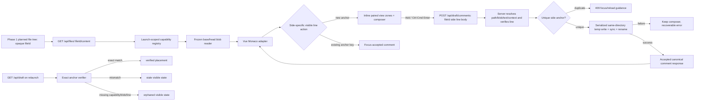

# Phase 2: Anchored Diff Review - Research

**Researched:** 2026-07-11
**Domain:** Immutable Monaco side-by-side diff anchoring, durable local review drafts, and constrained loopback APIs
**Confidence:** HIGH for repository constraints and contract design; MEDIUM for Monaco custom-zone behavior until the mandatory prototype passes

<user_constraints>
## User Constraints (from CONTEXT.md)

### Locked Decisions

### Comment creation interaction
- **D-01:** Hovering or focusing any visible base/head line exposes a gutter comment affordance. A documented keyboard action must open the same composer without requiring a mouse.
- **D-02:** The composer renders inline directly below the anchored line on the selected diff side. Its header shows the repository-relative path, base/head side, and side-specific line number.
- **D-03:** v1 allows one comment per side-specific line. Activating a line that already has a comment focuses that comment instead of creating a duplicate, reply, or thread.
- **D-04:** The reviewer accepts text explicitly with **Add comment** or Ctrl/Cmd+Enter. Blur never submits an unfinished comment.
- **D-05:** Cancel or Escape discards an empty composer immediately and asks for confirmation before discarding non-empty unaccepted text.
- **D-06:** A comment is accepted only after its atomic persistence succeeds. On failure, retain the composer text and anchor in place, show the recoverable error, and do not render the comment as accepted.

### Diff workspace and navigation
- **D-07:** Render one active file diff at a time, selected from the existing changed-file tree. Do not add a stacked-diff mode or layout toggle in v1.
- **D-08:** Collapse unchanged regions by default. Provide controls to reveal bounded context chunks or all remaining context in that region.
- **D-09:** Remember expansion state per file for the open browser session. Navigating to a durable comment must automatically reveal its anchored line before focusing it.
- **D-10:** Provide persistent previous/next controls for files and changes, mirrored by documented, non-conflicting keyboard shortcuts and discoverable tooltips/help.
- **D-11:** Preserve per-file scroll position, focused side/line, expanded context, and active composer while switching files or resizing during the open session.
- **D-12:** Comment identity and placement must derive from immutable blob identity, exact path, side, and side-specific line—not viewport position, rendered row index, or current scroll state.

### the agent's Discretion
- Exact shortcut keys, while keeping them documented, non-conflicting, and available through visible controls.
- Monaco integration details, language mapping, diff options, and lifecycle architecture needed to keep side alignment stable.
- Exact context-chunk size and visual treatment of expand controls.
- Anchor context-window size/hash algorithm, provided the persisted record includes every field required by CMT-02 and never silently relocates an unverifiable anchor.
- Stale/orphan presentation details, provided comments remain visible and actionable as stale/orphaned rather than disappearing or moving.
- Saved-state and resume copy, provided atomic persistence completes before UI confirmation, the same commit pair resumes automatically, and a different pair receives a separate draft.

### Deferred Ideas (OUT OF SCOPE)
- Stacked-file diff and user-toggleable diff layouts remain outside v1.
- Comment threads/replies and multiple independent comments on one side-specific line remain outside v1.
</user_constraints>

<phase_requirements>
## Phase Requirements

| ID | Description | Research Support |
|---|---|---|
| DIFF-02 | Open a supported text file as a read-only side-by-side base/head diff. | One long-lived `IStandaloneDiffEditor`, two immutable side models, `readOnly`, and closed `fileId` content capability. |
| DIFF-03 | Select syntax highlighting from the file path while preserving exact blob text. | Side-specific model URIs/language IDs are presentation metadata; server-returned frozen blob strings are model values and are never reformatted. |
| DIFF-04 | Expand hidden unchanged regions and review revealed context. | Monaco `hideUnchangedRegions` plus mandatory prototype coverage for bounded/all controls and programmatic reveal. |
| DIFF-05 | Previous/next file and previous/next change with documented keyboard controls. | Tree-order file navigation and public `diffEditor.goToDiff('previous'|'next')`, each mirrored by buttons/tooltips/help. |
| DIFF-07 | Preserve anchor placement/alignment across switching, resizing, expansion, and recomputation. | Model-coordinate anchors, editor-owned decorations, paired view zones, saved per-file view state, and recomputation stress tests. |
| CMT-01 | Add one comment to any visible line on either side, including unchanged context. | Side-specific gutter hit-testing/focus action, unique anchor key, one inline composer, and server duplicate rejection. |
| CMT-02 | Persist path, side, line, blob, selected text, nearby context, and context hash. | Server-side anchor builder derives every field from `fileId` plus side/line and frozen object content. |
| CMT-08 | Show stale/orphaned instead of silently relocating an unverifiable comment. | Exact verification state machine returns `verified | stale | orphaned`; it never searches nearby lines or rewrites anchors. |
| DRFT-01 | Persist accepted mutations atomically before confirming success. | Same-directory temp file, sync, close, rename, directory sync where supported, then HTTP success/UI acceptance. |
| DRFT-02 | Resume the repository-local draft for the same pinned comparison. | Deterministic comparison key, `GET /api/draft`, strict versioned JSON validation, and relaunch E2E. |
| DRFT-03 | Separate drafts whenever either pinned comparison commit differs. | Key preimage includes the resolved selected base OID and resolved selected head OID, not merely merge-base/head. |
</phase_requirements>

## Summary

Phase 2 should be planned as three risk-ordered slices: first a disposable-but-production-shaped Monaco stability prototype, then the server-owned anchor/draft contract with fault-injected atomic persistence, then the Vue workspace and packaged relaunch flow. The riskiest behavior is not rendering a diff; it is keeping a side-specific inline zone attached while Monaco hides/reveals unchanged regions, recomputes a diff, swaps models, and lays out after resize. Monaco 0.55.1 exposes original/modified editors, editor-owned decoration collections, view zones, diff-update events, line-change mappings, view-state save/restore, and `goToDiff`, but its public declarations do not expose a selective programmatic “expand this hidden unchanged line” method. [CITED: https://unpkg.com/monaco-editor@0.55.1/monaco.d.ts] The prototype is therefore a release gate, not exploratory polish.

Accepted anchors must be constructed and verified on the server from an opaque launch-scoped `fileId`, requested side, and side-specific model line. The browser must not submit blob IDs, repository paths, object IDs, selected text, or context as authority. The server resolves the frozen side blob/path capability, extracts the exact target line plus three lines before/after, hashes a canonical framed payload, and persists the resulting record only after atomic replacement succeeds. This preserves Phase 1's planned closed-capability boundary and makes CMT-02 independently testable. [VERIFIED: repository planning documents]

Draft identity must be based on the resolved selected **base commit** and resolved selected **head commit**, because DRFT-03 says changing either pinned comparison commit creates a separate draft. A merge-base/head-only key would incorrectly merge two selections whose base commits differ but whose merge base does not. [VERIFIED: `.planning/REQUIREMENTS.md` and `.planning/phases/02-anchored-diff-review/02-CONTEXT.md`]

**Primary recommendation:** Gate all extension work on a real Monaco 0.55.1 prototype that proves paired inline zones, model-coordinate decorations, hidden-context reveal, per-file state restoration, and side alignment under recomputation; then persist only server-derived anchors through one constrained atomic add-comment endpoint.

## Current Repository Reality and Phase 1 Handoff

There is currently no `package.json`, `src/`, `tests/`, Vite config, Vitest config, or Playwright config in the repository. Phase 1 has planning artifacts only and its roadmap status is “Not started.” [VERIFIED: repository glob and `.planning/ROADMAP.md`]

Therefore every Phase 1 filename/interface mentioned below is **tentative planned handoff**, not existing code:

- `src/contracts/comparison.ts` is planned to carry frozen comparison identities, inventory entries, lossless path identities, availability, blob facts, and opaque `fileId` capabilities. [VERIFIED: Phase 1 PLAN artifacts; planned, not implemented]
- `src/server/security.ts`, `src/server/capabilities.ts`, and `src/server/routes.ts` are planned to enforce token/Host/Origin checks and a closed launch-scoped registry. [VERIFIED: `01-06-PLAN.md`; planned, not implemented]
- `src/web/api/client.ts`, `FileTree.vue`, and the App composition are planned browser seams. [VERIFIED: `01-06-PLAN.md` and `01-07-PLAN.md`; planned, not implemented]
- Phase 1 explicitly plans no blob-text route and no Monaco package. Phase 2 must extend the eventual implementation after inspecting what Phase 1 actually produced; it must not code against the plans as though they were compiled contracts. [VERIFIED: `01-06-PLAN.md`, `01-09-PLAN.md`, and absence of source]

The planner should name planned dependencies conditionally: “extend the actual Phase 1 capability/session types (expected handoff: …)” and include a first-task reconciliation check against Phase 1 summaries/source after Phase 1 executes. It must not create a parallel security hook, path representation, inventory DTO, test script, or app factory if Phase 1 implements one. [VERIFIED: project greenfield constraint and all Phase 1 PLAN artifacts]

## Architectural Responsibility Map

| Capability | Primary Tier | Secondary Tier | Rationale |
|---|---|---|---|
| Frozen blob retrieval | API / Backend | Git object storage | Browser supplies only `fileId`; server resolves pre-authorized frozen blobs. [VERIFIED: locked closed-session boundary] |
| Diff rendering/language presentation | Browser / Client | — | Monaco owns visual diff/tokenization over immutable server text. [CITED: https://github.com/microsoft/monaco-editor/blob/main/docs/integrate-esm.md] |
| Gutter action/composer/view state | Browser / Client | — | These are ephemeral interaction states and must survive only the open browser session. [VERIFIED: D-01–D-11] |
| Anchor construction/verification | API / Backend | Git object storage | Server must derive identity-bearing fields from frozen content rather than trust request data. [VERIFIED: CMT-02 and SAFE-03 boundary] |
| Draft identity and atomic persistence | API / Backend | Repository-local filesystem | The server owns comparison identity and write ordering; browser confirmation follows commit. [VERIFIED: DRFT-01–DRFT-03] |
| Stale/orphan presentation | Browser / Client | API / Backend | Backend classifies exact verification; browser renders the state without relocation. [VERIFIED: CMT-08] |

## Standard Stack

### Core

| Library / API | Version | Purpose | Status and rationale |
|---|---:|---|---|
| `monaco-editor` | 0.55.1 | Read-only side-by-side diff, tokenization, decorations, view zones, diff navigation | Add in Phase 2. Current npm version verified; package legitimacy `OK`; no postinstall. [VERIFIED: npm registry and package-legitimacy seam] |
| Vue | Phase 1 proposed 3.5.39 | Workspace state and lifecycle around one imperative Monaco adapter | Locked project stack, but no installed release exists yet. [VERIFIED: PROJECT and Phase 1 plan; planned, not implemented] |
| Vite | Phase 1 proposed 8.1.4 | Browser build and Monaco worker bundling | Locked project stack; reconcile actual Phase 1 version before execution. [VERIFIED: Phase 1 plan; planned, not implemented] |
| Fastify | Phase 1 proposed 5.10.0 | Constrained blob/draft routes and test injection | Locked project stack; reconcile actual Phase 1 version. [VERIFIED: Phase 1 plan; planned, not implemented] |
| Zod | Phase 1 proposed 4.4.3 | Strict shared transport and persisted-draft schemas | Locked project stack; use existing Zod directly rather than introducing a second schema vocabulary. [VERIFIED: PROJECT and Phase 1 plan; planned, not implemented] |
| Node.js | 24; workstation 24.15.0 | SHA-256, UUIDs, serialized writes, same-directory temp/sync/rename | Supported environment in acceptance; locally available. [VERIFIED: `node --version` and REQUIREMENTS acceptance criterion 8] |

### Supporting platform APIs

| API | Purpose | Use |
|---|---|---|
| `ResizeObserver` | Notify Monaco of container size changes | Observe the editor host and call `diffEditor.layout()`; disconnect on unmount. [CITED: https://vuejs.org/api/composition-api-lifecycle.html] |
| Web Crypto / Node `crypto` | IDs and SHA-256 | Generate comment IDs and draft/context hashes; never invent a checksum. [CITED: https://nodejs.org/docs/latest-v24.x/api/crypto.html] |
| Node `fs/promises` | Atomic draft replacement | Open/write/sync/close/rename without deleting canonical draft first. [CITED: https://nodejs.org/docs/latest-v24.x/api/fs.html#filehandlesync] |

### Explicit non-selections

| Do not add | Use instead | Reason |
|---|---|---|
| Vue Monaco wrapper | Direct `monaco-editor` adapter owned by one Vue component/composable | Custom paired zones, side events, model disposal, and recomputation handling require the native API; a wrapper adds lifecycle ambiguity. [CITED: Monaco native declarations] |
| Monaco Vite plugin | Vite worker imports plus `self.MonacoEnvironment.getWorker` | Monaco documents Vite's built-in worker path, so another package is unnecessary. [CITED: https://raw.githubusercontent.com/microsoft/monaco-editor/main/docs/integrate-esm.md] |
| `write-file-atomic` or lockfile package | A small repository-local atomic writer using Node 24 primitives | The required behavior is narrow and must be fault-injected; no cross-process lock is in Phase 2 scope. [VERIFIED: DRFT-01 and deferred multi-tab conflict handling] |
| Fuzzy anchor/rebase library | Exact server verification only | CMT-08 forbids silent relocation; revision reattachment is v2. [VERIFIED: REQUIREMENTS CMT-08 and RV2-08] |
| `@fastify/type-provider-zod` | Existing Zod parse/serialize contracts at route boundaries | The phase needs no additional provider package; Phase 1 may establish route schema conventions that must be reused. [VERIFIED: greenfield scan and Fastify docs] |

**Installation (only after Phase 1 package graph exists and the required human package audit):**

```bash
npm install --save-exact monaco-editor@0.55.1
```

## Package Legitimacy Audit

| Package | Registry | Age / publish signal | Downloads | Source Repo | Verdict | Disposition |
|---|---|---|---:|---|---|---|
| `monaco-editor` | npm | package created 2016; 0.55.1 registry signal 2025-11-20; registry modified 2026-06-26 | 5,740,732/week | `github.com/microsoft/monaco-editor` | OK | Approved after Phase 2's exact-release human audit [VERIFIED: npm registry and package-legitimacy seam] |

**Packages removed due to SLOP:** none. [VERIFIED: package-legitimacy seam]
**Packages flagged SUS:** none. [VERIFIED: package-legitimacy seam]
**Postinstall:** none reported for `monaco-editor`. [VERIFIED: npm registry]

## Architecture Patterns

### System Architecture Diagram



### Recommended project structure

These paths are recommendations, not existing files. Reconcile them with actual Phase 1 output before creation. [VERIFIED: repository scan]

```text
src/
├── contracts/
│   ├── api.ts                 # extend actual closed API schemas
│   └── draft.ts               # versioned persisted and response Zod schemas
├── domain/
│   ├── anchor.ts              # canonical anchor key/hash/verification pure logic
│   └── comparison-key.ts      # base+head draft identity
├── server/
│   ├── draft-store.ts         # load + serialized atomic mutate
│   └── routes.ts              # extend actual Phase 1 capability routes
└── web/
    ├── components/
    │   ├── DiffWorkspace.vue  # owns Monaco host lifecycle
    │   └── CommentComposer.vue
    ├── monaco/
    │   ├── configure.ts       # workers + language mapping
    │   ├── diff-adapter.ts    # models, events, zones, decorations
    │   └── line-mapping.ts    # counterpart zone position from ILineChange[]
    └── model/
        └── workspace-state.ts # session-only per-file state

tests/
├── unit/anchor.test.ts
├── unit/comparison-key.test.ts
├── unit/line-mapping.test.ts
├── api/draft.test.ts
├── api/draft-atomicity.test.ts
├── integration/monaco-anchor.spec.ts
└── e2e/anchored-review.spec.ts
```

### Pattern 1: One long-lived Monaco adapter, explicit model ownership

Create one `IStandaloneDiffEditor` after the Vue host mounts. For each supported file, save the outgoing file state, detach the old diff model, dispose both explicitly-created text models, create new original/modified models with side-specific URIs and language IDs, attach them, wait for `onDidUpdateDiff`, restore the incoming file state, rebuild decorations/zones, and call `layout()`. `setModel` does not dispose models supplied by callers, and view zones are lost when a new model attaches. [CITED: https://unpkg.com/monaco-editor@0.55.1/monaco.d.ts]

Use options equivalent to:

```typescript
// Source: Monaco 0.55.1 public declarations and official ESM integration guide
{
  renderSideBySide: true,
  readOnly: true,
  originalEditable: false,
  glyphMargin: true,
  automaticLayout: false,
  hideUnchangedRegions: {
    enabled: true,
    contextLineCount: 3,
    minimumLineCount: 8,
    revealLineCount: 10
  },
  ariaLabel: `${safePathLabel}: base and head diff`
}
```

Use an explicit `ResizeObserver` rather than `automaticLayout` so the adapter controls when layout happens and the prototype can assert view-state/zone stability around it. [CITED: Monaco construction options and Vue lifecycle docs]

### Pattern 2: Model coordinates are the only UI anchor

Attach each comment to `{fileId, side, line}` in ephemeral UI state and to `{pathIdentity, side, line, blobOid}` in durable state. Use `getOriginalEditor()` or `getModifiedEditor()` based on side. Create a whole-line decoration collection on that editor; never derive identity from a DOM node, pixel offset, rendered row, view-zone ID, or diff hunk row. Decorations are editor/model-owned and automatically clear on model change. [CITED: https://unpkg.com/monaco-editor@0.55.1/monaco.d.ts]

Mouse path: listen on each side editor's `onMouseMove`/`onMouseDown`, accept only targets with a model `position`, and expose/activate the gutter affordance for that side and line. Keyboard path: track the focused side via each editor's focus/cursor events and register one documented action (recommended `Ctrl/Cmd+Shift+M`) that opens/focuses the same anchor. The visible button and keyboard action must call the same `activateAnchor(side, line)` function. [CITED: Monaco public editor event/action API; keyboard choice is agent discretion]

### Pattern 3: Paired view zones preserve side alignment

Render the composer as a view zone immediately after the anchored line on the target editor and insert an equal-height empty spacer zone in the opposite editor. Derive the counterpart insertion boundary from `getLineChanges()`; unchanged lines map by cumulative line delta, while a line inside a changed/deleted/inserted block maps to that block's opposite boundary. Rebuild both zone IDs together after model changes and `onDidUpdateDiff`; a zone ID is lifecycle state, never identity. [CITED: Monaco `changeViewZones`, `getLineChanges`, `ILineChange`, and `onDidUpdateDiff` declarations]

The prototype must reject this mapping if any scenario creates unequal vertical tops after layout. Do not “fix” a failure with private Monaco members or pixel-position persistence. If native custom zones cannot remain aligned, the acceptable locked-decision-preserving fallback is a full-width synchronized row owned immediately below the diff editor's current anchored line only if user-visible testing demonstrates it is directly below both aligned sides; an overlay that obscures text is not acceptable. [VERIFIED: D-02, D-07, D-12]

### Pattern 4: Public unchanged-region behavior only

Set `hideUnchangedRegions.enabled` and rely on Monaco's visible bounded/all reveal controls for manual expansion. Save/restore the complete `IDiffEditorViewState` per `fileId`; its `modelState` is opaque and must be round-tripped, not interpreted. [CITED: Monaco 0.55.1 declarations]

The public 0.55.1 declarations expose the option and serializable view state but no selective “expand region containing line N” method. [CITED: https://unpkg.com/monaco-editor@0.55.1/monaco.d.ts] The prototype must establish whether `revealLineInCenter` expands a hidden line and whether restored `modelState` preserves manual expansions. If it does not, implement `revealDurableAnchor` using only public behavior: temporarily disable `hideUnchangedRegions` for that file, reveal/focus the exact line, and retain the file in an “all context revealed” session state. Do not call undocumented contribution IDs or mutate `modelState`. This is deterministic and satisfies D-09 even if it reveals more context than the minimum. [VERIFIED: locked requirements; implementation behavior pending prototype]

### Pattern 5: Server-derived durable anchor

The add request contains only:

```typescript
const AddCommentRequest = z.object({
  fileId: z.string().min(1).max(256),
  side: z.enum(['base', 'head']),
  line: z.number().int().positive(),
  body: z.string().trim().min(1).max(100_000)
}).strict()
```

After the existing token/Host/Origin guard, the server resolves `fileId`, verifies the requested side exists and is supported text, reads the frozen blob, checks `line <= lineCount`, and derives the following record. Do not accept any of these derived fields in the request. [VERIFIED: SAFE-02/SAFE-03 boundary and CMT-02]

```typescript
type DurableAnchorV1 = {
  path: PathIdentity;            // exact side-specific lossless identity
  safeDisplayPath: string;       // presentation only
  side: 'base' | 'head';
  line: number;                  // 1-based model/source line
  blobOid: string;               // full opaque Git object ID
  selectedText: string;          // entire target line, excluding line terminator
  context: {
    before: Array<{ line: number; text: string }>;
    target: { line: number; text: string };
    after: Array<{ line: number; text: string }>;
  };
  contextHash: {
    algorithm: 'sha256-v1';
    value: string;               // lowercase 64-hex
  };
}
```

Use up to three existing lines before and three after. Hash a byte-framed preimage containing a fixed domain tag, exact decoded path bytes, side, blob OID, decimal line, and every `{line,text}` entry in order; each variable byte field is prefixed by an unsigned 64-bit big-endian byte length. This avoids newline/NUL/delimiter ambiguity and makes the algorithm reproducible. [RECOMMENDATION grounded in CMT-02; Node SHA-256 API cited at https://nodejs.org/docs/latest-v24.x/api/crypto.html]

Use the durable uniqueness key `sha256-v1(pathBytes, side, blobOid, line)`. The browser uses the corresponding server-returned key to focus an existing comment; the server independently rejects a duplicate with `409 ANCHOR_ALREADY_COMMENTED`. [VERIFIED: D-03 and D-12]

### Pattern 6: Versioned comparison-local draft

Recommended canonical location:

```text
.diff-review/drafts/<comparisonKey>.json
```

Compute `comparisonKey = sha256("diff-review-comparison-v1\0" + framed(baseCommitOid) + framed(headCommitOid))`. Store and verify both full OIDs inside the JSON. Do not use labels, refs, merge base alone, file paths, short OIDs, or browser storage. [VERIFIED: DRFT-02/DRFT-03 and immutable-selection constraints]

Recommended Phase 2 schema:

```typescript
type ReviewDraftV1 = {
  schemaVersion: 1;
  comparison: {
    baseCommitOid: string;
    headCommitOid: string;
    mergeBaseOid: string;
  };
  revision: number;
  summary: string; // initialized empty; no Phase 2 summary UI/mutation route
  comments: Array<{
    id: string;
    state: 'open'; // later lifecycle transitions remain Phase 3
    body: string;
    anchor: DurableAnchorV1;
    createdAt: string;
    updatedAt: string;
  }>;
}
```

`revision` is incremented internally now so Phase 3 can add optimistic concurrency without migrating the basic document, but Phase 2 must not claim multi-tab conflict prevention. `summary` is initialized only because final canonical draft requires it; summary editing remains Phase 3. [VERIFIED: Phase boundaries DRFT-04 and CMT-07]

### Pattern 7: Serialized atomic replacement

For each repository/comparison key, serialize mutations through one in-process promise queue. A mutation loads/validates the canonical file or creates the initial draft, applies exactly one operation, validates the complete next document, serializes it, then:

1. `mkdir(.diff-review/drafts, { recursive: true })`.
2. Open a unique temp sibling with `wx` and restrictive mode.
3. Write all bytes, call `FileHandle.sync()`, and close.
4. Rename temp over the canonical path **without deleting or truncating the canonical path first**.
5. Open/sync the containing directory where supported; treat an unsupported directory-sync operation as a documented durability limitation, not permission to expose a partial JSON file.
6. Return the accepted comment only after rename succeeds; cleanup only the temp on failure.

Node 24 exposes the required write/sync/rename primitives. [CITED: https://nodejs.org/docs/latest-v24.x/api/fs.html#filehandlesync and https://nodejs.org/docs/latest-v24.x/api/fs.html#fspromisesrenameoldpath-newpath] The phase must test atomic visibility and old-file preservation through an injected filesystem port; merely spying that `rename` was called is insufficient.

### Pattern 8: Exact stale/orphan state machine

On every draft load, verify stored comparison OIDs against the active pinned comparison, resolve the exact side/path/blob in the frozen capability registry, and recompute the target/context/hash at the stored line. Return a non-persisted presentation result:

| State | Exact condition | UI |
|---|---|---|
| `verified` | comparison, path, side, blob, line, selected text, context entries, and recomputed hash all match | Render at exact model line. |
| `stale` | exact file/side/blob and line are available, but selected text/context/hash do not match | Keep in comment list with recorded anchor details and “Anchor no longer verifies”; do not decorate another line. |
| `orphaned` | exact file/side/blob cannot be resolved, object is unavailable, or stored line is outside the model | Keep in comment list with reason and recorded anchor details; no inline placement. |

Never search nearby lines, choose the “best” hash match, change a line number, or rewrite the persisted anchor during verification. [VERIFIED: CMT-08, D-12, and v2 RV2-08 boundary]

## Constrained Loopback API Contract

Extend the actual Phase 1 route/security implementation rather than registering a second Fastify instance or auth path. Fastify runs `onRequest` before parsing/validation hooks, so the existing exact token/Host/Origin denial should remain the earliest guard. [CITED: https://github.com/fastify/fastify/blob/main/docs/Reference/Hooks.md]

| Method / route | Request authority | Success | Errors |
|---|---|---|---|
| `GET /api/files/:fileId/content` | Opaque registry-issued `fileId` path parameter only | Strict DTO with side existence, side-specific safe path/language hint, full blob OID, and exact supported text | `404` generic unknown capability; `409` unavailable frozen object; never accepts repo/ref/path/blob query fields. |
| `GET /api/draft` | No comparison selector; active session supplies comparison | Strict `DraftView` with comments plus verification status/reason | `404` may mean schema-valid empty draft response instead of capability existence leak; corrupt/unsupported recovery is Phase 3, but Phase 2 still must refuse invalid JSON rather than overwrite it. |
| `POST /api/draft/comments` | Strict `{fileId, side, line, body}` | `201` persisted canonical comment and `revision`, only after atomic replacement | `400` strict validation; `404` generic capability; `409` duplicate/unavailable anchor; `500` recoverable persistence failure with correlation ID. |

No route may accept repository root, ref, commit, merge base, blob OID, filesystem path, draft filename/key, Git options, or export path. Responses must not leak absolute repository paths, token, temp filename, command/stderr, or object lookup detail. [VERIFIED: SAFE-02/SAFE-03 inherited boundary]

Fastify route schemas support body/params/response validation and `inject()` testing. [CITED: https://github.com/fastify/fastify/blob/main/docs/Reference/Validation-and-Serialization.md and https://github.com/fastify/fastify/blob/main/docs/Guides/Testing.md] Use strict Zod schemas for persisted and transport data, and reuse whatever schema compiler convention Phase 1 actually establishes; do not add `@fastify/type-provider-zod` solely for Phase 2.

## Session-only Workspace State

Keep this browser-memory record per opaque `fileId`; never persist it into the repository draft:

```typescript
type FileViewState = {
  diffViewState: monaco.editor.IDiffEditorViewState | null;
  focused: { side: 'base' | 'head'; line: number } | null;
  contextMode: 'collapsed' | 'restored' | 'all-revealed';
  composer: { side: 'base' | 'head'; line: number; text: string } | null;
}
```

Before file switch: snapshot `saveViewState`, focused model position, context mode, and composer. After new models reach `onDidUpdateDiff`: restore, recreate decorations/zones, reveal exact composer line, then focus. Resize must call layout without recreating models or resetting this record. [CITED: Monaco view-state and update-event declarations; D-11]

Recommended shortcuts, all visible in buttons/tooltips and one help panel:

- Previous/next file: `Alt+Shift+[` / `Alt+Shift+]`.
- Previous/next change: `F7` / `Shift+F7`, invoking `goToDiff` (these match Monaco's accessibility guidance). [CITED: https://github.com/microsoft/monaco-editor/wiki/Accessibility-Guide-for-Integrators]
- Open/focus comment composer: `Ctrl/Cmd+Shift+M`.
- Accept: `Ctrl/Cmd+Enter`.
- Cancel: `Escape`, with confirmation for non-empty text.

Test shortcut registration against Monaco/browser reserved behavior on macOS and Chromium before locking the exact keys. [RECOMMENDATION within D-10 discretion]

## Don't Hand-Roll

| Problem | Don't build | Use instead | Why |
|---|---|---|---|
| Diff computation/alignment | Custom LCS or rendered row mapping | Monaco Diff Editor and `ILineChange[]` | The durable anchor is side model identity; diff rows are presentation. [CITED: Monaco API] |
| Syntax grammar | Extension-to-tokenizer implementation | Monaco registered languages plus a small path-to-language-ID table/fallback `plaintext` | Grammar implementation is unrelated and error-prone. [CITED: Monaco API] |
| Anchor relocation | Nearby-text fuzzy search | Exact line/blob/path/context verification | Silent relocation is explicitly forbidden. [VERIFIED: CMT-08] |
| Browser-authoritative anchor | Client-submitted path/blob/text/context/hash | Server resolution from `fileId`, side, line | Prevents tampering and inconsistent anchor records. [VERIFIED: SAFE-03 and CMT-02] |
| Draft identity from labels | Ref names, source labels, merge base, or short IDs | Full resolved base/head OIDs in a domain-separated SHA-256 key | Labels move/collide; either pinned endpoint must isolate drafts. [VERIFIED: DRFT-03] |
| Atomic “save” | Direct `writeFile(canonical)` or delete-then-rename | Same-directory synced temp then rename | Direct writes can expose truncation/partial JSON; deleting first destroys the last good draft. [CITED: Node fs docs; DRFT-01] |
| Monaco lifecycle in Vue templates | Recreate editor on reactive render | One imperative adapter mounted/disposed through Vue lifecycle | Models/zones/listeners otherwise leak or reset. [CITED: Monaco and Vue lifecycle docs] |
| Private Monaco expansion APIs | Contribution IDs/internal view model access | Public options/view state/reveal behavior proven by prototype | Private APIs are not contracts and can break on upgrade. [CITED: public 0.55.1 declarations] |

## Common Pitfalls

### 1. Treating Phase 1 PLAN prose as source
**What goes wrong:** Phase 2 imports files/types/routes that do not exist or duplicates the eventual implementation.  
**Avoidance:** Reconcile against executed Phase 1 summaries and actual source at Phase 2 start; the current repository has planning artifacts only. [VERIFIED: repository scan]

### 2. Confusing original/modified line numbers
**What goes wrong:** A base comment stores the modified line or rename target path.  
**Avoidance:** Side selects both editor model and side-specific path/blob capability. Test asymmetric insertion/deletion and rename fixtures. [VERIFIED: CMT-02/D-12]

### 3. Anchoring to rendered rows or pixels
**What goes wrong:** Comments move after hidden context expands, wrapping changes, resize, or diff recomputation.  
**Avoidance:** Durable identity is side model line plus exact immutable facts; pixels and zone IDs are disposable layout state. [VERIFIED: DIFF-07/D-12]

### 4. One-sided view zone
**What goes wrong:** Adding composer height only to one editor breaks visual alignment.  
**Avoidance:** Add equal paired zones and assert top alignment after every update/layout. [CITED: Monaco view-zone API]

### 5. Assuming `saveViewState()` solves everything
**What goes wrong:** Custom zone DOM, decoration collections, and composer state disappear when models swap.  
**Avoidance:** Save Monaco state plus app state; recreate zones/decorations after `onDidUpdateDiff`. [CITED: Monaco declarations]

### 6. Relying on undocumented hidden-region controls
**What goes wrong:** Automatic comment navigation works in one Monaco patch and fails after upgrade.  
**Avoidance:** Prototype public behavior; if selective reveal is unavailable, use explicit all-context reveal for that file. [CITED: Monaco 0.55.1 public declarations]

### 7. Trusting browser-selected text/context
**What goes wrong:** Persisted anchors can disagree with frozen objects or be forged.  
**Avoidance:** Server derives all CMT-02 fields from the frozen capability. [VERIFIED: SAFE-03 and CMT-02]

### 8. Using merge-base/head as the draft key
**What goes wrong:** Two different selected base commits with the same merge base resume the same draft.  
**Avoidance:** Key on full selected base and selected head OIDs; store and verify both. [VERIFIED: DRFT-03]

### 9. Returning success before rename
**What goes wrong:** UI renders an accepted comment that vanishes after relaunch.  
**Avoidance:** Only a completed atomic replacement unlocks the `201` response; retain composer on all failures. [VERIFIED: D-06/DRFT-01]

### 10. Delete-then-rename
**What goes wrong:** Failure between operations loses the last good draft.  
**Avoidance:** Rename over the destination directly; cleanup temp only. [CITED: Node fs rename API]

### 11. Silently “repairing” stale anchors
**What goes wrong:** Review feedback attaches to similar but wrong code.  
**Avoidance:** Exact three-state verifier, visible recorded details, zero relocation. [VERIFIED: CMT-08]

### 12. Losing active composer on file switch
**What goes wrong:** Unaccepted text disappears or submits on blur.  
**Avoidance:** Store one per-file composer draft in browser memory; blur never submits; explicit cancel policy applies. [VERIFIED: D-04/D-05/D-11]

### 13. Model/worker/listener leaks
**What goes wrong:** Switching files grows workers/models and duplicate event handlers.  
**Avoidance:** One Monaco environment, one diff editor, explicit model/collection/listener/observer disposal; stress-switch test checks model count returns to two. [CITED: Monaco/Vue lifecycle docs]

### 14. EOL and no-final-newline assumptions
**What goes wrong:** Hashes or selected text are derived from normalized browser content rather than the frozen server representation.  
**Avoidance:** Define line splitting once on the server, include exact line strings excluding terminators, preserve no-final-newline metadata in content DTO, and test LF, CRLF, mixed EOL, empty file, blank final line, and no final newline. [RECOMMENDATION grounded in DIFF-03/CMT-02]

## Mandatory Monaco Stability Prototype Gate

The first implementation slice must use real Monaco 0.55.1 in Chromium and production-shaped Vue lifecycle code. It passes only if all of these are demonstrated:

1. Base and head comments on unchanged, inserted, changed, and deleted lines remain on the same side-specific model line.
2. A revealed context line accepts a comment; collapse/reveal does not relocate it.
3. Paired composer zones remain vertically aligned after add/remove, text growth, `layout()`, viewport resizing, file switch, view-state restore, and at least ten forced diff recomputations/model swaps.
4. `onDidUpdateDiff` reconstruction does not duplicate decorations, zones, listeners, or composers.
5. Manual bounded/all unchanged-region controls work; programmatic navigation to a hidden durable comment either reveals the exact region publicly or switches the file to explicit all-context mode.
6. Previous/next change invokes public `goToDiff`; previous/next file follows deterministic file-tree order.
7. Switching A→B→A restores scroll, focus side/line, expansion mode, and non-empty unaccepted composer without submitting it.
8. Repeated file switching leaves exactly the active two text models plus any documented global Monaco models; disposed file URIs do not accumulate.
9. Keyboard and pointer paths call the same activation logic and a duplicate anchor focuses instead of creating a second composer/comment.
10. The adapter uses no Monaco property absent from the published 0.55.1 declarations.

Failure blocks extension of the full workspace. The planner must not schedule broad UI integration before this gate. [VERIFIED: Roadmap success criterion 3 and D-07]

## Validation Architecture and Test Layers

`.planning/config.json` sets `workflow.nyquist_validation` to `false`, so GSD's automatic Nyquist section would normally be omitted; the user acceptance explicitly requires validation architecture, and the project requires focused unit, Git-fixture, API, and packaged Playwright evidence. This section is therefore intentionally included. [VERIFIED: config and REQUIREMENTS acceptance criterion 8]

No test infrastructure exists today. All commands below are expected Phase 1 handoffs and must be reconciled against actual scripts after Phase 1 executes. [VERIFIED: repository scan]

### Layer 1 — Pure unit contracts (fast, deterministic)

| File | Behaviors |
|---|---|
| `tests/unit/comparison-key.test.ts` | base/head order sensitivity; either OID changes key; same pair stable; merge-base-only change does not define identity; opaque SHA-1/SHA-256-length OIDs. |
| `tests/unit/anchor.test.ts` | base/head side path selection, first/last/empty/blank lines, 3-line boundary context, UTF-8/CRLF/no-final-newline, framed hash determinism, uniqueness key, exact stale/orphan classification, no fuzzy relocation. |
| `tests/unit/line-mapping.test.ts` | unchanged offsets, insertion/deletion/change blocks, first/last lines, counterpart zone boundary mapping. |
| `tests/unit/workspace-state.test.ts` | A→B→A state, composer retention, duplicate focus, cancel confirmation transitions, persistence-success-only acceptance reducer. |

Suggested focused command: `npm run test:unit -- tests/unit/anchor.test.ts tests/unit/comparison-key.test.ts tests/unit/line-mapping.test.ts tests/unit/workspace-state.test.ts` (tentative until Phase 1 scripts exist). [VERIFIED: Phase 1 planned Vitest convention; planned, not implemented]

### Layer 2 — Monaco browser integration prototype

Use Playwright component/browser harness or a dedicated Vite page with **real Monaco**, never a mocked editor. Assert model positions and DOM top alignment, native hidden-context controls, keyboard actions, view-state restoration, model disposal, and recomputation behavior from the mandatory gate. Capture side/line and bounding-top diagnostics on failure. A jsdom unit test cannot establish Monaco layout correctness. [CITED: Monaco browser editor architecture]

Suggested focused command: `npm run test:browser -- tests/integration/monaco-anchor.spec.ts` (Wave 0 if Phase 1 lacks a browser-integration script).

### Layer 3 — Fastify API and filesystem fault injection

Use `fastify.inject()` for:

- valid/invalid strict request bodies and side/line bounds;
- token, Host, Origin, unknown capability, arbitrary authority fields, route/method denial, and zero blob/draft work before auth;
- server-derived path/blob/text/context/hash despite forged extra fields;
- duplicate anchor `409`;
- same-pair resume and either-endpoint isolation;
- malformed existing JSON preservation (even though full recovery UX is Phase 3);
- fault after temp open, during write, sync, close, rename, and directory sync;
- prior canonical file remains byte-identical on every pre-rename/rename failure;
- no `201` until rename resolves;
- two near-simultaneous adds serialize and both survive without claiming Phase 3 stale-revision handling.

Fastify officially recommends `inject()` and closing the app after tests. [CITED: https://github.com/fastify/fastify/blob/main/docs/Guides/Testing.md]

Suggested focused command: `npm run test:api -- tests/api/draft.test.ts tests/api/draft-atomicity.test.ts` (tentative).

### Layer 4 — Real Git object integration

Disposable repositories should create modified, added, deleted, renamed, and context-only lines, independently query base/head/merge-base/blob OIDs with native Git, and prove the content/anchor service uses those frozen objects after worktree and refs change. Include unusual lossless paths from Phase 1's planned fixtures. Verify base comments use old path/blob and head comments use new path/blob for a rename. [VERIFIED: Phase 1 immutable-object requirements and Phase 2 CMT-02]

Suggested focused command: `npm run test:git -- tests/git/anchored-content.test.ts` (tentative).

### Layer 5 — Packaged Playwright relaunch acceptance

Through the generated production CLI/server/assets—not a Vite dev server or fake DTO:

1. Launch pair A/B, select supported text, verify exact read-only syntax-highlighted side-by-side content.
2. Reveal unchanged context; add one base and one head comment via pointer/keyboard; exercise failure retention then successful acceptance.
3. Switch/resize/expand and verify side/line placement and alignment.
4. Close browser/server, relaunch A/B, verify both comments and exact anchor records resume.
5. Launch A/C and verify an empty separate draft; relaunch A/B and verify original comments remain.
6. Seed exact stale and orphan fixtures through the store test seam before launch; verify visible states and absence of relocated inline markers.
7. Verify unauthenticated/cross-origin/arbitrary-path mutation and content reads fail.

Suggested focused command: `npm run test:package -- tests/e2e/anchored-review.spec.ts` (tentative).

### Requirement-to-test map

| Requirement | Primary automated proof | Release-boundary proof |
|---|---|---|
| DIFF-02/03 | Monaco integration exact models/language/read-only | Packaged browser |
| DIFF-04/07 | Mandatory Monaco expansion/alignment stress | Packaged switch/resize/reveal |
| DIFF-05 | adapter action tests | visible buttons/tooltips + keyboard E2E |
| CMT-01 | workspace reducer + Monaco side events | base/head/context browser comments |
| CMT-02 | pure server anchor fixtures + real Git blobs | persisted JSON inspection against independent Git |
| CMT-08 | exact verifier unit matrix | stale/orphan browser fixture |
| DRFT-01 | filesystem fault injection | failed save retained then successful relaunch |
| DRFT-02 | API store reload | packaged same-pair relaunch |
| DRFT-03 | comparison-key unit matrix | packaged different-pair isolation |

### Phase gate

Run only touched focused suites during development. Before Phase 2 verification, run the Phase 2 unit, Monaco browser integration, API atomicity, Git anchor, and packaged anchored-review files—**not** formatters, linters, or project-wide tests. [VERIFIED: user scope constraint]

## Security Domain

Security enforcement is enabled at ASVS level 1. [VERIFIED: `.planning/config.json`]

### Applicable ASVS categories

| ASVS category | Applies | Phase 2 control |
|---|---|---|
| V2 Authentication | yes, local session capability | Reuse Phase 1 planned high-entropy in-memory Bearer token; no new auth mechanism. [VERIFIED: Phase 1 context/plans; planned] |
| V3 Session Management | yes, launch-scoped process | Exact Host and absent-or-exact Origin plus token; shutdown expires capability. [VERIFIED: SAFE-02] |
| V4 Access Control | yes | Opaque `fileId`; server-owned active comparison/draft key; no request-selected repo/ref/object/path. [VERIFIED: SAFE-03] |
| V5 Input Validation | yes | Strict Zod request/persisted/response schemas, positive bounded line/body, reject unknown keys. [VERIFIED: locked Zod stack] |
| V6 Cryptography | yes | Node SHA-256 and cryptographic UUID/random bytes; no custom hash primitive. [CITED: Node crypto docs] |
| V8 Data Protection | yes | Do not log comment bodies/blob text/tokens; repository-local restrictive files; generic browser errors. [VERIFIED: local safety boundary] |
| V12 Files and Resources | yes | Fixed `.diff-review/drafts` root, server-computed hex filename, `wx` temp, no client path. [VERIFIED: SAFE-03] |
| V13 API | yes | Closed three-route addition, method allowlist, strict schemas, response schemas, auth before object/store work. [CITED: Fastify validation/hooks docs] |

### Threat patterns

| Pattern | STRIDE | Mitigation |
|---|---|---|
| Forged anchor fields | Tampering | Request cannot carry durable fields; server derives them from capability. |
| Path traversal/draft-key injection | Elevation / Disclosure | No browser path/key grammar; server computes fixed hex key under canonical root. |
| Partial/truncated draft | Tampering / DoS | Temp-sync-rename and prior-file preservation with fault-injected proof. |
| Duplicate/double submit | Tampering | Disabled pending UI, serialized server mutation, uniqueness key, `409`. |
| Cross-origin local attack | Spoofing / CSRF | Existing token + exact Host + Origin guard before handler work. |
| Oversized comment/request | DoS | Fastify body limit plus Zod maximum; bounded content already Phase 1 policy. |
| Stale anchor spoof/relocation | Tampering | Full exact verifier; no search or rewrite. |
| Temp-file symlink/collision | Elevation | Random server filename, same trusted directory, open `wx`, no client naming. |

## Environment Availability

| Dependency | Required by | Available | Version | Fallback |
|---|---|---:|---:|---|
| Node.js | server, crypto, filesystem | yes | 24.15.0 | none needed [VERIFIED: local command] |
| npm | exact Monaco install | yes | 11.12.1 | none needed [VERIFIED: local command] |
| `monaco-editor` | Phase 2 workspace | not installed; no package graph exists | registry 0.55.1 | install only after audit [VERIFIED: repository scan/npm registry] |
| Chromium/Playwright | layout and packaged tests | unknown until Phase 1 executes | — | Phase 1 planned deterministic prerequisite; Phase 2 must recheck [VERIFIED: Phase 1 plans; planned] |
| Phase 1 source/contracts | all integration | not implemented | — | blocking dependency; execute Phase 1 first [VERIFIED: repository scan/roadmap] |

**Blocking dependency:** Phase 1 must execute and establish the actual package graph, capability/session contracts, object reader, browser entry, and focused test scripts before Phase 2 implementation. [VERIFIED: roadmap dependency and current repository state]

## Open Questions / Prototype Decisions

1. **Does Monaco 0.55.1 publicly reveal a hidden line when `revealLineInCenter` is called?**
   - Known: the declarations expose hidden-region options and reveal-line methods but no selective expansion method. [CITED: Monaco declarations]
   - Resolution: mandatory prototype. If no, use explicit per-file all-context mode during durable-comment navigation.
2. **Does `IDiffEditorViewState.modelState` preserve manual hidden-region expansion across model detach/reattach with recreated model URIs?**
   - Known: `modelState` is public but typed `unknown`. [CITED: Monaco declarations]
   - Resolution: round-trip opaquely and test; never inspect/mutate it.
3. **Can paired custom view zones remain exactly aligned through all insertion/deletion shapes and wraps?**
   - Known: public zone and line-change APIs exist. [CITED: Monaco declarations]
   - Resolution: prototype gate; do not proceed on visual drift.
4. **What actual Phase 1 interfaces and scripts exist at execution time?**
   - Known: only plans exist now. [VERIFIED: repository scan]
   - Resolution: first Phase 2 task reconciles actual implementation and updates references without inventing a parallel convention.

## Assumptions Log

| # | Claim | Section | Risk if wrong |
|---|---|---|---|
| — | No unverified product or library claim is being locked. Monaco behaviors not guaranteed by public declarations are explicit prototype questions rather than assumptions. | Open Questions | Planner must keep the prototype as a blocking gate. |

## Sources

### Primary repository sources (HIGH confidence)
- `.planning/PROJECT.md` — locked stack, immutable committed-object review, repository-local versioned JSON.
- `.planning/REQUIREMENTS.md` — DIFF-02–05/07, CMT-01/02/08, DRFT-01–03 and acceptance.
- `.planning/ROADMAP.md` — Phase 2 goal, dependency, Monaco stability gate, status.
- `.planning/phases/02-anchored-diff-review/02-CONTEXT.md` — all locked interaction/workspace/persistence decisions.
- `.planning/phases/01-pinned-local-comparison/01-CONTEXT.md` and every `01-01-PLAN.md` through `01-09-PLAN.md` — tentative handoff only.
- Repository glob — no product/test/package source exists.

### Official technical sources (MEDIUM confidence from classification seam)
- https://unpkg.com/monaco-editor@0.55.1/monaco.d.ts — published API declarations for diff editors, side editors, decorations, view zones, view state, line changes, hidden regions, navigation, and lifecycle.
- https://raw.githubusercontent.com/microsoft/monaco-editor/main/docs/integrate-esm.md — official ESM/Vite worker integration.
- https://github.com/microsoft/monaco-editor/wiki/Accessibility-Guide-for-Integrators — diff navigation and accessibility.
- https://vuejs.org/api/composition-api-lifecycle.html — imperative integration lifecycle.
- https://github.com/fastify/fastify/blob/main/docs/Reference/Validation-and-Serialization.md — route validation/serialization.
- https://github.com/fastify/fastify/blob/main/docs/Reference/Hooks.md — authorization hook order.
- https://github.com/fastify/fastify/blob/main/docs/Guides/Testing.md — `inject()` testing.
- https://nodejs.org/docs/latest-v24.x/api/fs.html — file sync/rename primitives.
- https://nodejs.org/docs/latest-v24.x/api/crypto.html — SHA-256/random ID primitives.

### Registry evidence
- npm registry: `monaco-editor@0.55.1`, repository metadata, no postinstall.
- GSD package-legitimacy seam: `monaco-editor` verdict `OK`.

## Metadata

**Confidence breakdown:**
- User constraints / requirements: HIGH — direct repository planning sources.
- Current implementation state: HIGH — direct repository scan confirms no source/package/test artifacts.
- Durable contract / API / atomic store: HIGH — derived directly from locked requirements using documented Node/Fastify primitives.
- Monaco public API surface: MEDIUM — current published declarations and official docs.
- Monaco zone/hidden-context runtime stability: MEDIUM until the blocking real-browser prototype passes.

**Research date:** 2026-07-11
**Valid until:** 2026-08-10 for architecture; re-verify Monaco/npm versions immediately before install.
