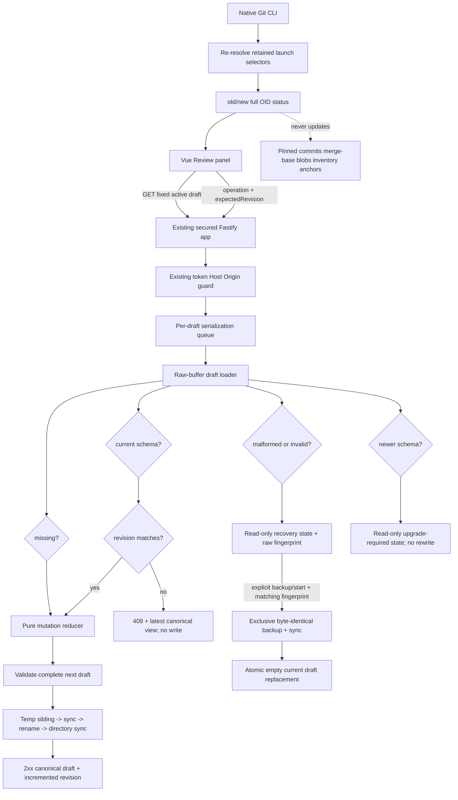

# Phase 3: Complete Review Draft - Research

**Researched:** 2026-07-11
**Domain:** Revision-checked repository-local review drafts, comment/summary lifecycle, corrupt-state recovery, and pinned-selector drift
**Confidence:** HIGH for project contracts and recommended architecture; MEDIUM for official-library integration details; LOW only where explicitly logged as an assumption

<user_constraints>
## User Constraints (from CONTEXT.md)

### Locked Decisions

### Comment lifecycle and review panel
- **D-01:** Use a toggleable review panel grouped by exact repository-relative file path. Show open comments first and resolved comments in a collapsed section, with separate open/resolved counts.
- **D-02:** Every listed comment provides jump-to-anchor. Navigation selects the file, reveals collapsed context, restores the correct side/line, and focuses the comment without relocating its anchor.
- **D-03:** Edit accepted comments inline at the revealed anchor using the same anchored composer model. Save explicitly; cancellation or persistence failure retains the prior accepted text.
- **D-04:** Delete only after confirmation showing path, side, line, and comment preview. Atomically remove the comment, update counts, and focus the next logical comment.
- **D-05:** Do not add soft-delete tombstones, undo history, threads, or replies in v1.
- **D-06:** Resolve and reopen through atomic state mutations. Resolved comments remain grouped by file with jump, edit, and reopen actions.

### Overall summary experience
- **D-07:** Place one persistent, collapsible Summary section at the top of the review panel above grouped comments.
- **D-08:** Store the canonical summary as Markdown text and provide edit/preview modes. Phase 4 must derive `review.md` from this same canonical source rather than a separate rich-text model.
- **D-09:** Accept summary edits only through explicit **Save summary** or Ctrl/Cmd+Enter. Show saved/unsaved state and perform one atomic revision-checked write.
- **D-10:** On persistence failure or conflict, retain unsaved summary text locally and keep canonical accepted state unchanged.
- **D-11:** The summary is optional. Empty is valid, displays as **No summary yet**, and never blocks comment work or export.

### Conflicts and corrupt drafts
- **D-12:** Use one monotonically increasing revision for the entire draft. Every accepted comment or summary mutation supplies the client's last-seen revision.
- **D-13:** The server atomically applies a matching mutation and increments the revision; a stale revision returns an explicit conflict with the latest canonical state and does not write.
- **D-14:** On conflict, preserve attempted text locally, explain what changed, and offer **Reload latest**. Do not auto-merge or expose a force-overwrite path.
- **D-15:** If draft JSON is malformed or schema-invalid, preserve the original file byte-for-byte, disable mutations, and show a read-only recovery screen with repository-relative path and validation details.
- **D-16:** Recovery may offer reveal/copy plus an explicit **Back up and start new** action. That action must create a preserved backup before creating a replacement and must never silently overwrite the original.
- **D-17:** A valid draft with a newer unsupported schema remains unchanged and read-only. Identify the unsupported version and require upgrading Diff Review; never attempt downgrade or best-effort rewrite.

### the agent's Discretion
- Exact review-panel sizing, badges, and comment ordering within each open/resolved group.
- Exact conflict comparison copy and how much canonical change detail to show, while avoiding sensitive absolute paths.
- Backup filename convention for explicit corrupt-draft recovery, provided it is deterministic/collision-safe and the original bytes remain recoverable.
- Selector-drift presentation. It must identify which selected source moved and old/new full commit IDs, keep the open review pinned, forbid silent refresh, and offer only an explicit path to launch a new comparison.

### Deferred Ideas (OUT OF SCOPE)
- Soft-delete/undo history, automatic conflict merge, force overwrite, comment threads, and generated summaries remain outside v1.
</user_constraints>

<phase_requirements>
## Phase Requirements

| ID | Description | Research Support |
|---|---|---|
| CMT-03 | User can edit an existing comment. | One revision-checked `editComment` operation, separate accepted and attempted text, and reuse of the planned anchored composer/navigation adapter. |
| CMT-04 | User can delete an existing comment. | Confirmed hard delete through the same serialized whole-draft mutation, derived count refresh, and deterministic successor focus. |
| CMT-05 | User can resolve and reopen an existing comment. | Explicit open/resolved state transitions with no-op rejection, `updatedAt`/`resolvedAt` handling, and one revision increment per accepted transition. |
| CMT-06 | User can see open and resolved counts and jump from a comment list to its anchored line. | Derived counts/group projections plus a no-relocation navigation command that selects the file, reveals context, restores side/line, and focuses the comment. |
| CMT-07 | User can write and edit one overall review summary. | Canonical Markdown string, local edit buffer, safe preview renderer, and explicit revision-checked summary mutation. |
| DRFT-04 | User cannot unknowingly overwrite newer review state from another browser tab. | One whole-draft revision precondition inside the serialized repository mutation; explicit `409 revision_conflict` returns latest canonical state and writes nothing. |
| DRFT-05 | User receives a recoverable error when a draft is corrupt or uses an unsupported schema; the existing file is preserved. | Raw-buffer-first loader state machine, mutation lockout, byte-preserving backup handshake, and distinct newer-version read-only state. |
| DRFT-06 | User's open review remains pinned if a selected branch or worktree advances and visibly reports selector drift. | Read-only re-resolution of retained launch selectors compared with launch-time OIDs; drift never replaces pinned commits, blobs, merge base, inventory, draft identity, or anchors. |
</phase_requirements>

## Summary

Phase 3 should extend the future Phase 2 draft repository through **one mutation gateway**, not add route-specific writers. Every accepted add/edit/delete/resolve/reopen/summary operation must enter the same per-draft serialization queue, load a current schema-valid document, compare the request's `expectedRevision` with the canonical whole-draft revision, apply exactly one operation in memory, increment once, validate the complete next document, and atomically replace the file before returning success. A mismatch returns an explicit conflict containing the latest canonical draft view and performs no write. This makes the revision an aggregate compare-and-swap token rather than a per-comment counter. [RECOMMENDATION grounded in D-12–D-14, DRFT-01, and DRFT-04]

Draft loading must begin with bytes, not `JSON.parse` followed by a default-on-error catch. The loader should return a discriminated state: `missing`, `current`, `malformed`, `schemaInvalid`, or `newerUnsupported`. Only `missing` and `current` permit normal mutations. Corrupt states retain the original `Buffer`, a SHA-256 recovery fingerprint, repository-relative path, and bounded validation details. Newer schema versions are recognized from a minimal envelope and remain untouched/read-only. Explicit corrupt recovery rechecks the fingerprint under the same mutation queue, creates and syncs a byte-identical exclusive backup first, and only then atomically creates a new current-version draft. [RECOMMENDATION grounded in D-15–D-17 and DRFT-05; filesystem primitives cited at https://nodejs.org/docs/latest-v24.x/api/fs.html]

The browser should maintain canonical server state separately from unsaved edit buffers. Comment and summary preview/edit state is never the authoritative draft. A failed write or `409` leaves the attempted buffer intact; only an accepted response replaces canonical state and clears the corresponding buffer. Selector drift is a separate read-only session projection: re-resolve the retained typed base/head source descriptors, compare full OIDs with launch-time OIDs, and display any movement while all comparison capabilities continue serving launch-pinned objects. [RECOMMENDATION grounded in D-02, D-10, D-14, DRFT-06, SAFE-03, and Vue reactivity guidance at https://vuejs.org/guide/essentials/reactivity-fundamentals.html]

**Primary recommendation:** Plan two vertical slices: (1) the aggregate draft repository/loader/mutation/conflict/recovery contracts with focused repository and API tests, then (2) the grouped review/summary UI plus read-only selector-drift service and packaged browser-flow tests; retrofit Phase 2's planned comment-add route through the same revision gateway before any Phase 3 UI mutation is exposed. [RECOMMENDATION]

## Architectural Responsibility Map

| Capability | Primary Tier | Secondary Tier | Rationale |
|---|---|---|---|
| Canonical draft validation and load classification | API / Backend | Repository-local storage | The server owns bytes, schema interpretation, supported-version policy, and mutation availability. Browser state cannot repair or reinterpret disk data. [VERIFIED: D-15–D-17] |
| Whole-draft revision compare-and-swap | API / Backend | Repository-local storage | The precondition must be checked inside the same serialization boundary as the atomic replacement; a UI-only check races. [VERIFIED: D-12–D-14, DRFT-04] |
| Comment and summary mutation semantics | Domain / Application | API / Backend | Pure operations validate IDs/transitions/text and construct a complete next draft; the route only authenticates, parses, invokes, and maps results. [RECOMMENDATION grounded in DRFT-01/04] |
| Grouped counts and ordering | Browser / Client | Shared pure selectors | Counts/groups are projections of canonical comments and must not be persisted as a second source of truth. [RECOMMENDATION grounded in D-01 and D-04] |
| Jump-to-anchor and inline edit placement | Browser / Client | Planned Phase 2 Monaco adapter | Navigation changes file/context/focus state only; durable path/blob/side/line anchors remain immutable. [VERIFIED: D-02–D-03 and Phase 2 D-09/D-12] |
| Markdown summary preview | Browser / Client | Safe Markdown parser | Preview renders the local edit buffer; canonical summary changes only after accepted persistence. Raw HTML stays disabled. [RECOMMENDATION grounded in D-08–D-10] |
| Corrupt-draft backup/replacement | API / Backend | Repository-local storage | Fixed launch-owned draft paths and raw byte operations preserve the original without browser-supplied filesystem authority. [VERIFIED: D-15–D-16, SAFE-03] |
| Selector drift detection | API / Backend | Native Git CLI | Only the server holds trusted launch-time selector descriptors and repository authority; browser receives a bounded projection. [VERIFIED: DRFT-06, SAFE-03] |
| Drift warning and explicit next-comparison path | Browser / Client | CLI/session lifecycle | UI reports old/new full identities but cannot silently refresh or supply arbitrary refs. [VERIFIED: D-17 discretion item and DRFT-06] |

## Repository Reality and Planned Handoffs

There is no source tree, package manifest, test configuration, or implemented Phase 1/2 product in the repository at research time. Phase 1 and Phase 2 are planning contracts only. Their proposed files, routes, types, versions, and behavior are **future handoffs**, not established implementation patterns. Phase 3 execution must begin by reconciling these expected seams against the actual outputs and execution summaries of Phases 1 and 2. [VERIFIED: repository glob, `.planning/ROADMAP.md`, `.planning/STATE.md`, Phase 3 context]

Expected Phase 1 planned contracts are a single TypeScript application, strict Zod DTOs, Fastify security hooks, an opaque launch-scoped capability registry, immutable comparison identities, exact/lossless path identities, and Vue API composition. Expected paths include `src/contracts/api.ts`, `src/contracts/comparison.ts`, `src/server/app.ts`, `src/server/security.ts`, `src/server/capabilities.ts`, `src/server/routes.ts`, and `src/web/api/client.ts`; these names are conditional until Phase 1 exists. [VERIFIED: Phase 1 PLAN artifacts; planned, not implemented]

Expected Phase 2 planned contracts are a server-derived `DurableAnchorV1`, a comparison-keyed `ReviewDraftV1`, `GET /api/draft`, comment creation through an opaque `{fileId, side, line, body}` request, same-directory atomic replacement, exact `verified | stale | orphaned` presentation, one long-lived Monaco adapter, per-file view state, paired inline zones, and comment navigation that reveals context without relocation. Phase 2 research proposes `schemaVersion: 1`, `revision`, `summary`, and comments with open state from the beginning, specifically to avoid a Phase 3 file migration; this remains a planned contract. [VERIFIED: `.planning/phases/02-anchored-diff-review/02-RESEARCH.md`; planned, not implemented]

Expected Phase 2 UI geometry is a 320px wide comments rail at wide viewports and a non-modal right drawer at narrower viewports. Phase 3 should turn that existing surface into the toggleable Review panel rather than add a fourth workspace region. The planned `Comments` control and responsive drawer behavior are contracts to reconcile, not source already available. [VERIFIED: `.planning/phases/02-anchored-diff-review/02-UI-SPEC.md`; planned, not implemented]

### Integration rule

The Phase 3 planner should phrase every prerequisite as “extend the actual Phase 1/2 implementation (expected handoff: …)” and include an initial reconciliation action. It must not create a second Fastify app, security hook, capability registry, path type, Monaco adapter, draft writer, canonical comment index, or parallel schema vocabulary. [RECOMMENDATION grounded in the greenfield phase ordering]

## Decision Coverage Matrix

| Decision | Concrete planning consequence | Required proof artifact |
|---|---|---|
| D-01 | Toggleable Review panel; exact path-identity groups; open groups before one collapsed resolved section; separate derived counts. | Component test and packaged screenshot/DOM assertions for grouping, count changes, and collapsed resolved state. |
| D-02 | One navigation command selects file, reveals all context if necessary, restores exact side/model line, then focuses comment; no anchor write. | Real Monaco browser test asserting persisted anchor bytes/line unchanged before and after navigation. |
| D-03 | Reopen planned Phase 2 anchored composer populated from accepted text; explicit save/cancel; canonical text remains visible on failure. | Browser and API tests for save, cancel, filesystem failure, and stale revision with attempted text retained. |
| D-04 | Confirmation includes safe repository-relative path, side, line, preview; accepted hard delete increments revision once; focus deterministic successor. | Component/API tests for cancel/no write, accepted delete, counts, revision, and next/previous/panel fallback focus. |
| D-05 | No deleted records, tombstones, histories, reply arrays, parent IDs, or undo endpoints. | Strict draft schema and route-surface assertion. |
| D-06 | `resolveComment` and `reopenComment` are explicit legal transitions; resolved records retain anchors/body and remain navigable/editable. | Unit transition table plus grouped UI flow. |
| D-07 | Summary is first region inside Review panel and retains collapse state in browser memory only. | Component keyboard/focus test. |
| D-08 | One canonical Markdown string; preview derives directly from saved or local edit buffer; no rich-text AST persisted. | Schema assertion and preview rendering test; Phase 4 remains unimplemented. |
| D-09 | Save button and Ctrl/Cmd+Enter call the same operation; blur does not save; saved/unsaved status reflects buffer equality and request state. | Component/Playwright input tests. |
| D-10 | Canonical summary and local summary buffer are separate; failure/conflict never replaces the buffer. | Injected persistence failure and two-tab conflict browser tests. |
| D-11 | Exact empty string is schema-valid and renders `No summary yet`; comments remain enabled. | Unit/component test and relaunch flow. |
| D-12 | All add/edit/delete/resolve/reopen/summary operations require the one current aggregate revision. | Shared request schema tests and route-surface tests, including retrofit of add comment. |
| D-13 | Compare revision after serialized load and before operation; accepted operation increments exactly once; stale operation writes zero bytes. | Concurrent API test plus before/after file hash/revision assertions. |
| D-14 | `409 revision_conflict` carries latest canonical state; local attempted text remains; only `Reload latest` adopts latest state; no force/merge route. | Two-page Playwright test and API response-schema test. |
| D-15 | Malformed/current-schema-invalid files preserve raw bytes, return read-only recovery view, and reject every mutation. | Byte-for-byte fixtures and route denial tests. |
| D-16 | Explicit recovery rechecks fingerprint, creates durable byte-identical backup first, then atomically installs empty current draft; reveal/copy use fixed path only. | Fault injection at every backup/replacement step plus hash/byte equality tests. |
| D-17 | Recognizable version greater than supported returns newer-version state with version number; file remains byte-identical; no reset action. | Newer-version fixture and full mutation/recovery route denial tests. |

## Standard Stack

### Core (reuse actual installed Phase 1/2 versions)

| Library / API | Planned version | Purpose | Phase 3 guidance |
|---|---:|---|---|
| Node.js | 24 LTS | Buffer-first loading, SHA-256 fingerprinting, exclusive backup files, sync, rename | Reuse platform primitives; no database, lockfile, or atomic-write package. [VERIFIED: `.planning/PROJECT.md`; APIs cited at https://nodejs.org/docs/latest-v24.x/api/fs.html] |
| TypeScript | Phase 1 proposed 7.0.2 | Exhaustive discriminated loader/mutation/result states | Reconcile actual installed version; make state switches exhaustive. [VERIFIED: Phase 1 PLAN artifacts; planned, not implemented] |
| Fastify | Phase 1 proposed 5.10.0 | Authenticated bounded draft/drift/recovery routes and `fastify.inject()` tests | Extend the actual secured app and explicitly schema `409` responses. [VERIFIED: Phase 1 PLAN artifacts; planned, not implemented; route response schemas cited at https://fastify.dev/docs/latest/Reference/Routes/] |
| Zod | Phase 1 proposed 4.4.3 | Strict request, response, current draft, and recovery state contracts | Use `safeParse` only after JSON syntax and version-envelope classification; do not duplicate TypeScript interfaces. [VERIFIED: Phase 1/2 plans; `safeParse` cited at https://zod.dev/basics] |
| Vue | Phase 1 proposed 3.5.39 | Canonical state, local attempted buffers, grouped projections, explicit interaction state | Separate refs/composables for canonical draft and editing buffers. [VERIFIED: Phase 1 plans; Composition API `ref` cited at https://vuejs.org/guide/essentials/reactivity-fundamentals.html] |
| Monaco Editor | Phase 2 proposed 0.55.1 | Existing exact-anchor reveal/focus and anchored inline editor | Do not change durable anchor semantics or create a second editor integration. [VERIFIED: Phase 2 research; planned, not implemented] |
| Vitest / Playwright | Phase 1 proposed 4.1.10 / 1.61.1 | Pure repository/API fault tests and packaged two-tab/browser behavior | Reconcile actual versions and scripts; use focused Phase 3 files only during implementation. [VERIFIED: project and Phase 1 planned test contracts] |

### New supporting package

| Package | Verified version | Purpose | Guidance |
|---|---:|---|---|
| `markdown-it` | 14.3.0, published 2026-07-02 | Render Markdown preview without hand-writing a parser | Configure `html: false`, `linkify: false`, `typographer: false`, and no plugins. The official safety guide says disabled HTML is the preferred safe strategy and default link validation rejects dangerous schemes. The legitimacy seam reports `SUS` only because the latest release is too new, so planning must add a human verification checkpoint before installation. [CITED: https://github.com/markdown-it/markdown-it and https://github.com/markdown-it/markdown-it/blob/master/docs/safety.md] [WARNING: flagged as suspicious — verify before using.] |
| `@types/markdown-it` | 14.1.2 | TypeScript declarations if the selected `markdown-it` release still lacks bundled types | Registry legitimacy is `OK`, but the package was not confirmed through Context7 or the parser's official installation docs; treat it as optional and human-verify only after checking the actual compiler/package. [ASSUMED] |

### Explicit non-selections

| Do not add/build | Use instead | Reason |
|---|---|---|
| Pinia/Vuex | A focused draft composable using Vue refs/computed values | One local single-user workspace does not justify a parallel state framework; canonical/attempted separation is the important invariant. [RECOMMENDATION grounded in project scope] |
| Database/ORM | Versioned repository-local JSON | Persistence is locked and draft bytes/recovery behavior are file-specific. [VERIFIED: `.planning/PROJECT.md`] |
| Per-record ETags/revisions | One document revision | Locked D-12 requires aggregate conflict detection across every mutation. [VERIFIED: D-12] |
| JSON patch/general merge engine | Explicit discriminated operations | Automatic merging and force overwrite are forbidden. [VERIFIED: D-14 and deferred ideas] |
| Markdown editor/rich-text model | Textarea plus safe Markdown preview | Canonical state must remain one Markdown string consumed later by Phase 4. [VERIFIED: D-08] |
| DOM sanitizer with HTML enabled | `markdown-it` with HTML and plugins disabled | The parser's official safety guidance prefers disabling HTML; enabling more syntax expands attack surface without a requirement. [CITED: https://github.com/markdown-it/markdown-it/blob/master/docs/safety.md] |
| Watcher-driven comparison refresh | Read-only drift polling/status | DRFT-06 requires the current review to remain pinned. [VERIFIED: DRFT-06] |
| Fuzzy anchor relocation | Planned Phase 2 exact verifier/navigation | CMT-08 and D-02 forbid relocation. [VERIFIED: CMT-08 and D-02] |

**Conditional installation after a human checkpoint:**

```bash
npm install --save-exact markdown-it@14.3.0
npm install --save-dev --save-exact @types/markdown-it@14.1.2
```

The types package should be omitted if the reconciled parser release/compiler already provides adequate declarations. [RECOMMENDATION]

## Package Legitimacy Audit

| Package | Registry | Age / publish signal | Downloads | Source Repo | Verdict | Disposition |
|---|---|---|---:|---|---|---|
| `markdown-it` | npm | Created 2014-12-19; 14.3.0 published/modified 2026-07-02 | 24,636,840/week | `github.com/markdown-it/markdown-it` | SUS: latest release too new; no postinstall | Flagged — planner must add `checkpoint:human-verify` before install. [VERIFIED: npm registry and GSD legitimacy seam] |
| `@types/markdown-it` | npm | Created 2016-11-29; current 14.1.2 modified 2025-08-03 | 15,252,374/week | `github.com/DefinitelyTyped/DefinitelyTyped` | OK; no postinstall | Optional; still human-verify because official parser docs did not establish it. [ASSUMED package provenance; VERIFIED: registry metadata] |

**Packages removed due to SLOP verdict:** none. [VERIFIED: GSD legitimacy seam]

**Packages flagged as suspicious (SUS):** `markdown-it`. [VERIFIED: GSD legitimacy seam]

## Architecture Patterns

### System Architecture Diagram



The normal mutation path and corrupt recovery path share path authority and serialization but not semantics: recovery never treats corrupt bytes as an empty draft until after a durable backup exists. Selector drift does not enter the draft writer at all and never increments review revision. [RECOMMENDATION grounded in D-12–D-17 and DRFT-06]

### Recommended project structure

These are conditional target responsibilities, not existing paths. Reconcile with actual Phase 1/2 source before creating or renaming anything. [VERIFIED: repository currently has planning artifacts only]

```text
src/
├── contracts/
│   ├── draft.ts                  # current schema, loader/API result schemas, operation union
│   └── selector-drift.ts         # bounded old/new identity projection
├── draft/
│   ├── load-draft.ts             # raw bytes -> discriminated load state
│   ├── mutate-draft.ts           # pure operation reducer and invariants
│   ├── draft-repository.ts       # queue, revision check, atomic replacement
│   └── recover-draft.ts          # fingerprint recheck, exclusive backup, replacement
├── git/
│   └── selector-drift.ts         # typed launch-selector re-resolution only
├── server/
│   └── routes/                   # extend actual secured draft/session routes
└── web/
    ├── draft/useReviewDraft.ts   # canonical state, local buffers, conflict state
    ├── draft/groupComments.ts    # pure exact-path grouping/count/order projection
    ├── components/ReviewPanel.vue
    ├── components/SummarySection.vue
    ├── components/CommentGroup.vue
    ├── components/DraftRecovery.vue
    └── components/SelectorDriftNotice.vue

tests/
├── unit/draft-load.test.ts
├── unit/draft-mutations.test.ts
├── unit/comment-groups.test.ts
├── repository/draft-concurrency.test.ts
├── repository/draft-recovery.test.ts
├── api/draft-lifecycle.test.ts
├── api/draft-conflict.test.ts
├── api/selector-drift.test.ts
└── e2e/complete-review-draft.spec.ts
```

### Pattern 1: Raw-buffer-first draft load state machine

**What:** Read the canonical draft as `Buffer` once and classify it without discarding or reserializing the source. Missing file is a normal empty state. JSON syntax failure is `malformed`. Parsed JSON first passes a minimal envelope requiring a positive integer `schemaVersion`. A version greater than `CURRENT_SCHEMA_VERSION` is `newerUnsupported` immediately and is never passed through the current schema. Version `1` is then strictly validated as `ReviewDraftV1`; failure is `schemaInvalid`. Success is `current`. [RECOMMENDATION grounded in D-15–D-17; Zod `safeParse` behavior cited at https://zod.dev/basics]

```typescript
// Source: recommended contract using official Zod safeParse behavior

type DraftLoadState =
  | { kind: 'missing'; path: RepoRelativePath }
  | { kind: 'current'; path: RepoRelativePath; raw: Buffer; draft: ReviewDraftV1 }
  | { kind: 'malformed'; path: RepoRelativePath; raw: Buffer; fingerprint: string; detail: JsonSyntaxDetail }
  | { kind: 'schemaInvalid'; path: RepoRelativePath; raw: Buffer; fingerprint: string; issues: readonly DraftIssue[] }
  | { kind: 'newerUnsupported'; path: RepoRelativePath; raw: Buffer; schemaVersion: number };

function classifyDraft(raw: Buffer, path: RepoRelativePath): DraftLoadState {
  let parsed: unknown;
  try {
    parsed = JSON.parse(raw.toString('utf8'));
  } catch (error) {
    return malformedState(path, raw, error);
  }

  const envelope = DraftVersionEnvelope.safeParse(parsed);
  if (!envelope.success) return invalidState(path, raw, envelope.error);
  if (envelope.data.schemaVersion > CURRENT_SCHEMA_VERSION) {
    return { kind: 'newerUnsupported', path, raw, schemaVersion: envelope.data.schemaVersion };
  }

  const current = ReviewDraftV1Schema.safeParse(parsed);
  return current.success
    ? { kind: 'current', path, raw, draft: current.data }
    : invalidState(path, raw, current.error);
}
```

**Important boundary:** `JSON.parse` requires text, but preservation uses the untouched original `Buffer`. Never reconstruct a backup from parsed data or `JSON.stringify`; byte equality includes whitespace, key order, line endings, trailing bytes, and malformed bytes. [RECOMMENDATION grounded in D-15/D-16]

**Older versions:** The planned first schema is version 1, so no supported older version exists. Do not invent a migration framework in Phase 3. If actual Phase 2 ships a different current version or migration contract, reconcile it before implementation; otherwise non-positive/missing versions are schema-invalid. [VERIFIED: Phase 2 research is planned, not implemented; RECOMMENDATION]

### Pattern 2: One aggregate mutation command and reducer

**What:** Every accepted draft change uses a strict discriminated operation plus `expectedRevision`. Comment anchor fields never appear in edit/lifecycle/delete requests, and no mutation accepts a replacement draft. [RECOMMENDATION grounded in D-03–D-06 and D-12]

```typescript
const DraftMutationRequestSchema = z.discriminatedUnion('type', [
  z.strictObject({
    type: z.literal('addComment'),
    expectedRevision: RevisionSchema,
    fileId: FileIdSchema,
    side: z.enum(['base', 'head']),
    line: z.number().int().positive(),
    body: CommentBodySchema
  }),
  z.strictObject({
    type: z.literal('editComment'),
    expectedRevision: RevisionSchema,
    commentId: CommentIdSchema,
    body: CommentBodySchema
  }),
  z.strictObject({ type: z.literal('deleteComment'), expectedRevision: RevisionSchema, commentId: CommentIdSchema }),
  z.strictObject({ type: z.literal('resolveComment'), expectedRevision: RevisionSchema, commentId: CommentIdSchema }),
  z.strictObject({ type: z.literal('reopenComment'), expectedRevision: RevisionSchema, commentId: CommentIdSchema }),
  z.strictObject({ type: z.literal('setSummary'), expectedRevision: RevisionSchema, markdown: SummaryMarkdownSchema })
]);
```

`CommentBodySchema` should reject an empty/whitespace-only body without transforming accepted text; `SummaryMarkdownSchema` should preserve the submitted string exactly and accept `''`. This prevents transport validation from silently trimming attempted canonical text. Maximum lengths should reuse the actual Phase 2 contract or establish one shared constant, not diverge by route. [RECOMMENDATION grounded in D-03, D-08, and D-11]

The pure reducer enforces: IDs exist; edit changes only `body` and `updatedAt`; delete physically removes exactly one record; resolve requires `open`, sets `state: 'resolved'`, `resolvedAt`, and `updatedAt`; reopen requires `resolved`, sets `state: 'open'`, removes `resolvedAt`, and updates `updatedAt`; summary changes only `summary`; anchor, comparison identity, ID, and `createdAt` never change. Invalid/no-op transitions do not increment revision or write. [RECOMMENDATION grounded in D-03–D-06 and EXP-02's future timestamp contract, without implementing export]

### Pattern 3: Revision check inside serialized atomic write

**What:** Revision comparison belongs after the queue acquires ownership and reloads canonical disk state, never at request arrival and never against an in-memory browser/session copy. [RECOMMENDATION grounded in D-12/D-13]

```typescript
// Source: recommended aggregate compare-and-swap boundary
async function mutateDraft(command: DraftMutationCommand): Promise<MutationResult> {
  return queue.forKey(activeDraftKey, async () => {
    const loaded = await repository.load();
    if (loaded.kind !== 'current' && loaded.kind !== 'missing') {
      return { kind: 'readOnly', state: toRecoveryView(loaded) };
    }

    const current = loaded.kind === 'missing' ? createEmptyDraft() : loaded.draft;
    if (command.expectedRevision !== current.revision) {
      return {
        kind: 'conflict',
        expectedRevision: command.expectedRevision,
        actualRevision: current.revision,
        latest: await toCanonicalDraftView(current)
      };
    }

    const next = applyOneMutation(current, command, clock.now());
    next.revision = current.revision + 1;
    const validated = ReviewDraftV1Schema.parse(next);
    await repository.replaceAtomically(validated);
    return { kind: 'accepted', draft: await toCanonicalDraftView(validated) };
  });
}
```

The `latest` conflict payload is canonical state, not a diff guessed from the client's old copy. The browser may compute display-only comparison copy between its prior canonical snapshot, attempted buffer, and latest response, but it must not apply or submit a merge automatically. [RECOMMENDATION grounded in D-13/D-14]

### Pattern 4: Separate canonical state, attempted buffers, and conflict state

**What:** Use a small Vue composable whose state domains cannot overwrite one another accidentally. [RECOMMENDATION grounded in D-10/D-14 and Vue `ref` guidance]

```typescript
// Source: recommended Vue Composition API shape
const canonical = shallowRef<DraftView | null>(null);
const commentEdits = reactive(new Map<CommentId, string>());
const summaryEdit = ref('');
const pending = shallowRef<PendingMutation | null>(null);
const conflict = shallowRef<RevisionConflictView | null>(null);

async function saveSummary() {
  const attempted = summaryEdit.value;
  const expectedRevision = requireCanonical().revision;
  pending.value = { type: 'setSummary', attempted };
  const result = await api.mutate({ type: 'setSummary', expectedRevision, markdown: attempted });

  if (result.kind === 'accepted') {
    canonical.value = result.draft;
    summaryEdit.value = result.draft.summary;
    conflict.value = null;
  } else if (result.kind === 'conflict') {
    conflict.value = result;
    // Deliberately retain summaryEdit.value === attempted.
  }
  pending.value = null;
}
```

`Reload latest` adopts `conflict.latest` as canonical and updates the last-seen revision, but it must first keep the attempted text available in the open editor. Recommended behavior is to retain the attempted buffer and label it `Unsaved text retained`; the user may copy it or cancel it, but no force-save action is rendered. A later ordinary save is allowed only after the user has explicitly reloaded latest and reviewed the retained attempt; it uses the new revision and remains a normal revision-checked write, not a bypass. [RECOMMENDATION grounded in D-14]

### Pattern 5: Byte-preserving recovery handshake

**What:** Recovery uses a server-issued fingerprint of the exact corrupt bytes to prevent a stale recovery page from backing up/replacing a file that changed after load. The endpoint takes only `{expectedFingerprint}`; repository/draft paths are fixed by launch state. [RECOMMENDATION grounded in D-15/D-16 and SAFE-03]

Recommended algorithm under the per-draft queue:

1. Re-read the canonical file as `Buffer`; reject if it is now missing/current/newer-unsupported or its SHA-256 fingerprint differs. Return the latest load state without writing. [RECOMMENDATION]
2. Choose a repository-relative backup name such as `draft-file-name.corrupt.<full-sha256>.bak`. Open with exclusive creation (`wx`). If that exact name already exists, read and byte-compare it; accept it as the preserved backup only if identical. If not identical, choose deterministic numeric suffixes with exclusive creation until one succeeds. [RECOMMENDATION grounded in collision-safe D-16]
3. Write the untouched raw `Buffer`, sync and close the backup. Verify size and SHA-256 from a fresh backup read before proceeding. [RECOMMENDATION]
4. Create a fresh schema-valid draft for the same pinned comparison with `revision: 0`, empty summary, and no comments; validate it completely. [RECOMMENDATION grounded in the planned Phase 2 V1 initial draft]
5. Atomically replace the corrupt canonical path using the existing same-directory temp/sync/rename writer. Never delete/truncate the corrupt path first. [RECOMMENDATION; Node primitives cited at https://nodejs.org/docs/latest-v24.x/api/fs.html]
6. Return the repository-relative backup path and new canonical draft. If any step before replacement fails, the corrupt original remains canonical and read-only. If replacement fails after backup, both original and backup remain available and the UI remains in recovery. [RECOMMENDATION grounded in D-16]

`newerUnsupported` must not expose **Back up and start new**. Its only recovery guidance is to upgrade Diff Review, reveal the fixed draft file, or copy the safe repository-relative path. This prevents an older binary from replacing data it does not understand. [VERIFIED: D-17]

Validation details sent to the browser should be bounded, structured `{path, code, message}` entries and must omit absolute filesystem paths, raw draft content, stack traces, and secrets. The recovery screen may display the fixed repository-relative draft path and schema version. [RECOMMENDATION grounded in D-15 and SAFE-03]

### Pattern 6: Exact-path groups and derived counts

**What:** Derive a stable projection from canonical comments. Group identity is the canonical lossless repository-relative `PathIdentity`, not `safeDisplayPath`; display uses the safe representation. This matters when two unusual paths could render similarly or contain escaped controls. [RECOMMENDATION grounded in D-01 and Phase 1 exact-path contract]

Recommended deterministic order within each state section: exact repository path byte order, then anchor line ascending, then side `base` before `head`, then `createdAt`, then ID. Open groups render first. Resolved groups use the same order inside a single collapsed `Resolved (N)` section. Counts are computed from `comment.state` on every canonical replacement and never stored in JSON. [RECOMMENDATION under D-01 discretion]

Deletion successor focus should use the flattened visible order captured before deletion: focus the next item if one exists, otherwise the previous item, otherwise the Review panel heading. If deleting from a collapsed/filtered context would hide the successor, focus the nearest visible group heading. [RECOMMENDATION under D-04 discretion]

### Pattern 7: Navigation is a command, not an anchor mutation

**What:** `showComment(commentId)` resolves the canonical comment view to the planned Phase 2 file capability and verification status, selects the file, waits for the Monaco model/diff update, reveals the exact line (falling back to session-only all-context reveal), selects the correct original/modified editor, focuses the exact model line, recreates/focuses the comment zone, and returns focus success/failure. It never persists anything. [RECOMMENDATION grounded in D-02 and Phase 2 UI contract]

For `stale` or `orphaned` presentation, the list action remains available but reports why the recorded anchor cannot be shown. It must display recorded path/side/line/blob facts and must not search nearby lines, move the decoration, or rewrite the anchor. Inline body editing requires a revealed verified anchor under D-03; unverifiable records remain readable and recoverable rather than being relocated merely to enable editing. [RECOMMENDATION grounded in D-02/D-03 and CMT-08]

### Pattern 8: Canonical Markdown and safe preview

**What:** Persist one exact Markdown string. Edit mode binds a local textarea to the attempted string. Preview mode renders that same local string so users can inspect unsaved formatting; saved/unsaved status still compares it with canonical state. Save and Ctrl/Cmd+Enter invoke the same mutation. Blur and preview toggling never save. [RECOMMENDATION grounded in D-08–D-10]

```typescript
// Source: markdown-it official README and safety guide
import markdownit from 'markdown-it';

const markdown = markdownit({
  html: false,
  linkify: false,
  typographer: false,
  breaks: false
});

const previewHtml = computed(() => markdown.render(summaryEdit.value));
```

Use no plugins, no syntax highlighting callback, no generated heading IDs, and no raw HTML. External links should gain safe `rel="noopener noreferrer"` and a visible external-link cue through a controlled renderer rule; do not permit `file:` navigation or browser access to local repository paths. The official parser safety guide says HTML disabled is its preferred safe mode and documents blocked dangerous URL schemes. [CITED: https://github.com/markdown-it/markdown-it/blob/master/docs/safety.md]

Empty canonical text renders **No summary yet** in saved view. Empty local text in preview may render the same placeholder but remains visibly `Unsaved` if canonical text was non-empty. [RECOMMENDATION grounded in D-11]

### Pattern 9: Selector drift is a read-only side channel

**What:** Retain typed launch descriptors alongside each pinned commit identity. A branch descriptor must contain the exact full ref name and launch OID. A worktree descriptor must contain the exact registered worktree identity/path representation and launch committed `HEAD`; detached worktrees remain worktree selectors. These descriptors are server-owned and never accepted from browser requests. [RECOMMENDATION grounded in Phase 1 D-02/D-09, DRFT-06, and SAFE-03]

Resolution behavior:

- For a branch selector, resolve the retained full ref to a commit using the same native-Git subprocess discipline as Phase 1, with argument arrays, explicit option termination, and full OID output. [RECOMMENDATION; official revision verification semantics cited at https://git-scm.com/docs/git-rev-parse]
- For a worktree selector, parse `git worktree list --porcelain -z` and match the retained registered worktree identity, then use its current full `HEAD`. Do not infer worktree identity from a branch label because a detached worktree and separate worktree entries are distinct selections. [RECOMMENDATION; porcelain `-z` format cited at https://git-scm.com/docs/git-worktree]
- Return each side as `unchanged`, `moved`, or `unavailable`. `moved` includes role, safe source label, old full OID, and new full OID. `unavailable` includes old full OID and a bounded reason, not a fabricated new identity. [RECOMMENDATION grounded in selector-drift discretion]
- Check on initial browser load, visibility regain, and a modest interval while visible; serialize/coalesce checks so polling cannot spawn overlapping Git processes. Exact timing is UI discretion and should be fake-clock tested rather than treated as a product contract. [RECOMMENDATION]

Drift status must not modify the draft, revision, comparison key, base/head/merge-base OIDs, capability registry, changed-file inventory, Monaco models, blob OIDs, or anchors. No route named refresh/rebase may reuse drift results to alter the open session. [VERIFIED: DRFT-06 and Phase 1 D-10]

The warning should identify `Base source moved` and/or `Head source moved`, show old/new full IDs in the identity detail surface, repeat that the open review remains pinned, and expose only an explicit **Launch a new comparison** path. To preserve SAFE-03 and the single-pinned-session boundary, the default concrete path should show the existing CLI relaunch instruction rather than accept refs/paths from the browser; if actual Phase 1 later provides a pre-authorized no-body relaunch action for the retained selectors, Phase 3 may reuse it after reconciliation, but must not invent browser-supplied selector authority. [RECOMMENDATION grounded in DRFT-06 and SAFE-03]

## Constrained Integration Contracts

### Canonical draft V1 extension

This shape is a recommended refinement of Phase 2's planned V1 contract. It is not present source. If actual Phase 2 already froze an equivalent strict schema, extend that schema rather than create `V2` solely for Phase 3 lifecycle states that V1 was planned to anticipate. [VERIFIED: Phase 2 research; planned, not implemented]

```typescript
type ReviewDraftV1 = {
  schemaVersion: 1;
  comparison: {
    baseCommitOid: string;
    headCommitOid: string;
    mergeBaseOid: string;
  };
  revision: number;
  summary: string;
  comments: Array<{
    id: string;
    state: 'open' | 'resolved';
    body: string;
    anchor: DurableAnchorV1;
    createdAt: string;
    updatedAt: string;
    resolvedAt?: string;
  }>;
};
```

Invariants: revision is a safe non-negative integer; comment IDs are unique; the Phase 2 one-comment-per-side-specific-line invariant still applies across both open and resolved comments; a resolved comment has `resolvedAt`, an open comment does not; anchors match the pinned comparison capabilities and never mutate; summary is always present and may be empty. [RECOMMENDATION grounded in Phase 2 D-03/D-12 and Phase 3 D-06/D-11/D-12]

### API response algebra

| Method / route shape | Request | Success | Explicit non-success |
|---|---|---|---|
| `GET /api/draft` | No repo/comparison/path parameters | `200 { kind: 'current', draft }` or current empty draft view | `200 { kind: 'malformed' | 'schemaInvalid' | 'newerUnsupported', ...readOnlyDetails }`; load state is a domain result, not an empty fallback. [RECOMMENDATION] |
| Existing Phase 2 comment-add route or unified `POST /api/draft/mutations` | Strict discriminated operation with `expectedRevision` | `200/201 { kind: 'accepted', draft }` only after disk replacement | `409 { kind: 'revisionConflict', expectedRevision, actualRevision, latest }`; `409 { kind: 'draftReadOnly', state }`; strict `400` request errors; missing target/illegal transition is explicit and writes nothing. [RECOMMENDATION] |
| `POST /api/draft/recovery/start-new` | `{ expectedFingerprint }`, no path | `200 { kind: 'recovered', backupPath, draft }` after backup and replacement | `409 recoveryStateChanged`; `409 newerUnsupported`; filesystem failure with correlation-only detail. [RECOMMENDATION] |
| `GET /api/selector-drift` or extension of fixed session status | No selectors in request | `200` bounded base/head drift projection | Generic session/object errors; no arbitrary ref/path/OID inputs. [RECOMMENDATION] |

Fastify supports response schemas keyed by HTTP status. Define every 2xx and `409` body explicitly so serialization cannot silently omit `latest` canonical state or recovery identity. Keep the actual Phase 1 `onRequest` token/Host/Origin guard earlier than body parsing/handler logic. [CITED: https://fastify.dev/docs/latest/Reference/Routes/] [VERIFIED: Phase 1 planned security contract]

### Conflict semantics and precedence

After request schema/auth validation, repository-level precedence should be: acquire queue → load state → reject read-only state → materialize missing current draft → compare expected revision → validate operation target/transition → compute/validate/write next state. Thus a stale request always yields the canonical revision conflict before a target-not-found result caused by the newer draft. This makes stale-tab behavior stable and prevents accidental reapplication against changed state. [RECOMMENDATION grounded in DRFT-04]

A conflict must not advance revision, update timestamps, alter temp/canonical files, or alter server in-memory canonical state. Tests should compare canonical raw bytes and stat/hash before/after, not merely check status code. [RECOMMENDATION grounded in D-13]

## Review Panel Interaction Contract

### Layout and grouping

Rename the planned Phase 2 `Comments` region to `Review` while preserving its wide-rail/docked-drawer responsive behavior. Put the persistent collapsible Summary first; below it show `Open comments (N)` groups and one initially collapsed `Resolved comments (M)` section. Each exact path group uses a heading and list; state, side, line, and anchor verification are conveyed in text/icons, never color alone. [RECOMMENDATION grounded in D-01/D-07 and Phase 2 UI-SPEC]

### Comment actions

- **Jump:** available on every item. Verified anchors navigate and focus; stale/orphan items produce an explicit no-relocation explanation. [VERIFIED: D-02 and CMT-08]
- **Edit:** navigates to a verified anchor and replaces the accepted zone body with the same anchored composer populated with canonical text. `Save comment` and Ctrl/Cmd+Enter submit; cancel restores accepted display. [VERIFIED: D-03]
- **Delete:** opens an accessible confirmation surface showing safe path, side, line, and a bounded text preview. Confirm is destructive; cancel returns focus to the invoking control. [VERIFIED: D-04]
- **Resolve/Reopen:** each is an explicit button and mutation. Resolved items retain Jump, Edit, and Reopen. [VERIFIED: D-06]
- **Pending:** disable duplicate submission for the same operation but do not optimistically change canonical state or counts. Other attempted buffers remain in memory. [RECOMMENDATION grounded in DRFT-01/04]

### Summary states

Use explicit `Saved`, `Unsaved`, `Saving`, `Save failed`, and `Conflict — unsaved text retained` states. Preview mode is not a save state. Ctrl/Cmd+Enter is scoped to the summary textarea and must not trigger comment-add/edit actions. Escape exits preview or cancels editing only under the same non-empty discard policy used by the planned Phase 2 composer; blur never saves. [RECOMMENDATION grounded in D-09/D-10 and Phase 2 keyboard contract]

### Accessibility and focus

The panel/drawer remains non-modal. Toggle returns focus predictably; collapsed resolved content uses a native button with `aria-expanded`; counts are announced after accepted mutation; conflict/recovery/drift messages use an appropriate live status without repeatedly announcing unchanged polling results. Deletion returns focus according to the deterministic successor rule. Navigation must wait for file/model/context readiness before focus, avoiding focus on disposed Monaco zones. [RECOMMENDATION grounded in D-01/D-02/D-04 and Phase 2 UI-SPEC accessibility contract]

## Don't Hand-Roll

| Problem | Don't build | Use instead | Why |
|---|---|---|---|
| Markdown parsing | Regex replacements or custom Markdown subset | Audited `markdown-it` configuration | Markdown nesting, escaping, links, and code spans are deceptively complex. [CITED: parser official docs] |
| HTML sanitization after enabling raw HTML | Ad hoc tag stripping | Keep raw HTML/plugins disabled | The official parser safety guide identifies disabled HTML as preferred. [CITED: https://github.com/markdown-it/markdown-it/blob/master/docs/safety.md] |
| Concurrent draft merge | Field-level merge, last-write-wins, force button | Aggregate expected revision and explicit reload | Locked decisions reject silent overwrite, automatic merge, and force overwrite. [VERIFIED: D-12–D-14] |
| Corrupt draft repair | Parse catch returning empty defaults | Raw-buffer state machine and explicit backup-first recovery | Defaults destroy evidence and can overwrite recoverable bytes. [VERIFIED: D-15/D-16] |
| Newer schema migration | Best-effort downgrade or unknown-key stripping | Read-only upgrade-required state | An older binary cannot know newer invariants. [VERIFIED: D-17] |
| Backup atomicity package | Generic write wrapper that serializes parsed JSON | Existing Node writer plus exclusive raw-buffer backup | Requirement is byte identity and ordered backup-before-replace, not merely a successful write call. [RECOMMENDATION] |
| Comment group database/index | Persisted counts or browser-only duplicate comment records | Pure projection of canonical DraftView | Derived data otherwise drifts on conflict/reload. [RECOMMENDATION] |
| Anchor search/reattachment | Nearby text/hash fuzzy search | Planned exact verifier and no-relocation navigation | Relocation is forbidden and advanced refresh is v2. [VERIFIED: CMT-08 and RV2-08] |
| Ref watcher that refreshes models | Background comparison recomputation | Read-only selector re-resolution/status | Open comparison must remain pinned. [VERIFIED: DRFT-06] |

**Key insight:** Phase 3 safety comes from maintaining boundaries between canonical bytes, canonical parsed state, attempted browser text, and moving selector observations. Combining any two of those sources creates the silent overwrite, data loss, or relocation that the phase exists to prevent. [RECOMMENDATION grounded in all Phase 3 requirements]

## Common Pitfalls

### 1. Treating planned Phase 1/2 files as implemented APIs
**What goes wrong:** Phase 3 imports routes/types that do not exist or creates duplicate infrastructure before dependencies execute.  
**Why it happens:** Detailed plans resemble source.  
**How to avoid:** Reconcile actual execution summaries, source, schemas, and scripts at the first task; adapt names while preserving contracts.  
**Warning signs:** “Reuse” tasks name a file never produced. [VERIFIED: current repository has planning artifacts only]

### 2. Checking revision before entering the mutation queue
**What goes wrong:** Two requests both observe revision N and both write N+1, losing one accepted operation.  
**Why it happens:** The handler checks an in-memory/current value before serialized disk reload.  
**How to avoid:** Queue, reload, classify, then compare and write in one critical section.  
**Warning signs:** concurrency test yields two successes for the same expected revision. [RECOMMENDATION grounded in D-12/D-13]

### 3. Giving each comment its own revision
**What goes wrong:** A stale summary edit overwrites a newer comment mutation or vice versa.  
**Why it happens:** Optimistic concurrency is modeled around UI records rather than the canonical aggregate.  
**How to avoid:** Require the same document revision on every operation.  
**Warning signs:** request DTOs omit `expectedRevision` for delete/resolve/add. [VERIFIED: D-12]

### 4. Optimistically changing canonical UI state
**What goes wrong:** Counts/text/state appear accepted, then conflict or disk failure leaves browser and disk divergent.  
**Why it happens:** UI mutates the canonical array before response.  
**How to avoid:** Render pending separately; replace canonical only from accepted response.  
**Warning signs:** rollback code exists. [VERIFIED: DRFT-01 and D-10]

### 5. Clearing attempted text on `409`
**What goes wrong:** The exact edit the reviewer tried is lost.  
**Why it happens:** generic error refresh replaces all component state.  
**How to avoid:** keep buffers separate and clear only the successful operation's buffer.  
**Warning signs:** conflict handler assigns `summaryEdit = latest.summary`. [VERIFIED: D-10/D-14]

### 6. Treating no-op lifecycle calls as success
**What goes wrong:** resolving an already resolved comment increments revision and creates meaningless conflicts.  
**Why it happens:** state setters replace transition commands.  
**How to avoid:** strict open→resolved and resolved→open transition table; invalid transitions write nothing.  
**Warning signs:** repeated resolve returns 2xx and increments revision. [RECOMMENDATION grounded in D-06/D-12]

### 7. Persisting counts or UI group order
**What goes wrong:** count/index data diverges after conflict, corrupt recovery, or hard delete.  
**Why it happens:** browser convenience becomes canonical data.  
**How to avoid:** derive from canonical comments.  
**Warning signs:** JSON has `openCount`, `resolvedCount`, or group arrays. [RECOMMENDATION grounded in D-01]

### 8. Backing up reserialized JSON
**What goes wrong:** validation-invalid bytes, whitespace, key order, or malformed content are not preserved.  
**Why it happens:** recovery begins after parsing.  
**How to avoid:** retain and write the original `Buffer`; assert exact byte equality.  
**Warning signs:** backup path calls `JSON.stringify`. [VERIFIED: D-15/D-16]

### 9. Resetting a corrupt file without rechecking it
**What goes wrong:** a stale recovery page overwrites a file repaired or changed elsewhere.  
**Why it happens:** recovery has no raw-byte precondition.  
**How to avoid:** server-issued full SHA-256 fingerprint, queue, reread, compare, then backup.  
**Warning signs:** recovery endpoint has no expected fingerprint. [RECOMMENDATION grounded in DRFT-04/D-16]

### 10. Running current schema validation before version discrimination
**What goes wrong:** a valid newer document is mislabeled corrupt, stripped, or offered destructive reset.  
**Why it happens:** only one strict current schema is tried.  
**How to avoid:** minimal version envelope first; greater version is terminal read-only.  
**Warning signs:** newer fixture returns `schemaInvalid`. [VERIFIED: D-17]

### 11. Exposing recovery paths in request bodies
**What goes wrong:** the browser gains arbitrary file read/write authority.  
**Why it happens:** generic reveal/backup endpoints accept paths.  
**How to avoid:** fixed active-draft closure and opaque/fingerprint-only action.  
**Warning signs:** route schema contains `path`, `repo`, or `backupDestination`. [VERIFIED: SAFE-03]

### 12. Rendering raw HTML in summary preview
**What goes wrong:** persisted summary can execute/inject browser content.  
**Why it happens:** Markdown preview enables HTML or plugins casually.  
**How to avoid:** `html: false`, no plugins, safe link renderer, hostile-content tests.  
**Warning signs:** `v-html` receives output from a parser configured with `html: true`. [CITED: markdown-it safety guide]

### 13. Grouping by safe display path
**What goes wrong:** unusual exact paths can collide visually and comments navigate to the wrong file.  
**Why it happens:** presentation strings are treated as identity.  
**How to avoid:** group by lossless path identity and display separately.  
**Warning signs:** map key is only `safeDisplayPath`. [VERIFIED: Phase 1 D-11/D-14 and Phase 3 D-01]

### 14. Making jump-to-comment a fuzzy search
**What goes wrong:** comment silently moves to similar code.  
**Why it happens:** hidden context or stale state is “helpfully” resolved.  
**How to avoid:** exact planned verifier; reveal all context at exact model line or report stale/orphan.  
**Warning signs:** nearby line scanning or anchor rewrite appears in navigation. [VERIFIED: D-02 and CMT-08]

### 15. Recomputing comparison after selector drift
**What goes wrong:** displayed blobs and comment anchors change beneath an open draft.  
**Why it happens:** drift status is coupled to session refresh.  
**How to avoid:** separate read-only drift DTO/service and immutable launch capabilities.  
**Warning signs:** drift handler calls comparison builder or replaces Monaco models. [VERIFIED: DRFT-06]

### 16. Comparing short OIDs or labels
**What goes wrong:** movement is missed or misattributed.  
**Why it happens:** display identity is reused as authority.  
**How to avoid:** compare full commit IDs and typed exact source descriptors.  
**Warning signs:** drift equality uses a seven-character SHA or branch display label. [VERIFIED: CMP-02 and selector-drift discretion]

### 17. Letting recovery or drift increment draft revision
**What goes wrong:** observation/recovery metadata creates false edit conflicts.  
**Why it happens:** every server state change is routed through draft reducer.  
**How to avoid:** drift is ephemeral session state; corrupt recovery creates a fresh draft only after explicit backup and does not pretend the corrupt document had a valid revision.  
**Warning signs:** polling changes revision. [RECOMMENDATION grounded in D-12/D-16/DRFT-06]

## Validation Architecture

`.planning/config.json` explicitly sets `workflow.nyquist_validation` to `false`, so the generic Nyquist section would normally be omitted. The assignment and project acceptance nevertheless require explicit tests/artifacts preserving all locked Phase 3 behavior; this targeted validation architecture is therefore included without running any commands during research. [VERIFIED: `.planning/config.json`, user acceptance, REQUIREMENTS acceptance criterion 8]

### Test framework handoff

| Property | Planned value |
|---|---|
| Unit/API framework | Vitest, actual Phase 1 installed version/script to be reconciled. [VERIFIED: PROJECT and Phase 1 plans; planned, not implemented] |
| Browser framework | Playwright with actual packaged application and real Monaco for anchor behavior. [VERIFIED: PROJECT and Phase 2 research; planned, not implemented] |
| Config files | None exist yet; Phase 1/2 are expected to create them. [VERIFIED: repository glob] |
| Research execution | No tests, formatters, linters, or project-wide commands were run, as required. [VERIFIED: this research session tool record] |

### Layer 1 — Pure schema, loader, reducer, and projection tests

| Artifact | Observable contracts |
|---|---|
| `draft-load.test.ts` | Missing, valid current, malformed syntax, invalid UTF-8/text edge, schema-invalid, missing/non-integer version, and newer version classify distinctly; raw buffer/fingerprint retained; newer state bypasses current-schema rewrite. |
| `draft-mutations.test.ts` | Each operation changes only allowed fields, increments once when accepted, never changes anchor/comparison/createdAt, rejects illegal transitions/no-op/missing ID, permits empty summary, and preserves exact text. |
| `comment-groups.test.ts` | Exact path-identity grouping, deterministic order, separate counts, open-before-resolved, and successor focus for first/middle/last/only deletion. |
| `selector-drift.test.ts` pure cases | Base/head independently unchanged/moved/unavailable; full OIDs preserved; no comparison data is produced or mutated. |
| `markdown-preview.test.ts` | Headings/lists/code render; raw HTML is escaped; `javascript:`, `file:`, and dangerous data links do not become executable links; empty preview placeholder works. |

Use table-driven mutation cases and inject clock/ID generators. Tests must assert full next documents or field-level invariants, not source text or implementation plumbing. [RECOMMENDATION]

### Layer 2 — Repository concurrency and fault injection

Required repository scenarios:

1. Two concurrent mutations with the same `expectedRevision`: exactly one accepted, exactly one conflict, final revision increments once, final file validates, and the loser receives latest canonical state. [VERIFIED target from DRFT-04]
2. Comment edit vs summary edit, delete vs resolve, and add vs reopen races prove the revision is whole-draft, not operation-specific. [RECOMMENDATION grounded in D-12]
3. Stale mutation file bytes/hash/mtime remain unchanged; no temp file survives. [RECOMMENDATION grounded in D-13]
4. Faults at temp open/write/sync/close/rename/directory-sync follow the existing Phase 2 atomicity contract and never acknowledge an unpersisted state. [VERIFIED target from DRFT-01]
5. Recovery faults at canonical reread, fingerprint mismatch, backup exclusive open/write/sync/verify, fresh-draft temp/write/sync/rename leave the original recoverable and never produce a replacement without a valid byte-identical backup. [VERIFIED target from D-16]
6. Existing deterministic backup with identical bytes is reusable/idempotent; existing mismatched bytes choose a safe suffix and are never overwritten. [RECOMMENDATION under D-16 discretion]
7. Newer-version file is unchanged across GET, every mutation, and recovery attempts. [VERIFIED target from D-17]

Fixtures must compare `Buffer.equals`, byte length, and SHA-256, not normalized text. [RECOMMENDATION grounded in D-15/D-16]

### Layer 3 — Fastify route/security tests

Use the actual secured Fastify factory with `inject()` and prove:

- every add/edit/delete/resolve/reopen/summary request requires `expectedRevision`; [VERIFIED target from D-12]
- successful response is emitted only after repository replacement; [VERIFIED target from DRFT-01]
- `409 revisionConflict` schema contains expected/actual revisions and latest canonical draft; [VERIFIED target from D-13]
- corrupt/newer states disable all mutation routes server-side even if the UI is bypassed; [VERIFIED target from D-15/D-17]
- recovery accepts no path and rejects stale fingerprint; [VERIFIED target from SAFE-03/D-16]
- drift route accepts no ref/repository/path/OID authority; existing token/Host/Origin denials run first; [VERIFIED target from SAFE-02/SAFE-03]
- no force-overwrite, merge, downgrade, refresh-current-comparison, export, thread, reply, undo, or tombstone route exists. [VERIFIED target from boundaries]

### Layer 4 — Real Git selector-drift fixtures

Build disposable Git repositories using the planned Phase 1 fixture helpers and native Git. Cover branch/branch, branch/worktree, worktree/branch, worktree/worktree, attached and detached worktrees. After session launch, advance only base, only head, both, delete a branch, detach/move a worktree HEAD, and unregister a worktree. In every case, independently query launch and current full OIDs, assert the drift DTO, then assert existing content APIs return the original pinned blob bytes and existing draft anchors/identity remain byte-for-byte unchanged. [RECOMMENDATION grounded in DRFT-06 and milestone acceptance criterion 5]

Use unusual registered worktree paths already planned in Phase 1 fixtures and parse porcelain `-z`; never line-split human Git output. [VERIFIED: Phase 1 path contract; Git worktree format cited at https://git-scm.com/docs/git-worktree]

### Layer 5 — Component and real-Monaco browser integration

Use real Monaco for jump/edit tests because mock DOM cannot prove hidden-context reveal, correct original/modified editor selection, model-line focus, or zone stability. Required flows include jump to base/head comments in collapsed context, edit/cancel/save/failure/conflict, resolved-comment jump/edit/reopen, and stale/orphan no-relocation. Capture selected file ID, editor side, model line, anchor before/after, and focused element on failure. [RECOMMENDATION grounded in D-02/D-03 and Phase 2 prototype contract]

Component-level tests should cover panel toggle/drawer focus, summary collapse/edit/preview/save keyboard behavior, counts/groups/collapsed resolved section, delete confirmation content/focus, unsaved states, conflict comparison/reload, corrupt recovery, newer-version upgrade state, and drift announcements. [RECOMMENDATION grounded in D-01–D-17]

### Layer 6 — Packaged two-tab Playwright acceptance

Through the built CLI/Fastify/Vite assets—not a Vite dev server or fake DTO—open two pages on the same authenticated local session:

1. Both load revision N. Tab A edits a comment and receives N+1. Tab B retains an unsaved summary and submits N; it receives explicit conflict, canonical disk remains A's state, and B's exact attempted Markdown remains in its textarea. [VERIFIED target from DRFT-04/D-10/D-14]
2. B chooses `Reload latest`, sees A's canonical change and retained attempt, then may explicitly review/save through a normal N+1 precondition; no force or merge action exists. [VERIFIED target from D-14]
3. Exercise add, edit, resolve, reopen, delete, counts, group collapse, jump-to-anchor, summary preview/save, browser close/relaunch, and accepted state recovery. [VERIFIED target from CMT-03–CMT-07 and milestone acceptance criterion 3]
4. Launch with malformed and schema-invalid byte fixtures; assert read-only screen, exact relative path/details, mutation lockout, backup-first recovery, backup byte equality, and fresh draft. [VERIFIED target from DRFT-05]
5. Launch with a valid newer-version fixture; assert upgrade-required read-only state and exact original file bytes after every visible action. [VERIFIED target from D-17]
6. Move selected refs while page stays open; assert old/new full identities and pinned warning while currently displayed text, anchor coordinates, comparison IDs, and draft key do not change. [VERIFIED target from DRFT-06]

### Requirement-to-test map

| Requirement | Primary proof | Release-boundary proof |
|---|---|---|
| CMT-03 | reducer/API edit + real-Monaco edit failure/conflict tests | packaged edit/relaunch flow |
| CMT-04 | reducer/repository delete + component confirmation/successor tests | packaged delete/count/focus flow |
| CMT-05 | transition table/API tests | packaged resolve/reopen/group flow |
| CMT-06 | pure group/count + real-Monaco navigation tests | packaged open/resolved jump flow |
| CMT-07 | summary schema/mutation/preview component tests | packaged save/relaunch and empty-summary flow |
| DRFT-04 | repository concurrent CAS + API conflict schema | packaged two-tab conflict flow |
| DRFT-05 | raw loader and recovery fault matrix | packaged corrupt/newer fixtures and byte hashes |
| DRFT-06 | real Git branch/worktree drift integration | packaged pinned-content/drift warning flow |

### Required artifacts for checker verification

- Strict shared current-draft, mutation, conflict, recovery, and drift schemas. [RECOMMENDATION]
- A mutation-operation/invariant table covering every accepted operation and revision effect. [RECOMMENDATION]
- A loader-state/route-availability matrix covering missing/current/malformed/schema-invalid/newer. [RECOMMENDATION]
- Fault injection matrix with original/backup/canonical expected bytes at every interruption point. [RECOMMENDATION]
- A two-tab timeline fixture recording request revision, response status, canonical revision, and retained local attempt. [RECOMMENDATION]
- A drift fixture table covering each selector kind/role and proving pinned blob/anchor identity unchanged. [RECOMMENDATION]
- Real-Monaco diagnostics proving jump/edit operates on exact side/model line without anchor mutation. [RECOMMENDATION]
- Hostile Markdown preview fixture proving raw HTML and dangerous links remain inert. [RECOMMENDATION]

## Security Domain

Security enforcement is enabled at ASVS level 1. [VERIFIED: `.planning/config.json`]

### Applicable ASVS categories

| ASVS category | Applies | Phase 3 control |
|---|---|---|
| V2 Authentication | No new identity mechanism | Reuse the process token exactly as planned; no alternate recovery/drift auth. [VERIFIED: SAFE-02 and Phase 1 contract] |
| V3 Session Management | Yes, local process session | Drift/recovery remain bound to the active launch session and expire with it. [RECOMMENDATION grounded in SAFE-02/03] |
| V4 Access Control | Yes | Fixed active repository/draft/comparison capabilities; no browser paths, refs, OIDs, or backup destinations. [VERIFIED: SAFE-03] |
| V5 Input Validation | Yes | Strict Zod operation/result schemas, bounded text/details, server-derived anchors, current-schema validation before write. [VERIFIED: project Zod constraint and Phase 2 anchor contract] |
| V6 Cryptography | Limited | Node SHA-256 fingerprints for equality/recovery preconditions, not authentication; reuse process-token cryptography. Never hand-roll hashes. [RECOMMENDATION; Node platform API] |
| V8 Data Protection | Yes | Preserve corrupt bytes, avoid absolute paths/raw content in browser errors/logs, and never silently overwrite newer/unknown data. [VERIFIED: D-15–D-17] |
| V12 File and Resources | Yes | Fixed repository-local canonical/backup paths, exclusive backup creation, atomic same-directory replacement, no traversal inputs. [VERIFIED: D-16 and SAFE-03] |
| V14 Configuration | Yes | Raw HTML/plugins remain disabled in Markdown renderer; strict schemas reject unknown request keys. [RECOMMENDATION grounded in parser safety docs] |

### Threat patterns

| Pattern | STRIDE | Standard mitigation |
|---|---|---|
| Cross-tab lost update | Tampering | Serialized aggregate expected-revision check and explicit conflict. [VERIFIED: DRFT-04] |
| Recovery path traversal/arbitrary overwrite | Tampering/Elevation | No path authority in request; fixed active-draft closure; exclusive backup. [VERIFIED: SAFE-03/D-16] |
| Corrupt/newer draft destruction | Tampering/Denial | Raw-byte preservation, read-only classification, explicit backup-first action, no newer reset. [VERIFIED: D-15–D-17] |
| Stored Markdown XSS/local-file link | Spoofing/Information disclosure | Raw HTML/plugins disabled, dangerous link schemes blocked, controlled link attributes. [CITED: markdown-it safety guide] |
| Selector substitution | Tampering | Server-owned typed descriptor, full-OID comparison, native Git, no browser selector input. [VERIFIED: DRFT-06/SAFE-03] |
| Absolute path/validation data leakage | Information disclosure | Safe repository-relative display, bounded issue DTOs, correlation-only terminal detail. [VERIFIED: D-15 and Phase 1 safety patterns] |
| Conflict payload overwrite | Tampering | Latest state is display/reload input only; attempted text remains separate; no auto-apply. [VERIFIED: D-14] |

## Environment Availability

No source implementation or package installation was performed. Phase 1/2 are expected to establish Node.js 24, npm, native Git, Vitest, Playwright, Chromium, Vue/Vite/Fastify/Zod, and Monaco. Their actual availability and versions must be reconciled at Phase 3 execution start rather than inferred from plans. [VERIFIED: assignment constraints and current repository state]

| Dependency | Required by | Availability in Phase 3 source | Planned/fallback |
|---|---|---|---|
| Node.js 24 | Draft repository/recovery | Not re-probed in this research | Required project baseline; no alternate runtime. [VERIFIED: PROJECT] |
| Native Git | Selector drift | Not re-probed in this research | Reuse Phase 1 installed-Git validation; no Git library fallback. [VERIFIED: PROJECT] |
| Existing Phase 1/2 app/tests | All integration | Not implemented at research time | Phase dependency must execute first; reconcile actual handoff. [VERIFIED: ROADMAP/STATE/repository scan] |
| `markdown-it` | Summary preview | Not installed | Human-verify SUS latest release before install; no raw-HTML custom fallback. [VERIFIED: package audit] |

**Missing dependencies with no fallback:** Implemented Phase 1 and Phase 2 contracts are prerequisites by roadmap, not tasks to recreate inside Phase 3. [VERIFIED: `.planning/ROADMAP.md`]

## Recommended Plan Decomposition

### Plan 03-01 — Canonical draft lifecycle, concurrency, and recovery

1. Reconcile actual Phase 2 schema/repository/routes/tests and retrofit comment-add to require aggregate `expectedRevision`; preserve actual Phase 1 security/path/capability conventions. [RECOMMENDATION]
2. TDD the raw-buffer loader state algebra and strict current draft lifecycle schema. [RECOMMENDATION]
3. TDD the pure operation reducer for edit/delete/resolve/reopen/summary and all invariants. [RECOMMENDATION]
4. TDD the serialized repository compare-and-swap, explicit conflict response, full-document validation, and one-increment rule across all operations. [RECOMMENDATION]
5. TDD malformed/schema-invalid/newer read-only route behavior and fingerprinted backup-first recovery with fault injection. [RECOMMENDATION]
6. Extend secured Fastify routes and shared client contracts only after repository behavior is green. [RECOMMENDATION]

This plan should satisfy the server/domain halves of CMT-03–CMT-05, CMT-07, DRFT-04, and DRFT-05 while producing contracts the UI slice consumes. It must not implement export. [RECOMMENDATION grounded in roadmap boundary]

### Plan 03-02 — Review panel, summary preview, anchored navigation, and selector drift

1. Reconcile the actual Phase 2 comments rail, Monaco adapter, navigation command, and responsive UI contract. [RECOMMENDATION]
2. TDD exact-path grouping/count/order and successor focus, then implement the toggleable Review panel/open/resolved lifecycle interactions. [RECOMMENDATION]
3. Implement anchored inline edit using the existing composer, canonical/local state separation, conflict/reload states, and delete/resolve/reopen UI. [RECOMMENDATION]
4. Human-verify/install the Markdown parser, then implement summary edit/preview/saved states with hostile-input tests. [RECOMMENDATION]
5. TDD native-Git typed selector re-resolution and bounded drift route, then add pinned warning/identity details/explicit CLI relaunch path without refreshing the session. [RECOMMENDATION]
6. Run only focused Phase 3 component, real-Monaco, API, Git-fixture, and packaged two-tab/corrupt/drift Playwright files at implementation verification time. [RECOMMENDATION]

This plan completes CMT-03–CMT-07 and DRFT-04–DRFT-06 end to end. It must not generate `review.md`, `review.json`, export hashes, output directories, or any Phase 4 route/component. [VERIFIED: Phase 4 boundary]

## Phase 4 Boundary

Phase 3 stores and previews canonical Markdown but does **not** generate or write `review.md`; it stores the complete canonical draft but does **not** generate `review.json`; it does not create export directories, content hashes, deterministic export timestamps, open-only Markdown grouping, agent instructions, paired export transactions, or `.gitignore` updates. Phase 4 must later derive Markdown from the same `summary` and canonical comments rather than introduce a second summary model. [VERIFIED: D-08, ROADMAP Phase 4, EXP-01–EXP-08]

Tests in Phase 3 may assert that summary/comments are present in canonical state and that no export route exists. They must not create placeholder exporters or snapshot a speculative Phase 4 format. [RECOMMENDATION grounded in the phase boundary]

## State of the Art

| Old/unsafe approach | Required current approach | Impact for this phase |
|---|---|---|
| Last-write-wins browser saves | Aggregate optimistic concurrency with explicit `409` latest state | Prevents silent cross-tab overwrite. [VERIFIED: D-12–D-14] |
| Catch parse failure and initialize empty | Raw-buffer classification plus read-only recovery | Prevents corrupt draft destruction. [VERIFIED: D-15/D-16] |
| Validate unknown documents with current schema | Version-envelope discrimination before current-schema validation | Preserves newer unsupported documents. [VERIFIED: D-17] |
| Follow branch/worktree refs live | Compare moving selectors while serving frozen launch identities | Reports drift without changing review meaning. [VERIFIED: DRFT-06] |
| Rich-text summary model plus Markdown conversion | Canonical Markdown text with safe local preview | Keeps one source for future human export. [VERIFIED: D-08] |
| Line/viewport-based jump | Exact durable path/blob/side/model-line navigation | Preserves anchors through layout/context changes. [VERIFIED: D-02 and Phase 2 D-12] |

**Deprecated/outdated for this project:** browser-only draft authority, autosave-on-blur, force overwrite, automatic merge, fuzzy anchor relocation, raw-HTML Markdown preview, and ref-following comparison refresh are all incompatible with locked contracts. [VERIFIED: Phase 2/3 contexts]

## Resolved Planning Assumptions and Dispositions

| Item | Formal disposition |
|---|---|
| Phase 1/2 actual names, exports, routes, schemas, installed versions, focused scripts, and test paths | **RESOLVED BY GATE:** none is a settled source fact in this research artifact. Plan 03-01 must inspect implemented Phase 1/2, write one reconciliation ledger containing the actual owners plus executable command/path matrix, and obtain blocking human approval. Plans 03-02–03-07 may execute only the approved ledger entries and must stop/replan when a prerequisite is absent or incompatible. Phase 1/2 plans remain checker-verified contracts, never source ground truth. |
| Markdown declarations | **RESOLVED BY GATE:** after the exact parser artifact and lock integrity are approved, use the compiler and module-resolution command recorded by 03-01 to run a focused import/typecheck. Install `@types/markdown-it@14.1.2` only when that reconciled compiler check fails specifically for missing declarations and the exact declaration artifact is separately approved; otherwise omit it. This replaces assumption A1 with an execution-time decision rule. |
| Selector-drift launch path | **RESOLVED DEFAULT:** show CLI relaunch instructions. A fixed, pre-authorized, no-body new-comparison capability may replace those instructions only when the approved 03-01 ledger proves that capability already exists with the inherited token/Host/Origin boundary. The browser never supplies refs, OIDs, repository paths, or selectors. |

No research item remains open for planning. Unknown implementation names are deliberately resolved only at the approved 03-01 execution boundary; they are not inferred from Phase 1/2 plan text.

## Sources

### Primary repository sources (HIGH confidence)

- `.planning/phases/03-complete-review-draft/03-CONTEXT.md` — D-01–D-17, discretion, boundaries, planned integration points.
- `.planning/PROJECT.md` — stack, local-first boundary, pinned objects, repository-local JSON, Phase 4 separation.
- `.planning/REQUIREMENTS.md` — CMT-03–CMT-07, DRFT-04–DRFT-06, security and milestone acceptance.
- `.planning/ROADMAP.md` — Phase 3 goal, dependency, five success criteria, Phase 4 boundary.
- `.planning/STATE.md` — no phases implemented; planning status.
- `.planning/phases/01-pinned-local-comparison/01-CONTEXT.md` and PLAN/PATTERNS/RESEARCH artifacts — planned immutable identity, exact path, closed capability, security, and Git contracts; planned, not implemented.
- `.planning/phases/02-anchored-diff-review/02-CONTEXT.md`, `02-RESEARCH.md`, and `02-UI-SPEC.md` — planned anchor, draft, atomic persistence, Monaco navigation, comments rail, and UI contracts; planned, not implemented.
- `.planning/config.json` — Nyquist disabled, security enforcement enabled at ASVS level 1, TDD enabled.

### Official technical sources (provider seam classified LOW; cited directly)

- https://zod.dev/basics — `safeParse` success/error discriminated result and schema parsing behavior. [CITED]
- https://fastify.dev/docs/latest/Reference/Routes/ — status-specific response schemas and route lifecycle configuration. [CITED]
- https://nodejs.org/docs/latest-v24.x/api/fs.html — Node 24 file reads, exclusive/open/copy, `FileHandle.sync`, and rename primitives. [CITED]
- https://git-scm.com/docs/git-rev-parse — exact revision verification/resolution behavior and current official version history. [CITED]
- https://git-scm.com/docs/git-worktree — `worktree list --porcelain -z` and per-worktree HEAD metadata. [CITED]
- https://vuejs.org/guide/essentials/reactivity-fundamentals.html — Composition API reactive local state via `ref`. [CITED]
- https://github.com/markdown-it/markdown-it — official parser installation/configuration and raw HTML default. [CITED]
- https://github.com/markdown-it/markdown-it/blob/master/docs/safety.md — official safe-output strategies and dangerous-link filtering. [CITED]

### Registry and seam evidence

- npm registry: `markdown-it@14.3.0`, created/published dates, repository, no postinstall metadata.
- npm registry: `@types/markdown-it@14.1.2`, repository, no postinstall metadata.
- GSD package-legitimacy seam: `markdown-it` = `SUS` (`too-new`); `@types/markdown-it` = `OK`; no `SLOP` packages.
- GSD research-plan seam routed Zod/Fastify/Node/Vue to Context7 and Git to websearch; Context7 CLI was unavailable and built-in web search failed in this environment, so official URLs were fetched directly and cached through the research-store seam. Provider confidence classification for `webfetch --verified` returned LOW; claims therefore remain direct `[CITED]` references rather than overstated `[VERIFIED]` external claims. [VERIFIED: tool outputs]

## Metadata

**Confidence breakdown:**
- User constraints and requirement coverage: HIGH — copied from direct repository planning contracts.
- Architecture and integration boundaries: HIGH — derived from locked invariants and explicit Phase 1/2 planned handoffs.
- Draft recovery/concurrency patterns: HIGH — directly trace locked behavior and use documented Node/Zod/Fastify primitives.
- UI behavior: HIGH for locked outcomes; MEDIUM for exact component organization/order choices delegated to the planner.
- Selector drift: HIGH for pinned/no-refresh contract; MEDIUM for exact polling/relaunch composition pending actual Phase 1 handoff.
- Markdown package integration: MEDIUM — official safety/config docs observed, but the latest package is SUS-too-new and requires a human checkpoint.

**Research date:** 2026-07-11  
**Valid until:** 2026-08-10 for stable architecture; recheck npm package versions and Phase 1/2 actual handoffs immediately before execution.
