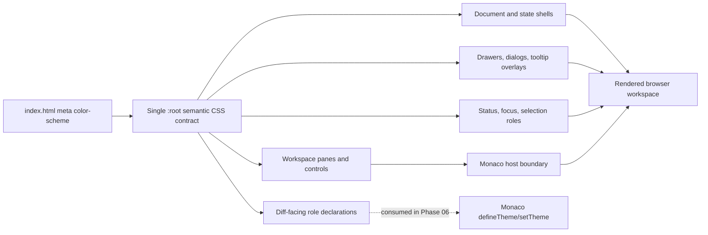

# Phase 05: Semantic Dark Foundation - Research

**Researched:** 2026-07-26
**Domain:** Native CSS semantic design tokens, dark first paint, Vue workspace surfaces, accessibility foundations
**Confidence:** HIGH

<user_constraints>
## User Constraints (from CONTEXT.md)

### Phase Boundary

Establish one coherent, dark-only semantic visual language across the existing Diff Review workspace. This phase defines and applies the shared foundation for surfaces, text, borders, typography, spacing, shape, elevation, controls, status, focus, selection, and future diff roles. It preserves the current Vue structure, DOM semantics, copy, dependencies, information architecture, and review mechanics. Monaco-specific diff treatment belongs to Phase 06; detailed review-surface adaptation belongs to Phase 07; accessibility and responsive proof belongs to Phase 08.

### Locked Decisions

#### Palette fidelity and identity
- **D-01:** Closely track GitHub dark-default's neutral blue-gray surface, text, border, and blue-accent character. This is a semantic adaptation, not a pixel-perfect clone and not GitHub branding.
- **D-02:** Diff Review's identity remains in its existing product name, local-first copy, information architecture, and workflow rather than a competing decorative palette or novel brand treatment.
- **D-03:** Dark presentation begins at the document root and covers page, panels, drawers, controls, loading, empty, and error surfaces. Browser-default or light fallback flashes are not acceptable.

#### Surface hierarchy
- **D-04:** Use a restrained hierarchy of canvas, inset, panel, raised, and interactive roles. Adjacent static regions should rely primarily on subtle surface steps and one-pixel borders, not strong contrast blocks.
- **D-05:** Semantic tokens are named by visual role rather than by component. The foundation must include surface, text, border, interactive, status, focus, selection, and diff-facing roles so later phases extend one vocabulary instead of adding parallel palettes.
- **D-06:** Replace the two competing root token systems in `src/web/styles.css` with one clean semantic contract. Compatibility aliases, stacked overrides, and a second theme layer are not desired.

#### Typography and density
- **D-07:** Use the local system UI stack for interface text and retain the existing monospace stack for code, object IDs, paths, and line-oriented metadata. No remote fonts or new font dependency.
- **D-08:** Target GitHub-familiar compactness: 14px as the normal interface baseline, 12px for supporting metadata, restrained heading steps, and compact line heights that remain legible.
- **D-09:** Keep the existing 4/8-based spacing rhythm and favor 4px or 8px internal gaps with 16px section spacing. Do not use the visual-foundation work to redesign layout or compress controls below comfortable use.

#### Shape and elevation
- **D-10:** Use modest, GitHub-familiar radii: approximately 6px for controls and contained cards, smaller radii where density benefits, and pill shapes only for badges or statuses. Structural workspace panes remain comparatively square.
- **D-11:** Static surfaces use borders and surface steps rather than shadows. Shadows are reserved for true overlays such as drawers, dialogs, tooltips, or floating layers.
- **D-12:** Avoid gradients, glow, glass effects, decorative textures, and large soft cards. Code and review content remain the visual focus.

### Claude's Discretion

The user delegated all presented gray areas to Claude. Exact token names, final color values, minor type-scale adjustments, and precise radius/shadow values remain flexible when research or composited-contrast validation shows a better value, provided D-01 through D-12 and the phase boundary remain intact.

### Deferred Ideas (OUT OF SCOPE)

None — discussion stayed within phase scope.
</user_constraints>

<phase_requirements>
## Phase Requirements

| ID | Description | Research Support |
|----|-------------|------------------|
| VIS-01 | User experiences one coherent GitHub dark-default-inspired surface hierarchy across the diff workspace without light panels or browser-default control flashes. | Replace both root vocabularies and every legacy consumer in `src/web/styles.css`; retain the early `<meta name="color-scheme" content="dark">`; add root `color-scheme: dark`; explicitly style native controls and every shell/state surface. |
| VIS-02 | User sees compact GitHub-familiar UI typography and density while code, line numbers, labels, and controls remain legible and aligned. | Enforce the approved four-size/two-weight scale, system UI/monospace roles, exact line heights, existing 4-point spacing scale, and 32px minimum single-line control geometry. |
| VIS-03 | User can distinguish workspace regions through restrained surface steps, borders, radii, and overlay-only elevation without decorative effects competing with code. | Map each existing selector to canvas/inset/panel/raised/interactive, normalize borders/radii, remove static/inset elevation, and retain shadow only for actual overlays at the existing breakpoints. |
</phase_requirements>

## Summary

Phase 05 is a clean CSS contract migration, not a Vue or Monaco feature. The repository already centralizes application styling in `src/web/styles.css`, imports it once from `src/web/App.vue`, and exposes stable global BEM-like class hooks across loading, error, recovery, workspace, drawer, control, status, comment, and export surfaces. `[VERIFIED: src/web/App.vue:756-912; src/web/styles.css:1-1872]` The implementation should therefore change `styles.css` as the single production source, leave the Vue templates and event flows intact, and update the two browser tests whose assertions encode the superseded light palette and 18px heading scale. `[VERIFIED: tests/e2e/responsive-session.spec.ts:397-584; tests/integration/export-receipt-ui.spec.ts:197-200]`

The main technical risk is incomplete cutover. `styles.css` currently declares an early dark `--color-*` vocabulary and then a second light `--canvas`/`--panel`/`--surface` vocabulary that aliases the first system to light values. Both naming systems remain actively consumed: for example, `--rule` has 22 uses, `--surface` 15, `--color-border` 17, and `--color-secondary` 12. `[VERIFIED: src/web/styles.css:1-26,970-1003; repository CSS variable usage audit on 2026-07-26]` Appending a third block would preserve the ambiguity and fail D-06. The migration must replace both `:root` blocks, migrate all consumers, remove the compatibility remaps, and leave no old token defined or referenced.

**Primary recommendation:** implement one atomic, sequential `styles.css` cutover plus targeted Playwright contract updates; do not split work by component because every surface shares the same stylesheet and a partial palette migration creates mixed-theme states.

## Project Constraints (from `.claude/CLAUDE.md`)

- Use the existing Node.js 24, TypeScript, Vue 3, Vite, and Monaco stack. `[VERIFIED: .claude/CLAUDE.md:11-21]`
- Preserve Monaco Diff Editor as the browser diff renderer; do not replace it or reimplement Git/diff semantics. `[VERIFIED: .claude/CLAUDE.md:17-21,56-62]`
- Preserve shared contracts, repository-local persistence, CLI/server behavior, and text-only v1 scope; this phase is visual only. `[VERIFIED: .claude/CLAUDE.md:13-21; .planning/phases/05-semantic-dark-foundation/05-CONTEXT.md:6-10]`
- Use Vitest for deterministic contracts and Playwright for the actual browser workflow. `[VERIFIED: .claude/CLAUDE.md:21,42]`
- No project-specific skill rules exist. `[VERIFIED: .claude/CLAUDE.md:105-110]`
- Work is already running inside the Phase 05 GSD planning workflow, satisfying the repository's workflow gate. `[VERIFIED: .claude/CLAUDE.md:112-125; .planning/STATE.md:5-9]`

## Architectural Responsibility Map

| Capability | Primary Tier | Secondary Tier | Rationale |
|------------|-------------|----------------|-----------|
| Root dark first paint | Browser / Client | CDN / Static | `src/web/index.html` supplies the pre-CSS color-scheme hint and compiled global CSS supplies the document canvas. No server rendering exists. `[VERIFIED: src/web/index.html:1-12; src/web/main.ts:1-5]` |
| Semantic token vocabulary | Browser / Client | — | Native CSS custom properties in `src/web/styles.css` are the existing visual contract. `[VERIFIED: src/web/styles.css:1-26,970-1003]` |
| Typography, spacing, controls, status, surfaces | Browser / Client | — | Existing Vue templates expose class hooks; CSS owns their presentation. `[VERIFIED: src/web/App.vue:756-912; src/web/components/ui/UiPrimitives.vue:16-26]` |
| Responsive drawer/rail presentation | Browser / Client | — | CSS breakpoints and `App.vue` media-query state jointly preserve current overlay behavior. `[VERIFIED: src/web/styles.css:1314-1401; src/web/App.vue:703-721]` |
| Monaco diff theme and semantic layers | Browser / Client (Phase 06) | — | The adapter constructs Monaco without Phase 05 theme work; `defineTheme`/`setTheme` belong to Phase 06 under the locked boundary. `[VERIFIED: src/web/monaco/diff-adapter.ts:87-135; .planning/ROADMAP.md:49-60]` |
| API, persistence, export payloads | API / Backend | Database / Storage | No change in this phase. `[VERIFIED: .planning/phases/05-semantic-dark-foundation/05-UI-SPEC.md:337-346]` |



## Standard Stack

No dependency change or installation is required or permitted. `[VERIFIED: .planning/phases/05-semantic-dark-foundation/05-UI-SPEC.md:34-46]`

| Existing technology | Pinned version | Phase 05 use | Guidance |
|---------------------|----------------|--------------|----------|
| Vue | 3.5.39 | Preserve current templates and class hooks | Do not introduce components or scoped style systems. `[VERIFIED: package.json:33-42; 05-UI-SPEC.md:221-236]` |
| Vite | 8.1.4 | Compile the existing global stylesheet into `dist/web` | Keep `src/web` root and current asset path behavior. `[VERIFIED: package.json:44-52; vite.config.ts:6-13]` |
| Monaco Editor | 0.55.1 | Treat as an integration boundary only | Do not call theme APIs in Phase 05. `[VERIFIED: package.json:39; src/web/monaco/diff-adapter.ts:92-103]` |
| Playwright | 1.61.1 | Targeted computed-style, responsive, focus, and browser smoke checks | Reuse the current Chromium/one-worker setup. `[VERIFIED: package.json:45; playwright.config.ts:3-21]` |
| Native CSS | repository stylesheet | Tokens, surfaces, controls, forced-colors fallback | Use one root role vocabulary; no CSS framework, Primer runtime, font, icon, or asset package. `[VERIFIED: 05-UI-SPEC.md:34-46]` |

### Package Legitimacy Audit

Not applicable: Phase 05 installs no external package. `[VERIFIED: 05-UI-SPEC.md:329-334]`

### Environment Availability

Skipped: this is a code/config-only CSS migration with no external service or CLI beyond the repository's already-installed Node/npm/browser test toolchain. `[VERIFIED: package.json:7-52; 05-UI-SPEC.md:34-46]`

## Current Repository State and Analogs

### Existing patterns to retain

1. **One global integration point.** `App.vue` imports `styles.css` exactly once at the end of the SFC. `[VERIFIED: src/web/App.vue:912]`
2. **Stable semantic class hooks.** Loading/error states use `.loading-shell`, `.unavailable-shell`, and `.state-card`; the ready workspace uses `.session-shell`, `.review-shell`, `.review-files`, `.review-main`, and `.comments-rail`. `[VERIFIED: src/web/App.vue:756-905]`
3. **Shared controls.** Most review controls already use `.ui-button`, while earlier identity/copy/retry controls use `.identity-disclosure`, `.copy-button`, and `.retry-button`. `[VERIFIED: src/web/styles.css:146-177,714-769,1136-1156]`
4. **Shared statuses.** `InlineNotice.vue` maps tones onto `.inline-notice--*`, `StatusBadge.vue` maps file states onto `.status-badge--*`, and recovery/export surfaces reuse those hooks. `[VERIFIED: src/web/components/InlineNotice.vue:14-17; src/web/components/StatusBadge.vue:29-33; src/web/styles.css:611-631,1451-1574]`
5. **Established responsive ownership.** `App.vue` uses `(max-width: 1099px)` for the files drawer and `(max-width: 1439px)` for the comments overlay. CSS has corresponding 1439px, 1099px, and 767px boundaries plus a 768–1279px header range. `[VERIFIED: src/web/App.vue:703-721; src/web/styles.css:792-813,815-956,1314-1401]`
6. **Reduced motion already exists.** Global duration suppression appears before the workbench override, and the export spinner has a specific reduced-motion rule. `[VERIFIED: src/web/styles.css:958-965,1867-1871]`
7. **Computed-style contract testing already exists.** `responsive-session.spec.ts` reads root custom properties, injects representative semantic surfaces, checks typography, checks contrast, checks focus, and exercises all responsive transitions. `[VERIFIED: tests/e2e/responsive-session.spec.ts:204-260,397-648]`

### Problems that Phase 05 must remove

- Two root systems compete and the later light block wins through aliases. `[VERIFIED: src/web/styles.css:1-26,970-1003]`
- `body` and global focus each have an early raw color literal, then later overrides, so first-paint and steady-state contracts are split. `[VERIFIED: src/web/styles.css:32-42,1005-1007,1576-1578]`
- The later root changes the UI font to Avenir rather than the locked system stack. `[VERIFIED: src/web/styles.css:1000-1002; 05-UI-SPEC.md:42]`
- Three live heading groups use 18px, and `.active-file-strip h1` lacks an explicit 600 weight; the existing test observes weight 700. `[VERIFIED: src/web/styles.css:1069-1113,1623-1645; tests/e2e/responsive-session.spec.ts:537-573]`
- Textareas have geometry but no explicit dark background, foreground, border, caret, placeholder, or disabled treatment. `[VERIFIED: src/web/styles.css:1265-1276,1439-1444]`
- Disabled controls rely on opacity in both early and workbench rules, contrary to the approved disabled-state contract. `[VERIFIED: src/web/styles.css:507-510,750-759,1152-1156; 05-UI-SPEC.md:193-208]`
- Current status rules set both translucent light backgrounds and inherited colored text; these must be replaced with dark semantic layers and explicit readable body text. `[VERIFIED: src/web/styles.css:1431-1436,1537-1574]`
- No `forced-colors` rule exists in the stylesheet. `[VERIFIED: repository search of src/web/styles.css on 2026-07-26]`

## Concrete Implementation Approach

### 1. Replace both root vocabularies in one edit

Use the canonical role names below as the implementation names. The UI contract allows spelling adjustments, but fixing these names now makes Phase 06 and Phase 07 consumption unambiguous. `[RECOMMENDED]` Remove the second `:root` block and the Phase 2 override comment entirely; do not leave alias declarations from old names to new names.

| Token | Locked value | Primary consumers |
|-------|--------------|-------------------|
| `--surface-canvas` | `#0D1117` | `:root`, `body`, `.review-main`, primary canvas |
| `--surface-inset` | `#010409` | recessed wells, code-adjacent inset, future unchanged/empty diff region |
| `--surface-panel` | `#161B22` | headers, side panes, state cards, static grouped regions |
| `--surface-raised` | `#21262D` | identity panel, drawers while overlaying, keyboard help, tooltip body |
| `--surface-interactive` | `#21262D` | resting controls and fields |
| `--surface-interactive-hover` | `#292E36` | enabled hover only |
| `--surface-interactive-active` | `#30363D` | enabled pressed only |
| `--text-primary` | `#E6EDF3` | body, headings, values, control labels |
| `--text-secondary` | `#B1BAC4` | supporting copy and labels |
| `--text-muted` | `#8B949E` | tertiary metadata and placeholders |
| `--text-on-emphasis` | `#FFFFFF` | primary/destructive filled controls only |
| `--border-muted` | `#21262D` | decorative separators |
| `--border-default` | `#30363D` | pane, card, input, and control boundaries |
| `--border-strong` | `#484F58` | hover, active, selected, high-salience boundaries |
| `--interactive-accent` | `#2F81F7` | links, selected rail, indicators, copy feedback |
| `--interactive-accent-emphasis` | `#1F6FEB` | primary action fill only |
| `--focus-ring` | `#58A6FF` | opaque keyboard focus outline |
| `--selection-background` | `rgb(56 139 253 / 35%)` | general selection layer |
| `--selection-border` | `#58A6FF` | durable selected boundary |
| `--destructive-foreground` | `#F85149` | destructive resting text/icon/border |
| `--destructive-emphasis` | `#B62324` | confirmed destructive fill |

All values above are locked by the approved design contract. `[VERIFIED: 05-UI-SPEC.md:117-145]`

Declare semantic status roles in the same root vocabulary, using a consistent `--status-{meaning}-{part}` pattern. `[RECOMMENDED]` Required values are success `#3FB950` / `rgb(46 160 67 / 15%)`, warning `#D29922` / `rgb(187 128 9 / 15%)`, error `#F85149` / `rgb(248 81 73 / 15%)`, information `#58A6FF` / `rgb(56 139 253 / 15%)`, resolved `#A371F7` / `rgb(163 113 247 / 15%)`, pending `#B1BAC4` / `#21262D`, and disabled `#8B949E` / `#161B22`. `[VERIFIED: 05-UI-SPEC.md:147-159]`

Declare diff-facing roles now, but do not consume them through Monaco yet: `--diff-addition-foreground`, `--diff-addition-background`, `--diff-addition-intraline`, corresponding deletion tokens, `--diff-hunk-foreground`, `--diff-hunk-background`, and empty/unchanged background/border roles. `[RECOMMENDED]` Their locked values are recorded in the UI contract and exist specifically for Phase 06. `[VERIFIED: 05-UI-SPEC.md:161-175]`

Keep the existing `--space-xs` through `--space-3xl` names and exact 4/8-based values; they are already semantic and match the approved contract. `[VERIFIED: src/web/styles.css:14-20; 05-UI-SPEC.md:50-74]` Add role-based typography/shape variables only where they reduce repetition: UI/mono stacks, 12/16 metadata, 14/20 body, 16/24 section heading, 20/28 page heading, weights 400/600, radii 4/6/8/999, and the single overlay shadow `0 8px 24px rgb(0 0 0 / 40%)`. `[RECOMMENDED; VERIFIED VALUES: 05-UI-SPEC.md:78-96,179-189]`

### 2. Establish dark first paint and native-control defaults

- Keep `<meta name="color-scheme" content="dark">` where it already appears before application scripts. `[VERIFIED: src/web/index.html:3-11]`
- Add `color-scheme: dark` to the single root CSS contract, and set root/body foreground and background from semantic tokens. `[RECOMMENDED]` MDN documents that `color-scheme` controls browser canvas, scrollbars, form controls, and other browser-provided UI, and recommends the early meta declaration to help prevent load flashes. `[CITED: https://developer.mozilla.org/en-US/docs/Web/CSS/Reference/Properties/color-scheme]`
- Replace the raw `body` background and raw global focus color with semantic properties; raw application colors should exist only inside root token declarations and forced-colors system mappings. `[RECOMMENDED; VERIFIED CONSTRAINT: 05-UI-SPEC.md:350-358]`
- Give `.ui-button`, the legacy button hooks, textareas, text-like inputs/selects, placeholders, carets, disabled controls, checkboxes/radios, and autofill states an explicit dark contract. `[RECOMMENDED]` Do not flatten native checkbox semantics; use `accent-color` and explicit disabled treatment while retaining the native input. The live repository currently uses textareas and one checkbox, not text inputs or selects. `[VERIFIED: repository native-control inventory on 2026-07-26]`
- Use one global `:focus-visible` rule: `2px solid var(--focus-ring)` with `2px` offset. Remove the later duplicate override. `[RECOMMENDED; VERIFIED CONTRACT: 05-UI-SPEC.md:193-208,269-283]`

### 3. Migrate every consumer without restructuring the stylesheet

Perform a mechanical semantic mapping through all 1,872 lines, then normalize component states. `[RECOMMENDED]` Keep selectors and cascade order unless a duplicate visual rule becomes obsolete; do not reorganize components or breakpoints while changing values.

| Legacy role(s) | Semantic destination |
|----------------|----------------------|
| `--canvas`, `--color-dominant` | `--surface-canvas` or `--surface-inset` according to actual depth |
| `--panel`, `--color-secondary` | `--surface-panel` for static regions; `--surface-raised` only for overlays |
| `--surface`, `--color-hover` | resting interactive, raised, or hover role according to state; never map all three to one token |
| `--text`, `--color-text-primary` | `--text-primary` |
| `--text-muted`, `--color-text-secondary` | `--text-secondary` or `--text-muted` according to hierarchy |
| `--rule`, `--color-border` | `--border-muted`, `--border-default`, or `--border-strong` according to boundary meaning |
| `--accent`, `--color-accent` | `--interactive-accent`; primary fills use `--interactive-accent-emphasis` |
| `--color-focus` | `--focus-ring` |
| old warning/info/error/add/delete variables | corresponding status or diff-facing roles |

This is not a one-to-one rename: the two old surface systems collapsed distinct visual meanings, so each consumer must be classified. `[RECOMMENDED]`

### 4. Normalize typography and density

- Root UI text: local system stack; code/path/hash/line metadata: existing `ui-monospace` stack. `[VERIFIED: 05-UI-SPEC.md:42,89-96]`
- Replace unitless `1.33`, `1.43`, `1.4`, and `1.5` where they represent the named interface roles with exact 16px, 20px, 24px, or 28px values. `[RECOMMENDED]` This avoids computed 15.96px/20.02px drift already visible in the current Playwright expectations. `[VERIFIED: tests/e2e/responsive-session.spec.ts:537-573]`
- Change all live 18px headings to 16px/24px/600: `.comments-rail h3`, `.active-file-strip h1`, and `.export-section h3, h4`. `[RECOMMENDED; VERIFIED LOCATIONS: src/web/styles.css:1069-1113,1623-1645]`
- Explicitly set `font-weight: 600` on headings whose current browser default becomes 700, especially `.active-file-strip h1`. `[RECOMMENDED; VERIFIED: tests/e2e/responsive-session.spec.ts:545-551]`
- Keep spacing on the existing token scale. Replace remaining literal 4/8/16/24/32/48/64 spacing with tokens when touched, but do not change layout dimensions such as 288px/360px panes or the 640px Monaco-containing review width. `[RECOMMENDED; VERIFIED BOUNDARY: 05-UI-SPEC.md:246-265]`
- Normalize single-line controls to a 32px minimum with 4px/8px internal padding. Preserve the existing 44px narrow recovery action rule unless visual smoke shows a regression; it exceeds rather than violates the minimum. `[RECOMMENDED; VERIFIED: src/web/styles.css:1136-1145,1593-1595; 05-UI-SPEC.md:64-74,210-217]`

### 5. Apply the surface/elevation matrix

| Existing selectors | Role | Radius/elevation |
|--------------------|------|------------------|
| `:root`, `body`, `.session-shell`, `.review-main`, `.file-metadata-pane` | canvas | no radius, no shadow |
| recessed/code-adjacent wells, `.diff-workspace` host surroundings | inset/canvas boundary | structural square edge; do not theme Monaco internals |
| `.session-header`, `.review-files`, static `.comments-rail`, `.state-card`, `.draft-recovery__card`, export cards | panel/static contained | 1px boundary; 0px structural or 6px contained radius; no shadow |
| `.identity-panel`, `.keyboard-help`, open comments overlay below 1440px, open files drawer below 1100px | raised overlay | 8px where contained, 1px border, single overlay shadow |
| `.ui-tooltip__content` | raised floating layer | 4px radius, 1px border; shadow only if required for separation |
| `.ui-button`, textareas, confirmation/notice cards | interactive/contained | 6px radius, 1px border, no shadow |
| `.tree-row--selected` | neutral selected surface plus accent rail | no elevation; an inset 3px rail is a state cue, not shadow elevation |
| status badges | semantic status | pill only for actual badge/status; 1px border, no shadow |

The selector inventory is verified in `src/web/styles.css`; role assignment is the recommended implementation of the locked matrix. `[VERIFIED: src/web/styles.css:65-99,179-207,330-445,611-631,1025-1308,1314-1401,1451-1574,1600-1872; VERIFIED CONTRACT: 05-UI-SPEC.md:179-189]`

### 6. Add forced-colors fallback without creating another theme

Add a targeted `@media (forced-colors: active)` block using CSS system colors for document text/canvas, controls, links, disabled text, focus, selected rails, and meaningful boundaries. `[RECOMMENDED]` Use `Canvas`, `CanvasText`, `ButtonFace`, `ButtonText`, `ButtonBorder`, `LinkText`, `Highlight`, `HighlightText`, and `GrayText`; do not set `forced-color-adjust: none` on ordinary workspace components. `[VERIFIED: 05-UI-SPEC.md:285-295]` MDN confirms forced-colors replaces author colors at paint time, removes box shadows, and expects targeted system-color fixes such as replacing a lost shadow with a border. `[CITED: https://developer.mozilla.org/en-US/docs/Web/CSS/Reference/At-rules/@media/forced-colors]`

This fallback is not a second dark/light token set: it is an OS-enforced accessibility mapping and belongs at the end of the stylesheet after ordinary rules. `[RECOMMENDED]`

## Exact Likely Files and Symbols

| Path | Symbols / ranges | Planned action | Confidence |
|------|------------------|----------------|------------|
| `src/web/styles.css` | both `:root` blocks; `body`; both `:focus-visible` rules; all `var(...)` consumers; all typography, controls, status, overlay, breakpoint, and reduced-motion rules | **Required production edit.** Replace vocabulary, migrate consumers, normalize approved roles, add native-control and forced-colors states. | HIGH `[VERIFIED: repository inspection]` |
| `tests/e2e/responsive-session.spec.ts` | `readStyles`, `contrastRatio`, `assertNoPageOverflow`, step `exact palette, spacing, typography, contrast, and motion tokens`, responsive geometry step | **Required contract-test edit.** Replace old token/font/color expectations, assert old tokens are absent, add dark control/static-vs-overlay/focus checks, preserve current breakpoint checks. | HIGH `[VERIFIED: lines 204-260,397-648]` |
| `tests/integration/export-receipt-ui.spec.ts` | h4 computed-style assertions around lines 197-200 | **Required test edit.** Change 18px expectation to approved 16px while retaining 600/24px. | HIGH `[VERIFIED: lines 197-200; 05-UI-SPEC.md:78-87]` |
| `src/web/index.html` | `<meta name="color-scheme" content="dark">` | **Inspect/retain; likely no edit.** It already provides the early dark hint. | HIGH `[VERIFIED: lines 3-7]` |
| `src/web/App.vue` | templates at lines 756-912 and `<style src="./styles.css">` | **No structural edit expected.** Use existing hooks. Add a class only if an actual CSS target is impossible without it. | HIGH `[VERIFIED: lines 756-912]` |
| `src/web/components/ui/UiPrimitives.vue` | `.ui-tooltip`, `.ui-tooltip__content` | **No behavior/template edit.** Restyle via global CSS; preserve focus/hover/Escape behavior. | HIGH `[VERIFIED: lines 16-26]` |
| `src/web/monaco/diff-adapter.ts` | constructor / `createDiffEditor` | **Do not edit in Phase 05.** | HIGH `[VERIFIED: lines 87-135; locked phase boundary]` |
| `src/web/monaco/configure.ts` | worker setup and language mapping | **Do not edit.** No relation to CSS foundation. | HIGH `[VERIFIED: lines 1-85]` |
| all other `.vue` files | existing class hooks and copy | **No expected edits.** Visual changes should flow from global classes. | HIGH `[VERIFIED: component class-hook inventory; 05-UI-SPEC.md:221-236]` |

## Architecture Patterns

### Pattern 1: Semantic role token, direct consumer

```css
/* Source values: .planning/phases/05-semantic-dark-foundation/05-UI-SPEC.md */
:root {
  color-scheme: dark;
  --surface-canvas: #0d1117;
  --surface-panel: #161b22;
  --surface-interactive: #21262d;
  --surface-interactive-hover: #292e36;
  --text-primary: #e6edf3;
  --border-default: #30363d;
  --border-strong: #484f58;
}

.ui-button {
  border: 1px solid var(--border-default);
  background: var(--surface-interactive);
  color: var(--text-primary);
}

.ui-button:hover:not(:disabled) {
  border-color: var(--border-strong);
  background: var(--surface-interactive-hover);
}
```

Use direct semantic consumers; do not introduce `--button-bg`, `--card-bg`, or old-name aliases. `[RECOMMENDED; VERIFIED CONSTRAINT: 05-UI-SPEC.md:117-145,350-358]`

### Pattern 2: Status structure plus readable text

```css
.inline-notice {
  border: 1px solid var(--status-information-foreground);
  border-left-width: 3px;
  background: var(--status-information-background);
  color: var(--text-primary);
}

.inline-notice--warning {
  border-color: var(--status-warning-foreground);
  background: var(--status-warning-background);
}
```

Keep status meaning in the existing heading/label plus structural border; do not make inherited colored text carry all meaning. `[RECOMMENDED; VERIFIED EXISTING SEMANTICS: src/web/components/InlineNotice.vue:14-17; 05-UI-SPEC.md:147-159]`

### Pattern 3: Overlay-only shadow at existing breakpoints

```css
.comments-rail {
  background: var(--surface-panel);
  box-shadow: none;
}

@media (max-width: 1439px) {
  .comments-rail {
    background: var(--surface-raised);
    box-shadow: var(--shadow-overlay);
  }
}
```

This expresses the same component's tier change without inventing a new class or breakpoint. `[RECOMMENDED; VERIFIED RESPONSIVE BEHAVIOR: src/web/styles.css:1033-1051,1314-1334]`

### Pattern 4: Forced-colors targeted repair

```css
@media (forced-colors: active) {
  :focus-visible {
    outline-color: Highlight;
  }

  .ui-button,
  textarea {
    border-color: ButtonBorder;
    background: ButtonFace;
    color: ButtonText;
  }

  .tree-row--selected {
    border-left: 3px solid Highlight;
  }
}
```

System colors survive user palette substitution; ordinary components remain under the browser's forced-color adjustment. `[CITED: https://developer.mozilla.org/en-US/docs/Web/CSS/Reference/At-rules/@media/forced-colors]`

### Anti-patterns to avoid

- **Third root override:** fails the clean-cutover decision and leaves state-dependent aliases. `[VERIFIED CONSTRAINT: D-06]`
- **One-to-one token rename:** `--surface` currently represents control, card, active strip, tooltip foreground inverse, and overlays; those need different semantic roles. `[VERIFIED: src/web/styles.css:1017-1307,1600-1872]`
- **Component-named tokens:** they create a parallel palette and prevent later phases from sharing roles. `[VERIFIED CONSTRAINT: D-05; 05-UI-SPEC.md:117-120]`
- **Moving style blocks while recoloring:** cascade changes could alter behavior and make visual regressions difficult to isolate. `[RECOMMENDED]`
- **Changing Vue templates to make CSS easier:** existing hooks are sufficient for nearly every surface and structure changes are out of scope. `[VERIFIED: 05-UI-SPEC.md:221-236,337-358]`
- **Using opacity as disabled treatment:** it can weaken text/boundaries and violates the explicit disabled-state contract. `[VERIFIED: 05-UI-SPEC.md:193-208]`
- **Using box-shadow for pressed states:** current inset shadows should become stable background/border states; only the selected rail may use an inset shadow as a non-elevation cue. `[RECOMMENDED; VERIFIED CONTRACT: D-11]`
- **Styling Monaco descendants from global CSS:** Monaco internals and diff layers are Phase 06. `[VERIFIED: 05-UI-SPEC.md:161-175,337-346]`
- **Snapshot-only testing:** exact tokens and computed roles are more diagnostic; screenshots are smoke evidence, not the sole contract. `[RECOMMENDED; VERIFIED ANALOG: tests/e2e/responsive-session.spec.ts:397-648]`

## Don't Hand-Roll

| Problem | Don't build | Use instead | Why |
|---------|-------------|-------------|-----|
| Theme switching | theme store, media-query toggle, second palette | one dark root contract | Light/additional themes are explicitly out of scope. `[VERIFIED: .planning/REQUIREMENTS.md:54-64]` |
| Component design system | wrapper components, CSS-in-JS, scoped theme provider | existing global BEM-like hooks | The repository already has a complete presentation surface and the phase forbids new components/dependencies. `[VERIFIED: 05-CONTEXT.md:55-73; 05-UI-SPEC.md:221-236]` |
| Native-control replacement | custom checkbox/button/textarea widgets | semantic HTML plus CSS/color-scheme | Existing keyboard/name semantics remain authoritative, while `color-scheme` lets the UA render compatible chrome. `[CITED: https://developer.mozilla.org/en-US/docs/Web/CSS/Reference/Properties/color-scheme]` |
| Forced-colors palette | bespoke high-contrast theme or `forced-color-adjust: none` | system color keywords in targeted fixes | Browser/user palette enforcement supplies the contrast model. `[CITED: https://developer.mozilla.org/en-US/docs/Web/CSS/Reference/At-rules/@media/forced-colors]` |
| Contrast math in production | runtime color parser or CSS calculator | fixed approved tokens plus test-only contrast helper | Palette is static; current tests already contain deterministic sRGB contrast code. `[VERIFIED: tests/e2e/responsive-session.spec.ts:232-252]` |
| Monaco dark adaptation | global `.monaco-*` overrides | Phase 06 `defineTheme`/`setTheme` work | Monaco exposes official theme APIs and the roadmap reserves them for Phase 06. `[CITED: https://microsoft.github.io/monaco-editor/typedoc/functions/editor_editor_api.editor.defineTheme.html; https://microsoft.github.io/monaco-editor/typedoc/functions/editor_editor_api.editor.setTheme.html]` |

## Dependency and Monaco API Considerations

- No package additions, updates, imports, or runtime asset requests are needed. `[VERIFIED: 05-UI-SPEC.md:34-46]`
- `monaco.editor.createDiffEditor(host, options)` reads its host dimensions and owns internal rendering. `[CITED: https://microsoft.github.io/monaco-editor/typedoc/functions/editor_editor_api.editor.createDiffEditor.html]` Phase 05 may style `.diff-workspace` and `.diff-workspace__editor` as host/surrounding surfaces, but must not change constructor options, models, line mapping, decorations, view zones, hidden regions, gutter geometry, or commands. `[VERIFIED: src/web/monaco/diff-adapter.ts:87-135; 05-UI-SPEC.md:161-175]`
- The current adapter does not invoke `defineTheme` or `setTheme`. `[VERIFIED: repository Monaco API search on 2026-07-26]` Do not compensate for any remaining editor-color mismatch in this phase; record it as expected Phase 06 ownership rather than broadening scope.
- The existing `<meta name="color-scheme">` and root CSS declaration are complementary: the meta is parsed before CSS to reduce load flash, while inherited CSS `color-scheme` governs browser-provided UI. `[CITED: https://developer.mozilla.org/en-US/docs/Web/CSS/Reference/Properties/color-scheme]`

## CSS, Contrast, and Theming Risks

### Risk 1: Alpha status layers can fail after compositing

A raw token check is insufficient. Independent sRGB calculations using the locked values show primary/secondary/muted text remain at least 4.95:1 on canvas, panel, and raised surfaces, and the focus ring is 4.83:1 against the darkest declared adjacent interactive state. `[VERIFIED: local contrast calculation from 05-UI-SPEC token values on 2026-07-26]` However, error `#F85149` over its 15% tint composites to about 4.35:1 on panel and 3.84:1 on raised; resolved `#A371F7` similarly composites to about 4.22:1 and 3.71:1. `[VERIFIED: local alpha-composite contrast calculation on 2026-07-26]`

**Planning consequence:** status containers should use semantic hue for border/rail/icon and existing explicit labels, while normal body text uses `--text-primary` (or another verified text role). Do not globally inherit the colored foreground across the tinted container as current `.inline-notice` rules do. `[RECOMMENDED]` Full overlap proof remains Phase 08, but Phase 05 must not knowingly encode a failing base pairing.

### Risk 2: Root cutover misses pre-workbench states

Loading, unavailable, identity, metadata, empty, and early tree rules occur before the second root override; workbench/recovery/export rules occur after it. `[VERIFIED: src/web/styles.css:45-956,1005-1872]` Searching or replacing only the later half leaves mixed vocabulary and may show light states only during loading/error/recovery. The test must exercise at least ready, delayed loading, unavailable/error, empty, and recovery surfaces or pair targeted existing tests with manual smoke. `[RECOMMENDED]`

### Risk 3: Surface aliasing destroys hierarchy

Mapping every old `--surface` or `--color-secondary` use to `--surface-panel` would make controls, overlays, and static regions indistinguishable. `[VERIFIED: legacy token consumer locations in src/web/styles.css]` Classify by responsibility, not old name.

### Risk 4: Static versus overlay is breakpoint-dependent

`.comments-rail` is static at 1440px and an overlay at 1439px; `.review-files` becomes an overlay at 1099px. `[VERIFIED: src/web/styles.css:1025-1051,1314-1366; tests/e2e/responsive-session.spec.ts:593-647]` Shadow and raised-surface assertions must check both sides of each breakpoint.

### Risk 5: Typography changes alter wrapping

Removing Avenir and forcing exact system metrics plus 16px headings can change header/toolbars and long labels. `[VERIFIED: current font override at src/web/styles.css:1000-1002; locked UI contract at 05-UI-SPEC.md:78-96]` Preserve grid/flex dimensions and inspect 1100–1279px wrapping and 375/320px drawers for overlap and document overflow.

### Risk 6: Focus outline clipping

The contract requires a 2px outline with 2px offset, but multiple containers use `overflow: hidden` or scroll. `[VERIFIED: src/web/styles.css:80,1030-1048,1081-1088,1203-1210]` Check controls at pane edges, selected tree rows, drawer close controls, and skip links. Phase 05 should adjust local spacing/overflow visibility only if required without changing navigation order or geometry.

### Risk 7: Raw colors and stale aliases survive

The only current raw colors outside root declarations are body/focus colors and shadow colors. `[VERIFIED: repository raw-color audit of src/web/styles.css on 2026-07-26]` After migration, a repository search should find application color literals only in the single root block, the single overlay shadow declaration, and forced-colors system keywords. Old token definitions and references should both be zero.

## Accessibility and Responsive Implications

### Contrast and focus

- WCAG 2.2 Level AA requires at least 4.5:1 for normal text and 3:1 for meaningful non-text UI/state cues against adjacent colors. `[CITED: https://www.w3.org/WAI/WCAG22/Understanding/contrast-minimum.html; https://www.w3.org/WAI/WCAG22/Understanding/non-text-contrast.html]`
- The approved 2px focus outline with 2px offset also follows the simplest pattern described by WCAG Focus Appearance; that criterion is Level AAA, while visible focus and non-text contrast remain required foundations here. `[CITED: https://www.w3.org/WAI/WCAG22/Understanding/focus-appearance.html]`
- Preserve existing non-color cues: file status text/symbols, selected rail plus `aria-selected`, warning/error headings and roles, pending labels, and resolved text. `[VERIFIED: src/web/components/StatusBadge.vue:29-33; src/web/components/FileRow.vue:43-60; src/web/components/InlineNotice.vue:14-17; 05-UI-SPEC.md:147-159]`
- Preserve all existing landmarks, labels, live regions, alert roles, `inert`, `aria-hidden`, focus restoration, and Escape behavior. `[VERIFIED: src/web/App.vue:756-908; tests/e2e/responsive-session.spec.ts:650-679]`
- Do not claim A11Y-01/A11Y-02/A11Y-03 complete; Phase 08 owns final composited, keyboard, zoom, grayscale, and forced-colors proof. `[VERIFIED: .planning/REQUIREMENTS.md:32-41,85-89; 05-UI-SPEC.md:258-298]`

### Responsive preservation matrix

| Width | Existing behavior to preserve | Phase 05 check |
|-------|-------------------------------|----------------|
| `>=1440px` | files, diff, comments are three static regions | static panes have panel/canvas steps, 1px borders, no shadow; document has no new horizontal overflow |
| `1280–1439px` | comments becomes right overlay | only open comments overlay uses raised role and shadow |
| `1100–1279px` | files + diff static; comments overlay; header may wrap | font change does not overlap/clip header facts or identity panel |
| `768–1099px` | files left drawer; comments right overlay | both open drawers use raised role/shadow and remain viewport-bound |
| `<=767px` | drawers persist; toolbar wraps; review main retains 640px localized width | page itself does not gain horizontal scrolling; labels/focus remain visible |

The behaviors and obligations are locked. `[VERIFIED: 05-UI-SPEC.md:246-265]` Do not add breakpoints, fixed widths, page padding, or new reflow logic in Phase 05.

## Verification and Smoke Strategy

`workflow.nyquist_validation` is explicitly `false`, so the formal GSD Validation Architecture section is intentionally omitted. `[VERIFIED: .planning/config.json:16-27]` The phase still needs targeted proof because the requested behavior is visual and browser-observable.

### Automated contract updates

1. **Update `tests/e2e/responsive-session.spec.ts`.** `[RECOMMENDED]`
   - Read the complete new semantic token set and assert exact values.
   - Read every removed legacy token (`--canvas`, `--panel`, `--surface`, `--text`, `--rule`, `--color-*`, old status names) and assert empty values, proving clean cutover at runtime.
   - Assert root/body `color-scheme`, foreground, and background.
   - Update typography expectations to system UI, exact 12/16, 14/20, 16/24, 20/28, and weights 400/600; retain monospace path assertion.
   - Reuse the existing injected semantic fixture for status/control computed styles, but assert dark roles and readable text rather than the old light palette.
   - Add textarea/rest-hover-active-disabled/focus computed-style checks.
   - Assert representative static surfaces have `box-shadow: none`, while identity/keyboard help and breakpoint-driven open drawers have the single overlay shadow.
   - Preserve all existing 1440/1439/1100/1099/768/375/320 geometry, overflow, focus, and inert assertions.
   - Use `page.emulateMedia({ forcedColors: 'active' })` for a narrow foundation check: active media query, visible focus outline, explicit pane/control boundaries, selected rail, and no dependence on shadow. Playwright officially supports the `forcedColors` option. `[CITED: https://playwright.dev/docs/api/class-page#page-emulate-media]`

2. **Update `tests/integration/export-receipt-ui.spec.ts`.** Change only the heading size assertion from 18px to 16px; retain 600 and 24px. `[RECOMMENDED; VERIFIED: tests/integration/export-receipt-ui.spec.ts:197-200]`

3. **Do not add source-text tests.** Assert computed browser behavior and old-token absence at runtime, not CSS file substrings. `[RECOMMENDED]`

### Targeted commands for the execution plan

```bash
npm run build:web
npm run test:package -- tests/e2e/responsive-session.spec.ts tests/integration/export-receipt-ui.spec.ts
npm run test:package -- tests/integration/draft-recovery-ui.spec.ts
```

These are targeted, not project-wide, and reuse existing scripts/configuration. `[VERIFIED: package.json:20-31; playwright.config.ts:3-21]`

### Required browser smoke

Use the packaged browser flow already established by `responsive-session.spec.ts`; do not substitute a static HTML mock. `[RECOMMENDED]`

- At 1440px: inspect root, session header, selected file, diff surroundings, static comments rail, controls, tooltips, and export/review surfaces. Static regions must not cast shadows.
- At 1439px: open/close comments and confirm raised overlay/shadow, focus restoration, and no document overflow.
- At 1099px: open/close files and comments; confirm both drawers are dark, viewport-bound, and focus-visible.
- At 375px and 320px: confirm dark root/shell, wrapping labels, no new page-wide overflow, and visible edge focus.
- Delay `/api/session` to observe the loading surface before resolution; return an API error to observe unavailable/error; use a zero-file response for empty; run the existing recovery fixture for recovery.
- Inspect a textarea, checkbox, disabled button, primary action, destructive action, warning/error/info notice, selected row, and tooltip in rest/focus/hover where applicable.
- Record that Monaco internal theming remains Phase 06; judge only host/surrounding integration in this phase.

## Common Planning Pitfalls

1. **Planning parallel edits to `styles.css`.** All requirements converge on one file; parallel plans will conflict and can temporarily violate the clean-cutover invariant. Use one plan or strictly serial tasks. `[RECOMMENDED]`
2. **Treating Phase 05 as “change variables only.”** Typography, controls, status inheritance, radii, static shadows, forced colors, and raw literals also violate the approved contract. `[VERIFIED: repository inspection and 05-UI-SPEC.md:50-298]`
3. **Over-scoping Monaco to hide a remaining light editor.** Theme APIs are explicitly Phase 06; do not edit the adapter now. `[VERIFIED: .planning/ROADMAP.md:49-60; 05-UI-SPEC.md:337-346]`
4. **Under-scoping state coverage.** Ready workspace alone does not prove loading/error/recovery/empty first paint. `[VERIFIED: VIS-01 and 05-UI-SPEC.md:24-30]`
5. **Using status hue for all notice text.** Some locked alpha composites fail 4.5:1 over panel/raised surfaces; keep body copy on a verified text role. `[VERIFIED: local contrast calculation on 2026-07-26]`
6. **Removing the 640px review-main width or changing drawer breakpoints.** Those are preserved layout constraints; Phase 08 owns final narrow reflow. `[VERIFIED: src/web/styles.css:1203-1208,1336-1401; 05-UI-SPEC.md:246-265]`
7. **Mistaking selected-rail inset shadow for elevation.** Preserve a no-layout-shift 3px structural cue, but remove pressed/static decorative shadows. `[RECOMMENDED; VERIFIED CONTRACT: 05-UI-SPEC.md:193-208]`
8. **Changing copy while restyling.** The UI contract records existing strings specifically to prevent copy drift. `[VERIFIED: 05-UI-SPEC.md:302-325]`
9. **Claiming Phase 08 acceptance.** Phase 05 establishes hooks/fallbacks; it does not complete 400% zoom, full forced-colors, grayscale, or overlap proof. `[VERIFIED: 05-UI-SPEC.md:258-298,337-346]`

## Security Domain

`security_enforcement` is enabled, but this phase changes CSS presentation only and does not alter request handling, authentication, authorization, persistence, serialization, secrets, or cryptography. `[VERIFIED: .planning/config.json:41-43; locked phase boundary]`

### Applicable ASVS Categories

| ASVS category | Applies | Phase control |
|---------------|---------|---------------|
| V2 Authentication | No | No auth code or UI flow changes. |
| V3 Session Management | No | Existing loopback capability/session behavior remains unchanged. |
| V4 Access Control | No | Existing `inert`/`aria-hidden` behavior is preserved; no capability route changes. |
| V5 Validation, Sanitization, Encoding | No new surface | No copy, HTML rendering, form submission, API, or schema changes. |
| V6 Stored Cryptography | No | No stored data or cryptographic operation changes. |

### Relevant threat controls

- Do not add remote fonts, images, CSS imports, analytics, or registry assets; this preserves the local-first/no-network privacy boundary. `[VERIFIED: .planning/REQUIREMENTS.md:54-64; 05-UI-SPEC.md:34-46]`
- Do not modify `v-html` usage or content rendering while styling export preview surfaces. `[RECOMMENDED; VERIFIED EXISTING SURFACE: src/web/components/SummarySection.vue:198]`
- Preserve visible destructive/error semantics and focus so a visual restyle cannot make consequential actions deceptive or indistinguishable. `[VERIFIED: 05-UI-SPEC.md:193-208,269-295]`

## State of the Art

| Old repository approach | Phase 05 approach | Impact |
|-------------------------|-------------------|--------|
| Early dark `--color-*` tokens overwritten by later light workbench aliases | one dark role-based root contract | all states resolve the same vocabulary from first paint |
| Avenir workbench override and 18px headings | local system stack and four exact roles | compact, deterministic hierarchy without remote assets |
| `--surface` used for controls, cards, strips, overlays, and inverse tooltip text | explicit canvas/inset/panel/raised/interactive/text-on-emphasis roles | hierarchy remains meaningful and later phases can reuse it |
| opacity-disabled controls and accent-heavy hover | explicit neutral state matrix | state remains legible without opacity or hue alone |
| light status boxes with inherited semantic-colored text | dark tints, semantic rail/border/icon, verified body text | avoids known composited contrast failures |
| no forced-colors block | targeted system-color repair | foundation survives palette/shadow substitution without a bespoke theme |

All “old” entries are verified in `src/web/styles.css`; all “Phase 05” entries are prescribed by the approved UI contract. `[VERIFIED: src/web/styles.css:1-1872; 05-UI-SPEC.md:16-358]`

## Assumptions Log

| # | Claim | Section | Risk if Wrong |
|---|-------|---------|---------------|
| — | None. Recommendations are derived from locked planning artifacts, repository inspection, deterministic contrast calculations, and official CSS/Monaco/Playwright/WCAG documentation. | — | — |

## Open Questions

None blocking planning. The approved UI contract fixes the palette, type scale, spacing, shape, elevation, interaction states, responsive boundaries, and phase ownership. The only implementation judgment is per-selector semantic mapping, for which the tables above are prescriptive.

## Sources

### Primary repository sources (HIGH confidence)

- `.planning/phases/05-semantic-dark-foundation/05-CONTEXT.md` — locked D-01 through D-12, boundary, code insights.
- `.planning/phases/05-semantic-dark-foundation/05-UI-SPEC.md` — approved exact values and interaction/accessibility/responsive guardrails.
- `.planning/REQUIREMENTS.md` — VIS-01, VIS-02, VIS-03 and milestone exclusions.
- `.planning/ROADMAP.md` — Phase 05/06 ownership and success criteria.
- `.planning/STATE.md` — current planning state and concerns.
- `.planning/PROJECT.md` — active milestone and preserved v1 workflow.
- `.claude/CLAUDE.md` — stack and repository constraints.
- `src/web/styles.css` — complete current visual implementation and migration surface.
- `src/web/App.vue`, `src/web/index.html`, `src/web/components/**`, `src/web/monaco/**` — integration and behavior boundaries.
- `tests/e2e/responsive-session.spec.ts`, `tests/integration/export-receipt-ui.spec.ts` — exact current browser contract analogs.

### Official documentation (MEDIUM confidence from provider seam)

- [MDN `color-scheme`](https://developer.mozilla.org/en-US/docs/Web/CSS/Reference/Properties/color-scheme) — native UI and early meta guidance.
- [MDN `forced-colors`](https://developer.mozilla.org/en-US/docs/Web/CSS/Reference/At-rules/@media/forced-colors) — browser-forced properties, system colors, and targeted repair.
- [WCAG 2.2 Contrast Minimum](https://www.w3.org/WAI/WCAG22/Understanding/contrast-minimum.html) — 4.5:1 normal text threshold.
- [WCAG 2.2 Non-text Contrast](https://www.w3.org/WAI/WCAG22/Understanding/non-text-contrast.html) — 3:1 meaningful UI/state threshold.
- [WCAG 2.2 Focus Appearance](https://www.w3.org/WAI/WCAG22/Understanding/focus-appearance.html) — 2px/3:1 strong focus pattern and criterion level.
- [Monaco `createDiffEditor`](https://microsoft.github.io/monaco-editor/typedoc/functions/editor_editor_api.editor.createDiffEditor.html), [`defineTheme`](https://microsoft.github.io/monaco-editor/typedoc/functions/editor_editor_api.editor.defineTheme.html), and [`setTheme`](https://microsoft.github.io/monaco-editor/typedoc/functions/editor_editor_api.editor.setTheme.html) — official editor/theme API boundary.
- [Playwright `page.emulateMedia`](https://playwright.dev/docs/api/class-page#page-emulate-media) — forced-colors and reduced-motion emulation.

## Metadata

**Confidence breakdown:**
- Standard stack: HIGH — pinned manifest and locked no-dependency contract.
- Architecture: HIGH — direct inspection of the complete stylesheet, App integration, responsive state, and Monaco boundary.
- Implementation mapping: HIGH — exact UI contract plus selector/token inventory; status-body treatment includes independently verified composite calculations.
- Pitfalls: HIGH — observed duplicate systems, current browser tests, raw colors, missing forced-colors block, and breakpoint-dependent tiers.
- External platform behavior: MEDIUM — official documentation fetched through the research provider seam; Context7 CLI was unavailable, so Monaco was verified against official TypeDoc directly.

**Research date:** 2026-07-26
**Valid until:** 2026-08-25 (stable native CSS and pinned repository stack)
