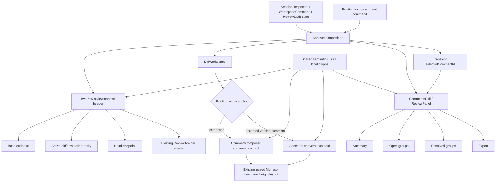

# Phase 07: GitHub-Familiar Review Surfaces - Research

**Researched:** 2026-07-27
**Domain:** Vue 3 dark review-surface adaptation, interaction-state feedback, and Monaco view-zone presentation
**Confidence:** HIGH

<user_constraints>
## User Constraints (from CONTEXT.md)

### Locked Decisions

### File header and toolbar
- **D-01:** Present the active file identity and its controls as one grouped, bordered, two-row header. The first row owns file and comparison context; the second row retains every existing navigation, Review, and Keyboard help action.
- **D-02:** Show compact Base and Head endpoint blocks using the existing selector labels and short commit IDs. Their placement should reinforce the left/Base and right/Head relationship of the Monaco panes.
- **D-03:** Render paths with quieter directory segments and a stronger filename. Renamed files should expose the existing old-to-new path relationship rather than showing only an undifferentiated effective path.
- **D-04:** Use familiar local inline icons for previous/next file and previous/next change controls. Keep Review and Keyboard help visibly labeled. Preserve tooltips, accessible names, commands, and disabled-state semantics.

### Inline comment surfaces
- **D-05:** Render both the inline composer and saved inline comments as compact conversation cards with distinct metadata header, body, and action footer, connected to the source line through the existing anchor rail/cue.
- **D-06:** Lead comment headers with the filename and Base/Head line anchor. Keep directory path and fixed-anchor explanation available as quieter supporting metadata.
- **D-07:** Keep composer guidance and validation adjacent to the textarea. Validation and failures must be explicit at the field; pending state remains explicit in the primary action label and busy treatment.
- **D-08:** Use compact icon-plus-label lifecycle badges reinforced by structure. Open stays prominent, Resolved becomes quieter with an explicit check treatment, and stale or unavailable anchors use warning structure in addition to color. Lifecycle styling must not replace the separate source-line anchor cue.

### Review rail hierarchy
- **D-09:** Keep the existing rail order, but present Summary, comment sections, and Export as restrained stacked framed sections with clear headings and quiet, flat interiors.
- **D-10:** Show labeled Open and Resolved count badges in the rail heading. Existing Open and Resolved disclosures retain their section-specific counts.
- **D-11:** Present each file group as one shared bordered container with a compact path/count header and divider-separated comment rows. Use quieter directory text and stronger filenames; avoid nested card-within-card borders.
- **D-12:** Mark the comment selected from the diff with a persistent accent rail, a modest stronger surface, and heading emphasis. Keep this selection cue distinct from keyboard focus, lifecycle status, and destructive-action styling; retain all existing action labels.

### Controls and status feedback
- **D-13:** Use three stable action tiers: neutral outlined controls by default, a filled accent treatment only for the primary action, and destructive controls that remain outlined at rest and become emphatic on hover or press.
- **D-14:** Give interaction states separate visual channels: hover changes surface and border; pressed adds a deeper surface or inset cue; selected adds a persistent accent plus text or icon meaning; keyboard focus remains the existing unclipped two-pixel outer ring.
- **D-15:** Pair pending actions with a small local spinner and an explicit action-specific verb such as “Saving…” or “Resolving…”. Preserve current mutation and disable rules, keep control width stable where practical, and respect reduced-motion behavior.
- **D-16:** Use one status language at two scales. Notices use a tone icon, explicit heading/body, subtle background, and structural edge; compact Open, Resolved, Pending, and Disabled states use matching icon-label badges. Error, warning, informational, success, pending, disabled, open, and resolved meaning never depends on color alone.

### the agent's Discretion

Exact local SVG glyphs, icon stroke weights, short-ID length where existing conventions do not decide it, token assignments, spacing within the inherited 4-point scale, border weights, restrained surface values, spinner construction, and the exact status-icon mapping remain flexible. Research and planning should choose the smallest implementation that satisfies D-01 through D-16, reuses the existing semantic token vocabulary and component hooks, and does not take Phase 08's proof scope or introduce new mechanics.

### Deferred Ideas (OUT OF SCOPE)

None — discussion stayed within phase scope.
</user_constraints>

<phase_requirements>
## Phase Requirements

| ID | Description | Research Support |
|----|-------------|------------------|
| VIS-04 | User can identify the current file and its Base/Head context from a compact file header that preserves every existing file and diff control. | Group the current `active-file-strip` and `ReviewToolbar` under one two-row header in `App.vue`; use `SessionResponse.base/head`, the established seven-character OID convention, and the selected file's old/new exact paths. [VERIFIED: `.planning/REQUIREMENTS.md:15`, `src/web/App.vue:116-123,803-824`, `src/web/components/IdentityHeader.vue:17-20`, `src/contracts/api.ts:280-318`] |
| REVW-01 | User can distinguish rest, hover, pressed, selected, focused, disabled, destructive, and busy states on every existing diff-workspace control. | Deepen the existing global `.ui-button` state matrix and add explicit selected/busy hooks while retaining native `disabled`, current ARIA state, and the inherited two-pixel focus ring. [VERIFIED: `.planning/REQUIREMENTS.md:27`, `src/web/styles.css:325-480`, `.planning/phases/05-semantic-dark-foundation/05-UI-SPEC.md:193-217`] |
| REVW-02 | User can read and operate inline comment composers and comment cards in the dark workspace with clear anchors, headings, validation, and lifecycle status. | Restyle `CommentComposer.vue` and `DiffWorkspace.renderAnnotation()` only inside the existing paired view zone; keep `setActiveAnchor`, dynamic `setAnchorZoneHeight`, and the Phase 06 anchor rail/geometry contract. [VERIFIED: `.planning/REQUIREMENTS.md:28`, `src/web/components/CommentComposer.vue:26-58`, `src/web/components/DiffWorkspace.vue:76-117`, `.planning/phases/06-monaco-diff-semantics/06-UI-SPEC.md:374-387,522-526`] |
| REVW-03 | User can scan the review rail through clear heading, count, group, card, form, and selected-comment hierarchy. | Preserve `ReviewPanel.vue`'s Summary → Open → Resolved → Export order and computed grouping, then move borders to section/file-group containers, add divider rows, count badges, and a transient selected-comment presentation driven by the existing `focus-comment` command. [VERIFIED: `.planning/REQUIREMENTS.md:29`, `src/web/components/ReviewPanel.vue:67-95,268-535`, `src/web/App.vue:494-501`] |
| REVW-04 | User can distinguish error, warning, informational, success, pending, disabled, open, and resolved states through text or icons and structural treatment in addition to color. | Reuse the inherited status tokens; apply one local icon vocabulary to full notices and compact badges; keep headings, body text, roles, native disabled semantics, and progressive verbs. [VERIFIED: `.planning/REQUIREMENTS.md:30`, `src/web/styles.css:1-80,841-870`, `.planning/phases/05-semantic-dark-foundation/05-UI-SPEC.md:147-159`] |
</phase_requirements>

## Summary

Phase 07 is a browser-presentation phase over a mature review workflow, not a data-model or review-mechanics phase. The current components already expose the required events, ARIA relationships, mutation states, focus destinations, comment grouping, endpoint data, exact paths, and Monaco anchor geometry; the implementation should add a small amount of presentational markup and deepen the single global stylesheet rather than replace any behavior. [VERIFIED: `07-CONTEXT.md:67-87`, `src/web/App.vue:803-904`, `src/web/components/ReviewToolbar.vue:1-70`, `src/web/components/ReviewPanel.vue:1-535`]

The highest-risk seam is the inline view zone: `DiffWorkspace.renderAnnotation()` mounts both the composer and accepted comment into Monaco's paired anchor zone, measures its content, and asks the adapter to resize the pair. Visual hierarchy may change inside that root, but the implementation must not add a second zone, move the anchor cue into the card, alter the minimum-height/measurement loop without evidence, or touch Monaco models/decorations. [VERIFIED: `src/web/components/DiffWorkspace.vue:62-117`, `.planning/phases/06-monaco-diff-semantics/06-UI-SPEC.md:331,374-387,522-526`]

The main missing presentation state is a persistent rail selection. There is no current `selectedCommentId` prop or class in `ReviewPanel.vue`, but every existing navigation to an accepted inline comment already passes through the `focus-comment` workspace command in `App.runCommands()`. Record that existing command's comment ID as transient UI selection, pass it through `CommentsRail` to `ReviewPanel`, and render a `Selected` text/icon cue plus accent rail. This adds no persistence, API field, or navigation mechanic and cleanly separates selection from focus. [VERIFIED: `src/web/model/workspace-command.ts:4-8`, `src/web/model/workspace-state.ts:236-252,366-379`, `src/web/App.vue:494-501`, `src/web/components/ReviewPanel.vue:1-67`]

**Primary recommendation:** Implement the phase in four ordered slices—shared visual primitives/state hooks, grouped file header/toolbar, geometry-preserving inline conversation cards, then rail/notices/status coverage—followed by targeted real-browser state and regression verification. [VERIFIED: `07-CONTEXT.md:13-42,83-87`, `.planning/ROADMAP.md:84-99`]

## Architectural Responsibility Map

| Capability | Primary Tier | Secondary Tier | Rationale |
|------------|-------------|----------------|-----------|
| Active file, Base/Head header, toolbar icons | Browser / Client | API / Backend (read-only source data) | `App.vue` already receives selected `SessionFile` and pinned endpoint data; the API contract should not change. [VERIFIED: `src/web/App.vue:66-123,803-824`, `src/contracts/api.ts:280-318`] |
| Control rest/hover/pressed/focus/disabled/destructive/busy states | Browser / Client | Existing review state model | CSS owns appearance; existing props and native attributes own whether a control is pending or disabled. [VERIFIED: `src/web/styles.css:325-480`, `src/web/components/ReviewPanel.vue:1-67`] |
| Inline composer and accepted-comment conversation cards | Browser / Client | Monaco adapter geometry | Vue renders the card while `PublicMonacoDiffAdapter` remains authoritative for anchor, paired-zone, line mapping, and height. [VERIFIED: `src/web/components/DiffWorkspace.vue:76-117`, `src/web/monaco/diff-adapter.ts`] |
| Review rail hierarchy and selected comment | Browser / Client | Workspace command stream | Rail grouping and lifecycle state are computed from existing `WorkspaceComment`; selection can mirror existing `focus-comment` commands without persistence changes. [VERIFIED: `src/web/components/ReviewPanel.vue:67-95`, `src/web/model/workspace-state.ts:236-252`] |
| Notices and compact status badges | Browser / Client | Existing mutation/export state | Existing failure, conflict, readiness, pending, and receipt branches already decide the semantic state; Phase 07 supplies consistent structure/icons. [VERIFIED: `src/web/components/ReviewPanel.vue:278-319`, `src/web/components/ExportSection.vue:62-142`, `src/web/components/ExportProgress.vue:21-28`] |
| Draft persistence, export, Git resolution, HTTP | Existing API / Backend | Database / Storage (versioned JSON) | No requirement changes these boundaries; product constraints explicitly preserve persistence and Git semantics. [VERIFIED: `.claude/CLAUDE.md`, `.planning/ROADMAP.md:97`] |

## Project Constraints (from `.claude/CLAUDE.md`)

- Use the existing Node.js 24 LTS and TypeScript end-to-end stack; do not add a second language or runtime. [VERIFIED: `.claude/CLAUDE.md`]
- Keep Git CLI semantics, Fastify's loopback-only local server, Zod contracts, and repository-local versioned JSON persistence unchanged; this phase is browser presentation only. [VERIFIED: `.claude/CLAUDE.md`, `.planning/ROADMAP.md:97`]
- Keep Vue 3 + Vite + Monaco Diff Editor. Do not replace Monaco or introduce another diff renderer. [VERIFIED: `.claude/CLAUDE.md`, `.planning/REQUIREMENTS.md:62-64`]
- Use the existing local system UI and monospace stacks; no remote fonts or network-hosted assets. [VERIFIED: `.claude/CLAUDE.md`, `05-CONTEXT.md:26-29`, `.planning/REQUIREMENTS.md:64`]
- Do not add Primer, a CSS framework, an icon package, a light theme, new review mechanics, or an information-architecture redesign. [VERIFIED: `.planning/REQUIREMENTS.md:56-64`, `.planning/ROADMAP.md:97`]
- Keep testing in Playwright for browser review flow; Vitest remains appropriate for pure model/contracts, but this phase's observable contracts are predominantly real-browser UI states. [VERIFIED: `.claude/CLAUDE.md`, `package.json:16-32`]
- Keep styling centralized in `src/web/styles.css` and reuse the established role-based token vocabulary; do not create scoped component palettes or compatibility aliases. [VERIFIED: `07-CONTEXT.md:77-80`, `05-CONTEXT.md:21-24`]
- This research assignment must not modify product code or run formatters, linters, project-wide tests, or product builds. Only this research file was written. [VERIFIED: assignment constraint]

## Current Implementation Map

| Surface / Symbol | Current contract to preserve | Phase 07 planning implication |
|------------------|------------------------------|-------------------------------|
| `App.vue:selectedPath`, `selectedFile`, `session` and `.active-file-strip` | Header currently shows one effective path; `ReviewToolbar` is a separate sibling. The session already carries Base/Head label and OID plus old/new paths. [VERIFIED: `src/web/App.vue:66-123,803-824`] | Add one wrapper around the strip and toolbar; do not create another data fetch. Render renamed/copy relationship from `selectedFile.oldPath/newPath`. |
| `IdentityHeader.vue:heading` | Existing identity copy uses control-safe endpoint labels and `oid.slice(0, 7)`. [VERIFIED: `src/web/components/IdentityHeader.vue:17-20`, `src/domain/path-bytes.ts:22-43`] | Reuse the established seven-character short-ID convention and `controlSafeDisplay`; do not invent a new truncation length or display unsafe control bytes. |
| `ReviewToolbar.vue` | Six events, tooltips, shortcut copy, native disabled rules, `aria-controls`, `aria-expanded`, and comment-count description already exist. [VERIFIED: `src/web/components/ReviewToolbar.vue:4-69`] | Change only visible nav labels to local inline icons; add accessible names and selected styling without changing emits, shortcut text, or disabled expressions. Review/Keyboard help remain text. |
| `PathDisplay.vue` / `FileRow.vue` | Rename/copy old → new relationship and a complete accessible label already exist in the file tree. [VERIFIED: `src/web/components/PathDisplay.vue:10-35`, `src/web/components/FileRow.vue:40-71`] | Reuse its relationship logic for the active header; add directory/filename spans rather than flattening paths. File-tree hierarchy benefits from the same markup without changing tree semantics. |
| `DiffWorkspace.renderAnnotation()` | Renders accepted comments with `h()` and composer with `CommentComposer`; measures content and calls `setAnchorZoneHeight`; accepted headings are focus targets. [VERIFIED: `src/web/components/DiffWorkspace.vue:76-117,183-195`] | Give both branches parallel header/body/footer structure while preserving `data-comment-id`, focusable heading, render root, measurement, and zone lifecycle. |
| `CommentComposer.vue` | Fixed path/side/line metadata, adjacent guidance, inline validation/error, pending label, confirm-discard branch, and emitted actions already exist. [VERIFIED: `src/web/components/CommentComposer.vue:4-58`] | Reorder presentational markup only; keep error adjacency and exact action behavior. Add local spinner/`aria-busy` to the pending primary action. |
| `WorkspaceComment` | Separates lifecycle `state: open|resolved` from anchor `status: verified|stale|orphaned`. [VERIFIED: `src/web/model/workspace-state.ts:8-28`] | Render two separate badges/channels. Never call a resolved comment “verified” status or use anchor warning as lifecycle state. |
| `ReviewPanel.groups`, `openCount`, `resolvedCount` | Computes stable file groups and preserves Summary → Open → Resolved → Export. [VERIFIED: `src/web/components/ReviewPanel.vue:67-95,308-535`] | Keep computation/order. Apply borders to major sections and file groups, not every comment article. |
| `ReviewPanel.pendingFocus` / `runLifecycle()` | Localizes resolve/reopen/delete focus recovery to a comment ID even though `pending` is operation-wide. [VERIFIED: `src/web/components/ReviewPanel.vue:75-81,167-200`] | Use `pendingFocus.commentId` to show “Resolving…”, “Reopening…”, or “Deleting…” spinner only on the acted-on row; do not make every lifecycle button look busy. |
| `SummarySection.vue` | Existing disclosure/tab ARIA, focus restoration, explicit save label/status, validation/failure, and discard confirmation. [VERIFIED: `src/web/components/SummarySection.vue:116-232`] | Frame and badge the section; add spinner/`aria-busy` to the existing `Saving summary…` button without changing tab/disclosure/focus logic. |
| `ExportSection.vue`, `ExportProgress.vue`, `ExportReceipt.vue`, `GitignoreStatus.vue` | Already branch across ready, drift, conflict, pending, failed, unavailable, exported, ignore-checking/ignored/unavailable states. Export pending already has a local spinner and status role. [VERIFIED: `src/web/components/ExportSection.vue:39-58,62-142`, `src/web/components/ExportProgress.vue:21-28`, `src/web/components/ExportReceipt.vue:23,105-110`, `src/web/components/GitignoreStatus.vue:71-112`] | Normalize icons, framed surfaces, and tone classes around existing branches. Reuse/refactor the existing spinner rather than building a second animation. |
| `InlineNotice.vue` and raw `.inline-notice` users | Component currently supports neutral/warning/error, while several review/export components use raw classes directly. [VERIFIED: `src/web/components/InlineNotice.vue:1-18`, codebase notice inventory] | Do not force a large semantic component migration. Introduce one decorative local status-glyph primitive and apply it to full notices; retain existing root elements, roles, refs, and labelled-by targets. |
| `styles.css` | One root token vocabulary already contains all neutral, focus, selection, destructive, and status roles. Shared controls already implement most state channels. [VERIFIED: `src/web/styles.css:1-80,325-480`] | Extend existing selectors/classes. No new color literals outside `:root`, no second palette, no scoped styles. |

## Standard Stack

### Core

| Library | Project Version | Purpose | Phase Guidance |
|---------|-----------------|---------|----------------|
| Vue | 3.5.39 | Existing component/template state binding and view-zone rendering | Keep current Composition API and `h()/render()` boundaries; Vue object class bindings can coexist with static classes and reactively toggle selected/busy variants. [VERIFIED: `package.json:42`; CITED: https://vuejs.org/guide/essentials/class-and-style.html] |
| Monaco Editor | 0.55.1 | Existing side-by-side diff, line mapping, decorations, and paired view zones | Treat as immutable infrastructure in this phase; style only content mounted inside the current zone. [VERIFIED: `package.json:40`, `06-UI-SPEC.md:16-22`] |
| Native CSS | Existing `src/web/styles.css` | Semantic tokens, interaction states, layout, responsive and reduced-motion fallbacks | Extend this single file and its inherited tokens. [VERIFIED: `07-CONTEXT.md:75-80`, `src/web/styles.css:1-80`] |

### Supporting

| Library | Project Version | Purpose | When to Use |
|---------|-----------------|---------|-------------|
| Playwright | 1.61.1 | Real-browser state, ARIA, computed-style, focus, and Monaco-geometry verification | Use targeted integration/e2e specs for all Phase 07 observable presentation contracts. [VERIFIED: `package.json:46`, `playwright.config.ts:1-22`, local CLI `Version 1.61.1`] |
| TypeScript | 7.0.2 | Prop/event/status exhaustiveness | Keep lifecycle and tone unions explicit; avoid stringly ad hoc status classes. [VERIFIED: `package.json:50`, `src/web/model/workspace-state.ts:8-28`] |
| Vitest | 4.1.10 | Existing model/contract tests | No new pure model is required; only use if a path-splitting helper acquires nontrivial behavior. [VERIFIED: `package.json:52`] |

**Installation:** None. Phase 07 should add or upgrade no package. All required stack pieces are already pinned in `package.json`. [VERIFIED: `package.json:34-53`, `.planning/REQUIREMENTS.md:62-64`]

## Package Legitimacy Audit

Not applicable: this phase installs no external package. Local inline SVG/CSS icons are explicitly preferred over an icon or component dependency. [VERIFIED: `07-CONTEXT.md:40-42`, `.planning/REQUIREMENTS.md:62-64`]

## Architecture Patterns

### System Architecture Diagram



The API, persistence, workspace reducer, and Monaco adapter continue to supply state and mechanics; the new work remains in presentational Vue/CSS seams. [VERIFIED: `07-CONTEXT.md:67-87`, `.planning/ROADMAP.md:97`]

### Recommended Project Structure

```text
src/web/
├── App.vue                                  # compose header; capture existing focus-comment selection
├── styles.css                               # single semantic visual contract
├── components/
│   ├── ReviewToolbar.vue                    # icon-only navigation, labeled review/help
│   ├── PathDisplay.vue                      # old/new relationship + directory/filename spans
│   ├── DiffWorkspace.vue                    # accepted comment conversation-card render
│   ├── CommentComposer.vue                  # composer conversation-card states
│   ├── CommentsRail.vue                     # forward selected comment ID
│   ├── ReviewPanel.vue                      # framed rail/group/row/status hierarchy
│   ├── SummarySection.vue                   # framed form and busy state
│   ├── ExportSection.vue                    # framed export state hierarchy
│   ├── ExportProgress.vue                   # existing shared spinner source
│   ├── GitignoreStatus.vue                  # pending/success/warning/error notices
│   └── ui/
│       ├── UiPrimitives.vue                 # existing tooltip behavior
│       ├── UiIcon.vue                       # local decorative inline SVG names only
│       └── ReviewStateBadge.vue             # icon + visible label for lifecycle/anchor/count state
└── model/
    └── path-presentation.ts                 # optional tiny display-only split helper if needed by >1 owner

tests/
├── integration/anchored-workspace.spec.ts   # header + inline geometry regression
└── e2e/review-panel-resolved.spec.ts         # rail hierarchy/lifecycle/focus regression
```

`UiIcon.vue` and `ReviewStateBadge.vue` are the only recommended new components. They prevent repeated SVG path data and divergent lifecycle/status markup without creating a general component library. A path helper is optional only if the same safe display splitting would otherwise be duplicated in header, file tree, and rail. [VERIFIED: current component inventory under `src/web/components/`; recommendation constrained by `07-CONTEXT.md:42,77-87`]

### Pattern 1: Presentational State Mirrors Existing Behavioral State

**What:** Bind CSS modifiers, visible labels, glyphs, and `aria-busy` directly from existing props/commands; do not add a second reducer or persist visual state. Vue supports static classes combined with reactive object class bindings. [CITED: https://vuejs.org/guide/essentials/class-and-style.html]

**When to use:** Review trigger selected state (`reviewExpanded`), summary tabs (`aria-selected`), native disabled buttons, lifecycle pending state, and transient selected comment. [VERIFIED: `src/web/components/ReviewToolbar.vue:53-63`, `src/web/components/SummarySection.vue:134-161`, `src/web/components/ReviewPanel.vue:75-81`]

### Pattern 2: Separate Semantic Channels

**What:** Use independent geometry for independent meanings: control state changes its own surface/border; selected comment adds an accent rail and visible `Selected` marker; focus remains the global outer outline; lifecycle and anchor verification each receive their own labeled badge; Monaco's source-line anchor remains its existing rail. [VERIFIED: `07-CONTEXT.md:D-08,D-12,D-14`, `05-UI-SPEC.md:193-208`, `06-UI-SPEC.md:339-387`]

**When to use:** Any overlap of selected/focused/open/resolved/stale/destructive/busy states. Never encode two meanings with one fill. [VERIFIED: `06-CONTEXT.md:D-05-D-07`]

### Pattern 3: Container Border, Divider Rows

**What:** Major rail sections receive one quiet frame; each file group receives one border/radius; comment articles become flat rows separated by one-pixel dividers. [VERIFIED: `07-CONTEXT.md:D-09-D-11`]

**When to use:** Summary, Open, Resolved, Export, and per-file comment groups. Override the current shared rule that gives every `.review-panel__comment` an independent card border. [VERIFIED: `src/web/styles.css:125-150`, `src/web/components/ReviewPanel.vue:321-517`]

### Pattern 4: Geometry-Preserving View-Zone Content

**What:** Keep one mounted child root per annotation, preserve `data-comment-id` and the focusable heading, and let the existing measurement update the paired zone. Use internal grid/flex hierarchy only; do not position the card outside the zone or change Monaco lanes. [VERIFIED: `src/web/components/DiffWorkspace.vue:76-117`, `06-UI-SPEC.md:331,374-387,522-526`]

**When to use:** Composer and accepted comment restyling. Verify every content state after rendering, including validation, confirmation, long text, open/resolved badge, and accepted comment. [VERIFIED: `src/web/components/CommentComposer.vue:26-58`]

### Pattern 5: Progressive Verb + Decorative Spinner + Existing Status Announcement

**What:** Busy controls keep a precise label (`Adding comment…`, `Saving summary…`, `Saving comment…`, `Resolving comment…`, `Reopening comment…`, `Deleting comment…`), add a local `aria-hidden` spinner, bind `aria-busy="true"`, and retain current `role="status"`/live announcements. [VERIFIED: `07-CONTEXT.md:D-15`; CITED: https://developer.mozilla.org/en-US/docs/Web/Accessibility/ARIA/Reference/Attributes/aria-busy; CITED: https://www.w3.org/WAI/WCAG22/Techniques/aria/ARIA22.html]

**When to use:** Only the control/row whose mutation is active. The existing reduced-motion block must stop the spinner animation without removing the icon/verb. [VERIFIED: `src/web/styles.css:1679-1692`, `src/web/components/ReviewPanel.vue:75-81`]

### Anti-Patterns to Avoid

- **Parallel palette or component tokens:** all values must come from the inherited semantic roles in `:root`. [VERIFIED: `05-CONTEXT.md:D-05-D-06`, `src/web/styles.css:1-80`]
- **Icon-only accessible names:** SVGs are decorative; buttons keep explicit `aria-label`/tooltip wording. [VERIFIED: `05-UI-SPEC.md:216-217`]
- **`aria-selected` on ordinary comment articles:** the rail is not a selection widget. Use a visual/data modifier plus visible `Selected` badge; keep heading focus separate. [CITED: https://developer.mozilla.org/en-US/docs/Web/Accessibility/ARIA/Reference/Attributes/aria-selected]
- **Global busy ambiguity:** operation-wide `pending === 'resolve'` is insufficient to identify the row; combine it with `pendingFocus.commentId`. [VERIFIED: `src/web/components/ReviewPanel.vue:75-81,167-200`]
- **Card-within-card borders:** do not leave the current per-article border after adding group frames. [VERIFIED: `07-CONTEXT.md:D-11`, `src/web/styles.css:125-150`]
- **Lifecycle/anchor conflation:** `state` and `status` are distinct fields. [VERIFIED: `src/web/model/workspace-state.ts:17-28`]
- **View-zone DOM expansion without geometry proof:** internal markup can increase height; always exercise paired alignment after every annotation state. [VERIFIED: `src/web/components/DiffWorkspace.vue:76-117`, `tests/integration/anchored-workspace.spec.ts:766-807`]
- **Replacing disclosures with decorative divs:** keep native buttons, `aria-expanded`, `aria-controls`, Enter/Space behavior, and current focus logic. [CITED: https://www.w3.org/WAI/ARIA/apg/patterns/disclosure/]

## Files Likely Modified

| File | Expected change | Must not change |
|------|-----------------|-----------------|
| `src/web/App.vue` | Add grouped header wrapper, endpoint/path presentation, and transient selected comment ID captured in `runCommands()`; pass selection into rail. [VERIFIED: `App.vue:116-123,494-501,803-824`] | Workspace dispatch, API calls, keyboard commands, drawer focus, file selection, mutation semantics. |
| `src/web/components/ReviewToolbar.vue` | Replace four visible navigation labels with local icons; add accessible labels and selected modifier for Review. [VERIFIED: `ReviewToolbar.vue:23-69`] | Six emits, tooltip/shortcut copy, disabled expressions, `aria-controls`, `aria-expanded`, count description. |
| `src/web/components/PathDisplay.vue` | Add quieter directory and stronger filename spans while preserving rename/copy old → new accessible relationship. [VERIFIED: `PathDisplay.vue:10-35`] | Exact path display value and complete `aria-label`. |
| `src/web/components/ui/UiIcon.vue` | New local inline SVG map for navigation/status glyphs; every rendered SVG decorative by default. [VERIFIED: locked D-04/D-16 permits local SVG choice] | No remote source, package, text alternative competing with owning label. |
| `src/web/components/ui/ReviewStateBadge.vue` | New compact icon-plus-visible-label primitive for Open/Resolved/Selected/Pending/Disabled and anchor warning/verified states. [VERIFIED: locked D-08/D-10/D-12/D-16] | It must remain presentational and not own lifecycle state. |
| `src/web/components/CommentComposer.vue` | Header/body/footer classes, path hierarchy, adjacent field validation, primary busy icon/label. [VERIFIED: `CommentComposer.vue:26-58`] | Prop/emit contract, textarea behavior, confirmation branch, current copy unless a locked decision requires structural supporting text. |
| `src/web/components/DiffWorkspace.vue` | Make accepted comment renderer a structured conversation card with lifecycle/anchor metadata and footer; retain focus target. [VERIFIED: `DiffWorkspace.vue:76-117`] | Adapter creation, active anchor, paired view-zone render root, measurement/layout, models/decorations. |
| `src/web/components/CommentsRail.vue` | Forward `selectedCommentId` prop. [VERIFIED: `CommentsRail.vue:1-59`] | Event forwarding and compatibility with `ReviewPanel`. |
| `src/web/components/ReviewPanel.vue` | Count badges, framed sections, path hierarchy, group containers/divider rows, selected modifier/badge, separate lifecycle/anchor badges, localized busy labels/spinners. [VERIFIED: `ReviewPanel.vue:67-95,268-535`] | Order, groups, disclosure state, action labels at rest, edit/delete confirmations, focus recovery, emitted mutations. |
| `src/web/components/SummarySection.vue` | Section framing/status badge and busy icon/`aria-busy` on save. [VERIFIED: `SummarySection.vue:116-232`] | Disclosure/tab pattern, Markdown preview, discard and focus behavior. |
| `src/web/components/ExportSection.vue`, `ExportProgress.vue`, `ExportReceipt.vue`, `GitignoreStatus.vue`, `ExportReadinessSummary.vue` | Normalize section frame and error/warning/info/success/pending glyph/structure; reuse one spinner class. [VERIFIED: current state branches in these files] | Export transitions, acknowledgement, recovery, receipt focus, ignore mutation, accepted-revision rules. |
| `src/web/styles.css` | Add review header grid, path typography, icon button, selected/busy modifiers, status badge/glyph, conversation-card, rail section/group/row, notice tone, spinner, and state overlap rules. [VERIFIED: `styles.css:1-80,325-480,940-1004,1121-1248`] | Root token values unless composited evidence requires a discretionary adjustment; no second palette, shadowed static cards, new breakpoint, or Monaco geometry change. |
| `tests/integration/anchored-workspace.spec.ts` | Extend existing browser assertions for header identity, icon accessible names, inline card states, and no-reflow geometry. [VERIFIED: `anchored-workspace.spec.ts:379-807`] | Existing session/comment/async settlement coverage. |
| `tests/e2e/review-panel-resolved.spec.ts` | Extend existing harness for count/group/selected/lifecycle/busy/status hierarchy and focus separation. [VERIFIED: `review-panel-resolved.spec.ts:12-204`] | Existing keyboard, discard, edit, delete, and focus-follow assertions. |

`SelectorDriftNotice.vue` may only need shared notice styling; its copy/role should remain unchanged. `FileRow.vue` and `FileTree.vue` should require no behavioral change if `PathDisplay.vue` and global CSS provide the path hierarchy. [VERIFIED: `src/web/components/SelectorDriftNotice.vue:41-45`, `src/web/components/FileRow.vue:40-71`]

## Interaction and Status State Matrix

| State | Existing source of truth | Required Phase 07 presentation | Verification target |
|-------|--------------------------|--------------------------------|---------------------|
| Rest | Native control, no state prop | Neutral outline, interactive surface, primary text. [VERIFIED: `styles.css:325-348`] | Computed border/background on enabled nav/action controls. |
| Hover | `:hover:not(:disabled)` | Surface and border change only; no reflow or hidden-only meaning. [VERIFIED: `05-UI-SPEC.md:197-208`] | Hover enabled neutral, primary, destructive; disabled remains unchanged. |
| Pressed | `:active:not(:disabled)` / existing `aria-pressed` | Deeper surface/inset cue with stable geometry. [VERIFIED: `styles.css:391-403`, locked D-14] | Mouse-down computed state; button bounds unchanged. |
| Selected | `reviewExpanded`, summary `aria-selected`, transient selected comment ID | Persistent accent plus visible text/icon meaning; not focus styling. [VERIFIED: `ReviewToolbar.vue:53-63`, `SummarySection.vue:134-161`, recommendation from existing `focus-comment`] | Move focus elsewhere and assert selected cue remains. |
| Focused | Global `:focus-visible` | Existing 2px outer focus ring with 2px offset remains outermost/unclipped. [VERIFIED: `styles.css:99-102`, `05-UI-SPEC.md:278-281`; CITED: https://developer.mozilla.org/en-US/docs/Web/CSS/:focus-visible] | Keyboard Tab/focus each control; selected/focus overlap shows both channels. |
| Disabled | Native `disabled`/existing `aria-disabled` | Muted text/surface/stable border, no hover response, no opacity-only cue. [VERIFIED: `styles.css:408-434`; CITED: https://developer.mozilla.org/en-US/docs/Web/CSS/:disabled] | First/last nav, unverified Show/Edit, conflict/pending form buttons. |
| Destructive | Existing `.ui-button--destructive` | Outlined red at rest; emphasized fill on hover/press; label unchanged. [VERIFIED: `styles.css:470-480`, locked D-13] | Delete/discard rest, hover, pressed, focused overlaps. |
| Busy | Existing `pending`, `saving`, export phase, `pendingFocus` | Local spinner + precise progressive verb + `aria-busy`; disabled rules preserved. [VERIFIED: `CommentComposer.vue:53-56`, `SummarySection.vue:181-204`, `ReviewPanel.vue:167-200`, `ExportProgress.vue:21-28`] | Adding, saving summary/comment, resolving, reopening, deleting, exporting, gitignore append. |
| Open | `WorkspaceComment.state === 'open'` | Prominent Open icon-label badge plus row/header structure. [VERIFIED: `workspace-state.ts:17-28`, locked D-08] | Inline accepted card and rail row. |
| Resolved | `WorkspaceComment.state === 'resolved'` | Quieter Resolved check-label badge; no opacity-only treatment. [VERIFIED: `workspace-state.ts:17-28`, locked D-08] | Inline accepted card and resolved rail. |
| Verified/stale/unavailable anchor | `WorkspaceComment.status` | Separate verified or warning badge; stale/orphaned warning structure and supporting text remain. [VERIFIED: `workspace-state.ts:8-28`, `ReviewPanel.vue:346-389`] | Rail rows; only verified comments appear in relocatable inline zones. |
| Error | Existing failures/validation | Error icon, explicit heading/text, subtle tint, structural edge, alert where current behavior uses it. [VERIFIED: `styles.css:841-870`, current failure branches] | Composer field validation, review/summary/export failure, ignore failure. |
| Warning | Conflict/drift/stale/unsaved | Warning icon + heading/body + edge; do not rely on amber. [VERIFIED: current conflict/drift branches, locked D-16] | Review conflict, selector/export drift, stale anchor, unsaved export text. |
| Information | Neutral guidance/readiness | Info icon + heading/body + edge. [VERIFIED: `ExportReadinessSummary.vue:28-35`, locked D-16] | Zero-actionable readiness and informational notices. |
| Success | Export receipt/ignored status | Check icon + explicit success heading/body + structural treatment. [VERIFIED: `ExportReceipt.vue:23,105-110`, `GitignoreStatus.vue:80-82`] | Confirmed export and ignored directory. |

## Implementation Sequencing

### Slice 1 — Shared visual vocabulary and primitives

1. Add local `UiIcon.vue` and `ReviewStateBadge.vue` with exhaustive typed name/kind unions; add shared `.ui-icon`, `.review-state-badge`, and `.ui-spinner` styles using existing tokens. [VERIFIED: locked D-04/D-08/D-10/D-16]
2. Refactor `ExportProgress` to consume the shared spinner style, then keep its existing `role="status"` and stage copy. This proves the primitive against an already working state before spreading it. [VERIFIED: `ExportProgress.vue:9-28`, `styles.css:1312-1333,1679-1692`]
3. Add `.ui-button--selected`, icon-button geometry, and busy layout while preserving the existing rest/hover/active/focus/disabled/destructive selectors. [VERIFIED: `styles.css:325-480`]
4. Add notice icon/grid tone hooks without changing notice root roles/refs. [VERIFIED: current raw notice branches]

### Slice 2 — VIS-04 header and toolbar

1. In `App.vue`, replace the two sibling visual bars with one `.review-context-header` containing a context row and the existing `ReviewToolbar`; update `.review-main` from the fixed `48px auto ...` assumption to an auto-sized header plus diff region. [VERIFIED: `styles.css:940-1004`, `App.vue:803-824`]
2. Render Base and Head blocks from existing endpoint data using control-safe labels and seven-character OIDs. Place Base left, Head right, and the selected path identity between them; use minmax/ellipsis rather than fixed endpoint widths. [VERIFIED: `IdentityHeader.vue:17-20`, `path-bytes.ts:22-43`, locked D-02]
3. Reuse old/new path relationship and split safe display strings into directory/filename spans. Preserve the complete relationship in accessible text/title. [VERIFIED: `PathDisplay.vue:10-35`, locked D-03]
4. Convert only previous/next file/change visible labels to local icons; retain exact tooltip text, explicit `aria-label`, events, and disabled expressions. Style Review selected from `reviewExpanded`; keep Review and Keyboard help visible. [VERIFIED: `ReviewToolbar.vue:23-69`, locked D-04]

### Slice 3 — REVW-02 inline conversation cards

1. Restructure `CommentComposer.vue` into metadata header, field/body, and footer. The header leads with filename + Base/Head line; directory and fixed-anchor explanation remain supporting text. [VERIFIED: locked D-05-D-07]
2. Keep validation/error immediately after the textarea and mark pending primary action with the shared spinner, progressive label, and `aria-busy`. [VERIFIED: `CommentComposer.vue:34-56`]
3. Replace `DiffWorkspace.renderAnnotation()`'s accepted card child list with the same header/body/footer hierarchy. Render lifecycle and anchor badges from `comment.state/status`; move existing `Saved locally` into the footer rather than inventing inline actions. [VERIFIED: `DiffWorkspace.vue:88-103`, `WorkspaceComment` contract]
4. Re-run the existing zone measurement after render exactly as today. Do not change adapter zone creation, anchor rail, or minimum geometry until browser measurements prove a need. [VERIFIED: `DiffWorkspace.vue:104-117`, `06-UI-SPEC.md:522-526`]

### Slice 4 — REVW-03/04 rail, notices, summary, export

1. Capture `selectedCommentId` whenever `App.runCommands()` handles existing `focus-comment`; clear it only when the comment no longer exists, and forward it through `CommentsRail` to `ReviewPanel`. [VERIFIED: `App.vue:494-501`, `CommentsRail.vue:1-59`]
2. Render a visible `Selected` badge and modifier only on the matching article. Keep the heading's native focus target and focus ring untouched. [VERIFIED: locked D-12/D-14]
3. Frame Summary/Open/Resolved/Export, add rail-level Open/Resolved count badges, and move per-row borders to shared file-group containers/dividers. [VERIFIED: locked D-09-D-11, `ReviewPanel.vue:268-535`]
4. Render filename-leading path headers and separate lifecycle vs anchor badges in both Open and Resolved branches. Preserve all action labels and disclosure counts. [VERIFIED: `ReviewPanel.vue:321-517`]
5. Localize lifecycle busy labels/spinners using `pendingFocus.commentId`; normalize Summary, Export, receipt, readiness, gitignore, conflict, and failure visual tones without modifying state transitions or focus restoration. [VERIFIED: `ReviewPanel.vue:75-81,167-266`, existing summary/export state branches]

### Slice 5 — Targeted browser proof

1. Exercise every control/state combination in a real browser harness, including overlaps (selected+focused, destructive+focused, disabled+hover, busy+disabled). [VERIFIED: phase success criterion 2]
2. Exercise composer ready/validation/failure/pending/confirm and accepted open/resolved cards; measure paired zone alignment and code origin before/after. [VERIFIED: phase success criterion 3, `tests/integration/anchored-workspace.spec.ts:766-807`]
3. Exercise rail counts, group borders/dividers, selected persistence after focus moves, lifecycle/anchor distinction, summary/export/notices, and all existing action/focus flows. [VERIFIED: phase success criteria 4-5, `review-panel-resolved.spec.ts:130-204`]
4. Perform a visual browser review at the existing desktop phase viewport. Do not claim Phase 08's 400% zoom, forced-colors, final contrast, or complete responsive continuity. [VERIFIED: `07-CONTEXT.md:9,42`, `.planning/ROADMAP.md:101-117`]

## Don't Hand-Roll

| Problem | Don't Build | Use Instead | Why |
|---------|-------------|-------------|-----|
| GitHub-like icons | Icon font, remote SVG sprite, package, Primer dependency | A tiny local typed inline-SVG component | Meets local-first/no-network constraints and preserves existing labels without dependency/palette expansion. [VERIFIED: locked D-04/D-16, `.planning/REQUIREMENTS.md:62-64`] |
| Review state machine | New selected/pending/lifecycle store or persisted UI fields | Existing `WorkspaceComment`, review props, `pendingFocus`, and `focus-comment` command | Behavior and focus recovery are already tested; duplicating them risks divergence. [VERIFIED: `workspace-state.ts`, `ReviewPanel.vue:75-266`] |
| Diff/comment anchoring | New DOM overlay, second view zone, custom line mapping | Existing `PublicMonacoDiffAdapter`, active anchor, paired zone, and height setter | Monaco geometry and durable anchors are inherited contracts. [VERIFIED: `DiffWorkspace.vue:76-117`, `06-UI-SPEC.md:522-526`] |
| Status palette | Per-component color literals or component token roots | Existing success/warning/error/info/resolved/pending/disabled semantic tokens | The full vocabulary already exists and is coordinated with Phase 05/06. [VERIFIED: `styles.css:1-80`, `05-UI-SPEC.md:147-159`] |
| Disabled behavior | Click suppression in handlers or opacity-only visuals | Native `disabled` plus existing CSS and ARIA state | Native disabled controls cannot activate or accept focus and current code already supplies the correct conditions. [CITED: https://developer.mozilla.org/en-US/docs/Web/CSS/:disabled; VERIFIED: `ReviewToolbar.vue:27-45`] |
| Disclosure behavior | Custom div/click/keyboard implementation | Existing native buttons with `aria-expanded` and `aria-controls` | Current Summary/Open/Resolved/Export controls already match the WAI disclosure pattern. [CITED: https://www.w3.org/WAI/ARIA/apg/patterns/disclosure/; VERIFIED: current components] |
| Busy announcements | Spinner-only or a new global live-region mechanism | Existing progressive labels, `role=status`/session live region, plus `aria-busy` | Motion is not text; existing announcements already preserve user feedback and focus. [CITED: https://www.w3.org/WAI/WCAG22/Techniques/aria/ARIA22.html; VERIFIED: `App.vue:906-908`] |
| Path identity | Re-resolving paths/OIDs or normalizing display strings | Existing exact-path display and pinned endpoint API fields | Server data already reflects safe exact Git identity; UI should only segment presentation. [VERIFIED: `api.ts:280-318`, `path-bytes.ts:46-61`] |

**Key insight:** nearly every difficult behavioral edge—Git identity, anchor durability, async settlement, focus recovery, disclosure state, and export truth—already exists. Phase 07 should only project those states into a coherent visual vocabulary. [VERIFIED: current code and canonical phase boundary]

## Common Pitfalls

### Pitfall 1: Breaking the review-main row model
**What goes wrong:** Wrapping the active strip and toolbar leaves `grid-template-rows: 48px auto minmax(...)`, creating an extra row or squeezing the editor. [VERIFIED: `styles.css:967-1004`]
**How to avoid:** Change the grid to one auto header row plus the diff content row at the same time the wrapper lands; verify header/editor bounds at existing viewports. [VERIFIED: recommendation grounded in current CSS]

### Pitfall 2: Losing names when labels become icons
**What goes wrong:** The four nav buttons become unnamed or rely on `title`; disabled tooltips/shortcut wording drift. [VERIFIED: `ReviewToolbar.vue:26-45`, `05-UI-SPEC.md:216-217`]
**How to avoid:** Keep `UiTooltip` text byte-for-byte, add explicit action `aria-label`, and mark SVG `aria-hidden="true"`. [VERIFIED: inherited accessibility contract]

### Pitfall 3: Duplicating selected and focus meaning
**What goes wrong:** A focused comment looks selected only until focus moves, or the selected fill hides the focus outline. [VERIFIED: locked D-12/D-14]
**How to avoid:** Store transient selected ID from `focus-comment`; use an accent rail + visible Selected badge; let global `:focus-visible` remain an independent outer ring. [VERIFIED: `App.vue:494-501`, `styles.css:99-102`]

### Pitfall 4: Marking every row busy
**What goes wrong:** `pending === 'resolve'` causes all Resolve buttons to display “Resolving…”. [VERIFIED: `ReviewPanel.vue` uses operation-wide `pending`]
**How to avoid:** Gate the local busy presentation on both operation and `pendingFocus.commentId`. [VERIFIED: `ReviewPanel.vue:75-81,167-200`]

### Pitfall 5: Treating lifecycle and anchor status as one badge
**What goes wrong:** “Resolved” may be shown as if it means “verified”, while stale/orphaned warnings disappear. [VERIFIED: `workspace-state.ts:8-28`]
**How to avoid:** Always render lifecycle `state` and anchor `status` independently; warning support text stays in the rail. [VERIFIED: locked D-08]

### Pitfall 6: Nested-card clutter
**What goes wrong:** New file-group frames wrap articles that still inherit border/radius/background from the global card rule. [VERIFIED: `styles.css:125-150`]
**How to avoid:** Explicitly neutralize per-row border/radius/background in the grouped context and use divider selectors such as `article + article`. [VERIFIED: locked D-11]

### Pitfall 7: View-zone height drift
**What goes wrong:** Metadata/footer rows increase content height but the paired spacer zone is not updated, causing overlap or Base/Head misalignment. [VERIFIED: `DiffWorkspace.vue:104-117`]
**How to avoid:** Preserve post-render measurement and test long, validation, confirmation, open, and resolved content; compare both zone tops/heights. [VERIFIED: `anchored-workspace.spec.ts:787-805`]

### Pitfall 8: Spinner violates reduced motion or removes meaning
**What goes wrong:** Spinner keeps rotating under reduced motion, or animation is the only busy cue. [CITED: https://developer.mozilla.org/en-US/docs/Web/CSS/@media/prefers-reduced-motion]
**How to avoid:** Reuse the existing reduced-motion override and always keep the progressive verb/status text visible. [VERIFIED: `styles.css:1679-1692`, locked D-15]

### Pitfall 9: Unsafe duplicated endpoint/path formatting
**What goes wrong:** New header code displays raw control characters or uses a different short-OID length than the identity header. [VERIFIED: `IdentityHeader.vue:17-20`, `path-bytes.ts:22-43`]
**How to avoid:** Reuse `controlSafeDisplay` and the established seven-character slice; use server-provided exact-path `display`. [VERIFIED: current code]

### Pitfall 10: Taking Phase 08 scope early—or blocking it
**What goes wrong:** Phase 07 claims final forced-colors/400%/contrast proof, or adds fixed widths/overflow that make that proof impossible. [VERIFIED: `07-CONTEXT.md:9,42`]
**How to avoid:** Use minmax, ellipsis, wrapping-friendly controls, structural icons/borders, and no new breakpoints; verify no obvious regression now, leave formal acceptance to Phase 08. [VERIFIED: inherited boundary]

## Code Examples

### Capture selected comment from the existing command seam

```ts
// Proposed adaptation of src/web/App.vue:494-501.
const selectedCommentId = ref<string | null>(null);

case 'focus-comment':
  selectedCommentId.value = command.commentId;
  void nextTick(() => diffWorkspace.value?.focusComment(command.commentId));
  break;
```

This does not dispatch a new workspace event or persist UI state; it mirrors an existing command that already identifies the accepted comment. [VERIFIED: `src/web/model/workspace-command.ts:4-8`, `src/web/App.vue:494-501`]

### Reactive selected/busy classes in Vue

```vue
<article
  class="review-panel__comment"
  :class="{ 'review-panel__comment--selected': selectedCommentId === comment.id }"
  :data-comment-id="comment.id"
>
  <ReviewStateBadge
    v-if="selectedCommentId === comment.id"
    kind="selected"
    label="Selected"
  />
</article>
```

Static and object-bound classes coexist and update reactively in Vue 3. [CITED: https://vuejs.org/guide/essentials/class-and-style.html]

### Busy action keeps explicit text and native disable rules

```vue
<button
  type="button"
  class="ui-button ui-button--primary"
  :disabled="pending !== null || conflict !== null"
  :aria-busy="pending === 'resolve' && pendingFocus?.commentId === comment.id"
>
  <UiIcon
    v-if="pending === 'resolve' && pendingFocus?.commentId === comment.id"
    name="spinner"
  />
  {{ pending === 'resolve' && pendingFocus?.commentId === comment.id
    ? 'Resolving comment…'
    : 'Resolve' }}
</button>
```

`aria-busy` communicates that an element is being modified, while the progressive verb remains the visible, non-motion cue. [CITED: https://developer.mozilla.org/en-US/docs/Web/Accessibility/ARIA/Reference/Attributes/aria-busy]

### Directory and filename remain one exact display identity

```ts
// Display-only helper; never reconstruct ExactPath bytes.
export function splitPathDisplay(display: string) {
  const separator = display.lastIndexOf('/');
  return separator < 0
    ? { directory: '', filename: display }
    : { directory: display.slice(0, separator + 1), filename: display.slice(separator + 1) };
}
```

The input must remain the server-provided control-safe `ExactPath.display`; the helper changes markup only, not path identity. [VERIFIED: `src/domain/path-bytes.ts:46-61`, `src/contracts/api.ts:299-316`]

### Separate selected, focus, and lifecycle geometry

```css
.review-panel__comment--selected {
  background: var(--surface-interactive-hover);
  box-shadow: inset 3px 0 var(--selection-border);
}

.review-panel__comment--selected [data-comment-heading] {
  color: var(--text-primary);
  font-weight: var(--font-weight-semibold);
}

:focus-visible {
  outline: 2px solid var(--focus-ring);
  outline-offset: 2px;
}
```

The selected rail persists on the article while keyboard focus remains an outer outline on the actual focus target. [VERIFIED: locked D-12/D-14, `styles.css:99-102`; CITED: https://developer.mozilla.org/en-US/docs/Web/CSS/:focus-visible]

## Testing Strategy

`workflow.nyquist_validation` is explicitly `false`, so this research intentionally omits the GSD Validation Architecture/Wave 0 section. Phase 07 still requires targeted browser proof because its new observable contracts are visual and interactive. [VERIFIED: `.planning/config.json:16-45`]

### Targeted browser coverage

| Requirement | Browser scenario | Best existing home | Assertions |
|-------------|------------------|--------------------|------------|
| VIS-04 | Loaded text file and renamed file | `tests/integration/anchored-workspace.spec.ts` | One grouped two-row header; Base/Head labels and seven-char OIDs; old → new relationship; all six toolbar controls present; four icon buttons retain accessible names/tooltips/disabled rules. [VERIFIED: existing spec exercises production workspace] |
| REVW-01 | State harness for neutral/primary/destructive/icon controls | Extend `tests/e2e/review-panel-resolved.spec.ts` harness or add one focused integration spec | Rest/hover/mouse-down/selected/focus/disabled/busy computed styles; bounds stable; disabled no hover; selected survives focus move; spinner hidden from accessibility tree; progressive label present. |
| REVW-02 | Composer ready, validation, persistence failure, pending, confirmation; accepted open/resolved comment | `tests/integration/anchored-workspace.spec.ts` | Filename/side/line header, directory/fixed metadata, adjacent field error, footer hierarchy, lifecycle vs anchor badge, accepted focus target, exact zone alignment and no code-origin movement. [VERIFIED: existing tests at `417-447,619-766`] |
| REVW-03 | Mixed open/resolved comments across files; selection from Show/add command; edit/delete/focus | `tests/e2e/review-panel-resolved.spec.ts` | Order unchanged; heading count badges; disclosure counts; one border per file group; divider rows; selected rail/badge persists independently of focus; existing action labels and focus recovery still pass. [VERIFIED: existing harness at `12-204`] |
| REVW-04 | Error/warning/info/success/pending/disabled/open/resolved fixtures | Review/export harnesses plus production workspace | Each state has visible text or icon and structural border/rail; roles/headings preserved; no color-only status; reduced-motion spinner stationary but visible. [VERIFIED: current state branches and inherited status contract] |

### Focused commands for the eventual executor

```bash
npm run typecheck:web
./node_modules/.bin/playwright test tests/e2e/review-panel-resolved.spec.ts
./node_modules/.bin/playwright test tests/integration/anchored-workspace.spec.ts --grep "inline comment persistence|async comment settlement|no-reflow Monaco semantic channels"
```

These are targeted to the affected browser surfaces. This research did not run them, as required by the assignment. [VERIFIED: `package.json:21,30`, test names in `anchored-workspace.spec.ts`]

### Visual proof checklist

- Open a production workspace at the existing desktop phase viewport and inspect hierarchy without relying on snapshots alone. [VERIFIED: UI-change verification requirement]
- Hover, press, keyboard-focus, select, disable, and trigger busy state on every distinct control tier. [VERIFIED: REVW-01]
- Compare selected comment vs focused heading vs Open/Resolved badge vs destructive button in the same row. [VERIFIED: locked D-12-D-14]
- Add a long composer comment and validation/failure state; verify paired Base/Head zones remain top/height aligned and code geometry unchanged. [VERIFIED: Phase 06 geometry contract]
- Toggle reduced motion and verify the spinner stops while the verb/icon/status remains. [CITED: https://developer.mozilla.org/en-US/docs/Web/CSS/@media/prefers-reduced-motion]
- Do not record Phase 08 requirements as passed from this phase. [VERIFIED: `07-CONTEXT.md:9,42`]

## Security Domain

`security_enforcement` is enabled at ASVS level 1. This phase introduces no network call, persistence field, authentication/session behavior, access-control decision, or cryptographic operation. [VERIFIED: `.planning/config.json:41-43`, phase boundary]

### Applicable ASVS Categories

| ASVS Category | Applies | Standard Control |
|---------------|---------|-----------------|
| V2 Authentication | No | No authentication path changes. [VERIFIED: phase file list/boundary] |
| V3 Session Management | No | Local review session behavior remains unchanged. [VERIFIED: `.planning/ROADMAP.md:97`] |
| V4 Access Control | No | No authorization surface is added. [VERIFIED: phase boundary] |
| V5 Input Validation | Yes, preserve existing boundary | Keep comment/path text in Vue interpolation or `h(..., text)`; do not introduce `v-html` for review comments or endpoint/path labels. Summary preview remains the existing Markdown renderer with raw HTML disabled and restricted links. [VERIFIED: `DiffWorkspace.vue:88-91`, `ReviewPanel.vue:346-391`, `markdown-preview.ts:1-19`] |
| V6 Cryptography | No | No cryptographic or hash behavior changes. [VERIFIED: phase boundary] |

### Known Threat Patterns

| Pattern | STRIDE | Standard Mitigation |
|---------|--------|---------------------|
| DOM injection through comment, branch label, or path | Tampering / Elevation | Preserve Vue text interpolation/`h()` text children; keep `controlSafeDisplay`; never build SVG/HTML strings from user-controlled data. [VERIFIED: current rendering and `path-bytes.ts:22-43`] |
| Remote asset/privacy leakage | Information Disclosure | Inline static local SVG only; no URL-loaded icon/font/CSS asset. [VERIFIED: `.planning/REQUIREMENTS.md:64`] |
| Focus/disabled semantic loss during icon conversion | Spoofing / usability integrity | Native buttons and disabled attributes remain; explicit accessible names and existing tooltip/ARIA relationships stay attached. [VERIFIED: `ReviewToolbar.vue:23-69`, `05-UI-SPEC.md:216-217`] |
| Status spoofing by color alone | Spoofing | Visible labels/icons plus structural borders/rails and existing alert/status roles. [VERIFIED: REVW-04, locked D-16] |

## Environment Availability

| Dependency | Required By | Available | Version | Fallback |
|------------|-------------|-----------|---------|----------|
| Node.js | Typecheck/Vite/Playwright | Yes | v24.15.0 | None needed. [VERIFIED: local `node --version`] |
| npm | Existing scripts | Yes | 11.12.1 | Direct local binaries for focused browser commands. [VERIFIED: local `npm --version`] |
| Playwright CLI | Browser verification | Yes | 1.61.1 | None needed. [VERIFIED: local `./node_modules/.bin/playwright --version`] |
| Chromium project | Browser verification | Configured | Desktop Chrome device, headless Chromium | If browser binary is missing during execution, use the project's existing Playwright installation process; no new phase dependency. [VERIFIED: `playwright.config.ts:12-20`] |

**Missing dependencies with no fallback:** None observed for planning. Browser executable presence was not exercised because this assignment forbids test execution. [VERIFIED: environment probes and assignment constraint]

## State of the Art

| Existing approach | Phase 07 approach | Impact |
|-------------------|-------------------|--------|
| Separate active strip and toolbar | One bordered two-row context header | Satisfies VIS-04 without changing controls. [VERIFIED: current `App.vue`, locked D-01] |
| Full paths at one weight | Directory-muted, filename-strong, preserved old → new relationship | Faster file scanning while retaining exact identity. [VERIFIED: locked D-03/D-11] |
| Text navigation buttons | Local inline icons with existing accessible names/tooltips | Closer familiar density without removing keyboard/AT meaning. [VERIFIED: locked D-04] |
| Flat accepted-comment child list | Structured metadata/body/footer conversation card | Makes inline review state scannable inside the existing zone. [VERIFIED: current `renderAnnotation`, locked D-05-D-08] |
| Independent bordered rail articles | Framed sections and file groups with divider rows | Removes nested-card clutter and clarifies hierarchy. [VERIFIED: current shared card rule, locked D-09-D-11] |
| Ad hoc status text/classes | Shared icon-label badges and tone-icon notices over existing state | Completes REVW-04 while retaining semantic roles/copy. [VERIFIED: status inventory, locked D-16] |
| Focused heading as the only momentary cue | Transient persistent selected ID derived from `focus-comment` plus independent focus | Fulfills D-12 without a new review mechanic. [VERIFIED: current command seam] |

**Deprecated/outdated for this phase:** component-specific raw colors, shadowed static cards, opacity-only disabled/resolved states, spinner-only pending state, `title`-only icon naming, and color-only status meaning are prohibited by the inherited Phase 05 contract. [VERIFIED: `05-UI-SPEC.md:117-159,179-217`]

## Assumptions Log

| # | Claim | Section | Risk if Wrong |
|---|-------|---------|---------------|
| — | None. All implementation guidance is derived from locked context, canonical project artifacts, current code/tests, or cited official Vue/MDN/W3C documentation. | — | — |

## Open Questions

No user decision remains open. The only previously ambiguous implementation detail—how to retain a rail selection without adding review mechanics—has a codebase-grounded answer: mirror the existing `focus-comment` command as transient presentation state. Exact glyphs, token choices within the existing vocabulary, spacing on the inherited scale, and spinner construction remain intentionally delegated to the implementation plan. [VERIFIED: `07-CONTEXT.md:40-42`, `src/web/App.vue:494-501`]

## Sources

### Primary (HIGH confidence)

- `.planning/phases/07-github-familiar-review-surfaces/07-CONTEXT.md` — locked boundary, D-01 through D-16, discretion, canonical file map.
- `.planning/REQUIREMENTS.md` — VIS-04 and REVW-01 through REVW-04 plus milestone exclusions.
- `.planning/ROADMAP.md:84-99` — goal, success criteria, planning boundary, dependency.
- `.planning/STATE.md` — current phase and carry-forward risks.
- `.planning/phases/05-semantic-dark-foundation/05-CONTEXT.md` and `05-UI-SPEC.md` — tokens, geometry, controls, statuses, focus, density.
- `.planning/phases/06-monaco-diff-semantics/06-CONTEXT.md` and `06-UI-SPEC.md` — Monaco/anchor/view-zone/focus/geometry invariants.
- Current implementation and tests cited inline under `src/web/**` and `tests/**`.

### Secondary (MEDIUM confidence, official documentation)

- [Vue Class and Style Bindings](https://vuejs.org/guide/essentials/class-and-style.html) — static + reactive class binding pattern.
- [MDN `:focus-visible`](https://developer.mozilla.org/en-US/docs/Web/CSS/:focus-visible) — focus indication semantics.
- [MDN `:disabled`](https://developer.mozilla.org/en-US/docs/Web/CSS/:disabled) — native disabled semantics.
- [MDN `aria-busy`](https://developer.mozilla.org/en-US/docs/Web/Accessibility/ARIA/Reference/Attributes/aria-busy) — incomplete-update state.
- [MDN `prefers-reduced-motion`](https://developer.mozilla.org/en-US/docs/Web/CSS/@media/prefers-reduced-motion) — reduced-motion behavior.
- [W3C APG Disclosure Pattern](https://www.w3.org/WAI/ARIA/apg/patterns/disclosure/) — disclosure button relationships and keyboard behavior.
- [W3C ARIA22](https://www.w3.org/WAI/WCAG22/Techniques/aria/ARIA22.html) — `role=status` announcements; updated 2026-01-12.

### Tertiary (LOW confidence)

- None.

## Metadata

**Confidence breakdown:**
- Standard stack: HIGH — all versions and usage come from the pinned project manifest/current code; no dependency decision is proposed.
- Architecture: HIGH — all seams and symbols were inspected in current implementation and canonical Phase 05/06 contracts.
- Interaction/status patterns: HIGH — locked user decisions plus inherited state matrices and current state branches.
- External accessibility semantics: MEDIUM — cited current official Vue, MDN, and W3C documentation, used only to reinforce rather than replace canonical project decisions.
- Testing strategy: HIGH — grounded in existing Playwright harnesses and exact affected behavior/geometry tests.

**Research date:** 2026-07-27
**Valid until:** 2026-08-26; the stack is pinned and the recommendations are primarily codebase-specific.

## RESEARCH COMPLETE