# Phase 11: Production Performance Gate - Research

**Researched:** 2026-07-30  
**Domain:** Deterministic production CLI/picker latency acceptance against packed Git refs  
**Confidence:** HIGH — the proposed seam is derived from the final production entrypoint, installed prompt implementation, native Git adapter, and checked-in spike evidence; actual latency remains deliberately unclaimed until the gate runs. [VERIFIED: `package.json`, `scripts/build-bin.mjs`, `src/cli/run.ts`, `src/cli/picker.ts`, `src/git/candidates.ts`]

<user_constraints>
## User Constraints (from CONTEXT.md)

### Locked Decisions
Users receive fast picker readiness and branch-search results through the same production path they run in a packed 10,000-branch repository.

No specific requirements — discuss phase skipped. Refer to ROADMAP phase description, both latency budgets, and the production-path-only acceptance gate.

### Claude's Discretion
All implementation choices are at Claude's discretion — discuss phase was skipped per user setting. Use ROADMAP phase goal, success criteria, and codebase conventions to guide decisions.

### Deferred Ideas (OUT OF SCOPE)
None — discuss phase skipped.
</user_constraints>

<phase_requirements>
## Phase Requirements

| ID | Description | Research Support |
|----|-------------|------------------|
| PERF-01 | User can use the ordered source picker within 400 ms of process start in the production-path benchmark containing 10,000 packed local branch refs. | Spawn the compiled `dist/bin/cumpa.mjs` from a verified packed fixture, start the parent clock immediately before `spawn()`, and stop only when the real Inquirer renderer emits the eager current-branch row. [VERIFIED: `.planning/REQUIREMENTS.md`, `scripts/build-bin.mjs`, `src/cli/run.ts`, `src/cli/picker.ts`] |
| PERF-02 | User receives matching local branch search results within 500 ms of entering a term in the production-path benchmark containing 10,000 packed local branch refs. | Start a second parent-clock interval immediately before writing a fixed term to the real prompt's stdin, and stop only when the real renderer emits the uniquely matching branch row returned through `SourceDiscovery.searchBranches`. [VERIFIED: `.planning/REQUIREMENTS.md`, `src/cli/picker.ts`, `src/git/candidates.ts`, `node_modules/@inquirer/search/dist/index.js`] |
</phase_requirements>

## Summary

Phase 11 should add one standalone performance acceptance harness and one package command; it should not begin with production optimization. The harness must create and prove a 10,000-local-branch packed fixture outside timed intervals, perform one discarded warmup, then run five serial samples by spawning Node with the compiled production executable. The child must use the unmodified Commander → `runCli()` → `discoverSourceCandidates()` → `pickOrderedSources()` → `@inquirer/search` path, with `CUMPA_LAUNCH_OPTIONS` absent. [VERIFIED: `package.json`, `scripts/build-bin.mjs`, `src/cli/run.ts`, `.planning/ROADMAP.md`]

The parent process should own both monotonic timing boundaries. Picker readiness is not prompt text or a fake callback: it is the first real rendered eager branch row. Search completion is not a Git subprocess completion or a mocked promise: it is the first real rendered row for a unique entered branch term. This includes module loading, Commander parsing, Git prerequisite discovery, candidate construction, prompt state, renderer scheduling, native filtered lookup, batch abbreviation, and terminal rendering. [VERIFIED: `src/cli/run.ts`, `src/cli/picker.ts`, `src/git/candidates.ts`, `node_modules/@inquirer/search/dist/index.js`, `node_modules/@inquirer/core/dist/lib/create-prompt.js`]

Checked-in spikes show substantial packed-ref headroom, but they use injected or simulated seams and are evidence only. The most economical plan is therefore gate-first: run the production benchmark, keep production source unchanged if both medians pass, and optimize only the measured failing segment. [VERIFIED: `.planning/spikes/001-large-repo-startup-baseline/benchmark.mjs`, `.planning/spikes/002-staged-source-discovery/benchmark.mjs`, `.planning/spikes/002-staged-source-discovery/README.md`, `.planning/ROADMAP.md`]

**Primary recommendation:** Add `tests/performance/production-picker.mjs` plus `npm run test:performance`; require five-sample medians of ≤400 ms readiness and ≤500 ms rendered search result after one discarded warmup, with no injected dependencies, prompt substitutes, timing mocks, or production changes unless this gate first demonstrates a failure. [VERIFIED: `.planning/ROADMAP.md`, `.planning/REQUIREMENTS.md`; measurement policy is Claude's discretion from `11-CONTEXT.md`]

## Project Constraints (from Repository Instructions; no AGENTS.md supplied)

- Use Node.js 24 and TypeScript end to end for production code; Git CLI is the source of truth for refs and object identity. The acceptance harness may be `.mjs` because it executes the already-compiled product and adds no production runtime language. [VERIFIED: loaded `.claude/CLAUDE.md`, `package.json`]
- Preserve Commander and the Inquirer searchable ordered Base/Head picker; an alternate benchmark-only UI is not the production path. [VERIFIED: loaded `.claude/CLAUDE.md`, `src/cli/run.ts`, `src/cli/picker.ts`]
- Do not make Cumpa pack or otherwise mutate a user's repository. `git pack-refs` belongs only in a newly created benchmark fixture before measurement. [VERIFIED: `.planning/REQUIREMENTS.md`, `.planning/spikes/002-staged-source-discovery/README.md`]
- Use existing code patterns before adding dependencies or abstractions. This phase needs only Node standard-library modules, installed Git, the existing compiled binary, and the installed prompt. [VERIFIED: loaded project instructions, `package.json`, `.planning/spikes/CONVENTIONS.md`]
- The task explicitly forbids implementation edits or commits during research and asks to skip formatters, linters, builds, and project-wide tests; this research performs none of them. [VERIFIED: upstream Phase 11 research contract]

## Architectural Responsibility Map

| Capability | Primary Tier | Secondary Tier | Rationale |
|------------|--------------|----------------|-----------|
| Create and prove 10,000 packed local refs | Test harness | Git storage | The harness owns disposable setup; native Git creates/enumerates refs, while direct packed/loose inspection proves the fixture shape rather than assuming it. [VERIFIED: `.planning/spikes/001-large-repo-startup-baseline/support.mjs`; CITED: https://git-scm.com/docs/git-pack-refs] |
| Define process-start boundary | Test harness parent | OS process launcher | The parent starts a monotonic clock immediately before asynchronous `spawn()` and therefore conservatively includes spawn overhead. [CITED: https://nodejs.org/docs/latest-v24.x/api/child_process.html#child_processspawncommand-args-options; CITED: https://nodejs.org/docs/latest-v24.x/api/perf_hooks.html#performancenow] |
| Make picker usable | Production CLI/picker | Native Git adapter | Commander invokes `runCli()`, discovery produces eager current-branch/worktree rows, and the real Inquirer prompt renders them. [VERIFIED: `scripts/build-bin.mjs`, `src/cli/run.ts`, `src/git/candidates.ts`, `src/cli/picker.ts`] |
| Enter search term and render result | Production picker | Native Git adapter | Inquirer forwards the entered term and cancellation signal; `searchBranches()` performs filtered local-ref lookup and batch abbreviation; the prompt renders returned choice names. [VERIFIED: `node_modules/@inquirer/search/dist/index.js`, `src/cli/picker.ts`, `src/git/candidates.ts`] |
| Measure, aggregate, and diagnose | Test harness parent | CI runner | One clock domain, serial samples, bounded output capture, and environment metadata make results comparable and failures actionable without instrumenting product code. [CITED: https://nodejs.org/docs/latest-v24.x/api/perf_hooks.html#performancenow; measurement policy is Claude's discretion from `11-CONTEXT.md`] |

## Standard Stack

### Core

| Library/tool | Version | Purpose | Why Standard |
|--------------|---------|---------|--------------|
| Node.js | 24.15.0 available; project requires `>=24` | Fixture orchestration, child process control, monotonic timing, streams, filesystem inspection, statistics | It is the existing project runtime; `node:child_process`, `node:perf_hooks`, `node:fs`, `node:os`, and `node:string_decoder` cover the whole gate without another package. [VERIFIED: local `node --version`, `package.json`; CITED: https://nodejs.org/docs/latest-v24.x/api/perf_hooks.html] |
| Git CLI | 2.50.1 Apple Git available; product minimum is 2.43.0 | Create fixture, fast-import refs, pack refs, enumerate refs, and serve production searches | Git is already the product's source of truth, and `git pack-refs --all` is the authoritative setup operation. [VERIFIED: local `git --version`, `src/git/repository.ts`; CITED: https://git-scm.com/docs/git-pack-refs] |
| Compiled `cumpa` executable | `dist/bin/cumpa.mjs` generated by current build scripts | Exact production command entrypoint | The package `bin` points here, and the generated file imports `run()` from compiled CLI output; spawning source modules or `runCli()` directly would omit the production command boundary. [VERIFIED: `package.json`, `scripts/build-bin.mjs`] |
| `@inquirer/search` | 4.2.1 already installed | Actual search prompt, cancellation, choices, and rendering | It is the production picker dependency. Its installed implementation renders `choice.name` and calls `source(term, { signal })`, which supplies observable acceptance markers. [VERIFIED: `package.json`, `node_modules/@inquirer/search/dist/index.js`] |

### Supporting

| Library/tool | Version | Purpose | When to Use |
|--------------|---------|---------|-------------|
| Vitest | 4.1.10 already installed | Existing correctness tests only | Keep Phase 09/10 behavior and Git protocol tests separate; do not run the latency gate inside Vitest, whose lifecycle and parallelism add unrelated timing variance. [VERIFIED: `package.json`, `vitest.config.ts`, `tests/cli/selection.test.ts`, `tests/git/candidates.test.ts`] |
| Existing spike fixture algorithm | Checked in under `.planning/spikes/001-*` | Reference for one-process `git fast-import` creation of distinct branch commits | Copy only the minimum algorithm into the canonical acceptance harness; do not import planning/spike code into the permanent gate. [VERIFIED: `.planning/spikes/001-large-repo-startup-baseline/support.mjs`] |

### Alternatives Considered

| Instead of | Could use | Tradeoff |
|------------|-----------|----------|
| Direct child stdin/stdout pipes | PTY dependency or platform `script` utility | A PTY adds a package or OS-specific layer. Installed Inquirer core explicitly creates terminal-mode readline over supplied/default streams, so direct pipes still execute the real prompt and renderer. [VERIFIED: `node_modules/@inquirer/core/dist/lib/create-prompt.js`] |
| Standalone Node acceptance script | Vitest benchmark/test | Vitest would add runner startup, scheduling, test discovery, and possible parallelism to a process-start budget; the standalone script isolates the production child while remaining one-command CI automation. [VERIFIED: `vitest.config.ts`; measurement policy is Claude's discretion from `11-CONTEXT.md`] |
| Rendered-row markers | Benchmark-only callbacks, dependency injection, or timing hooks | Hooks stop before the user-visible renderer and therefore do not prove either requirement through the production picker. [VERIFIED: `.planning/ROADMAP.md`, `tests/cli/selection.test.ts`, `.planning/spikes/001-large-repo-startup-baseline/benchmark.mjs`] |
| Five-sample median | One sample or conditionally scaled thresholds | One sample is scheduling-sensitive; scaling thresholds by host changes the stated user budgets. One warmup plus five serial measured samples keeps the gate short while exposing min/median/max. [VERIFIED: `.planning/spikes/CONVENTIONS.md`, `.planning/spikes/002-staged-source-discovery/README.md`; sample policy is Claude's discretion from `11-CONTEXT.md`] |

**Installation:** none. Use the existing lockfile/runtime; adding a benchmark, PTY, statistics, or Git library is unnecessary. [VERIFIED: `package.json`; measurement design is Claude's discretion from `11-CONTEXT.md`]

## Package Legitimacy Audit

Not applicable: this phase should install no external package. [VERIFIED: `package.json`; recommendation is Claude's discretion from `11-CONTEXT.md`]

## Acceptance Measurement Architecture

### System Architecture Diagram

```mermaid
flowchart LR
  A[Standalone parent harness] --> B[Create temp Git repository]
  B --> C[git fast-import 10,000 refs/heads]
  C --> D[git pack-refs --all]
  D --> E{Fixture proofs pass?}
  E -- no --> X[Fail before timing with invariant diagnostics]
  E -- yes --> F[One discarded full-path warmup]
  F --> G[Start parent monotonic readiness clock]
  G --> H[spawn node dist/bin/cumpa.mjs]
  H --> I[Commander run]
  I --> J[runCli and discoverSourceCandidates]
  J --> K[Real @inquirer/search Base prompt]
  K --> L{Eager current-branch row rendered?}
  L -- no by watchdog --> Y[Kill and report stdout/stderr tail]
  L -- yes --> M[Record PERF-01]
  M --> N[Start search clock and write fixed term]
  N --> O[Real sourceForPrompt]
  O --> P[Real searchBranches: git branch + git log]
  P --> Q{Unique branch row rendered?}
  Q -- no by watchdog --> Y
  Q -- yes --> R[Record PERF-02 and terminate child]
  R --> S{Five measured samples complete?}
  S -- no --> G
  S -- yes --> T[Report JSON and human min/median/max]
  T --> U{Both medians within absolute budgets?}
  U -- yes --> V[Exit 0]
  U -- no --> W[Exit nonzero with segment diagnostics]
```



The diagram describes the required observable production data flow; no benchmark-only callback enters the child. [VERIFIED: `scripts/build-bin.mjs`, `src/cli/run.ts`, `src/cli/picker.ts`, `src/git/candidates.ts`]

### Recommended Project Structure

```text
package.json                                      # add only test:performance command
tests/
└── performance/
    └── production-picker.mjs                     # fixture, proof, spawn, markers, timing, report
src/                                              # unchanged unless gate demonstrates a failure
```

This is the smallest permanent seam. `vitest.config.ts` already includes only `*.test.ts` under named test directories, so a standalone `.mjs` performance file does not enter unit/Git/API/CLI suites. [VERIFIED: `vitest.config.ts`]

### Exact Command Placement

Add one package script:

```json
{
  "test:performance": "npm run build:runtime && node tests/performance/production-picker.mjs"
}
```

`build:runtime` creates the same executable named by the package `bin` field and compiles the Node source before the benchmark begins; fixture construction and warmup happen after the build, while each measured interval starts only immediately before the production child spawn or term write. [VERIFIED: `package.json`, `scripts/build-bin.mjs`; command recommendation is Claude's discretion from `11-CONTEXT.md`]

Do not add it to `test:unit`, `test:git`, or a project-wide default suite. Run `npm run test:performance` as its own serial CI job after dependency installation, with no concurrent repository tests. [VERIFIED: `package.json`, `vitest.config.ts`; CI placement is Claude's discretion from `11-CONTEXT.md`]

### Fixture Construction and Packing Proof

1. Create a fresh temporary directory and initialize a normal non-bare repository on `main`; retain the path and clean it in `finally`. Never accept an existing/user path for the setup operation. [VERIFIED: `.planning/spikes/001-large-repo-startup-baseline/support.mjs`; security restriction from `.planning/REQUIREMENTS.md`]
2. Feed one deterministic stream to `git fast-import` that creates exactly 10,000 `refs/heads/*`: `main` plus `branch-00001` through `branch-09999`. Distinct commits preserve realistic OID abbreviation work without 10,000 setup subprocesses. [VERIFIED: `.planning/spikes/001-large-repo-startup-baseline/support.mjs`]
3. Check out/reset `main`, then run `git pack-refs --all` in that temporary repository before any warmup or timed interval. Git documents that `--all` packs eligible branch refs and that loose refs are normally pruned unless `--no-prune` is supplied. [CITED: https://git-scm.com/docs/git-pack-refs]
4. Prove logical inventory: `git for-each-ref --format=%(refname) refs/heads` must return exactly 10,000 unique full refs and the exact expected set. [VERIFIED: product Git-authority convention in loaded `.claude/CLAUDE.md`; fixture invariant is Claude's discretion from `11-CONTEXT.md`]
5. Resolve `git rev-parse --git-common-dir`; recursively inspect `<common-dir>/refs/heads` and require zero files, treating an absent directory as zero. This independently proves no local branch is loose. [CITED: https://git-scm.com/docs/git-pack-refs; fixture invariant is Claude's discretion from `11-CONTEXT.md`]
6. Parse `<common-dir>/packed-refs` only for proof: ignore blank/comment/peeled (`^`) records, extract `refs/heads/*`, and require exactly the same 10,000-ref set as Git enumeration. Parsing this storage file is acceptable only as an assertion about fixture shape; production discovery must continue to use Git. [CITED: https://git-scm.com/docs/git-pack-refs; VERIFIED: loaded Git-boundary project constraint]
7. Use one current registered worktree. The requirements constrain local-ref count and packing, not an arbitrary linked-worktree count; extra worktree stress remains spike evidence rather than part of this acceptance contract. [VERIFIED: `.planning/REQUIREMENTS.md`, `.planning/spikes/002-staged-source-discovery/README.md`]

### Exact Production Launch Path

Spawn this exact argv from the fixture repository:

```js
// Source: package.json, scripts/build-bin.mjs, tests/cli/help.test.ts
const child = spawn(process.execPath, [executablePath], {
  cwd: fixture.repository,
  shell: false,
  stdio: ['pipe', 'pipe', 'pipe'],
  env: benchmarkEnvironment(),
});
```

`executablePath` must resolve to repository-root `dist/bin/cumpa.mjs`. `CUMPA_LAUNCH_OPTIONS` must be deleted from the child environment because `run()` uses that variable to bypass the picker and launch a pinned session. `CMUX_WORKSPACE_ID` should also be removed so terminal integration cannot alter behavior. Set deterministic terminal dimensions/color flags and Git non-interactive flags, but do not replace `PATH`, wrap `git`, inject `RunCliDependencies`, or import `runCli()` in the harness. [VERIFIED: `src/cli/run.ts`, `src/git/runner.ts`, `tests/cli/help.test.ts`]

Direct pipes are intentional, not a fake terminal implementation. Installed `@inquirer/core` defaults to process stdin/stdout and creates readline with `terminal: true`; installed `@inquirer/search` processes keypresses, calls the production source, and renders returned item names. [VERIFIED: `node_modules/@inquirer/core/dist/lib/create-prompt.js`, `node_modules/@inquirer/search/dist/index.js`]

### Stable Boundaries and Markers

Use only `performance.now()` in the parent; never cumpa a child timestamp to a parent timestamp. Node documents Performance API timestamps as high-resolution and monotonic relative to the process time origin. [CITED: https://nodejs.org/docs/latest-v24.x/api/perf_hooks.html#performancenow]

**PERF-01 start:** take `readyStartedAt = performance.now()` on the statement immediately before `spawn()`. This is a conservative, reproducible proxy for process start because it includes the launch call rather than starting after a child message. [CITED: https://nodejs.org/docs/latest-v24.x/api/child_process.html#child_processspawncommand-args-options; boundary choice is Claude's discretion from `11-CONTEXT.md`]

**PERF-01 stop:** incrementally decode stdout as UTF-8 and stop at the first occurrence of the exact eager candidate name, preferably including its fixture-computed short OID: ``[Branch] main · ${mainShortOid}``. Prompt title/loading output does not count. The candidate name originates in production `candidateItem()` and is emitted only after the real search prompt has accepted and rendered its source results, so it is a defensible "picker usable" marker. [VERIFIED: `src/cli/picker.ts`, `node_modules/@inquirer/search/dist/index.js`]

**PERF-02 start:** after the readiness marker, take `searchStartedAt = performance.now()` immediately before one `child.stdin.write('branch-09999')`. Do not append Enter; Enter could select/clear the result and would measure another interaction. Starting before the write includes parent-to-child delivery and prompt key processing. [VERIFIED: `node_modules/@inquirer/search/dist/index.js`; boundary choice is Claude's discretion from `11-CONTEXT.md`]

**PERF-02 stop:** stop at the first occurrence of ``[Branch] branch-09999 · ${targetShortOid}``. That unique candidate is absent from the eager snapshot and can appear only after `sourceForPrompt()` awaits the real native search, installs the returned candidate, builds real prompt items, and Inquirer renders them. Do not stop on echoed search text, child JSON, a Git-process event, or a mocked promise. [VERIFIED: `src/git/candidates.ts`, `src/cli/picker.ts`, `node_modules/@inquirer/search/dist/index.js`]

Use `StringDecoder('utf8')` plus an accumulated/rolling buffer so a marker split across stdout chunks or UTF-8 boundaries is still recognized. Consume both stdout and stderr immediately so child pipes cannot fill and stall. [CITED: https://nodejs.org/docs/latest-v24.x/api/child_process.html; implementation pattern is Claude's discretion from `11-CONTEXT.md`]

### Warmup, Samples, and Pass Rule

- Build one fixture once. Run one complete production spawn/readiness/search interaction as a discarded warmup to populate filesystem and executable caches; it is never eligible to pass either budget. [VERIFIED: `.planning/spikes/CONVENTIONS.md`; policy is Claude's discretion from `11-CONTEXT.md`]
- Run five measured child processes serially against that unchanged packed fixture. Every readiness sample still starts a fresh Node process, so module and Commander startup remain in scope. [VERIFIED: `.planning/REQUIREMENTS.md`; policy is Claude's discretion from `11-CONTEXT.md`]
- Sort copies of both five-value arrays and report min, median, and max. Accept only when median readiness is `<= 400` ms and median search is `<= 500` ms. Do not round before comparison; round only displayed values. [VERIFIED: `.planning/ROADMAP.md`; median policy is Claude's discretion from `11-CONTEXT.md`]
- Record every measured sample. Do not silently retry, discard an outlier, adapt sample count, run samples concurrently, or scale thresholds by platform. A failed invocation fails the gate even if enough other samples exist. [VERIFIED: absolute budgets in `.planning/ROADMAP.md`; policy is Claude's discretion from `11-CONTEXT.md`]
- Emit both a readable summary and a JSON record containing fixture proof, samples, aggregates, budgets, runtime/Git/platform metadata, and pass/fail; exit nonzero on fixture, invocation, timeout, or budget failure. [VERIFIED: `.planning/spikes/CONVENTIONS.md`; reporting policy is Claude's discretion from `11-CONTEXT.md`]

### Watchdogs and Failure Diagnostics

Use a 10-second watchdog for each phase marker, not the 400/500 ms acceptance threshold. This distinguishes "rendered too slowly" from "never reached marker": a 650 ms result is a clear budget failure, while a missing marker becomes a timeout with process diagnostics. [VERIFIED: existing 10-second subprocess/test convention in `src/git/runner.ts`, `vitest.config.ts`, `tests/cli/help.test.ts`; diagnostic policy is Claude's discretion from `11-CONTEXT.md`]

On early exit, spawn error, or watchdog, report: warmup/sample index; current phase; elapsed time; expected marker; exit code/signal; exact executable/cwd; Node and Git versions; platform/arch/CPU/load; verified packed/loose counts; and escaped bounded tails of stdout/stderr. Continuously consume streams but retain only a bounded tail (for example 64 KiB each) to avoid runaway diagnostics. [VERIFIED: `.planning/spikes/CONVENTIONS.md`; diagnostic policy is Claude's discretion from `11-CONTEXT.md`]

After both markers, terminate the still-open Base prompt deliberately, await process closure, and escalate after a short cleanup timeout. Ignore that intentional termination status only after both markers were observed; an earlier exit is always a failure. Remove the fixture in `finally`. [VERIFIED: production prompt remains awaiting selection in `src/cli/picker.ts`; cleanup policy is Claude's discretion from `11-CONTEXT.md`]

### Platform Noise Policy

Record `process.versions.node`, `git --version`, `process.platform`, `process.arch`, CPU model/count, load average, CI provider/run/job identifiers, and all five raw values. The repository's existing Node 24 CI runner owns the acceptance environment: run `npm run test:performance` in its own serial job with one gate process at a time and no project test co-scheduling. [VERIFIED: project Node 24 runtime constraint, `.planning/spikes/CONVENTIONS.md`; runner ownership is Claude's discretion from `11-CONTEXT.md`]

Do not add platform-specific thresholds or CPU normalization: PERF-01/PERF-02 are absolute user-facing budgets. If a shared runner is persistently noisy, move this one command to a quiet/dedicated runner rather than weakening the budgets or discarding samples. [VERIFIED: `.planning/ROADMAP.md`, `.planning/REQUIREMENTS.md`; runner recommendation is Claude's discretion from `11-CONTEXT.md`]

## Architecture Patterns

### Pattern 1: Black-Box Rendered-Outcome Timing

**What:** Drive the shipped executable through its real standard streams and observe user-visible row text, keeping all timing outside production code. [VERIFIED: `tests/cli/help.test.ts`, `scripts/build-bin.mjs`, `src/cli/picker.ts`]

**When to use:** Use for both Phase 11 requirements because each names the production command/picker path and a user-visible readiness/result outcome. [VERIFIED: `.planning/REQUIREMENTS.md`, `.planning/ROADMAP.md`]

**Example:**

```js
// Source: Node 24 child_process/perf_hooks docs and production picker row format.
const startedAt = performance.now();
const child = spawn(process.execPath, [executablePath], options);
await waitForStdout(child, `[Branch] main · ${fixture.mainShortOid}`, 10_000);
const pickerReadyMs = performance.now() - startedAt;

const searchStartedAt = performance.now();
child.stdin.write('branch-09999');
await waitForStdout(
  child,
  `[Branch] branch-09999 · ${fixture.targetShortOid}`,
  10_000,
);
const searchMs = performance.now() - searchStartedAt;
```

### Pattern 2: Prove Preconditions Before Measuring

**What:** Fixture setup produces refs, then independent logical and physical invariants prove count and packing before warmup/timing. [VERIFIED: `.planning/spikes/001-large-repo-startup-baseline/support.mjs`; CITED: https://git-scm.com/docs/git-pack-refs]

**When to use:** Always. A fast run over fewer refs or a mixed loose/packed repository cannot satisfy the acceptance contract. [VERIFIED: `.planning/REQUIREMENTS.md`]

### Pattern 3: Gate First, Optimize the Failing Segment Only

**What:** Land/execute the black-box gate before changing source. If it passes, finish without production edits. If it fails, use the two separate markers to identify startup versus search and make the narrowest production correction. [VERIFIED: `.planning/ROADMAP.md`; workflow recommendation is Claude's discretion from `11-CONTEXT.md`]

**When to use:** Phase 11. Spike medians show packed-ref headroom but cannot predict the final production path, so speculative source work is both unnecessary and incapable of completing the requirement. [VERIFIED: `.planning/spikes/002-staged-source-discovery/README.md`, `.planning/ROADMAP.md`]

### Anti-Patterns to Avoid

- **Calling `runCli()` with injected dependencies:** this skips the generated executable, Commander, and/or real prompt; it is useful for unit behavior but invalid for acceptance. [VERIFIED: `src/cli/run.ts`, `tests/cli/selection.test.ts`, `.planning/ROADMAP.md`]
- **Timing prompt invocation/loading text:** the picker is not usable until a selectable row is rendered. [VERIFIED: `src/cli/picker.ts`, `node_modules/@inquirer/search/dist/index.js`]
- **Timing `searchBranches()` directly:** this omits stdin delivery, Inquirer cancellation/state, candidate merging, and row rendering required by PERF-02. [VERIFIED: `src/git/candidates.ts`, `src/cli/picker.ts`, `node_modules/@inquirer/search/dist/index.js`]
- **Importing spike scripts into acceptance:** spikes are prototypes/planning evidence, and their fake/simulated seams are explicitly barred as acceptance. [VERIFIED: `.planning/spikes/001-large-repo-startup-baseline/benchmark.mjs`, `.planning/spikes/002-staged-source-discovery/benchmark.mjs`, `.planning/ROADMAP.md`]
- **Packing the user's repository:** only the disposable fixture may be packed. [VERIFIED: `.planning/REQUIREMENTS.md`]
- **Putting latency assertions in Vitest or project-wide tests:** runner overhead/parallelism makes the boundary less faithful and spreads an intentionally environment-sensitive gate. [VERIFIED: `vitest.config.ts`; recommendation is Claude's discretion from `11-CONTEXT.md`]
- **Optimizing before measuring:** it adds source risk without proving the gate needed it. [VERIFIED: spike-only exclusion in `.planning/ROADMAP.md`; recommendation is Claude's discretion from `11-CONTEXT.md`]

## Existing Test and Helper Reuse

| Existing artifact | Reuse | Do not reuse as acceptance |
|-------------------|-------|----------------------------|
| `tests/cli/help.test.ts` | Reuse its `process.execPath` + `dist/bin/cumpa.mjs` black-box launch convention. [VERIFIED: `tests/cli/help.test.ts`] | Its `--help` flow never enters repository discovery or picker. [VERIFIED: `tests/cli/help.test.ts`] |
| `.planning/spikes/001-*/support.mjs` | Reuse the fast-import fixture algorithm and temp cleanup pattern by implementing the minimum permanent equivalent locally. [VERIFIED: `.planning/spikes/001-large-repo-startup-baseline/support.mjs`] | Do not import planning assets, and add the stronger packed/loose/set proofs missing from the spike helper. [VERIFIED: `.planning/spikes/001-large-repo-startup-baseline/support.mjs`] |
| `tests/helpers/git-fixture.ts` | Keep for small correctness tests. [VERIFIED: `tests/helpers/git-fixture.ts`] | It creates a few refs with synchronous Git calls and is not the 10,000-ref performance fixture seam. [VERIFIED: `tests/helpers/git-fixture.ts`] |
| `tests/cli/selection.test.ts` | Preserve as ordered picker/cancellation/exact-ID behavior coverage. [VERIFIED: `tests/cli/selection.test.ts`] | Its injected `SourceSearchPrompt` and fake discovery deliberately bypass real command/render timing. [VERIFIED: `tests/cli/selection.test.ts`] |
| `tests/git/candidates.test.ts` | Preserve as Git command shape, literal matching, batching, strict parsing, and cancellation coverage. [VERIFIED: `tests/git/candidates.test.ts`] | Direct service tests do not measure command startup or picker rendering. [VERIFIED: `tests/git/candidates.test.ts`] |
| Package/browser E2E launch helpers | Reuse no code initially. [VERIFIED: existing package/browser test structure] | Paths that set `CUMPA_LAUNCH_OPTIONS` intentionally bypass the picker and cannot satisfy PERF-01/PERF-02. [VERIFIED: `src/cli/run.ts`, package/browser test launch helpers] |

## Don't Hand-Roll

| Problem | Don't build | Use instead | Why |
|---------|-------------|-------------|-----|
| Terminal emulation | Custom terminal parser or PTY wrapper | Real Inquirer over child pipes | Installed Inquirer already owns terminal-mode readline and rendering; marker matching needs only decoded stdout. [VERIFIED: `node_modules/@inquirer/core/dist/lib/create-prompt.js`, `node_modules/@inquirer/search/dist/index.js`] |
| Benchmark framework | New dependency/statistics abstraction | One warmup, five arrays, numeric sort, median | The contract has two thresholds and no need for a general benchmark API. [VERIFIED: `.planning/ROADMAP.md`; policy is Claude's discretion from `11-CONTEXT.md`] |
| Git ref semantics | JavaScript Git/ref implementation | Native Git for creation, packing, and enumeration | Git is the product authority. Physical `packed-refs` parsing is limited to fixture proof, not source discovery. [VERIFIED: loaded `.claude/CLAUDE.md`; CITED: https://git-scm.com/docs/git-pack-refs] |
| Prompt readiness hooks | Benchmark-only event emitter in production | Existing rendered candidate name | A hook can drift ahead of actual user-visible usability and adds product code solely for a test. [VERIFIED: `src/cli/picker.ts`, `node_modules/@inquirer/search/dist/index.js`] |
| Ref setup loop | 10,000 `git branch` subprocesses | One deterministic `git fast-import` stream | The checked-in spike already demonstrates the bounded fixture construction pattern. [VERIFIED: `.planning/spikes/001-large-repo-startup-baseline/support.mjs`] |
| Performance cache/index | Persistent inventory, background enumeration, debounce | Existing on-demand native search | Those features are explicitly outside this milestone unless future measured requirements justify them. [VERIFIED: `.planning/REQUIREMENTS.md`] |

**Key insight:** the user-observable text already is the acceptance seam. A new timing API, prompt abstraction, PTY dependency, or benchmark framework would make the test less production-faithful while adding code. [VERIFIED: `src/cli/picker.ts`, `node_modules/@inquirer/search/dist/index.js`; design conclusion is Claude's discretion from `11-CONTEXT.md`]

## Common Pitfalls

### Pitfall 1: A Fixture Called “Packed” Without Proof
**What goes wrong:** The command succeeds but some branches remain loose, or the count differs from 10,000, invalidating the benchmark. [CITED: https://git-scm.com/docs/git-pack-refs]  
**Why it happens:** Setup trusts `pack-refs` exit status or checks only logical enumeration. [ASSUMED]  
**How to avoid:** Cumpa the exact Git-enumerated set with the exact `packed-refs` branch set and require zero loose `refs/heads` files before warmup. [CITED: https://git-scm.com/docs/git-pack-refs]  
**Warning signs:** Missing `packed-refs`, nonzero loose count, duplicate/missing expected names, or logical/physical set mismatch. [VERIFIED: fixture invariants recommended above]

### Pitfall 2: Measuring an Internal Callback Instead of Usability
**What goes wrong:** A result passes before Inquirer has rendered anything a user can select. [VERIFIED: `.planning/spikes/001-large-repo-startup-baseline/benchmark.mjs`, `tests/cli/selection.test.ts`]  
**Why it happens:** Internal promises and injected prompts are easier to await than terminal output. [ASSUMED]  
**How to avoid:** Stop only on exact production candidate names in child stdout. [VERIFIED: `src/cli/picker.ts`, `node_modules/@inquirer/search/dist/index.js`]  
**Warning signs:** The benchmark imports `runCli`, supplies `pickSources`, calls `searchBranches` directly, or emits benchmark-only `ready` JSON from the child. [VERIFIED: invalid seams visible in checked-in spikes and unit tests]

### Pitfall 3: Accidentally Taking the Packaged Session Bypass
**What goes wrong:** `CUMPA_LAUNCH_OPTIONS` makes `run()` skip the picker entirely. [VERIFIED: `src/cli/run.ts`]  
**Why it happens:** A developer/CI environment inherits the variable from another test. [ASSUMED]  
**How to avoid:** Explicitly delete it from the child environment and include the sanitized env keys in diagnostics. [VERIFIED: `src/cli/run.ts`; mitigation is Claude's discretion from `11-CONTEXT.md`]  
**Warning signs:** Server/session output appears before a Base prompt, or no eager branch marker appears. [VERIFIED: `src/cli/run.ts`]

### Pitfall 4: Stream Races and Split Markers
**What goes wrong:** The right row is emitted but split across chunks, decoded incorrectly, or missed because listeners attach late. [CITED: https://nodejs.org/docs/latest-v24.x/api/child_process.html]  
**Why it happens:** Child streams are asynchronous byte streams, not line callbacks. [CITED: https://nodejs.org/docs/latest-v24.x/api/stream.html]  
**How to avoid:** Attach listeners immediately, use `StringDecoder`, accumulate before searching, and continuously drain stderr. [CITED: https://nodejs.org/docs/latest-v24.x/api/string_decoder.html; CITED: https://nodejs.org/docs/latest-v24.x/api/child_process.html]  
**Warning signs:** Intermittent watchdogs with marker fragments visible in output tails. [ASSUMED]

### Pitfall 5: Conflating Timeout With Budget Failure
**What goes wrong:** A 401 ms readiness becomes an opaque timeout, losing the evidence needed to optimize. [VERIFIED: `.planning/ROADMAP.md`; diagnostic consequence is Claude's discretion from `11-CONTEXT.md`]  
**Why it happens:** The acceptance threshold is reused as an operational watchdog. [ASSUMED]  
**How to avoid:** Use a generous 10-second marker watchdog, record actual latency, and cumpa against budgets afterward. [VERIFIED: existing 10-second project subprocess convention; policy is Claude's discretion from `11-CONTEXT.md`]  
**Warning signs:** Failure says only “timed out after 400 ms” with no rendered duration or output tail. [ASSUMED]

### Pitfall 6: Hiding CI Noise by Weakening the Contract
**What goes wrong:** Platform multipliers or outlier removal let a runner pass while exceeding the stated user budgets. [VERIFIED: absolute budgets in `.planning/REQUIREMENTS.md`]  
**Why it happens:** Shared runners vary in scheduling and filesystem load. [ASSUMED]  
**How to avoid:** Warm once, take five serial samples, report all values, use the median, isolate the job, and retain the absolute thresholds. [VERIFIED: `.planning/spikes/CONVENTIONS.md`; sample policy is Claude's discretion from `11-CONTEXT.md`]  
**Warning signs:** Conditional thresholds, retries-until-pass, discarded samples, or concurrent benchmark children. [ASSUMED]

### Pitfall 7: Optimizing the Wrong Segment
**What goes wrong:** Search code changes when startup failed, or startup imports change when only search rendering failed. [VERIFIED: separate PERF-01/PERF-02 requirements in `.planning/REQUIREMENTS.md`]  
**Why it happens:** A single end-to-end duration lacks phase markers. [ASSUMED]  
**How to avoid:** Preserve separate readiness and post-term intervals, then inspect only the failing production symbols listed below. [VERIFIED: measurement architecture above]  
**Warning signs:** Source edits are planned before the first production-path measurement. [VERIFIED: gate-first recommendation above]

## Source Optimization Contingency

**Likelihood:** no production optimization should be assumed or planned in the initial task. The simulated staged-discovery spike reported packed-ref medians of 149.7 ms readiness and 20.4 ms search in its default case, but it did not drive the final real picker, so those numbers show headroom only and cannot establish current acceptance. [VERIFIED: `.planning/spikes/002-staged-source-discovery/README.md`, `.planning/spikes/002-staged-source-discovery/benchmark.mjs`, `.planning/ROADMAP.md`]

The final one-worktree startup path currently performs 14 serial Git invocations before the eager row can be constructed: version, top-level, bare-state, HEAD, six machine-protocol probes, a second worktree list, current-worktree HEAD/status, and abbreviation. The production CLI also imports server/browser-launch modules at top level. These are diagnostic targets, not preauthorized optimization work. [VERIFIED: `src/git/repository.ts`, `src/git/candidates.ts`, `src/cli/run.ts`]

| Measured failure | Inspect first | Narrow response |
|------------------|---------------|-----------------|
| PERF-01 only | `src/cli/run.ts`: top-level imports, `run()`, `runCli()`; `src/git/repository.ts`: `discoverGitRepository()`, `probeMachineProtocols()`; `src/git/candidates.ts`: `discoverSourceCandidates()` | Profile the actual child path, then defer post-selection-only module loading or safely reduce/parallelize independent prerequisite work only if the gate proves it necessary. Preserve required Git validation and real picker behavior. [VERIFIED: named source symbols; response order is Claude's discretion from `11-CONTEXT.md`] |
| PERF-02 only | `src/cli/picker.ts`: `sourceForPrompt()`, `mergedCandidates()`; `src/git/candidates.ts`: `searchBranches()` | Confirm marker/output cost and the existing two-process filtered lookup. Optimize the measured stage only; do not add an index, debounce, fuzzy search, or automatic packing. [VERIFIED: named source symbols, `.planning/REQUIREMENTS.md`] |
| Both pass | `tests/performance/production-picker.mjs`, `package.json` only | Make no production edit. The acceptance gate itself completes the phase. [VERIFIED: `.planning/ROADMAP.md`; minimality decision is Claude's discretion from `11-CONTEXT.md`] |

If source changes become necessary, existing Phase 09/10 unit and Git tests remain behavior regressions and should be run narrowly for the changed symbols, while the standalone performance command remains the only latency acceptance. [VERIFIED: `tests/cli/selection.test.ts`, `tests/git/candidates.test.ts`, `.planning/phases/09-immediate-source-picker/09-VERIFICATION.md`, `.planning/phases/10-on-demand-branch-search/10-VERIFICATION.md`]

## Acceptance Versus Unit Behavior

| Question | Existing unit/integration evidence | Phase 11 acceptance evidence |
|----------|------------------------------------|------------------------------|
| Does staged discovery expose current branch/worktrees before full enumeration? | Phase 09 tests use injected discovery/prompt seams to prove behavior deterministically. [VERIFIED: `tests/git/candidates.test.ts`, `tests/cli/selection.test.ts`] | Real compiled command renders the eager current-branch row within 400 ms. [VERIFIED: PERF-01 in `.planning/REQUIREMENTS.md`] |
| Does search forward cancellation, filter literally, sort deterministically, batch abbreviations, and reject malformed Git output? | Phase 10 Git/picker tests exercise these contracts without timing. [VERIFIED: `tests/git/candidates.test.ts`, `tests/cli/selection.test.ts`, `.planning/phases/10-on-demand-branch-search/10-VERIFICATION.md`] | A term entered through the real prompt renders its unique production result within 500 ms. [VERIFIED: PERF-02 in `.planning/REQUIREMENTS.md`] |
| Is the production command/picker path within budget at 10,000 packed refs? | No existing unit or spike can answer this. [VERIFIED: `.planning/ROADMAP.md`, checked-in spike implementations] | Only the new black-box rendered-outcome gate answers it. [VERIFIED: acceptance rule in `.planning/ROADMAP.md`] |

Timing mocks, fake clocks, fake prompts, direct `searchBranches()` benchmarks, and child-emitted synthetic readiness events must never be counted as acceptance. They may remain in correctness tests or spikes, but Phase 11 passes only from observed production rows. [VERIFIED: `.planning/ROADMAP.md`, `.planning/REQUIREMENTS.md`]

## Code Examples

### Exact Packed-Ref Invariants

```js
// Source: git-pack-refs official docs plus the checked-in fast-import spike pattern.
const logicalRefs = await gitLines(repository, [
  'for-each-ref',
  '--format=%(refname)',
  'refs/heads',
]);
assert.deepEqual(new Set(logicalRefs), expectedRefs);

const looseRefs = await listFilesRecursively(join(commonDir, 'refs', 'heads'));
assert.equal(looseRefs.length, 0);

const packedHeadRefs = parsePackedHeadRefs(
  await readFile(join(commonDir, 'packed-refs'), 'utf8'),
);
assert.deepEqual(packedHeadRefs, expectedRefs);
assert.equal(packedHeadRefs.size, 10_000);
```

### Median Without a Dependency

```js
// Source: project-local measurement policy; no external statistics package required.
function median(values) {
  const sorted = values.toSorted((left, right) => left - right);
  return sorted[Math.floor(sorted.length / 2)];
}

const passed =
  median(samples.map((sample) => sample.pickerReadyMs)) <= 400 &&
  median(samples.map((sample) => sample.searchMs)) <= 500;
```

### Bounded Marker Wait

```js
// Source: Node 24 child_process, StringDecoder, and timers APIs.
async function waitForMarker(stream, marker, timeoutMs, diagnosticTail) {
  // Attach once when the child is spawned; decode incrementally, retain a bounded
  // rolling tail, resolve on the exact candidate name, and reject on timeout/exit.
}
```

The implementation should keep this helper local to the single performance file; there is no second consumer that justifies a benchmark utility module. [VERIFIED: proposed one-file structure; minimality is Claude's discretion from `11-CONTEXT.md`]

## State of the Art

| Old/evidence approach | Current required approach | When changed | Impact |
|-----------------------|---------------------------|--------------|--------|
| Spike 001 injects `pickSources` and stops on a thrown readiness seam. [VERIFIED: `.planning/spikes/001-large-repo-startup-baseline/benchmark.mjs`] | Spawn compiled `cumpa` and stop on the real eager candidate row. [VERIFIED: Phase 11 acceptance in `.planning/ROADMAP.md`] | Phase 11 | Includes production command and renderer; spike remains evidence only. [VERIFIED: `.planning/ROADMAP.md`] |
| Spike 002 loads production modules but uses its own staged discovery probe and `readline`-simulated search. [VERIFIED: `.planning/spikes/002-staged-source-discovery/benchmark.mjs`] | Type into installed Inquirer over child stdin and wait for its rendered result. [VERIFIED: `node_modules/@inquirer/search/dist/index.js`, `.planning/ROADMAP.md`] | Phase 11 | Measures actual cancellation, native search, candidate merge, and rendering. [VERIFIED: `src/cli/picker.ts`, `src/git/candidates.ts`] |
| Phase 09/10 injected prompt and Git tests prove deterministic behavior. [VERIFIED: `tests/cli/selection.test.ts`, `tests/git/candidates.test.ts`] | Keep those tests for correctness and add a separate black-box latency command. [VERIFIED: `vitest.config.ts`; recommendation is Claude's discretion from `11-CONTEXT.md`] | Phase 11 | Avoids timing assertions in mocked/unit paths. [VERIFIED: `.planning/REQUIREMENTS.md`] |

**Deprecated/outdated for acceptance:** synthetic child `ready` events, injected picker dependencies, direct service timing, and simulated readline probes. They remain useful historical evidence but cannot close PERF-01 or PERF-02. [VERIFIED: `.planning/ROADMAP.md`, checked-in spikes]

## Assumptions Log

| # | Claim | Section | Risk if Wrong |
|---|-------|---------|---------------|
| A1 | [RESOLVED] The repository's existing Node 24 CI runner owns `npm run test:performance` as a separate serial acceptance job and records host metadata with every result. | Platform Noise Policy | If repeated raw samples prove that runner is persistently contended, move the unchanged command to a quieter runner; do not weaken thresholds. |
| A2 | [ASSUMED] The final production implementation will probably pass without optimization because spike medians have large packed-ref headroom. | Source Optimization Contingency | The spike did not use the final picker; the plan must measure first and reserve a conditional diagnosis/optimization task if either segment fails. |
| A3 | [ASSUMED] Intermittent marker loss, if observed, is more likely stream/terminal-environment behavior than product latency. | Common Pitfalls | Diagnostics must preserve exact output tails and environment metadata before changing product code. |

## Open Questions — RESOLVED

1. **RESOLVED — the repository's existing Node 24 CI runner owns the performance job.**
   - Run `npm run test:performance` in a separate serial job, one gate process at a time, without project tests sharing the job. [VERIFIED: project Node 24 runtime constraint; runner policy is Claude's discretion from `11-CONTEXT.md`]
   - Every result records Node and Git versions, platform, architecture, CPU model/count, load average, and CI provider/run/job identifiers together with all five raw values. [VERIFIED: `.planning/REQUIREMENTS.md`; metadata policy is Claude's discretion from `11-CONTEXT.md`]
   - Repeated raw evidence of environmental contention may move this unchanged command to a quieter runner, but may not alter its 400/500 ms budgets, sample count, serialization, or outlier policy. [VERIFIED: `.planning/ROADMAP.md`, `.planning/REQUIREMENTS.md`]

No product design or runner-ownership question blocks planning. The acceptance environment, measurement seam, markers, fixture proof, sample policy, and contingency are resolved above under Claude's discretion. [VERIFIED: `11-CONTEXT.md`]

## Environment Availability

| Dependency | Required By | Available | Version | Fallback |
|------------|-------------|-----------|---------|----------|
| Node.js | Build and standalone harness | ✓ | 24.15.0 | None; project requires Node ≥24. [VERIFIED: local `node --version`, `package.json`] |
| Git CLI | Fixture and production adapter | ✓ | 2.50.1 Apple Git-155 | None; product requires Git ≥2.43. [VERIFIED: local `git --version`, `src/git/repository.ts`] |
| Existing npm dependencies | Production command/picker | ✓ | `@inquirer/search` 4.2.1 and current lockfile install | Run normal dependency installation in CI; add no package. [VERIFIED: `package.json`, installed module source] |
| PTY utility/package | Not required | — | — | Direct pipes exercise the installed real prompt. [VERIFIED: `node_modules/@inquirer/core/dist/lib/create-prompt.js`] |

**Missing dependencies with no fallback:** none observed on the research workstation. [VERIFIED: local Node/Git probes and installed package sources]

**Missing dependencies with fallback:** none; the design intentionally adds no dependency. [VERIFIED: Standard Stack above]

## Security Domain

### Applicable ASVS Categories

| ASVS Category | Applies | Standard Control |
|---------------|---------|------------------|
| V2 Authentication | No | Local disposable benchmark and CLI prompt have no authentication boundary. [VERIFIED: proposed harness and production CLI architecture] |
| V3 Session Management | No | The harness stops during source selection and never launches a review session. [VERIFIED: marker/termination architecture above] |
| V4 Access Control | No | The fixture is newly created and process-local; no remote/multi-user resource is accessed. [VERIFIED: fixture architecture above] |
| V5 Input Validation | Yes | Fixed argv with `shell: false`, fixed generated ref names/term, exact fixture-set assertions, and bounded decoded output. [VERIFIED: `tests/cli/help.test.ts`, `src/git/runner.ts`; harness controls are Claude's discretion from `11-CONTEXT.md`] |
| V6 Cryptography | No | No secret, cryptographic protocol, or persisted sensitive record is introduced. [VERIFIED: proposed harness scope] |

### Known Threat Patterns for Node/Git Harness

| Pattern | STRIDE | Standard Mitigation |
|---------|--------|---------------------|
| Command injection through paths/terms | Tampering/Elevation | Always use `spawn(command, args, { shell: false })`; generate fixed safe ref names and never interpolate a shell command. [VERIFIED: `src/git/runner.ts`, `tests/cli/help.test.ts`] |
| Destructive packing of a real repository | Tampering/Denial of Service | Create the repository inside a harness-owned temp root, retain its identity, and permit `pack-refs` only there. [VERIFIED: `.planning/REQUIREMENTS.md`, `.planning/spikes/001-large-repo-startup-baseline/support.mjs`] |
| Unbounded child output | Denial of Service | Drain both streams continuously and retain bounded diagnostic tails; use marker watchdogs and termination escalation. [CITED: https://nodejs.org/docs/latest-v24.x/api/child_process.html] |
| Environment bypass of picker | Tampering | Remove `CUMPA_LAUNCH_OPTIONS` and terminal-integration variables from child env; log sanitized relevant env state. [VERIFIED: `src/cli/run.ts`] |
| ANSI/control text in diagnostics | Spoofing | Fixture labels are fixed safe ASCII; escape captured output tails before printing structured diagnostics. [VERIFIED: fixture naming above; mitigation is Claude's discretion from `11-CONTEXT.md`] |

## Sources

### Primary (HIGH confidence)

- `src/cli/run.ts`, `src/cli/picker.ts`, `src/git/candidates.ts`, `src/git/repository.ts`, `src/git/runner.ts` — final production entry, prompt, eager/search, prerequisite, and subprocess behavior. [VERIFIED: codebase reads]
- `package.json`, `scripts/build-bin.mjs`, `tests/cli/help.test.ts`, `vitest.config.ts` — shipped executable and existing test/command conventions. [VERIFIED: codebase reads]
- `.planning/ROADMAP.md`, `.planning/REQUIREMENTS.md`, `11-CONTEXT.md` — acceptance budgets, production-only gate, exclusions, and discretion. [VERIFIED: planning artifact reads]
- Phase 09/10 plans, summaries, reviews, verifications, pattern maps, final source, and tests — behavior already established and distinction from Phase 11 timing. [VERIFIED: planning artifact and codebase reads]
- Installed `node_modules/@inquirer/search/dist/index.js` and `node_modules/@inquirer/core/dist/lib/create-prompt.js` — exact prompt source/render/stream behavior for locked version 4.2.1. [VERIFIED: installed source]
- `.planning/spikes/001-large-repo-startup-baseline/*`, `.planning/spikes/002-staged-source-discovery/*`, `.planning/spikes/CONVENTIONS.md` — fixture algorithm, historical measurements, and invalid acceptance seams. [VERIFIED: checked-in spike reads]

### Secondary (official documentation; research seam classified fallback provider LOW)

- https://git-scm.com/docs/git-pack-refs — `--all` and normal loose-ref pruning semantics. [CITED: official Git documentation]
- https://nodejs.org/docs/latest-v24.x/api/perf_hooks.html#performancenow — monotonic high-resolution parent clock. [CITED: official Node.js 24 documentation]
- https://nodejs.org/docs/latest-v24.x/api/child_process.html — asynchronous spawn and pipe-consumption behavior. [CITED: official Node.js 24 documentation]
- https://nodejs.org/docs/latest-v24.x/api/string_decoder.html — incremental UTF-8 decoding. [CITED: official Node.js 24 documentation]

### Tertiary (LOW confidence)

- Operational assumptions about shared-CI stability and likely no-optimization outcome are isolated in the Assumptions Log. [ASSUMED]

The research-plan seam requested Context7/Jina, but those providers were unavailable in this runtime; official documentation was fetched directly and the seam classified the `webfetch` fallback as LOW even with verification. Core recommendations are therefore anchored primarily in exact locked code and checked-in project artifacts, while external API claims remain explicitly cited. [VERIFIED: `gsd-tools query research-plan`, Context7 availability probe, `gsd-tools query classify-confidence --provider webfetch --verified`]

## Metadata

**Confidence breakdown:**
- Standard stack: HIGH — no new stack; exact installed/runtime versions and shipped entrypoint were read locally. [VERIFIED: local version probes, `package.json`, installed sources]
- Architecture: HIGH — every timing stage maps to the final command, Git adapter, picker source, and renderer. [VERIFIED: production source reads]
- Fixture proof: MEDIUM — the construction pattern is checked in and Git semantics are officially cited, but the new stronger invariant harness does not exist until implementation. [VERIFIED: spike support; CITED: Git docs]
- Pitfalls: HIGH for code-path bypass/markers/packing; LOW for CI-noise predictions. [VERIFIED: code/planning artifacts; ASSUMED for operational predictions]
- Performance outcome: LOW — intentionally unknown until the production-path gate runs. [ASSUMED]

**Research date:** 2026-07-30  
**Valid until:** 2026-08-29, or immediately if the CLI entrypoint, picker dependency/version, candidate row format, discovery/search path, or performance requirements change. [VERIFIED: current locked source/version inputs; validity policy is Claude's discretion from `11-CONTEXT.md`]
