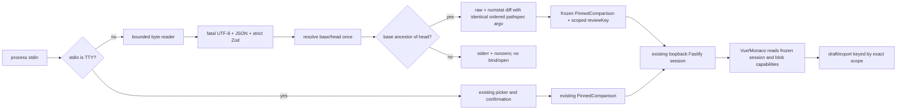

# Phase 12: Request Protocol & Range Grounding - Research

**Researched:** 2026-08-04
**Domain:** bounded stdio protocol, immutable Git ranges, native pathspec scope, provenance
**Confidence:** HIGH for codebase integration; MEDIUM for external API guidance

<user_constraints>
## User Constraints (from CONTEXT.md)

### Locked Decisions

No locked implementation decisions were supplied. The phase boundary is:

> Phase 12 introduces the machine entry path: coding agents can submit one safe, versioned range request whose exact Git scope is pinned before the browser opens, while developers retain the existing interactive launch path.

### the agent's Discretion

All implementation choices are at Claude's discretion — discuss phase was skipped per user setting. Use ROADMAP phase goal, success criteria, and codebase conventions to guide decisions.

### Deferred Ideas (OUT OF SCOPE)

None — discuss phase skipped.
</user_constraints>

<phase_requirements>
## Phase Requirements

| ID | Description | Research Support |
|---|---|---|
| AGENT-01 | An agent can pipe one versioned JSON review request into Cumpa without encountering an interactive prompt. | Dispatch on stdin ownership before Inquirer, then decode one EOF-delimited bounded JSON document. |
| AGENT-02 | Malformed, oversized, invalid UTF-8, unknown-field, unsupported-version, and non-exclusive-mode requests fail actionably and nonzero before browser launch. | Use byte-first accumulation, fatal UTF-8 decode, one `JSON.parse`, and strict Zod schemas; preserve the existing pre-launch error boundary. |
| AGENT-03 | TTY launch retains the existing interactive picker flow. | Leave `runCli()` unchanged and add a thin dispatcher ahead of it; retain `tests/cli/selection.test.ts` as the regression authority. |
| RANGE-01 | A request carries one explicit contiguous base/head range resolved once to full commit IDs. | Resolve both revision strings once, use `merge-base --is-ancestor`, and build the comparison only from pinned OIDs. |
| RANGE-02 | Ordered include/exclude pathspecs keep native Git semantics. | Append exact request strings after `--` to both raw and numstat diff invocations; do not filter or interpret in TypeScript. |
| RANGE-03 | Inventory, blobs, drafts, and feedback remain tied to the pinned commits and exact pathspec scope. | Add a domain-separated scoped review key and immutable range provenance; thread it through session, draft, and export ownership. |
</phase_requirements>

## Summary

The shortest safe implementation is a new non-TTY adapter around the existing interactive path, not a second CLI. `src/cli/run.ts` currently enters Commander/Inquirer and the existing launch runtime binds Fastify and opens the browser; therefore mode selection, stdin validation, revision resolution, ancestry validation, and inventory creation must finish before `launchPinnedSession()` is called. The current `runCli()` selection order is already covered by tests and should remain untouched. [VERIFIED: `src/cli/run.ts`, `tests/cli/selection.test.ts`]

Range grounding should extend the native Git path already in use. The repository already resolves commit-ish values with `rev-parse --verify --end-of-options <revision>^{commit}`, invokes Git through argument arrays with `shell: false`, obtains raw and numstat inventories from two `git diff` calls, and reads blobs by object ID. Add a range-specific builder that accepts already-resolved base/head OIDs, requires ancestry, uses the base OID itself as the diff base, and passes ordered pathspecs identically to both diff calls. [VERIFIED: `src/git/comparison.ts`, `src/git/runner.ts`, `src/git/inventory.ts`, `src/git/objects.ts`]

The most important cross-cutting change is scope identity. Existing `comparisonKey(baseOid, headOid)` and export directory naming ignore pathspecs, so two reviews over the same commits but different filters can currently collide if reused for agent ranges. Keep current interactive identity byte-for-byte, but derive an agent range `reviewKey` from a domain tag, mode, pinned OIDs, and length-framed ordered pathspec strings, then use that key for draft/export storage and include immutable range provenance in session/export data. [VERIFIED: `src/domain/comparison-key.ts`, `src/server/draft-loader.ts`, `src/server/draft-store.ts`, `src/server/export-store.ts`, `src/export/review-export.ts`]

**Primary recommendation:** preserve `runCli()` and the current comparison path; add one strict stdin request boundary plus one range adapter that normalizes into the existing pinned comparison, using native Git for ancestry/pathspec semantics and a scoped review key for persistence.

## Architectural Responsibility Map

| Capability | Primary Tier | Secondary Tier | Rationale |
|---|---|---|---|
| stdin ownership, framing, and diagnostics | CLI / Node process | Shared contracts | The terminal process owns stream bytes and must reject before prompts or server launch. |
| request shape and version | Shared contracts | CLI | One Zod authority validates runtime input and derives TypeScript types. |
| revision and ancestry semantics | Git adapter | CLI | Installed Git is already the semantic authority. |
| pathspec selection | Git adapter | Shared provenance | Git selects files; provenance preserves the exact submitted argv strings. |
| immutable file inventory and blobs | Git adapter | Server capability layer | Inventory stores blob OIDs; server capabilities read those exact objects. |
| draft/export namespace | Persistence / export | Domain identity | Scope identity must distinguish the same commits reviewed with different ordered pathspecs. |
| review-scope presentation | Vue browser UI | Session API | The browser displays frozen server scope and never edits or reapplies it. |

## Existing Seams and File/Symbol Impact

| File / symbol | Planned impact | Why |
|---|---|---|
| `src/cli/run.ts` — `run`, `runCli`, `launchPinnedSession` | Narrow dispatch edit | Decide TTY versus request before Inquirer; preserve `runCli()` and the packaged `CUMPA_LAUNCH_OPTIONS` test seam. [VERIFIED: codebase] |
| `src/contracts/*` — new request schema | New focused module | Strict, versioned request contract shared by CLI and tests; no parallel TypeScript interface. |
| `src/cli/*` — new request reader/orchestrator | New focused module | Byte cap, fatal UTF-8, JSON/Zod errors, stderr-only failures, and range launch orchestration do not belong in Commander action glue. |
| `src/git/comparison.ts` | Extract/reuse lower-level pinned builder | Interactive source selection and requested range ancestry differ, while object verification, inventory, availability, and freezing should remain single-source. |
| `src/git/inventory.ts` — `createChangedFileInventory` | Optional ordered `pathspecs` | Append the same exact elements after `--` in both raw and numstat commands. |
| `src/git/runner.ts` | Controlled pathspec environment | Neutralize inherited `GIT_LITERAL_PATHSPECS`, `GIT_GLOB_PATHSPECS`, `GIT_NOGLOB_PATHSPECS`, and `GIT_ICASE_PATHSPECS` for request-scoped commands. |
| `src/domain/comparison-key.ts` | Add scoped key; retain old function | Interactive drafts must not move; agent range scope must not collide. |
| `src/contracts/comparison.ts` — `PinnedComparisonSchema` | Add immutable optional/discriminated range provenance | Carry range status and ordered pathspecs without creating a second comparison model. |
| `src/server/capabilities.ts` | Consume caller-supplied review key and expose range scope | Draft, API, and export capabilities must share one frozen scope owner. |
| `src/server/draft-loader.ts`, `draft-store.ts`, `export-store.ts` | Use scoped key/directory for range sessions | Prevent cross-scope draft/export collision while leaving interactive storage stable. |
| `src/contracts/session.ts`, `src/export/review-export.ts` | Add validated range provenance | Session UI and returned feedback need pinned OIDs plus exact ordered pathspecs. |
| `src/ui/components/IdentityHeader.vue`, `IdentityPanel.vue`, `src/ui/App.vue` | Conditional range copy/panel/empty-error states | Approved UI spec reuses existing identity disclosure and focus behavior. |
| `tests/performance/production-picker.mjs` | Document incompatibility; do not add a bypass | It pipes branch text through non-TTY stdin while emulating Inquirer. That input must now be treated as a malformed agent request. A true PTY is required if this historical benchmark is retained. [VERIFIED: codebase] |

## Standard Stack

No dependency or version upgrade is needed. [VERIFIED: `package.json`, `.planning/research/STACK.md`]

| Component | Existing version / floor | Phase use |
|---|---:|---|
| Node.js | `>=24`; workstation `v24.15.0` | `process.stdin.isTTY`, async Readable iteration, `Buffer`, `TextDecoder`, `JSON.parse`, crypto hash. [VERIFIED: `package.json`, local runtime] |
| Zod | `4.4.3` | `z.strictObject`, literal schema version/mode, refinements, inferred request types. [VERIFIED: `package.json`] |
| Git CLI | project floor `>=2.43`; workstation Apple Git `2.50.1` | Commit peel, ancestry, raw/numstat diff, pathspec semantics. [VERIFIED: codebase Git capability policy, local runtime] |
| Vitest | `4.1.10` | Contract, dispatch, identity, and Git fixture tests. [VERIFIED: `package.json`] |
| Playwright | `1.61.1` | Real packaged pipe-to-browser range flow and scope UI. [VERIFIED: `package.json`] |

### Package Legitimacy Audit

Not applicable: Phase 12 should install no external package. Native Node APIs, installed Zod, installed Git, and existing test frameworks cover the work. [VERIFIED: codebase and `.planning/research/STACK.md`]

## Recommended Request Contract

Use one EOF-delimited JSON document. Do not add NDJSON, length-prefix framing, a streaming parser, a CLI flag, or an HTTP agent endpoint. Node Readables support async iteration, making a small byte-bounded reader sufficient. [CITED: https://nodejs.org/docs/latest-v24.x/api/stream.html#readablesymbolasynciterator]

Recommended Phase 12 shape:

```ts
const RevisionRangeSchema = z.strictObject({
  base: boundedGitString,
  head: boundedGitString,
  pathspecs: z.array(boundedGitString).max(MAX_PATHSPEC_COUNT).default([]),
});

const AgentReviewRequestV1Schema = z.strictObject({
  kind: z.literal('cumpa.review-request'),
  schemaVersion: z.literal(1),
  mode: z.literal('revisions'),
  revisions: RevisionRangeSchema,
});
```

`boundedGitString` must be non-empty and reject NUL, lone UTF-16 surrogates, and values over an explicit UTF-8 byte limit. Top-level and nested objects must be strict. Zod 4 documents `z.strictObject()` for rejecting unknown keys; a literal discriminator permits a later strict `patch` union branch without ambiguous optional fields. [CITED: https://zod.dev/api#objects]

Published v1 protocol constants are `MAX_AGENT_REQUEST_BYTES = 1_048_576` (1 MiB), `MAX_GIT_ARGUMENT_BYTES = 4_096` (4 KiB per decoded Git string), and `MAX_PATHSPEC_COUNT = 256`. The total byte cap matches the repository's existing one-MiB text/object ceiling, while field/count caps prevent a small JSON envelope from creating excessive argv. These exact limits are part of the public request contract and any later change requires an explicit protocol-version compatibility decision. [VERIFIED: `src/git/availability.ts`; RESOLVED: Phase 12 protocol policy]

Read bytes in this order:

1. Select the owner before importing/starting prompt behavior: TTY goes to existing `runCli()`; non-TTY goes to the agent request reader.
2. Iterate stdin chunks as bytes, increment cumulative bytes before retaining the chunk, and fail immediately above the total ceiling.
3. At EOF, reject empty input; concatenate only after the byte check.
4. Decode once with `new TextDecoder('utf-8', { fatal: true })`; fatal decoding throws instead of replacing malformed bytes. [CITED: https://developer.mozilla.org/en-US/docs/Web/API/TextDecoder/TextDecoder]
5. Call `JSON.parse` once. It naturally rejects malformed text, trailing non-whitespace, and multiple JSON values.
6. Parse the result as `unknown` through the strict versioned schema.
7. Resolve and validate Git scope; only then call the existing launch runtime.

Use stable failure categories (`empty-request`, `request-too-large`, `invalid-utf8`, `malformed-json`, `unsupported-version`, `invalid-request`, `invalid-revision`, `non-ancestor-range`, `invalid-pathspec`) and one concise remedy. Write diagnostics only to stderr, set nonzero exit status, and never echo the raw request or arbitrary control characters. [RECOMMENDED]

## Architecture Patterns

### System Architecture Diagram



### Pattern 1: Resolve once, consume OIDs only

```ts
const baseOid = await resolveCommit(request.revisions.base, runner, signal);
const headOid = await resolveCommit(request.revisions.head, runner, signal);
await requireAncestor(baseOid, headOid, runner, signal);
return createPinnedComparisonFromOids({
  baseOid,
  headOid,
  diffBaseOid: baseOid,
  pathspecs: request.revisions.pathspecs,
});
```

`git rev-parse --verify --end-of-options <name>^{commit}` verifies one commit-ish and blocks option interpretation; `git merge-base --is-ancestor A B` is the native ancestry predicate. [CITED: https://git-scm.com/docs/git-rev-parse] [CITED: https://git-scm.com/docs/git-merge-base]

Equality must be accepted for agent ranges: a commit is its own ancestor, and an equal base/head produces a valid zero-change pinned review. Do not reuse the current interactive equal-endpoint rejection for this path. [VERIFIED: Git ancestry semantics and `.planning/research/FEATURES.md`]

### Pattern 2: Thread native pathspecs through both inventory protocols

```ts
const scope = ['--', ...pathspecs];
await runner.run([...rawDiffArguments, baseOid, headOid, ...scope], options);
await runner.run([...numstatDiffArguments, baseOid, headOid, ...scope], options);
```

Preserve array order and exact string spelling. Do not sort, deduplicate, slash-normalize, pre-expand, infer inclusion/exclusion, or perform a post-hoc JavaScript filter. Git defines pathspec magic and exclusion behavior; forwarding the same argv to both calls keeps metadata/numstat joins consistent and avoids fetching excluded blobs. [CITED: https://git-scm.com/docs/gitglossary#Documentation/gitglossary.txt-aiddefpathspecapathspec] [VERIFIED: `src/git/inventory.ts`]

Keep the existing `.cumpa` internal-path exclusion as a separate repository invariant after Git selection. Test it under pathspec-scoped calls; do not encode it by mutating the submitted pathspec list. [VERIFIED: `src/git/inventory.ts`, `tests/git/inventory.test.ts`]

### Pattern 3: Domain-separated scoped persistence identity

Retain `comparisonKey(baseOid, headOid)` for interactive sessions. For agent ranges, hash a domain tag plus length-framed values: mode, base OID, head OID, pathspec count, and each ordered pathspec's UTF-8 bytes. Do not concatenate with a delimiter and do not include moving revision names in the storage key. The exact same resolved scope should resume the same draft; any pathspec insertion, removal, reordering, or spelling change must produce another key. [VERIFIED: existing length-framed pattern in `src/domain/comparison-key.ts`; RECOMMENDED]

### Pattern 4: One comparison model, optional range provenance

Normalize agent ranges into the existing `PinnedComparison`; do not fork file, blob, comment-anchor, availability, or capability models. Add a discriminated/optional range provenance member carrying submitted endpoint labels, pinned full OIDs, ordered pathspecs, and scoped review key. Expose only the browser fields required by the approved UI; retain full request provenance for accepted feedback/export. [VERIFIED: current shared comparison/session/export contracts; RECOMMENDED]

## Don't Hand-Roll

| Problem | Don't build | Use instead | Why |
|---|---|---|---|
| stream framing | streaming JSON/NDJSON parser | cumulative byte counter + EOF + one `JSON.parse` | There is exactly one bounded request. |
| unknown-field/mode validation | manual property checks | strict Zod literals/objects | One schema owns runtime and static contract. |
| revision parsing | regex or revision grammar | existing `resolveCommit`/Git commit peel | Git refs and object formats are authoritative. |
| ancestry | commit graph traversal | `git merge-base --is-ancestor` | Handles repository graph semantics and exit status. |
| pathspec matching | minimatch/glob/filter code | exact argv after `--` to Git | Git magic, exclude-only behavior, attributes, and case rules are complex. |
| immutable content | reread worktree/ref names | frozen inventory blob OIDs + object reader | Existing object capabilities already resist ref/worktree drift. |
| scoped identity | joined strings | domain-separated length-framed SHA-256 | Avoid delimiter ambiguity and storage collision. |
| range request UI | browser form/editor | existing identity disclosure, read-only scope | The browser is reviewer, not protocol repair/builder. |

## Approved UI Contract Impact

The approved `12-UI-SPEC.md` is implementation authority. For range sessions only:

- Reuse `IdentityHeader` and `IdentityPanel`; header action is exactly **View review scope**, panel title **Review scope**. Show both full 40-character OIDs and ordered pathspecs; if none, render **All changed paths**. [VERIFIED: `12-UI-SPEC.md`]
- Render pathspecs from the server snapshot in an ordered list with `controlSafeDisplay()`. Do not sort, truncate, normalize, glob, or label include/exclude semantics in the browser. [VERIFIED: `12-UI-SPEC.md`, `src/domain/path-bytes.ts`]
- Keep `FileTree` server-authoritative and Monaco bound to pinned blob responses. No client filtering and no refresh/follow-ref action. [VERIFIED: `12-UI-SPEC.md`, current UI flow]
- Preserve existing desktop region and narrow dialog focus containment, Escape close, and focus return. [VERIFIED: `src/ui/components/IdentityPanel.vue`, `src/ui/App.vue`]
- Use the exact empty/error strings in `12-UI-SPEC.md`; do not add a protocol-error screen. Invalid requests never launch a browser. [VERIFIED: `12-UI-SPEC.md`]
- Do not add Finish/Cancel controls, patch presentation, canonical result rendering, or protocol JSON editing in this phase. [VERIFIED: `12-UI-SPEC.md`, roadmap phase boundaries]

## Common Pitfalls

### Starting Inquirer before deciding stdin ownership
**What goes wrong:** the prompt consumes piped JSON or an invalid pipe falls into an interactive wait.
**Avoidance:** make the TTY/non-TTY decision before calling `runCli()` or constructing picker behavior. Preserve the internal packaged-launch test seam deliberately. [VERIFIED: `src/cli/run.ts`]

### Decoding before bounding
**What goes wrong:** unbounded accumulation or replacement decoding hides malformed UTF-8.
**Avoidance:** count raw bytes before retention, then fatal-decode once after EOF. Include split-chunk invalid sequences and exact boundary tests. [CITED: Node/MDN stream and TextDecoder docs]

### Treating both endpoints like the interactive picker
**What goes wrong:** merge-base selection broadens the submitted range, or equal endpoints are rejected.
**Avoidance:** explicit range requires base to be ancestor of head and uses base itself as diff base; allow equality. [CITED: Git merge-base documentation]

### Re-resolving refs later
**What goes wrong:** a moving branch changes inventory, blob reads, draft identity, or exported provenance after launch.
**Avoidance:** record submitted labels for display/audit but never use them after the initial two commit resolutions. Test forced ref movement after launch. [VERIFIED: existing pinned object architecture]

### Passing pathspecs to only one diff command
**What goes wrong:** raw metadata and numstat records disagree, causing join failures or misleading counts.
**Avoidance:** one ordered scope array is appended to both commands after `--`. [VERIFIED: `src/git/inventory.ts`]

### Letting inherited Git environment rewrite semantics
**What goes wrong:** `GIT_LITERAL_PATHSPECS`, `GIT_GLOB_PATHSPECS`, `GIT_NOGLOB_PATHSPECS`, or `GIT_ICASE_PATHSPECS` changes the same JSON request's meaning.
**Avoidance:** explicitly remove these variables in the controlled range command environment; retain Git's default native semantics. [CITED: https://git-scm.com/docs/git#Documentation/git.txt-codeGITLITERALPATHSPECScode]

### Reusing commit-pair-only draft/export identity
**What goes wrong:** two filtered reviews over identical OIDs overwrite or reopen each other's draft/export.
**Avoidance:** use the scoped review key at all persistence/publication call sites; test order-sensitive collisions. [VERIFIED: current key/store code]

### Adding a test-only non-TTY interactive bypass
**What goes wrong:** production accepts malformed piped branch text or the protocol owner becomes ambiguous.
**Avoidance:** do not preserve `tests/performance/production-picker.mjs` by sniffing whether input looks like JSON. Unit-test the TTY branch through dependency injection; migrate the benchmark to a real PTY only if it remains a release gate. [VERIFIED: benchmark harness]

## Concrete Test Strategy

`.planning/config.json` explicitly disables Nyquist validation, so no Wave 0 validation architecture is required. The implementation plan should nevertheless update focused existing tests because each requirement changes an observable trust-boundary contract. [VERIFIED: `.planning/config.json`]

| Requirement | Focused proof | Suggested location / command |
|---|---|---|
| AGENT-01 | Non-TTY one-document request calls no picker/confirm, resolves range, and launches exactly once. Packaged binary accepts a real piped request. | new `tests/cli/request.test.ts`; focused Vitest command; packaged E2E case in `tests/e2e/pinned-session.spec.ts` |
| AGENT-02 | Table: empty, exact cap + 1, malformed JSON, trailing second value, invalid UTF-8 across chunks, unknown root/nested field, unsupported version, missing/wrong mode, NUL/lone surrogate, excessive pathspec count. Each: nonzero, bounded actionable stderr, zero stdout, zero server bind/browser open. | `tests/cli/request.test.ts` plus existing `tests/cli/errors.test.ts` launch spies |
| AGENT-03 | Existing event order discover → pick → pin → confirm → launch is unchanged when injected stdin owner is TTY. | retain `tests/cli/selection.test.ts` |
| RANGE-01 | Real Git fixtures: ancestor accepted, equal accepted with zero files, sibling/reversed range rejected, tag-to-commit accepted, non-commit object rejected; recording runner proves raw names appear only in the two `rev-parse` calls. | `tests/git/comparison.test.ts` |
| RANGE-02 | Recording runner proves exact ordered pathspec elements appear after `--` in both diff calls. Real fixtures cover include-only, exclude-only, `:(literal)`, `:(glob)`, `:(icase)`, leading `-`, special characters, invalid magic, and valid zero-match scope. | `tests/git/inventory.test.ts` |
| RANGE-03 | Same OIDs + different ordered scopes yield different review keys/draft/export paths; identical scope is stable. Moving refs/worktree after launch does not change session inventory, blobs, draft namespace, or exported scope. | `tests/unit/comparison-key.test.ts`, `tests/server/draft-load.test.ts`, `tests/api/session.test.ts`, export contract tests |
| UI spec | Scope button/panel exact copy, full OIDs, ordered control-safe pathspecs, All changed paths, exact zero-state/error retry, narrow dialog focus/Escape/return, and no client-side filter. | `tests/e2e/pinned-session.spec.ts` |

The packaged end-to-end case must spawn the generated binary with stdin/stdout/stderr pipes and verify request failures never produce a URL/open event. It should use the repository's existing browser opener spy/seam rather than actually opening an external browser. [VERIFIED: existing CLI/E2E test conventions]

Do not treat a narrowed unit suite as final evidence: after implementation the executor should run the focused request/Git/API/UI commands and then the repository's normal full unit/API/E2E checks. This research task itself intentionally runs no tests, builds, linters, or formatters per user constraint.

## Security Domain

Security enforcement is enabled at ASVS Level 1. [VERIFIED: `.planning/config.json`]

### Applicable ASVS Categories

| ASVS Category | Applies | Standard control |
|---|---|---|
| V2 Authentication | No new mechanism | Preserve existing random bearer token; request JSON cannot set it. [VERIFIED: server security code] |
| V3 Session Management | Yes, unchanged | Preserve fragment bootstrap, same-origin/host checks, loopback binding, and token-protected routes. [VERIFIED: server architecture] |
| V4 Access Control | Yes, unchanged | Continue opaque per-file blob/comment capability IDs; never expose request-controlled object IDs as routes. [VERIFIED: `src/server/capabilities.ts`] |
| V5 Input Validation | Yes | Byte cap → fatal UTF-8 → JSON → strict Zod → Git option separators/ancestry. |
| V6 Cryptography | Yes | Use `node:crypto` SHA-256 for domain-separated review keys and existing cryptographic session tokens; do not hand-roll. |

### Threat Patterns

| Pattern | STRIDE | Mitigation |
|---|---|---|
| unbounded/malformed stdin | Denial of Service | Count raw bytes before concatenate/decode; field/count caps; bounded diagnostics. |
| unknown or dual-mode fields | Tampering | Strict root/nested Zod schemas and literal version/mode. |
| revision option/shell injection | Tampering / Elevation | `shell: false`, argument arrays, `--end-of-options`, commit peel. |
| pathspec option injection | Tampering | Literal `--` before exact pathspec argv; reject NUL. |
| inherited global pathspec mode | Tampering | Remove pathspec-global Git environment variables for request commands. |
| ref movement after validation | Tampering / Repudiation | Resolve once and retain full OIDs; never fetch content through submitted refs again. |
| same-commit cross-scope collision | Tampering / Repudiation | Domain-separated, order-sensitive review key used by draft/export and returned provenance. |
| terminal control/data disclosure | Spoofing / Information disclosure | Stable stderr categories, `controlSafeDisplay` for values, no raw JSON echo, zero stdout on failure. |
| request-controlled network/session settings | Elevation | Schema exposes only review source/scope; host, port, token, browser command, and capability IDs remain internal. |

## Environment Availability

| Dependency | Required by | Available | Version | Fallback |
|---|---|---:|---|---|
| Node.js | stdin/Zod/CLI runtime | Yes | `v24.15.0` | None required |
| Git | revision, ancestry, pathspec, inventory | Yes | `git version 2.50.1 (Apple Git-155)` | None; Git is required product authority |
| Existing npm dependencies | contracts/server/UI/tests | Yes | lockfile/package versions above | No new dependency |

No missing external dependency blocks planning. [VERIFIED: local runtime probes and `package.json`]

## Assumptions Log

| # | Claim | Section | Risk if wrong |
|---|---|---|---|
| A1 | The published v1 limits are 1 MiB total request bytes, 4 KiB per decoded Git string, and 256 pathspecs. | Request Contract | A later change is a protocol compatibility decision and must retain explicit versioned behavior. |
| A2 | The Phase 12 discriminator is named `mode: "revisions"`; Phase 13 can add a strict `patch` union branch without changing schemaVersion 1. | Request Contract | If product terminology requires `range`, wire shape and fixtures change; behavior and architecture do not. |
| A3 | Submitted revision labels belong in canonical feedback provenance, while storage identity uses only resolved OIDs and ordered pathspecs. | Scope identity | If privacy/minimal-result policy excludes raw labels, exports should omit them while retaining OIDs/pathspecs. |

## Open Questions (RESOLVED)

1. **Published numeric request/field/count limits**
   - Resolution: schema version 1 publishes a 1 MiB (`1_048_576` byte) total request ceiling, a 4 KiB (`4_096` UTF-8 byte) ceiling for every revision/pathspec string, and at most 256 pathspecs.
   - Contract policy: export these constants from the shared request contract, reject boundary violations before Git or browser launch, and cover exact-limit plus over-limit cases. Changing a published limit later requires an explicit protocol-version compatibility decision.

2. **Range export schema-version policy**
   - Resolution: preserve existing interactive canonical exports as strict `ReviewExportV1` documents with byte-for-byte version-1 behavior. Range exports use a strict `ReviewExportV2` document carrying requested labels, pinned full OIDs, exact ordered pathspecs, and the server-derived range review key.
   - Compatibility policy: parse/render the two versions through a strict discriminated union; never emit range provenance under schema version 1 and never silently upgrade an existing interactive export.

3. **Native Git attribute pathspec magic**
   - Resolution: accept attribute pathspec magic exactly as submitted and delegate its interpretation to installed Git with the same ordered argv used for both inventory diff protocols.
   - Semantics: Cumpa does not parse, allowlist, normalize, expand, or otherwise reinterpret attribute or other native pathspec magic. Git evaluates attribute predicates using its native launch-time rules; Cumpa freezes the resulting inventory and preserves the exact submitted string in provenance. Invalid native magic is translated at the range/process boundary into a stable actionable pre-browser error.

## Sources

### Primary codebase sources (HIGH confidence)
- `12-CONTEXT.md`, `12-UI-SPEC.md`, `ROADMAP.md`, `REQUIREMENTS.md` — phase boundary, requirements, approved browser behavior.
- `src/cli/run.ts`; `tests/cli/selection.test.ts`; `tests/cli/errors.test.ts` — launch/prompt/error boundaries.
- `src/git/runner.ts`, `comparison.ts`, `inventory.ts`, `objects.ts` — safe Git invocation, commit pinning, inventory, immutable blobs.
- `src/domain/comparison-key.ts`; server draft/export stores; session/export contracts — current identity/provenance gap.
- Vue identity/session components and `tests/e2e/pinned-session.spec.ts` — existing disclosure/focus/UI patterns.

### Official documentation (MEDIUM confidence per research seam)
- https://nodejs.org/docs/latest-v24.x/api/process.html#processstdin — stdin and TTY process stream.
- https://nodejs.org/docs/latest-v24.x/api/stream.html#readablesymbolasynciterator — async Readable consumption.
- https://developer.mozilla.org/en-US/docs/Web/API/TextDecoder/TextDecoder — fatal invalid-data behavior.
- https://zod.dev/api#objects — strict objects and schema validation.
- https://git-scm.com/docs/git-rev-parse — verified revision parsing and option boundary.
- https://git-scm.com/docs/git-merge-base — ancestry predicate.
- https://git-scm.com/docs/git-diff — native diff/pathspec interface.
- https://git-scm.com/docs/gitglossary#Documentation/gitglossary.txt-aiddefpathspecapathspec — pathspec magic/exclusion semantics.
- https://git-scm.com/docs/git#Documentation/git.txt-codeGITLITERALPATHSPECScode — pathspec environment variables.

## Metadata

**Confidence breakdown:**
- Standard stack: HIGH — all components are already installed and used; no package recommendation.
- Architecture: HIGH — based on direct end-to-end code seam tracing and approved phase/UI contracts.
- External API semantics: MEDIUM — Context7/web research was verified against official Node, Zod, and Git documentation.
- Numeric limits: HIGH as the published Phase 12 protocol policy — explicit product limits, not an external standard.

**Research date:** 2026-08-04
**Valid until:** 2026-09-03; recheck only if Phase 12 contracts or approved UI spec change.
