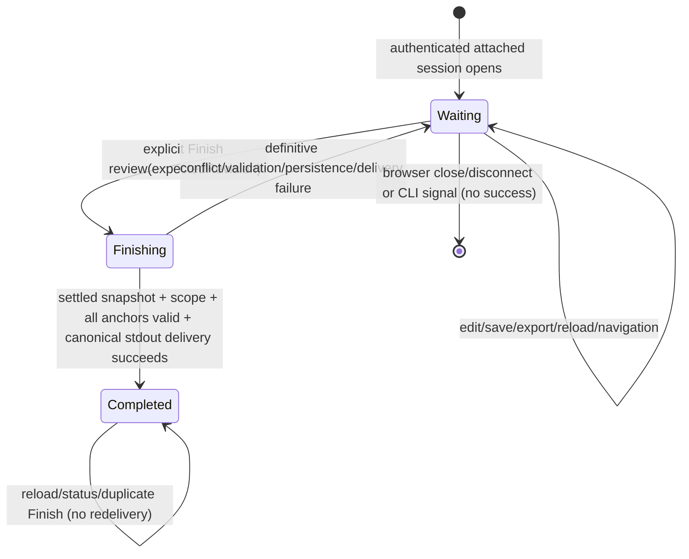

# Phase 14: Attached Lifecycle & Canonical Completion — Research

**Researched:** 2026-08-05
**Domain:** Server-authoritative attached review lifecycle, settled draft validation, canonical terminal delivery
**Confidence:** HIGH

<user_constraints>
## User Constraints (from CONTEXT.md)

### Locked Decisions
All implementation choices are at Claude's discretion — discuss phase was skipped per user setting. Use ROADMAP phase goal, success criteria, and codebase conventions to guide decisions.

### the agent's Discretion
All implementation choices are at Claude's discretion — discuss phase was skipped per user setting. Use ROADMAP phase goal, success criteria, and codebase conventions to guide decisions.

### Deferred Ideas (OUT OF SCOPE)
None — discuss phase skipped.
</user_constraints>

<phase_requirements>
## Phase Requirements

| ID | Description | Research Support |
|---|---|---|
| HAND-01 | Either input mode opens the existing authenticated human browser workspace with file navigation, Monaco diffs, comments, summary, persistence, and export behavior. | Reuse `createSessionApp` / `createExactPatchSessionApp`, the current session routes, `App.vue`, and `ReviewPanel.vue`; add attached metadata and completion state rather than a second workspace. |
| HAND-02 | The developer can explicitly Finish review; browser close, reload, ordinary export, and disconnect do not report successful completion. | Add one server-authoritative completion coordinator and one explicit finish route/action. No existing route or browser lifecycle event is a completion signal. |
| HAND-03 | The invoking CLI remains attached until completion and writes exactly one canonical JSON success document to stdout while URLs, progress, and diagnostics stay on stderr. | Make the non-TTY launch await the coordinator; add a dedicated stdout writer and retain `output` as stderr. Resolve completion only after delivery and HTTP response settlement, then shut down. |
| HAND-04 | Returned JSON binds comments, summary, and drift-detectable anchors to the exact submitted range/pathspec or patch identity. | Reuse `buildReviewExportV2` for range requests and `buildReviewExportV3` for exact-patch requests, with the accepted draft and `verifyAnchor` results. |
| HAND-05 | Finish validates pending draft state and anchors before returning feedback; stale feedback fails explicitly instead of being emitted as successful. | Put completion behind the same per-draft serialization queue as mutations; re-read current bytes, enforce expected revision and identity, validate scope and every recorded anchor, then canonicalize and deliver once. |
</phase_requirements>

## Summary

Phase 14 should be a narrow extension of the Phase 12/13 substrate. The current code already has strict request and API schemas, authenticated loopback routes, repository-local CAS draft persistence, durable-anchor verification for both range and exact-patch sessions, provenance-bound export builders, canonical JSON serialization, a common Vue workspace, and injected CLI output/shutdown seams. The missing unit is a server-authoritative, one-shot completion coordinator that joins the draft store's mutation serialization boundary and delivers the already-supported canonical review document to the waiting CLI. [VERIFIED: `.planning/phases/14-attached-lifecycle-canonical-completion/14-PATTERNS.md`; `src/server/app.ts`; `src/server/capabilities.ts`; `src/server/draft-store.ts`; `src/export/review-export.ts`; `src/cli/run.ts`]

The browser must request completion but must neither construct nor own the canonical result. Completion is successful only after the server has settled the accepted revision, revalidated submitted scope, verified every recorded anchor without rebinding it, canonicalized one range V2 or exact-patch V3 document, and completed the CLI delivery callback. The route then confirms the immutable completed state; after its response settles, the CLI can close the server deterministically. Export, close, reload, navigation, save, zero-feedback state, and disconnect remain non-transitions. [VERIFIED: `14-UI-SPEC.md:19-23,122-170,288-300`; `src/export/review-export.ts:92-250`; `src/server/lifecycle.ts:56-92`]

**Primary recommendation:** add one in-memory per-session completion coordinator, expose it through the existing capability registry and authenticated route set, execute its validation inside the draft store's existing per-key serialization queue, reuse canonical `ReviewExportV2`/`ReviewExportV3` bytes as the terminal success document, and keep stdout delivery exclusively in the non-TTY CLI owner.

## Architectural Responsibility Map

| Capability | Primary Tier | Secondary Tier | Rationale |
|---|---|---|---|
| Attached session mode and waiting process | CLI | API / Backend | The non-TTY CLI owns stdin, stdout/stderr, server lifetime, and final process status. |
| One-shot lifecycle authority | API / Backend | CLI | The server accepts the authenticated explicit action and owns waiting/finishing/completed state; the CLI supplies the terminal delivery callback. |
| Settled accepted draft | Database / Storage (repository JSON) | API / Backend | `DraftStore` owns serialized CAS and atomic replacement; completion must join that boundary. |
| Scope and anchor validation | API / Backend | Git / frozen patch snapshot | Capabilities already expose range drift observation, patch snapshot status, content reads, and `verifyAnchor`. |
| Canonical result/provenance | API / Backend | CLI | Export builders and canonical serializer construct bytes; the CLI emits those bytes unchanged. |
| Completion presentation | Browser / Client | API / Backend | Vue renders server state and sends the sole explicit action; it does not infer success or produce canonical JSON. |

[VERIFIED: `src/cli/run.ts:150-174,182-313,366-499`; `src/server/capabilities.ts:87-113,244-696`; `src/server/draft-store.ts:81-92,233-319`; `src/web/App.vue`; `src/web/api/client.ts`; approved `14-UI-SPEC.md`]

## Evidence-Grounded Recommendation

### Canonical document choice

Use the existing review export documents directly as the returned success document:

- Range request: `buildReviewExportV2(acceptedSnapshot, range, completedAt)`.
- Exact-patch request: `buildReviewExportV3(acceptedSnapshot, patchScope, completedAt)`.
- Bytes: `canonicalizeReviewExport(document)` exactly once; optionally round-trip with `parseCanonicalReviewExport(bytes)` at the completion boundary before delivery.

Do not add a completion wrapper, a second serializer, a browser receipt, or a new persisted feedback format. V2 already includes the exact `RangeReviewScope` (`requestedBase`, `requestedHead`, pinned OIDs, pathspecs, `reviewKey`); V3 already includes exact-patch digest, validation target, review key, and snapshot status. Both carry accepted revision, summary, comments, lossless paths, durable anchors, and their verification records. The builders reject identity mismatches and the canonicalizer rejects unsupported values and produces deterministic no-whitespace bytes without a trailing newline. [VERIFIED: `src/contracts/comparison.ts:38-48`; `src/contracts/draft.ts:279-444`; `src/export/review-export.ts:29-50,59-90,92-250`; `tests/unit/review-export.test.ts:105-278`]

The CLI writes one decoded canonical byte sequence to stdout with no added newline. URL, fallback instructions, progress, denials, grounding errors, signal diagnostics, delivery errors, and shutdown errors use the existing `output`/`console.error` path. Add `stdout` as a separate injected dependency; `tests/cli/request.test.ts` already declares an unused `stdout` test seam that Phase 14 can formalize. [VERIFIED: `src/cli/run.ts:194-215,366-499`; `tests/cli/request.test.ts:250-353`; `src/export/review-export.ts:219-250`]

### Completion coordinator

Use a single session-local coordinator with a minimal state union:

```ts
type AttachedCompletionState =
  | { kind: 'waiting' }
  | { kind: 'finishing'; expectedRevision: number }
  | { kind: 'completed'; revision: number }
  | { kind: 'failed'; failure: FinishReviewFailure };
```

Its `finish(expectedRevision)` method must suppress concurrent duplicate calls, perform one validation/delivery attempt, and return strict public discriminants such as `completed`, `revisionConflict`, `staleAnchors`, `scopeInvalid`, `draftReadOnly`, `persistenceFailure`, `deliveryFailed`, and `alreadyCompleted`. A definitive failure returns the coordinator to a retryable unfinished state only after the current attempt settles. A completed coordinator is immutable; repeated requests return status and never deliver again. Reload reads the same server-authoritative status. Ambiguous browser disconnect never triggers an automatic retry. [VERIFIED: approved `14-UI-SPEC.md:122-195`; existing discriminated-result conventions in `src/contracts/api.ts:162-203`; one-shot shutdown convention in `src/server/lifecycle.ts:56-92`]

The coordinator should be created by the CLI launch runtime and injected into `createSessionApp` / `createExactPatchSessionApp`. This keeps terminal delivery outside browser/API code while allowing the route to await it. Register a completion status/finish capability only for non-TTY attached sessions; ordinary interactive `launchPinnedComparison` continues without attached metadata or finish routes. [VERIFIED: `src/cli/run.ts:108-174,182-313,443-499`; `src/server/app.ts:26-39,113-160`; `14-UI-SPEC.md:19-23,106-118`]

### Settled persistence and validation order

Completion must execute in this order inside the draft store's per-repository/comparison queue:

1. Join the same `runSerialized(queueKey, …)` boundary used by `mutate`; do not call an unqueued `loadState()` and then validate outside the queue.
2. Load canonical draft bytes inside the critical section. Reject `malformed`, `schemaInvalid`, and `newerUnsupported`; do not recover or overwrite during finish.
3. Cumpa the supplied `expectedRevision` with the current accepted revision. On mismatch return both expected and actual revisions and no bytes.
4. Clone/freeze the accepted draft and retain a fingerprint of the raw canonical bytes.
5. Revalidate the attached identity: exact frozen range plus selector observation for range mode; digest/target/review key plus current patch snapshot status for exact-patch mode.
6. Verify every accepted comment's exact recorded anchor through `capabilities.verifyAnchor`. Any `stale` or `orphaned` result fails the whole finish. Never rewrite, relocate, or reactivate the record.
7. Build V2/V3 from that accepted snapshot and exact submitted provenance; canonicalize once.
8. Immediately before delivery, re-check that canonical draft revision/raw fingerprint and scope observation are unchanged. This mirrors export publication revalidation and closes validation-to-delivery races.
9. Invoke the CLI-owned one-shot delivery callback. Only after it succeeds transition to immutable `completed`.
10. Return the typed success response. Resolve CLI shutdown only after the Fastify response has settled so the browser can receive confirmation.

[VERIFIED: `src/server/draft-store.ts:81-92,124-172,233-319`; `src/server/capabilities.ts:364-477,525-687`; `src/export/review-export.ts:92-217`; approved `14-UI-SPEC.md:132-170`]

The existing `runSerialized` function is file-private, so expose the smallest store operation that holds the queue while producing a validated current snapshot (for example `settle(expectedRevision, operation)`), rather than copying a second mutex into capabilities. This is necessary: `loadState()` is currently unqueued, while `mutate()` and `recover()` are queued. A capabilities-only load/validate/load sequence would still allow a mutation between the final check and terminal delivery. [VERIFIED: `src/server/draft-store.ts:36,81-92,233-319`]

## Concrete Handoff State and Lifecycle



- `Waiting` is the initial attached state for both range and exact-patch input modes, including an empty accepted review. [VERIFIED: `14-UI-SPEC.md:124-138`]
- `Finishing` locks browser mutations and ordinary export, but not file/diff navigation. The server, not the disabled button, supplies race safety. [VERIFIED: `14-UI-SPEC.md:140-146`]
- `Completed` means canonical terminal delivery has succeeded exactly once. It makes review mutation/export/finish immutable and remains queryable for reload until shutdown. [VERIFIED: `14-UI-SPEC.md:148-153,174-195`]
- Export, close, reload, navigation, disconnect, save, comment resolution, and zero-feedback state have no edge to `Completed`. [VERIFIED: `14-UI-SPEC.md:164-170,288-300`]
- A signal or terminal failure shuts down unfinished with a nonzero status and stderr diagnostic; it never fabricates stdout success. [VERIFIED: `src/server/lifecycle.ts:21-92`; `src/cli/run.ts:202-224,379-439`]

## Exact File and Symbol Targets

| Layer | File / symbol | Required Phase 14 change |
|---|---|---|
| Request/contracts | `src/contracts/api.ts`: `SessionResponseSchema`, existing strict request/result schemas | Add strict attached-session metadata and strict status/finish request/result discriminants. Reuse `RevisionSchema`; reject unknown fields. |
| Canonical contract | `src/contracts/draft.ts`: `ReviewExportV2Schema`, `ReviewExportV3Schema`, `AnchorVerificationSchema` | Reuse unchanged as canonical result/provenance contract unless a narrowly named type alias improves API readability. Do not add a parallel feedback schema. |
| App assembly | `src/server/app.ts`: `CreateSessionAppOptions`, `CreateExactPatchSessionAppOptions`, `SessionApp`, `createSessionApp`, `createExactPatchSessionApp` | Accept optional attached completion coordinator; expose attached capability only when injected; preserve interactive construction. |
| Capability/service | `src/server/capabilities.ts`: `CapabilityRegistryOptions`, `CapabilityRegistry`, `createCapabilityRegistry`, `createExactPatchCapabilityRegistry`, `exportReview`, `verifyAnchor` | Add attached status/finish capabilities. Reuse export snapshot construction and mode-specific identity checks, but do not call `exportReview` because publication consent is separate. |
| Serialized persistence | `src/server/draft-store.ts`: `runSerialized`, `DraftStore`, `createDraftStore`, `commit` | Add the smallest queued settled-snapshot operation so completion and mutations share one critical section. Preserve atomic canonical bytes and explicit read-only failures. |
| Read-only load | `src/server/draft-loader.ts`: `DraftLoadState`, `createDraftLoader` | Reuse current `malformed` / `schemaInvalid` / `newerUnsupported` states; no new recovery during finish. |
| Routes | `src/server/routes.ts`: `registerSessionRoutes`, `unavailable`, status-switch convention from `/api/export` | Add authenticated empty-query status GET and bounded strict finish POST. Map malformed/security to generic unavailable, conflict/stale/read-only to 409, persistence/delivery to 500, first completion to 201, immutable already-completed status without redelivery. |
| CLI owner | `src/cli/run.ts`: `OrdinaryActionDependencies`, `createLaunchRuntime`, `launchExactPatchSession`, `runOrdinaryAction`, `PinnedSessionLaunch` | Add separate `stdout`, common attached coordinator/awaiting launch for both modes, stderr-only launch diagnostics, exact single canonical write, response-settlement wait, deterministic shutdown/status. Do not alter TTY path. |
| Shutdown | `src/server/lifecycle.ts`: `createShutdownController` | Reuse idempotent shutdown; completion ordering should call it only after result delivery and finish response settlement. |
| Browser client | `src/web/api/client.ts`: `SessionClient`, `createSessionClient`, `requestJson` | Parse attached metadata/status and finish discriminants with Zod. Browser never receives or reconstructs terminal canonical bytes. |
| Browser state | `src/web/App.vue`: `reviewDraft`, `reviewFailure`, `mutateReview`, session loading, `ReviewPanel` props/events | Own waiting/finishing/completed/failure state; compute readiness from accepted revision, pending/conflict/read-only status, and unsaved buffers; reload server status; lock actions during finishing/completed. |
| Browser UI | `src/web/components/ReviewPanel.vue`: props/emits, sections ending with `ExportSection`; `IdentityHeader.vue`; `InlineNotice.vue`; `ui/ReviewStateBadge.vue` | Append the approved attached completion section after Export, only for attached sessions; add header fact and exact approved copy/focus/accessibility states. |
| Existing export UI | `src/web/components/ExportSection.vue`, `ExportReceipt.vue` | Keep mechanics unchanged; add only attached-unfinished support copy after export success. |
| Canonical builder | `src/export/review-export.ts`: `AcceptedReviewSnapshotV1`, `AcceptedExactPatchReviewSnapshot`, `buildReviewExportV2`, `buildReviewExportV3`, `canonicalizeReviewExport`, `parseCanonicalReviewExport` | Reuse for final document. Build/canonicalize once and pass bytes unchanged to CLI. |

[VERIFIED: current declarations in every listed source file; bounded analog map in `14-PATTERNS.md`]

## Existing Browser Integration

`App.vue` already owns the authenticated session, accepted canonical draft snapshot, pending mutation, conflict, retained unsaved buffers, review failures, exact-patch status, selector drift, export state, and the single `SessionClient`. `mutateReview` calls `reviewState.start`, updates only after parsed server acceptance, records conflicts with the latest canonical draft, and retains unsaved buffers on failure. `ReviewPanel.vue` already receives canonical/buffer/pending/conflict/failure/export state, emits explicit mutations, uses real disabled states, focuses alerts, and renders Export as its final section. [VERIFIED: `src/web/App.vue:92-98,325-439`; `src/web/model/review-draft-state.ts:20-35,115-171`; `src/web/components/ReviewPanel.vue:30-72,275-605`]

Therefore add completion state to `App.vue` and pass a compact typed prop/event contract to `ReviewPanel.vue`; do not serialize it into the draft or workspace state. `tests/unit/workspace-state.test.ts:297-305` already protects the boundary that browser-session state is not repository draft data. The approved UI copy and behavior in `14-UI-SPEC.md:102-244` are locked implementation inputs. [VERIFIED: cited current source/test and approved UI spec]

## CLI stdout/stderr Ownership

| Channel | Owns | Must never contain |
|---|---|---|
| stdout | Exactly one canonical V2/V3 JSON success document, no added newline | URL, browser fallback, progress, errors, stack traces, shutdown text, second success |
| stderr | URL, browser fallback, progress, bounded validation/grounding/delivery diagnostics, security denials, signals, shutdown failures | Canonical success document or any secret request content |
| browser response | Typed lifecycle status/revision and actionable failure data | Canonical JSON bytes, copy/download/reveal affordance, terminal diagnostics |

[VERIFIED: HAND-03; `src/cli/run.ts:194-215,366-499`; `tests/cli/request.test.ts:250-353`; `14-UI-SPEC.md:117-118,164-170,288-297`]

Recommended terminal order:

1. stderr URL/fallback; open browser.
2. await completion coordinator while process/server remain attached.
3. on valid finish, perform the single stdout write and await write completion/backpressure.
4. let finish route send server confirmation and observe response settlement.
5. invoke idempotent shutdown and set exit status 0.
6. on any non-success terminal path, keep stdout empty, emit one bounded stderr diagnostic, set nonzero status, and shut down.

A partial OS-level stdout write cannot be rolled back. Treat write callback rejection/`EPIPE` as terminal delivery failure, never retry automatically, never mark server state completed, and keep browser copy truthful that no confirmed return occurred. [VERIFIED: Node stream ownership is localized to CLI; failure policy follows approved no-ambiguous-retry contract in `14-UI-SPEC.md:155-170`]

## TDD Implementation Seams

The project has `workflow.tdd_mode: true` and `workflow.nyquist_validation: false`; plans should still implement each observable contract test-first, but no separate Nyquist wave is required. [VERIFIED: `.planning/config.json:16-47`]

1. **Contract seam first:** extend `tests/cli/request.test.ts` and `tests/api/draft-lifecycle.test.ts` with strict schema/status cases before modifying `src/contracts/api.ts`.
2. **Coordinator seam:** add a focused unit/API test with injected delivery callback and draft store, proving waiting → finishing → completed, definitive failure → waiting, and duplicate suppression.
3. **Persistence race seam:** extend `tests/api/draft-atomicity.test.ts` using injected `DraftFileSystem` barriers so a mutation racing Finish either settles into the accepted result or causes an explicit revision conflict—never a mixed snapshot.
4. **Provenance seam:** extend `tests/unit/review-export.test.ts` with the exact completion inputs and assert byte identity, no newline, stable hash, V2 range binding, V3 patch binding, and rejection of mismatched identity/stale anchor.
5. **Route seam:** extend `tests/api/session.test.ts` / `draft-conflict.test.ts` / `export.test.ts` using Fastify `inject()` to prove auth, strict body/query, status mappings, export non-completion, and no duplicate delivery.
6. **Browser state seam:** extend `tests/integration/complete-review-panel.spec.ts` for approved visibility, readiness, locks, exact copy/focus, immutable success, and no implicit transitions.
7. **Packaged handoff seam:** extend `tests/e2e/complete-review-draft.spec.ts` and existing `tests/e2e/agent-ready-export*.spec.ts` helpers for both range and exact-patch non-TTY requests, asserting exactly one stdout canonical document and stderr-only URL/diagnostics.

## Test Matrix

| Requirement / contract | Test target | Observable assertion |
|---|---|---|
| HAND-01 range workspace | `tests/e2e/complete-review-draft.spec.ts` | Non-TTY range opens the existing authenticated file/Monaco/review/export workspace and shows attached UI. |
| HAND-01 exact-patch workspace | `tests/e2e/agent-ready-export.spec.ts` or a bounded adjacent attached spec using its packaged helpers | Exact patch opens the same workspace with frozen patch presentation and attached UI; no second workspace. |
| HAND-01 TTY isolation | `tests/cli/request.test.ts`; `tests/integration/complete-review-panel.spec.ts` | TTY dispatch remains interactive and attached fact/Finish are absent. |
| HAND-02 explicit-only transition | `tests/integration/complete-review-panel.spec.ts` | Export, rail close, reload, navigation, save, empty review, and disconnect do not invoke Finish or show success. |
| HAND-02 one-shot authority | `tests/api/session.test.ts` (or adjacent `attached-completion.test.ts`) | Concurrent/double Finish invokes delivery once; completed status is immutable and reloadable. |
| HAND-03 channel ownership | `tests/cli/request.test.ts` | Success produces one canonical stdout item and diagnostics only on stderr; every failure leaves stdout empty. |
| HAND-03 process ordering | packaged CLI test in `tests/e2e/complete-review-draft.spec.ts` | CLI remains alive while waiting, emits after explicit Finish, then closes only after confirmed response; SIGINT/SIGTERM yield no stdout success. |
| HAND-04 range provenance | `tests/unit/review-export.test.ts` | Returned canonical V2 bytes contain exact requested revisions, pinned OIDs, pathspec order/value, review key, accepted revision, summary, comments, anchors. |
| HAND-04 patch provenance | `tests/unit/review-export.test.ts` | Returned canonical V3 bytes contain exact digest, validation target, review key, snapshot status; spoofed identity is rejected. |
| HAND-04 deterministic bytes | `tests/unit/review-export.test.ts`; `tests/package/agent-ready-export.test.ts` | Different insertion orders produce identical canonical bytes/hash; bytes parse canonically and have no trailing newline. |
| HAND-05 pending mutation race | `tests/api/draft-atomicity.test.ts` | Shared queue produces either settled newer accepted snapshot or explicit conflict, never stale/mixed success. |
| HAND-05 read-only/persistence | `tests/api/draft-recovery-faults.test.ts` | Malformed/schema-invalid/newer draft and temp/rename failures return unfinished failures; canonical bytes remain intact. |
| HAND-05 stale anchor | `tests/api/draft-lifecycle.test.ts`; `tests/git/anchored-content.test.ts` | Any stale/orphaned accepted anchor blocks all result delivery and recorded anchor bytes remain unchanged. |
| HAND-05 range drift / patch drift | `tests/api/export.test.ts` plus exact-patch status fixture | Scope or patch status changing during validation/revalidation yields explicit unfinished failure, no stdout. |
| Browser recovery truth | `tests/integration/complete-review-panel.spec.ts` | Conflict/stale/read-only/disconnect messages use approved copy, focus recovery only, no anchor relocation or auto retry. |
| Ordinary export independence | `tests/e2e/agent-ready-export-safety.spec.ts` | Confirmed export receipt still leaves attached review waiting and stdout empty. |

[VERIFIED: existing test analogs and titles in `tests/cli/request.test.ts`, `tests/api/*`, `tests/unit/review-export.test.ts`, `tests/unit/workspace-state.test.ts`, `tests/integration/complete-review-panel.spec.ts`, `tests/e2e/complete-review-draft.spec.ts`, `tests/e2e/agent-ready-export*.spec.ts`, and `14-PATTERNS.md`]

## Threat and Race Matrix

| Threat / race | Failure mode | Required mitigation | Required proof |
|---|---|---|---|
| Unauthenticated/cross-origin finish | Local page or hostile origin completes review | Reuse loopback host/origin/Bearer hook, strict route schema, generic denial body, no secret echo | Fastify injection for missing/wrong token, host, origin, query, content type, unknown fields; delivery callback untouched |
| Double click / concurrent Finish | Two canonical documents or conflicting states | Coordinator CAS `waiting → finishing → completed`; all concurrent callers share/observe one attempt; completed never redelivers | Two concurrent requests, delivery count exactly 1, stdout count exactly 1 |
| Mutation arrives just before Finish | Latest accepted edit silently excluded | Finish and mutate share `runSerialized` queue; validate `expectedRevision` after queue acquisition | Barrier-controlled race yields latest accepted result or explicit conflict |
| Mutation arrives during validation | Mixed accepted draft/result | Hold queue through final fingerprint/scope revalidation and delivery, or otherwise freeze mutations behind coordinator lock | Mutation cannot commit between final revalidation and completion delivery |
| Stale browser revision | Old UI completes newer draft unknowingly | Strict `RevisionSchema` CAS with expected/actual response, no bytes | 409 conflict and empty stdout |
| Corrupt/newer/read-only draft | Completion overwrites or guesses state | Reject load state; never recover inside Finish; preserve canonical bytes | Fault tests assert byte identity and unfinished state |
| Range selector drift | Result appears bound to reviewed bytes after source changed | Observe exact submitted range identity and revalidate observation immediately before delivery; no acknowledgement bypass | Moved/unavailable endpoint produces scope failure, not success |
| Exact-patch content drift/snapshot loss | Result no longer grounded in submitted patch | Require digest/target/review key match and current snapshot status before and immediately before delivery | Drift/loss fixture produces explicit failure and no stdout |
| Stale/orphaned anchor | Feedback refers to different/unavailable line | Verify every recorded anchor; any non-verified state blocks whole finish; never rebind | Stale/orphaned fixture remains byte-identical and no result emitted |
| Identity spoof in builder input | Draft from one scope returned for another | V2/V3 builder identity equality plus Zod schema parse | Mismatched range/review key/digest/target rejected |
| Canonicalization ambiguity | Same feedback has multiple byte encodings | Existing canonical serializer, valid Unicode/plain finite JSON constraints, canonical parse round-trip, one build | Stable bytes across ordering, no whitespace/newline, noncanonical input rejected |
| Export mistaken for completion | Ordinary receipt wakes agent | Separate `exportReview` and Finish capabilities/coordinator; export never resolves completion | Export succeeds while state remains waiting and stdout empty |
| Browser close/reload/disconnect | Client infers success or replays request | No unload lifecycle call; reload GETs server state; ambiguous disconnect has no auto retry | Browser tests show unfinished/reconnect copy and no delivery |
| CLI stdout contamination | Agent cannot parse exact result | Separate `stdout` and stderr dependencies; all launch/error paths use stderr | Captured streams assert canonical stdout only |
| stdout `EPIPE` / partial write | Server claims returned result when delivery failed | Await write completion; delivery error prevents completed state; no automatic retry after ambiguous write | Inject failing writer, expect delivery failure, nonzero exit, no browser success |
| Server closes before finish response flushes | Browser sees disconnect instead of confirmed success | Resolve CLI shutdown latch from route response settlement/on-response, after completed state | Instrumented order: write → response completion → shutdown |
| Shutdown signal during finishing | Partial result or hung listener | Abort active work, make shutdown idempotent, never mark completed unless delivery finished | SIGINT/SIGTERM race gives deterministic nonzero status and at most zero/one whole success |
| Error detail leakage | Git/path/token/draft data appears in diagnostics | Reuse generic API error and bounded CLI messages; no raw exception/request echo | Security and request tests assert secrets/raw Git stderr absent |

[VERIFIED: security controls in `src/server/security.ts:49-150`; serialization/atomicity in `src/server/draft-store.ts:81-92,124-172,233-319`; provenance/revalidation in `src/server/capabilities.ts:364-477,525-687`; canonicalization in `src/export/review-export.ts:59-90,219-250`; approved failure/retry behavior in `14-UI-SPEC.md:155-195`]

## Security Domain

### Applicable ASVS Categories

| ASVS Category | Applies | Existing / required control |
|---|---|---|
| V2 Authentication | Yes | Per-session 256-bit random Bearer token, timing-safe comparison, token kept in URL fragment then API header; finish uses same hook. |
| V3 Session Management | Yes | Session-local in-memory one-shot coordinator, loopback-only authority, no cache, immutable completed state, deterministic shutdown. |
| V4 Access Control | Yes | Finish capability exists only for attached sessions; TTY session omits attached metadata/action. |
| V5 Input Validation | Yes | Strict Zod request/result schemas, bounded body, empty-query guard, revision schema, generic errors. |
| V6 Cryptography | Yes | Existing `node:crypto` random bytes and SHA-256 fingerprints/hashes; no new cryptography. |
| V12 Files and Resources | Yes | Accepted draft remains repository-local atomic JSON; completion performs no source-control or export-file write. |
| V13 API and Web Service | Yes | Explicit status codes, authenticated same-origin loopback API, no-store/CSP/frame denial, no raw errors. |

[VERIFIED: `src/server/security.ts:1-150`; `src/contracts/api.ts`; `src/server/draft-store.ts`; approved `14-UI-SPEC.md:284-301`]

## Don't Hand-Roll

| Problem | Do not build | Use instead |
|---|---|---|
| Feedback result format | New completion JSON wrapper/serializer | Existing `ReviewExportV2Schema` / `ReviewExportV3Schema` and builders |
| Concurrency | Second mutex in routes/capabilities | Extend the existing draft store `runSerialized` boundary |
| Exactly-once UI inference | Browser local flag, retry loop, unload handler | Server coordinator with immutable completed state |
| Anchor relocation | Fuzzy matching or current-line fallback | Existing `verifyAnchor` and explicit stale/orphaned failure |
| Scope refresh | Re-resolve refs/pathspecs or current worktree fallback | Frozen range/patch provenance and mode-specific current validation |
| Terminal transport | Browser copy/download, temp result file, extra IPC protocol | CLI-owned stdout callback with existing process lifetime |
| Auth/errors | Finish-specific tokens or raw exceptions | Existing session security hook and generic API errors |
| UI primitives | New workspace, modal, toast framework, design system | Existing `App`, `ReviewPanel`, `InlineNotice`, `ReviewStateBadge`, CSS tokens |

## Common Pitfalls

1. **Using `exportReview` as Finish.** It mixes separate publication consent, drift acknowledgement, gitignore/export receipts, and filesystem writes into lifecycle completion. Reuse its snapshot/revalidation pattern, not the operation. [VERIFIED: `src/server/capabilities.ts:364-477,625-687`; `14-UI-SPEC.md:164-170,288-300`]
2. **Loading twice outside the draft queue.** The current `loadState()` is not serialized; a mutation can land after the last read. Put the full accepted-snapshot transaction behind `runSerialized`. [VERIFIED: `src/server/draft-store.ts:81-92,233-319`]
3. **Treating button disabling as race safety.** Network requests and other tabs can race. Browser readiness is presentation only; server CAS/queue is authoritative. [VERIFIED: `14-UI-SPEC.md:132-146`]
4. **Resolving the CLI latch before the response is sent.** Immediate shutdown can convert real completion into an ambiguous browser disconnect. Await response settlement before closing Fastify. [VERIFIED: `src/server/lifecycle.ts:56-92`; `14-UI-SPEC.md:146-170`]
5. **Writing `JSON.stringify(document) + '\n'`.** That violates canonical byte identity and exact stdout. Use `canonicalizeReviewExport` and write its decoded bytes unchanged. [VERIFIED: `src/export/review-export.ts:59-90,219-250`]
6. **Accepting stale verification records in the result.** Ordinary exports record verification state, but HAND-05 requires Finish to reject stale feedback. Require every accepted comment's fresh verification to be `verified`. [VERIFIED: HAND-05; `src/export/review-export.ts:92-217`]
7. **Persisting lifecycle into the review draft.** Attached waiting/completed state is session-local and should not change the existing draft schema or collide with interactive identities; HAND-06 isolation remains Phase 15. [VERIFIED: `tests/unit/workspace-state.test.ts:297-305`; `14-UI-SPEC.md:299-300`]

## Out of Scope

- HAND-06 identity collision/isolation, multi-request switching, and concurrent reviewer UI belong to Phase 15.
- No source-control mutation, new draft/export format, new browser workspace, request dashboard, terminal monitor, canonical-result browser action, component dependency, or design-system initialization.
- No change to ordinary export mechanics, anchor relocation semantics, exact-patch frozen-content rules, file inventory, Monaco rendering, comment semantics, or summary semantics.

[VERIFIED: `.planning/REQUIREMENTS.md:30-35`; `.planning/ROADMAP.md:71-99`; `14-UI-SPEC.md:288-301`]

## Assumptions Log

No assumed claims. Recommendations derive from current source, tests, Phase 14 requirements/roadmap, the bounded `14-PATTERNS.md` analog map, and the approved `14-UI-SPEC.md`.

## Sources

### Primary (HIGH confidence)

- `.planning/REQUIREMENTS.md:30-34` — HAND-01 through HAND-05.
- `.planning/ROADMAP.md:71-89` — Phase goal, five success criteria, and planned sequencing.
- `.planning/phases/14-attached-lifecycle-canonical-completion/14-CONTEXT.md` — phase boundary and discretion.
- `.planning/phases/14-attached-lifecycle-canonical-completion/14-UI-SPEC.md` — approved attached lifecycle, exact copy, interaction, failure, and non-goal contract.
- `.planning/phases/14-attached-lifecycle-canonical-completion/14-PATTERNS.md` — bounded analog locations.
- `src/contracts/{request,api,comparison,draft}.ts` — strict inputs, session identity, revision, anchor, export contracts.
- `src/server/{app,routes,capabilities,draft-store,draft-loader,security,lifecycle}.ts` — app assembly, authenticated routes, frozen capabilities, persistence, and shutdown.
- `src/export/review-export.ts` — accepted snapshot builders, provenance matching, canonical serialization/parsing/hash.
- `src/cli/run.ts` and `src/cli/request.ts` — non-TTY dispatch, launch ownership, output and shutdown seams.
- `src/web/App.vue`, `src/web/api/client.ts`, `src/web/model/review-draft-state.ts`, `src/web/components/ReviewPanel.vue`, `src/web/components/IdentityHeader.vue` — existing browser integration.
- Named test paths in the Test Matrix — current observable contract/fault-injection conventions.

## Metadata

**Confidence breakdown:**
- Architecture: HIGH — direct current-source contracts and approved UI spec agree.
- Lifecycle/concurrency: HIGH — existing serialized persistence and one-shot shutdown patterns expose the exact missing seam.
- Canonical result/provenance: HIGH — V2/V3 builders and canonical byte tests already cover both input modes.
- Browser integration: HIGH — current Vue ownership and exact approved Phase 14 UI contract are explicit.
- Threat/race mitigations: HIGH — grounded in existing security, CAS, atomicity, revalidation, and failure-state patterns.

**Research date:** 2026-08-05
**Valid until:** Phase 14 source implementation begins or any cited contract changes.

## Final Research Closure

All HAND-01 through HAND-05 are mapped to concrete implementation symbols, test seams, lifecycle transitions, canonical provenance rules, persistence ordering, terminal ownership, browser integration, and threat/race mitigations. No external package, environment dependency, runtime-state migration, or package legitimacy gate is needed for this bounded phase.

No unresolved research questions, blockers, or warnings.
