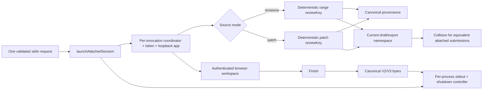

# Phase 15: Adversarial Integration Gate - Research

**Researched:** 2026-08-06
**Domain:** Request-scoped persistence, export, browser, completion, stream, and shutdown isolation
**Confidence:** HIGH — findings are grounded in the current production code, tests, and Phase 15 planning inputs.

<user_constraints>
## User Constraints (from CONTEXT.md)

### Locked Decisions

Agent-submitted and interactive review scopes remain isolated across the complete production handoff, including repeated equivalent submissions and failure paths.

### the agent's Discretion

All implementation choices are at Claude's discretion — discuss phase was skipped per user setting. Use ROADMAP phase goal, success criteria, and codebase conventions to guide decisions.

### Deferred Ideas (OUT OF SCOPE)

None — discuss phase skipped.
</user_constraints>

<phase_requirements>
## Phase Requirements

| ID | Description | Research Support |
|----|-------------|------------------|
| HAND-06 | Agent-submitted scopes cannot collide with each other or with existing interactive draft/export identities. | The current collision is traced from deterministic source keys through draft and export paths. The scenario matrix below covers equivalent attached submissions, attached-versus-interactive isolation, success/failure isolation, exact output ownership, and both range and patch modes. [VERIFIED: `.planning/REQUIREMENTS.md:28-35`; `src/domain/comparison-key.ts:3-38`; `src/server/draft-loader.ts:89-96`; `src/server/export-store.ts:121-142`] |
</phase_requirements>

## Summary

Phase 15 is not a new review workflow. It is a narrow isolation correction plus adversarial integration evidence around the production workflow completed in Phases 12–14. The current implementation already creates a separate Fastify app, loopback port, bearer token, `AttachedCompletionCoordinator`, stdout sink, shutdown controller, and patch snapshot per attached launch. Those process/session resources are correctly local to one invocation. [VERIFIED: `src/cli/run.ts:400-475`; `src/server/app.ts:113-160`; `src/server/attached-completion.ts:11-96`]

The remaining HAND-06 gap is persistence identity. Range `reviewKey` and exact-patch `reviewKey` are deterministic source-provenance keys. `draftPaths()` and `stableNameFor()` currently reuse those keys as storage namespaces. Two equivalent attached submissions therefore address the same `.cumpa/drafts/<reviewKey>.json` and `.cumpa/exports/<reviewKey>/` locations, even though they own independent coordinators, browser tokens, and stdout streams. [VERIFIED: `src/domain/comparison-key.ts:26-38`; `src/server/patch-snapshot.ts:134-140`; `src/server/draft-loader.ts:89-96`; `src/server/export-store.ts:121-142`; `src/server/capabilities.ts:615-623,756-805`]

**Primary recommendation:** retain deterministic `reviewKey` as immutable source provenance, but give every attached invocation a trusted server-created, domain-prefixed storage scope key and use that key only for its draft queue/path and export directory. Do not change interactive identities, request JSON, canonical V2/V3 provenance, browser authentication, or completion semantics. [VERIFIED design derived from the collision trace above; HIGH confidence]

## Architectural Responsibility Map

| Capability | Primary Tier | Secondary Tier | Rationale |
|------------|--------------|----------------|-----------|
| Allocate attached invocation identity | CLI / process orchestration | — | `launchAttachedSession()` is the single boundary entered once per validated non-TTY request and already creates the token/coordinator. [VERIFIED: `src/cli/run.ts:400-441`] |
| Select draft namespace and serialization queue | Server persistence | CLI | `createDraftStore()` obtains `canonicalPath` and `queueKey` from the loader key; both must use the same invocation scope. [VERIFIED: `src/server/draft-store.ts:141-151`; `src/server/draft-loader.ts:89-96`] |
| Select export directory | Server export publication | CLI | Publication must separate storage name from document provenance while retaining atomic candidate-to-stable publication. [VERIFIED: `src/server/export-store.ts:121-154,211-318`] |
| Bind reviewed source | Git/domain and canonical export | Server | Range and patch `reviewKey` fields continue to bind pinned OIDs/pathspecs or patch digest/target/repository identity. [VERIFIED: `src/domain/comparison-key.ts:26-38`; `src/server/patch-snapshot.ts:134-140`; `src/contracts/draft.ts:348-454`] |
| Browser session isolation | Fastify security boundary | CLI | Each launch already receives its own token, loopback authority, and app. [VERIFIED: `src/cli/run.ts:434-459`; `src/server/security.ts`] |
| One-shot terminal result | Attached coordinator | CLI stdout/shutdown | Each launch owns one coordinator; successful delivery waits for response settlement before shutdown. [VERIFIED: `src/cli/run.ts:417-471`; `src/server/attached-completion.ts:11-96`] |

## Current Production Boundary Map



### Identity inventory

| Identity | Created by | Lifetime / visibility | Current use | Phase 15 disposition |
|----------|------------|-----------------------|-------------|----------------------|
| Interactive comparison key | `comparisonKey(baseOid, headOid)` | Durable, repository-local | Interactive draft filename and V1 provenance; interactive exports use `<baseOid>..<headOid>`. [VERIFIED: `src/domain/comparison-key.ts:18-24`; `src/server/draft-loader.ts:89-96`; `src/server/export-store.ts:127-142`] | Preserve byte-for-byte. |
| Range source `reviewKey` | `rangeReviewKey(baseOid, headOid, orderedPathspecs)` | Durable provenance | V2 range provenance, range draft filename, range export directory. [VERIFIED: `src/domain/comparison-key.ts:26-38`; `src/git/comparison.ts:498-515`; `src/server/capabilities.ts:517-550`] | Preserve in drafts/results as source identity; stop using it as attached invocation namespace. |
| Patch source `reviewKey` | SHA-256 over patch digest, target kind, and repository root | Patch snapshot/session provenance | V3 patch provenance, patch draft filename, patch export directory. [VERIFIED: `src/server/patch-snapshot.ts:134-140,451-460`; `src/server/capabilities.ts:615-623,756-805`] | Preserve in drafts/results as source identity; stop using it as attached invocation namespace. |
| Browser bearer token | `randomBytes(32).toString('base64url')` in each launcher | One live browser session; URL fragment | HTTP authorization only. [VERIFIED: `src/cli/run.ts:241-249,434-459`] | Preserve; never use or persist the bearer value as storage authority. |
| Attached coordinator | `createAttachedCompletionCoordinator()` | One launch | Finishing state, delivery promise, response-settlement latch. [VERIFIED: `src/cli/run.ts:417-441`; `src/server/attached-completion.ts:11-96`] | Preserve one instance per invocation. |
| Attached storage scope | Missing | Needed for one attached invocation | No separate identity currently exists. [VERIFIED: no field exists in `AttachedCompletionOptions` at `src/server/capabilities.ts:105-108`; draft/export select source keys at the cited paths] | Add a trusted CLI-created opaque scope, structurally prefixed for the attached namespace. |

### Exact collision chain

1. Equivalent range submissions resolve to the same pinned OIDs and ordered pathspecs, so `rangeReviewKey()` returns the same hash. Equivalent grounded patches likewise return the same patch `reviewKey`. [VERIFIED: `src/domain/comparison-key.ts:26-38`; `src/server/patch-snapshot.ts:134-140`]
2. `draftPaths()` selects `comparison.range.reviewKey` or exact-patch `comparison.reviewKey`; `createDraftStore()` also derives its process-global serialization `queueKey` from that storage key. Equivalent submissions therefore resume and serialize against the same draft. [VERIFIED: `src/server/draft-loader.ts:89-96`; `src/server/draft-store.ts:141-151`]
3. `stableNameFor()` selects the range/patch `reviewKey`, and capability reveal/export methods use the same path. Equivalent submissions therefore publish/recover through the same stable export directory. [VERIFIED: `src/server/export-store.ts:121-142,211-337`; `src/server/capabilities.ts:441-460,550-584,756-818`]
4. Coordinators and stdout streams remain per invocation, so the collision presents as cross-resume, revision conflicts, re-export refusal/overwrite risk, or feedback from the wrong persisted draft rather than a shared in-memory terminal state. [VERIFIED: `src/cli/run.ts:400-475`; `src/server/attached-completion.ts:11-96`; `tests/api/attached-completion-coordinator.test.ts:27-64`]

## Standard Stack

No package install or upgrade is required. Use the existing Node 24 APIs, TypeScript types, Vitest API harnesses, Playwright packaged-browser harness, Fastify `inject()`, current draft/export stores, and canonical serializer. [VERIFIED: `package.json:7-54`]

| Existing component | Purpose in Phase 15 | Required use |
|--------------------|---------------------|--------------|
| `node:crypto` already imported by `src/cli/run.ts` | Allocate an unguessable invocation scope | Create it once inside `launchAttachedSession()`; prefix the storage namespace (for example `agent-<64 lowercase hex>`) so it is structurally disjoint from interactive keys. [VERIFIED: `src/cli/run.ts:1-55,434-441`; recommendation HIGH] |
| `createDraftStore()` / `createDraftLoader()` | Durable draft and per-key queue | Add a trusted storage-key override without changing the persisted source comparison or optimistic revision contract. [VERIFIED: `src/server/draft-store.ts:141-151`; `src/server/draft-loader.ts:89-99`] |
| `publishReviewExport()` | Atomic JSON/Markdown publication | Separate validated storage name from `ExportPublicationIdentity`; continue validating the canonical document against deterministic range/patch provenance. [VERIFIED: `src/server/export-store.ts:121-154,211-318`] |
| `AttachedCompletionCoordinator` | One-shot Finish/delivery | Keep unchanged unless an adversarial test exposes a coordinator-local race; it already coalesces concurrent Finish and makes delivery failure terminal. [VERIFIED: `tests/api/attached-completion-coordinator.test.ts:27-64`] |
| `parseCanonicalReviewExport()` / V2/V3 schemas | Stdout proof | Parse each process's complete stdout bytes and assert its own summary/comments/provenance. [VERIFIED: `src/export/review-export.ts`; `tests/e2e/agent-ready-export.spec.ts:559-590`] |

## Recommended Architecture Pattern

### Dual identity: source provenance versus invocation storage

**Source provenance key** answers “what exact Git/patch scope was reviewed?” It remains deterministic and equal for equivalent submissions. **Invocation storage scope** answers “which attached request owns these mutable drafts, published files, and terminal handoff?” It is unique per invocation and never accepted from stdin or browser data. [VERIFIED design based on `src/contracts/request.ts`, `src/cli/run.ts:400-555`, and the identity inventory; HIGH confidence]

Recommended flow:

```text
launchAttachedSession
├── create coordinator (existing)
├── create browser bearer token (existing)
├── create attached storage scope (new, trusted, once)
└── pass all three through the existing createApp callback
    ├── draft store: .cumpa/drafts/agent-<scope>.json
    ├── export store: .cumpa/exports/agent-<scope>/review.{json,md}
    └── canonical V2/V3: retain deterministic range/patch reviewKey
```

The storage override must be threaded through the existing app/capability/store options; it must not be recomputed independently in the draft and export layers. One value is the ownership fence. [VERIFIED design; HIGH confidence]

### Files and symbols at the seam

| File / symbol | Smallest justified responsibility |
|---------------|-----------------------------------|
| `src/cli/run.ts` — `launchAttachedSession()` and its `createApp` callback type | Allocate one attached storage scope and pass it beside `coordinator`; keep TTY `createLaunchRuntime()` unchanged. [VERIFIED: `src/cli/run.ts:195-291,400-475`] |
| `src/server/capabilities.ts` — `AttachedCompletionOptions`, `createCapabilityRegistry()`, `createExactPatchCapabilityRegistry()` | Carry the trusted scope to draft/export operations for both source modes without changing session/result provenance. [VERIFIED: `src/server/capabilities.ts:95-131,262-601,603-827`] |
| `src/server/app.ts` — `createAppDraftStore()`, exact-patch app composition | Apply the storage override when constructing range and patch draft stores. [VERIFIED: `src/server/app.ts:86-160`] |
| `src/server/draft-loader.ts` — `draftPaths()` / `createDraftLoader()` | Accept a validated storage key override while still classifying persisted content against its deterministic `DraftComparison`. [VERIFIED: `src/server/draft-loader.ts:48-76,89-166`] |
| `src/server/draft-store.ts` — `createDraftStore()` | Ensure canonical path and `runSerialized()` queue use the same overridden key. [VERIFIED: `src/server/draft-store.ts:81-92,141-151`] |
| `src/server/export-store.ts` — `publishReviewExport()` and stable-name validation | Use a distinct trusted stable storage name while `matchesPublicationIdentity()` continues validating document provenance. [VERIFIED: `src/server/export-store.ts:121-154,211-318`] |

### Do not hand-roll or broaden

| Problem | Do not build | Use instead | Why |
|---------|---------------|-------------|-----|
| Invocation isolation | Lock service, database, daemon, global registry, or client-provided ID | One trusted per-launch scope threaded through existing options | One process handles one request; the filesystem stores already provide atomicity. [VERIFIED: `src/cli/request.ts:59-95`; `src/cli/run.ts:503-555`] |
| Provenance identity | A second range/patch hashing algorithm | Existing `rangeReviewKey()` and patch snapshot `reviewKey()` | These already bind the exact reviewed source and current schemas enforce them. [VERIFIED: `src/domain/comparison-key.ts:26-38`; `src/contracts/draft.ts:348-454`] |
| Result transport | Wrapper JSON, newline framing, IPC, polling, SSE, or a second serializer | Existing canonical V2/V3 bytes and per-process stdout | The CLI already writes supplied bytes exactly and waits for response settlement. [VERIFIED: `src/cli/run.ts:371-380,464-471`] |
| Browser isolation | New routes or browser storage authority | Existing distinct token/port/app per launch | Security and browser ownership are already per invocation. [VERIFIED: `src/cli/run.ts:434-459`; `src/server/security.ts`] |
| Test harness | New fake UI or fake CLI | Existing packed CLI + real loopback server + Chromium harness | This is the production boundary HAND-06 must prove. [VERIFIED: `tests/e2e/agent-ready-export.spec.ts:88-177,219-293`] |

## Integration Scenario Matrix

Every roadmap success criterion is mapped below. The scenarios intentionally inspect process output, browser state, durable draft/export bytes, and process lifetime rather than only implementation fields.

| Scenario | Setup and adversarial transition | Observable assertions | Covers |
|----------|----------------------------------|-----------------------|--------|
| **S1 — equivalent attached ranges stay independent through sequential Finish** | Use one `DirtyGitFixture`; spawn two packaged non-TTY CLIs with byte-equivalent revision requests; open each unique loopback URL in a separate page/context; save distinct summaries/comments; invoke ordinary Export in each; Finish A while B remains waiting, then Finish B. | URLs/tokens and attached storage paths differ; deterministic V2 `range.reviewKey` remains equal; two draft files and two export directories contain their own exact feedback; A exit is `0` with one parseable canonical document and no trailing newline; B stdout is empty and B remains live after A finishes; B then exits `0` with only B feedback; parsing each full stdout rejects concatenation/partial output. [VERIFIED harness: `tests/e2e/agent-ready-export.spec.ts:126-228,559-590`] | Roadmap 1 and 3; HAND-06 attached↔attached; browser handoff; export; stdout; successful termination. |
| **S2 — attached range cannot resume, overwrite, reveal, or publish through interactive identity** | Launch the existing packaged interactive path with `CUMPA_LAUNCH_OPTIONS` for the same base/head; save/export interactive feedback; snapshot interactive draft/export bytes; launch an attached range request for the same revisions; inspect its initial draft, save/export different feedback, Finish it, then revisit the still-running interactive page. | Attached starts `missing`/revision 0 and never displays interactive feedback; attached draft/export receipt paths use the attached namespace rather than interactive `comparisonKey` or `<baseOid>..<headOid>`; interactive bytes and browser content remain exact; attached stdout contains only attached feedback; interactive process remains alive until its own SIGINT and has no Finish-driven stdout. [VERIFIED harness: `tests/e2e/agent-ready-export.spec.ts:100-124,193-265,295-506`; identities: `src/server/draft-loader.ts:89-96`; `src/server/export-store.ts:121-142`] | Roadmap 2 and 3; HAND-06 attached↔interactive; no resume/overwrite/publish through interactive identity. |
| **S3 — equivalent exact patches survive one-session failure without cross-settlement** | Generalize the packaged attached helper to accept the existing strict request object; produce one exact already-applied patch from the real Git fixture and spawn two identical patch requests; save distinct feedback; terminate A with SIGINT while B remains open; Finish B. | A exits `130`, has zero stdout bytes, and cleans only A's listener/snapshot; B's browser, draft bytes, completion status, and stdout remain unchanged while A terminates; B later emits exactly one canonical V3 document with B feedback and exits `0`; patch source `reviewKey` is equal while attached storage scopes differ. [VERIFIED production termination: `src/server/lifecycle.ts:21-24,42-103`; patch app cleanup: `src/server/app.ts:136-160`; patch Finish: `src/server/capabilities.ts:649-695`; exact-patch API harness: `tests/api/exact-patch.test.ts:87-136`] | Roadmap 1 and 3 for patch mode; failure/shutdown isolation; no partial success. |
| **S4 — cross-coordinator race proof at the API seam** | Create two real session apps against one repository and the same source provenance but distinct attached storage scopes; gate concurrent Finish/delivery on A while mutating/exporting or finishing B; repeat A Finish after terminal settlement. | Each coordinator's `status()`, `delivery`, `responseSettled`, delivery count, draft revision, and export tree change only for that app; A repeated Finish returns `alreadyCompleted` and does not redeliver; A terminal delivery failure cannot be retried as success; B is unaffected. [VERIFIED existing primitives: `tests/api/attached-completion.test.ts:87-167`; `tests/api/attached-completion-coordinator.test.ts:27-97`] | Roadmap 3; duplicate prevention; race/collision localization below browser level. |

### Criterion traceability

| Roadmap criterion | Required scenarios | Pass condition |
|-------------------|--------------------|----------------|
| 1. Separate agent submissions over identical Git inputs retain independent request identities, drafts, exports, and returned feedback. | S1 (range) and S3 (patch) | Equal source provenance but distinct attached namespaces; durable and returned feedback never crosses. |
| 2. An agent-submitted review cannot resume, overwrite, or publish through an existing interactive review identity for the same revisions. | S2 | Attached begins empty; all interactive draft/export bytes and UI remain unchanged; path namespaces are structurally disjoint. |
| 3. Completing or failing one attached review leaves every other attached or interactive review scope unchanged and cannot emit a duplicate or partial success result. | S1, S2, S3, S4 | Other process/app remains live and byte-identical; success stdout parses as one whole canonical document; failure stdout is zero bytes; duplicate Finish cannot redeliver. |

## Exact Existing Harnesses to Reuse

### Production packaged browser harness

`tests/e2e/agent-ready-export.spec.ts` is the owning production harness and should be extended rather than creating a second packaging/server/browser scaffold. Its reusable local helpers are:

- `startGeneratedCli()` for the packaged interactive launch using `CUMPA_LAUNCH_OPTIONS`. [VERIFIED: `tests/e2e/agent-ready-export.spec.ts:100-124`]
- `startAttachedCli()` for a packaged non-TTY child with separate stdout/stderr descriptors; generalize its request argument so range and patch submissions share the same process harness. [VERIFIED: `tests/e2e/agent-ready-export.spec.ts:126-161`]
- `waitForAttachedLoopbackUrl()`, `waitForAttachedExit()`, `waitForLoopbackUrl()`, and `stopGeneratedCli()` for browser handoff and termination. [VERIFIED: `tests/e2e/agent-ready-export.spec.ts:163-218`]
- `openSession()`, `ensureReviewOpen()`, `addHeadComment()`, and `saveSummary()` for real browser mutations. [VERIFIED: `tests/e2e/agent-ready-export.spec.ts:219-258`]
- The existing `beforeAll` builds, verifies, packs, extracts, and runs the built artifact with a fake OS opener; do not duplicate these steps. [VERIFIED: `tests/e2e/agent-ready-export.spec.ts:274-293`]
- `createDirtyGitFixture()` owns real repository/worktree setup and cleanup. [VERIFIED: `tests/helpers/git-fixture.ts`; imported by `tests/e2e/agent-ready-export.spec.ts`]

### Focused server and state-machine harnesses

- `tests/api/draft.test.ts` already constructs multiple real `createSessionApp()` instances against one repository and asserts exact draft filenames/resume/isolation. Extend its `buildApp()` seam for attached storage scope coverage. [VERIFIED: `tests/api/draft.test.ts:42-112,114-181`]
- `tests/api/exact-patch.test.ts` already builds real exact-patch apps, persists summaries, publishes V3 exports, observes drift, and checks snapshot cleanup. Reuse `grounded()`, `buildApp()`, `setSummary()`, and `exportReview()`. [VERIFIED: `tests/api/exact-patch.test.ts:24-136,138-307`]
- `tests/api/export-publication.test.ts` owns stable-name, candidate publication, recovery, symlink, exact-byte, and range identity behavior. Add only the storage-name-versus-provenance assertions here. [VERIFIED: `tests/api/export-publication.test.ts:69-257`]
- `tests/api/attached-completion.test.ts` owns authenticated Finish routes for range and exact patch. [VERIFIED: `tests/api/attached-completion.test.ts:87-167`]
- `tests/api/attached-completion-coordinator.test.ts` owns concurrent Finish coalescing, retryable versus terminal outcomes, delivery count, and mutation fencing. Add cross-instance assertions without replacing these tests. [VERIFIED: `tests/api/attached-completion-coordinator.test.ts:27-97`]
- `tests/cli/request.test.ts` owns TTY/non-TTY routing, stderr/stdout ordering, cancellation at the delivery boundary, exact-patch delivery failure, and prelaunch failure silence. Preserve and extend this file only where the new attached scope must be observed at launcher composition. [VERIFIED: `tests/cli/request.test.ts:221-550`]

## Lifecycle, Race, and Collision Risks

### 1. Deterministic provenance remains overloaded as mutable ownership

**Failure:** equivalent attached sessions share draft revision and stable export directory. **Prevention:** one distinct attached storage scope, used consistently by draft path, draft queue, export publication, reveal, and recovery. **Warning sign:** any attached draft/export path still ends directly in range/patch `reviewKey`. [VERIFIED: `src/server/draft-loader.ts:89-96`; `src/server/export-store.ts:121-142`; HIGH]

### 2. “Fixing” collision by randomizing `reviewKey` destroys provenance

**Failure:** equivalent reviewed sources no longer cumpa equal and V2/V3 schema invariants or drift evidence lose their deterministic source binding. **Prevention:** keep `reviewKey` deterministic inside `DraftComparison` and canonical results; randomize only the attached storage namespace. [VERIFIED: `src/contracts/draft.ts:348-454`; `src/server/capabilities.ts:360-415,649-695`; HIGH]

### 3. Client-controlled scope becomes a filesystem authority

**Failure:** stdin/browser data chooses another review's path or injects path separators. **Prevention:** allocate the scope after request validation inside the CLI launcher; validate the trusted storage-name grammar again at the store boundary; reject unknown request fields as today. [VERIFIED: `src/cli/request.ts:59-95`; `src/contracts/request.ts`; HIGH]

### 4. Draft and export derive different invocation keys

**Failure:** UI edits one scope but Export/Reveal publishes another. **Prevention:** allocate once and thread the exact value; assert draft receipt path and export receipt path share the same scope component. [VERIFIED design; HIGH]

### 5. Cross-domain collision with legacy interactive or deterministic agent paths

**Failure:** a bare 64-hex nonce occupies the same grammar as existing comparison/range/patch keys. **Prevention:** a literal attached prefix plus fixed lowercase-hex body makes namespaces structurally disjoint; do not rely only on hash-domain probability. [VERIFIED current grammars: `src/server/draft-loader.ts:89-96`; `src/server/export-store.ts:121-142`; recommendation HIGH]

### 6. Completion isolation is tested only through object equality

**Failure:** a coordinator unit test passes while a real child writes to the wrong stdout descriptor, closes another server, or modifies shared durable state. **Prevention:** retain coordinator tests and add packaged multi-process assertions against exit code, liveness, full stdout bytes, browser content, and filesystem snapshots. [VERIFIED harness boundaries: `src/cli/run.ts:400-475`; `tests/e2e/agent-ready-export.spec.ts:126-218`; HIGH]

### 7. Shared Git drift is mistaken for cross-session mutation

**Failure:** moving a shared ref or worktree to fail A legitimately changes B's external drift observation, producing a false isolation failure. **Prevention:** use SIGINT or injected delivery failure for the “one session fails, other remains unchanged” proof; keep drift checks focused on draft/result nonpublication, not on pretending shared repository state did not move. [VERIFIED: range observer usage at `src/server/capabilities.ts:357-415`; patch observer usage at `src/server/capabilities.ts:649-695`; HIGH]

### 8. Success is inferred from a prefix or JSON parse of trimmed output

**Failure:** duplicate documents, a trailing newline, or partial bytes escape detection. **Prevention:** read the complete stdout file as bytes, require nonempty success and zero-byte failure, require no trailing newline, parse with `parseCanonicalReviewExport()`, and assert one process exit. The current production test already uses this pattern. [VERIFIED: `tests/e2e/agent-ready-export.spec.ts:559-590`; HIGH]

### 9. Signal/Finish boundary crosses delivery authorization

**Failure:** cancellation and Finish both act terminal, potentially starting stdout after failure or reporting exit 0 after cancellation. **Prevention:** preserve the existing coordinator/shutdown fence and its gated CLI regression; multi-process tests must assert failing A has zero stdout and no `exit:0`, while B remains independent. [VERIFIED: `src/cli/run.ts:417-475`; `tests/cli/request.test.ts:341-424`; HIGH]

## Observable Assertion Checklist

For every multi-scope scenario, capture before/after values and assert all of the following:

- **Identity:** loopback URL, bearer token, attached draft basename, and attached export basename are distinct; deterministic source `reviewKey` is equal for equivalent submissions. [VERIFIED target based on current identity chain; HIGH]
- **Draft:** exact directory listing, raw JSON bytes, `revision`, `summary`, comment IDs/bodies, and `comparison` provenance for every scope. Do not use mtime-only assertions. [VERIFIED existing raw-byte pattern: `tests/e2e/agent-ready-export.spec.ts:260-265`; HIGH]
- **Export:** exact directory listing, raw `review.json`/`review.md` bytes, receipt paths, and canonical parsed provenance; interactive pair remains exact. [VERIFIED existing publication assertions: `tests/api/export-publication.test.ts:69-91,207-257`; HIGH]
- **Coordinator:** `status()`, delivery count, `delivery`, `responseSettled`, repeated Finish result, and terminal delivery-failure behavior per instance. [VERIFIED: `tests/api/attached-completion-coordinator.test.ts:27-64`; HIGH]
- **Browser:** A's summary/comment never appears in B; B stays operable after A exits; interactive UI remains unchanged after attached Export/Finish. [VERIFIED existing browser helpers and assertions: `tests/e2e/agent-ready-export.spec.ts:219-258,313-415`; HIGH]
- **Streams:** stdout is empty before Finish and on failure; success is one exact V2/V3 canonical byte sequence without newline; URL/fallback/diagnostics occur only on stderr. [VERIFIED: `src/cli/run.ts:409-475`; `tests/e2e/agent-ready-export.spec.ts:559-590`; HIGH]
- **Termination:** successful child exits `0` only after Finish response settlement; SIGINT child exits `130`; completing/failing A does not change B's process liveness. [VERIFIED: `src/cli/run.ts:464-475`; `src/server/lifecycle.ts:21-24,56-103`; HIGH]
- **Cleanup:** closing one exact-patch app removes only its own snapshot; other app content remains readable. [VERIFIED: `src/server/app.ts:136-160`; `tests/api/exact-patch.test.ts:269-307`; HIGH]

## Minimal Plan Shape

Use the single roadmap placeholder plan, with three bounded implementation/verification tasks. Do not split by source mode or layer because all tasks share one storage-scope seam. [VERIFIED: `.planning/ROADMAP.md:99-112`; recommendation HIGH]

1. **Introduce the dual identity seam.** Allocate one trusted attached storage scope in `launchAttachedSession()`; thread it through app/capability options; allow draft and export stores to use it while preserving deterministic source provenance and all interactive defaults. Touch only the six production seam files named above unless a type owner requires a directly adjacent update.
2. **Prove store and coordinator isolation with focused Vitest cases.** Extend the existing draft, exact-patch, export-publication, attached-completion/coordinator, and CLI ownership tests. Cover equal provenance with distinct storage namespaces, cross-instance concurrent Finish/failure, exact raw bytes, and unchanged peers.
3. **Prove the complete packaged handoff in Chromium.** Extend `tests/e2e/agent-ready-export.spec.ts` with S1–S3, reusing its one build/package setup and real child processes. Do not create a second browser harness or mock the production app.

## Scope Fences

### In scope

- One internal per-invocation attached storage identity for both range and exact-patch modes.
- Draft path/queue, export publish/reveal path, attached coordinator, browser session, stdout, and shutdown isolation.
- Adversarial tests for equivalent submissions, interactive coexistence, success, signal/delivery failure, duplicate Finish, and exact byte preservation.
- Existing production harnesses and current canonical V2/V3 documents. [VERIFIED: Phase boundary and HAND-06]

### Explicitly out of scope

- Client-supplied request IDs, multiple requests in one process, detached/prospective patches, remote review, databases, lock services, or cross-machine coordination. AGENT-04 and PATCH-06 remain future requirements. [VERIFIED: `.planning/REQUIREMENTS.md:37-47`]
- Changing interactive draft filenames/export directories or migrating existing interactive data.
- Randomizing range/patch provenance `reviewKey`, adding a new canonical result schema solely for storage identity, or wrapping stdout.
- Reworking Git range/pathspec/patch grounding, Monaco, comment anchors, summary mutation, export Markdown, or drift rules already completed in Phases 12–14.
- Treating ordinary browser Export, reload, close, or disconnect as terminal completion.
- New dependencies, framework upgrades, new test runners, formatters, or unrelated cleanup. [VERIFIED: `package.json:35-54`; Phase boundary]

## Runtime State Inventory

Phase 15 changes a persistence namespace, so runtime state outside source files must be considered even though no migration is recommended.

| Category | Items found | Action required |
|----------|-------------|-----------------|
| Stored data | Existing interactive drafts use comparison keys; existing range/patch attached drafts and exports use deterministic review keys under `.cumpa/`. [VERIFIED: `src/server/draft-loader.ts:14,89-96`; `src/server/export-store.ts:121-142`] | Preserve all legacy files. New attached invocations must allocate new scopes and must not resume them. No data migration. |
| Live service config | No external service stores review identity; the service is one loopback Fastify app per CLI process. [VERIFIED: `src/cli/run.ts:442-459`; project architecture] | None. |
| OS-registered state | Browser launch uses the existing `open` adapter; no registered daemon/service identity is involved. [VERIFIED: `src/cli/run.ts:70-111,459-462`] | None. |
| Secrets/env vars | Browser bearer token appears in the URL fragment and authorization path; test-only `CUMPA_LAUNCH_OPTIONS` drives the packaged interactive harness. [VERIFIED: `src/cli/run.ts:241-249,434-459`; `tests/e2e/agent-ready-export.spec.ts:100-124`] | Never persist or accept the bearer token as the storage key. Keep test-only launch options out of production identity logic. |
| Build artifacts | Packaged e2e runs `dist/bin/cumpa.mjs` from an extracted `npm pack` artifact. [VERIFIED: `tests/e2e/agent-ready-export.spec.ts:34-45,274-293`] | Rebuild/package only during later verification; no migration. |

## Validation Architecture

> `.planning/config.json` sets `workflow.nyquist_validation` to `false`, but this section is included because the Phase 15 assignment explicitly requires a repository-suited validation architecture. No validation strategy file should be created. [VERIFIED: `.planning/config.json:16-24`; assignment override]

### Test Framework

| Property | Value |
|----------|-------|
| Unit/integration framework | Vitest 4.1.10, Node environment; config includes `tests/api`, `tests/cli`, `tests/unit`, `tests/git`, and `tests/package`. [VERIFIED: `package.json:46-54`; `vitest.config.ts:3-15`] |
| Browser framework | Playwright 1.61.1, Chromium, one worker, nonparallel, no retries. [VERIFIED: `package.json:46-54`; `playwright.config.ts:3-21`] |
| Production harness | `tests/e2e/agent-ready-export.spec.ts` builds, verifies, packs, extracts, and launches the generated CLI with real loopback servers and file-descriptor-separated stdout/stderr. [VERIFIED: `tests/e2e/agent-ready-export.spec.ts:88-177,274-293`] |
| Quick focused command | `./node_modules/.bin/vitest run --no-file-parallelism tests/api/draft.test.ts tests/api/exact-patch.test.ts tests/api/export-publication.test.ts tests/api/attached-completion.test.ts tests/api/attached-completion-coordinator.test.ts tests/cli/request.test.ts` |
| Packaged browser command | `npm run test:package -- tests/e2e/agent-ready-export.spec.ts` [VERIFIED: `package.json:29`; existing Phase 14 summary `.planning/phases/14-attached-lifecycle-canonical-completion/14-03-SUMMARY.md:73-78`] |
| Package contract gate | `npm run test:package-contract` after focused evidence is green. [VERIFIED: `package.json:32`] |

**Commands were not run during research**, per the assignment constraint. [VERIFIED: this research session]

### Phase Requirements → Test Map

| Req / criterion | Behavior | Test type | Owning file(s) | Automated command | File exists? |
|-----------------|----------|-----------|----------------|-------------------|--------------|
| HAND-06 / criterion 1 | Equivalent range/patch submissions have equal provenance but distinct draft/export/result ownership | API integration + packaged e2e | `tests/api/draft.test.ts`, `tests/api/exact-patch.test.ts`, `tests/api/export-publication.test.ts`, `tests/e2e/agent-ready-export.spec.ts` | Quick focused command, then packaged browser command | Yes — extend existing files |
| HAND-06 / criterion 2 | Attached same-revision launch cannot resume/overwrite/publish through interactive identity | Packaged e2e | `tests/e2e/agent-ready-export.spec.ts` | Packaged browser command | Yes — extend existing file |
| HAND-06 / criterion 3 success | Completing A leaves B/interactive unchanged and emits exactly one whole result | Coordinator/API + packaged e2e | `tests/api/attached-completion-coordinator.test.ts`, `tests/api/attached-completion.test.ts`, `tests/cli/request.test.ts`, `tests/e2e/agent-ready-export.spec.ts` | Quick focused command, then packaged browser command | Yes — extend existing files |
| HAND-06 / criterion 3 failure | SIGINT/delivery failure in A emits zero stdout and leaves B unchanged | CLI integration + packaged e2e | `tests/cli/request.test.ts`, `tests/e2e/agent-ready-export.spec.ts` | Quick focused command, then packaged browser command | Yes — extend existing files |

### Sampling Rate

- **Per identity/store task:** run the quick focused Vitest command.
- **After production handoff task:** run the single packaged browser spec.
- **Phase gate:** run the focused commands above, then `npm run test:package-contract`; no project-wide test command is needed for this bounded phase unless the changed contract expands beyond the identified seam.

### Wave 0 Gaps

None in framework or fixture setup. The only harness adjustment is to generalize the existing local `startAttachedCli()` request argument and add multi-process/raw-filesystem assertions inside its owning spec. [VERIFIED: `tests/e2e/agent-ready-export.spec.ts:126-161`]

## Security Domain

Security enforcement is enabled. Phase 15 must preserve the current loopback/bearer/origin boundary while adding only server-controlled filesystem identity. [VERIFIED: `.planning/config.json:41-43`; `src/server/security.ts`]

### Applicable ASVS Categories

| ASVS category | Applies | Standard control |
|---------------|---------|------------------|
| V2 Authentication | No external user authentication change | Preserve per-session bearer token and current authorization hooks. [VERIFIED: `src/cli/run.ts:434-459`; `src/server/security.ts`] |
| V3 Session Management | Yes | One token, app, coordinator, scope, listener, and shutdown controller per invocation; never persist the bearer value. |
| V4 Access Control | Yes | Storage scope is created by trusted process code and cannot be supplied by stdin/browser; reveal/export remain authenticated server capabilities. [VERIFIED: `src/server/capabilities.ts:431-460,752-818`] |
| V5 Input Validation | Yes | Keep strict request schemas; validate the internal storage-name grammar before joining filesystem paths. [VERIFIED: `src/cli/request.ts:59-95`; `src/server/export-store.ts:121-132`] |
| V6 Cryptography | Yes, limited | Use existing Node `randomBytes`; do not invent hashing/encryption or derive storage authority from user input. [VERIFIED: `src/cli/run.ts:1-55,434-441`] |

### Known threat patterns

| Pattern | STRIDE | Mitigation |
|---------|--------|------------|
| Path traversal or namespace selection via request/browser input | Tampering / elevation | No client field; fixed prefix + fixed lowercase-hex body; validate at store boundary before `join()`. |
| Cross-session draft/export disclosure | Information disclosure | Separate attached storage scope; retain distinct browser tokens and authenticated reveal endpoints. |
| Duplicate/partial stdout accepted as success | Tampering / repudiation | Coordinator terminal fence, awaited write callback, response-settlement latch, full-byte parsing, zero-byte failure assertion, exit-code assertion. [VERIFIED: `src/cli/run.ts:371-475`] |
| One signal closes or settles another process | Denial of service | Per-launch shutdown controller and coordinator; packaged multi-child liveness assertions. [VERIFIED: `src/cli/run.ts:417-475`; `src/server/lifecycle.ts:26-103`] |

## Assumptions Log

| # | Claim | Section | Risk if wrong |
|---|-------|---------|---------------|
| — | None. All current-state claims were verified from repository code/planning artifacts; proposed design choices are labeled as recommendations rather than facts. | — | — |

## Sources

### Primary (HIGH confidence)

- `.planning/phases/15-adversarial-integration-gate/15-CONTEXT.md` — phase boundary and discretion.
- `.planning/ROADMAP.md:99-112` — Phase 15 goal, success criteria, and one-plan placeholder.
- `.planning/REQUIREMENTS.md:28-47` — HAND-06 and future-scope exclusions.
- `src/cli/run.ts:195-291,371-475,503-555` — interactive/attached launch, stdout, browser, and shutdown ownership.
- `src/domain/comparison-key.ts:3-38` and `src/server/patch-snapshot.ts:134-140` — deterministic provenance identities.
- `src/server/draft-loader.ts:48-99` and `src/server/draft-store.ts:81-151` — draft comparison validation, path selection, and queue identity.
- `src/server/export-store.ts:121-154,211-337` — stable export identity, provenance validation, atomic publication, and recovery.
- `src/server/capabilities.ts:357-423,425-584,603-827` — range/patch Finish, Export, reveal, and canonical result boundaries.
- `src/server/attached-completion.ts` and `src/server/lifecycle.ts` — terminal and signal state machines.
- `tests/e2e/agent-ready-export.spec.ts` — current packaged production handoff harness.
- `tests/api/draft.test.ts`, `tests/api/exact-patch.test.ts`, `tests/api/export-publication.test.ts`, `tests/api/attached-completion.test.ts`, `tests/api/attached-completion-coordinator.test.ts`, `tests/cli/request.test.ts` — exact reusable integration/state-machine harnesses.
- `package.json`, `vitest.config.ts`, `playwright.config.ts` — installed validation stack and commands.

## Metadata

**Confidence breakdown:**
- Current collision trace: HIGH — direct deterministic call chain from source keys to draft/export paths.
- Recommended dual-identity seam: HIGH — smallest change that separates mutable ownership without changing provenance or interactive behavior.
- Integration scenario coverage: HIGH — maps every HAND-06/roadmap criterion across API, real packaged CLI, browser, filesystem, streams, and termination.
- Exact patch packaged fixture mechanics: MEDIUM-HIGH — the real Git fixture and exact-patch API harness exist, but the packaged helper currently accepts only revisions and must be generalized during execution.

**Research date:** 2026-08-06
**Valid until:** 2026-09-05, or until any named production/harness file changes materially.

## RESEARCH COMPLETE