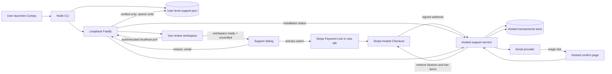

# Phase 01: Add Voluntary Stripe Support Payment and Email Recovery - Research

**Researched:** 2026-08-12
**Domain:** Stripe-hosted one-time Checkout, webhook fulfillment, installation status, and email magic-link recovery
**Confidence:** HIGH — Render Node service, Render PostgreSQL, Resend, Stripe configuration, and package versions are source-checked and fixed below.

<user_constraints>
## User Constraints (from CONTEXT.md)

### Locked Decisions

### Prompt experience
- **D-01:** For unpaid users, open the support dialog after the review workspace has loaded rather than before workspace access or after a timer.
- **D-02:** Make “Support Cumpa — $49.99” the primary action. “Restore support” and “Not now” are secondary.
- **D-03:** “Not now” dismisses the dialog for the remainder of the running Cumpa session. It appears again on the next unpaid launch and never reopens automatically during the current session.
- **D-04:** Copy is compact and candid: Cumpa remains fully usable, the payment supports development, and paying once stops the launch prompt.

### Checkout handoff
- **D-05:** Open Stripe Checkout in a new browser tab, leaving the local Cumpa workspace and support dialog open.
- **D-06:** After Checkout opens, keep the dialog in a cancellable “Waiting for confirmation…” state. Do not require an “I’ve paid” action.
- **D-07:** Only verified fulfillment transitions the dialog to a brief thank-you state; close it automatically after roughly 1–2 seconds.
- **D-08:** Cancellation, an abandoned Checkout tab, or delayed webhook delivery must not be labeled as payment failure. The user can close the waiting dialog and keep working. Late verified fulfillment still persists and suppresses future prompts.

### Supporter identity
- **D-09:** Do not add a persistent supporter badge to the review workspace.
- **D-10:** Persist and expose supporter status only. Do not retain or display the payer email locally; recovery asks for the email again.
- **D-11:** Verified status is machine-wide across all repositories, not repository-local `.cumpa/` state.
- **D-12:** Provide a quiet “Support Cumpa” app-menu entry that opens on-demand status, payment, and recovery UI without occupying the review surface.

### the agent's Discretion
- Exact dialog dimensions, wording, illustration use, polling cadence, menu placement, and the precise thank-you duration, provided the locked hierarchy and behavior above remain intact.
- Recovery journey details not discussed here remain open to standard privacy-safe approaches constrained by REC-01 through REC-03.

### Deferred Ideas (OUT OF SCOPE)

None — discussion stayed within phase scope.
</user_constraints>

<phase_requirements>
## Phase Requirements

| ID | Description | Research support |
|---|---|---|
| PAY-01 | Exactly one optional one-time USD $49.99 payment through Stripe-hosted Checkout. | One fixed Stripe Price/Payment Link, `mode=payment`, quantity 1; hosted fulfillment revalidates price, currency, quantity, and total. |
| PAY-02 | Payment changes no feature except automatic dialog visibility. | Support status is presentation state only and is absent from all review capability checks. |
| PAY-03 | Only server-side signature-verified webhook fulfillment proves payment. | Raw-body signature verification, live Stripe retrieval, invariant checks, and idempotent transaction are the sole payment grant path. |
| PAY-04 | No Stripe secret or webhook secret in app/package. | Separate hosted service owns all Stripe and email secrets; the package contains only public service/payment-link configuration. |
| SUP-01 | Show on every launch until installation is verified. | Machine store loads before support orchestration; workspace-ready event opens an unpaid dialog once per process. |
| SUP-02 | Clearly optional and links to fixed payment page. | Fixed Payment Link with installation `client_reference_id`; locked candid copy and action hierarchy. |
| SUP-03 | Dismissal leaves every feature usable. | Dialog is an overlay only; no review route, capability, state mutation, or export condition depends on support. |
| SUP-04 | Open dialog closes automatically after hosted verification. | Local authenticated status poll continues until verified, atomically persists, shows a short thank-you, then closes. |
| SUP-05 | Persisted verified installation no longer prompts. | User-level versioned JSON is authoritative locally after hosted proof and shared by every repository launch. |
| REC-01 | Restore on another installation using payer email and emailed magic link. | Non-enumerating recovery request, email challenge, confirmation, polling, then local verified persistence. |
| REC-02 | Non-disclosing responses; high-entropy, single-use, short-lived, installation-bound tokens. | Uniform 202 response, keyed email lookup, hashed token, expiry, one transaction for consumption, per-IP/email limits. |
| REC-03 | Unlimited installations per paid email. | Entitlement-to-installation is one-to-many with no count, transfer, revocation, or device-management flow. |
</phase_requirements>

## Summary

Use one Stripe-hosted **Payment Link** backed by one immutable USD 49.99 Price. Append a random, non-secret installation identifier as `client_reference_id`; Stripe documents that this value is delivered on `checkout.session.completed` and is intended for reconciliation, while warning that it must contain no secret or sensitive data. [CITED: https://docs.stripe.com/payment-links/url-parameters] This avoids creating Checkout Sessions from the distributed Cumpa package and therefore keeps every Stripe credential in the hosted service. Payment Link completion or any redirect is never authority. [VERIFIED: REQUIREMENTS.md PAY-03/PAY-04]

The hosted service verifies the unmodified webhook body with `Stripe-Signature`, retrieves the Checkout Session from Stripe with line items, checks live mode, `mode=payment`, `payment_status=paid`, the configured Payment Link/Price, one quantity, `currency=usd`, and `amount_total=4999`, then grants the installation and paid-email entitlement in one idempotent database transaction. Stripe explicitly requires raw-body signature verification, idempotent fulfillment, and webhook processing because delivery can be retried, duplicated, and unordered. [CITED: https://docs.stripe.com/webhooks] [CITED: https://docs.stripe.com/checkout/fulfillment]

Cumpa stores only a random installation identifier and a verified/unverified status in a versioned, user-level atomic JSON file. It never stores payer email or Stripe identifiers. [VERIFIED: CONTEXT.md D-10/D-11] A separate privacy-safe recovery flow computes a keyed lookup of the submitted/Stripe email on the hosted side, sends a short-lived single-use link, binds successful consumption to the requesting installation, and exposes only generic request/pending/verified/expired states. [CITED: https://cheatsheetseries.owasp.org/cheatsheets/Forgot_Password_Cheat_Sheet.html]

**Primary recommendation:** Keep the local application a status consumer and UI; make the separate hosted service the only Stripe/email/data authority, and make webhook fulfillment the only code path that converts a Stripe payment into an entitlement.

## Project Constraints (from project instructions)

- Node.js 24 LTS and TypeScript remain the end-to-end application baseline. [VERIFIED: `.claude/CLAUDE.md`; `package.json`]
- Reuse Fastify, Vue 3, Vite, Zod, Vitest, and Playwright rather than introducing a second application pattern. [VERIFIED: `.claude/CLAUDE.md`; `package.json`]
- The local Fastify server remains bound to `127.0.0.1` on an ephemeral port; authenticated loopback APIs remain the browser authority. [VERIFIED: `src/cli/run.ts`; `src/server/security.ts`]
- Preserve strict shared Zod validation and explicit failure for corrupt/incompatible persisted data. [VERIFIED: `src/contracts/api.ts`; `src/server/draft-store.ts`]
- Repository review state remains in `.cumpa/`; supporter status is deliberately outside it and machine-wide. [VERIFIED: `.planning/PROJECT.md`; CONTEXT.md D-11]
- Reuse the `IdentityPanel.vue` modal accessibility mechanics: labelled dialog, focus containment, explicit close, focus restoration, and inert background. [VERIFIED: `src/web/components/IdentityPanel.vue`; `src/web/App.vue`]
- The project skill covers large-repository source discovery only and adds no payment-specific rule. [VERIFIED: `.kimi-code/skills/spike-findings-cumpa/SKILL.md`]
- Research only in this phase artifact; do not edit application source or create PLAN.md. [VERIFIED: assignment]

## Architectural Responsibility Map

| Capability | Primary tier | Secondary tier | Rationale |
|---|---|---|---|
| Launch visibility and dialog state | Browser / Client | Local API | Vue owns transient session dismissal; local API supplies durable status. |
| Machine-wide installation state | Local API / Storage | CLI startup | Node resolves user-level storage and performs atomic validated reads/writes. |
| Checkout navigation | Browser / Client | Local API | Browser opens a new tab; local server supplies the public URL with its installation reference. |
| Payment proof and fulfillment | Hosted API / Backend | Stripe | Only hosted signature verification and Stripe retrieval can grant status. |
| Paid-email entitlement | Hosted Database | Hosted API | Server-only keyed email lookup supports recovery without local email retention. |
| Recovery request and magic link | Hosted API | Email provider | Hosted service creates/consumes bounded challenges and sends email. |
| Status synchronization | Local API | Hosted API | Browser polls authenticated localhost; local server calls hosted status and persists verified state. |
| Review features | Existing local application | — | Must remain completely independent of support state. |

## Recommended System Architecture



### Boundary rules

1. **Published package:** public hosted-service base URL, public Payment Link base URL (or a public endpoint returning it), schemas, UI, and local persistence only. It contains no `sk_*`, `rk_*`, or `whsec_*` material. Stripe says secret/restricted keys must never be embedded in source or distributed applications. [CITED: https://docs.stripe.com/keys-best-practices]
2. **Local loopback server:** reads/writes installation state and proxies outbound hosted calls. Preserve current Host, Origin, bearer-token, CSP, `no-store`, and `no-referrer` protections for all new `/api/support/*` routes. [VERIFIED: `src/server/security.ts`]
3. **Hosted service:** only tier allowed to receive Stripe webhooks, call Stripe secret APIs, send recovery mail, normalize/hash payer email, or mutate remote entitlement/binding records. [RECOMMENDED]
4. **Stripe redirect/new tab:** presentation only. Never accept a session ID, success URL, browser callback, “I paid,” local file edit, or client response as payment proof. [VERIFIED: REQUIREMENTS.md PAY-03]
5. **Support status:** not a license and not an authorization capability. A user who edits their own local JSON can at most suppress a voluntary prompt; no product behavior is gated. [VERIFIED: REQUIREMENTS.md PAY-02]

## Standard Stack

### Existing/local core

| Library/runtime | Version | Purpose | Direction |
|---|---:|---|---|
| Node.js | >=24 (installed 24.15.0) | crypto, fetch, filesystem, platform paths | Reuse built-ins; no local Stripe SDK. [VERIFIED: `package.json`; environment probe] |
| Fastify | 5.10.0 | authenticated loopback support routes | Reuse existing app registration/security. [VERIFIED: `package.json`] |
| Vue | 3.5.39 | support dialog/menu/transient state | Reuse `App.vue` root orchestration. [VERIFIED: `package.json`] |
| Zod | 4.4.3 | local API and persistence contracts | Add strict discriminated schemas beside existing contracts. [VERIFIED: `package.json`] |
| Vitest / Playwright | 4.1.10 / 1.61.1 | contract/service and real browser flow checks | Reuse existing suites. [VERIFIED: `package.json`] |

### Hosted service

| Component | Recommendation | Purpose |
|---|---|---|
| Node.js 24 + Fastify/Zod | Reuse project stack in a separately deployed service | Strict request handling and minimal new conventions. [RECOMMENDED] |
| `stripe` official server SDK | Pin a reviewed version in the hosted deployable only | Signature verification and Session retrieval; do not hand-roll Stripe HMAC parsing. [CITED: https://docs.stripe.com/webhooks] |
| Render PostgreSQL | Managed PostgreSQL 17 used through `pg@8.23.0` | Real relational constraints, row locks, and transactions are the payment/recovery authority. [CITED: https://render.com/docs/postgresql] |
| Resend HTTPS API | Native `fetch` to `POST https://api.resend.com/emails` | One bounded, awaited send; no SDK, queue, worker, or outbox. [CITED: https://resend.com/docs/api-reference/emails/send-email] |

No Stripe browser SDK is required: Checkout is hosted and opens as an ordinary URL. No local database, JWT library, device-management library, or email library is required. [RECOMMENDED]

### Package Legitimacy Audit

`stripe@22.5.0` is the verified pin. On 2026-08-12, `npm view stripe@22.5.0 name version repository scripts dist.integrity --json` returned name `stripe`, version `22.5.0`, canonical `stripe/stripe-node`, no lifecycle install hook, and integrity `sha512-QVwMwriC0bbySx6R4dpsvJ0W//GojC1kwWVS6rPSoVqDUIZX4Hy3TaUrd2AZeXEAaKbfWIjQjvo3vKAReHZ0vQ==`. The release was current and source-verified; the separate Plan 01-01 human checkpoint remains the supply-chain approval gate because the legitimacy seam classified the recent release `SUS`, not because identity is unresolved.

| Package | Registry | Source repo | Verdict | Disposition |
|---|---|---|---|---|
| `stripe@22.5.0` | npm | https://github.com/stripe/stripe-node | SUS (`too-new`) | Source-checked exact pin; Plan 01-01 human provenance approval remains blocking before hosted-only installation. |
| `pg@8.23.0` | npm | https://github.com/brianc/node-postgres | VERIFIED | Exact hosted runtime pin; metadata checked with `npm view`. |
| `@types/pg@8.21.0` | npm | https://github.com/DefinitelyTyped/DefinitelyTyped | VERIFIED | Exact hosted development pin; metadata checked with `npm view`. |

**Packages removed due to SLOP:** none.  
**Packages flagged SUS:** `stripe`.

## Concrete Data Model

### Local machine-wide file

Recommended logical schema (Zod strict object, atomic 0600 write):

```ts
const SupportStateV1 = z.strictObject({
  schemaVersion: z.literal(1),
  installationId: z.string().regex(/^[A-Za-z0-9_-]{43}$/), // 32 random bytes, base64url
  status: z.enum(['unverified', 'verified']),
});
```

Generate once with `randomBytes(32).toString('base64url')`. The identifier is correlation data, not a secret or email. Never persist checkout IDs, Stripe event IDs, Price IDs, payer email, recovery email, magic-link tokens, or recovery poll tokens. [RECOMMENDED; D-10]

Recommended locations are a single per-user Cumpa state directory, resolved centrally: macOS `~/Library/Application Support/Cumpa/support.json`; Windows `%LOCALAPPDATA%\Cumpa\support.json` with `%APPDATA%` fallback; Linux `$XDG_STATE_HOME/cumpa/support.json` with `~/.local/state/cumpa/support.json` fallback. Node supplies `os.homedir()` and `process.env` but no native cross-platform app-data resolver. [CITED: https://nodejs.org/api/os.html#oshomedir] [ASSUMED]

Reuse the draft store’s durability sequence—create directory, exclusive temporary file with mode `0600`, write, fsync, close, rename, sync parent—while implementing a separate small store whose root is never derived from the repository. [VERIFIED: `src/server/draft-store.ts`]

Corrupt, unsupported-newer, unreadable, or unsafe-path state must fail closed to **unverified** for prompting, preserve the bad file for diagnosis, and never silently claim verified. A transient hosted outage must not downgrade an already locally verified state. [RECOMMENDED]

### Hosted relational records

```text
entitlements
  email_lookup         PK  HMAC-SHA-256(server key, normalize(email))
  created_at
  source_session_id    UNIQUE

installation_bindings
  installation_id      PK
  email_lookup         FK entitlements
  verified_at
  source               CHECK ('payment' | 'recovery')

stripe_events
  event_id              PK
  event_type
  object_id
  processed_at

recovery_challenges
  challenge_id          PK (random)
  poll_token_hash        UNIQUE
  magic_token_hash       UNIQUE, nullable after use
  installation_id
  email_lookup           nullable for nonexistent-email decoy challenge
  expires_at
  consumed_at            nullable
  state                  CHECK ('pending' | 'verified' | 'expired')
```

Normalize email minimally and consistently (trim, Unicode/case normalization appropriate to the chosen mail policy), then use a server-secret keyed HMAC for lookup; do not invent provider-specific dot/plus canonicalization. [RECOMMENDED] The service can send to the email supplied in the current recovery request and therefore need not persist plaintext payer email. [RECOMMENDED] Logs and metrics must redact email, magic/poll tokens, Stripe signatures, and raw webhook bodies. [RECOMMENDED]

REC-03 is a one-to-many relation: one `email_lookup` may own unlimited `installation_bindings`; there is no uniqueness/count constraint on email lookup in bindings and no transfer/revoke UI. [VERIFIED: REQUIREMENTS.md REC-03]

## API Contracts

### Browser → authenticated local Fastify

All routes use existing loopback bearer/Host/Origin protection, strict empty-query/body rules, bounded body limits, Zod parsing, `cache-control: no-store`, and generic errors. [VERIFIED: `src/server/routes.ts`; `src/server/security.ts`]

| Method/path | Request | Response | Notes |
|---|---|---|---|
| `GET /api/support` | none | `{status:'unverified'|'verified'}` | Reads local state only; never returns installation ID/email. |
| `POST /api/support/checkout` | none | `{kind:'ready', url:httpsUrl}` or `{kind:'unavailable'}` | Constructs fixed Payment Link URL with `client_reference_id`; no secrets. Browser opens returned URL in a new tab. |
| `POST /api/support/refresh` | none | `{status:'unverified'|'verified'}` | Calls hosted status; only a verified response can atomically promote local state. Network/error returns unverified without “payment failed.” |
| `POST /api/support/recovery` | `{email:string}` | `{kind:'accepted'}` | Enforce a small body and bounded email; discard email after outbound call. Store challenge/poll credential in process memory only. Always generic. |
| `GET /api/support/recovery-status` | none | `{kind:'pending'|'verified'|'expired'}` | Uses in-memory poll credential; verified atomically promotes local state. |

The public session response need not carry supporter state; keeping support as a separate capability prevents support fields from contaminating pinned comparison contracts and lets the dialog load after the review workspace. [RECOMMENDED]

### Local server → hosted service

| Method/path | Authentication/input | Public response |
|---|---|---|
| `GET /v1/installations/:installationId/status` | 256-bit unguessable public correlation ID; rate limited | `{status:'unverified'|'verified'}` |
| `POST /v1/recovery-requests` | `{installationId,email}`; strict HTTPS; rate limited | Always `202 {kind:'accepted', challengeId, pollToken, expiresAt}` with indistinguishable shape/timing |
| `GET /v1/recovery-requests/:challengeId/status` | `Authorization: Bearer <pollToken>` | `{kind:'pending'|'verified'|'expired'}` only |

Because verified support unlocks nothing, status is not an authorization decision. Still use high-entropy IDs/poll tokens, TLS, rate limiting, and no-store responses to prevent enumeration and nuisance updates. [RECOMMENDED]

### Stripe/email-facing hosted routes

| Method/path | Contract |
|---|---|
| `POST /v1/stripe/webhook` | Untouched raw bytes + `Stripe-Signature`; official `stripe@22.5.0` verification occurs before JSON parsing or mutation, then the server retrieves the Session with expanded line items. |
| `GET /recover?token=...` | Render a minimal no-referrer confirmation page; do not consume on GET because mail scanners may follow links. [RECOMMENDED] |
| `POST /recover` | Consume token transactionally, bind installation, mark challenge verified, and invalidate token; repeated/expired/invalid submissions show the same safe terminal page. |

Build recovery URLs from one configured HTTPS `PUBLIC_BASE_URL`, never an inbound Host header. OWASP explicitly warns against Host-header link construction and recommends HTTPS plus no-referrer. [CITED: https://cheatsheetseries.owasp.org/cheatsheets/Forgot_Password_Cheat_Sheet.html]

## Payment Fulfillment Algorithm

1. Receive raw webhook bytes; reject missing/invalid `Stripe-Signature` with 400 before database mutation. Use the official Stripe SDK and endpoint-specific webhook secret. [CITED: https://docs.stripe.com/webhooks]
2. Accept only `checkout.session.completed` and, if delayed methods are enabled, `checkout.session.async_payment_succeeded`. A completed event with `payment_status=unpaid` is not fulfilled. [CITED: https://docs.stripe.com/checkout/fulfillment]
3. Retrieve the Session server-side from Stripe with expanded line items rather than trusting browser input or a stale partial object. [CITED: https://docs.stripe.com/checkout/fulfillment]
4. Require all invariants: `livemode === expectedEnvironment`, `mode === 'payment'`, `payment_status === 'paid'`, configured Payment Link (when used), exactly one expected Price at quantity 1, `currency === 'usd'`, `amount_total === 4999`, valid 43-character `client_reference_id`, and a present Stripe-collected customer email. Stripe’s Session object exposes these fields and expandable line items. [CITED: https://docs.stripe.com/api/checkout/sessions/object]
5. In one transaction: insert/deduplicate event ID, insert/deduplicate Session ID entitlement, insert/update installation binding, and commit. Unique constraints make concurrent duplicate delivery harmless. Stripe warns that duplicate and separate equivalent events can occur and ordering is not guaranteed. [CITED: https://docs.stripe.com/webhooks#handle-duplicate-events]
6. Return 2xx after the durable transaction. Return non-2xx on transient database/Stripe errors so Stripe retries; do not acknowledge before durability. Stripe retries live events for up to three days. [CITED: https://docs.stripe.com/webhooks#automatic-retries]
7. Do not create any payment-failed local state from Checkout cancellation, expiration, async failure, abandoned tabs, polling timeout, or network error. [VERIFIED: CONTEXT.md D-08]

Configure one fixed Payment Link containing one immutable USD 49.99 one-time Price. Allow card payments only; disable delayed/bank methods, adjustable quantity, optional items, promotion codes, subscriptions, automatic tax, and any additional product. Fulfillment accepts only paid `checkout.session.completed`, so no asynchronous-payment event is needed. The retrieved Session must still equal configured Payment Link/Price, quantity 1, `currency=usd`, and `amount_total=4999`.

## Launch Dialog and Polling State Machine

```text
workspace loading
  -> workspace ready + local verified: no automatic dialog
  -> workspace ready + local unverified: invitation
invitation
  -> Support Cumpa: open new tab -> waiting
  -> Restore support: recovery form
  -> Not now / close: dismissedForSession
waiting
  -> verified refresh: thankYou -> auto-close after 1500 ms
  -> close: dismissedForSession (background low-rate refresh continues)
  -> cancellation/network/timeout: remain waiting or allow close; never “failed”
recovery
  -> submit: generic email-sent/pending state
  -> magic link consumed + poll verified: thankYou -> auto-close
  -> expired: allow request again, without saying whether email paid
app menu Support Cumpa
  -> always opens on-demand panel; verified shows quiet verified status, not a workspace badge
```

Recommended polling: refresh immediately after the tab opens, then at 2, 3, 5, 8, and 10 seconds, then every 15 seconds while the waiting dialog is visible; after dismissal, every 30 seconds while the process remains alive and once on `visibilitychange`. Use one `AbortController`, one in-flight guard, and clear timers on unmount. [RECOMMENDED] This reuses the existing patch-status polling discipline (`refreshing` guard, interval, visibility refresh, teardown) in `App.vue`. [VERIFIED: `src/web/App.vue:903-975`]

Remote fulfillment remains durable even if local polling stops. Every later unverified launch checks hosted installation status; a late verified response is atomically persisted before/while normal prompt orchestration runs, satisfying D-08 and SUP-05 without requiring Checkout to redirect to localhost. [RECOMMENDED]

The invitation opens only after session and draft initialization have established the actual workspace, not during loading and not on a timer. `Not now` sets only an in-memory `dismissedForSession`; no “remind later” timestamp is persisted. [VERIFIED: CONTEXT.md D-01/D-03]

## Recovery Semantics

1. New installation has its own random installation ID. User selects **Restore support**, enters email, and submits through the local authenticated route. [VERIFIED: REC-01]
2. Hosted request handling applies one canonical normalization: `email.normalize('NFKC').trim().toLowerCase()`, rejects invalid/beyond-320-code-point input, and derives `email_lookup = HMAC-SHA-256(EMAIL_LOOKUP_HMAC_KEY, normalizedEmail)`. It durably stores only that digest; plaintext exists only in request memory and the paid Resend request, then is discarded before the generic response. It creates independent random magic/poll tokens, stores only hashes, and always returns the same 202 shape. Unknown/limited requests create decoy pending challenges and send no mail. [RECOMMENDED]
3. For a paid lookup, await one Resend `POST /emails` with a 1000 ms abort timeout; do not retry in-process. Paid and unknown paths both wait until 1200 ms from validated-request start before returning the same generic 202. Resend success, timeout, HTTP failure, or invalid provider response changes only a redacted server diagnostic; it never changes status, body, challenge vocabulary, or durable entitlement state. Tests use injected clock/fetch to prove the timing floor and timeout without wall-clock sleeps. There is no queue, worker, or outbox.
4. Email link contains the high-entropy magic token and points only to the configured HTTPS host. GET renders confirmation; explicit POST consumes. Hash comparison, expiry, unused state, matching challenge, and installation binding are checked in one transaction. [RECOMMENDED]
5. Successful consumption inserts the installation binding for the already-paid email entitlement, marks the challenge verified, nulls/invalidates the magic token, and never changes or consumes the original installation. This supports unlimited restores. [VERIFIED: REC-03]
6. Local polling sees only pending/verified/expired. On verified, local atomic state changes to verified and the same thank-you behavior runs. On expired, UI offers another generic request. Neither state says “email not found” or “not paid.” [VERIFIED: REC-02]
7. Email is never returned to or retained by the local application after request completion. Hosted durable storage retains only a keyed lookup, not plaintext. [RECOMMENDED; D-10]

Token recommendation: 32 random bytes for both magic and poll tokens, base64url encoded; 15-minute lifetime; single use; hashes stored with a server-side pepper/HMAC key; constant-time comparison where applicable. The exact entropy/lifetime are recommendations consistent with OWASP’s cryptographically random, sufficiently long, stored-securely, single-use, expiring requirements. [CITED: https://cheatsheetseries.owasp.org/cheatsheets/Forgot_Password_Cheat_Sheet.html]

## Security Domain

### Applicable ASVS categories

| ASVS category | Applies | Control |
|---|---|---|
| V2 Authentication | Yes, recovery proof | Side-channel emailed, single-use, expiring, installation-bound token; no account password. |
| V3 Session Management | Limited | Poll token is a narrow short-lived bearer credential; no general hosted login/session. |
| V4 Access Control | Yes | Only webhook fulfillment creates payment entitlement; recovery may bind only to an existing entitlement. |
| V5 Validation | Yes | Strict Zod/size/content-type validation locally and hosted; fixed Stripe invariant validation. |
| V6 Cryptography | Yes | Node CSPRNG, official Stripe signature verifier, HMAC email lookup, hashed random tokens; no custom crypto. |
| V8 Data Protection | Yes | No local email; redacted logs; TLS; no-store/no-referrer; server-side secrets vault. |
| V13 API/Web Services | Yes | HTTPS, rate limits, generic responses, idempotency, bounded request bodies. |

### Threat model

| Threat | STRIDE/privacy | Required mitigation |
|---|---|---|
| Forged “paid” client/redirect | Spoofing/elevation | Webhook signature + Stripe retrieval + invariant checks are the only payment grant. |
| Replayed/duplicated webhook | Spoofing/tampering | Default timestamp tolerance, durable event/session unique keys, idempotent transaction. Stripe warns not to set tolerance to zero. [CITED: https://docs.stripe.com/webhooks#preventing-replay-attacks] |
| Out-of-order or delayed delivery | Reliability/tampering | Do not depend on order; retrieve current Session; remote durable binding; launch/background polling. |
| Price/product substitution | Tampering | Validate configured live Price/Payment Link, exact quantity/currency/amount/mode. |
| Package secret extraction | Information disclosure | No Stripe/email/database secret in local code, build env, browser assets, npm tarball, logs, or tests. |
| Recovery email enumeration | Privacy disclosure | Same generic 202/status vocabulary and 1200 ms response floor; keyed lookup; rate limiting. |
| Recovery inbox flooding | Denial of service | Per-IP and keyed-email cooldown/window, one awaited Resend attempt bounded at 1000 ms, and provider limits. |
| Magic-link theft/replay | Spoofing | 256-bit token, hash at rest, HTTPS, no-referrer, short expiry, explicit POST, single transactional use, bound installation. |
| Email scanner consumes link | Denial of service | GET displays confirmation; POST performs one-time mutation. |
| Localhost cross-origin attack | Spoofing/CSRF | Preserve exact Host/Origin/bearer checks and fixed local routes. |
| Local state corruption/symlink/path attack | Tampering | Central fixed user path, private modes, atomic replace, strict schema; fail unverified. |
| Logs expose identity/secrets | Disclosure | Structured redaction; no raw webhook body, email, signature, tokens, or secrets. |

## Don't Hand-Roll

| Problem | Do not build | Use instead | Why |
|---|---|---|---|
| Card/payment UI | Local form or PaymentIntent UI | Stripe-hosted Payment Link/Checkout | Keeps payment data and secrets outside Cumpa. |
| Webhook signature parser | Custom HMAC/header parser | Official `stripe` SDK | Stripe explicitly recommends official libraries and raw-body verification. [CITED: https://docs.stripe.com/webhooks#verify-official-libraries] |
| Payment truth | Redirect/session ID/local button | Verified webhook + Stripe retrieval | Redirect delivery is not guaranteed and is client-controlled. [CITED: https://docs.stripe.com/checkout/fulfillment] |
| License/device management | Activation keys, transfer limits, badge system | One boolean status + unlimited binding relation | Payment is voluntary and changes only prompt visibility. |
| Recovery JWT | Self-contained signed token | Random opaque token, hashed server record | Single use, revocation, installation binding, and expiry are simpler with stored state. OWASP notes JWT adds vulnerability/complexity. [CITED: OWASP Forgot Password Cheat Sheet] |
| Cross-platform storage package | New dependency | Small `process.platform`/env/`os.homedir` resolver | Only one file/root is needed. |
| Local database | SQLite/browser storage | Versioned atomic JSON | Existing project durability pattern is sufficient. |

## Existing Patterns to Reuse and Likely Files Touched

| Existing file/pattern | Planned use |
|---|---|
| `src/contracts/api.ts` | Add strict support status, checkout, refresh, recovery request/status schemas and inferred types. |
| `src/server/app.ts` | Construct one machine support store/hosted client and inject support capability into every session app variant. |
| `src/server/capabilities.ts` | Add narrow support capability methods; never connect them to review authorization. |
| `src/server/routes.ts` | Register strict authenticated `/api/support*` routes following existing body/content-type/error rules. |
| `src/server/security.ts` | Preserve protections; adjust `connect-src` only if browser contacts hosted service directly (recommended architecture avoids that). |
| `src/server/draft-store.ts` | Reuse atomic write mechanics conceptually, not repository-root storage or draft schemas. |
| `src/cli/run.ts` | Resolve machine store once per launch and pass it through ordinary, range, and exact-patch app construction; reuse browser opener only for CLI launch, while Checkout uses browser `window.open`. |
| `src/web/api/client.ts` | Add validated support client methods through the existing bearer-token fetch wrapper. |
| `src/web/App.vue` | Start workspace-ready prompt once, own polling/background lifecycle, inert modal background, menu trigger, and focus restoration. |
| `src/web/components/IdentityPanel.vue` | Reuse focus trap/labelled-dialog behavior; do not merge support semantics into identity UI. |
| `src/web/components/IdentityHeader.vue` | Add a quiet header/app-menu trigger or adjacent small app menu; no persistent supporter badge. |
| New local `src/server/support-store.ts` | Minimal user-level versioned atomic store. |
| New local `src/server/support-client.ts` | HTTPS hosted API client with timeouts, response validation, and no email logging. |
| New UI `src/web/components/SupportDialog.vue` | Invitation/waiting/recovery/thank-you views in one accessible component. |
| Separate `services/support/*` deployable | Webhook, status, recovery, database transaction, and email delivery; excluded from Cumpa runtime/package build. |
| `tests/api/*support*.test.ts` | Local route/store/security and remote client contract tests. |
| `tests/e2e/*support*.spec.ts` | Real launch/menu/dismiss/wait/auto-close/accessibility flow. |
| `tests/package/package-assets.spec.ts` and package safety tests | Prove hosted code/secrets and forbidden key patterns are absent from packed artifacts. |

Keep the hosted deployable separated at build and deployment boundaries. A shared pure schema module is acceptable only if it contains no environment access, secret, Stripe SDK import, database adapter, or email provider code and is proven included intentionally. [RECOMMENDED]

## Verification Strategy

`workflow.nyquist_validation` is explicitly false, so no formal Validation Architecture/Wave 0 section is required. [VERIFIED: `.planning/config.json`] The phase still needs targeted contract and security evidence because it changes money and recovery behavior. [VERIFIED: project testing constraints]

### Hosted unit/integration checks

- Valid signed live event with exact Price/USD/4999/quantity 1/paid state creates one entitlement and one installation binding.
- Invalid signature, modified raw bytes, wrong signing secret, test/live mismatch, wrong Price, wrong amount/currency/mode/quantity, unpaid completion, and missing/invalid installation reference create no entitlement.
- Repeated same event, two event IDs for the same Session, and concurrent delivery fulfill exactly once.
- Async succeeded fulfills only when delayed methods are enabled; async failed does not grant or produce local “payment failed.”
- Database/Stripe transient errors return retryable non-2xx without partial durable state.
- Recovery request returns byte-equivalent status/shape for paid and unknown emails; rate limits do not reveal which case applied.
- Magic token is installation-bound, expires, is single-use under concurrency, and cannot restore a different installation.
- One entitlement restores two or more installations without transfer/revocation.
- GET confirm does not consume; POST consumes; logs contain none of the known email/token/signature fixtures.

Use Stripe CLI fixture forwarding for manual/sandbox webhook smoke testing, but do not make the Stripe CLI a production dependency. It was not installed on the research workstation. [VERIFIED: environment probe]

### Local API/store checks

- First launch creates one valid installation ID at the user-level path with private atomic persistence; all repositories resolve the same file.
- Corrupt/newer/unreadable state cannot become verified; failed replacement preserves the prior canonical verified file.
- Every support route requires the same bearer, exact Host, and permitted Origin as existing APIs and validates bounded bodies.
- Hosted unverified/outage never downgrades local verified status; hosted verified promotes exactly once.
- Recovery email exists only in the outbound call frame and never in local file or returned status.
- Ordinary comparison, range, and exact-patch app constructors all receive the same machine support capability.

### Browser checks

- Unverified prompt appears once only after a real workspace is visible; verified launch does not prompt.
- Primary/secondary hierarchy and candid optional copy match D-02/D-04; every review control remains usable after dismissal.
- Checkout opens a second tab while workspace/dialog stay open; no “I paid” control exists.
- Waiting can close; cancellation/abandonment/network failure never renders payment failure; late verified polling persists and suppresses next launch.
- Verified waiting/recovery transitions to a brief thank-you and auto-closes near 1.5 seconds.
- `Not now` never reopens automatically in the same process, even after state refresh remains unverified.
- Quiet **Support Cumpa** menu entry always opens on demand and verified state is shown only inside that UI, never as a workspace badge.
- Dialog has labelled semantics, initial focus, tab containment, Escape/close behavior, inert background, focus restoration, and live status announcements without duplication.

### Release/package checks

- Inspect `npm pack --dry-run`/tar contents and built web assets for hosted source, `.env`, database config, email credentials, and patterns `sk_live_`, `rk_live_`, `whsec_`; all must be absent.
- Use injected fake hosted URLs/clients in automated package tests. Never include real or placeholder-secret-shaped production values.
- Sandbox end-to-end: launch → Checkout test payment → signed webhook → local poll → atomic verified status → dialog closes → new repository launch stays unprompted.
- Recovery end-to-end on a second isolated installation state root: generic request → email link POST → verified poll → persisted status; repeat for a third installation to prove REC-03.

## Common Pitfalls

### Treating Checkout completion as payment authority
**Failure:** success URL, tab close, returned Session ID, or client response grants support.  
**Avoidance:** only the signed webhook fulfillment transaction may create a payment entitlement/binding. [VERIFIED: PAY-03]

### Parsing JSON before signature verification
**Failure:** middleware changes whitespace/bytes and Stripe verification fails or developers bypass it.  
**Avoidance:** isolate raw-body webhook parsing and call the official verifier first. [CITED: Stripe webhooks]

### Checking only event type or `payment_status`
**Failure:** a valid Stripe payment for another Price/environment/amount grants status.  
**Avoidance:** retrieve and validate every fixed invariant, especially Price, Payment Link, live mode, line items, currency, and 4999 total.

### Assuming one webhook delivery in order
**Failure:** duplicate grants, race errors, or late delivery never reaches local state.  
**Avoidance:** unique constraints/idempotent transactions, current Session retrieval, and launch/background polling. [CITED: Stripe webhooks]

### Putting email in `client_reference_id` or local state
**Failure:** email leaks in URLs, history, local JSON, logs, or UI.  
**Avoidance:** random installation ID only; hosted keyed lookup; recovery asks again. [CITED: Stripe Payment Link parameters] [VERIFIED: D-10]

### Email enumeration through secondary channels
**Failure:** response time, status code, challenge shape, poll result, rate-limit behavior, or UI wording differs for paid/unknown email.  
**Avoidance:** identical request contract and pending/expired semantics, async mail work, keyed limits, and tests comparing both cases. [CITED: OWASP]

### Email scanner consumes single-use link
**Failure:** supporter clicks an already-used link.  
**Avoidance:** GET is inert confirmation; explicit POST consumes.

### Repository-local or browser-only status
**Failure:** each repo prompts separately or clearing browser data loses status.  
**Avoidance:** one Node-owned user-level atomic file. [VERIFIED: D-11]

### Stopping all polling when dialog closes
**Failure:** late webhook is remote-only until a later launch, contrary to the desired same-session persistence.  
**Avoidance:** separate background synchronizer from dialog visibility; always check again on next launch.

### Accidentally gating review code
**Failure:** support state enters capability checks or blocks workspace while loading.  
**Avoidance:** add tests proving identical review API/UI behavior for verified, unverified, offline, and corrupt support states. [VERIFIED: PAY-02]

## Deployment and Configuration Requirements

The provider set is resolved: one Render Node 24 web service, one Render managed PostgreSQL 17 database, and Resend email delivery. `render.yaml` uses `preDeployCommand` for the real migration and `DATABASE_URL` from the managed database connection string. Local/CI integration uses the verified `postgres:17.6-alpine` image through `services/support/scripts/test-postgres.mjs`; that script starts a uniquely named container with an ephemeral host port, waits with `pg_isready`, runs the same migration command, executes the focused Vitest file with `TEST_DATABASE_URL`, and removes the container in `finally`. [CITED: https://render.com/docs/blueprint-spec] [VERIFIED: Docker manifest inspection on 2026-08-12]

Server-only configuration:

```text
STRIPE_API_KEY                 restricted/secret server credential
STRIPE_WEBHOOK_SECRET          endpoint-specific whsec value
STRIPE_PRICE_ID                immutable live USD 49.99 Price
STRIPE_PAYMENT_LINK_ID         expected fixed live Payment Link
EMAIL_LOOKUP_HMAC_KEY          keyed payer-email lookup
RECOVERY_TOKEN_HMAC_KEY        magic/poll token hashing (may be separately rotated)
PUBLIC_BASE_URL                canonical HTTPS host used for recovery links
DATABASE_URL Render PostgreSQL connection string
RESEND_API_KEY Resend server credential
EMAIL_FROM sender on a verified Resend domain
```

Public/package configuration:

```text
CUMPA_SUPPORT_SERVICE_URL      fixed HTTPS hosted API origin
CUMPA_SUPPORT_PAYMENT_URL      fixed public Payment Link base, if not returned by service
```

Production readiness must include separate sandbox/live webhook secrets, secret rotation procedure, database migrations/backups, email sender-domain authentication, rate-limit policy, minimal redacted observability, and a runbook for replaying undelivered Stripe events idempotently. Stripe states endpoint secrets differ between test/live and between endpoints. [CITED: https://docs.stripe.com/webhooks]

## Assumptions Log

| # | Claim | Risk if wrong |
|---|---|---|
| A1 | Recommended exact OS state directories follow common platform conventions. | Path may need adjustment to a project-specific installation convention; central resolver isolates it. |
| A2 | Render Node 24 + Render PostgreSQL 17 + Resend are the production providers. | RESOLVED: one process and one managed database are the smallest deployable authority; native fetch avoids an email SDK. |
| A3 | Stripe is card-only and tax/discount free, so the charged total remains exactly 4999 USD. | RESOLVED: Payment Link settings and retrieved-Session invariants both enforce PAY-01. |
| A4 | Canonical email normalization is NFKC → trim → lowercase; durable storage is HMAC-only. | RESOLVED: no provider-specific dot/plus rewriting; plaintext survives only through the bounded Resend call and is discarded before response. |

## Open Questions (RESOLVED)

1. **Providers:** Render Node service, Render PostgreSQL 17, and Resend. This keeps one hosted process, one real transactional store, and one native HTTPS email call.
2. **Payment policy:** one card-only, one-time Payment Link; automatic tax, discounts, promotion codes, adjustable quantity, optional items, subscriptions, and delayed methods are disabled. Server retrieval still requires exactly USD 49.99.
3. **Email normalization/retention:** `NFKC → trim → lowercase`, syntax/length validation, HMAC-SHA-256 durable lookup only. No mailbox-provider canonicalization and no plaintext durable email.
4. **Payment Link/config ownership:** `CUMPA_SUPPORT_PAYMENT_URL` is a public local-package/runtime setting used only to open Checkout; `STRIPE_PAYMENT_LINK_ID` and `STRIPE_PRICE_ID` are server-only expected identifiers. Rotation updates both public deployment configuration and hosted invariants together; redirect or URL possession is never grant authority.
5. **Stripe SDK:** pin verified `stripe@22.5.0` in `services/support/package.json`. Plan 01-01 retains the required blocking provenance checkpoint for the `SUS` recency classification.
6. **Recovery delivery:** paid requests await one Resend call bounded at 1000 ms; paid and unknown valid requests share a 1200 ms response floor and generic 202. Timeout/failure is redacted, non-enumerating, and not retried; users may make a later recovery request subject to existing limits.

## Sources

### Primary / authoritative
- [Stripe Payment Link URL parameters](https://docs.stripe.com/payment-links/url-parameters) — fixed hosted link reconciliation and `client_reference_id` restrictions.
- [Stripe Checkout fulfillment](https://docs.stripe.com/checkout/fulfillment) — webhook-first, idempotent fulfillment and delayed payments.
- [Stripe webhooks](https://docs.stripe.com/webhooks) — raw-body signature verification, retries, duplicates, ordering, replay tolerance, secret separation.
- [Stripe Checkout Session object](https://docs.stripe.com/api/checkout/sessions/object) — mode, live status, payment status, totals, customer details, Payment Link and expandable line items.
- [Stripe key best practices](https://docs.stripe.com/keys-best-practices) — no secret/restricted keys in source or applications; vault/environment and least privilege.
- [OWASP Forgot Password Cheat Sheet](https://cheatsheetseries.owasp.org/cheatsheets/Forgot_Password_Cheat_Sheet.html) — non-enumeration, rate limiting, secure single-use expiring URL tokens, HTTPS/no-referrer/Host handling.
- [Node.js `os.homedir`](https://nodejs.org/api/os.html#oshomedir) — user home resolution primitive.

### Project evidence
- `.planning/phases/01-add-voluntary-stripe-support-payment-and-email-recovery/01-CONTEXT.md`
- `.planning/REQUIREMENTS.md`
- `.planning/PROJECT.md`
- `.planning/ROADMAP.md`
- `.planning/STATE.md`
- `.claude/CLAUDE.md`
- `.kimi-code/skills/spike-findings-cumpa/SKILL.md`
- `src/cli/run.ts`, `src/server/app.ts`, `src/server/routes.ts`, `src/server/security.ts`, `src/server/draft-store.ts`
- `src/contracts/api.ts`, `src/web/api/client.ts`, `src/web/App.vue`, `src/web/components/IdentityPanel.vue`, `src/web/components/IdentityHeader.vue`
- `package.json`, `.planning/config.json`

## Metadata

**Confidence breakdown:**
- Stripe payment/webhook facts: HIGH — current primary Stripe documentation, refreshed through Context7 and direct official reads.
- Recovery security: HIGH — OWASP primary guidance plus conservative server-side design.
- Existing integration patterns: HIGH — direct codebase reads.
- Hosted provider/infrastructure: MEDIUM — boundaries and transactional requirements are concrete, provider choice remains intentionally unresolved.
- Cross-platform storage paths: MEDIUM — Node primitives verified; exact conventional locations are an assumption requiring platform confirmation.

**Research date:** 2026-08-12  
**Valid until:** 2026-09-11 for stable architecture; re-check Stripe API/package and Payment Link configuration immediately before implementation/deployment.
