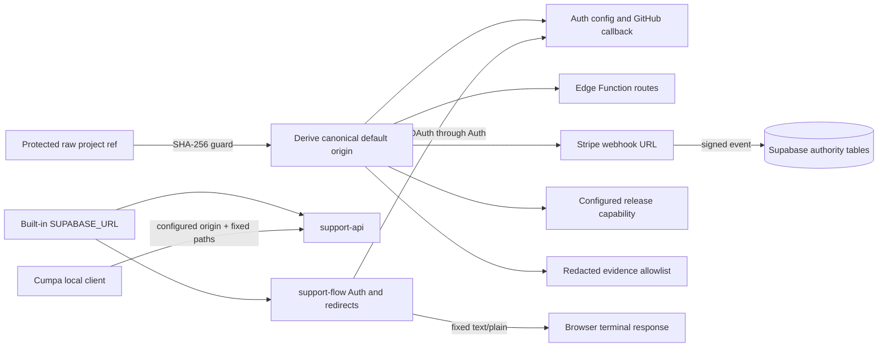

# Phase 02: Move the Implementation to Supabase - Research

**Researched:** 2026-08-31
**Domain:** Supabase default project origin, hosted Auth/Edge Function routing, protected deployment, and release/evidence privacy
**Confidence:** MEDIUM

<user_constraints>
## User Constraints (from CONTEXT.md)

### Locked Decisions

### Supabase footprint
- **D-01:** Supabase broadly owns the hosted implementation: Postgres, Auth, and Edge Functions. Stripe remains the payment and webhook provider.
- **D-02:** Remove the standalone Render deployment, Fastify support service, direct `pg` runtime, recovery-email infrastructure, and Resend integration after equivalent Supabase paths pass verification. Do not retain a fallback implementation or shared Fastify compatibility layer.
- **D-03:** Keep the published Cumpa package behind narrow hosted HTTPS capabilities. Support OAuth runs on a hosted Supabase surface; the ephemeral loopback browser does not receive or persist a Supabase auth session.
- **D-04:** Authentication is required only after a user chooses a support action. Launching and using every review feature remains anonymous and unrestricted.

### OAuth supporter identity
- **D-05:** GitHub is the only OAuth provider in this phase.
- **D-06:** A user who chooses to support Cumpa signs in with GitHub before Stripe Checkout. Server-controlled Stripe metadata binds the Checkout and verified webhook fulfillment to the authenticated Supabase user ID; do not match payment ownership by email.
- **D-07:** On another installation, Restore opens the same hosted GitHub OAuth flow. After authentication, the hosted service automatically binds a paid supporter to the requesting installation; the local dialog closes when status polling observes verification.
- **D-08:** OAuth fully replaces recovery email, magic links, recovery tokens, and Resend. There is no email fallback or operator-assisted claim flow in this phase.
- **D-09:** Preserve unlimited-installation restoration. Locally persist only installation identity and verified supporter status; do not persist GitHub profile data, payer email, or OAuth tokens in Cumpa state.

### Requirements cutover
- **D-10:** Phase 02 intentionally supersedes the email-magic-link mechanism in `REC-01` and the recovery-token mechanism in `REC-02`. Research and planning must revise those requirement details to GitHub OAuth while preserving privacy, non-enumeration of supporter status to unauthenticated callers, secure single-user account binding, and installation-bound restoration.
- **D-11:** `REC-03` remains unchanged: one verified supporter may restore status on unlimited installations without device management or transfer flows.
- **D-12:** All PAY and SUP behavior remains unchanged except the support action now authenticates before Checkout and the Restore action uses OAuth.

### Environment model
- **D-13:** Ordinary local development runs without a hosted Supabase dependency and without `CUMPA_SUPPORT_SERVICE_URL`. Cumpa must register no support capability, make no Supabase/Auth/Edge Function/Stripe calls, and hide or disable Support/Restore UI while preserving every review feature. Database migrations and RPC authority may still be verified against local PostgreSQL; do not require a complete local Supabase stack.
- **D-14:** Maintain exactly one hosted Supabase project: production. Before first public launch, use that still-empty project for the one-time GitHub OAuth and Stripe test-mode acceptance matrix, then promote it in place by replacing test OAuth/Stripe configuration with production configuration. Do not create or retain a hosted development/staging project.
- **D-15:** Version database migrations and Edge Functions in Git. Every push to protected `main` triggers `.github/workflows/deploy-supabase-production.yml` with no path filter. Credential-free repository gates must pass before the job bound to GitHub's protected `production` environment can access deployment/provider inputs or mutate the sole project. That environment exclusively owns `SUPABASE_PROJECT_REF` as a protected variable, Supabase deployment credentials as secrets, and GitHub/Stripe provider inputs. The project ref is a public identifier, but GitHub protected-environment ownership is the target authority. The executor validates the complete ref's canonical 20-character shape immediately before every hosted mutation and derives exactly `https://<ref>.supabase.co`; no configured target digest or same-environment comparison participates in target selection. The default Supabase project URL may enter browser routes, configured release packages, and redacted evidence; deployment/provider credentials must not enter a local process, repository, package, log, evidence, or chat. The workflow deploys schema before functions, serializes runs without cancellation, and performs only non-destructive live smoke after promotion. The first successful run applies temporary prelaunch test configuration. After approved acceptance and exact fixture cleanup, the human replaces the protected environment's provider inputs in place; the following ordinary push to `main` applies and verifies live configuration. Do not use local/manual deployment, manual workflow dispatch, manual database/function promotion, path filters, or Supabase Git integration.

### Cutover and data
- **D-16:** Assume no production supporter records exist. Supabase is the first real hosted launch; do not build import, dual-write, or data-reconciliation machinery for Render/PostgreSQL.
- **D-17:** Supabase replaces the blocked Render provider checkpoint and becomes the only hosted authority. Before first public launch, real Stripe test-mode, GitHub OAuth, webhook, automatic restore, package-safety, hostile-path, and status-polling evidence must pass against the still-empty sole project. After its in-place production promotion, verification is limited to non-destructive smoke checks; do not run the destructive/test payment matrix against live authority or substitute local-only proof for the one-time hosted acceptance.
- **D-18:** Retain only the hosted data needed for authority and operations: Supabase user ID, Stripe event/customer/session/payment identifiers required for fulfillment proof and idempotency, verification timestamps, and bound installation IDs. Do not copy GitHub profile fields or payer email into supporter records.
- **D-19:** Make a clean API cutover. Update Cumpa and Supabase together; remove legacy email-recovery routes and schemas rather than providing temporary or permanent compatibility. Existing machine-local verified status remains valid across the package upgrade.
- **D-20:** Use the sole project's default Supabase origin, `https://<ref>.supabase.co`, as the public support origin. The project ref is a public routing identifier; it is stored as the protected GitHub `production` environment variable `SUPABASE_PROJECT_REF` and may appear in artifacts only as part of that canonical origin in browser URLs, configured release packages, and redacted evidence. Do not provision a custom domain, paid domain add-on, DNS records, proxy, or `supabase domains` workflow steps. Validate the complete ref's canonical 20-character shape before each hosted mutation, then derive GitHub OAuth callbacks, Auth routes, `support-api`, `support-flow`, `stripe-webhook`, and the release capability from that origin. GitHub protected-environment ownership is the target authority. Cross-record target proof uses the exact canonical public origin plus immutable GitHub run/commit lineage. A SHA-256 of the ref may remain internally derived in redacted evidence solely for correlation and lineage; it is never configured, approved, compared, or treated as an independent security guard. Because hosted Edge Functions rewrite `text/html` to `text/plain` on default domains, completion and invalid-state browser responses must be bounded plain text.

### the agent's Discretion
- Exact Supabase schema names, Edge Function boundaries, hosted support-page layout, OAuth callback mechanics, CI provider, polling cadence, and safe non-destructive production smoke checks, provided the locked single-project, local-disablement, privacy, and clean-cutover decisions above remain intact.

### Deferred Ideas (OUT OF SCOPE)

None — GitHub OAuth intentionally replaces the prior recovery mechanism within this migration phase; app-wide authentication and additional OAuth providers remain outside the phase boundary.
</user_constraints>

<phase_requirements>
## Phase Requirements

| ID | Description | Research Support |
|----|-------------|------------------|
| PAY-01 | One optional one-time USD $49.99 Stripe-hosted support payment | Default-origin routing changes only transport; server-priced Checkout remains unchanged. [VERIFIED: `.planning/REQUIREMENTS.md`, `supabase/functions/support-flow/index.ts`] |
| PAY-02 | Payment changes no feature except support-dialog visibility | Local capability omission and unrestricted review remain unchanged. [VERIFIED: `.planning/REQUIREMENTS.md`, `src/server/app.ts`] |
| PAY-03 | Only signature-verified server webhook fulfillment proves payment | The canonical webhook route changes; signed webhook authority does not. [VERIFIED: `.planning/REQUIREMENTS.md`, `supabase/functions/stripe-webhook/index.ts`] |
| PAY-04 | Local app package contains no Stripe or webhook secret | Package scanners must permit the exact public default origin while continuing to reject credentials and provider material. [VERIFIED: `.planning/REQUIREMENTS.md`, `scripts/verify-production-artifacts.mjs`] |
| SUP-01–SUP-05 | Preserve configured support dialog, dismissal, polling close, and persisted suppression | `CUMPA_SUPPORT_SERVICE_URL` remains the single local capability base; only the official configured value changes to the default project origin. [VERIFIED: `src/server/support-client.ts`, `src/server/capabilities.ts`, `src/server/app.ts`] |
| REC-01–REC-03 | GitHub OAuth intent flow, privacy-safe restoration, and unlimited installations | GitHub's callback, Supabase `redirectTo`, and completion URLs derive from the same default origin; no OAuth material returns to Cumpa. [CITED: https://supabase.com/docs/guides/auth/social-login/auth-github] |
</phase_requirements>

## Summary

D-20 removes an entire deployment subsystem: no custom-domain add-on, CNAME/TXT records, DNS propagation, domain discovery, `domains reverify`, `domains activate`, activation evidence, ref-free-origin validation, or reverse proxy remains. Supabase's official deployment documentation defines a deployed function URL as `https://<project-ref>.supabase.co/functions/v1/<function-name>`, and its GitHub Auth documentation defines the provider callback as `https://<project-ref>.supabase.co/auth/v1/callback`. [CITED: https://supabase.com/docs/guides/functions/deploy] [CITED: https://supabase.com/docs/guides/auth/social-login/auth-github]

The protected workflow remains the sole hosted authority and owns `SUPABASE_PROJECT_REF` as a public protected environment variable. It validates the complete ref's canonical 20-character shape immediately before each hosted mutation, derives one origin in memory, and then derives every Auth, function, provider, probe, evidence, and release route from that origin. GitHub protected-environment ownership selects the target. Any evidence fingerprint is internally derived, redacted, and supplemental to exact canonical origin plus immutable GitHub run/commit proof. [VERIFIED: D-15/D-20]

The current Plan 02-07 artifacts intentionally remain historical, but their custom-domain implementation is now unsafe to push unchanged: the current executor queries the domains endpoint, attempts reverify/activate, rejects every `.supabase.co` origin, expects HTML, and rejects all default origins in evidence. Plan 02-08 must correct that source/workflow contract before its first push to `main`; GitHub then executes the corrected workflow from that pushed commit. [VERIFIED: `.planning/phases/02-move-the-implementation-to-supabase/02-07-SUMMARY.md`, `scripts/verify-supabase-support.mjs`, `.github/workflows/deploy-supabase-production.yml`]

**Primary recommendation:** Make Plan 02-08 begin with a clean default-origin cutover in the existing workflow, executor, functions, tests, and operations guide; derive all URLs once from the guarded management ref, use built-in `SUPABASE_URL` inside hosted functions, emit fixed plain-text browser terminal responses, and only then allow the first ordinary `main` push. [VERIFIED: `02-CONTEXT.md` D-15/D-20]

## Architectural Responsibility Map

| Capability | Primary Tier | Secondary Tier | Rationale |
|------------|--------------|----------------|-----------|
| Protected executor | `https://<ref>.supabase.co` derived only after canonical 20-character ref validation | canonical public capability origin plus fixed derived paths | Protected GitHub environment owns target selection; input itself is not leaked separately | Must revalidate full ref immediately before every hosted mutation. |
| Hosted function base URL | Supabase Edge Function runtime | Protected CI | Supabase injects `SUPABASE_URL`; CI derives the same origin for provider/release configuration. [CITED: https://supabase.com/docs/guides/functions/secrets] |
| GitHub OAuth provider callback | Supabase Auth | GitHub OAuth App | GitHub returns to Supabase Auth at `/auth/v1/callback`, not directly to `support-flow`. [CITED: https://supabase.com/docs/guides/auth/social-login/auth-github] |
| Post-auth PKCE callback | `support-flow` Edge Function | Supabase Auth redirect allow list | `redirectTo` is the exact support-flow callback and must be allowlisted. [CITED: https://supabase.com/docs/guides/auth/redirect-urls] |
| Completion/invalid browser response | `support-flow` Edge Function | Browser | Fixed `text/plain` avoids relying on the platform's HTML rewrite. [CITED: https://supabase.com/docs/guides/functions/limits] |
| Checkout fulfillment | `stripe-webhook` Edge Function | Supabase Postgres | Origin changes routing only; signature-verified webhook settlement remains authoritative. [VERIFIED: `supabase/functions/stripe-webhook/index.ts`] |
| Local configured capability | Cumpa local server/client | Configured release launcher | The client appends fixed function paths to one optional HTTPS base URL and stores no hosted credential. [VERIFIED: `src/server/support-client.ts`] |
| Public release/evidence policy | Release/evidence scanners | Protected CI | Exact canonical default-origin strings are allowed; credentials, raw refs elsewhere, OAuth/PII, and provider secrets remain denied. [VERIFIED: D-15/D-18/D-20] |

## D-20 Decision Delta

### Delete completely

| Obsolete contract | Current location | Required result |
|-------------------|------------------|-----------------|
| Paid custom-domain add-on and Dashboard registration | `docs/support-service-operations.md`, `02-08-PLAN.md` | No add-on or custom-host setup instruction. [VERIFIED: D-20] |
| CNAME/TXT DNS records and propagation | `docs/support-service-operations.md`, `02-08-PLAN.md` | No DNS task or evidence. [VERIFIED: D-20] |
| Management `GET /v1/projects/<ref>/domains` | `scripts/verify-supabase-support.mjs:deploy` | Remove the request; it is unrelated to the default project origin. [VERIFIED: source inspection] |
| `supabase domains reverify` / `domains activate` | `scripts/verify-supabase-support.mjs:deploy` | Remove both hosted mutations and their order entries. [VERIFIED: source inspection] |
| `--require-custom-domain`, `--require-custom-domain-routes` | `commandDefinitions`, `verifyWorkflow`, `validateRun`, E2E tests | Rename to route/default-origin semantics or remove when normal route validation is unconditional. [VERIFIED: source inspection] |
| Ref-free/default-host rejection | `strictOrigin`, `validateSupportPublicOrigin`, E2E/Deno tests | Invert policy: the sole accepted public origin is the canonical default origin. [VERIFIED: source inspection] |
| HTML response/evidence signature | `browserPage`, `browserResponse`, `probeRoutes`, `assertRoutes`, tests | Fixed bounded `text/plain` response and evidence expectation. [CITED: https://supabase.com/docs/guides/functions/limits] |
| Domain activation evidence | deployment record `domain: { activated: true }`, downstream validators | Remove it; route probes prove the default origin without a domain lifecycle. [VERIFIED: source inspection] |
| Ref-free package/evidence assertions | Plans 02-09, 02-15, 02-16, 02-17 and future scanners | Replace with exact-canonical-origin allowance plus arbitrary-ref/credential denial. [VERIFIED: current plans and D-20] |
`display_suffix` is obsolete. If evidence schemas retain `fingerprint`, derive SHA-256 internally from the already-selected ref and use it only as a redacted correlation field; exact canonical origin plus immutable GitHub run/commit is the authoritative cross-record target proof. [VERIFIED: D-20]

### Preserve without weakening

Validate `SUPABASE_PROJECT_REF` against the complete canonical 20-character shape immediately before every mutation. The protected `production` environment owns target selection; do not configure or compare a target digest. Then derive `origin` once:
- Repository gates remain credential-free, precede the protected `production` job, and the workflow remains automatic on every `main` push with no path/manual trigger. [VERIFIED: D-15, `.github/workflows/deploy-supabase-production.yml`]
- Schema deploys before all Edge Functions; runs remain serialized with `cancel-in-progress: false`. [VERIFIED: D-15, `.github/workflows/deploy-supabase-production.yml`]
- One project is promoted in place; prelaunch acceptance remains destructive/test-only and production-live smoke remains non-destructive. [VERIFIED: D-14/D-17]
- Provider/deployment secrets remain absent from local processes, repository files, packages, logs, evidence, and chat. [VERIFIED: D-15/D-18]
- Ordinary local development still omits `CUMPA_SUPPORT_SERVICE_URL` and constructs no hosted capability. [VERIFIED: D-13, `src/server/app.ts`]

## Minimal URL Derivation Contract

After successful complete-ref canonical-shape validation, derive exactly this graph in protected executor memory:

```js
// Source: D-20 plus Supabase official function/Auth URL contracts.
function publicRoutes(projectRef) {
  const origin = new URL(`https://${projectRef}.supabase.co`).origin;
  const supportFlow = `${origin}/functions/v1/support-flow`;
  return {
    origin,
    authCallback: `${origin}/auth/v1/callback`,
    authSettings: `${origin}/auth/v1/settings`,
    supportApi: `${origin}/functions/v1/support-api`,
    supportFlow,
    supportFlowCallback: `${supportFlow}/callback`,
    supportFlowComplete: `${supportFlow}/complete`,
    stripeWebhook: `${origin}/functions/v1/stripe-webhook`,
    releaseCapability: origin,
  };
}
```

| Consumer | Exact derived value | Why |
|----------|---------------------|-----|
| GitHub OAuth App Authorization callback URL | `authCallback` | Supabase's GitHub guide specifies `/auth/v1/callback`. [CITED: https://supabase.com/docs/guides/auth/social-login/auth-github] |
| Supabase Auth `site_url` | `supportFlowComplete` | This is the safe fixed fallback when `redirectTo` is absent; Site URL is the documented default redirect. [CITED: https://supabase.com/docs/guides/auth/redirect-urls] |
| Supabase Auth `uri_allow_list` | exact `supportFlowCallback` only | `signInWithOAuth({ options: { redirectTo } })` requires that exact callback in the redirect allow list; exact production paths are preferred to wildcards. [CITED: https://supabase.com/docs/guides/auth/redirect-urls] |
| `support-flow` `redirectTo` | `supportFlowCallback` | Supabase Auth returns the PKCE code to the hosted flow, which exchanges it server-side. [CITED: https://supabase.com/docs/guides/auth/social-login/auth-github] |
| Stripe Checkout success/cancel | `supportFlowComplete` | Both remain non-authoritative terminal redirects. [VERIFIED: `supabase/functions/support-flow/index.ts`] |
| Stripe webhook endpoint | `stripeWebhook` | The function's deployed route follows the documented `/functions/v1/<name>` contract. [CITED: https://supabase.com/docs/guides/functions/deploy] |
| Local/release `CUMPA_SUPPORT_SERVICE_URL` | `releaseCapability` | `support-client.ts` appends `/functions/v1/support-api/...` itself. [VERIFIED: `src/server/support-client.ts`] |
| Route smoke | `authSettings`, `supportApi`, `supportFlowCallback`, `stripeWebhook` | These permit bounded non-destructive settings/invalid-input/invalid-state/invalid-signature probes. [VERIFIED: `scripts/verify-supabase-support.mjs:probeRoutes`] |

### Exact obsolete protected URL variables

Delete these five GitHub `production` environment variables and their workflow mappings; all are deterministic outputs of `SUPABASE_PROJECT_REF`. [VERIFIED: `.github/workflows/deploy-supabase-production.yml:49-56`, `scripts/verify-supabase-support.mjs:PROTECTED_INPUTS`]

1. `SUPPORT_PUBLIC_ORIGIN`
2. `SUPABASE_SITE_URL`
3. `SUPABASE_REDIRECT_URL`
4. `SUPABASE_GITHUB_CALLBACK_URL`
5. `STRIPE_WEBHOOK_URL`

Keep `SUPABASE_PROJECT_REF` as a protected `production` environment variable, plus `SUPABASE_ACCESS_TOKEN`, `SUPABASE_DB_PASSWORD`, GitHub client ID/secret, Stripe test/live key/Price/endpoint/signing-secret inputs, and `SUPPORT_PROVIDER_MODE`. Do not add any configured ref hash or fingerprint input. [VERIFIED: D-15/D-20]

Do not add a replacement `DEFAULT_SUPABASE_ORIGIN` GitHub variable: that recreates duplicate state and allows drift. Inside Edge Functions, use the platform-injected `SUPABASE_URL`; do not set a separate `SUPPORT_PUBLIC_ORIGIN` secret. [CITED: https://supabase.com/docs/guides/functions/secrets]

## Auth and Provider Configuration

Supabase documents `PATCH https://api.supabase.com/v1/projects/{ref}/config/auth` for GitHub provider configuration with `external_github_enabled`, `external_github_client_id`, and `external_github_secret`. The current official Management API OpenAPI schema also includes `site_url` and `uri_allow_list`; the Management API bearer token is a credential. [CITED: https://supabase.com/docs/guides/auth/social-login/auth-github] [CITED: https://api.supabase.com/api/v1-json]

The guarded Auth mutation should therefore send one coherent body derived in memory:

```js
// Source: Supabase GitHub Auth guide and Management API OpenAPI schema.
{
  external_github_enabled: true,
  external_github_client_id: inputs.SUPABASE_GITHUB_CLIENT_ID,
  external_github_secret: inputs.SUPABASE_GITHUB_CLIENT_SECRET,
  site_url: routes.supportFlowComplete,
  uri_allow_list: routes.supportFlowCallback,
}
```

The GitHub client ID/secret remain protected provider inputs even though the callback origin is public. GitHub receives `routes.authCallback`; Supabase Auth receives `routes.supportFlowCallback` as the post-provider redirect. Confusing these two callbacks causes OAuth failure. [CITED: https://supabase.com/docs/guides/auth/social-login/auth-github]

Supabase CLI database and function deployment do not require custom-domain commands: `db push` applies pending linked-project migrations, and `functions deploy <name> --project-ref <ref> --use-api` deploys each function. Hosted function secrets use `secrets set` or the Management API, while built-in `SUPABASE_URL` needs no secret update. [CITED: https://supabase.com/docs/guides/deployment/database-migrations] [CITED: https://supabase.com/docs/guides/functions/deploy] [CITED: https://supabase.com/docs/guides/functions/secrets]

## Edge Function Browser Response Constraint

Supabase states that hosted Edge Function `GET` responses returning `text/html` are rewritten to `text/plain` unless a custom domain is used. D-20 forbids the custom domain, so the function must intentionally return plain text rather than rely on the rewrite. [CITED: https://supabase.com/docs/guides/functions/limits]

Use fixed literals with no interpolation, IDs, OAuth query data, provider error text, or PII:

```ts
// Source: Supabase Edge Function limits; fixed text is intentionally bounded.
const completionText = "Support flow complete. You may close this tab and return to Cumpa.\n";
const invalidText = "Support flow could not be completed. Return to Cumpa and try again.\n";

function browserResponse(status: number) {
  return new Response(status === 200 ? completionText : invalidText, {
    status,
    headers: { "content-type": "text/plain; charset=utf-8" },
  });
}
```

The focused Deno tests should assert exact body, exact `text/plain; charset=utf-8`, bounded byte length, and absence of code/token/email/profile/user/secret substrings. The live invalid-state probe should be a `GET` to `supportFlowCallback` without code/cookie and expect `400 text/plain`; current `probeRoutes` sends `POST` to the flow root, so it does not exercise the browser invalid-state branch. [VERIFIED: `supabase/functions/tests/support-flow.test.ts`, `scripts/verify-supabase-support.mjs:probeRoutes`]

## Public Routing Data vs Protected Credentials

| Value | Classification | Allowed surfaces | Denied surfaces |
|-------|----------------|------------------|-----------------|
| `https://<project-ref>.supabase.co` | Public routing data | Browser URLs, configured release launcher/package, redacted evidence, provider callback configuration. [VERIFIED: D-15/D-20] | No denial merely because it contains the ref as its hostname. |
| Raw `<project-ref>` / `SUPABASE_PROJECT_REF` | Public identifier owned as a protected GitHub `production` environment variable | Protected environment and executor memory; outside that boundary only as part of the exact canonical origin on the allowed surfaces above. [VERIFIED: D-15/D-20] | Bare ref in repository, local process, package, log, evidence, chat, or display suffix. |
| Executor-derived project-ref SHA-256 fingerprint | Supplemental redacted correlation/lineage field | Redacted evidence only, derived internally after target selection. [VERIFIED: D-15/D-20] | Configuration, approval, comparison against an input, or use as an independent security guard. |
| `SUPABASE_ACCESS_TOKEN` / Management API bearer token | Deployment credential | Protected executor memory only. Supabase says Management API requests require bearer authentication. [CITED: https://supabase.com/docs/reference/api/introduction] | Browser, package, logs, evidence, local process, chat. |
| Database password / Supabase secret or service-role key | Privileged credential | Protected CI or hosted Edge Function runtime only. Supabase says secret/service-role keys bypass RLS and must never be used in browsers. [CITED: https://supabase.com/docs/guides/functions/secrets] | Browser, package, evidence, logs, local runtime. |
| GitHub client secret, Stripe secret key, Stripe webhook secret | Provider credentials | Protected provider configuration or hosted function secret runtime only. [VERIFIED: D-15/D-18] | Package, evidence, logs, browser, local process, chat. |
| GitHub client ID, Stripe price/endpoint IDs | Protected provider inputs by locked project policy | Protected environment/executor only. [VERIFIED: D-15] | Package/evidence unless a later locked decision explicitly relaxes the policy. |

Supabase's own examples place the project URL in browser/client code and distinguish publishable keys from secret/service-role keys. That supports D-20's distinction: knowing the gateway hostname is not authorization; credential and function-specific verification boundaries still control access. [CITED: https://supabase.com/docs/guides/functions/deploy] [CITED: https://supabase.com/docs/guides/functions/secrets]

## Evidence and Package Scanner Contract

The current `evidenceContainsProtectedValue` rejects every string containing `.supabase.co`, while D-20 requires the canonical default origin in evidence and release packages. Replace the blanket rule with an allowlist anchored to the record/workflow's exact canonical origin. [VERIFIED: `scripts/verify-supabase-support.mjs:evidenceContainsProtectedValue`, D-20]

Prescriptive scanner rules:

1. Parse `record.public_origin` as an exact HTTPS origin with no credentials, port, path, query, or fragment; require the default Supabase hostname form and derive its ref only for scanning. [VERIFIED: D-20] [CITED: https://supabase.com/docs/guides/functions/deploy]
2. Permit that exact origin only in allowlisted URL fields and allowlisted derived route URLs (`/auth/v1/...`, `/functions/v1/support-api...`, `/support-flow...`, `/stripe-webhook`). [VERIFIED: D-20]
3. Permit the configured release package to contain exactly that origin as the base assigned to `CUMPA_SUPPORT_SERVICE_URL`; require it, rather than merely tolerating any `.supabase.co` string. [VERIFIED: `src/server/support-client.ts`, D-20]
4. Reject every other `.supabase.co` hostname and every occurrence of the extracted ref outside the exact canonical origin prefix. [VERIFIED: D-20]
5. Continue rejecting raw fields/names for access tokens, secrets, passwords, project refs, OAuth/code/token/session data, email/PII, client/provider identifiers, private keys, Stripe `sk_`/`whsec_`, and GitHub token forms. [VERIFIED: D-15/D-18, `scripts/verify-supabase-support.mjs:RAW_VALUE_KEY`]
6. Remove `display_suffix`; if `fingerprint` remains, derive it internally as a redacted supplemental correlation field. Exact canonical public origin plus immutable GitHub run/commit is the target lineage authority. [VERIFIED: D-20]
7. Bind acceptance, promotion, release, retirement, and final evidence to the same exact public origin and immutable GitHub run/commit lineage; a valid-looking different project origin fails. Derived fingerprint consistency is supplemental evidence validation only. [VERIFIED: D-14/D-20]

For the packed artifact, `scripts/build-bin.mjs` does not yet embed any support URL and `scripts/verify-production-artifacts.mjs` only checks legacy secret names. Later release work should pass the already-derived public origin ephemerally as `CUMPA_RELEASE_SUPPORT_SERVICE_URL`, write only the `CUMPA_SUPPORT_SERVICE_URL` assignment into the launcher, and extend `tests/e2e/package-assets.spec.ts` plus the production scanner to require the expected canonical origin while rejecting arbitrary refs/credentials/PII/provider material. [VERIFIED: `scripts/build-bin.mjs`, `scripts/verify-production-artifacts.mjs`, `tests/e2e/package-assets.spec.ts`]

## Concrete File and Symbol Impacts

### Plan 02-08 corrective cutover before any push

| File | Symbols/areas | Required change |
|------|---------------|-----------------|
| `PROTECTED_INPUTS`, `protectedInputs` | Keep `SUPABASE_PROJECT_REF` as a protected environment variable plus deployment credentials/provider inputs; delete the legacy configured target-digest input and the five stored URL inputs. [VERIFIED: D-15/D-20] |
| `scripts/verify-supabase-support.mjs` | `PROTECTED_INPUTS` | Remove the five URL names; do not add a replacement origin variable. [VERIFIED: source inspection] |
| `deriveOrigin`, new/extracted | Build `https://${projectRef}.supabase.co` only from the canonical-shape-validated ref. [CITED: Supabase default domain docs] |
| same | `commandDefinitions`, `verifyWorkflow` | Delete custom-domain flags/order checks and verify that no domain command or obsolete URL variable exists. Preserve trigger/gate/toolchain/release-artifact checks. [VERIFIED: source inspection] |
| same | `deploy` | Delete domain GET/reverify/activate; guard schema, Auth/provider config, secret update, and every function deployment; preserve schema-before-functions. Derive Auth/provider URLs in memory. [VERIFIED: D-15/D-20] |
| same | deployment record | Remove `display_suffix` and `domain.activated`; record exact `public_origin`, guarded mutation order, route results, immutable GitHub run/commit, redacted authority snapshots, and only an internally derived supplemental correlation `fingerprint`. [VERIFIED: D-20] |
| same | `probeRoutes`, `assertRoutes`, `validateRun` | Rename custom-domain wording, expect default-origin routes, and assert `support-flow` invalid-state `GET` returns `text/plain`. [CITED: https://supabase.com/docs/guides/functions/limits] |
| same | `evidenceContainsProtectedValue`, `readEvidence`, `writeEvidence` | Allow only the record's exact canonical public origin and derived routes; reject raw ref outside it and all credentials/OAuth/PII/provider material. [VERIFIED: D-15/D-18/D-20] |
| `supabase/functions/support-api/index.ts` | `defaultDependencies().publicOrigin` | Use built-in `SUPABASE_URL` as the flow URL base; no `SUPPORT_PUBLIC_ORIGIN` secret. Keep service-role RPC use unchanged. [CITED: https://supabase.com/docs/guides/functions/secrets] |
| `supabase/functions/support-flow/index.ts` | `validateSupportPublicOrigin`, `defaultDependencies` | Remove ref-free/default-host rejection. Use built-in `SUPABASE_URL` for both the hosted Auth base and public URL derivation; keep privileged key server-only. [CITED: https://supabase.com/docs/guides/functions/secrets] |
| same | `browserPage`, `browserResponse`, `handleSupportFlowRequest` | Replace HTML with fixed bounded plain-text completion/invalid/unavailable terminal responses. [CITED: https://supabase.com/docs/guides/functions/limits] |
| `supabase/functions/tests/support-flow.test.ts` | origin-validation and browser-response tests | Replace custom/ref-free fixtures with default-origin derivation; assert exact bounded plain text and callback/completion URLs. [VERIFIED: current tests] |
| `supabase/functions/tests/support-api.test.ts` | flow URL test | Assert flow URL derives from the default project origin. [VERIFIED: current tests] |
| `tests/e2e/support-payment.spec.ts` | workflow-verifier tests | Delete duplicate custom-domain flag cases; assert obsolete URL mappings/domain steps are rejected and guard/order contract remains. [VERIFIED: current tests] |
| `tests/e2e/support-recovery.spec.ts` | run-evidence test | Change `https://secret-ref.supabase.co` from blanket-forbidden fixture to exact-origin-aware cases: expected origin passes; different origin or ref outside URL fails. [VERIFIED: current test] |
| `tests/e2e/support-restore.spec.ts` | acceptance/promotion fixtures | Replace `support.example` with canonical default-origin lineage and preserve hostile/immutable checks. [VERIFIED: current test] |
| `docs/support-service-operations.md` | custom-domain prerequisite, URL list, deployment order | Delete add-on/DNS/domain lifecycle. Document one derived default origin, exact callback distinction, plain-text limitation, reduced guarded order, provider/environment inputs, and public-vs-secret policy. [VERIFIED: current runbook, D-20] |

### Existing local application boundary

| File/symbol | Disposition |
|-------------|-------------|
| `src/server/support-client.ts:createHostedSupportClient` | Keep one base capability URL and fixed support-api paths. Official builds/acceptance supply the canonical default origin; keep timeout/abort and bounded JSON behavior. [VERIFIED: source inspection] |
| `src/server/capabilities.ts:createSupportCapability` | No routing authority change; it still starts a hosted action, polls, and promotes only hosted `verified`. [VERIFIED: source inspection] |
| `src/server/app.ts:createConfiguredSupportCapability` and CLI app factories | Preserve missing-configuration omission. No derived ref, Supabase client, or provider input enters ordinary local startup. [VERIFIED: source inspection, D-13] |
| local conditional support routes/UI | Preserve conditional registration; do not add a proxy or second front door. [VERIFIED: D-13/D-20] |
| `src/server/support-store.ts` | No change; persisted verified state remains valid. [VERIFIED: D-19, source inspection] |

### Downstream release and evidence work

| File/plan surface | Required D-20 update |
|-------------------|----------------------|
| Plans 02-09/02-10 acceptance/promotion | Require one exact canonical default origin plus immutable GitHub run/commit lineage, not custom-domain activation/ref-free evidence. Any fingerprint is derived supplemental correlation. [VERIFIED: current plans] |
| Plan 02-15 scanner/final verifier | Allow the exact canonical origin; reject different Supabase origins, raw refs elsewhere, credentials, OAuth/PII, and provider secrets. [VERIFIED: current plan, D-20] |
| `scripts/build-bin.mjs`, `tests/e2e/package-assets.spec.ts`, `scripts/verify-production-artifacts.mjs`, Plan 02-16 | Embed/require only the canonical public origin; no default-origin prohibition and no second configuration path. [VERIFIED: current source/current plan] |
| Plans 02-11–02-17 evidence checks | Treat exact canonical origin plus immutable GitHub run/commit as target authority; retain a fingerprint only as internally derived supplemental correlation. [VERIFIED: current plans, D-14/D-20] |
| `02-07-PLAN.md` and `02-07-SUMMARY.md` | Historical; preserve byte-for-byte. Plan 02-08 owns correction. [VERIFIED: assignment contract] |

## Standard Stack

No external package is added by this decision refresh. Existing pins remain the standard stack. [VERIFIED: `02-01-SUMMARY.md`, package manifests]

| Library/tool | Version/current contract | Purpose | Why standard |
|--------------|--------------------------|---------|--------------|
| Supabase hosted gateway | Managed | Default origin for Auth and Edge Functions | It already supplies `/auth/v1` and `/functions/v1`; no custom domain or proxy is needed. [CITED: https://supabase.com/docs/guides/functions/deploy] |
| Supabase CLI | Existing pin `2.114.0` | Linked migrations and Edge Function deployment | Existing protected workflow pin; default-origin routing needs no new CLI command. [VERIFIED: `.github/workflows/deploy-supabase-production.yml`] |
| Supabase Management API | Current OpenAPI | Auth/provider configuration | Official GitHub guide documents the Auth config PATCH. [CITED: https://supabase.com/docs/guides/auth/social-login/auth-github] |
| Web `URL` API | Deno/Node built-in | Canonical origin/path derivation | Avoids string normalization bugs and adds no dependency. [VERIFIED: existing runtime baselines] |
| Built-in `SUPABASE_URL` | Hosted function default | Function/Auth public base and internal API gateway | Supabase injects it; separate public-origin configuration would duplicate state. [CITED: https://supabase.com/docs/guides/functions/secrets] |

**Installation:** None. [VERIFIED: no new dependency]

## Architecture Patterns

### System Architecture Diagram



### Pattern 1: One derivation point per trust domain

**What:** Protected CI derives from the guarded management ref; hosted functions derive from the platform-provided `SUPABASE_URL`; the local package receives only the final public origin. [VERIFIED: D-15/D-20] [CITED: https://supabase.com/docs/guides/functions/secrets]

**When to use:** Every provider config, route probe, evidence validator, and release builder in this phase. [VERIFIED: D-20]

### Pattern 2: Callback roles stay distinct

**What:** GitHub callback is `/auth/v1/callback`; Supabase `redirectTo` is `/functions/v1/support-flow/callback`; terminal fallback/completion is `/functions/v1/support-flow/complete`. [CITED: https://supabase.com/docs/guides/auth/social-login/auth-github] [CITED: https://supabase.com/docs/guides/auth/redirect-urls]

**When to use:** GitHub OAuth App setup, Auth config PATCH, `signInWithOAuth`, Stripe success/cancel, and evidence. [VERIFIED: current support-flow architecture]

### Pattern 3: Exact-origin-aware redaction

**What:** Validate the one public origin first, then scan every other field against it; blanket `.supabase.co` denial is no longer correct. [VERIFIED: D-20]

**When to use:** Deployment, acceptance, promotion, release, retirement, package, and final evidence. [VERIFIED: current plan chain]

### Anti-Patterns to Avoid

- **Recreating URL variables:** Five protected URLs invite drift; derive them from one guarded ref. [VERIFIED: current workflow duplication]
- **Using a custom domain/proxy anyway:** It violates D-20 and restores DNS/domain lifecycle work with no product value. [VERIFIED: D-20]
- **Deriving public routes before target validation:** Protected-environment ownership selects the target, and the same complete-ref canonical 20-character validation must precede every mutation. [VERIFIED: D-15/D-20]
- **Treating public ref as a credential:** This blocks the documented default gateway from packages/evidence while doing nothing to protect actual access tokens/keys. [CITED: https://supabase.com/docs/guides/functions/deploy] [CITED: https://supabase.com/docs/guides/functions/secrets]
- **Allowing arbitrary Supabase origins:** Public does not mean unbound; evidence and release must match one exact canonical origin plus immutable GitHub run/commit lineage. A derived fingerprint may only supplement correlation. [VERIFIED: D-14/D-20]
- **Returning HTML and trusting rewrite:** Return intended plain text explicitly so local tests and hosted behavior agree. [CITED: https://supabase.com/docs/guides/functions/limits]

## Don't Hand-Roll

| Problem | Don't build | Use instead | Why |
|---------|-------------|-------------|-----|
| Public front door | Reverse proxy, vanity host, custom-domain lifecycle | Default Supabase gateway | Auth and functions already share the gateway. [CITED: https://supabase.com/docs/guides/functions/deploy] |
| Function base configuration | New `SUPPORT_PUBLIC_ORIGIN` secret/config service | Built-in `SUPABASE_URL` | Supabase injects the project API gateway. [CITED: https://supabase.com/docs/guides/functions/secrets] |
| URL synchronization | Five protected URL variables | One `publicRoutes(projectRef)` derivation | Eliminates configuration drift. [VERIFIED: D-20] |
| OAuth callback broker | Local callback/proxy | Supabase Auth callback plus hosted `redirectTo` | Keeps tokens/session out of Cumpa. [CITED: https://supabase.com/docs/guides/auth/social-login/auth-github] |
| Rich completion page | HTML SPA/template | Fixed plain text | Default domains rewrite HTML and the phase needs only terminal status. [CITED: https://supabase.com/docs/guides/functions/limits] |
| Project authorization | Hostname/ref suffix comparison | Full raw-ref SHA-256 comparison immediately before mutation | Locked deployment target control. [VERIFIED: D-15/D-20] |

## Runtime State Inventory

| Category | Items Found | Action Required |
|----------|-------------|-----------------|
| Stored data | No hosted routing data was created by Plan 02-07; its summary states no hosted mutation occurred. Existing machine-local `support.json` is unrelated and remains valid. [VERIFIED: `02-07-SUMMARY.md`, D-19] | No data migration. |
| Live service config | Plan 02-07 stopped before custom-domain/DNS/provider setup. The repository cannot prove whether the five planned GitHub environment variables were manually pre-created. [VERIFIED: `02-07-SUMMARY.md`; environment value presence unavailable from repository] | Before first push, delete/avoid the five obsolete URL variables; configure GitHub/Stripe URLs from the derived canonical origin. No Supabase custom domain or DNS cleanup should exist. |
| OS-registered state | None: no launchd/systemd/task registration participates in this hosted routing decision. [VERIFIED: repository architecture and Plan 02-07 file list] | None. |
| Secrets/env vars | Five obsolete URL variables are mapped in the workflow; actual credentials, the protected public ref variable, and provider inputs remain required. [VERIFIED: `.github/workflows/deploy-supabase-production.yml`] | Delete only the five URL variables/mappings; do not rotate or expose credentials as part of this correction. |
| Build artifacts/installed packages | No configured release origin is currently emitted by `scripts/build-bin.mjs`; production scanner has only legacy deny rules. [VERIFIED: `scripts/build-bin.mjs`, `scripts/verify-production-artifacts.mjs`] | Later release build embeds exact public origin and scanners require/allow it; no artifact migration. |

## Common Pitfalls

### Pitfall 1: Swapping the two OAuth callbacks
**What goes wrong:** GitHub is configured to call `support-flow/callback`, or Supabase `redirectTo` is set to `auth/v1/callback`; PKCE never returns to the correct code-exchange handler. [CITED: https://supabase.com/docs/guides/auth/social-login/auth-github]
**How to avoid:** GitHub → `authCallback`; Supabase `redirectTo`/allowlist → `supportFlowCallback`. [CITED: same source]

### Pitfall 2: Keeping Site URL at the bare origin
**What goes wrong:** An omitted/invalid `redirectTo` falls back to a gateway root rather than the bounded terminal route. Supabase documents Site URL as the fallback redirect. [CITED: https://supabase.com/docs/guides/auth/redirect-urls]
**How to avoid:** Set `site_url` to `supportFlowComplete` and still pass/allowlist the exact callback. [CITED: same source]

### Pitfall 3: First push runs stale custom-domain code
**What goes wrong:** The current executor rejects the default origin and attempts domain mutations before schema. [VERIFIED: `scripts/verify-supabase-support.mjs`]
**How to avoid:** Plan 02-08 must finish the workflow/executor/function/test/runbook correction and protected setup without pushing; Plan 02-09's first commit/push must contain that complete correction. [VERIFIED: assignment contract]

### Pitfall 4: Evidence redaction still rejects `.supabase.co`
**What goes wrong:** Valid deployment/release evidence cannot be written, or teams remove the public origin and lose route lineage. [VERIFIED: current `evidenceContainsProtectedValue`, D-20]
**How to avoid:** Exact-origin-aware allowlist plus denial of all other refs/origins and credentials. [VERIFIED: D-20]

### Pitfall 5: Evidence leaks ref outside the origin
**What goes wrong:** `display_suffix` or arbitrary strings expose pieces of the protected management input contrary to D-20's allowed form. [VERIFIED: current deployment record, D-20]
**How to avoid:** Keep exact canonical origin plus immutable GitHub run/commit lineage; a fingerprint may remain only as internally derived supplemental correlation. Do not store a suffix or raw ref field. [VERIFIED: D-20]

### Pitfall 6: HTML tests pass locally but hosted response differs
**What goes wrong:** Hosted GET rewrites `text/html` to `text/plain`; evidence expects the wrong media type. [CITED: https://supabase.com/docs/guides/functions/limits]
**How to avoid:** Emit and test fixed `text/plain` directly. [CITED: same source]

### Pitfall 7: Losing per-mutation target guards while simplifying
**What goes wrong:** A single startup check replaces immediate guards, allowing a changed target to affect later mutations. [VERIFIED: D-15/D-20]
**How to avoid:** Keep `guardTarget(inputs)` immediately before schema, Auth config, secret update, and each function deploy. [VERIFIED: D-15/D-20]

## State of the Art

| Old approach in current artifacts | Current D-20 approach | Impact |
|-----------------------------------|-----------------------|--------|
| Paid custom domain and DNS lifecycle | Default project origin | Deletes external infrastructure and domain mutations. [VERIFIED: D-20] |
| Ref-free origin as secrecy control | Public canonical origin plus protected credentials | Aligns scanners with actual trust boundaries. [VERIFIED: D-15/D-20] [CITED: https://supabase.com/docs/guides/functions/secrets] |
| Five URL environment variables | One guarded derivation | Prevents drift and reduces protected environment state. [VERIFIED: current workflow, D-20] |
| HTML terminal response | Fixed bounded plain text | Matches default-domain hosted behavior. [CITED: https://supabase.com/docs/guides/functions/limits] |
| Domain activation evidence | Exact route/origin and immutable GitHub run/commit evidence; optional derived correlation fingerprint | Proves the actual supported path without domain lifecycle. [VERIFIED: D-20] |

**Deprecated/outdated for this phase:** Supabase custom-domain docs and `supabase domains` commands remain real platform features, but D-20 explicitly places them out of scope; they must not appear as recommendations, prerequisites, workflow checks, or evidence requirements. [VERIFIED: D-20]

## Environment Availability

Step 2.6 skipped: this refresh adds no external dependency or local tool requirement; it changes planning/configuration contracts around already pinned Supabase/Node/Deno tooling. [VERIFIED: current workflow and Plan 02-01 summary]

## Security Domain

### Applicable ASVS Categories

| ASVS Category | Applies | Standard Control |
|---------------|---------|-----------------|
| V2 Authentication | yes | Supabase Auth GitHub provider, PKCE, validated server-side user. [CITED: https://supabase.com/docs/guides/auth/social-login/auth-github] |
| V3 Session Management | yes | Hosted cookie-aware Auth flow; no OAuth session in Cumpa. [VERIFIED: D-03/D-09] |
| V4 Access Control | yes | Server-only service/secret key and RPC authority; no browser authority writes. [CITED: https://supabase.com/docs/guides/functions/secrets] |
| V5 Input Validation | yes | Exact origin/path derivation, Zod/Deno schema checks, bounded fixed responses, exact evidence schema. [VERIFIED: current source architecture] |
| V6 Cryptography | yes | Platform TLS, Stripe signature verification, and evidence/artifact integrity digests; no configured target hash or custom cryptography. [VERIFIED: D-15 and current webhook source] |
| V8 Data Protection | yes | Public origin is explicitly separated from credentials; OAuth/PII/provider material stays out of package/evidence. [VERIFIED: D-15/D-18/D-20] |
| V13 API and Web Service | yes | Fixed function routes, method/input bounds, non-destructive smoke, signed webhook. [VERIFIED: current function source] |

### Known Threat Patterns

| Pattern | STRIDE | Standard Mitigation |
|---------|--------|---------------------|
| Wrong project mutation | Spoofing/Tampering | GitHub protected-environment target ownership plus complete-ref canonical 20-character validation immediately before every mutation. [VERIFIED: D-15/D-20] |
| Callback substitution/open redirect | Spoofing | Derive exact callback URLs and exact production allowlist; no wildcard. [CITED: https://supabase.com/docs/guides/auth/redirect-urls] |
| Arbitrary second Supabase project in release/evidence | Spoofing | Require exact canonical origin and immutable GitHub run/commit lineage; derived fingerprint consistency is supplemental. [VERIFIED: D-14/D-20] |
| Credential leakage disguised as routing data | Information Disclosure | Allow only canonical origin; continue credential/OAuth/PII/provider scans. [VERIFIED: D-15/D-18/D-20] |
| OAuth error/query leakage in terminal response | Information Disclosure | Fixed non-interpolated plain text. [VERIFIED: D-09/D-18] |
| Browser redirect grants payment | Elevation of Privilege | Only signed Stripe webhook settlement writes verified authority. [VERIFIED: PAY-03] |
| Replayed webhook/intent | Replay/Tampering | Existing unique constraints, one-use intent, atomic RPC settlement. [VERIFIED: completed Plans 02-02/02-03] |

## Assumptions Log

| # | Claim | Section | Risk if Wrong |
|---|-------|---------|---------------|
| — | No unverified design assumption is required for D-20. The only unavailable fact is whether obsolete URL variables were manually created in the protected GitHub environment; Plan 02-08 must inspect/delete them before the first push. | Runtime State Inventory | Stale unused variables could confuse operators but must not be consumed by corrected code. |

## Open Questions

1. **Do the five obsolete URL variables already exist in GitHub's protected `production` environment?**
   - What we know: the workflow maps them, but Plan 02-07 states no hosted setup/mutation occurred. [VERIFIED: workflow and summary]
   - What's unclear: repository reads cannot enumerate protected environment configuration.
   - Recommendation: Plan 02-08's human setup checklist explicitly deletes or declines to create those five names before the first push; corrected code must not read them.
   - **RESOLVED FOR PLANNING:** Plan 02-08 Task 2 must delete any existing entries or confirm them absent without reading values before the first push. The executor needs no pre-known answer because corrected source consumes none of the five names.

No platform-routing question remains: primary documentation covers the default function URL, GitHub callback, redirect allowlist, built-in `SUPABASE_URL`, Management API provider fields, and HTML rewrite behavior. [CITED: Sources below]

## Sources

### Primary official sources (MEDIUM confidence per `classify-confidence` seam)

- [Supabase Edge Function deployment](https://supabase.com/docs/guides/functions/deploy) — default project/function URL, project linking, function deployment, CI example; accessed 2026-08-31.
- [Supabase GitHub social login](https://supabase.com/docs/guides/auth/social-login/auth-github) — exact GitHub callback and Management API provider fields; accessed 2026-08-31.
- [Supabase Auth redirect URLs](https://supabase.com/docs/guides/auth/redirect-urls) — `redirectTo`, exact production allowlist, and Site URL fallback; accessed 2026-08-31.
- [Supabase Edge Function limits](https://supabase.com/docs/guides/functions/limits) — default-domain `text/html` to `text/plain` rewrite; accessed 2026-08-31.
- [Supabase Edge Function secrets](https://supabase.com/docs/guides/functions/secrets) — built-in `SUPABASE_URL` and public/secret key distinction; accessed 2026-08-31.
- [Supabase Management API introduction](https://supabase.com/docs/reference/api/introduction) — bearer-token authentication and official OpenAPI link; accessed 2026-08-31.
- [Supabase Management API OpenAPI](https://api.supabase.com/api/v1-json) — `PATCH /v1/projects/{ref}/config/auth`, `site_url`, `uri_allow_list`, and GitHub provider fields; accessed 2026-08-31.
- [Supabase database migrations](https://supabase.com/docs/guides/deployment/database-migrations) — linked remote migration deployment; accessed 2026-08-31.

### Primary repository sources (HIGH confidence)

- `.planning/phases/02-move-the-implementation-to-supabase/02-CONTEXT.md` — locked D-13 through D-20.
- `.planning/phases/02-move-the-implementation-to-supabase/02-07-SUMMARY.md` — historical completion and no hosted mutation.
- `.github/workflows/deploy-supabase-production.yml` — current protected inputs and workflow boundary.
- `scripts/verify-supabase-support.mjs` — current custom-domain deployment/evidence contract and exact obsolete variables.
- `supabase/functions/support-api/index.ts`, `supabase/functions/support-flow/index.ts` — current origin consumers and browser responses.
- `supabase/functions/tests/*.test.ts`, `tests/e2e/support-*.spec.ts` — current stale origin/media/evidence expectations.
- `src/server/support-client.ts`, `src/server/capabilities.ts`, `src/server/app.ts` — local capability and disablement boundary.
- `scripts/build-bin.mjs`, `scripts/verify-production-artifacts.mjs`, `tests/e2e/package-assets.spec.ts` — downstream release embedding/scanner surfaces.
- `docs/support-service-operations.md` — current custom-domain/DNS runbook to replace.

## Metadata

**Confidence breakdown:**
- Default-origin/Auth/function routing: MEDIUM — current official Supabase docs and Context7 agree; seam classifies Context7 verified sources as MEDIUM.
- Repository impact map: HIGH — directly verified against current files and symbols.
- Security/privacy distinction: HIGH for locked project policy; MEDIUM for supporting platform guidance.
- HTML response constraint: MEDIUM — explicit current official Edge Function limit.
- Live protected-environment state: LOW/unknown — protected GitHub settings are not represented in repository files.

**Research date:** 2026-08-31
**Valid until:** 2026-09-07 (Supabase hosted/API behavior is fast-moving; recheck official docs before hosted execution)
