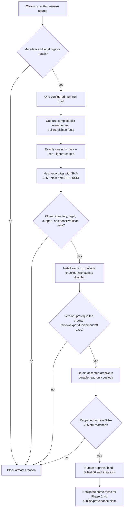

# Phase 4: Exact Runtime Tarball - Research

**Researched:** 2026-09-08
**Domain:** npm runtime packaging, exact-byte artifact acceptance, and local custody
**Confidence:** HIGH for repository findings; MEDIUM for current npm/GitHub/Node tool semantics

<phase_requirements>
## Phase Requirements

| ID | Description | Research Support |
|----|-------------|------------------|
| PKG-03 | Users running `cumpa --version` see exactly `1.5.0` and receive the existing Node.js 24+ and Git prerequisite guidance. | The package already declares `1.5.0` and `engines.node >=24`, and the README and runtime Git errors carry the prerequisite guidance; the Commander program currently has no version option, so the package version needs one authoritative runtime path and installed-package acceptance. [VERIFIED: `.planning/REQUIREMENTS.md`, `package.json`, `README.md`, `src/domain/errors.ts`, `src/cli/run.ts`] |
| PKG-04 | Users receive every compiled Node and browser asset required to complete the existing review workflow from the installed package. | Compare the complete post-build `dist/` file-and-digest inventory with the exact archive inventory, require the Node launcher/runtime, web entry, all five Monaco workers and the codicon font, then run the existing review/export/Finish and agent-handoff paths from an isolated installation of that archive. [VERIFIED: `vite.config.ts`, `src/web/monaco/configure.ts`, `src/server/app.ts`, `tests/e2e/agent-ready-export.spec.ts`] |
| PKG-05 | Public package contents exclude TypeScript source, source maps or embedded source content, tests, fixtures, planning files, workflows, credentials, local review state, marketplace-skill files, and Git repository data or history. | Replace the temporary `dist/` plus skill allowlist with the closed runtime boundary, verify the actual archive rather than a source dry run, and scan every packed regular file instead of only selected text extensions. [VERIFIED: `package.json`, `scripts/verify-production-artifacts.mjs`, `.planning/REQUIREMENTS.md`] |
| REL-03 | Maintainers inspect, install, and publish the same immutable `.tgz` bytes so publication cannot rebuild or substitute an unreviewed archive. | Produce one archive after one explicit configured build, bind approval and custody to its SHA-256, pass its path into every verification and install, and hand the same bytes to Phase 5. npm CLI can publish an explicit local tarball without directory lifecycle repacking, but Phase 5 must still hash-gate its supplied path. [CITED: https://docs.npmjs.com/cli/v11/commands/npm-publish/] |
</phase_requirements>

## Summary

Phase 4 should be a short, closed pipeline: make the package metadata publishable and runtime-only; perform one explicit configured build; run exactly one real `npm pack --json --ignore-scripts --pack-destination <custody-directory>`; then pass that returned `.tgz` path to every inventory, scan, isolated-install, and behavioral acceptance step. The archive's SHA-256—not its filename or `1.5.0` label—is its identity. A repeated `npm pack`, including one hidden inside a verifier or test, creates a different candidate and cannot contribute evidence for the approved bytes. [VERIFIED: `docs/distribution-operations.md`, `.planning/ROADMAP.md`; CITED: https://docs.npmjs.com/cli/v11/commands/npm-pack/]

The present repository is close to the desired content boundary but not to the evidence boundary. `package.json` is intentionally private and still includes `.kimi-code/skills/cumpa/`; the production verifier dry-runs source, packs again, scans only selected text extensions, and extracts that second archive; the package tests build and repack independently; the main packaged workflow test executes an extracted tree with the checkout's `node_modules` symlinked into it. Those paths can establish source behavior but cannot establish one exact independently installed artifact. [VERIFIED: `package.json`, `scripts/verify-production-artifacts.mjs`, `tests/e2e/package-assets.spec.ts`, `tests/e2e/agent-ready-export.spec.ts`]

No release framework, approval engine, new archive library, dependency upgrade, platform expansion, or publication workflow is needed in this phase. Reuse Node's standard library, the installed npm CLI, the existing verifier and packaged-browser scenarios, and one small digest-bound evidence record. Phase 4 designates and preserves bytes; Phase 5 alone selects an authorized transfer into the trusted publisher and verifies the real registry/provenance result; Phase 7 proves clean registry and marketplace installation. [VERIFIED: `docs/distribution-operations.md`, `.planning/STATE.md`, `.planning/ROADMAP.md`]

**Primary recommendation:** Refactor every artifact consumer to require a caller-supplied `.tgz`, create that archive once with lifecycle scripts disabled after the explicit configured build, and approve only its SHA-256 after closed-content and isolated-install acceptance.

## Phase Boundary

| Phase | Owns | Must not be claimed here |
|-------|------|--------------------------|
| Phase 4 | Packaging cutover, one configured build, one actual archive, exact inventory and exclusions, installed behavior, native/toolchain and notice evidence, digest-bound human approval, local custody, Phase 5 designation. [VERIFIED: `docs/distribution-operations.md`] | npm availability, successful registry publication, trusted-publisher configuration, or emitted provenance. [VERIFIED: `.planning/ROADMAP.md`] |
| Phase 5 | Authorized bootstrap/stable registry mutation, exact supplied archive publication, trusted publishing, registry re-download comparison, and actual attestation inspection. [VERIFIED: `docs/distribution-operations.md`] | Rebuilding or substituting a same-version archive. [VERIFIED: `docs/distribution-operations.md`] |
| Phase 7 | Clean public global, `npx`, and marketplace-path acceptance without a local tarball or checkout. [VERIFIED: `.planning/REQUIREMENTS.md`] | Retrospectively redefining the approved Phase 4 bytes. [VERIFIED: `REL-03`] |

The repository is already public at approved main commit `ff72519969da8d2c0761c9533ccb27b809cd17bb`; later local evidence/completion commits have no automatic push authorization. The Phase 4 artifact must bind the exact later source commit and tree that produced it, and Phase 5 must not imply that an unpushed local commit was public. [VERIFIED: `.planning/STATE.md`, `.planning/phases/03-distribution-contract-legal-boundary/03-PUBLICATION-REVIEW.md`]

## Project Constraints

- Runtime remains Node.js 24 LTS and TypeScript end to end; installed Git is the semantic authority. [VERIFIED: project instructions]
- The package contains compiled runtime assets, not TypeScript/Vue source, tests, planning, workflows, local `.cumpa` state, Git data, or the separately distributed marketplace skill. [VERIFIED: `.planning/REQUIREMENTS.md`, `docs/distribution-operations.md`]
- Existing review selection, browser workflow, persistence, export, Finish, canonical agent handoff, and voluntary-support behavior are unchanged. Support remains feature-neutral. [VERIFIED: `.planning/PROJECT.md`, `.planning/REQUIREMENTS.md`]
- The configured release embeds only the already authorized canonical Supabase origin; ordinary unconfigured builds stay support-disabled and credential-free. Evidence should retain only its digest/fingerprint, not invent or disclose the value. [VERIFIED: `scripts/build-bin.mjs`, `scripts/verify-production-artifacts.mjs`, `docs/distribution-operations.md`]
- `private: true` and the current allowlist are intentional until the Phase 4 cutover, not stale fields to remove early. [VERIFIED: `.planning/STATE.md`, `docs/distribution-operations.md`]
- The exact MIT `LICENSE` digest is `c947d781600d41cdeac710b2c81f5cd04ed88bad83dcc2277cffb30768490c7d`; the currently approved `THIRD_PARTY_NOTICES.md` digest is `847c9cb7c9e3585ed7ae518208ac934c5658f0fdb01ad2f2a20b50f56015d143`; the bound rights-review digest is `d65e5f780c5469757fefef685100a1d4bc6ceaded20b1234b010e8d2b8136e94`. A changed legal byte requires the relevant approval to be refreshed. [VERIFIED: `.planning/phases/03-distribution-contract-legal-boundary/03-LICENSE-APPROVAL.md`]
- Phase 3 approval does not authorize npm publication, a new source push, or remote artifact upload. [VERIFIED: `.planning/phases/03-distribution-contract-legal-boundary/03-LICENSE-APPROVAL.md`, `.planning/STATE.md`]

## Architectural Responsibility Map

| Capability | Primary Tier | Secondary Tier | Rationale |
|------------|--------------|----------------|-----------|
| Archive production | Build/release tooling | npm CLI | Repository tooling explicitly builds, then npm creates one package archive according to package metadata. [VERIFIED: `package.json`; CITED: https://docs.npmjs.com/cli/v11/commands/npm-pack/] |
| Runtime content boundary | Package metadata | Artifact verifier | `files` provides the positive package boundary; final verification evaluates the actual archive and digests. [VERIFIED: `package.json`; CITED: https://docs.npmjs.com/cli/v11/configuring-npm/package-json/#files] |
| Exact-byte identity and custody | Release evidence | Filesystem storage | SHA-256 binds identity; custody preserves the bound bytes outside the checkout. [VERIFIED: `REL-03`, `docs/distribution-operations.md`] |
| Installed behavior | Isolated npm installation | Existing CLI/browser test harness | Product code must resolve from the scoped installed package and its installed dependencies, while the harness only drives behavior. [VERIFIED: `.planning/ROADMAP.md`] |
| Browser assets | Vite output in `dist/web` | Fastify static server/browser | Vite emits the web graph and the server serves `../web`; package acceptance must preserve the entire graph. [VERIFIED: `vite.config.ts`, `src/server/app.ts`] |
| Native second-export capability | `dist/native/directory_exchange.node` | Runtime capability observer | The addon is target-specific; the observer converts absence/load/probe failure to the existing unsupported result. [VERIFIED: `scripts/build-native-addon.mjs`, `src/server/native-exchange-capability.ts`] |
| Support configuration | Generated launcher | Existing support capability | The build embeds one public origin default only when configured; review/export authority remains local and unrestricted. [VERIFIED: `scripts/build-bin.mjs`, `.planning/PROJECT.md`] |
| Registry publication/provenance | Phase 5 release workflow | npm registry | It consumes the Phase 4 archive; Phase 4 records compatibility constraints but performs no mutation or provenance claim. [VERIFIED: `docs/distribution-operations.md`] |

## Standard Stack

### Core Toolchain

| Tool | Observed version | Purpose | Recommendation |
|------|------------------|---------|----------------|
| Node.js | `v24.15.0` | Build scripts, artifact hashing/scanning, CLI runtime | Keep Node 24 as the declared and exercised baseline; use `node:crypto`, `node:fs`, and `node:child_process` rather than a release dependency. [VERIFIED: local probe, `package.json`] |
| npm CLI | `11.12.1` | One package creation and isolated tarball installation | Record the exact npm version because packing semantics are part of artifact production; invoke `npm pack` only once. [VERIFIED: local probe; CITED: https://docs.npmjs.com/cli/v11/commands/npm-pack/] |
| Git | `2.50.1 (Apple Git-155)` | Bind source commit/tree and exercise prerequisite behavior | Keep Git as the runtime authority; record commit/tree/cleanliness before the explicit build. [VERIFIED: local probe, project instructions] |

### Supporting

| Tool | Observed version | Purpose | When to use |
|------|------------------|---------|-------------|
| BSD tar/libarchive | `bsdtar 3.5.3`, libarchive `3.7.4` | Read/extract the already produced archive into a new temporary directory after the producer inventory and hash are captured | Keep it an explicit toolchain boundary; never extract into the checkout or a non-empty destination. [VERIFIED: local probe] |
| Apple clang | `21.0.0`, target `arm64-apple-darwin25.6.0` | Build the existing Darwin ARM64 Node-API addon | Record path/version/target plus source and binary digests; do not infer support for another OS/architecture. [VERIFIED: local probe, `scripts/build-native-addon.mjs`] |
| Playwright/Vitest | Existing locked project versions | Drive existing package/browser acceptance | Reuse the current scenarios after changing their product-under-test input from “build and repack” to “install this supplied archive.” [VERIFIED: `package.json`, tests] |

**No new external package is recommended.** The package-legitimacy audit is therefore not applicable. [VERIFIED: repository/toolchain analysis]

The existing runtime dependency set and versions should remain unchanged in Phase 4. All direct dependencies are exact in `package.json`; npm excludes `package-lock.json` from published packages, so the isolated install's resolved transitive tree must be captured as acceptance evidence rather than represented as part of the `.tgz` identity. Introducing `npm-shrinkwrap.json` would change consumer resolution and is outside this phase unless a separate decision explicitly requests it. [VERIFIED: `package.json`; CITED: https://docs.npmjs.com/cli/v11/configuring-npm/package-json/]

## Architecture Patterns

### Single-Producer Exact-Artifact Pipeline



Every arrow after `npm pack` carries the archive path and expected SHA-256. No downstream step is permitted to build, pack, rename over, or regenerate the candidate. [VERIFIED: `REL-03`, `docs/distribution-operations.md`]

### Producer command shape

```bash
# The configured origin is supplied through the already authorized execution environment.
npm run build
npm pack --json --ignore-scripts --pack-destination <new-custody-directory>
```

`package.json` currently declares `prepack: npm run build`. npm runs package lifecycle hooks for a directory pack unless scripts are ignored, so the explicit build plus `--ignore-scripts` prevents an implicit second build from changing `dist/` between inventory and archive creation. [VERIFIED: `package.json`; CITED: https://docs.npmjs.com/cli/v11/using-npm/scripts/#life-cycle-operation-order]

Do not use `npm pack --dry-run` as acceptance. It is useful while developing the allowlist, but it is not the accepted `.tgz`. The JSON returned by the one real pack should be retained because npm derives its file list, byte size, SHA-1 shasum, and SHA-512 SRI from the produced tarball buffer. Add a project SHA-256 over the file bytes for custody and approval. [CITED: https://github.com/npm/cli/blob/v11.12.1/lib/utils/tar.js]

## Packaging Cutover

The final source metadata should make these clean changes together:

1. Remove `private: true` only when the final gate can immediately create and inspect the candidate. A packed archive retaining `private: true` cannot be published by npm. [VERIFIED: `package.json`; CITED: https://docs.npmjs.com/cli/v11/commands/npm-publish/]
2. Change `files` from `dist/` plus `.kimi-code/skills/cumpa/` to `dist/` plus `THIRD_PARTY_NOTICES.md`. npm always includes `package.json`, a README, a license file, and declared bin targets, but the notices file needs explicit inclusion. [VERIFIED: `package.json`; CITED: https://docs.npmjs.com/cli/v11/configuring-npm/package-json/#files]
3. Keep `name`, `version`, `license`, repository, bugs URL, `engines.node`, and `bin` exactly aligned with the already approved metadata. [VERIFIED: `package.json`, `.planning/REQUIREMENTS.md`]
4. Make Commander expose the package's `1.5.0` value from one source of truth. The current command chain at `src/cli/run.ts:732-746` has `.name`, `.description`, `.action`, and `.parseAsync`, but no `.version`; an installed `--version` check is therefore required before approval. [VERIFIED: `src/cli/run.ts`]
5. Repair `scripts/verify-prerequisites.mjs` while touching the gate: its fixed map has 15 entries while `package.json` contains 18 direct production/dev dependencies, omitting `markdown-it`, `@types/markdown-it`, and `supabase`. The current exact-count check cannot pass the current manifest. [VERIFIED: `scripts/verify-prerequisites.mjs`, `package.json`]

Do not add source maps, declaration files, source copies, a bundled marketplace skill, or a new install-time lifecycle. The packed `package.json` should be inspected to prove that no `preinstall`, `install`, `postinstall`, or `prepare` hook is required by Cumpa; acceptance should install with `--ignore-scripts`. [VERIFIED: `package.json`; CITED: https://docs.npmjs.com/cli/v11/using-npm/scripts/]

## Closed Content Contract

### Required roots and files

- Exactly one npm package root and normalized relative paths. [VERIFIED: npm package format; CITED: https://docs.npmjs.com/cli/v11/commands/npm-pack/]
- Mandatory package metadata: `package.json`, `README.md`, `LICENSE`, and `THIRD_PARTY_NOTICES.md`; the exact license and notice digests must match the active approvals unless refreshed. [VERIFIED: Phase 3 approval records]
- `dist/bin/cumpa.mjs`, all compiled Node modules reachable from it, and the complete `dist/web/` output. [VERIFIED: `package.json`, `src/server/app.ts`]
- `dist/web/index.html`, the main hashed JavaScript and CSS referenced by it, exactly one emitted worker for editor, JSON, CSS, HTML, and TypeScript, the codicon font, and every other emitted `dist/web` asset. [VERIFIED: `src/web/monaco/configure.ts`, current `dist/web/assets` inventory]
- `dist/native/directory_exchange.node` for the approved Darwin ARM64 build, with source, compiler, target, and binary digests recorded. [VERIFIED: `scripts/build-native-addon.mjs`, current `dist/native` inventory]

The strongest simple completeness check is byte-for-byte inventory parity between the post-build `dist/` tree and `package/dist/` in the exact archive: same sorted relative paths, regular-file type, executable mode where relevant, byte length, and SHA-256. This catches omitted hashed chunks, workers, fonts, native binaries, and other formats without maintaining a fragile extension list. Required semantic sentinels above then detect a build that emitted an incomplete `dist/` tree. [VERIFIED: repository build/output layout]

### Forbidden content

Reject any archive path under or identifying: `src/`, `tests/`, fixtures, `.planning/`, `.github/` workflows, `.git/`, `.cumpa/`, `.kimi-code/skills/`, TypeScript/Vue/declaration sources, `.map` files, npm/Git metadata, credentials, local review state, or extra package roots. Also reject absolute paths, parent traversal, duplicate normalized paths, NUL/control-bearing names, links, devices, FIFOs/sockets, and unexpected non-regular payload entries. [VERIFIED: `PKG-05`; security recommendation]

A bare search for the token `sourcesContent` or `sourceMappingURL` is insufficient because the shipped TypeScript worker legitimately contains compiler code that handles source maps. Reject source-map files and actual trailing/inline source-map directives or data payloads, and retain the no-map Vite setting; do not reject runtime compiler strings merely for naming the feature. [VERIFIED: current `dist/web/assets/ts.worker-*.js`, `vite.config.ts`]

Scan all regular-file bytes for protected-value signatures and unexpected origins, including `.node`, font, wasm, and future binary assets; only text-specific policy checks should depend on decoding. The current verifier scans only `.js`, `.mjs`, `.cjs`, `.json`, `.html`, and `.css`, so it cannot establish a whole-archive result. Signature scanning is a release gate, not a claim that arbitrary secret detection is complete. [VERIFIED: `scripts/verify-production-artifacts.mjs`]

Because the candidate is produced locally by npm after a source-tree `lstat`/allowlist preflight and immediately hash-bound, the minimal safe inspection path is: capture npm's real-pack JSON, reject any unexpected inventory entry, extract only into a newly created empty temporary directory, `lstat` and hash every extracted entry, then remove the directory. Do not build a custom tar parser. The separate isolated npm install is the consumer-semantics check. [CITED: https://docs.npmjs.com/cli/v11/commands/npm-pack/; recommended pattern]

## Browser Asset and Runtime Completeness

`vite.config.ts` uses `base: './'`, emits to `dist/web`, and empties that directory. `src/server/app.ts` serves `resolve(import.meta.dirname, '../web')`. `src/web/monaco/configure.ts` names editor, JSON, CSS, HTML, and TypeScript workers. Current output also contains the codicon font and many lazy language chunks. [VERIFIED: codebase and current `dist/web`]

Use two complementary gates against the same archive:

1. **Structural:** `dist`/archive path-and-digest parity plus resolution of local URLs referenced by the packaged HTML and CSS, and named worker/font sentinels. No emitted file may be omitted, and no packaged `dist` file may come from outside the recorded build inventory. [VERIFIED: build layout; recommended pattern]
2. **Behavioral:** install the supplied tarball, launch its npm-created executable from a Git fixture, fail on browser console/page errors and failed local asset requests, complete base/head selection, comment and summary persistence, Finish/export, relaunch/re-export on the supported target, and canonical attached-agent delivery. [VERIFIED: existing `tests/e2e/agent-ready-export.spec.ts` scenarios]

The test harness may remain in the checkout, but the product process must execute from the isolated installed prefix and resolve its own installed dependencies. No symlink or `NODE_PATH` may point from the installed package to checkout `node_modules`; otherwise missing runtime dependencies can be hidden. [VERIFIED: current test flaw at `tests/e2e/agent-ready-export.spec.ts:277-282`]

## Isolated Install Acceptance

Install the absolute path of the already hashed tarball into a new prefix outside the source checkout, with a fresh HOME/cache/user config, no registry credential environment, no workspace link, and lifecycle scripts disabled. Use npm's generated global bin link (or query npm for the prefix paths) rather than a guessed unscoped package path. [CITED: https://docs.npmjs.com/cli/v11/commands/npm-install/; recommended security pattern]

The current package test guesses `installed/node_modules/cumpa/dist/bin/cumpa.mjs`; the actual scoped local path is under `node_modules/@shipwithai/cumpa`, and a global-prefix install exposes the executable through npm's bin directory. The acceptance should invoke that generated `cumpa`, not `node` plus a checkout/extraction path. [VERIFIED: `package.json`, `tests/e2e/package-assets.spec.ts:125-147`; CITED: https://docs.npmjs.com/cli/v11/configuring-npm/folders/]

Minimum observations, all bound to the precomputed archive SHA-256:

| Observation | Passing result |
|-------------|----------------|
| Archive before install | SHA-256 equals approved candidate; byte length, npm SHA-1, and npm SRI recorded. [CITED: npm CLI source] |
| Installed metadata | Name `@shipwithai/cumpa`, version `1.5.0`, MIT, Node `>=24`, correct repository/Issues/bin, no private guard or install-time lifecycle dependency. [VERIFIED: requirements] |
| CLI version | Installed npm-created `cumpa --version` writes exactly `1.5.0` and exits zero without starting Git/browser work. [VERIFIED: `PKG-03`] |
| Guidance | Installed README retains Node 24+ and Git 2.43+ instructions; missing/unsupported Git runtime paths retain their explicit remediation messages. [VERIFIED: `README.md`, `src/domain/errors.ts`] |
| Runtime resolution | Installed package has no checkout symlink; `npm ls --omit=dev` succeeds and the resolved dependency inventory is captured without credentials/private paths. [VERIFIED: package boundary; recommended evidence] |
| Review workflow | Installed CLI launches only loopback, completes review/comment/summary/Finish/export, and produces validated Markdown plus canonical JSON. [VERIFIED: existing application contract] |
| Agent handoff | Installed attached flow delivers canonical output and owns isolated draft state. [VERIFIED: existing packaged scenario] |
| Support | Configured launcher contains exactly the approved origin and no protected value; review/export succeeds without payment or support interaction. [VERIFIED: support boundary] |
| Native behavior | Current Darwin ARM64 acceptance observes native second export; unsupported targets retain successful initial export and explicit `reExportUnsupported` for a second export. [VERIFIED: native capability code and tests] |
| Archive after all checks | SHA-256 remains unchanged when the single accepted read-only archive is reopened and rehashed. Any backup is optional and outside the approval gate. [VERIFIED: `REL-03`; `04-04-PLAN.md`] |

## Native Capability and Portability

`scripts/build-native-addon.mjs` emits `dist/native/directory_exchange.node` only when platform is `darwin` and architecture is `arm64`; elsewhere it removes that output and exits successfully. The source includes only `node_api.h` for the JavaScript ABI surface and Darwin/POSIX APIs for directory exchange. The observed local binary is a Mach-O 64-bit ARM64 shared library. [VERIFIED: `scripts/build-native-addon.mjs`, `src/native/directory-exchange.cc`, local `file` probe]

Node-API provides ABI stability across Node versions when an addon stays within Node-API, but it does not make a Mach-O ARM64 binary portable to Linux, Windows, or macOS x64. Record at least `process.platform`, `process.arch`, Node version, `process.versions.napi` (observed `10`), compiler path/version/target, native source SHA-256, and binary SHA-256. [CITED: https://nodejs.org/docs/latest-v24.x/api/n-api.html; VERIFIED: local probes]

`src/server/native-exchange-capability.ts` catches missing, unloadable, or failed addon probes and returns `reExportUnsupported`. `export-store.ts` still allows the initial export but preserves the stable prior pair when an unsupported target attempts the optional second export. The existing support boundary is therefore: native second export on macOS ARM64 only; graceful unsupported second export elsewhere. Phase 4 must state that limitation, not build additional binaries or promise platform parity. [VERIFIED: `src/server/native-exchange-capability.ts`, `src/server/export-store.ts`, `tests/helpers/agent-ready-export-target.ts`]

The single published tarball may contain the Darwin ARM64 binary on every consumer platform. That is not evidence of native support there; the load failure is an expected capability probe outcome. Cross-platform clean-registry acceptance remains later work. [VERIFIED: current architecture and phase boundaries]

## Legal and Third-Party Notice Reconciliation

Phase 3 accounted for Monaco Editor 0.55.1 and its upstream notice, the selected DOMPurify license, Vue 3.5.39, Markdown-It 14.3.0 and its source-reachable dependencies, Zod 4.4.3, and direct Node dependency roots. It explicitly deferred proof about the final emitted Vite and native bytes to Phase 4. [VERIFIED: `.planning/phases/03-distribution-contract-legal-boundary/03-RIGHTS-REVIEW.md`]

Artifact approval must therefore:

- verify the exact packed `LICENSE` and `THIRD_PARTY_NOTICES.md` bytes against their active digests; [VERIFIED: Phase 3 approval]
- bind the exact `package-lock.json` digest and final direct/runtime dependency inventory used to build; [VERIFIED: rights-review method]
- reconcile the final Vite/Monaco/Vue output, Markdown-It runtime path, and native binary/toolchain with the Phase 3 notice inventory; [VERIFIED: Phase 3 deferred gate]
- retain Monaco's complete upstream third-party notice sequence and the already reviewed attributions; [VERIFIED: rights review]
- block approval if the lockfile, bundled/conveyed material, legal bytes, or required notice coverage changed without a renewed audit/disposition. [VERIFIED: `docs/distribution-operations.md`]

This is evidence that the final bytes were checked against the approved notice basis, not legal certification or a new warranty. Dependencies installed separately by npm are not bytes in Cumpa's `.tgz`; bundled browser code and the native binary are. [VERIFIED: Phase 3 rights review, package architecture]

## Exact Artifact Evidence

Use one bounded JSON evidence document and one human approval entry; do not create a generalized release-record framework. Recommended fields:

```text
schemaVersion, kind
package: name, version, archive basename, byteLength, sha256, npmShasumSha1, npmIntegritySha512
source: repository, commitOid, treeOid, clean, packageJsonSha256, packageLockSha256
build: node, npm, git, os, arch, napi, compiler, nativeSourceSha256,
       nativeBinarySha256, supportOriginSha256
contents: sorted entries[path, type, mode, bytes, sha256], inventorySha256
legal: licenseSha256, noticesSha256, rightsReviewSha256, reconciliationDisposition
acceptance: archiveSha256BeforeEachStage, isolatedInstallLabel, installedMetadata,
            versionResult, prerequisiteResults, browserResult, supportResult, nativeResult
custody: bounded accepted-candidate label, archive basename, readOnly, sha256, byteLength
approval: approver, approvedAt, approvedArchiveSha256, limitations,
          designation = "Phase 5 input; not publication authorization or provenance proof"
```

Do not store credentials, raw environment dumps, access tokens, npm configuration, user/private absolute paths, the configured origin itself, or unsupported attestation/publication statements. A filename, version, filesystem read-only bit, or npm SHA-1 alone is not the artifact identity; approval binds the SHA-256 and byte length, while npm's SHA-512 SRI is retained for later registry comparison. [VERIFIED: repository evidence policy; CITED: npm CLI source]

## Custody and Phase 5 Handoff

Retain the accepted candidate itself as one durable read-only archive outside the checkout. Reopen and recompute its SHA-256 and byte length after mode changes and immediately before Phase 5 transfer; missing or mismatched bytes block handoff and cannot be rebuilt under the same approval. A byte-identical backup is optional, omitted by default, and not an approval gate. [VERIFIED: `REL-03`; planning disposition in `04-04-PLAN.md`]

Phase 4's handoff consists of the exact archive, its expected SHA-256/byte length/npm integrity, source/build bindings, acceptance evidence, and limitations. It does not upload a release asset, alter the existing deployment workflow, publish to npm, configure a trusted publisher, or assert provenance. The current deployment workflow intentionally uploads only `supabase-deployment-evidence.json`, not an unaccepted runtime tarball. [VERIFIED: `docs/distribution-operations.md`, `.github/workflows/deploy-supabase-production.yml`]

Current npm CLI source confirms the later compatible operation: for a `./package.tgz` spec, publish resolves the file, reads its tarball bytes, derives integrity, and sends that same buffer as the registry attachment; its lifecycle hooks are directory-only. Phase 5 must still compare SHA-256 immediately before the command and compare the registry-downloaded artifact afterward. npm will not permit publishing another artifact over an existing name/version. [CITED: https://github.com/npm/cli/blob/v11.12.1/lib/commands/publish.js, https://github.com/npm/cli/blob/v11.12.1/workspaces/libnpmpack/lib/index.js, https://github.com/npm/cli/blob/v11.12.1/workspaces/libnpmpublish/lib/publish.js]

Trusted-publisher and provenance details remain Phase 5 concerns. Compatibility constraints only: the exact workflow identity must match npm configuration, the runner must be supported and have `id-token: write`, the supplied archive digest must match before publish, and the actual emitted attestation—not OIDC success or a badge—must be inspected against its package subject and source/workflow/run claims. If exact local bytes need remote staging, that transfer needs separate authorization and a hard digest gate. [CITED: https://docs.npmjs.com/trusted-publishers/, https://docs.npmjs.com/generating-provenance-statements/]

## Code Examples

### Fail-closed digest gate for every consumer

```javascript
// Source: node:crypto; archivePath and expectedSha256 are required caller inputs.
import { createHash } from 'node:crypto';
import { readFile } from 'node:fs/promises';

const bytes = await readFile(archivePath);
const actualSha256 = createHash('sha256').update(bytes).digest('hex');
if (actualSha256 !== expectedSha256) {
  throw new Error('Supplied release archive SHA-256 does not match the approved candidate');
}
```

Read and hash the bytes before inventory, install, copy, or handoff; never infer identity from the basename. [VERIFIED: Node standard library; recommended `REL-03` pattern]

### Install the supplied archive rather than an extracted tree

```javascript
// Source: https://docs.npmjs.com/cli/v11/commands/npm-install/
execFileSync(npmCommand, [
  'install',
  '--global',
  '--prefix',
  isolatedPrefix,
  '--ignore-scripts',
  '--no-audit',
  '--no-fund',
  archivePath,
], {
  cwd: isolatedRoot,
  env: credentialFreeEnvironment,
  stdio: 'pipe',
});
```

Resolve and invoke the executable created under that npm prefix, then verify the scoped installed metadata; do not add a checkout `node_modules` symlink. [VERIFIED: npm install semantics and current test gap]

## Current Gaps to Close

| Current path | Gap | Required cutover |
|--------------|-----|------------------|
| `package.json` | `private: true`; `files` includes the marketplace skill and does not explicitly include notices. [VERIFIED: codebase] | Remove the guard only at final candidate creation; allow `dist/` and notices; preserve mandatory metadata. |
| `src/cli/run.ts:732-746` | No Commander `.version`, so PKG-03 has no implemented `--version` result. [VERIFIED: codebase] | Read the package version from one authoritative source and prove installed output exactly. |
| `scripts/verify-production-artifacts.mjs:63-69` | Source dry-run, then a new pack, then direct extraction. [VERIFIED: codebase] | Require supplied archive path and expected digest; never pack/build. |
| `scripts/verify-production-artifacts.mjs:6,71` | Only selected text extensions are scanned. [VERIFIED: codebase] | Closed all-file inventory, byte scan for every regular payload, text parsing only where appropriate. |
| `tests/e2e/package-assets.spec.ts` | Multiple tests build/repack; installed path omits the npm scope. [VERIFIED: codebase] | Consume one environment/fixture tarball and invoke npm's created bin from an isolated install. |
| `tests/e2e/agent-ready-export.spec.ts:277-282` | Builds, invokes a verifier that repacks, packs again, extracts, and symlinks checkout `node_modules`. [VERIFIED: codebase] | Install the supplied archive with real dependencies; keep existing behavioral assertions. |
| `tests/package/agent-ready-export.test.ts` | Runs the checkout `dist/bin/cumpa.mjs`. [VERIFIED: codebase] | Accept the installed executable/evidence produced from the supplied archive. |
| `scripts/verify-prerequisites.mjs` | Fixed 15-dependency map disagrees with 19 configured direct dependencies. [VERIFIED: codebase] | Reconcile the existing exact allowlist/count without adding packages. |
| `THIRD_PARTY_NOTICES.md` | Its own closing scope note says final artifact output still requires Phase 4 audit. [VERIFIED: codebase] | Bind the final emitted inventory and lock/toolchain inputs to the reviewed notice coverage. |

## Don't Hand-Roll

| Problem | Don't build | Use instead | Why |
|---------|-------------|-------------|-----|
| Package selection | Custom tar creation | npm `files` plus one `npm pack --json --ignore-scripts` | npm owns package naming, mandatory files, modes, bin handling, and standard layout. [CITED: npm pack/package-json docs] |
| Artifact identity | Version/filename convention or mutable “latest candidate” pointer | `node:crypto` SHA-256 over exact bytes plus retained npm integrity | Same name/version can be repacked to different bytes before publication. [VERIFIED: `REL-03`] |
| Archive framework | New release/approval engine | Existing verifier, a bounded JSON evidence record, and explicit human digest approval | Phase 4 has one artifact and one decision. [VERIFIED: scope constraint] |
| Dependency for tar parsing | New archive package solely for this gate | Producer inventory, closed source preflight, fresh-directory extraction, isolated npm install | Keeps the toolchain small without accepting unchecked source paths. [VERIFIED: available toolchain] |
| Platform abstraction | New native build matrix or fallback exchange implementation | Existing Darwin ARM64 addon and `reExportUnsupported` capability | Platform expansion is not a Phase 4 requirement. [VERIFIED: phase scope] |
| Secret assurance | Claim “no secrets” from a handful of regexes | Closed allowlist, byte scan, bounded environment, no raw evidence values, and honest detection limits | Regex absence is not exhaustive proof. [VERIFIED: current scanner limitation] |
| Provenance | Phase 4 attestation or self-authored provenance claim | Preserve source/build facts; let Phase 5 inspect npm's actual emitted attestation | Production and publication evidence are different gates. [VERIFIED: `docs/distribution-operations.md`] |

## Common Pitfalls

### Repacking during “verification”
**What goes wrong:** The verifier proves a new archive, not the candidate that receives approval. [VERIFIED: current verifier]
**Avoidance:** Make archive path plus expected SHA-256 mandatory inputs and forbid build/pack calls below the producer. [VERIFIED: `REL-03`]

### Trusting a dry-run inventory
**What goes wrong:** A source projection is treated as final package evidence even though lifecycle/build output or bytes can differ. [VERIFIED: current flow]
**Avoidance:** Retain the real pack JSON and inspect/hash the produced `.tgz`. [CITED: npm pack docs]

### Testing an extracted tree with checkout dependencies
**What goes wrong:** Missing package metadata, bin links, or runtime dependencies are masked by source `node_modules`. [VERIFIED: current agent-ready setup]
**Avoidance:** Install the supplied tarball outside the checkout and run npm's executable link. [CITED: npm install docs]

### Treating `dist/web/index.html` plus one JS file as completeness
**What goes wrong:** A worker, lazy chunk, stylesheet, font, or wasm payload can be missing while superficial assertions pass. [VERIFIED: current asset graph]
**Avoidance:** Require whole-`dist` digest parity and browser failed-request coverage, plus five worker/font sentinels. [VERIFIED: codebase]

### Naive source-map token rejection
**What goes wrong:** The bundled TypeScript worker contains source-map implementation strings and becomes a false positive. [VERIFIED: current `ts.worker`]
**Avoidance:** Reject `.map` entries and actual source-map directives/payloads, not bare compiler vocabulary. [VERIFIED: build output]

### Calling Node-API “cross-platform”
**What goes wrong:** ABI stability is mistaken for OS/CPU portability and unsupported second export is silently promised. [CITED: Node-API docs]
**Avoidance:** Record exact target/toolchain and state Darwin ARM64 native support plus graceful unsupported behavior elsewhere. [VERIFIED: codebase]

### Publishing before source alignment
**What goes wrong:** A tarball built from a local commit is published while provenance/source claims point to a different public commit. [VERIFIED: current publication boundary]
**Avoidance:** Bind the producing commit/tree now; Phase 5 must verify authorized public alignment before mutation. [VERIFIED: evidence policy]

### Treating custody as authorization
**What goes wrong:** Uploading an Actions artifact or release asset is assumed to be harmless preparation. [VERIFIED: Phase 3 authorization limits]
**Avoidance:** Preserve locally in Phase 4; make any remote staging an explicitly authorized Phase 5 prerequisite. [VERIFIED: scope]

## Security Domain

`workflow.security_enforcement` is enabled at ASVS level 1. This phase changes a local package/file trust boundary, not application authentication, session, or access-control behavior. [VERIFIED: `.planning/config.json`, phase scope]

### Applicable ASVS Categories

| ASVS category | Applies | Phase control |
|---------------|---------|---------------|
| V2 Authentication | No behavior change | No registry authentication occurs in Phase 4; no token may be collected into evidence. [VERIFIED: phase boundary] |
| V3 Session Management | No behavior change | Existing loopback session-token behavior is exercised unchanged by installed browser acceptance. [VERIFIED: existing app contract] |
| V4 Access Control | No behavior change | Support remains feature-neutral and cannot gate review/export. [VERIFIED: requirements] |
| V5 Input Validation | Yes | Validate archive path/digest, package metadata, normalized inventory, support-origin policy, evidence schema, and installed results; fail closed on mismatch. [VERIFIED: phase trust boundary] |
| V6 Cryptography | Yes | Use standard SHA-256 via `node:crypto` for custody and retain npm SHA-512 SRI; never invent a digest algorithm or use SHA-1 as the approval identity. [CITED: npm CLI source] |
| V8 Data Protection | Yes | Exclude credentials/local state; sanitize install/build environments; store bounded fingerprints and labels rather than raw values/paths. [VERIFIED: `PKG-05`, evidence policy] |
| V12 Files and Resources | Yes | Positive allowlist, traversal/duplicate/link/special-entry rejection, fresh extraction root, size bounds, exact per-file hashes. [VERIFIED: archive boundary] |
| V14 Configuration | Yes | Exact Node/package/repository/bin/legal metadata and one canonical support-origin assignment; no private guard or install hook dependency. [VERIFIED: package contract] |

### Threat Patterns

| Pattern | STRIDE | Standard mitigation |
|---------|--------|---------------------|
| Archive substitution after review | Tampering | SHA-256 before/after every stage; approval binds digest and byte length. [VERIFIED: `REL-03`] |
| Traversal/link/special archive entries | Tampering / Elevation | Closed normalized inventory, source `lstat`, producer JSON, fresh extraction destination, installed-tree `lstat`. [VERIFIED: recommended gate] |
| Credential or local-state inclusion | Information disclosure | Positive package allowlist, all-file byte scan, empty npm config/credential environment, evidence redaction. [VERIFIED: `PKG-05`] |
| Lifecycle-driven rebuild or execution | Tampering / Elevation | Explicit build once; `--ignore-scripts` for pack and isolated install; packed manifest inspection. [CITED: npm lifecycle docs] |
| Checkout dependency bleed-through | Tampering / Repudiation | No symlink/`NODE_PATH`; capture installed dependency tree and execute npm bin. [VERIFIED: current test flaw] |
| False provenance statement | Repudiation | Phase 4 makes no provenance claim; Phase 5 compares subject/source claims in the emitted attestation. [VERIFIED: `REL-05` policy] |

## Verification Strategy

Nyquist validation is explicitly disabled, so no `Validation Architecture` or Wave 0 test scaffold is required. Phase 4 still needs direct acceptance evidence because artifact creation is the deliverable. [VERIFIED: `.planning/config.json`, `.planning/ROADMAP.md`]

Recommended verification order:

1. Static package/allowlist and legal-digest checks before building. [VERIFIED: package boundary]
2. One configured build and post-build `dist` inventory, with toolchain and native provenance. [VERIFIED: Phase 4 goal]
3. One real pack and immediate SHA-256/npm-integrity capture. [CITED: npm pack docs]
4. Closed archive inspection and complete `dist` parity against those exact bytes. [VERIFIED: `PKG-04`, `PKG-05`]
5. Isolated global-prefix install of that same path with scripts disabled and no checkout dependency link. [CITED: npm install docs]
6. Installed `--version`, prerequisite guidance, browser review/export/Finish, agent handoff, support-neutral, and target-aware native acceptance. [VERIFIED: phase success criteria]
7. Post-acceptance read-only custody rehash, bounded evidence review, and human approval bound to SHA-256. [VERIFIED: `REL-03`]

If any step requires a source edit, rebuild, repack, notice change, or different native binary, reject the candidate and begin a new one-candidate cycle. Never patch or replace files inside the archive. [VERIFIED: immutable-artifact contract]

## Environment Availability

| Dependency | Required by | Available | Version | Fallback |
|------------|-------------|-----------|---------|----------|
| Node.js | Build/verifier/runtime | Yes | `24.15.0` | None; Node 24 is required. [VERIFIED: local probe] |
| npm | Pack/install | Yes | `11.12.1` | None; record the exact producer version. [VERIFIED: local probe] |
| Git | Source binding/runtime fixture | Yes | `2.50.1 (Apple Git-155)` | None; installed Git remains authoritative. [VERIFIED: local probe] |
| BSD tar | Exact archive inspection | Yes | `3.5.3` / libarchive `3.7.4` | Isolated npm install still provides consumer extraction semantics, but producer inventory inspection remains required. [VERIFIED: local probe] |
| Apple clang | Darwin ARM64 addon | Yes | `21.0.0`, ARM64 Darwin target | No platform expansion; missing compiler blocks this exact target build. [VERIFIED: local probe] |
| Node-API runtime | Addon ABI | Yes | N-API `10` | Graceful `reExportUnsupported` outside the declared native target. [VERIFIED: local probe, codebase] |
| Canonical release support origin | Configured release launcher | Not exposed by research | Existing authorized execution input | Missing/changed value blocks candidate creation; never invent it. [VERIFIED: scope constraint] |
| Operator-approved outside-checkout custody directory | Byte preservation | Not selected by research | — | Select locally before packing; no remote fallback is assumed. [VERIFIED: scope constraint] |

**Missing blocking inputs at execution:** the already authorized canonical release support origin and a durable operator-approved local custody location must be available before the one-candidate run. [VERIFIED: phase constraints]

## State of the Art

| Old/current repository approach | Phase 4 approach | Impact |
|---------------------------------|------------------|--------|
| Source `npm pack --dry-run`, then another real pack inside verifier | One real pack; all consumers require its path/digest | Establishes evidence for one byte sequence. [VERIFIED: current verifier vs `REL-03`] |
| Extracted package plus checkout `node_modules` symlink | Isolated npm install with real dependency resolution and npm bin | Detects package/dependency/bin omissions. [VERIFIED: current test setup] |
| Extension-based scan | Complete positive inventory and all-file byte scan | Covers native/fonts/wasm/future assets and forbidden roots. [VERIFIED: current scanner] |
| Filename/version identity | SHA-256-bound custody and approval | Prevents same-label substitution. [VERIFIED: artifact contract] |
| General provenance intent | Actual later attestation subject/source inspection | Keeps preparation evidence distinct from publication proof. [VERIFIED: `REL-05`] |

## Open Questions Blocking Decisions (RESOLVED FOR PLANNING)

All five items below are resolved only as Phase 4 planning dispositions. They do not claim execution, artifact approval, publication, provenance, or new user policy.

1. **Phase 5 transport channel and trusted-publishing prerequisites**
   - **Status:** RESOLVED FOR PLANNING
   - **Disposition:** Deferred to Phase 5 as an explicit authorization gate. Phase 4 performs no upload, remote staging, publication, transport selection, or provenance action/claim. `04-04 Task 3` records the limitation and requires Phase 5 to rehash the approved local archive before any separately authorized transfer.

2. **Canonical configured support origin at final build time**
   - **Status:** RESOLVED FOR PLANNING
   - **Disposition:** `CUMPA_RELEASE_SUPPORT_SERVICE_URL` is the sole canonical cleartext input, recovered at execution from the protected executor environment or documented existing protected local configuration. It never appears in argv or durable evidence; `04-01 Task 3` defines purpose-aware production, `04-02 Tasks 1–2` define scanner/caller modes, and `04-04 Task 1` blocks on a dynamic human input gate if local recovery is unavailable.

3. **Native binary target scope for this release**
   - **Status:** RESOLVED FOR PLANNING
   - **Disposition:** The release claim remains Darwin ARM64 for `src/native/directory-exchange.cc` -> `dist/native/directory_exchange.node`, with the current explicit `reExportUnsupported` fallback elsewhere. `04-02 Task 1` verifies target-appropriate contents and `04-03 Tasks 1–2` exercise the installed real-addon/fallback behavior without a broader platform-matrix claim.

4. **Minimum local custody before Phase 4 completion**
   - **Status:** RESOLVED FOR PLANNING
   - **Disposition:** The accepted candidate itself is the one required durable outside-checkout read-only archive. This planning disposition supersedes earlier research suggestions for two mandatory custody locations. `04-04 Tasks 2–3` rehash the archive after mode change and at approval. A byte-identical backup is optional operator policy, is omitted by default, and its absence cannot block approval; Phase 4 does not require triplication, inode/device diversity, or non-writable custody directories.

5. **Final third-party notice reconciliation**
   - **Status:** RESOLVED FOR PLANNING
   - **Disposition:** `04-04 Task 1` recomputes final package/lock/legal digests and reconciles the actual conveyed lockfile/browser/native material against `THIRD_PARTY_NOTICES.md`. Any unresolved copied-component license/notice or changed approved legal text blocks artifact approval; this is a planning gate, not a claim that reconciliation or approval has already completed.

## Assumptions Log

No unverified package names, compliance requirements, platform promises, retention guarantees, or performance targets are assumed. Recommendations above are derived from the repository's locked requirements, inspected code, and cited current tool documentation. Unselected execution inputs are listed as open questions rather than silently assumed.

## Recommended Minimal Plan Slices

### Slice 1: Packaging cutover and supplied-artifact verifier

- Add the authoritative installed CLI version path; make package metadata runtime-only and publishable at the final gate; reconcile the existing prerequisite dependency allowlist. [VERIFIED: current gaps]
- Refactor `verify-production-artifacts.mjs` and existing package tests so they require one supplied archive/digest, enforce the closed inventory/legal/support/native contract, and never build or pack. [VERIFIED: current gaps]
- Preserve existing review/export/support behavior and add no dependency or framework. [VERIFIED: phase scope]

### Slice 2: One exact artifact and isolated acceptance

- From clean committed source, run one configured build, capture `dist`/toolchain/legal evidence, then run one real pack with scripts disabled. [VERIFIED: recommended lifecycle]
- Hash immediately; inspect and install that same file outside the checkout; run version, prerequisite, browser workflow, agent handoff, support-neutral, and native-target acceptance with no checkout dependency link. [VERIFIED: success criteria]
- Reject rather than repair any candidate that fails. [VERIFIED: immutable contract]

### Slice 3: Digest-bound approval and Phase 5 handoff

- Retain one durable read-only accepted candidate, review bounded evidence, and obtain human approval naming its exact SHA-256 and native/transport limitations. A backup is optional and non-gating. [VERIFIED: phase goal; `04-04-PLAN.md`]
- Designate those bytes as Phase 5 input while stating that no npm mutation, remote upload, source push, or provenance result is authorized/proven. [VERIFIED: phase boundary]
- Leave remote transfer and actual provenance inspection to Phase 5. [VERIFIED: parent scope direction]

## Sources

### Primary repository evidence (HIGH confidence)

- `.planning/PROJECT.md`, `.planning/REQUIREMENTS.md`, `.planning/ROADMAP.md`, `.planning/STATE.md` — locked milestone scope, phase boundaries, and requirement assignment.
- `docs/distribution-operations.md` — maintainer release boundary and exact-artifact policy.
- `.planning/phases/03-distribution-contract-legal-boundary/03-LICENSE-APPROVAL.md`, `03-PUBLICATION-REVIEW.md`, `03-RIGHTS-REVIEW.md` — active legal/source approvals, digests, authorization limits, and final-artifact notice gate.
- `package.json`, build/verifier scripts, Vite/TypeScript config, server/native sources, and package/e2e tests — current implementation and gaps.

### Official documentation and source (MEDIUM confidence, classified by research seam)

- https://docs.npmjs.com/cli/v11/commands/npm-pack/ — real pack options and output.
- https://docs.npmjs.com/cli/v11/configuring-npm/package-json/ — `files`, mandatory and excluded package content, engines/bin metadata.
- https://docs.npmjs.com/cli/v11/using-npm/scripts/ — lifecycle ordering and `ignore-scripts` behavior.
- https://docs.npmjs.com/cli/v11/commands/npm-install/ — local tarball install semantics.
- https://docs.npmjs.com/cli/v11/commands/npm-publish/ — local tarball package spec and version immutability.
- https://github.com/npm/cli/blob/v11.12.1/lib/commands/publish.js — tarball-spec publication and directory-only lifecycle hooks.
- https://github.com/npm/cli/blob/v11.12.1/workspaces/libnpmpack/lib/index.js — source pack versus file-tarball behavior.
- https://github.com/npm/cli/blob/v11.12.1/workspaces/libnpmpublish/lib/publish.js — exact tarball buffer attachment and integrity derivation.
- https://docs.npmjs.com/trusted-publishers/ and https://docs.npmjs.com/generating-provenance-statements/ — Phase 5 compatibility constraints only.
- https://docs.github.com/en/actions/tutorials/store-and-share-data — immutable Actions artifacts, digests, and retention limits.
- https://nodejs.org/docs/latest-v24.x/api/n-api.html — Node-API ABI stability and boundaries.

## Metadata

**Confidence breakdown:**
- Phase scope and current gaps: HIGH — directly inspected locked planning records and source/test paths.
- Artifact architecture: HIGH — derived from exact-byte requirements and current producer/consumer flows.
- npm/GitHub/Node semantics: MEDIUM — current official docs plus npm CLI v11.12.1 source, with confidence tier returned by the GSD research seam.
- Native target statement: HIGH — builder, addon source, capability observer, tests, and local binary format agree.
- Phase 5 transport: LOW/OPEN — deliberately unselected and unauthorized; recorded only as a blocker/compatibility constraint.

**Research date:** 2026-09-08
**Valid until:** 2026-10-08 for npm 11/Node 24 packaging semantics; re-check trusted-publisher/provenance requirements immediately before Phase 5.
