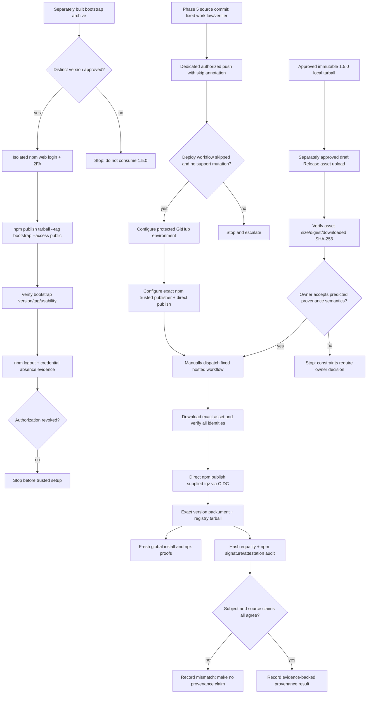

# Phase 5: Bootstrap & Trusted Stable Publication - Research

**Researched:** 2026-09-09
**Domain:** npm public package bootstrap, GitHub Actions OIDC trusted publishing, immutable artifact transport, and provenance verification
**Confidence:** MEDIUM

## Selected direction after owner decision

The owner selected **New CI-built candidate** during plan-phase. `05-CONTEXT.md` D-01–D-09 is authoritative. The earlier local-stable/draft-Release proposal below is retained as research history, not the selected execution path.

- Build a fresh configured stable candidate, verify/install it, obtain actual digest-bound approval and publish its unchanged bytes in the **same top-level GitHub workflow run and attempt**. The original Phase 4 archive/evidence remain immutable history; no fallback publishes that local artifact.
- Use `macos-15` for the candidate job: current GitHub documentation lists this public-repository label as Darwin ARM64 (M1). Confirm actual `darwin`/`arm64` at runtime and preserve/prove native re-export. The publishing job can be separate within the same run, behind a protected `npm-release` environment. [CITED: https://docs.github.com/en/actions/reference/runners/github-hosted-runners]
- Use native Actions artifact transfer by the actual artifact ID plus independent inner `.tgz` and evidence hashes. There is no need for draft Release transport of the old local stable tarball.
- Keep the existing production variable as the configuration source. Direct non-secret expression/`env` injection can appear in runner step metadata before late masking. For this selected plan, use an explicitly authorized temporary `production` secret `CUMPA_RELEASE_BUILD_ORIGIN`, freshly derived in memory from that variable, passed via stdin to `gh secret set`, then deleted after the candidate-build job terminates. No local `.env`, permanent duplicate or value copied into `npm-release` is introduced. The native CLI encrypts before transmission; require absence before creation and delete only the owned transport. [CITED: https://cli.github.com/manual/gh_secret_set] [CITED: https://cli.github.com/manual/gh_secret_delete] [CITED: https://docs.github.com/en/actions/reference/workflows-and-actions/workflow-commands#masking-a-value-in-a-log]
- The bootstrap remains a distinct, separately produced configured prerelease (proposed `1.5.0-bootstrap.0`, tag `bootstrap`). Its temporary npm authorization is revoked before the stable CI cycle is enabled.
- Only the final publish job is non-producing; unlike the superseded local-tar proposal, the selected top-level workflow really builds its subject. Bind candidate evidence, source commit, workflow, run/attempt, human approval, registry bytes and actual attestation. Do not claim a SLSA level or exhaustive input capture.

## User Constraints

### Locked Decisions

- Plan Phase 5 only. Do not publish, stage, upload, dispatch, push, create or revoke credentials, deploy, or change retention while planning.
- Work from `main`; do not create or switch branches or GSD worktrees.
- Phase 4's approved `@shipwithai/cumpa@1.5.0` archive is immutable. Its SHA-256 is `e7766d43f7f804b138e694b298480cdec62ebfc16960f86d4c1e3c7959cf1dca`, byte length is `3513998`, SHA-1 is `53d3ae3d58548558ff2dcdb7947c27e5ad3ec902`, and npm SHA-512 SRI is `sha512-HplL30C2B6SvORJt4EqpfZ2tEV49SJH6lAa4XVq966fBoDhAfIAvMoimByF2g9/RIGsvfcM0yuB7kwQcqIEORA==`. The sealed evidence file's SHA-256 is `3bf27f13de08b85527240c76ddc1e4df6c37dc06a5e1bbf006ab9d45f94fb379`. Never rebuild, transform, repack, or substitute those stable bytes. [VERIFIED: `.planning/phases/04-exact-runtime-tarball/04-ARTIFACT-APPROVAL.md` and `04-ARTIFACT-EVIDENCE.json`]
- The approved archive's recorded local build source is commit `a0f6a10a750d9a1668e594fabdfd432608c35a45`, tree `b40d2e86cb73119194227d0aebef87bdbe863acb`. [VERIFIED: `.planning/phases/04-exact-runtime-tarball/04-ARTIFACT-APPROVAL.md`]
- Phase 4 approval authorizes the local stable bytes only; it does not authorize upload, transport, registry mutation, source push, workflow creation or dispatch, or provenance claims. [VERIFIED: `.planning/phases/04-exact-runtime-tarball/04-ARTIFACT-APPROVAL.md`]
- The current authorized public source snapshot is `ff72519969da8d2c0761c9533ccb27b809cd17bb`; it does not authorize later source pushes.
- A bootstrap must not consume or replace stable identity `1.5.0`. It needs a distinct version and a separately reviewed and explicitly approved artifact/publication cycle.
- Stable publication must use direct `npm publish`, not staged publishing.
- Preserve eligible automatic npm provenance. Do not disable provenance or replace an actual mismatch with a success claim. [VERIFIED: `docs/distribution-operations.md`, Phase 5 policy]
- The stable publisher must be fixed, `workflow_dispatch`-only, non-producing, and use the exact approved `.tgz`; publishing a checkout is prohibited.
- Only Darwin ARM64 native behavior has been observed. Consumer results on other platforms must be recorded as fallback behavior, not claimed native behavior. [VERIFIED: Phase 4 evidence]
- Do not introduce a package or framework when Node, npm, GitHub Actions, and existing project utilities suffice.
- Do not persist production origin, project reference, private custody paths, or credential bytes. Reuse readable production configuration through the existing GitHub environment/configuration; do not create another local `.env` source.
- The existing `.github/workflows/deploy-supabase-production.yml` runs on every push to `main` and can reach a production deployment after repository gates. A Phase 5 source-publication push must suppress that push-triggered workflow or stop for an owner decision; it must not silently authorize hosted support mutation. [VERIFIED: `.github/workflows/deploy-supabase-production.yml:3-5,37-71`]

### Agent's Discretion

- Choose the smallest supported immutable-byte transport between local custody and a GitHub-hosted runner.
- Recommend the bootstrap's separate version shape, subject to explicit owner approval.
- Reuse `scripts/verify-production-artifacts.mjs` patterns and add at most one minimal npm release verifier if existing tooling does not cover registry and attestation evidence.
- Choose exact evidence record names; names beyond files already present are proposals.

### Deferred Ideas (OUT OF SCOPE)

- Marketplace skill publication (Phase 6).
- Clean-machine full review workflow and cross-platform release checks (Phase 7).
- Deployment, support, or retention-policy changes.
- General reusable release automation beyond the single reviewed `1.5.0` publication path.

<phase_requirements>
## Phase Requirements

| ID | Description | Research Support |
|----|-------------|------------------|
| PKG-01 | Users can globally install public `@shipwithai/cumpa@1.5.0` and run `cumpa`. | Defines a fresh isolated global prefix/cache proof and exact `cumpa --version` observation. |
| PKG-02 | Users can run `npx --yes @shipwithai/cumpa@1.5.0` without prior global installation. | Defines a separate empty-cache/no-global-install proof using the exact requested command. |
| REL-01 | Maintainers create the npm package through one usable, MIT-licensed, non-`latest` bootstrap release using short-lived interactive authorization, then revoke that authorization before stable publication. | Establishes why bootstrap needs a separate semver identity, isolated web login, explicit non-`latest` tag, and verified logout/revocation gate. |
| REL-02 | Maintainers publish `@shipwithai/cumpa@1.5.0` from the exact approved public `Ship-With-AI/cumpa` repository and fixed release workflow through npm trusted publishing without an npm automation token or another long-lived publication credential. | Defines exact trusted-publisher matching, least-privilege OIDC workflow, immutable-byte handoff, direct tarball publication, registry equality, and provenance claim verification. |
</phase_requirements>

## Project Constraints (from repository context)

- Use Node.js 24 LTS and npm; the package declares Node `>=24`, MIT, repository `git+https://github.com/Ship-With-AI/cumpa.git`, and binary `cumpa -> dist/bin/cumpa.mjs`. [VERIFIED: `package.json:1-24`]
- Installed Git is the application's semantic authority. Phase 5 availability proof must retain Git prerequisite guidance; it does not need to exercise the full review flow. [VERIFIED: `.claude/CLAUDE.md` and PKG-03]
- `package.json` has `prepack: npm run build`; therefore publishing a directory can rebuild and is not an acceptable stable path. [VERIFIED: `package.json:26-35`]
- Existing verification code uses Node standard-library filesystem, crypto, URL, process, and child-process APIs with fail-closed option parsing and exact hashes. Reuse that style rather than adding dependencies. [VERIFIED: `scripts/verify-production-artifacts.mjs` and `scripts/verify-supabase-support.mjs`]
- `.planning/config.json` sets `workflow.nyquist_validation` to `false`; this research intentionally omits a Validation Architecture section. [VERIFIED: `.planning/config.json`]
- No `AGENTS.md` directives were supplied for this workspace; `.claude/CLAUDE.md` is the applicable repository context. [VERIFIED: injected repository context]

## Summary

Phase 5 is an irreversible registry-state transition, not a build phase. The safe sequence is: separately approve and publish one usable prerelease bootstrap under a non-`latest` tag with an isolated interactive npm login; revoke and remove that credential; publish the fixed workflow to the already-approved public repository without triggering the unrelated production deployment; configure exact npm trusted-publisher claims for direct publication; transport the already-approved stable archive as unchanged bytes to a protected GitHub-hosted runner; and publish the supplied `.tgz` only after all preconditions and hashes match. npm versions are immutable and cannot be reused even after unpublish, so a bootstrap using `1.5.0` would permanently destroy the stable release identity. [CITED: https://docs.npmjs.com/cli/v11/commands/npm-publish/] [CITED: https://docs.npmjs.com/cli/v11/commands/npm-dist-tag/]

A draft GitHub Release asset is the smallest supported native transport candidate: an authorized local operator can upload raw bytes, push-authorized users can access a draft, and the workflow can download and hash the asset before publication. Release assets expose size and optional digest metadata, but remain mutable external state; the Phase 4 hash, an independently downloaded copy, and a no-overwrite rule remain authoritative. [CITED: https://docs.github.com/en/rest/releases/releases] [CITED: https://docs.github.com/en/rest/releases/assets]

The central blocker is semantic provenance. npm's attestation subject can bind the exact stable SHA-512, while its GitHub SLSA predicate records the later publishing workflow's `GITHUB_SHA` as the resolved source dependency. The approved bytes were actually built locally from `a0f6a10…`, and the publication workflow does not exist at that commit. SLSA provenance describes where, when, and how an artifact was produced, and the GitHub Actions build type describes a workflow that builds the subject. The future automatic npm statement therefore cannot honestly establish that the later workflow commit built these pre-existing bytes. It may be cryptographically valid while failing Phase 3's required source-claim agreement. [VERIFIED: installed npm 11.12.1 `libnpmpublish/lib/provenance.js`] [CITED: https://slsa.dev/spec/v1.0/provenance] [CITED: https://slsa-framework.github.io/github-actions-buildtypes/workflow/v1]

**Primary recommendation:** Plan explicit human gates around each remote mutation, publish only immutable pre-approved archives, and block stable dispatch until the owner accepts the predicted automatic-attestation source mismatch as a recorded failed provenance claim under Phase 3 policy—or changes a locked constraint through a separately approved decision.

## Architectural Responsibility Map

| Capability | Primary Tier | Secondary Tier | Rationale |
|------------|-------------|----------------|-----------|
| Bootstrap version and archive approval | Local release operations | npm registry | The local process produces/reviews a separate usable archive; npm only stores its immutable identity. |
| Short-lived bootstrap authorization | npm registry/account | Local release operations | npm authenticates and revokes the session; local isolation prevents credential persistence. |
| Source publication without support deployment | GitHub repository | GitHub Actions | The pushed commit creates the workflow; commit-message skip semantics suppress existing `push` workflows. |
| Stable archive transport | GitHub Releases | Local release operations / GitHub Actions | A draft release asset bridges local custody to a hosted runner; both sides independently hash it. |
| Stable publication | GitHub Actions | npm registry | A fixed hosted workflow requests OIDC and directly submits the supplied `.tgz`; npm exchanges and scopes the ephemeral credential. |
| Registry equality verification | Local release operations | npm registry | A consumer fetches exact packument/tarball data and compares all approved identities. |
| Attestation cryptographic verification | npm CLI | Local release verifier | npm verifies Sigstore material; project logic evaluates semantic claims against the approved evidence. |
| CLI availability | npm consumer environment | Packaged CLI | Fresh global and `npx` contexts prove public resolution and binary exposure. |

## Standard Stack

### Core

| Tool | Verified Version / Requirement | Purpose | Why Standard |
|------|-------------------------------|---------|--------------|
| Node.js | Local `v24.15.0`; project `>=24` | Hashing, JSON/DSSE decoding, HTTPS fetch, evidence checks | Already required; standard library covers all custom verification. [VERIFIED: local version probe and `package.json`]
| npm CLI | Local `11.12.1`; trusted publish requires `>=11.5.1`; `npm trust` CLI requires `>=11.15.0` | Interactive bootstrap, tarball publish, trusted OIDC exchange, installs, registry and attestation audit | Registry-native implementation; no third-party publishing wrapper. [CITED: https://docs.npmjs.com/trusted-publishers/] [CITED: https://docs.npmjs.com/cli/v11/commands/npm-trust/]
| GitHub Actions | GitHub-hosted runner | Fixed manual stable publisher and OIDC issuer | npm's supported GitHub trusted-publisher boundary; self-hosted runners are unsupported. [CITED: https://docs.npmjs.com/trusted-publishers/]
| GitHub Releases API / `gh` | Local `gh 2.90.0` | Separately authorized draft release and exact-byte asset handoff | Native binary upload/download surface with asset metadata; unlike Actions artifacts, it can accept an operator's local bytes. [CITED: https://docs.github.com/en/rest/releases/assets]
| Git | Local `2.50.1` | Source/ref identity and consumer prerequisite | Already required by Cumpa. [VERIFIED: local version probe and `.claude/CLAUDE.md`]

### Supporting

| Facility | Version | Purpose | When to Use |
|----------|---------|---------|-------------|
| npm packument `dist` metadata | Registry API | Capture tarball URL, `integrity`, `shasum`, signatures, and attestation locator | Immediately after either publish and before interpreting any client error. [CITED: https://docs.npmjs.com/cli/v11/commands/npm-audit/]
| `npm audit signatures --json --include-attestations` | Use then-current latest npm | Verify registry signatures and Sigstore provenance and return full bundles | Post-stable publication in a clean exact-version consumer project. [CITED: https://docs.npmjs.com/cli/v11/commands/npm-audit/]
| GitHub protected environment | Repository setting | Human approval and exact environment claim | Create and verify before adding it to the workflow/trusted-publisher match. [CITED: https://docs.github.com/en/actions/how-tos/deploy/configure-and-manage-deployments/manage-environments]
| Existing artifact verifier patterns | Repository source | Safe file checks, SHA-256/SHA-1/SHA-512, bounded reads, evidence parsing | Extend or reuse for release verification; do not create another framework. [VERIFIED: `scripts/verify-production-artifacts.mjs`]

### Alternatives Considered

| Instead of | Could Use | Tradeoff / Disposition |
|------------|-----------|------------------------|
| Separate bootstrap prerelease | Publish `1.5.0` under a non-`latest` tag | Rejected: dist-tag does not preserve the version identity; `1.5.0` can never be reused. [CITED: https://docs.npmjs.com/cli/v11/commands/npm-publish/]
| Direct trusted `npm publish` | `npm stage publish` | Rejected by locked decision; current npm trust configuration distinguishes allowed actions and direct publish needs `--allow-publish`. [CITED: https://docs.npmjs.com/cli/v11/commands/npm-trust/]
| Draft Release asset | Actions artifact uploaded locally | Rejected: GitHub's Actions artifact REST surface does not define a local upload endpoint; Actions artifacts are workflow-created and retention-bound. [CITED: https://docs.github.com/en/rest/actions/artifacts]
| Draft Release asset | Commit archive to repository | Rejected: changes source/tree, adds a large binary, and confuses source with custody.
| Draft Release asset | New external object store | Rejected: unnecessary dependency and new custody/security boundary.
| Supplied `.tgz` publish | Publish checkout/directory | Rejected: `prepack` rebuilds and could substitute bytes. [VERIFIED: `package.json:33`]
| Automatic npm provenance | Disable provenance | Rejected by Phase 3 policy and the phase goal. [VERIFIED: `docs/distribution-operations.md:39-53`]
| Automatic npm provenance | Custom retroactive `--provenance-file` | Rejected: it would not be npm's automatic trusted-publishing statement and cannot truthfully make the original local build a later GitHub-hosted build.

**Installation:** No project dependency or framework should be installed. The workflow must fail if its available npm CLI is below the trusted-publishing minimum; attestation inspection should use a then-current npm CLI as npm recommends. [CITED: https://docs.npmjs.com/trusted-publishers/] [CITED: https://docs.npmjs.com/cli/v11/commands/npm-audit/]

## Package Legitimacy Audit

Not applicable. This phase introduces no external package. It uses the existing package graph, Node standard library, npm CLI, GitHub-hosted runner, and GitHub release/workflow facilities.

## Immutable Identity Ledger

| Field | Required Stable Value | Enforcement |
|-------|-----------------------|-------------|
| Package PURL subject | `pkg:npm/%40shipwithai/cumpa@1.5.0` | Decode DSSE payload and require exact subject name. [VERIFIED: npm `npm-package-arg` PURL generation behavior in installed npm source]
| Archive basename | `shipwithai-cumpa-1.5.0.tgz` | Fixed transport and workflow constant. [VERIFIED: Phase 4 approval]
| Bytes | `3513998` | Local, release asset, runner download, and registry download checks. [VERIFIED: Phase 4 approval]
| SHA-256 | `e7766d43f7f804b138e694b298480cdec62ebfc16960f86d4c1e3c7959cf1dca` | Primary project equality check. [VERIFIED: Phase 4 approval]
| npm SHA-1 | `53d3ae3d58548558ff2dcdb7947c27e5ad3ec902` | Require `dist.shasum` and downloaded bytes to match. [VERIFIED: Phase 4 evidence]
| npm SHA-512 SRI | `sha512-HplL30C2B6SvORJt4EqpfZ2tEV49SJH6lAa4XVq966fBoDhAfIAvMoimByF2g9/RIGsvfcM0yuB7kwQcqIEORA==` | Require `dist.integrity` and downloaded bytes to match. [VERIFIED: Phase 4 evidence]
| Attestation SHA-512 hex subject | `1e994bdf40b607a4af39126de04aa97d9dad115e3d4891fa9406b85d5abdeba7c1a038407c802f3288a607217683dfd1206b2f7dc334cae07b93041ca8810e44` | Compare decoded statement subject digest. [VERIFIED: deterministic decoding of approved SRI]
| Local build source | commit `a0f6a10a750d9a1668e594fabdfd432608c35a45`, tree `b40d2e86cb73119194227d0aebef87bdbe863acb` | Evidence truth; never replace with workflow SHA. [VERIFIED: Phase 4 approval]
| Public repository | `https://github.com/Ship-With-AI/cumpa` | Require trusted-publisher, package metadata, workflow, and attestation repository agreement. [VERIFIED: `package.json` and REL-02]
| Current authorized public snapshot | `ff72519969da8d2c0761c9533ccb27b809cd17bb` | Does not authorize a later push; gate separately. [VERIFIED: upstream phase contract]

## Architecture Patterns

### System Architecture Diagram



### Recommended Project Structure

```text
.github/workflows/
├── deploy-supabase-production.yml # existing push workflow; do not change policy
└── publish-npm.yml                 # proposed fixed workflow_dispatch-only publisher
scripts/
├── pack-runtime.mjs               # existing producer; never invoke for stable publication
├── verify-production-artifacts.mjs# existing local immutable-byte verifier
└── verify-npm-release.mjs          # proposed minimal registry/attestation consumer
.planning/phases/05-bootstrap-trusted-stable-publication/
└── ...                            # secret-free observed evidence and approvals
```

Names not already present are proposals; Main owns final decomposition.

### Pattern 1: Separate Bootstrap Identity

**What:** Build, inspect, and approve a separate usable prerelease archive. A concrete low-surprise candidate is `1.5.0-bootstrap.0`, published with `--tag bootstrap --access public`. The exact version is a proposal requiring explicit approval. `[ASSUMED]`

**Why:** `--tag bootstrap` prevents assignment of `latest`, but only a distinct package version protects immutable `1.5.0`; npm never permits reuse of a published name/version. [CITED: https://docs.npmjs.com/cli/v11/commands/npm-dist-tag/] [CITED: https://docs.npmjs.com/cli/v11/commands/npm-publish/]

**Required gates:**
1. Confirm the candidate package metadata says the separate version, contains actual MIT bytes/notices, is complete and usable, and is not the stable archive.
2. Obtain an approval naming candidate version, size, SHA-256, and acknowledged limitations.
3. Preflight operator membership/write authority for the `@shipwithai` organization/package; this has not been observed. `[ASSUMED]`
4. Use a fresh temporary HOME/cache/userconfig and `npm login --auth-type=web --registry=https://registry.npmjs.org/`; do not copy a credential from normal configuration. npm login saves credentials to user configuration. [CITED: https://docs.npmjs.com/cli/v11/commands/npm-login/]
5. Publish the supplied bootstrap `.tgz` explicitly under `bootstrap`, never `latest`.
6. Verify exact registry version, tag, downloaded bytes, and a minimal real invocation.
7. Run `npm logout --registry=https://registry.npmjs.org/`; npm documents that token-based logout ends the token session and invalidates the token everywhere. Verify the isolated config contains no registry credential, remove the temporary configuration, and record only timestamp/result—not credential bytes. [CITED: https://docs.npmjs.com/cli/v11/commands/npm-logout/]
8. Do not begin trusted-publisher setup or stable publication until gate 7 is evidenced.

### Pattern 2: Publish a Supplied Tarball, Never a Directory

npm accepts a gzipped tarball package spec. Its publish metadata includes SHA-1 and SHA-512 integrity of the tarball, and the same name/version cannot be published twice. [CITED: https://docs.npmjs.com/cli/v11/commands/npm-publish/]

For npm 11.12.1, `publish.js` resolves and buffers the supplied tarball spec; `libnpmpublish/buildMetadata` base64-encodes that same buffer, records byte length, SHA-1, and SHA-512, and directory lifecycle hooks are only run for directory specs. This directly supports publishing the approved `.tgz` without invoking Cumpa's `prepack` rebuild. [VERIFIED: installed npm 11.12.1 source `lib/commands/publish.js` and `node_modules/libnpmpublish/lib/publish.js`]

**Workflow invariant:** No `npm ci`, build, `npm pack`, archive extraction/repacking, `prepack`, or package-version mutation belongs in the stable publisher. The only artifact transformation allowed is none.

### Pattern 3: Fixed Least-Privilege Trusted Publisher

Use one top-level `workflow_dispatch` workflow in `.github/workflows/`, on a GitHub-hosted runner, with job-level `environment`, `contents: read`, and `id-token: write`. `workflow_dispatch` must exist on the default branch and requires repository write access to run. [CITED: https://docs.github.com/en/actions/how-tos/manage-workflow-runs/manually-run-a-workflow] [CITED: https://docs.npmjs.com/trusted-publishers/]

Pre-create the environment and verify required reviewers, prevent-self-review, no-bypass, and branch/tag restrictions where the repository plan supports them. Referencing a nonexistent environment creates one without protection rules, so workflow creation is not evidence of protection. [CITED: https://docs.github.com/en/actions/how-tos/deploy/configure-and-manage-deployments/manage-environments]

Configure npm with exact organization/repository, workflow filename including extension, and exact environment name. Fields are case-sensitive, npm does not validate them when saved, and mismatch is discovered only during publish. Select direct publication (`--allow-publish`); do not grant staged publication merely because configurations created after 2026-09-03 default to stage permission. [CITED: https://docs.npmjs.com/trusted-publishers/] [CITED: https://docs.npmjs.com/cli/v11/commands/npm-trust/]

The fixed workflow should have no artifact URL, path, digest, package name, version, tag, or source-ref inputs. Hard-code the approved identities. This removes an untrusted substitution surface and also avoids omitted `workflow_dispatch` input claims in npm 11.12.1's generated predicate. [VERIFIED: installed npm 11.12.1 `libnpmpublish/lib/provenance.js`]

```yaml
# Pattern only. Resolve and pin every referenced action to a reviewed full commit SHA.
name: Publish approved npm archive
on: workflow_dispatch
permissions:
  contents: read

jobs:
  publish:
    runs-on: ubuntu-latest
    environment: <pre-created-exact-environment>
    permissions:
      contents: read
      id-token: write
    steps:
      # Full-SHA-pinned checkout and setup-node steps go here.
      # Download the one fixed draft Release asset with GITHUB_TOKEN.
      - run: node scripts/verify-production-artifacts.mjs --archive "$ARCHIVE" --expected-sha256 "$EXPECTED_SHA256" --evidence "$EVIDENCE"
      - run: npm publish "$ARCHIVE" --access public --provenance
```

Source: npm's trusted-publisher examples require `id-token: write` and support Node 24; GitHub recommends full-length action SHAs as the only immutable action reference. [CITED: https://docs.npmjs.com/trusted-publishers/] [CITED: https://docs.github.com/en/actions/reference/security/secure-use]

### Pattern 4: Dedicated Source Publication Push Without Hosted Support Mutation

The existing deployment workflow triggers unconditionally on every push to `main`; after gates it runs the production deployment verifier with `--run-deployment`. Do not assume its environment blocks mutation. [VERIFIED: `.github/workflows/deploy-supabase-production.yml:3-5,37-71`]

GitHub documents that `[skip ci]` in a pushed commit message prevents workflows triggered by `push` or `pull_request`; skipped required checks remain Pending and can block a protected-branch merge. [CITED: https://docs.github.com/en/actions/how-tos/manage-workflow-runs/skip-workflow-runs]

**Recommendation:** Put the fixed publication workflow and verifier in one dedicated, separately authorized source-publication commit whose message contains `[skip ci]`. Publish that exact commit to `main`, then verify GitHub recorded the existing deploy workflow as skipped and that no hosted support mutation occurred. This skip does not disable a later manual `workflow_dispatch` publisher because GitHub's skip annotations apply to `push`/`pull_request` triggers. If branch protection or required-check policy makes the skip path unusable, stop for an owner decision; do not weaken branch protection, edit/disable unrelated deployment policy, or assume an environment review gate. [CITED: https://docs.github.com/en/actions/how-tos/manage-workflow-runs/skip-workflow-runs]

Any later evidence commit is local-only unless separately push-authorized, and would need the same collateral-workflow analysis before a public push. [VERIFIED: upstream phase contract]

### Pattern 5: Draft Release Asset as a Hash-Gated Transport

A GitHub release provides an upload URL; release assets carry name, state, byte size, and an optional digest. Asset download may return `200` or `302`, so clients must follow either response. Draft releases are unpublished and only users with push access receive their listings. [CITED: https://docs.github.com/en/rest/releases/releases] [CITED: https://docs.github.com/en/rest/releases/assets]

**Recommendation:** After separate authorization, create one draft transport release targeting the approved public publication-workflow commit, upload the approved stable `.tgz` exactly once without clobber, record release/asset IDs plus public-safe metadata, download it independently, and require size and all hashes to match Phase 4 before dispatch. The workflow then obtains that exact named asset with `contents: read`, recomputes all hashes, and stops before npm on any difference.

Creating a release that targets a commit adding/modifying `.github/workflows` can require workflow-write authorization; the release creation itself is a separately approved remote mutation. [CITED: https://docs.github.com/en/rest/releases/releases]

A draft release asset is transport, not proof of build origin and not immutable custody. GitHub documents update and delete endpoints for release assets; no automatic retention guarantee was found. Preserve or remove it only under the separately approved retention decision, never as an implicit cleanup task. [CITED: https://docs.github.com/en/rest/releases/assets]

### Pattern 6: Ambiguous-Publish Recovery Is Read-Then-Decide

After any timeout or ambiguous client response, query exact `@shipwithai/cumpa@<version>` first. If absent, stop and authorize a retry; if present, download it and compare exact identities. If identical, treat the registry as authoritative success; if different, stop permanently and escalate. Never blindly retry, rebuild, repack, unpublish, or attempt the same version again. npm name/version identity is immutable even after unpublish. [CITED: https://docs.npmjs.com/cli/v11/commands/npm-publish/] [CITED: https://docs.npmjs.com/policies/unpublish/]

## Critical Provenance Semantics Gate

### What npm Will Cryptographically Bind

npm's generated in-toto statement uses a package PURL subject and SHA-512 digest calculated over the exact tarball buffer. For GitHub Actions, its SLSA v1 predicate records the workflow repository/path/ref, the `GITHUB_SHA` as `resolvedDependencies[0].digest.gitCommit`, the event name, repository/owner IDs, GitHub-hosted runner identity, and run/attempt URL. Its verifier requires exactly one subject and checks package PURL and SHA-512 before Sigstore verification. [VERIFIED: installed npm 11.12.1 `libnpmpublish/lib/provenance.js`; cross-checked against npm CLI behavior]

The expected stable subject digest is the approved SHA-512 hex `1e994bdf40b607a4af39126de04aa97d9dad115e3d4891fa9406b85d5abdeba7c1a038407c802f3288a607217683dfd1206b2f7dc334cae07b93041ca8810e44`. [VERIFIED: deterministic conversion of Phase 4 SRI]

Trusted publishing automatically enables provenance for an eligible public package published from a public GitHub repository, and npm says the result is proof of where/how the package was built. [CITED: https://docs.npmjs.com/trusted-publishers/] [CITED: https://docs.npmjs.com/generating-provenance-statements/]

### Why the Stable Source Claim Cannot Currently Agree

SLSA provenance says the predicate describes where, when, and how software was produced; its model says the build process outputs the subjects and records fetched artifacts as dependencies. The GitHub Actions workflow build type specifically describes a top-level workflow that builds the software artifact and says the workflow commit is, for most workflows, the source to be built. [CITED: https://slsa.dev/spec/v1.0/provenance] [CITED: https://slsa-framework.github.io/github-actions-buildtypes/workflow/v1]

The stable subject was already built locally from `a0f6a10…`. The fixed publication workflow does not exist at that commit and must appear in a later public commit. The non-producing workflow will download—not build—the stable subject, while npm's generated predicate will record its later `GITHUB_SHA` and omit the draft Release asset from `resolvedDependencies`. [VERIFIED: Phase 4 approval, repository workflow inventory, and installed npm 11.12.1 provenance generator]

Therefore:

| Check | Expected Outcome |
|-------|------------------|
| Sigstore bundle verification | Can pass. |
| Subject package PURL | Can match exact `1.5.0`. |
| Subject SHA-512 | Can match approved stable bytes. |
| Repository/workflow/run identity | Can match the actual publisher. |
| Predicate source commit vs. actual build source | Cannot match under current locked constraints. |
| Predicate completeness for prebuilt Release asset input | npm's automatic generator does not record it. |
| Phase 3 evidence-backed provenance claim | Must fail closed if source claims do not agree. [VERIFIED: `docs/distribution-operations.md:39-53`] |

**Mandatory planning gate before irreversible stable publication:** present the predicted statement to the owner. The honest options are:

1. Approve publication with automatic attestation preserved, then record “attestation emitted and cryptographically verified; source claim mismatch; no provenance claim” under Phase 3 failure policy.
2. Stop and separately revise a locked constraint so the artifact is actually built by the attested workflow. This would require a new artifact/version approval path and cannot reuse or replace the approved stable archive.

Disabling provenance, calling the publisher commit the build source, treating an npm UI badge/OIDC success as proof, or fabricating a custom retroactive predicate are not valid options.

### Orchestrator clarification: claim scope versus cryptographic failure

The build-type specification identifies the workflow commit and says it is the artifact's source for **most**, not all, workflows. Additional input artifacts in `resolvedDependencies` are **MAY**, so omission of a Release asset alone is not a schema violation. The mechanically established difference is the original local build (`a0f6a10…`) versus the later CI publishing workflow. Signature/subject verification can succeed while providing no retrospective assurance for that original local build. [CITED: https://slsa-framework.github.io/github-actions-buildtypes/workflow/v1]

The owner decision therefore concerns the promised provenance assurance: preserve the approved bytes and explicitly limit claims to exact artifact identity plus the observed publisher/workflow context, or separately authorize planning a new CI-build → exact-byte approval → publication cycle in the same top-level workflow run. Do not claim the existing tarball was originally built in CI, call a publisher commit its original build commit, or treat a signature as proof of an unobserved build.

## Registry, Attestation, and Consumer Evidence Design

### Exact Registry Equality

After publication, capture the exact version packument rather than a mutable dist-tag lookup. Record `name`, `version`, `dist.tarball`, `dist.integrity`, `dist.shasum`, `dist.signatures`, and `dist.attestations` metadata. Download `dist.tarball` using Node's built-in fetch/HTTPS with redirects, then require byte length, SHA-256, SHA-1, and SHA-512 SRI to equal the immutable ledger. npm publishes SHA-1 and SHA-512 metadata and installs use the strongest supported integrity algorithm. [CITED: https://docs.npmjs.com/cli/v11/commands/npm-publish/]

Registry equality is not “metadata looks plausible.” It is exact byte equality with Phase 4 plus exact package/version metadata. A release-asset digest, workflow log, npm publish exit code, or registry integrity alone is supporting evidence, not a substitute for downloaded registry bytes. [VERIFIED: `docs/distribution-operations.md:39-53`]

### Attestation Verification

Create a clean temporary consumer project containing exact `@shipwithai/cumpa@1.5.0`, install with scripts disabled for the audit workspace, and run:

```bash
npm audit signatures --json --include-attestations
```

npm verifies registry signatures and provenance attestations and includes verified DSSE envelopes, verification material, and transparency-log entries in the JSON `verified` array. Use the then-current latest npm because npm warns that attestation security/format support evolves. [CITED: https://docs.npmjs.com/cli/v11/commands/npm-audit/]

Do not hand-roll Sigstore verification. After npm's cryptographic verification, use minimal Node code to decode each DSSE payload and compare policy fields:

```js
// Source: npm audit-signatures output contract and npm-generated statement form.
const statement = JSON.parse(Buffer.from(bundle.dsseEnvelope.payload, 'base64url').toString('utf8'));
if (statement._type !== 'https://in-toto.io/Statement/v1') throw new Error('unexpected statement type');
if (statement.subject?.length !== 1) throw new Error('expected one subject');
// Require exact PURL, SHA-512 hex, SLSA predicate type, repository, workflow path/ref,
// resolved gitCommit, event, runner identity, and run/attempt URL.
```

Source: [CITED: https://docs.npmjs.com/cli/v11/commands/npm-audit/] and [CITED: https://slsa.dev/spec/v1.0/provenance].

Record an explicit comparison table with expected value, observed value, source, and pass/fail for every field. If no bundle exists or any field differs, preserve the actual output and make no provenance claim. [VERIFIED: `docs/distribution-operations.md:39-53`]

### Global Install Proof (PKG-01)

Use a fresh temporary HOME, npm userconfig, prefix, and cache with Node 24+ and Git available. Perform a normal exact global install from public npm, invoke the generated prefix binary directly, and record exit code/stdout for `cumpa --version`. Require exactly `1.5.0`; do not infer binary exposure merely from package metadata. Remove the temporary consumer state after secret-free evidence is captured.

### `npx` Proof (PKG-02)

Use a second fresh temporary HOME/userconfig/cache with no global installation and run the requirement's exact resolution path:

```bash
npx --yes @shipwithai/cumpa@1.5.0 --version
```

Record exact command, Node/npm/Git/platform versions, empty starting cache/global condition, exit code, stdout/stderr, resolved package version, and fallback/native behavior. Require output `1.5.0`. This is basic availability; the full browser review flow remains Phase 7. [VERIFIED: PKG-02, PKG-03, and Phase 4 platform limitation]

## Don't Hand-Roll

| Problem | Don't Build | Use Instead | Why |
|---------|-------------|-------------|-----|
| CI authentication | Stored npm token broker | npm trusted publishing/OIDC | Ephemeral, workflow-bound registry credential; no long-lived automation secret. [CITED: https://docs.npmjs.com/trusted-publishers/]
| Attestation signature verification | Custom Sigstore/Fulcio/Rekor verifier | `npm audit signatures --json --include-attestations` | npm validates supported registry and provenance bundles and evolves with the format. [CITED: https://docs.npmjs.com/cli/v11/commands/npm-audit/]
| Tarball production | Another stable pack/rebuild script | Approved Phase 4 `.tgz` | Stable bytes already exist and are immutable. [VERIFIED: Phase 4 approval]
| Local-to-runner artifact service | New storage service or custom upload endpoint | Separately approved draft Release asset | GitHub-native access and metadata; smallest new boundary. [CITED: https://docs.github.com/en/rest/releases/assets]
| Cryptographic hashes | New hash library | `node:crypto` and existing verifier patterns | SHA-256/SHA-1/SHA-512 are built in and already used. [VERIFIED: `scripts/verify-production-artifacts.mjs`]
| Package execution lookup | Custom installer | Exact `npm install --global` and `npx --yes` | These are the user contracts being proven. [VERIFIED: PKG-01 and PKG-02]
| Recovery from ambiguous publish | Retry loop | Exact registry query/download/compare gate | Version identity is irreversible. [CITED: https://docs.npmjs.com/cli/v11/commands/npm-publish/]

**Key insight:** the minimal implementation delegates authentication, publication, integrity metadata, and cryptographic attestation verification to npm; project code only performs strict comparison against already-approved facts.

## Runtime State Inventory

| Category | Items Found | Action Required |
|----------|-------------|-----------------|
| Stored data | npm will persist bootstrap/stable versions and dist-tags immutably. Trusted-publisher configuration also persists at npm. [CITED: https://docs.npmjs.com/cli/v11/commands/npm-publish/] [CITED: https://docs.npmjs.com/cli/v11/commands/npm-trust/] | Preflight absence; use distinct bootstrap version; capture exact post-state; never retry over an existing mismatch. |
| Live service config | GitHub environment/protection rules, draft release/asset, workflow, and npm trusted-publisher claims are remote configuration. Current exact values/feature availability were not observed. `[ASSUMED]` | Add human configuration and read-back checkpoints before dispatch. Do not assume a referenced environment is protected. |
| OS-registered state | No daemon, launchd item, system service, or global package is required for publication itself. Consumer global install is temporary proof state. [VERIFIED: `.planning/ROADMAP.md` and `package.json`] | Use isolated prefix and remove after evidence capture. |
| Secrets/env vars | Bootstrap web login writes a temporary npm credential; stable OIDC must use no npm token. Existing production secrets are unrelated and must not be read or copied. [CITED: https://docs.npmjs.com/cli/v11/commands/npm-login/] [CITED: https://docs.npmjs.com/trusted-publishers/] | Isolate bootstrap config, logout/revoke, prove local absence, delete temporary config; never capture credential values. |
| Build artifacts | Approved stable archive remains read-only in private custody; bootstrap requires a distinct approved archive; draft Release asset is a temporary transport copy. [VERIFIED: `.planning/phases/04-exact-runtime-tarball/04-ARTIFACT-APPROVAL.md` and upstream phase contract] | Never rebuild stable. Hash every copy. Retention/removal needs separate approval. |

## Common Pitfalls

### Pitfall 1: “Non-latest” Confused with “Different Version”
**What goes wrong:** Publishing stable `1.5.0` with `--tag bootstrap` consumes `1.5.0` forever. [CITED: https://docs.npmjs.com/cli/v11/commands/npm-publish/] [CITED: https://docs.npmjs.com/cli/v11/commands/npm-dist-tag/]
**Avoidance:** Separate approved prerelease identity and explicit `bootstrap` tag.

### Pitfall 2: Directory Publication Runs `prepack`
**What goes wrong:** `npm publish` from checkout can execute the configured build and produce bytes different from Phase 4. [VERIFIED: `package.json:33`]
**Avoidance:** Pass the approved absolute `.tgz` path and hash immediately before publish.

### Pitfall 3: Trusted Publisher Allows Only Stage
**What goes wrong:** New configurations after 2026-09-03 automatically permit staging unless direct publish is explicitly selected; direct workflow fails or is accidentally redesigned as staged. [CITED: https://docs.npmjs.com/trusted-publishers/]
**Avoidance:** Read back exact config and require direct `npm publish` authorization.

### Pitfall 4: Environment Name Exists Only Because Workflow Created It
**What goes wrong:** A workflow references a typo/nonexistent environment and GitHub creates it without protection. [CITED: https://docs.github.com/en/actions/how-tos/deploy/configure-and-manage-deployments/manage-environments]
**Avoidance:** Pre-create, protect, read back, then match exact name at npm.

### Pitfall 5: OIDC Success Treated as Provenance Proof
**What goes wrong:** Publication succeeds but no attestation exists, or a valid subject has misleading source semantics. [VERIFIED: `docs/distribution-operations.md:39-53`]
**Avoidance:** Independently fetch/audit/decode/compare and record mismatch as no claim.

### Pitfall 6: Blind Retry After Network Failure
**What goes wrong:** The first request committed registry state; retry cannot replace it and may obscure the real outcome. [CITED: https://docs.npmjs.com/cli/v11/commands/npm-publish/]
**Avoidance:** Exact version query and byte download before any decision.

### Pitfall 7: Release Asset Treated as Immutable Evidence
**What goes wrong:** Assets have update/delete APIs and optional digest fields. [CITED: https://docs.github.com/en/rest/releases/assets]
**Avoidance:** Treat it as transport only; Phase 4 and downloaded registry hashes remain authoritative.

### Pitfall 8: Source Push Triggers Production Support Deployment
**What goes wrong:** Existing workflow runs on every `main` push and can deploy after tests. [VERIFIED: `.github/workflows/deploy-supabase-production.yml`]
**Avoidance:** One authorized source-publication commit with `[skip ci]`, verify skip/no mutation, or stop for an owner decision if protection rules conflict. [CITED: https://docs.github.com/en/actions/how-tos/manage-workflow-runs/skip-workflow-runs]

### Pitfall 9: Mutable Action Tags in a Release Workflow
**What goes wrong:** A tag can move after review. GitHub calls a full commit SHA the only immutable action reference. [CITED: https://docs.github.com/en/actions/reference/security/secure-use]
**Avoidance:** Pin every action to reviewed full SHA and record those SHAs.

### Pitfall 10: Consumer Cache Produces a False Positive
**What goes wrong:** Global `cumpa` or cached npx content predates the test.
**Avoidance:** Separate temporary HOME/prefix/cache/userconfig for global and npx proofs and invoke the prefix binary explicitly.

## Security Domain

This mapping applies ASVS Level 1 categories to the publication trust boundary; it is not an ASVS compliance certification. [CITED: https://owasp.org/www-project-application-security-verification-standard/]

### Applicable ASVS Categories

| ASVS Category | Applies | Standard Control |
|---------------|---------|-----------------|
| V2 Authentication | Yes | Interactive npm web login + 2FA for bootstrap; GitHub OIDC for stable. |
| V3 Session Management | Yes | Isolated npm userconfig, immediate `npm logout`, server-side token-session invalidation, and local credential absence proof. |
| V4 Access Control | Yes | npm package write permission, exact trusted-publisher claims, protected GitHub environment, least-privilege `GITHUB_TOKEN`, and separate mutation approvals. |
| V5 Input Validation | Yes | Fixed workflow constants; strict exact version/PURL/URL/repository/workflow/ref/run/hash parsing; reject duplicates and unknown values. |
| V6 Cryptography | Yes | Node standard hashes plus npm/Sigstore verification; never hand-roll signature validation. |

### Known Threat Patterns

| Pattern | STRIDE | Standard Mitigation |
|---------|--------|---------------------|
| Stable artifact substitution | Tampering | Hash approved bytes before transport, on runner, and after registry download. |
| Workflow/ref confused deputy | Spoofing / Elevation | Exact npm publisher claims, no workflow inputs, default-branch fixed workflow, protected environment. |
| Long-lived npm credential leakage | Information disclosure / Elevation | Interactive isolated bootstrap only; revoke before stable; OIDC stable publish; no token in workflow/evidence. |
| Unreviewed action update | Tampering | Full-SHA pin every action and record reviewed SHAs. [CITED: https://docs.github.com/en/actions/reference/security/secure-use] |
| Duplicate/ambiguous publish | Tampering / Repudiation | Query exact registry state before retry; immutable identity ledger. |
| False provenance assertion | Spoofing / Repudiation | Separate cryptographic verification from semantic source comparison; no claim on mismatch. |
| Collateral production deployment | Elevation / Tampering | Supported `[skip ci]` source push plus observed skipped workflow, or owner stop gate. |
| Evidence secret leakage | Information disclosure | Store only public IDs, digests, timestamps, redacted command outcomes; omit tokens and private paths. |

**HIGH-severity blocker:** publishing stable without the explicit provenance-semantics decision would create irreversible registry state before resolving a known source-claim mismatch. The plan must gate before dispatch.

## State of the Art

| Old Approach | Current Approach | When Changed | Impact |
|--------------|------------------|--------------|--------|
| Long-lived npm automation token in Actions | OIDC trusted publishing with short-lived exchange | Trusted publishing requires npm `>=11.5.1` / Node `>=22.14.0` | Stable workflow needs no npm token. [CITED: https://docs.npmjs.com/trusted-publishers/] |
| Optional manual provenance flag | Eligible GitHub/GitLab trusted publication auto-generates provenance | Current npm trusted publishing | Do not disable; verify actual bundle. [CITED: https://docs.npmjs.com/trusted-publishers/] |
| Trusted publisher implicitly treated as direct publish | Allowed actions distinguish stage and direct publication | Configurations created after 2026-09-03 default stage permission | Explicitly allow direct `npm publish`; do not adopt staging. [CITED: https://docs.npmjs.com/trusted-publishers/] |
| Registry/UI badge as evidence | `npm audit signatures --json --include-attestations` plus semantic policy comparison | Current npm 11 docs | Full DSSE bundle and actual registry bytes become evidence. [CITED: https://docs.npmjs.com/cli/v11/commands/npm-audit/] |
| Mutable action tag accepted | Full commit SHA recommended as immutable | Current GitHub secure-use guidance | Pin release workflow actions. [CITED: https://docs.github.com/en/actions/reference/security/secure-use] |

**Documentation inconsistency:** the npm trusted-publishers overview, edited 2026-09-03, says up to 10 connections; the npm 11.19.1 `npm trust` command page, edited 2026-06-02, says the registry supports one. Cumpa needs only one exact publisher, so the discrepancy does not affect the recommended plan; do not encode multi-publisher assumptions. [CITED: https://docs.npmjs.com/trusted-publishers/] [CITED: https://docs.npmjs.com/cli/v11/commands/npm-trust/]

## Assumptions Log

| # | Claim | Section | Risk if Wrong |
|---|-------|---------|---------------|
| A1 | `1.5.0-bootstrap.0` is the proposed bootstrap identity. | Separate Bootstrap Identity | Owner may choose a different unused prerelease; no publish may occur until exact identity approval. |
| A2 | The operator controls `@shipwithai` and has npm package-creation/write authority with account 2FA. | Bootstrap / Open Questions | Bootstrap and trust setup are blocked if false. |
| A3 | The repository account plan exposes required-reviewer, prevent-self-review, no-bypass, and branch restriction features for the chosen environment. | Trusted Publisher | Missing features require an explicit compensating human gate; do not pretend protection exists. |
| A4 | A draft Release asset is acceptable temporary transport under a separate approval. | Transport | If rejected, no other verified native local-to-hosted-runner path has been established. |
| A5 | Branch policy permits publishing one `[skip ci]` commit to `main`. | Source Publication Push | Required checks may remain Pending; an owner decision is required rather than policy weakening. |

## Open Questions

1. **Will the owner accept a cryptographically verified automatic attestation whose subject matches but whose recorded workflow commit is not the local commit that built the bytes?**
   - What is known: the mismatch is mechanically predictable from npm's generator and the immutable Phase 4 facts.
   - Recommendation: decide before stable dispatch. If accepted, record no provenance claim per Phase 3; if not, stop and revise constraints in a separate approval cycle.

2. **What exact distinct bootstrap version and archive are approved?**
   - What is known: `1.5.0` is forbidden and npm versions are never reusable.
   - Recommendation: use a separately approved prerelease such as `1.5.0-bootstrap.0`; do not create it by modifying the stable archive.

3. **Does the operator have verified npm organization/package authority and account 2FA?**
   - What is known: npm requires package write authority and an existing package for `npm trust`; actual account state was not inspected. [CITED: https://docs.npmjs.com/cli/v11/commands/npm-trust/]
   - Recommendation: make this the first remote preflight and record identity/permission result without sensitive data.

4. **Are the required GitHub environment protections and source-push path available under current repository policy?**
   - What is known: GitHub feature availability varies by plan/repository visibility, and skipped required checks may remain Pending. [CITED: https://docs.github.com/en/actions/how-tos/deploy/configure-and-manage-deployments/manage-environments] [CITED: https://docs.github.com/en/actions/how-tos/manage-workflow-runs/skip-workflow-runs]
   - Recommendation: read back actual settings; stop for owner decision rather than changing unrelated policy.

5. **Is draft Release asset transport separately authorized?**
   - What is known: Phase 4 approval excludes transport/upload and the API supports the required raw-byte handoff.
   - Recommendation: approve exact release/asset purpose and cleanup boundary before creation.

## Environment Availability

| Dependency | Required By | Available | Version | Fallback |
|------------|-------------|-----------|---------|----------|
| Node.js | Hashing, verifier, CLI | Yes | `v24.15.0` | None needed. |
| npm CLI | Bootstrap/publish/audit | Yes, partially | `11.12.1` | Satisfies trusted-publish minimum; use npm website for trust configuration because local CLI is below `11.15.0`, and use then-current npm for final attestation audit. [CITED: https://docs.npmjs.com/cli/v11/commands/npm-trust/] [CITED: https://docs.npmjs.com/cli/v11/commands/npm-audit/] |
| GitHub CLI | Draft release transport/dispatch observation | Yes | `2.90.0` | GitHub REST/UI. |
| Git | Consumer prerequisite/source identity | Yes | `2.50.1` | None. |
| GitHub-hosted runner | Stable OIDC | Execution-time service | Not locally versioned | Blocking if Actions unavailable; self-hosted is not supported by npm trusted publishing. [CITED: https://docs.npmjs.com/trusted-publishers/] |
| npm registry/account authority | Bootstrap/stable | Not observed | — | No fallback; human preflight required. |
| GitHub environment protection | Stable approval | Not observed | — | Human checkpoint if plan features unavailable; never assume. |

**Missing dependencies with no fallback:** verified npm scope/package authority; approved bootstrap artifact/version; authorized source push; authorized transport upload; explicit provenance mismatch decision.

**Missing dependencies with fallback:** local npm cannot run `npm trust` because `11.12.1 < 11.15.0`; configure the same relationship in npm package settings, or use an explicitly approved then-current npm CLI without adding a project dependency. [CITED: https://docs.npmjs.com/cli/v11/commands/npm-trust/]

## Sources

### Primary Repository Evidence (HIGH confidence)

- `.planning/phases/04-exact-runtime-tarball/04-ARTIFACT-APPROVAL.md` — approved immutable identity and authorization boundary.
- `.planning/phases/04-exact-runtime-tarball/04-ARTIFACT-EVIDENCE.json` — byte length, hashes, contents, package metadata, source identity, and platform limitation.
- `docs/distribution-operations.md:39-53` — Phase 5 publication/provenance evidence policy.
- `.planning/REQUIREMENTS.md:12-25` and `.planning/ROADMAP.md:83-94` — exact phase requirements and success criteria.
- `package.json` — package identity, bin, repository, engines, files, and `prepack` behavior.
- `.github/workflows/deploy-supabase-production.yml:3-94` — unconditional main-push trigger, production deployment path, and current workflow conventions.
- Installed npm 11.12.1 sources: `lib/commands/publish.js`, `lib/commands/login.js`, `lib/commands/logout.js`, `lib/utils/oidc.js`, `node_modules/libnpmpublish/lib/publish.js`, `node_modules/libnpmpublish/lib/provenance.js`, and `node_modules/pacote/lib/registry.js` — exact local implementation behavior.

### Official Documentation (MEDIUM confidence per research seam)

- https://docs.npmjs.com/trusted-publishers/ — prerequisites, exact matching, direct/staged permissions, auto provenance, limitations.
- https://docs.npmjs.com/cli/v11/commands/npm-trust/ — package-exists gate, CLI minimum, direct permission, provider fields.
- https://docs.npmjs.com/cli/v11/commands/npm-publish/ — tarball spec, integrity, version immutability, access/provenance flags.
- https://docs.npmjs.com/cli/v11/commands/npm-dist-tag/ — non-`latest` semantics.
- https://docs.npmjs.com/cli/v11/commands/npm-login/ and https://docs.npmjs.com/cli/v11/commands/npm-logout/ — interactive credential persistence and server-side invalidation.
- https://docs.npmjs.com/cli/v11/commands/npm-audit/ — registry signature/provenance verification and full bundle output.
- https://docs.npmjs.com/generating-provenance-statements/ — automatic provenance purpose and verification.
- https://docs.npmjs.com/policies/unpublish/ — registry immutability.
- https://docs.github.com/en/rest/releases/releases and https://docs.github.com/en/rest/releases/assets — draft visibility, upload/download metadata, workflow-write caveat, mutability.
- https://docs.github.com/en/actions/how-tos/manage-workflow-runs/manually-run-a-workflow — default-branch/manual dispatch requirements.
- https://docs.github.com/en/actions/how-tos/deploy/configure-and-manage-deployments/manage-environments — protection rules and unprotected implicit creation.
- https://docs.github.com/en/actions/how-tos/manage-workflow-runs/skip-workflow-runs — supported skip annotations and Pending-check caveat.
- https://docs.github.com/en/actions/reference/security/secure-use — least privilege and full-SHA action pinning.
- https://slsa.dev/spec/v1.0/provenance and https://slsa-framework.github.io/github-actions-buildtypes/workflow/v1 — subject/build/dependency semantics.

### Tertiary

- None. All external behavioral claims are tied to official documentation and/or installed npm implementation. Unobserved account/configuration facts are marked `[ASSUMED]`.

## Metadata

**Confidence breakdown:**
- Standard stack: HIGH for local versions/repository tools; MEDIUM for rapidly changing npm/GitHub service requirements.
- Architecture: MEDIUM-HIGH; the byte-preserving path is grounded in current npm implementation, while external configuration remains unobserved.
- Registry equality: HIGH; exact immutable values and supported npm metadata are known.
- Provenance semantics: HIGH for npm 11.12.1 generator and SLSA semantics; MEDIUM for future service output until the actual run is captured.
- Pitfalls: HIGH for repository and immutable-version risks; MEDIUM for GitHub account-plan behavior.

**Research date:** 2026-09-09
**Valid until:** 2026-09-16 — npm trusted publishing changed on 2026-09-03 and should be rechecked immediately before irreversible publication.
