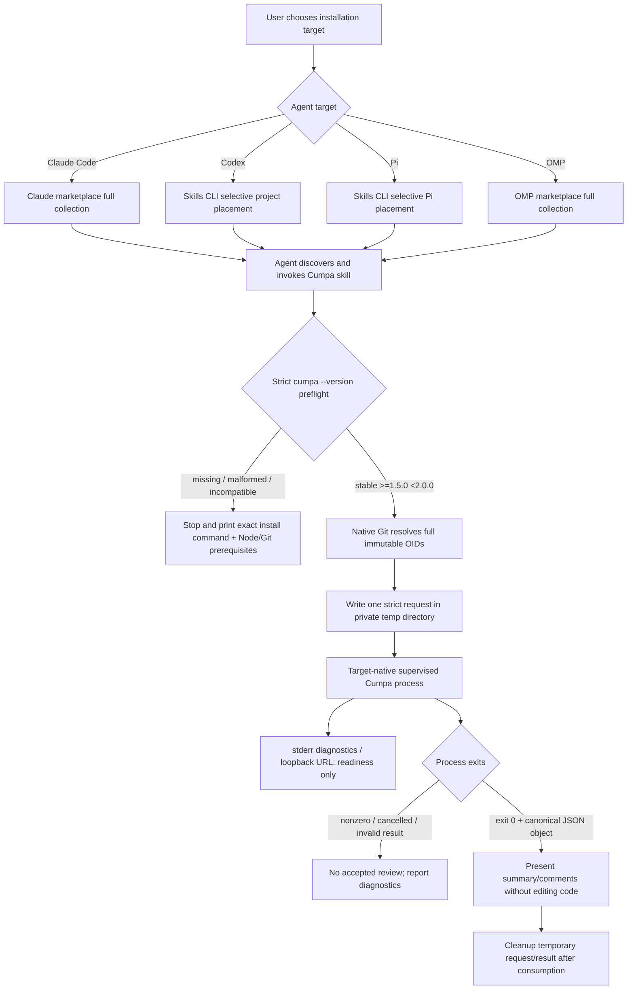

# Phase 6: Independent MIT Marketplace Skill - Research

**Researched:** 2026-09-11
**Domain:** Agent Skill marketplace packaging, cross-agent discovery, CLI compatibility gating, and long-running local review delegation
**Confidence:** MEDIUM — Cumpa contracts and local tool versions are directly verified; external agent and installer behavior is grounded in current official documentation/source but installation and runtime flows were intentionally not exercised.

<user_constraints>
## User Constraints (from CONTEXT.md)

The following text is copied from the Phase 6 context. [VERIFIED: .planning/phases/06-independent-mit-marketplace-skill/06-CONTEXT.md]

### Locked Decisions

#### Marketplace packaging
- **D-01:** Add Cumpa to the existing `ship-with-ai` collection in `Ship-With-AI/skills`, under the established `skills/cumpa/` layout. Do not create a standalone Cumpa plugin or a new marketplace. Native Claude Code plugin users receive the collection; Skills CLI users can select only Cumpa.
- **D-02:** Carry a self-contained MIT license with the Cumpa skill. Preserve the approved standard MIT text and the existing copyright attribution to Alessandro Magionami & Manuel Salvatore Martone from the source repository. This carries forward the legal boundary already decided; it does not relicense other marketplace skills, merge application and skill installation lifecycles, or invent new legal assent.

#### Installed CLI compatibility
- **D-03:** Accept stable Cumpa CLI versions **`>=1.5.0 <2.0.0`**. Reject prereleases, older versions, major version 2 or later, and unparseable version output. The user explicitly chose this broader 1.x compatibility policy over an exact-version or 1.5.x-only gate.
- **D-04:** If `cumpa` is missing, incompatible, or reports an unparseable version, stop and show the exact command `npm install --global @shipwithai/cumpa@1.5.0`, together with the Node.js 24+ and Git 2.43.0+ prerequisites. Never automatically install, upgrade, fall back to npx, or substitute a source checkout/local tarball.
- **D-05:** Keep the distinction between policy and proof: 1.5.0 is the independently verified release. Accepting future stable 1.x versions is not evidence that those versions have been tested. Do not claim future compatibility has already been exercised.

#### Supported agent paths
- **D-06:** Explicitly support **Claude Code, Codex, Pi, and OMP**. Pi and OMP are distinct targets; do not treat one target's result as evidence for the other. This four-agent list is the user's custom selection.
- **D-07:** Research and document the actual supported installation/discovery path and invocation form for each target, then perform targeted installation/discovery and prerequisite checks for all four. Reuse the marketplace's native plugin and selective Skills CLI paths where supported. Do not assume the Skills CLI supports OMP or Pi merely because it advertises many agents; do not invent a blanket "40+ agents verified" claim. Actual namespaces, discovery locations, and process-supervision behavior must be established rather than guessed.

#### Existing review authority and phase boundaries
- **D-08:** Preserve the existing skill's delegation contract. Native Git resolves requested identities; Cumpa remains responsible for grounding validation, diff generation, the browser workspace, persistence, Finish, and canonical output. Keep the supervised process alive through human review; readiness is not completion. Consume feedback only after successful exit and valid canonical JSON. Do not replace the review with the agent's own diff review, apply feedback, create review commits, mutate refs/index/worktrees, or synthesize patches to extend the protocol.
- **D-09:** Keep the skill outside the runtime-only npm artifact and preserve feature-neutral voluntary support. Do not rebuild or republish Cumpa, alter Supabase configuration, add a release framework, or expand this phase into new review behavior. Phase 7 owns the complete public browser-review/Finish/export acceptance flows.
- **D-10:** This discussion authorizes local planning records only. Implementation, marketplace publication, source pushes, and workflow actions require their later scoped execution/approval steps. Continue work on `main` without GSD branches/worktrees; preserve unrelated user work, authentication, historical release records and immutable candidate custody. Do not reuse any consumed Phase 5 authority.

### the agent's Discretion

No additional product choices were delegated with a "you decide" answer. Research and planning should resolve ordinary implementation details using existing repository conventions: prerequisite-check mechanics, portable agent instructions, any required collection-version metadata update, and how the repository-owned source relates to the marketplace copy. Avoid unnecessary helpers, dependencies, duplicate application logic, or a synchronization framework. Report genuine unsupported-agent or publication prerequisites instead of silently dropping a selected target.

### Deferred Ideas (OUT OF SCOPE)

No new capabilities were proposed. Preserve the existing Phase 7 boundary for full clean public-artifact browser review and canonical-result acceptance. Independently versioned update/uninstall guidance remains future DIST-02; do not turn this phase into a lifecycle-management system.
</user_constraints>

<phase_requirements>
## Phase Requirements

Requirement descriptions are copied from the canonical requirements file. [VERIFIED: .planning/REQUIREMENTS.md]

| ID | Description | Research Support |
|---|---|---|
| SKL-01 | Coding-agent users can install the existing Cumpa skill from the public ShipWithAI marketplace as an independently MIT-licensed plugin. | The existing root-sourced `ship-with-ai` collection is consumable by Claude Code and OMP; Skills CLI provides selective Claude Code, Codex, and Pi placement; a skill-local `LICENSE` is preserved by both plugin installation and recursive skill copying. [CITED: https://raw.githubusercontent.com/Ship-With-AI/skills/main/.claude-plugin/marketplace.json] [CITED: https://raw.githubusercontent.com/can1357/oh-my-pi/main/docs/marketplace.md] [CITED: https://raw.githubusercontent.com/vercel-labs/skills/main/src/installer.ts] |
| SKL-02 | The installed skill checks for the separately installed `cumpa` executable and, when absent, stops with the exact npm installation command and Node.js/Git prerequisites. | Use one bundled, dependency-free Node preflight to execute `cumpa --version`, parse canonical stable SemVer, enforce `>=1.5.0 <2.0.0`, and print the locked command/prerequisites on every missing, incompatible, nonzero, timed-out, or malformed result. [VERIFIED: .planning/phases/06-independent-mit-marketplace-skill/06-CONTEXT.md] [VERIFIED: .planning/phases/05-bootstrap-trusted-stable-publication/05-RELEASE-EVIDENCE.json] |
| SKL-03 | The installed skill delegates Git grounding, diff generation, browser review, persistence, Finish semantics, and canonical review output to the released Cumpa CLI without duplicating application behavior. | Preserve the existing stdin request, stderr diagnostics/readiness, delayed canonical stdout, exit-status, and result-consumption protocol; add only target-specific installation and process-lifetime instructions. [VERIFIED: .kimi-code/skills/cumpa/SKILL.md] [VERIFIED: README.md] |
</phase_requirements>

## Summary

Publish Cumpa as one more skill directory inside the existing root-sourced `ship-with-ai` collection, not as a new plugin. The current public catalog identifies marketplace `ship-with-ai-skills`, plugin `ship-with-ai`, source `./`, and a manifest whose skill root is `./skills/`; therefore `skills/cumpa/SKILL.md` joins the existing collection automatically. Native Claude Code invocation is namespaced as `/ship-with-ai:cumpa`, not bare `/cumpa`. OMP independently supports the same `.claude-plugin/marketplace.json` catalog as a fallback marketplace format and installs the same collection as `ship-with-ai@ship-with-ai-skills`; its explicit invocation is `/skill:cumpa`. [CITED: https://raw.githubusercontent.com/Ship-With-AI/skills/main/.claude-plugin/marketplace.json] [CITED: https://raw.githubusercontent.com/Ship-With-AI/skills/main/.claude-plugin/plugin.json] [CITED: https://code.claude.com/docs/en/plugins] [CITED: https://raw.githubusercontent.com/can1357/oh-my-pi/main/docs/marketplace.md] [CITED: https://raw.githubusercontent.com/can1357/oh-my-pi/main/docs/skills.md]

For selective installation, the official Skills CLI source has explicit `claude-code`, `codex`, and `pi` adapters and recursively preserves a skill's complete directory, so `SKILL.md`, `LICENSE`, scripts, references, and assets travel together. The inspected adapter table contains no OMP adapter; Phase 6 uses OMP's native marketplace commands instead. Phase 6 selects project-scoped Codex placement at `.agents/skills/cumpa` and makes no global Codex claim; this matches current Codex discovery documentation and avoids the Skills CLI's unresolved global-path divergence. [CITED: https://raw.githubusercontent.com/vercel-labs/skills/main/src/agents.ts] [CITED: https://raw.githubusercontent.com/vercel-labs/skills/main/src/installer.ts] [CITED: https://learn.chatgpt.com/docs/build-skills]

The only new executable behavior should be a small skill-local compatibility preflight built from Node.js standard library APIs. It accepts canonical three-component stable SemVer in `>=1.5.0 <2.0.0`, including valid build metadata, rejects prereleases, prefixes, labels, leading-zero core components, malformed metadata and multiple lines, and compares numeric components without JavaScript `Number` precision loss. After preflight, preserve the existing thin delegation: native Git selects immutable inputs; Cumpa owns validation, diffing, browser review, persistence, Finish and canonical export. [VERIFIED: .planning/phases/06-independent-mit-marketplace-skill/06-CONTEXT.md]

**Primary recommendation:** Add a self-contained `skills/cumpa/` directory with the exact MIT license, a strict standard-library preflight, and one shared protocol body plus four short target-specific install/invocation/process notes; make no application, npm-release, review, or framework changes. [VERIFIED: .planning/phases/06-independent-mit-marketplace-skill/06-CONTEXT.md]

## Architectural Responsibility Map

| Capability | Primary Tier | Secondary Tier | Rationale |
|---|---|---|---|
| Marketplace catalog and collection version | Distribution / marketplace | Agent installer | Existing root plugin metadata determines collection identity, discovery root, and update signal. [CITED: https://raw.githubusercontent.com/Ship-With-AI/skills/main/.claude-plugin/plugin.json] [CITED: https://code.claude.com/docs/en/plugins] |
| Skill discovery and invocation | Agent runtime | Distribution / marketplace | Claude Code, Codex, Pi, and OMP own their discovery locations, namespaces, and invocation syntax. [CITED: https://code.claude.com/docs/en/skills] [CITED: https://learn.chatgpt.com/docs/build-skills] [CITED: https://raw.githubusercontent.com/badlogic/pi-mono/main/packages/coding-agent/docs/skills.md] [CITED: https://raw.githubusercontent.com/can1357/oh-my-pi/main/docs/skills.md] |
| CLI availability and version policy | Skill preflight | Operating system `PATH` | The skill may verify the separately installed executable but must not install or upgrade it. [VERIFIED: .planning/phases/06-independent-mit-marketplace-skill/06-CONTEXT.md] |
| Revision identity resolution | Installed Git CLI | Skill orchestration | Native Git remains the source of truth for refs, worktrees, merge bases, and full OIDs; the skill only requests those operations. [VERIFIED: .kimi-code/skills/spike-findings-cumpa/references/cli-source-discovery.md] [VERIFIED: .kimi-code/skills/cumpa/SKILL.md] |
| Grounding validation and diff generation | Cumpa CLI | — | Cumpa validates the request and derives the review diff; duplicating this in the skill is prohibited. [VERIFIED: .kimi-code/skills/cumpa/SKILL.md] |
| Browser review, persistence, Finish, canonical export | Cumpa CLI / browser workspace | Repository-local `.cumpa/` persistence | These are application responsibilities and remain unchanged. [VERIFIED: .kimi-code/skills/cumpa/SKILL.md] [VERIFIED: .claude/CLAUDE.md] |
| Long-running process lifetime | Agent runtime supervisor | Skill orchestration | Each target supplies a different supported execution model; all must distinguish readiness from exit. [CITED: https://code.claude.com/docs/en/tools-reference] [CITED: https://learn.chatgpt.com/docs/config-file/config-basic] [VERIFIED: installed Pi 0.80.2 `dist/core/tools/bash.js`] [CITED: https://raw.githubusercontent.com/can1357/oh-my-pi/main/README.md] |
| Feedback application | Calling coding agent or user after review | — | Phase 6 stops at presenting canonical feedback; the Cumpa skill must not edit, stage, commit, or push. [VERIFIED: .kimi-code/skills/cumpa/SKILL.md] |

## Project Constraints

- Use Node.js 24 LTS and TypeScript/JavaScript end to end; do not introduce another runtime for the preflight. [VERIFIED: .claude/CLAUDE.md]
- Invoke the installed Git CLI as the source of truth; do not add a JavaScript Git implementation. [VERIFIED: .claude/CLAUDE.md]
- Keep Cumpa bound to loopback on an ephemeral port and let the application own browser launch; the skill must not expose or replace the server. [VERIFIED: .claude/CLAUDE.md]
- Canonical request/export contracts remain application-owned Zod schemas; the skill performs only the existing outer handoff checks and must not fork those schemas. [VERIFIED: .claude/CLAUDE.md] [VERIFIED: .kimi-code/skills/cumpa/SKILL.md]
- Phase work remains on `main` without branches/worktrees, and no source or remote mutation is authorized by this research. [VERIFIED: .planning/phases/06-independent-mit-marketplace-skill/06-CONTEXT.md]

## Standard Stack

### Core

| Component | Version / contract | Purpose | Why standard here |
|---|---|---|---|
| Existing `Ship-With-AI/skills` marketplace | Refresh `main` before implementation; observed plugin manifest `0.2.0` | Public collection and native Claude/OMP install surface | It is the locked existing collection and already uses a root plugin with `./skills/` discovery. [CITED: https://raw.githubusercontent.com/Ship-With-AI/skills/main/.claude-plugin/marketplace.json] [CITED: https://raw.githubusercontent.com/Ship-With-AI/skills/main/.claude-plugin/plugin.json] |
| Agent Skills directory format | Current specification | Portable `SKILL.md` plus bundled `LICENSE`, scripts, references, and assets | The specification permits arbitrary additional skill files and allows `license` to reference a bundled license. [CITED: https://agentskills.io/specification] |
| `@shipwithai/cumpa` [WARNING: flagged as suspicious — verify before using.] | Policy `>=1.5.0 <2.0.0`; independently verified release `1.5.0` only | Separately installed review application | Phase 5 binds the public package, binary name, Node engine, archive, and consumer checks; the phase must not install or republish it. The legitimacy seam flags it `SUS` because it is too new and download counts are unavailable. [VERIFIED: .planning/phases/05-bootstrap-trusted-stable-publication/05-RELEASE-EVIDENCE.json] [VERIFIED: package-legitimacy seam]
| Node.js standard library | Node.js 24+ | `spawnSync`/`execFile` compatibility preflight and strict result parsing | Node 24 is already a CLI prerequisite, so no new runtime package is needed. [VERIFIED: .planning/phases/05-bootstrap-trusted-stable-publication/05-RELEASE-EVIDENCE.json] |
| Installed Git CLI | Git 2.43.0+ prerequisite | Full OIDs, merge bases, ancestor semantics, and committed worktree heads | This preserves the project's native-Git authority boundary. [VERIFIED: README.md] [VERIFIED: .claude/CLAUDE.md] |

### Supporting

| Component | Observed version | Purpose | When to use |
|---|---|---|---|
| `skills` [WARNING: flagged as suspicious — verify before using.] | npm/source `1.5.25` on 2026-09-11 | Selective Cumpa-only install for Claude Code, Codex, and Pi | Use only for the three explicit adapters; it is an installer route, not a runtime dependency. The legitimacy seam flags the latest publication `SUS` as too new despite the official repository and high recorded downloads. [CITED: https://github.com/vercel-labs/skills] [CITED: https://raw.githubusercontent.com/vercel-labs/skills/main/package.json] [VERIFIED: package-legitimacy seam] |
| Claude Code native marketplace | Installed CLI `2.1.160` | Full-collection Claude installation and namespaced invocation | Use for Claude users who choose the native marketplace path. [VERIFIED: local `claude --version` and `claude plugin --help`] [CITED: https://code.claude.com/docs/en/plugins] |
| Codex Agent Skills | Installed CLI `0.135.0` | Project `.agents/skills` discovery and `$cumpa`/`/skills` invocation | Use project scope for the required Phase 6 proof. Global placement is outside the Phase 6 support claim because current Codex docs and the Skills CLI adapter name different global roots. [VERIFIED: local `codex --version`] [CITED: https://learn.chatgpt.com/docs/build-skills] [CITED: https://raw.githubusercontent.com/vercel-labs/skills/main/src/agents.ts] |
| Pi Agent Skills | Installed CLI `0.80.2` | `.pi/skills` or `.agents/skills` discovery and `/skill:cumpa` invocation | Use the explicit Skills CLI `pi` adapter, then prove discovery independently. [VERIFIED: installed `@earendil-works/pi-coding-agent/package.json`] [CITED: https://raw.githubusercontent.com/badlogic/pi-mono/main/packages/coding-agent/docs/skills.md] |
| OMP marketplace and supervisor | Installed CLI `18.1.16` | Native Claude-compatible marketplace installation, `/skill:cumpa`, named long-running process supervision | Use OMP's own marketplace and process model; do not reuse Pi evidence or invent a Skills CLI adapter. [VERIFIED: local `omp --version`, `omp plugin --help`, and process tool schema] [CITED: https://raw.githubusercontent.com/can1357/oh-my-pi/main/docs/marketplace.md] |

### Alternatives Rejected by Locked Decisions

| Instead of | Rejected alternative | Reason |
|---|---|---|
| Existing root `ship-with-ai` collection | Standalone Cumpa plugin or new marketplace | D-01 fixes the collection and layout. [VERIFIED: .planning/phases/06-independent-mit-marketplace-skill/06-CONTEXT.md] |
| Separate installed Cumpa CLI | Bundle, auto-install, auto-upgrade, `npx`, source checkout, or local tarball fallback | D-04 and D-09 require independent lifecycles and an explicit stop. [VERIFIED: .planning/phases/06-independent-mit-marketplace-skill/06-CONTEXT.md] |
| Small standard-library compatibility gate | `semver` dependency or a package-manager framework | Canonical stable `MAJOR.MINOR.PATCH` plus one closed range comparison does not justify a dependency. [VERIFIED: .planning/phases/06-independent-mit-marketplace-skill/06-CONTEXT.md] |
| Target-specific runtime instructions | Generic “40+ agents” claim | D-06 and D-07 require four independently grounded paths. [VERIFIED: .planning/phases/06-independent-mit-marketplace-skill/06-CONTEXT.md] |

**Installation routes after authorized publication:**

```text
# Claude Code interactive session: native full collection
/plugin marketplace add Ship-With-AI/skills
/plugin install ship-with-ai@ship-with-ai-skills
/ship-with-ai:cumpa

# Codex project skill
npx --yes skills@1.5.25 add Ship-With-AI/skills --skill cumpa -a codex

# Pi project skill
npx --yes skills@1.5.25 add Ship-With-AI/skills --skill cumpa -a pi

# OMP native marketplace registration in owned XDG state; project-scoped plugin install
omp plugin marketplace add Ship-With-AI/skills
omp plugin install --scope project ship-with-ai@ship-with-ai-skills
```

These are post-publication routes established by current docs/source, not observed Phase 6 installation success. [CITED: https://raw.githubusercontent.com/Ship-With-AI/skills/main/README.md] [CITED: https://raw.githubusercontent.com/vercel-labs/skills/main/src/agents.ts] [CITED: https://raw.githubusercontent.com/can1357/oh-my-pi/main/docs/marketplace.md]

The separately installed application command remains exactly:

```text
npm install --global @shipwithai/cumpa@1.5.0
Requires Node.js 24+ and Git 2.43.0+.
```

The skill prints this text only after a failed preflight and never executes it. [VERIFIED: .planning/phases/06-independent-mit-marketplace-skill/06-CONTEXT.md]

## Package Legitimacy Audit

The skill introduces **no new runtime package**. Node's standard library implements the preflight; `skills` is a user-selected installer route; `@shipwithai/cumpa` is a separately installed application with Phase 5 evidence. [VERIFIED: .planning/phases/06-independent-mit-marketplace-skill/06-CONTEXT.md] [VERIFIED: .planning/phases/05-bootstrap-trusted-stable-publication/05-RELEASE-EVIDENCE.json]

| Package | Registry observation | Age / downloads | Source repo | Postinstall | Verdict | Disposition |
|---|---|---|---|---|---|---|
| `@shipwithai/cumpa` [WARNING: flagged as suspicious — verify before using.] | npm `1.5.0`, `latest=1.5.0` | Published 2026-09-10; weekly downloads unavailable | `github.com/Ship-With-AI/cumpa` | None reported | SUS: too new, unknown downloads | Retain only as the locked separate prerequisite; never auto-install. Phase 5 is the authoritative project proof for 1.5.0. [VERIFIED: package-legitimacy seam] [VERIFIED: .planning/phases/05-bootstrap-trusted-stable-publication/05-RELEASE-EVIDENCE.json] |
| `skills` [WARNING: flagged as suspicious — verify before using.] | npm `1.5.25` | Latest published 2026-09-08; seam observed 4,354,156 weekly downloads | `github.com/vercel-labs/skills` | None reported | SUS: latest publication too new | Retain as an optional official installer route; planner must place its execution behind the Phase 6 scoped human approval/checkpoint. [CITED: https://github.com/vercel-labs/skills] [VERIFIED: package-legitimacy seam] |

**Packages removed due to SLOP verdict:** none. [VERIFIED: package-legitimacy seam]

**Packages flagged as suspicious [SUS]:** `@shipwithai/cumpa`, `skills`. The first is already independently evidenced by Phase 5 but remains outside the skill lifecycle; the second must be rechecked immediately before an authorized installer exercise because the observed latest version is recent. [VERIFIED: package-legitimacy seam] [VERIFIED: .planning/phases/05-bootstrap-trusted-stable-publication/05-RELEASE-EVIDENCE.json]

## Architecture Patterns

### System Architecture Diagram



The diagram is the existing Cumpa handoff with only distribution, preflight, and target-supervision edges added. [VERIFIED: .kimi-code/skills/cumpa/SKILL.md] [VERIFIED: .planning/phases/06-independent-mit-marketplace-skill/06-CONTEXT.md]

### Recommended Project Structure

```text
# Cumpa repository: canonical authored source and planning evidence
.kimi-code/skills/cumpa/
├── SKILL.md
├── LICENSE
└── scripts/
    └── check-cumpa.mjs

# External Ship-With-AI/skills repository: independently distributed copy
skills/cumpa/
├── SKILL.md
├── LICENSE
└── scripts/
    └── check-cumpa.mjs
.claude-plugin/
├── marketplace.json
└── plugin.json
README.md
```

Use the smallest explicit source-to-marketplace copy workflow during authorized implementation; do not build a synchronization framework. The exact skill-local MIT text must match the Cumpa root `LICENSE`, including `Copyright (c) 2026 Alessandro Magionami & Manuel Salvatore Martone`. [VERIFIED: LICENSE] [VERIFIED: .planning/phases/06-independent-mit-marketplace-skill/06-CONTEXT.md]

### Pattern 1: Self-Contained Skill Directory

**What:** Put the instruction file, exact license, and compatibility checker inside `skills/cumpa/`; reference the bundled file from frontmatter with `license: LICENSE`. [CITED: https://agentskills.io/specification]

**Why:** Agent Skills permits additional files, Skills CLI recursively copies the entire selected skill directory, and plugin installers copy/cache the plugin tree. A sibling license therefore survives selective and collection installs without depending on a marketplace-root license. [CITED: https://agentskills.io/specification] [CITED: https://raw.githubusercontent.com/vercel-labs/skills/main/src/installer.ts] [CITED: https://code.claude.com/docs/en/plugin-marketplaces]

### Pattern 2: Closed Compatibility Gate Before Any Git or Review Work

**What:** Resolve and execute `cumpa --version` with an argument array and no shell; accept only exact stable canonical SemVer in the locked range. Any spawn error, nonzero status, signal, timeout, empty output, malformed output, prerelease, old version, or major 2+ follows one stop path with the exact locked guidance. [VERIFIED: .planning/phases/06-independent-mit-marketplace-skill/06-CONTEXT.md]

**Why:** One deterministic preflight gives all four agents the same observable contract without asking a language model to reason loosely about versions. Node.js 24 is already required, so a small bundled script is less code and risk than an added semver dependency or four copies of inline shell parsing. [VERIFIED: .planning/phases/05-bootstrap-trusted-stable-publication/05-RELEASE-EVIDENCE.json]

### Pattern 3: Durable Three-File Handoff

**What:** Create a mode-0700 unique temporary directory outside the repository with request, result, and diagnostics files. Truncate/create the result before launch, write one JSON request, redirect canonical stdout and diagnostics separately, and delete owned temporary files only after the result is consumed. [VERIFIED: .kimi-code/skills/cumpa/SKILL.md]

**Why:** Cumpa reserves stdout for the final canonical export and stderr for URL/diagnostics; separate files prevent a target runtime that merges streams from corrupting the canonical result. Pi's installed Bash implementation sends both child streams to one callback and its Bash result type describes combined stdout/stderr. [VERIFIED: .kimi-code/skills/cumpa/SKILL.md] [VERIFIED: installed Pi 0.80.2 `dist/core/tools/bash.js` and `dist/core/bash-executor.d.ts`]

### Pattern 4: Target-Native Lifetime Adapter, Shared Protocol

**What:** Keep one review protocol and vary only installation, invocation, and process-lifetime instructions. [VERIFIED: .planning/phases/06-independent-mit-marketplace-skill/06-CONTEXT.md]

- Claude Code: start the fixed Cumpa command with Bash background execution, inspect the diagnostics file for the URL, keep the background task alive, then wait for exit before reading the result. If background tasks are disabled by configuration, report the unsupported runtime condition rather than detaching a shell process. [CITED: https://code.claude.com/docs/en/tools-reference]
- Codex: use its stable PTY-backed unified execution session, keep the returned process session alive, poll/write only through the supported exec session, and read the result file only after terminal exit. This recipe is documentation-grounded but remains unexecuted Phase 6 proof. [CITED: https://learn.chatgpt.com/docs/config-file/config-basic]
- Pi: use foreground Bash with no explicit timeout and redirect stdout/stderr to their files. Installed Pi 0.80.2 has no default Bash timeout, waits for child termination, kills the process tree on abort/explicit timeout, and merges both streams in tool output; foreground execution is the minimal supervised path. Do not require `tmux`, which was unavailable locally and is not a Cumpa prerequisite. [VERIFIED: installed Pi 0.80.2 `dist/core/tools/bash.js`] [CITED: https://raw.githubusercontent.com/badlogic/pi-mono/main/packages/coding-agent/README.md]
- OMP: use a stable named process through `hub`, inspect the diagnostics file or process logs for readiness, and issue a distinct wait for process exit. `start` readiness and `wait` completion are separate lifecycle observations. [VERIFIED: installed OMP 18.1.16 process tool schema] [CITED: https://raw.githubusercontent.com/can1357/oh-my-pi/main/README.md]

### Pattern 5: Publication Is a Separate Authorized State Transition

**What:** Refresh the external repository, apply the minimal reviewed delta, bump the declared collection version because the manifest currently declares one, obtain new marketplace-specific approval, then push/publish exactly that approved change. Do not infer authority from Phase 5. [CITED: https://code.claude.com/docs/en/plugins] [VERIFIED: .planning/phases/06-independent-mit-marketplace-skill/06-CONTEXT.md]

**Why:** Claude Code uses a declared plugin version as the installed update signal, and D-10 authorizes only local planning records. The next compatible collection version is an implementation-time repository decision, not a research-time authorization. [CITED: https://code.claude.com/docs/en/plugins] [VERIFIED: .planning/phases/06-independent-mit-marketplace-skill/06-CONTEXT.md]

### Anti-Patterns to Avoid

- **False compatibility from command presence:** require the exact executed version/result contract, not `command -v`.
- **Bare native Claude command:** `/cumpa` is not the canonical native-plugin name; use `/ship-with-ai:cumpa`. Bare `/cumpa` applies only to standalone skill installation when no collision changes resolution. [CITED: https://code.claude.com/docs/en/plugins] [CITED: https://code.claude.com/docs/en/skills]
- **Invented OMP Skills CLI adapter:** the inspected Skills CLI adapter table has no `omp`/`oh-my-pi` entry. Use OMP's native Claude-compatible marketplace path. [CITED: https://raw.githubusercontent.com/vercel-labs/skills/main/src/agents.ts] [CITED: https://raw.githubusercontent.com/can1357/oh-my-pi/main/docs/marketplace.md]
- **Treating readiness as completion:** a loopback URL means the browser workspace is ready, not that Finish succeeded or canonical feedback exists. [VERIFIED: .kimi-code/skills/cumpa/SKILL.md]
- **Detached shell fallback:** bare `&`, `nohup`, or an abandoned process loses the explicit lifetime/exit contract. Use the target's supervisor or Pi's blocking foreground tool. [VERIFIED: .kimi-code/skills/cumpa/SKILL.md]
- **Parsing merged tool output:** Pi combines stdout and stderr; canonical stdout must go to its own result file. [VERIFIED: installed Pi 0.80.2 `dist/core/bash-executor.d.ts`]
- **Schema fork:** do not copy Cumpa's Zod schemas or implement diff/review behavior inside the skill. Check only the existing outer handoff contract. [VERIFIED: .claude/CLAUDE.md] [VERIFIED: .kimi-code/skills/cumpa/SKILL.md]
- **Version-policy overclaim:** accepting future stable 1.x is policy, not proof that an untested release works.
- **Marketplace metadata as license text:** `"license": "MIT"` does not contain the required grant and attribution; bundle the exact `LICENSE`. [VERIFIED: LICENSE] [CITED: https://agentskills.io/specification]

### Target Installation and Invocation Contract

Plans 02 and 03 use one exact logical `commandMatrix`, never prose-derived aliases. Its top-level keys are exactly `claude-code`, `codex`, `pi`, and `omp`, in that order. Every target value is `{agentVersion:string,authRoute:string,local:Stage,public:Stage}`; every `Stage` is `{installActions:string[],discoveryPath:string,invocationIdentity:string}`. `installActions` is ordered. `commandScopeSha256` is lowercase hex SHA-256 of JCS (RFC 8785) canonical UTF-8 bytes of the complete matrix.

Each local/public evidence row is selected by exact `targetId` and stage, then must equal the matrix row's `agentVersion`, `authRoute`, normalized logical `discoveryPath`, and `invocationIdentity`. Its `installActionsSha256` must equal lowercase hex SHA-256 of JCS (RFC 8785) canonical UTF-8 bytes of that stage's ordered `installActions` array. The evidence digest includes these observed values and the result binding; a missing field fails closed rather than passing a nonempty check. [VERIFIED: .planning/phases/06-independent-mit-marketplace-skill/06-CONTEXT.md]

The candidate records `fixtureResultSha256` over the exact raw controlled compatible-fixture result bytes before assent; every later `compatibleFixture.resultSha256` must equal it. The fixture remains non-release proof. `targetProofAuthority.publicProofAttempts` is an append-only array initialized empty before assent; Plan 03 owns later attempt records and must persist an admitted `in_progress` public attempt before its first public installer/provider action. [VERIFIED: .planning/phases/06-independent-mit-marketplace-skill/06-CONTEXT.md]

### Exact Prepublication Command, Observation, Authentication Matrix

Every independent shell derives and exports roots in sequence: `CUMPA_PHASE6_PRIVATE_ROOT="${XDG_STATE_HOME:-$HOME/.local/state}/cumpa/phase6-marketplace"`, `MARKETPLACE_CHECKOUT="$CUMPA_PHASE6_PRIVATE_ROOT/Ship-With-AI-skills"`, `TARGET_ROOT="$CUMPA_PHASE6_PRIVATE_ROOT/targets"`, and `TARGET_PROJECT="$CUMPA_PHASE6_PRIVATE_ROOT/project"`. Target mappings are `CLAUDE_CONFIG_DIR="$TARGET_ROOT/claude/config"`, `CODEX_HOME="$TARGET_ROOT/codex/home"`, `PI_CODEX_HOME="$TARGET_ROOT/pi/home"`, and `OMP_HOME="$TARGET_ROOT/omp"`. Expanded absolute paths and recovery state belong only in mode-0600 `$CUMPA_PHASE6_PRIVATE_ROOT/operation.json`; committed records retain these logical variable names. No verifier relies on environment state from a prior shell.

| Target key / `agentVersion` | Exact `authRoute` vocabulary | `local.installActions` / `public.installActions` | `discoveryPath` / `invocationIdentity` | Lifecycle |
|---|---|---|---|---|
| `claude-code` / `2.1.160` | Selected exact label `ambient:<supported-provider-env-name>` or `temporary:CLAUDE_CONFIG_DIR`; never read/copy the value or profile | Local ordered actions: `/plugin marketplace add <MARKETPLACE_CHECKOUT>`, `/plugin install ship-with-ai@ship-with-ai-skills`. Before dispatch, read `MARKETPLACE_CHECKOUT` from the private journal and replace the placeholder with its literal private path; slash commands do not perform shell expansion, and expanded text stays private. Public actions replace only the first action with `/plugin marketplace add Ship-With-AI/skills`. [CITED: https://code.claude.com/docs/en/plugin-marketplaces] | Logical installed cache path for the exact `ship-with-ai` candidate skill / `/ship-with-ai:cumpa`; exact candidate hashes required | Background Bash must be enabled; observe readiness separately from terminal exit, with no detached fallback. [CITED: https://code.claude.com/docs/en/tools-reference] |
| `codex` / `0.135.0` | Selected exact label `ambient:OPENAI_API_KEY` or `temporary:CODEX_HOME`; never read/copy `auth.json` | Local: `npx --yes skills@1.5.25 add "$MARKETPLACE_CHECKOUT" --skill cumpa -a codex`. Public: `npx --yes skills@1.5.25 add Ship-With-AI/skills --skill cumpa -a codex`. Keep `-g` omitted and retain the pinned installer integrity gate. [CITED: https://github.com/vercel-labs/skills] | `$TARGET_PROJECT/.agents/skills/cumpa` / `$cumpa`; exact candidate hashes required and no global-placement claim. [CITED: https://learn.chatgpt.com/docs/build-skills] | Keep the returned unified-exec PTY session alive; observe readiness and terminal exit before reading a result. |
| `pi` / `0.80.2` | Selected exact label `ambient:<supported-provider-env-name>` or `temporary:PI_CODEX_HOME`; never read/copy auth data | Local: `npx --yes skills@1.5.25 add "$MARKETPLACE_CHECKOUT" --skill cumpa -a pi`. Public: `npx --yes skills@1.5.25 add Ship-With-AI/skills --skill cumpa -a pi`. Keep `-g` omitted and retain the pinned installer integrity gate. [CITED: https://raw.githubusercontent.com/vercel-labs/skills/main/src/agents.ts] | `$TARGET_PROJECT/.pi/skills/cumpa` / `/skill:cumpa`; exact candidate hashes required. [CITED: https://raw.githubusercontent.com/badlogic/pi-mono/v0.80.2/packages/coding-agent/docs/skills.md] | Foreground Bash, no explicit timeout; canonical stdout goes to the result file, stderr remains human-visible, and terminal exit is distinct from readiness. |
| `omp` / `18.1.16` | Selected exact label `ambient:ANTHROPIC_OAUTH_TOKEN`, `ambient:ANTHROPIC_API_KEY`, `ambient:OPENAI_API_KEY`, `ambient:OPENAI_CODEX_OAUTH_TOKEN`, or `temporary:OMP_HOME`; never read/copy auth data | With `PI_CODING_AGENT_DIR="$OMP_HOME/agent"` and XDG config/data/state/cache under `OMP_HOME`, local ordered actions are `omp plugin marketplace add "$MARKETPLACE_CHECKOUT"` then `omp plugin install --scope project ship-with-ai@ship-with-ai-skills`; public actions replace only the marketplace source with `Ship-With-AI/skills`. Marketplace registration is isolated; only install is claimed project-scoped. [CITED: https://raw.githubusercontent.com/can1357/oh-my-pi/v18.1.16/docs/marketplace.md] | Logical project plugin tree `ship-with-ai/skills/cumpa` / `/skill:cumpa`; inspect/reload as required and prove exact candidate hashes. [CITED: https://raw.githubusercontent.com/can1357/oh-my-pi/v18.1.16/docs/skills.md] | Use OMP's named supervised process; record readiness and a distinct wait-for-exit observation. |

For every target and stage, proof invokes the installed skill separately against owned PATH fixtures for missing `cumpa`, incompatible canonical `2.0.0`, and controlled compatible `1.5.0`. Missing and incompatible rows emit exact D-04 guidance and prove no Git/review launch. Compatible rows carry `resultSha256 === fixtureResultSha256` and the exact matrix bindings in their derived evidence digest. Separately, one installed-skill smoke uses the real already-installed released Cumpa `1.5.0` in a disposable Git repository, observes actual readiness, performs a controlled abort, and records the real exit; it does not press Finish, accept/export feedback, or claim Phase 7 browser acceptance.

The public stage is conditional on anonymous public `main` being byte-identical to the candidate OID and on separate publication authority. Before the first public installer/provider action, append an admitted `in_progress` entry to `targetProofAuthority.publicProofAttempts` bound to candidate, installer, command matrix, auth route, assent scope, and allowed actions. An interrupted `in_progress` or uncertain attempt permits read-only reconciliation only; repetition requires fresh scoped assent.

## Proposed Minimal Affected Files

| Repository | File | Required change | Why |
|---|---|---|---|
| Cumpa source | `.kimi-code/skills/cumpa/SKILL.md` | Add the exact compatibility/precondition contract, target-specific portable guidance, and bundled-checker reference while preserving the review protocol. | This is the existing repository-owned source, not a new review implementation. [VERIFIED: .kimi-code/skills/cumpa/SKILL.md] |
| Cumpa source | `.kimi-code/skills/cumpa/LICENSE` | Copy the exact root `LICENSE` text. | Keeps the distributable skill self-contained. [VERIFIED: LICENSE] |
| Cumpa source | `.kimi-code/skills/cumpa/scripts/check-cumpa.mjs` | Implement one dependency-free fail-closed preflight. | Avoids repeated model-dependent parsing across four targets. [VERIFIED: .planning/phases/06-independent-mit-marketplace-skill/06-CONTEXT.md] |
| External marketplace | `skills/cumpa/**` | Copy the reviewed self-contained skill directory exactly. | D-01 fixes the layout and independent distribution boundary. [VERIFIED: .planning/phases/06-independent-mit-marketplace-skill/06-CONTEXT.md] |
| External marketplace | `README.md` | Add correct target-specific Cumpa install/invocation guidance. | Existing broad guidance lacks all-four target proof. [CITED: https://raw.githubusercontent.com/Ship-With-AI/skills/main/README.md] |
| External marketplace | `.claude-plugin/plugin.json` | From the actual canonical baseline, apply one minor feature bump with patch reset to zero and record exact old/new values. | This is the authoritative installed-plugin version signal. [CITED: https://code.claude.com/docs/en/plugins] |
| External marketplace | `.claude-plugin/marketplace.json` | Preserve the established plugin-entry shape; update only an existing collection description when needed to keep its enumerated skill list truthful. Do not add or require an entry-level version field. | The current catalog entry is `{name, source}`; the authoritative collection version remains `.claude-plugin/plugin.json`. [CITED: https://raw.githubusercontent.com/Ship-With-AI/skills/main/.claude-plugin/marketplace.json] |

Do not add a standalone Cumpa plugin manifest, package manifest, lockfile, AI framework, review client, release framework, or source-copy synchronizer. [VERIFIED: .planning/phases/06-independent-mit-marketplace-skill/06-CONTEXT.md]

## Don't Hand-Roll

| Problem | Don't Build | Use Instead | Why |
|---|---|---|---|
| Marketplace/discovery | New marketplace, standalone Cumpa plugin, installer, or OMP adapter | Existing `ship-with-ai` root plugin; Claude/OMP native marketplace commands; Skills CLI's Codex/Pi adapters | Existing supported distribution surfaces cover all four targets. |
| SemVer gate | Dependency, range parser, or package-manager abstraction | Exact canonical parser and fixed `>=1.5.0 <2.0.0` predicate | The policy is one closed range and adds no dependency. |
| Git model | Ref/worktree parser, merge-base algorithm, or patch synthesis | Installed Git CLI with quoted argument arrays and full OIDs | Native Git is the project's semantic authority. |
| Diff/review protocol | Agent-side diff renderer, comment model, persistence, or exporter | Cumpa stdin/browser/Finish/stdout protocol | Duplication would violate SKL-03. |
| Cross-agent process control | New daemon or universal supervisor | Four small branches using each target's supported process primitive | Only lifecycle controls differ. |
| License generation | SPDX-only metadata or rewritten legal text | Exact copied root `LICENSE` and `license: LICENSE` | The locked independent grant requires complete text and attribution. |
| Publication | Release workflow, auto-push, or reused npm approval | Existing marketplace repository process plus new scoped approval | Phase 5 npm authority is unrelated. |

**Key insight:** Phase 6 distributes instructions and a preflight, not a second application. Every behavior after successful preflight routes to native Git or Cumpa rather than being reimplemented in the skill. [VERIFIED: .planning/REQUIREMENTS.md]

## Common Pitfalls

### Pitfall 1: Native Claude Name Is Misdocumented

**What goes wrong:** Users install the collection and try `/cumpa`, while the plugin command is namespaced `/ship-with-ai:cumpa`. [CITED: https://code.claude.com/docs/en/plugins]

**Why it happens:** The current marketplace README claims the same bare form regardless of install path. [CITED: https://raw.githubusercontent.com/Ship-With-AI/skills/main/README.md]

**How to avoid:** Document native and standalone forms separately and prove each in its own isolated target profile. [CITED: https://code.claude.com/docs/en/plugins]

**Warning signs:** A verification records natural-language activation but never records the exact explicit command shown by the installed target. [VERIFIED: .planning/phases/06-independent-mit-marketplace-skill/06-CONTEXT.md]

### Pitfall 2: “Command Exists” Is Mistaken for Compatibility

**What goes wrong:** `command -v cumpa` passes for an old, prerelease, 2.x, malformed, or PATH-shadowed executable. [VERIFIED: .planning/phases/06-independent-mit-marketplace-skill/06-CONTEXT.md]

**How to avoid:** Execute `cumpa --version`, require exit 0, and parse one exact canonical stable version before any Git resolution or review launch. [VERIFIED: .planning/phases/06-independent-mit-marketplace-skill/06-CONTEXT.md]

**Warning signs:** Acceptance uses prefix checks, lexical comparison, accepts `v1.5.0`, ignores extra lines, or imports a semver package. [VERIFIED: .planning/phases/06-independent-mit-marketplace-skill/06-CONTEXT.md]

### Pitfall 3: Policy Is Reported as Proof

**What goes wrong:** Documentation says all future 1.x releases work because the gate accepts them. [VERIFIED: .planning/phases/06-independent-mit-marketplace-skill/06-CONTEXT.md]

**How to avoid:** State “accepted by policy” for future stable 1.x and “independently verified” only for 1.5.0. [VERIFIED: .planning/phases/05-bootstrap-trusted-stable-publication/05-VERIFICATION.md]

### Pitfall 4: Codex Global Install Is Assumed

**What goes wrong:** A global Skills CLI install lands under `$CODEX_HOME/skills`, while current Codex docs tell authors to use `$HOME/.agents/skills`; discovery may not match the documentation. [CITED: https://raw.githubusercontent.com/vercel-labs/skills/main/src/agents.ts] [CITED: https://learn.chatgpt.com/docs/build-skills]

**How to avoid:** The required Phase 6 proof deliberately uses project `.agents/skills`; global Codex installation is excluded from the support claim unless a separately observed route is added later. [VERIFIED: research comparison of cited sources]

### Pitfall 5: Pi and OMP Are Collapsed

**What goes wrong:** Pi's installation or runtime result is reported as OMP evidence, or an unsupported `-a omp` flag is invented. [CITED: https://raw.githubusercontent.com/vercel-labs/skills/main/src/agents.ts]

**How to avoid:** Use Skills CLI's real Pi adapter and OMP's native Claude-compatible marketplace independently; record separate discovery, invocation, preflight, and process evidence. [CITED: https://raw.githubusercontent.com/badlogic/pi-mono/main/packages/coding-agent/docs/skills.md] [CITED: https://raw.githubusercontent.com/can1357/oh-my-pi/main/docs/marketplace.md]

### Pitfall 6: Browser URL Is Treated as Review Completion

**What goes wrong:** The agent reads an empty result, stops the process, or invents feedback as soon as it sees the URL. [VERIFIED: .kimi-code/skills/cumpa/SKILL.md]

**How to avoid:** Treat the URL as readiness only. Wait for process exit, require status 0, then accept exactly one non-empty parseable JSON object with `kind: "cumpa/export"`. [VERIFIED: .kimi-code/skills/cumpa/SKILL.md]

### Pitfall 7: Canonical JSON Is Mixed with Diagnostics

**What goes wrong:** A target that combines streams makes the result unparseable. [VERIFIED: installed Pi 0.80.2 `dist/core/bash-executor.d.ts`]

**How to avoid:** Redirect stdout to the result file and stderr to diagnostics before the process starts; never parse the agent tool's combined display as canonical output. [VERIFIED: .kimi-code/skills/cumpa/SKILL.md]

### Pitfall 8: Plugin Content Changes Without a Version Signal

**What goes wrong:** Existing Claude installs stay on a cached version and never receive Cumpa. [CITED: https://code.claude.com/docs/en/plugins] [CITED: https://code.claude.com/docs/en/plugin-marketplaces]

**How to avoid:** Refresh the marketplace, choose the repository's next compatible collection version during authorized implementation, and update it with the reviewed content. [CITED: https://code.claude.com/docs/en/plugins]

### Pitfall 9: Installer Proof Mutates a Real User Profile

**What goes wrong:** A test overwrites user skills, plugin registries, settings, or authentication. [VERIFIED: .planning/phases/06-independent-mit-marketplace-skill/06-CONTEXT.md]

**How to avoid:** Use isolated project/profile roots and explicit scopes; preserve existing credentials and configuration; record only non-sensitive evidence. [VERIFIED: .planning/phases/06-independent-mit-marketplace-skill/06-CONTEXT.md]

### Pitfall 10: Marketplace Publication Reuses npm Authority

**What goes wrong:** The completed Phase 5 approval is treated as permission to push or publish skill changes. [VERIFIED: .planning/phases/06-independent-mit-marketplace-skill/06-CONTEXT.md]

**How to avoid:** Add a new marketplace-specific checkpoint naming the exact repository, reviewed delta, and authorized operation; no remote mutation belongs to research/planning. [VERIFIED: .planning/phases/06-independent-mit-marketplace-skill/06-CONTEXT.md]

## Code Examples

### Strict Dependency-Free Version Gate

```js
// Recommended implementation pattern; policy source:
// .planning/phases/06-independent-mit-marketplace-skill/06-CONTEXT.md
import { spawnSync } from "node:child_process";

const guidance = [
  "npm install --global @shipwithai/cumpa@1.5.0",
  "Requires Node.js 24+ and Git 2.43.0+.",
].join("\n");

function stop() {
  process.stderr.write(`${guidance}\n`);
  process.exit(1);
}

const result = spawnSync("cumpa", ["--version"], {
  encoding: "utf8",
  shell: false,
  timeout: 10_000,
  maxBuffer: 4_096,
  windowsHide: true,
});

if (result.error || result.signal || result.status !== 0) stop();

const match = /^(0|[1-9][0-9]*)\.(0|[1-9][0-9]*)\.(0|[1-9][0-9]*)(?:\+[0-9A-Za-z-]+(?:\.[0-9A-Za-z-]+)*)?$/.exec(
  result.stdout.trim(),
);
if (!match) stop();

const [, major, minor] = match;
if (major !== "1" || (minor.length === 1 && minor < "5")) stop();
```

This accepts stable canonical `1.5.0` through future stable `1.x`, including valid build metadata such as `1.5.0+build.1`. It rejects `1.4.9`, `2.0.0`, prereleases, malformed build metadata, leading-zero core components, labels and multi-line output. Core components remain strings to avoid narrowing valid SemVer through numeric overflow. Build metadata does not change stability or precedence; its rejection in the initial research draft was not a user decision and has been corrected. This is an unexecuted implementation example, not runtime proof. [VERIFIED: .planning/phases/06-independent-mit-marketplace-skill/06-CONTEXT.md] [CITED: https://semver.org/ §9–11]

### Revision Request

```json
{
  "kind": "cumpa.review-request",
  "schemaVersion": 1,
  "mode": "revisions",
  "revisions": {
    "base": "<full-merge-base-oid>",
    "head": "<full-head-oid>"
  }
}
```

Resolve both tips with native Git, compute the merge base, and send immutable full OIDs. Worktree selection means committed `HEAD`, not dirty bytes. [VERIFIED: .kimi-code/skills/cumpa/SKILL.md]

### Exact Patch Request

```json
{
  "kind": "cumpa.review-request",
  "schemaVersion": 1,
  "mode": "patch",
  "patch": {
    "content": "<exact UTF-8 patch>",
    "target": { "kind": "repository" }
  }
}
```

Use this only when the user supplies the exact patch and asks to review it; never synthesize a patch or temporary commit to extend Cumpa. [VERIFIED: .kimi-code/skills/cumpa/SKILL.md]

### Stream-Separated Cumpa Launch

```sh
env -u CMUX_WORKSPACE_ID cumpa \
  < "$CUMPA_REQUEST" \
  > "$CUMPA_RESULT" \
  2> "$CUMPA_DIAGNOSTICS"
```

Run this fixed command from the reviewed repository under the target's supported supervisor. Read the diagnostics file to surface the loopback URL, but do not read the result until the supervised process exits. The command is the existing protocol with explicit diagnostic capture and was not launched during research. [VERIFIED: .kimi-code/skills/cumpa/SKILL.md]

### Result Acceptance Boundary

```js
// Outer handoff check only; do not copy Cumpa's application schema into the skill.
const value = JSON.parse(await readFile(resultPath, "utf8"));
if (!value || typeof value !== "object" || Array.isArray(value)) throw new Error("invalid result");
if (value.kind !== "cumpa/export") throw new Error("invalid result kind");
```

Apply this only after confirmed exit 0 and non-empty output. Nonzero exit, cancellation, failed Finish, empty output, or invalid JSON yields no consumable review. [VERIFIED: .kimi-code/skills/cumpa/SKILL.md]

## State of the Art

| Older / unsafe assumption | Current supported contract | Impact for Phase 6 |
|---|---|---|
| One bare slash command works after every installation route | Claude plugin skills are namespaced; Codex uses `$cumpa` or `/skills`; Pi and OMP use `/skill:cumpa`. [CITED: https://code.claude.com/docs/en/plugins] [CITED: https://learn.chatgpt.com/docs/build-skills] [CITED: https://raw.githubusercontent.com/badlogic/pi-mono/main/packages/coding-agent/docs/skills.md] [CITED: https://raw.githubusercontent.com/can1357/oh-my-pi/main/docs/skills.md] | Public guidance must identify the exact target and install route. |
| Skills CLI's broad marketing list proves OMP | Current adapter source has Claude Code, Codex, and Pi entries but no OMP entry. [CITED: https://raw.githubusercontent.com/vercel-labs/skills/main/src/agents.ts] | Use OMP's native Claude-compatible marketplace support and prove it independently. |
| Marketplace metadata alone carries MIT terms | Agent Skills supports a skill-local license reference and arbitrary bundled files. [CITED: https://agentskills.io/specification] | Ship exact `skills/cumpa/LICENSE` text and `license: LICENSE`. |
| Plugin repository changes automatically update installed Claude users | A declared plugin version is the update signal and installed plugins are cached copies. [CITED: https://code.claude.com/docs/en/plugins] [CITED: https://code.claude.com/docs/en/plugin-marketplaces] | Authorized content publication must include the collection's version transition. |
| Command presence is adequate | The locked policy requires a canonical stable range check and explicit failure instructions. [VERIFIED: .planning/phases/06-independent-mit-marketplace-skill/06-CONTEXT.md] | Add one deterministic preflight before Git or Cumpa protocol work. |
| A single generic background recipe works everywhere | Claude background tasks, Codex PTY exec, Pi blocking Bash, and OMP named supervision have distinct lifecycle contracts. [CITED: https://code.claude.com/docs/en/tools-reference] [CITED: https://learn.chatgpt.com/docs/config-file/config-basic] [VERIFIED: installed Pi 0.80.2 source] [VERIFIED: installed OMP 18.1.16 tool schema] | Keep shared protocol instructions and four minimal lifetime adapters. |

**Deprecated/outdated for this phase:** the marketplace README's blanket bare-command statement and “40+ agents” language cannot serve as evidence for the selected four targets. It should be corrected only to the extent necessary for truthful Cumpa instructions; no marketplace-wide rewrite is required. [CITED: https://raw.githubusercontent.com/Ship-With-AI/skills/main/README.md] [VERIFIED: .planning/phases/06-independent-mit-marketplace-skill/06-CONTEXT.md]

## Assumptions Log

| # | Claim | Section | Risk if Wrong |
|---|---|---|---|
| — | No untagged product assumption is required. External target behavior is documented but explicitly remains subject to Phase 6 targeted proof on the installed versions. | All | The planner must not promote documentation-grounded recipes to observed compatibility before executing the authorized target checks. [VERIFIED: .planning/phases/06-independent-mit-marketplace-skill/06-CONTEXT.md] |

## Open Questions (RESOLVED)

1. **Codex placement — resolved to project scope.** Phase 6 uses `$TARGET_PROJECT/.agents/skills/cumpa`, matching both current Codex project discovery and the Skills CLI project adapter. Global Skills CLI placement is not claimed because its `$CODEX_HOME/skills` target differs from Codex's documented user `$HOME/.agents/skills`. [CITED: https://raw.githubusercontent.com/vercel-labs/skills/main/src/agents.ts] [CITED: https://learn.chatgpt.com/docs/build-skills]

2. **Collection version — resolved by actual-object fresh-baseline policy.** Immediately before candidate editing, read `.claude-plugin/plugin.json` from the exact recorded baseline OID. At verification, require that OID to equal the candidate's actual parent, require the manifest read from it to agree with `HEAD^` and `collectionVersion.from`, validate both old and actual committed candidate values as canonical stable three-component SemVer without leading zeroes, and require unchanged major, minor incremented exactly once with arbitrary-precision components, and candidate patch reset to zero. Require the actual candidate manifest and `collectionVersion.to` to agree. A noncanonical version, conflicting repository policy, or baseline/parent drift blocks. `.claude-plugin/marketplace.json` keeps its established entry shape and is not a second version authority. [CITED: https://code.claude.com/docs/en/plugins] [VERIFIED: .planning/phases/06-independent-mit-marketplace-skill/06-CONTEXT.md]

3. **Claude background execution — resolved as an execution capability precondition.** The target proof must observe that background Bash is enabled before the lifecycle row. If disabled, Claude Code remains a blocking prerequisite and no detached fallback is permitted. This is an environment precondition, not an unresolved design choice. [CITED: https://code.claude.com/docs/en/tools-reference] [VERIFIED: .kimi-code/skills/cumpa/SKILL.md]

4. **OMP procedure — resolved to the pinned native marketplace route.** With OMP 18.1.16, derive `OMP_HOME="$TARGET_ROOT/omp"`, bind XDG data/state/cache to owned children for isolated marketplace registration, use `PI_CODING_AGENT_DIR="$OMP_HOME/agent"` only for agent/auth state, run `omp plugin marketplace add "$MARKETPLACE_CHECKOUT"` followed by `omp plugin install --scope project ship-with-ai@ship-with-ai-skills`, reload if required, and invoke `/skill:cumpa`; only install is claimed project-scoped. Use a named supervised process for readiness and a separate wait for exit. Target execution remains required evidence, but the procedure is no longer left for runtime improvisation. [VERIFIED: installed OMP 18.1.16 help/source] [CITED: https://raw.githubusercontent.com/can1357/oh-my-pi/v18.1.16/docs/marketplace.md]

5. **Pi readiness — resolved to foreground live rendering.** Run Cumpa in Pi's foreground Bash with no explicit timeout, redirect canonical stdout to the result file, and leave stderr available to Pi's live partial rendering so the human can observe the readiness URL while the tool remains blocked. Record the human-visible observation and terminal exit; do not claim the model saw the URL before tool return. The real-release smoke may controlled-abort after readiness; full Finish/export remains Phase 7. [CITED: https://raw.githubusercontent.com/badlogic/pi-mono/v0.80.2/packages/coding-agent/src/core/tools/bash.ts] [CITED: https://raw.githubusercontent.com/badlogic/pi-mono/v0.80.2/packages/coding-agent/src/core/bash-executor.ts]

6. **Provider authentication under isolation — resolved as a hard precondition.** Isolated config roots intentionally hide profile-backed credentials. Each target must use a documented inherited ambient provider environment route without the agent reading/copying its value, or the operator must separately authenticate/provision that target's owned temporary state and explicitly attest readiness before proof authority is requested. If neither route is available, the all-four proof and publication block; existing profiles are never copied, edited, or used as an assumed bridge.
## Environment Availability

Read-only `--version`/`--help` and source/metadata inspection only; none of these observations is an installer or review-flow result. [VERIFIED: research execution log]

| Dependency | Required By | Available | Observed version / state | Fallback / planner action |
|---|---|---|---|---|
| Node.js | Preflight and Cumpa prerequisite | Yes | `v24.15.0` | None required. [VERIFIED: local `node --version`] |
| Git | Native identity grounding | Yes | `2.50.1 (Apple Git-155)` | None required. [VERIFIED: local `git --version`] |
| Cumpa | Review application | Yes | `1.5.0` | This local observation does not replace Phase 5 release evidence or Phase 6 isolated preflight checks. [VERIFIED: local `cumpa --version`] |
| Claude Code | Selected target | Yes | `2.1.160` | Isolated install/discovery/preflight/process proof remains required. [VERIFIED: local `claude --version`] |
| Codex | Selected target | Yes | `0.135.0` | Use project scope until global location is proved. [VERIFIED: local `codex --version`] |
| Pi | Selected target | Yes | `0.80.2` | Use foreground Bash; target proof remains required. [VERIFIED: local `pi --version`] |
| OMP | Selected target | Yes | `18.1.16` | Use native marketplace + named supervisor; target proof remains required. [VERIFIED: local `omp --version`] |
| `tmux` | Not required | No | command not found | No fallback needed; do not make it a prerequisite. [VERIFIED: local `tmux -V`] |
| Context7 CLI | Preferred documentation seam | No | `ctx7` command unavailable | Official docs and repository source were read directly; confidence remains MEDIUM per seam classification. [VERIFIED: local command lookup and confidence seam] |
| Public GitHub source/docs | External contract research | Yes | Marketplace, Skills CLI, Claude, Codex, Pi, and OMP sources readable | Refresh before implementation because branch content can change. [VERIFIED: research URL reads] |
| Marketplace publication authority | External mutation | No authorization in this phase | D-10 authorizes planning records only | Planner must include a new exact scoped human approval before push/publication. [VERIFIED: .planning/phases/06-independent-mit-marketplace-skill/06-CONTEXT.md] |
| Installer/runtime success | Phase 6 implementation evidence | Not exercised | Explicitly outside this research assignment | Execute later as target-scoped checks; do not claim current success. [VERIFIED: research execution log] |

**Missing dependencies with no fallback:** none for research; marketplace publication remains intentionally unauthorized rather than technically unavailable. [VERIFIED: .planning/phases/06-independent-mit-marketplace-skill/06-CONTEXT.md]

**Missing dependencies with fallback:** Context7 CLI was unavailable, so authoritative official documentation and source were used; `tmux` was unavailable and intentionally not replaced because it is not required. [VERIFIED: research execution log]

## Security Domain

Security enforcement is enabled at ASVS level 1 and blocks high-severity findings. [VERIFIED: .planning/config.json]

### Applicable ASVS Categories

| ASVS Category | Applies | Standard control |
|---|---|---|
| V2 Authentication | No new application authentication | Preserve existing agent/marketplace authentication and never inspect or copy credentials. [VERIFIED: .planning/phases/06-independent-mit-marketplace-skill/06-CONTEXT.md] |
| V3 Session Management | No new web session behavior | Cumpa retains its existing local browser/session behavior; the skill only supervises its process. [VERIFIED: .planning/phases/06-independent-mit-marketplace-skill/06-CONTEXT.md] |
| V4 Access Control | Yes, local installation scope and filesystem ownership | Use explicit user/project scope, isolated proof profiles, private owned temp directories, and no mutation of existing user configuration. [CITED: https://code.claude.com/docs/en/plugin-marketplaces] [CITED: https://raw.githubusercontent.com/can1357/oh-my-pi/main/docs/marketplace.md] [VERIFIED: .planning/phases/06-independent-mit-marketplace-skill/06-CONTEXT.md] |
| V5 Input Validation | Yes | Exact SemVer parser, native Git validation, strict request mode, full OIDs, request size/UTF-8/NUL limits, exit 0, and parseable canonical result discriminator. [VERIFIED: .kimi-code/skills/cumpa/SKILL.md] [VERIFIED: .planning/phases/06-independent-mit-marketplace-skill/06-CONTEXT.md] |
| V6 Cryptography | No new cryptographic operation | Do not hand-roll signatures/hashes or claim provenance beyond Phase 5's immutable recorded evidence. [VERIFIED: .planning/phases/05-bootstrap-trusted-stable-publication/05-RELEASE-EVIDENCE.json] |

### Known Threat Patterns

| Pattern | STRIDE | Standard mitigation |
|---|---|---|
| Malicious or substituted skill/marketplace content | Tampering / Elevation of privilege | Use the exact official repository, review the complete skill-local tree, retain a declared collection version, and require scoped publication approval. Skills are instruction authority and plugin trees may contain executable content. [CITED: https://code.claude.com/docs/en/discover-plugins] [CITED: https://raw.githubusercontent.com/can1357/oh-my-pi/main/docs/plugin-manager-installer-plumbing.md] |
| PATH-shadowed `cumpa` executable | Spoofing / Elevation of privilege | Execute without a shell, require exact version output, and treat the user's PATH as the explicit installed-executable trust boundary. Do not substitute source paths or auto-install. Version checking detects incompatibility, not binary provenance. [VERIFIED: .planning/phases/06-independent-mit-marketplace-skill/06-CONTEXT.md] |
| Revision/pathspec shell injection | Tampering | Use Git argument arrays where the target API permits; otherwise quote variables, terminate options, and never use `eval` or interpolate selections into executable shell text. [VERIFIED: .claude/CLAUDE.md] |
| Predictable temporary paths or symlink replacement | Tampering / Information disclosure | Create one unique private temp directory outside the repository, use owned fixed child names, and clean it only after result consumption. [VERIFIED: .kimi-code/skills/cumpa/SKILL.md] |
| Diagnostics contaminating canonical output | Tampering / Repudiation | Redirect stdout and stderr separately; accept only result-file content after exit 0. [VERIFIED: .kimi-code/skills/cumpa/SKILL.md] [VERIFIED: installed Pi 0.80.2 `dist/core/bash-executor.d.ts`] |
| Stale result accepted after failed launch | Spoofing / Repudiation | Create/truncate the result before launch, bind it to the current unique temp directory, require the current process's exit 0, then parse exactly one object with the canonical kind. [VERIFIED: .kimi-code/skills/cumpa/SKILL.md] |
| Orphaned review process | Denial of service | Use target-native supervision, retain the process through human review, distinguish readiness from exit, and terminate/clean only on explicit failure or completion. [VERIFIED: .kimi-code/skills/cumpa/SKILL.md] |
| Existing user auth/settings overwritten by proof | Tampering / Information disclosure | Use isolated scopes/profiles, do not read private operation receipts, and preserve all existing authentication/configuration. [VERIFIED: .planning/phases/06-independent-mit-marketplace-skill/06-CONTEXT.md] |
| Unscoped remote publication | Tampering / Repudiation | Stop before push/workflow/publication until a new approval names the exact repository, revision/delta, and operation. Never reuse Phase 5 authority. [VERIFIED: .planning/phases/06-independent-mit-marketplace-skill/06-CONTEXT.md] |

### Security Verification Required by the Planner

- Test the preflight's accepted boundary (`1.5.0`, representative future stable 1.x, and valid build metadata such as `1.5.0+build.1`) and rejection boundary (missing command, nonzero, timeout, `1.4.9`, `2.0.0`, prerelease, malformed build metadata, `v` prefix, label, leading-zero core component, extra line) without installing anything. Build metadata is not a prerelease and must not silently narrow D-03. [VERIFIED: .planning/phases/06-independent-mit-marketplace-skill/06-CONTEXT.md] [CITED: https://semver.org/ §9–11]
- Inspect every marketplace delta, including skill-local scripts and exact license bytes, before the external push checkpoint. [VERIFIED: LICENSE] [CITED: https://code.claude.com/docs/en/discover-plugins]
- Prove each target in an isolated scope and record only paths, versions, discovery/invocation outcomes, process lifecycle, and non-sensitive diagnostics; do not record credentials or private receipts. [VERIFIED: .planning/phases/06-independent-mit-marketplace-skill/06-CONTEXT.md]
- Block on any high-severity finding before publication. [VERIFIED: .planning/config.json]

## Publication and Authority Gates

| Gate | Required evidence | Forbidden shortcut |
|---|---|---|
| Fresh external baseline | Re-read current `Ship-With-AI/skills` catalog, manifest, README, and relevant skill layout immediately before editing. [VERIFIED: .planning/phases/06-independent-mit-marketplace-skill/06-CONTEXT.md] | Planning-time tree snapshot treated as publication base. |
| Exact legal bundle | Byte-for-byte skill-local MIT text and existing attribution; frontmatter references `LICENSE`. [VERIFIED: LICENSE] [CITED: https://agentskills.io/specification] | Metadata-only `MIT`, rewritten attribution, or relicensing other skills. |
| Minimal reviewed delta | Cumpa skill directory, truthful README entry, and only required collection metadata/version updates. [CITED: https://raw.githubusercontent.com/Ship-With-AI/skills/main/.claude-plugin/plugin.json] | Standalone plugin, new marketplace, framework, or unrelated cleanup. |
| New scoped authority | Human approval names external repository, reviewed revision/delta, and allowed push/publication action. [VERIFIED: .planning/phases/06-independent-mit-marketplace-skill/06-CONTEXT.md] | Reusing Phase 5 npm approval or inferred maintainer access. |
| Target proof | Independent install/discovery/invocation/preflight and process-lifetime checks for Claude Code, Codex, Pi, and OMP. [VERIFIED: .planning/phases/06-independent-mit-marketplace-skill/06-CONTEXT.md] | One agent's result, broad marketing claim, or docs-only success declaration. |
| Phase boundary | Phase 6 stops after its skill contracts are demonstrated; Phase 7 performs full clean public-artifact browser review/Finish/export acceptance. [VERIFIED: .planning/REQUIREMENTS.md] | Running or claiming Phase 7 flows during Phase 6 planning/research. |
| npm boundary | No Cumpa rebuild, repack, publish, tag change, Supabase change, or release workflow action. [VERIFIED: .planning/phases/06-independent-mit-marketplace-skill/06-CONTEXT.md] | Treating marketplace content release as an application release. |


## Sources

All external sources below were accessed on 2026-09-11. The research seam classified verified Context7, Jina, and WebSearch provider results as MEDIUM; direct official documentation/source is therefore cited rather than overstated as HIGH confidence. [VERIFIED: confidence-classification seam]

### Primary Project Evidence

- `.planning/phases/06-independent-mit-marketplace-skill/06-CONTEXT.md` — locked D-01 through D-10, authority, compatibility, target, and phase boundaries. [VERIFIED: local file]
- `.planning/REQUIREMENTS.md` — SKL-01 through SKL-03 and Phase 7 separation. [VERIFIED: local file]
- `.kimi-code/skills/cumpa/SKILL.md` — current thin delegate, request forms, stream/exit/Finish/result contract. [VERIFIED: local file]
- `.kimi-code/skills/spike-findings-cumpa/references/cli-source-discovery.md` — native Git discovery authority and non-mutation rules. [VERIFIED: local file]
- `LICENSE` — exact MIT grant and attribution. [VERIFIED: local file]
- `.planning/phases/05-bootstrap-trusted-stable-publication/05-RELEASE-EVIDENCE.json` and `05-VERIFICATION.md` — bounded proof for public `@shipwithai/cumpa@1.5.0`, not new publication authority. [VERIFIED: local files]

### Official Marketplace and Skill Format

- https://raw.githubusercontent.com/Ship-With-AI/skills/main/README.md — existing install/documentation conventions and current broad command claim. [CITED: https://raw.githubusercontent.com/Ship-With-AI/skills/main/README.md]
- https://raw.githubusercontent.com/Ship-With-AI/skills/main/.claude-plugin/marketplace.json — catalog and root plugin identity. [CITED: https://raw.githubusercontent.com/Ship-With-AI/skills/main/.claude-plugin/marketplace.json]
- https://raw.githubusercontent.com/Ship-With-AI/skills/main/.claude-plugin/plugin.json — collection version, MIT metadata, and `./skills/` root. [CITED: https://raw.githubusercontent.com/Ship-With-AI/skills/main/.claude-plugin/plugin.json]
- The public marketplace tree snapshot observed during research was `7be01dca277a53f4144620be6cc9657a9371571c`; it is evidence of the research baseline, not an authorized or pinned publication target. [VERIFIED: GitHub Contents/Tree API]
- https://agentskills.io/specification — skill structure, additional files, license and compatibility metadata. [CITED: https://agentskills.io/specification]

### Official Skills CLI

- https://github.com/vercel-labs/skills — official CLI and command documentation. [CITED: https://github.com/vercel-labs/skills]
- https://raw.githubusercontent.com/vercel-labs/skills/main/package.json — observed `skills@1.5.25` identity. [CITED: https://raw.githubusercontent.com/vercel-labs/skills/main/package.json]
- https://raw.githubusercontent.com/vercel-labs/skills/main/src/agents.ts — Claude Code, Codex, and Pi adapter paths; no OMP adapter in the inspected table. [CITED: https://raw.githubusercontent.com/vercel-labs/skills/main/src/agents.ts]
- https://raw.githubusercontent.com/vercel-labs/skills/main/src/add.ts and `src/installer.ts` — selective install, canonical/symlink/copy behavior, recursive skill-directory preservation. [CITED: https://raw.githubusercontent.com/vercel-labs/skills/main/src/add.ts] [CITED: https://raw.githubusercontent.com/vercel-labs/skills/main/src/installer.ts]
- https://raw.githubusercontent.com/vercel-labs/skills/main/src/local-lock.ts and `src/skill-lock.ts` — source/ref/path/hash update metadata. [CITED: https://raw.githubusercontent.com/vercel-labs/skills/main/src/local-lock.ts] [CITED: https://raw.githubusercontent.com/vercel-labs/skills/main/src/skill-lock.ts]

### Official Agent Documentation

- https://code.claude.com/docs/en/plugins, `/skills`, `/plugin-marketplaces`, `/discover-plugins`, `/plugins-reference`, and `/tools-reference` — Claude namespace, cache/version, security, scope, and background execution contracts. [CITED: https://code.claude.com/docs/en/plugins] [CITED: https://code.claude.com/docs/en/tools-reference]
- https://learn.chatgpt.com/docs/build-skills, `/config-file/config-basic`, and `/developer-commands?surface=cli` — Codex discovery/invocation and unified execution. [CITED: https://learn.chatgpt.com/docs/build-skills] [CITED: https://learn.chatgpt.com/docs/config-file/config-basic]
- https://raw.githubusercontent.com/badlogic/pi-mono/main/packages/coding-agent/README.md, `docs/skills.md`, and `docs/packages.md` — Pi skill discovery, invocation, package routes, and foreground Bash guidance. [CITED: https://raw.githubusercontent.com/badlogic/pi-mono/main/packages/coding-agent/docs/skills.md]
- Installed `@earendil-works/pi-coding-agent@0.80.2` `dist/core/tools/bash.js`, `dist/core/bash-executor.d.ts`, and `package.json` — no default Bash timeout, combined streams, process-tree termination, and installed identity. [VERIFIED: installed package source]
- https://raw.githubusercontent.com/can1357/oh-my-pi/main/docs/skills.md, `/docs/marketplace.md`, `/docs/skills/authoring-marketplaces.md`, `/docs/plugin-manager-installer-plumbing.md`, and root `README.md` — OMP discovery, Claude-compatible marketplace fallback, scopes, install identity, trust boundary, and supervisor. [CITED: https://raw.githubusercontent.com/can1357/oh-my-pi/main/docs/marketplace.md] [CITED: https://raw.githubusercontent.com/can1357/oh-my-pi/main/docs/skills.md]

### Registry and Seam Metadata

- npm read-only metadata for `@shipwithai/cumpa@1.5.0` and `skills@1.5.25` — version, publish time, repository, engine/bin/license where present, and absent postinstall values. [VERIFIED: read-only npm metadata query]
- GSD package-legitimacy seam — both packages returned `SUS`, not `OK`; no package was hidden or promoted to verified registry status. [VERIFIED: package-legitimacy seam]
- GSD research-plan/research-store seams — seven digests cached under the marketplace, Claude, Codex, Pi, OMP, Skills CLI, and compatibility questions. [VERIFIED: research-store seam]

## Metadata

**Confidence breakdown:**

- Standard stack: **MEDIUM** — official current sources and local versions were inspected, but the two invoked npm package identities received `SUS` legitimacy verdicts because of recent publication signals and no installation was performed. [VERIFIED: package-legitimacy seam]
- Architecture: **HIGH for Cumpa responsibility boundaries; MEDIUM for cross-agent adapters** — the former is locked and locally verified; the latter is official-doc/source grounded but unexecuted. [VERIFIED: .kimi-code/skills/cumpa/SKILL.md] [VERIFIED: confidence-classification seam]
- Compatibility gate: **HIGH** — the range and failure text are locked, and the recommended exact parser uses only Node standard behavior; implementation proof remains pending. [VERIFIED: .planning/phases/06-independent-mit-marketplace-skill/06-CONTEXT.md]
- Installer/discovery: **MEDIUM** — source paths and formats are authoritative snapshots, with a known Codex global discrepancy and required target proof. [VERIFIED: confidence-classification seam]
- Process supervision: **MEDIUM** — Pi implementation and current OMP tool schema were inspected directly; Claude/Codex/OMP external behavior still needs isolated target execution. [VERIFIED: installed Pi 0.80.2 source] [VERIFIED: installed OMP 18.1.16 tool schema]
- Publication constraints: **HIGH** — scope and authority are explicit locked decisions, while current external repository state must be refreshed. [VERIFIED: .planning/phases/06-independent-mit-marketplace-skill/06-CONTEXT.md]
- Security: **MEDIUM** — controls follow the locked local-only protocol and official plugin trust boundaries; no installer or runtime security exercise was performed. [VERIFIED: .planning/config.json] [CITED: https://code.claude.com/docs/en/discover-plugins]

**Research date:** 2026-09-11
**Valid until:** 2026-10-11 for the stable Cumpa contract; refresh all marketplace, Skills CLI, and agent documentation/source immediately before implementation because those external surfaces are fast-moving. [VERIFIED: .planning/phases/06-independent-mit-marketplace-skill/06-CONTEXT.md]

## Orchestrator Integration Notes

- The recorded `SUS` results are age/download heuristics, not evidence of an exploitable package defect. Preserve their limited basis; do not reopen the completed Phase 5 release or treat its exact verified package as untrusted solely because it is new. The separately executed installer still requires an explicit scoped execution boundary and review of the actual selected installer version.
- Pi's supported foreground execution must retain the human-visible readiness URL and observed terminal exit while canonical stdout stays separate. A diagnostics file alone does not prove readiness is visible during a blocking tool call. Establish a supported streaming/readiness path in the targeted prepublication check; do not silently replace the contract with automatic browser launch, introduce detached processes/tmux, or defer a known broken skill integration to Phase 7.
- Collection version selection is an implementation detail, not an unresolved product decision. Resolve a concrete next version against the fresh external baseline and include that exact old/new value in the publication review; drift invalidates the review rather than authorizing a floating version or current-HEAD push.
