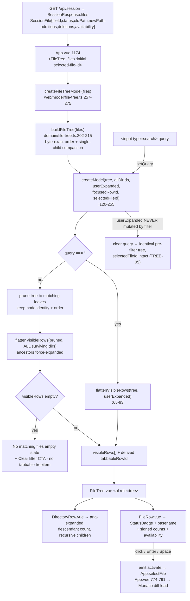

# Phase 09: Changed-File Tree - Research

**Researched:** 2026-09-13
**Domain:** Vue 3 tree UI restyle — dense rows, local filtering, ARIA tree + roving tabindex, semantic-token CSS
**Confidence:** HIGH (every claim below is anchored to a `file:line` in this repo or to a measurement run in this session)

<user_constraints>
## User Constraints (from CONTEXT.md)

### Locked Decisions

`09-CONTEXT.md:26-31` records no user-locked decisions — the discuss phase was skipped (`workflow.skip_discuss: true`, `.planning/config.json:31`).

### Claude's Discretion

> All implementation choices are at Claude's discretion — discuss phase was skipped per user setting. Use ROADMAP phase goal, success criteria, the Phase 08 token contract, and codebase conventions to guide decisions. (`09-CONTEXT.md:30`)

**However:** `09-UI-SPEC.md` is an APPROVED design contract and is authoritative for values. Discretion applies to *how* to implement and verify, not to re-deciding visuals.

### Deferred Ideas (OUT OF SCOPE)

> None — discuss phase skipped. (`09-CONTEXT.md:58`)

### Phase boundary constraints (`09-CONTEXT.md:22`)

- Out of scope: diff reading surface (Phase 10); shell/dialogs/comments rail/mobile files-flow composition (Phase 11); behavior continuity and packaging evidence (Phase 12).
- Token authorship stays in Phase 08's root. This phase may only add a token when it also adds its consumer.
</user_constraints>

<phase_requirements>
## Phase Requirements

| ID | Description (`.planning/REQUIREMENTS.md:30-34`) | Research Support |
|----|-------------|------------------|
| TREE-01 | One dense row per changed file: status, file name, addition/deletion counts; unavailable/unsupported still identified as non-reviewable | Counts already client-side (`src/contracts/api.ts:317-318`); row anatomy exists at `FileRow.vue:40-75`; basename-only display must be scoped to the row (see Pitfall 3) |
| TREE-02 | Directory rows in the mockup's treatment, each showing how many changed files it contains | `FileTreeDirectory` has **no** count field (`src/domain/file-tree.ts:17-23`); recursive count is derivable from `children` client-side — no API change (see "Counts and directory descendant counts") |
| TREE-03 | Existing tree semantics survive: nesting, single-child compaction, exact path ordering, all-expanded default, expand/collapse, selection, roving tabindex (↑↓←→ Home End Enter Space) | All semantics live in `src/web/model/file-tree.ts:120-275` and `src/domain/file-tree.ts:145-215`; the roving-tabindex defect is diagnosed and fixed below |
| TREE-04 | Filter narrows the tree to matching files with ancestor directories expanded | Requires a query-aware model projection; prune-in-place (not rebuild) — see "Filter architecture" |
| TREE-05 | No-match empty state explains recovery; clearing restores the previous tree with the open file still selected | Requires the user expansion set to stay untouched by filter-forced expansion; `selectedFileId` must survive an empty projection |
</phase_requirements>

## Summary

Phase 09 is a **presentation + one model capability** phase, not a data phase. Everything TREE-01 and TREE-02 need is already client-side: `SessionFile` carries `additions`/`deletions`/`availability` (`src/contracts/api.ts:311-321`), and directory descendant counts are a pure fold over `FileTreeDirectory.children` (`src/domain/file-tree.ts:17-23`). No API, server, Git, or contract change is required. The only genuinely new model behaviour is a query-aware projection (TREE-04/05) plus a derived roving tab stop (TREE-03).

The tree model is a **persistent immutable state machine**: every transition returns a new frozen `FileTreeModel` (`src/web/model/file-tree.ts:120-255`), and `FileTree.vue` holds it in a `shallowRef` (`FileTree.vue:26`). That shape is exactly right for the filter: `setQuery` becomes one more transition, and "clearing the filter restores the previous tree" falls out for free **provided the user's expansion set is never mutated by filter-forced expansion**. The correct implementation prunes the existing node graph rather than rebuilding it with `buildFileTree`, because rebuilding re-runs single-child compaction (`src/domain/file-tree.ts:149-157`) and mints *different* `directoryId` values (`src/domain/file-tree.ts:163`) — which would destroy expansion identity, change visible directory text mid-filter, and make "restore the previous tree" impossible. The mockup rebuilds (`mockups/01b-quiet-workspace-tree.html:130`); this is the one place Phase 09 must deliberately depart from it.

The known `tests/e2e/file-tree.spec.ts:331` failure is **not** a Playwright flake and not caused by `b960bb7e` (which only *added* the spec — `git show --stat b960bb7e`: one file, 421 insertions). It is a real product defect: `tabindex` is bound solely to `focusedRowId` (`FileRow.vue:49`, `DirectoryRow.vue:41`), while `model.selectFile()` changes `selectedFileId` and deliberately preserves the old `focusedRowId` (`src/web/model/file-tree.ts:174-183`). `App.vue:387-391` auto-loads the first **reviewable** file, which in the packaged fixture is not the first tree leaf — so the tab stop parks on an unrelated row. Verified by direct measurement this session (see "Roving tabindex root cause").

**Primary recommendation:** Keep `file-tree.ts` as the single source of tree truth. Add exactly three model capabilities — `setQuery`, a pruned filtered projection with force-expanded surviving ancestors, and a derived `tabbableRowId` — then restyle `FileRow.vue`/`DirectoryRow.vue`/`FileTree.vue` against the four new canonical geometry tokens. Do not virtualize, do not add a store, do not add a dependency, do not rebuild the tree while filtering.

## Architectural Responsibility Map

| Capability | Primary Tier | Secondary Tier | Rationale |
|------------|-------------|----------------|-----------|
| Changed-file inventory, counts, availability | API / Backend | — | Already served in `SessionResponse.files` (`src/contracts/api.ts:376`); Phase 09 consumes, never re-derives |
| Tree construction, ordering, single-child compaction | Shared domain (`src/domain`) | — | `buildFileTree` is byte-exact path ordering (`src/domain/file-tree.ts:202-215`); shared by Node and browser — do not fork it into the web layer |
| Expansion / selection / focus / query state | Browser (web model) | — | `src/web/model/file-tree.ts:120-275` is already the state machine; the filter is session-local, not persisted |
| Filtered projection (prune + force-expand ancestors) | Browser (web model) | — | Must be model behaviour, not DOM `display:none`, so ARIA tree structure and `aria-level` stay truthful (`09-UI-SPEC.md` Component Inventory) |
| Row rendering, dense anatomy, accessible names | Browser (Vue components) | — | `FileRow.vue`, `DirectoryRow.vue`, `StatusBadge.vue`, `PathDisplay.vue` |
| Colour / geometry token authorship | Canonical CSS root | Drift gate | `src/web/styles.css:1-146` is the only `:root`; `scripts/css-token-contract.mjs:1-27` is the allowlist |
| Sidebar host width, drawer lifecycle, Files trigger | Browser shell — **Phase 11** | — | `.review-shell` grid at `src/web/styles.css:1275-1287`, `App.vue:1156-1179`; explicitly out of scope (`09-CONTEXT.md:22`) |

## Standard Stack

No new libraries. Phase 09 is implemented entirely with what is already installed and already used in this repo.

### Core

| Library | Version | Purpose | Why Standard |
|---------|---------|---------|--------------|
| Vue | 3.5.39 (`package.json`, verified via `node -e` this session) | Component rendering, `shallowRef` model holder | Already the project UI stack (`.claude/CLAUDE.md` Technology Stack) |
| Native `<input type="search">` | platform | Filter field | Mandated by `09-UI-SPEC.md:165`; no combobox behaviour needed |
| Vitest | 4.1.10 (verified this session) | Model unit coverage | `tests/unit/file-tree.test.ts` already exists |
| Playwright | 1.61.1 (verified this session) | Packaged browser coverage | `tests/e2e/file-tree.spec.ts` already exists |

### Supporting

| Library | Version | Purpose | When to Use |
|---------|---------|---------|-------------|
| `String.prototype.includes` + `toLowerCase()` | ES built-in | Case-insensitive substring match on `ExactPath.display` | The only matching the spec requires (`09-UI-SPEC.md:172`, mockup `01b:126-128`) |
| CSS Grid + `::before` pseudo | platform | Row anatomy, selected rail | Mockup uses exactly this (`01b:17,30`) |

### Alternatives Considered

| Instead of | Could Use | Tradeoff |
|------------|-----------|----------|
| Reactive filter over full list | `vue-virtual-scroller` / `@tanstack/virtual` | Rejected: measured cost is negligible at the achievable ceiling (see Performance); adds a dependency the CLI must ship and breaks Playwright's whole-tree locators |
| Model-level `setQuery` | `computed` filter in `FileTree.vue` only | Rejected: `09-UI-SPEC.md` Component Inventory requires "filtered projection and restoration as model behavior rather than DOM-only hiding"; a DOM-only filter also breaks `aria-level` and keyboard traversal |
| Fuzzy matcher (`fzf`, `fuse.js`) | — | Rejected: `09-UI-SPEC.md:172` specifies case-insensitive full-display-path substring matching; anything smarter changes an approved contract |
| Pinia/store for query state | — | Rejected explicitly by `09-UI-SPEC.md` Component Inventory ("Do not add a store") |
| Rebuild tree from matches (`buildTree(entries)`, `01b:130`) | — | Rejected: re-compaction mints different `directoryId`s — see Pitfall 1 |

**Installation:** none. `npm install` adds nothing for this phase.

## Package Legitimacy Audit

**Not applicable.** Phase 09 installs zero external packages. No `npm install`, no registry lookup, no `[SLOP]`/`[SUS]` risk surface.

**Packages removed due to [SLOP] verdict:** none
**Packages flagged as suspicious [SUS]:** none

## Architecture Patterns

### System Architecture Diagram



Note the two independent state sets that must never be conflated: `userExpanded` (mutated only by `toggleDirectory`, `src/web/model/file-tree.ts:153-172`) and the filter's force-expansion (transient, derived from the query).

### Recommended Project Structure

No new files are required. All work lands in existing files:

```
src/web/
├── model/file-tree.ts      # + query, setQuery, pruned projection, tabbableRowId
├── components/
│   ├── FileTree.vue        # + header row, search input, clear button, empty state, hint
│   ├── FileRow.vue         # dense 3/4-column anatomy, basename display
│   ├── DirectoryRow.vue    # + descendant count, "/" suffix, dense treatment
│   ├── StatusBadge.vue     # unchanged mapping, token-only colours
│   └── PathDisplay.vue     # + opt-in basename presentation (full identity preserved)
└── styles.css              # + 4 canonical tokens with consumers; tree rule rewrite
scripts/css-token-contract.mjs  # + 4 names in CANONICAL_TOKENS
```

### Pattern 1: Persistent immutable model transitions

**What:** Every state change returns a brand-new frozen model via `createModel(...)`; identity is reused when nothing changed, so Vue's `shallowRef` skips re-render.
**When to use:** Every new capability (`setQuery`) must follow it — never mutate `model.value` in place.
**Example (existing, `src/web/model/file-tree.ts:174-183`):**

```ts
const selectFile = (fileId: string): FileTreeModel =>
  selectedFileId === fileId
    ? model                                  // identity reuse = no re-render
    : createModel(tree, allDirectoryIds, expandedDirectoryIds, focusedRowId, fileId);
```

`setQuery('')` must likewise return the *same instance* when the query is already empty, otherwise every keystroke that trims to nothing re-renders the whole tree.

### Pattern 2: Accessible name assembled from row descendants

**What:** The `role="treeitem"` name is computed from contents; each part contributes either visible text, a `visually-hidden` span, or its own `aria-label`.
**Example (existing, `FileRow.vue:56-73` + `StatusBadge.vue:30-33`):**

```vue
<StatusBadge :kind="leaf.file.status.kind" />   <!-- "M" visible + "Modified" visually-hidden -->
<PathDisplay :file="leaf.file" />               <!-- aria-label="renamed from … to …" -->
<span class="line-counts" :aria-label="countLabel">…</span>
<span class="availability-marker" …>Unsupported</span>
```

Resulting name order is already `{status}, {path}, {counts}, {availability}` — exactly the order `09-UI-SPEC.md` Accessibility Contract requires, and exactly what `tests/e2e/file-tree.spec.ts:334-343,347-352` asserts. **Preserve this order.** For basename-only display, keep the full path reaching the name via `aria-label` on the path span (the mechanism `PathDisplay.vue:34` already proves works).

### Pattern 3: Row-local geometry through a CSS custom property

**What:** Indent is computed per row and injected as an inline custom property, consumed by a single shared rule.
**Example (existing, `FileRow.vue:52` / `DirectoryRow.vue:43` + `src/web/styles.css:940-953`):**

```vue
:style="{ '--tree-indent': `${8 + (level - 1) * 16}px` }"
```

This already matches the mockup formula `8 + (level−1)×16` (`mockups/01b-quiet-workspace-tree.html:98-100`) — **TREE-03 indentation needs no change.** `09-UI-SPEC.md` asks that the `8px`/`16px` steps read as `--space-2`/`--space-4`; express that as `calc(var(--space-2) + ${level - 1} * var(--space-4))`. Keep the root `--tree-indent: 20px` declaration (`src/web/styles.css:119`) — it is a canonical token and `.tree-row` (`:946`) is its required consumer.

### Anti-Patterns to Avoid

- **DOM-only filtering (`v-show` / `display:none`):** leaves hidden `role="treeitem"` nodes in the accessibility tree, breaks `aria-level` continuity, and lets `handleKey` traverse invisible rows (`src/web/model/file-tree.ts:185-240` walks `visibleRows`).
- **Rebuilding the tree per keystroke:** re-compaction changes `directoryId`s (see Pitfall 1).
- **Mutating `expandedDirectoryIds` to force ancestors open:** makes TREE-05 restoration impossible.
- **Adding a second nav named "Changed files":** `App.vue:1170` and `FileTree.vue:161` already both use `aria-label="Changed files"`. Do not add a third named landmark.
- **Hardcoding a colour anywhere in a `.vue` `<style>` or `styles.css`:** the gate scans every `.css`/`.vue` under `src/web` (`scripts/verify-semantic-css.mjs:409-417`).

## Don't Hand-Roll

| Problem | Don't Build | Use Instead | Why |
|---------|-------------|-------------|-----|
| Path ordering across filtered results | A JS string sort of display paths | Keep `buildFileTree`'s existing byte order and *prune* (`src/domain/file-tree.ts:88-103,202-215`) | Ordering is byte-exact over raw path bytes (`orderExactPaths`, `src/domain/path-bytes.ts:73-79`); `localeCompare`/`<` on `display` produces different order for non-UTF-8 and collision paths |
| Distinguishing display-colliding paths | Text-keyed lookup | Opaque `fileId` everywhere (`src/web/model/file-tree.ts:49-51`) | Two different byte paths render the identical `\uFFFD.ts` display (`tests/e2e/file-tree.spec.ts:363-364` asserts count 2) |
| Control-character-safe path rendering | Custom escaping | `ExactPath.display` (`src/domain/path-bytes.ts:22-44,57`) | Already escapes `\n`, `\t`, `\\`, C0/C1 |
| Status letter/label mapping | New switch | `StatusBadge.vue:10-26` | Already maps all six kinds including `Mode` |
| Singular/plural count labels | New formatter | `FileRow.vue:21-27` | Already emits `1 addition` / `N additions` / `Line counts unavailable` |
| Rename/copy accessible identity | New label builder | `PathDisplay.vue:21-27` | Already emits `renamed from X to Y` / `copied from X to Y`; `09-UI-SPEC.md` pins this contract |
| List virtualization | Windowing library | Plain keyed `v-for` | Measured cost is negligible at the reachable ceiling — see Performance |
| Search-field clear behaviour | Custom combobox | Native `<input type="search">` + one explicit button | `09-UI-SPEC.md:165` and its clear-button rationale |

**Key insight:** Every "hard" part of this tree — byte-exact ordering, compaction, opaque identity, control-safe display, status/plural labels — is already solved and covered by `tests/unit/file-tree.test.ts:90-461`. The only new logic worth writing is query projection and tab-stop derivation.

## Runtime State Inventory

Phase 09 is a restyle/refactor of a browser surface, so this inventory matters. Every category was checked.

| Category | Items Found | Action Required |
|----------|-------------|------------------|
| Stored data | **None.** Filter query, expansion, focus, and selection are in-memory only (`FileTree.vue:26` `shallowRef`). The draft schema has no tree fields — `SessionFileSchema` (`src/contracts/api.ts:311-321`) is read-only session data; DEFER-01 (`.planning/REQUIREMENTS.md:62`) confirms viewed-tracking would have needed a new persisted field and is excluded | none |
| Live service config | **None.** Cumpa binds a loopback Fastify server per launch; no external service holds tree config | none |
| OS-registered state | **None.** No scheduler/daemon registration in this project | none |
| Secrets/env vars | **None.** No env var names reference tree behaviour | none |
| Build artifacts | **Yes — the generated web bundle.** `scripts/verify-semantic-css.mjs:385-402` audits `dist/web/index.html` and its linked CSS, and `assertTokenRoot(generatedRoot, …)` requires the *built* root to carry every canonical token. `npm run verify:semantic-css` runs `build:web` first (`package.json:36`) and `npm run test:browser` now runs `build:web` first (`package.json:41`, shipped by Phase 08 per `08-07-SUMMARY.md`). **A stale `dist/web` will produce a false gate result if the gate script is invoked directly** — always go through the npm scripts | use `npm run verify:semantic-css` / `npm run test:browser`, never bare `node scripts/verify-semantic-css.mjs` |
| Contractual DOM selectors (project-specific extra category) | `.tree-row`, `.tree-row--selected`, `.file-row`, `.file-tree`, `.line-counts`, `.review-files`, `.file-tree-pane`, `[role="treeitem"][data-file-id]`, `[data-row-id]` are all referenced from Playwright specs and from `scripts/verify-semantic-css.mjs`'s inset allowlist | treat as public API — see Pitfall 4 |

## Common Pitfalls

### Pitfall 1: Rebuilding the tree while filtering silently changes directory identity

**What goes wrong:** `directoryId` is derived from the *compacted* path — `directory_${compacted.path.bytesBase64url}` (`src/domain/file-tree.ts:163`), and compaction collapses any chain of single-child directories (`src/domain/file-tree.ts:149-157`). If you filter by rebuilding from the matching `SessionFile[]`, a directory that previously had two children but now has one gets compacted with its child, producing a *different* `directoryId`, a *different* visible label (`a/` becomes `a/b/`), and a *different* `rowId`.
**Why it happens:** The mockup does exactly this (`mockups/01b-quiet-workspace-tree.html:130` calls `buildTree(entries)` on the filtered set) and it looks like the obvious implementation.
**How to avoid:** Prune the already-built `tree` in place: walk `FileTreeNode[]`, keep every leaf whose display path matches, keep a directory iff any descendant leaf survives, and reuse the original `directoryId`, `path`, `segments`, and child order. Then flatten with *all surviving directory ids* treated as expanded, leaving `expandedDirectoryIds` untouched.
**Warning signs:** A unit assertion that `model.setQuery(q).setQuery('')` returns a tree structurally equal to the original will fail; expansion state appears to "reset" after clearing.

### Pitfall 2: The roving tab stop and `aria-selected` disagree (the `file-tree.spec.ts:331` defect)

**What goes wrong:** `expect(selectedLeaf).toHaveAttribute('tabindex', '0')` fails; the selected row renders `-1`.
**Why it happens:** documented in full under "Roving tabindex root cause" below.
**How to avoid:** derive the tab stop; do not bind it to `focusedRowId` alone.
**Warning signs:** Any state where the first tree leaf is *not* the first reviewable file — i.e. any comparison whose alphabetically-first changed file is binary/oversized/unavailable.

### Pitfall 3: Basename-only display leaks into the workspace header

**What goes wrong:** `PathDisplay.vue` is shared. `App.vue:1188` renders it inside `<h1 id="cumpa-heading">`, and `tests/e2e/responsive-session.spec.ts:1091-1092` asserts `.review-context-header .path-display` contains `beta-before-a-very-long-rename.ts`. `tests/e2e/pinned-session.spec.ts:895-899` asserts the `main` landmark's accessible name equals the file's **full** display path. If you make `PathDisplay` render basenames unconditionally, both break — and `pinned-session.spec.ts` is required to stay unchanged.
**How to avoid:** Make basename presentation opt-in (a `basename` prop consumed only by `FileRow.vue`, or compute the basename in `FileRow.vue` and pass the full path down for `title`/`aria-label`). The full display path must remain the accessible name and the `title`.
**Warning signs:** Header path truncates to a filename; the `main` accessible-name assertion fails.

### Pitfall 4: Playwright-contractual selectors and the CSS gate's selector allowlist

**What goes wrong:** Renaming a class breaks specs that are not supposed to change, or breaks the semantic-CSS gate's hardcoded allowlists.
**Specifics:**
- `scripts/verify-semantic-css.mjs` `assertAuthorStyle` (`:209-257`) contains a literal inset-shadow allowlist keyed by selector string, including `'.tree-row--selected' → 'inset var(--selected-rail-width) 0 var(--selection-border)'`. Renaming `.tree-row--selected` or using any other inset shadow value on it **fails the gate**.
- Any rule whose selector contains `:active` or `[aria-pressed="true"]` **must** explicitly declare `box-shadow: none` (same function). The new clear button needs this if it has an `:active` arm.
- The forced-colors repair must remain the single terminal media block, positioned after `@media (prefers-reduced-motion: reduce)` (`src/web/styles.css:2638`, `:2649`). Insert new rules **before** line 2638.
- `.tree-row--selected` also appears in the forced-colors repair (`src/web/styles.css:2695-2703`) — preserve it.
**Contractual selectors (must survive):** `.tree-row`, `.tree-row--selected`, `.file-row`, `.file-tree`, `.line-counts`, `.review-files`, `.file-tree-pane`, `[role="treeitem"]`, `[data-file-id]`, `[data-row-id]`, `#changed-files-heading`. Evidence: `tests/e2e/responsive-session.spec.ts:548,902,986,1049,1089,1152,1198,1459`; `tests/e2e/pinned-session.spec.ts:887,890,1395`; `tests/e2e/file-tree.spec.ts:328`; `FileTree.vue:35-36` (focus lookup keys on `[role="treeitem"]` + `dataset.rowId`); `App.vue:1195` (`aria-controls="changed-files"`); `responsive-session.spec.ts:1034` (skip link targets `changed-files-heading`).

### Pitfall 5: Changing the "Changed files (N)" heading text breaks a spec that must not change

**What goes wrong:** `09-UI-SPEC.md:156` asks the header row to read `Files`, count, `Changed`. But `tests/e2e/pinned-session.spec.ts:877-879` asserts `getByRole('heading', { name: 'Changed files (3)' })`, and the brief pins that file as unchanged. `tests/e2e/file-tree.spec.ts:325` asserts `/^Changed files \(\d+\)$/`. The tree's own accessible name also derives from this heading via `aria-labelledby="changed-files-heading"` (`FileTree.vue:170`), so `getByRole('tree', { name: 'Changed files' })` (`pinned-session.spec.ts:881`, `:494`) depends on it too.
**How to avoid:** Keep the **accessible name** exactly `Changed files ({N})` while rendering the mockup's visible composition:

```vue
<h2 id="changed-files-heading" ref="headingElement" tabindex="-1" class="file-tree-pane__header">
  <span aria-hidden="true">Files</span>
  <span class="visually-hidden">Changed files ({{ files.length }})</span>
  <span aria-hidden="true" class="file-tree-pane__count">{{ files.length }}</span>
  <span aria-hidden="true" class="file-tree-pane__eyebrow">Changed</span>
</h2>
```

`visually-hidden` already exists (`src/web/styles.css:901-911`, used by `StatusBadge.vue:32`). This keeps `file-tree.spec.ts:325`, `pinned-session.spec.ts:878/881/494`, and the skip-link target all green with zero edits to `pinned-session.spec.ts`.

### Pitfall 6: The dense row is shorter than the current height assertion

**What goes wrong:** `tests/e2e/file-tree.spec.ts:338-339` asserts the modified row's rendered height is `>= 40`. The new contract is `--file-row-min-height: 34px` (`09-UI-SPEC.md` Canonical Token Contract). With `min-height:34px`, `5px` block padding and a `1px` transparent boundary, the border-box height resolves to `34px`. **This assertion must be updated to the new density**, and `.review-files .tree-row { min-height: 44px }` (`src/web/styles.css:955-959`) must go, because `09-UI-SPEC.md` Responsive Contract says row density does not change on mobile. `tests/e2e/responsive-session.spec.ts:567` (`selectedBox.height <= 48`) stays green. `expectMinimumTarget` (40×40, `responsive-session.spec.ts:259-264`) is **not** applied to tree rows — its only call site is `:1510` on the identity disclosure button — so no 40px tap-target regression is introduced.

### Pitfall 7: Two nested scroll owners

**What goes wrong:** `.review-files` has `overflow-y: auto` (`src/web/styles.css:1298-1301`) **and** `.file-tree-pane` has `overflow-y: auto` (`src/web/styles.css:919-926`). `09-UI-SPEC.md` puts the scroller *below* the filter, with the keyboard hint inside the scroll content. `tests/e2e/responsive-session.spec.ts:1459` asserts `.review-files` computed `overflow-y` is `auto` — so the outer owner must stay.
**How to avoid:** make `.file-tree-pane` a `grid-template-rows: auto auto minmax(0, 1fr)` (header / filter / scroller) with `overflow: hidden`, and put `overflow-y: auto` on the new inner scroller. `.review-files` keeps `auto`. Also note `FileTree.vue:115-123` reads/writes `paneElement.scrollTop` — that element would stop being the scroller (see Pitfall 8).

### Pitfall 8: `FileTree.vue`'s exposed API is dead code

`defineExpose({ focusHeading, focusSelectedFile, getScrollPosition, setScrollPosition })` (`FileTree.vue:125-130`) has **no consumer**. A repo-wide grep for those four names returns matches only in `FileMetadataPane.vue`, `DriftExportAcknowledgement.vue`, and `ErrorState.vue` — each defining its own. `App.vue:1174` renders `<FileTree …>` with no `ref`. If the scroller moves (Pitfall 7), these methods would silently target the wrong element. Recommended: delete the `defineExpose` block and the four now-unused functions rather than maintain them against a new DOM shape. This is in-scope cleanup that the phase's own change obsoletes.

### Pitfall 9: `--tree-indent` must keep a consumer

`--tree-indent` is canonical (`scripts/css-token-contract.mjs:27`) and declared at `src/web/styles.css:119`. Its only consumer is `.tree-row { padding-left: var(--tree-indent) }` (`src/web/styles.css:946`). If the rewritten `.tree-row` switches to `padding-inline-start` or drops the property, the gate fails with `canonical tokens have no consumer: --tree-indent` (`scripts/verify-semantic-css.mjs:91-107`). Keep a `var(--tree-indent)` reference.

## Code Examples

### Filtered projection: prune, don't rebuild

```ts
// src/web/model/file-tree.ts — new helper alongside flattenVisibleRows (:65-93)
// Preserves directoryId / segments / child order from the ORIGINAL tree.
function pruneTree(
  nodes: readonly FileTreeNode[],
  matches: (leaf: FileTreeLeaf) => boolean,
  survivors: string[],           // directoryIds kept — all force-expanded
): readonly FileTreeNode[] {
  const kept: FileTreeNode[] = [];
  for (const node of nodes) {
    if (node.kind === 'file') {
      if (matches(node)) kept.push(node);
      continue;
    }
    const children = pruneTree(node.children, matches, survivors);
    if (children.length === 0) continue;
    survivors.push(node.directoryId);
    kept.push(Object.freeze({ ...node, children }));   // same directoryId, same segments
  }
  return Object.freeze(kept);
}
```

Matching predicate (case-insensitive, full display path, `09-UI-SPEC.md:172`; mockup `01b:126-128`):

```ts
const needle = query.trim().toLowerCase();
const matches = (leaf: FileTreeLeaf): boolean =>
  leaf.effectivePath.display.toLowerCase().includes(needle);
```

`effectivePath` is already resolved per status on the leaf (`src/domain/file-tree.ts:10-15`, populated at `src/domain/file-tree.ts:182-191` from `effectivePath()` at `:49-73`), so deleted files match on `oldPath` and renamed/copied files on `newPath` — consistent with what the row displays.

### Recursive descendant count (TREE-02)

```ts
// FileTreeDirectory has no count field (src/domain/file-tree.ts:17-23) — fold children.
function changedFileCount(node: FileTreeDirectory): number {
  let total = 0;
  for (const child of node.children) {
    total += child.kind === 'file' ? 1 : changedFileCount(child);
  }
  return total;
}
```

Render per `09-UI-SPEC.md` Directory row + `mockups/01b-quiet-workspace-tree.html:108`:

```vue
<span class="directory-row__count" :aria-label="`${count} changed ${count === 1 ? 'file' : 'files'}`">
  {{ count }}
</span>
```

Compute it once per directory (a `computed` in `DirectoryRow.vue`) — it is O(subtree) per row, so a naive whole-tree recomputation per render is O(n·depth). At the measured ceiling this is irrelevant, but memoizing in the model (a `Map<directoryId, number>` built once per tree/projection) is cheaper and keeps the count correct for the *filtered* projection too. **The filtered projection's directory count must be the count of surviving descendants**, which falls out automatically if the count is folded over the projected nodes rather than the original tree.

### Roving tab stop (TREE-03 fix)

```ts
// src/web/model/file-tree.ts — derived, exposed on FileTreeModel
const selectedRowId = selectedFileId === null ? null : fileRowId(selectedFileId);
const isVisible = (rowId: string | null): boolean =>
  rowId !== null && frozenVisibleRows.some((row) => row.rowId === rowId);

const tabbableRowId: string | null =
  isVisible(focusedRowId) ? focusedRowId
  : isVisible(selectedRowId) ? selectedRowId
  : frozenVisibleRows[0]?.rowId ?? null;      // null ⇒ empty result, no tab stop
```

and `selectFile` re-homes the focus anchor when the selected row is visible:

```ts
const selectFile = (fileId: string): FileTreeModel => {
  if (selectedFileId === fileId) return model;
  const rowId = fileRowId(fileId);
  const nextFocused = frozenVisibleRows.some((row) => row.rowId === rowId)
    ? rowId
    : focusedRowId;
  return createModel(tree, allDirectoryIds, expandedDirectoryIds, nextFocused, fileId);
};
```

Components bind `:tabindex="model.tabbableRowId === rowId ? 0 : -1"` instead of the current `focused ? 0 : -1` (`FileRow.vue:49`, `DirectoryRow.vue:41`). Keep `focused` as a separate prop only if a visual affordance needs it; `FileTree.vue:192` currently derives it.

**Why both changes:** `selectFile` re-homing fixes the load-time defect and keeps focus-follows-selection for files. The derived `tabbableRowId` covers the two cases `selectFile` cannot: the filter removing the focused row, and the empty projection (`09-UI-SPEC.md` Roving tabindex: "empty result → no tabbable treeitem"). Directory focus still wins over selection because `focusedRowId` is checked first — which is what `tests/e2e/file-tree.spec.ts:376-384` exercises (`ArrowLeft` onto a directory must not change `aria-selected`).

**Important:** the `initialSelectedFileId` watch assigns `model.value` directly (`FileTree.vue:138-146`) and does **not** go through `applyModel`, so it will not call `focusModelRow()` (`FileTree.vue:28-39`). Re-homing `focusedRowId` there therefore moves the tab stop without stealing DOM focus — which is exactly what `09-UI-SPEC.md` requires ("without moving DOM focus unexpectedly"). Do not route that watch through `applyModel`.

### Token additions (all four need a consumer in the same change)

```js
// scripts/css-token-contract.mjs:1-27 — add to CANONICAL_TOKENS
'--file-row-min-height', '--radius-file-row', '--radius-scrollbar', '--space-5',
```

```css
/* src/web/styles.css :root (within :96-146) */
--space-5: 20px;
--radius-file-row: 5px;
--radius-scrollbar: 8px;
--file-row-min-height: 34px;

/* consumers, all landing in the same change */
.file-tree-pane__header { padding-top: var(--space-5); }
.tree-row { min-height: var(--file-row-min-height); border-radius: var(--radius-file-row); }
.file-tree-pane__scroll::-webkit-scrollbar-thumb { border-radius: var(--radius-scrollbar); }
```

None of the four names match the gate's colour-token prefix regex (`scripts/css-token-contract.mjs:28` — `surface|text|border|interactive|focus|selection|scrollbar|destructive|status|diff|monaco|syntax` anchored at `--`), so `assertCanonicalTokenValues` (`:219-227`) will not demand a colour shape from them. `tests/unit/token-contract.test.ts:33,109` derives its fixture from `CANONICAL_TOKENS`, so it adapts automatically — **no test edit needed there**.

`transparent` is permitted on `border`/`background`/`outline` (`scripts/verify-semantic-css.mjs:152-157,183-186`), so `border: var(--border-width-default) solid transparent` on `.tree-row` passes.

## Performance: measurement and virtualization decision

Measured this session with a throwaway Vitest probe (created, run, deleted) against the real `createFileTreeModel` and a naive full-path substring filter, on this machine (Apple M5, Node v24.15.0):

| Changed files | Visible rows (all expanded) | `createFileTreeModel` | One filter pass over all paths |
|---|---|---|---|
| 500 | 1041 | 3.9 ms | 0.04 ms |
| 2000 | 2721 | 8.5 ms | 0.10 ms |
| 5000 | 5721 | 17.4 ms | 0.32 ms |

**Ceiling argument.** The changed-file inventory runs `git diff --raw --no-abbrev …` with no `maxStdoutBytes` override (`src/git/inventory.ts:149-163`), so it inherits `DEFAULT_STDOUT_LIMIT = 1024 * 1024` (`src/git/runner.ts:4`). A `--raw -z --no-abbrev` record is `:<6> <6> <40-hex> <40-hex> <status>\0<path>\0` ≈ 99 bytes plus the path, so a realistic ~130 bytes/record caps the session at roughly **8,000 changed files** — above that the session fails at launch with `Git stdout exceeded 1048576 bytes` (`src/git/runner.ts:166-169`), never reaching the tree.

**Conclusion: do not virtualize.** Model work is ≤ 20 ms at the hard ceiling and filtering is sub-millisecond; the remaining cost is DOM node count, which is bounded by the same ceiling and is unchanged from today's all-expanded default. Virtualization would additionally break the whole-tree Playwright locators (`tests/e2e/file-tree.spec.ts:363-364` counts *all* matching rows; `:407-414` uses `getByRole('treeitem').first()/.last()` after `Home`/`End`). Debouncing the filter is likewise unnecessary at 0.32 ms/pass — and would make Playwright assertions racy. `[INFERENCE]` DOM render cost was not measured in a browser; the argument above rests on node count being unchanged from the already-shipped all-expanded default.

## Roving tabindex root cause (`tests/e2e/file-tree.spec.ts:331`)

**Named root cause, in code:**

1. `tabindex` is bound *only* to focus: `FileRow.vue:49` `:tabindex="focused ? 0 : -1"` where `focused` is `model.focusedRowId === 'file:' + fileId` (`FileTree.vue:192`, `DirectoryRow.vue:71`); `DirectoryRow.vue:41` does the same for directories.
2. `selectFile` changes selection **without** moving focus — `src/web/model/file-tree.ts:174-183` passes the *existing* `focusedRowId` straight through to `createModel`.
3. `createFileTreeModel` seeds focus and selection to the **first tree leaf** (`src/web/model/file-tree.ts:266,272-273`).
4. `App.vue:387-391` (`initializeReviewDraft`, `:380-393`) auto-loads `reviewable[0]` — the first file whose `availability.kind === 'text'` — which is *not* necessarily the first tree leaf.
5. `App.vue:1174` feeds that back as `:initial-selected-file-id`, and `FileTree.vue:138-146` applies it with `model.selectFile(fileId)` — hitting case (2).

In the packaged fixture (`tests/e2e/file-tree.spec.ts:122-156`), byte-ordered root entries begin with `binary.dat` (`b`), which `addInvalidUtf8Path`/`binary\0payload` makes **unsupported**, before `collision/…` (`c`). So the first tree leaf is `binary.dat` and the first reviewable file is `collision/\x80.ts`. Result: `aria-selected="true"` on the collision row with `tabindex="-1"`, and `tabindex="0"` on the unselected `binary.dat` row.

**Empirically confirmed this session** with a throwaway Vitest probe against the real model (first leaf unsupported, second leaf text, then `selectFile(secondId)`): `selectedFileId` moved to the second file while `focusedRowId` stayed `file:<first>` — the probe passed, proving the divergence, and was deleted.

**Not a `b960bb7e` regression.** `git show --stat b960bb7e` shows a single file, `tests/e2e/file-tree.spec.ts`, 421 insertions — the commit *authored the spec*. The implementation never satisfied it.

**Fix (TREE-03 owns this):** the two-part change under "Roving tabindex (TREE-03 fix)" above — `selectFile` re-homes `focusedRowId` onto the selected row when visible, and the model exposes a derived `tabbableRowId` that components bind `tabindex` to. After the fix, `tests/e2e/file-tree.spec.ts:331` passes unmodified.

## Counts and directory descendant counts — data availability

| Datum | Available client-side today? | Evidence |
|---|---|---|
| Per-file additions / deletions (nullable) | **Yes** | `src/contracts/api.ts:317-318`; already rendered at `FileRow.vue:58-64` |
| Availability (`text` / `unsupported` / `unavailable`) | **Yes** | `src/contracts/api.ts:319`; rendered at `FileRow.vue:28-37,65-73` |
| Change status kind | **Yes** | `src/contracts/api.ts:314`; mapped at `StatusBadge.vue:10-26` |
| Directory descendant changed-file count | **No field — derivable** | `FileTreeDirectory` is `{kind, directoryId, path, segments, children}` (`src/domain/file-tree.ts:17-23`). Fold over `children`; see the Code Example |

**No API, server, Git, or Zod-contract change is required for TREE-01 or TREE-02.**

## Accessible-name and ARIA contract: today vs. required

| Aspect | Today | Phase 09 change |
|---|---|---|
| Outer landmark | `<nav aria-label="Changed files">` at both `App.vue:1170` and `FileTree.vue:161` | Unchanged (do not add a third) |
| Tree | `<ul role="tree" aria-label="Changed files" aria-labelledby="changed-files-heading">` (`FileTree.vue:165-172`) — `aria-labelledby` wins, so the name is `Changed files (N)` | Unchanged. Playwright's `name` option is substring+case-insensitive by default, which is why `getByRole('tree', { name: 'Changed files' })` matches today |
| Group | `<ul role="group">` (`DirectoryRow.vue:53`) | Unchanged |
| Structural item | `<li role="none">` (`FileRow.vue:41`, `DirectoryRow.vue:33`) | Unchanged |
| Treeitem | `<div role="treeitem" :aria-level :aria-selected/:aria-expanded :tabindex :data-row-id :data-file-id>` (`FileRow.vue:42-55`, `DirectoryRow.vue:34-46`) | `tabindex` source changes (see fix); everything else preserved |
| File name order | status → path → counts → availability (`FileRow.vue:56-73`) | **Preserve exactly** — `file-tree.spec.ts:334-343,347-352` depends on it |
| File name path text | Full display path (visible + `title`) via `PathDisplay.vue:41-43` | Visible text becomes the basename; full path must stay in `title` **and** in the accessible name via `aria-label` on the path span |
| Rename/copy identity | `renamed from X to Y` / `copied from X to Y` (`PathDisplay.vue:21-27,34-35`) | Preserve verbatim; `file-tree.spec.ts:347-352` asserts it |
| Directory name | disclosure (aria-hidden) + compacted path (`DirectoryRow.vue:47-50`) | Add `/` suffix and an `aria-label`-bearing count span; `aria-expanded` and `aria-selected="false"` unchanged (`DirectoryRow.vue:39-40`) |
| Counts | `aria-label` on `.line-counts`, signs `+`/`−` aria-hidden, `—` when null (`FileRow.vue:58-64`) | Preserve; only geometry/typography change |

## State of the Art

| Old Approach | Current Approach | When Changed | Impact on Phase 09 |
|---|---|---|---|
| Ad-hoc colour literals in component styles | Single canonical `:root` + `npm run verify:semantic-css` no-orphan/no-literal gate | Phase 08 (`08-06-SUMMARY.md`, commit `823d8f4`) | Every new token must ship with its consumer in the same change |
| Playwright run against whatever `dist/web` happened to exist | `test:browser` forces `build:web` first (`package.json:41`) | Phase 08 (`08-07-SUMMARY.md`) | Browser evidence is trustworthy; direct `node scripts/verify-semantic-css.mjs` is not |
| Speculative geometry tokens declared ahead of consumers | Tokens retired until their owning phase adds a consumer | Phase 08 (`08-06-SUMMARY.md:79,80,95` retired `--radius-file-row`, `--radius-scrollbar`, `--space-5` explicitly "File-row shape/density is Phase 09 scope") | Phase 09 is the designated re-introducer of exactly these names |

**Deprecated/outdated:** `.review-files .tree-row { min-height: 44px }` (`src/web/styles.css:955-959`) — a mobile-only density bump contradicted by `09-UI-SPEC.md` Responsive Contract ("Row density … do not change on mobile"). Remove it.

## Environment Availability

| Dependency | Required By | Available | Version | Fallback |
|------------|------------|-----------|---------|----------|
| Node.js | build, tests, gate | ✓ | v24.15.0 | — |
| npm | scripts | ✓ | 11.12.1 | — |
| git | packaged e2e fixtures | ✓ | 2.54.0 (Apple Git-157) | — |
| Playwright | browser evidence | ✓ | 1.61.1 | — |
| Vue | UI | ✓ | 3.5.39 | — |
| Vitest | model unit coverage | ✓ | 4.1.10 | — |

**Missing dependencies with no fallback:** none.
**Missing dependencies with fallback:** none.

## Test impact — enumerate exactly

### Must be updated

| File:line | Current assertion | Why it must change |
|---|---|---|
| `tests/e2e/file-tree.spec.ts:338-339` | `rowBox?.height >= 40` | New density is `--file-row-min-height: 34px` (Pitfall 6) |
| `tests/e2e/file-tree.spec.ts:353-355` | row contains `src/deep/only/rename-source.ts→src/deep/only/renamed.ts` | Basename-only visible text → `rename-source.ts→renamed.ts` |
| `tests/e2e/file-tree.spec.ts:356` | row contains `copy-source.ts→copy-target.ts` | Already basenames — re-verify, likely unchanged |
| `tests/e2e/file-tree.spec.ts:361` | row contains `control/line\nbreak.ts` (escaped) | Basename-only → `line\nbreak.ts` |
| `tests/e2e/file-tree.spec.ts:363-364` | `getByText('collision/\uFFFD.ts', {exact:true})` count 2 | Basename-only → `\uFFFD.ts`; **keep the count-2 + distinct-request assertions**, they are the display-collision contract |
| `tests/unit/file-tree.test.ts` (append inside `describe('createFileTreeModel')`, currently `:292-461`) | — | New coverage: case-insensitive full-path match; ancestors present and force-expanded; clearing restores prior expansion exactly; `selectedFileId` survives a no-match query; ordering survives filtering; display-colliding paths stay distinct under filter; empty projection yields `tabbableRowId === null`; `tabbableRowId` equals the selected row after `selectFile` |

### Must stay byte-unchanged

| File:line | Assertion | Why it survives |
|---|---|---|
| `tests/e2e/file-tree.spec.ts:325` | heading `/^Changed files \(\d+\)$/` | Accessible name preserved by the hidden-span header (Pitfall 5) |
| `tests/e2e/file-tree.spec.ts:331` | selected treeitem `tabindex="0"` | **Turns green** via the TREE-03 fix — this is the deliverable, not an edit |
| `tests/e2e/file-tree.spec.ts:334-343,347-352` | accessible-name regexes for modified / unsupported / renamed / copied rows | Name order and content preserved |
| `tests/e2e/file-tree.spec.ts:345` | visible `Unsupported` text | Contract retained (`09-UI-SPEC.md` Unsupported/unavailable) |
| `tests/e2e/file-tree.spec.ts:365-418` | click-selection, distinct opaque content requests, keyboard matrix (`ArrowLeft`/`Enter`/`ArrowRight`/`Home`/`End`/`ArrowUp`/`ArrowDown`/`Space` at `:390,397,399,401,407,409,411,413,415`), directory focus not replacing selection | Model transitions unchanged (`src/web/model/file-tree.ts:185-240`) |
| `tests/e2e/file-tree.spec.ts:420-426` | focused outline `solid` / `2px` | Focus tokens unchanged |
| `tests/e2e/pinned-session.spec.ts:494-496,877-899,1077,1099,1113,1193,1394-1398` | tree text, heading `Changed files (3)`, `aria-selected` on `[data-file-id]`, `main` accessible name = full path, navigation absence in error states | All preserved by Pitfalls 3 + 5 and by keeping `data-file-id` |
| `tests/e2e/responsive-session.spec.ts:548,562-568,982-989,1048-1052,1088-1092,1152,1198,1459-1460` | `.tree-row--selected`, height `<= 48`, `.file-tree .file-row` locators, focus indicator unclipped, header path text, `.review-files` `overflow-y: auto` and `box-shadow: none` | Class names and outer scroll owner preserved (Pitfalls 4 + 7); `:1091-1092` protected by Pitfall 3 |
| `tests/unit/file-tree.test.ts:90-290` (`buildFileTree`) | ordering, compaction, collisions | `src/domain/file-tree.ts` is not modified |
| `tests/unit/file-tree.test.ts:309-461` | existing model ordering/selection/expansion/keyboard expectations | Preserved; `selectFile`'s focus re-homing is additive — verify `:409-461` (`selects display-colliding leaves…`, `is a total no-op…`) still hold, they use `focusRow`, not `selectFile` |
| `tests/unit/token-contract.test.ts:33,109,118-124` | fixture derived from `CANONICAL_TOKENS` | Adapts automatically to the four new names |

### Likely to need a small update

- `tests/e2e/responsive-session.spec.ts:902` uses a synthetic `<div class="tree-row file-row" data-normal-file>` fixture for CSS-contract checks. If `.tree-row`'s computed background/border expectations change, this fixture's paired assertions move with them. Inspect before editing; do not delete the fixture.

**TDD note:** `workflow.tdd_mode: true` (`.planning/config.json:44`). Write the new `tests/unit/file-tree.test.ts` cases first; they fail against the current model (no `setQuery`, no `tabbableRowId`) and pass after. `file-tree.spec.ts:331` is the pre-existing red test that the TREE-03 fix turns green — it needs no authoring.

## Assumptions Log

| # | Claim | Section | Risk if Wrong |
|---|-------|---------|---------------|
| A1 | Rendered `.tree-row` height resolves to exactly `34px` under the new contract, so `file-tree.spec.ts:339` must assert `>= 34` rather than `>= 40` | Pitfall 6 | Low — the executor measures the real box in the browser run and pins the observed value; the assertion changes either way |
| A2 | Browser DOM render cost at ~5,700 rows stays acceptable without virtualization | Performance | Medium — mitigated by the 1 MiB git-stdout ceiling and by today's already-all-expanded default; if a real repo stalls, virtualization becomes a separate ticket, not a Phase 09 scope creep |
| A3 | Playwright's `getByRole(name:)` substring matching is what makes `{ name: 'Changed files' }` match the `Changed files (N)` accessible name | ARIA contract table | Low — the assertions pass on `main` today with that exact name, which is itself the evidence |
| A4 | Deleting `FileTree.vue:125-130`'s `defineExpose` is safe | Pitfall 8 | Low — repo-wide grep found no consumer and `App.vue:1174` passes no `ref`; the executor should re-grep before deleting |

## Open Questions (RESOLVED)

1. **The UI-SPEC's responsive widths (`294px`, `248px`) do not match the shipped host widths.**
   - What we know: `.review-shell` is `grid-template-columns: 288px minmax(0,1fr) 360px` (`src/web/styles.css:1275-1283`), narrowing to `256px` under `max-width: 1439px` (`:2274-2277`) and collapsing to a full-width drawer under `max-width: 1099px` (`:2306-2309`). `09-UI-SPEC.md` cites `248px`/`320px` from the mockup and explicitly assigns `--sidebar-width` to Phase 11.
   - What's unclear: whether Phase 09 should measure at the mockup's widths or the shipped ones.
   - **Recommendation:** verify tree-interior fluidity at the **shipped** `288px` and `256px` hosts plus the ≤1099px drawer, and record the `294`/`248`/`320` figures as Phase 11 shell sizing. Phase 09 must not touch `.review-shell` grid tracks (`09-CONTEXT.md:22`).

2. **Does `toggleDirectory` stay live while a query is active?**
   - What we know: `09-UI-SPEC.md` says "Starting a filter snapshots the user's unfiltered expansion set. Filter-forced expansion never mutates that snapshot," but does not say whether the user can collapse a directory *during* filtering.
   - **Recommendation:** keep `toggleDirectory` writing to the user set while filtering, with force-expansion overriding the *display*. This is one behaviour, not two modes; clearing the filter then reveals the user's collapse. Rejected alternative: disabling toggling during filtering — adds a mode, and a disabled disclosure that still renders `aria-expanded="true"` is an accessibility lie.

3. **Where does the keyboard hint live relative to `role="tree"`?**
   - What we know: `09-UI-SPEC.md` places the hint "after the tree, inside the same scroll content"; the mockup emits `<p class="tree-hint">` *after* `</ul>` (`mockups/01b-quiet-workspace-tree.html:135`).
   - **Recommendation:** follow the mockup — a `<p>` inside `<ul role="tree">` would be an invalid child and would pollute the tree's contents for `toContainText` assertions (`tests/e2e/pinned-session.spec.ts:494-496`). Place it as a sibling of the `<ul>`, inside the scroller.

4. **Empty-state heading level.**
   - What we know: `#changed-files-heading` is an `<h2>` (`FileTree.vue:162`) and is the skip-link target (`tests/e2e/responsive-session.spec.ts:1034`) and the tree's `aria-labelledby` source.
   - **Recommendation:** render the `No matching files` empty state as an `<h3>` with a distinct id inside the tree area, keeping the `<h2>` and its id intact. Never reuse `changed-files-heading`.

## Security Domain

`security_enforcement: true`, `security_asvs_level: 1` (`.planning/config.json:41-42`).

### Applicable ASVS Categories

| ASVS Category | Applies | Standard Control |
|---------------|---------|-----------------|
| V2 Authentication | no | Loopback-only local tool; no auth surface in this phase |
| V3 Session Management | no | No session tokens; Phase 09 adds no request |
| V4 Access Control | no | No new endpoint or capability |
| V5 Input Validation / Output Encoding | **yes** | The filter query is user-controlled text rendered back into the DOM. Vue's mustache/`v-bind` interpolation escapes by default — **never** introduce `v-html` for match highlighting or the empty-state message. Paths are already control-character-escaped by `controlSafeDisplay` (`src/domain/path-bytes.ts:22-44`) |
| V6 Cryptography | no | None involved |

### Known Threat Patterns for Vue 3 + local Fastify

| Pattern | STRIDE | Standard Mitigation |
|---------|--------|---------------------|
| Reflected DOM XSS via filter query (e.g. `v-html` highlighting) | Tampering | Text interpolation only; no `v-html`, no `innerHTML` |
| Path-derived DOM injection from adversarial repo filenames | Tampering | Already mitigated: display strings pass through `controlSafeDisplay` (`src/domain/path-bytes.ts:22-44,57`) and are interpolated, not injected |
| Attribute injection via `data-file-id` selector construction | Tampering | `FileTree.vue:110-112` builds a selector from `selectedFileId`; ids are validated `OpaqueFileIdSchema` (`src/contracts/api.ts:313`) and match `file_[A-Za-z0-9_-]{43}` (`tests/e2e/file-tree.spec.ts:249` request regex). If that code is retained/moved, keep the id-shape guarantee; prefer `dataset` iteration (as `FileTree.vue:34-36` already does) over string-built selectors |
| Information disclosure through path display | Info disclosure | No change — the same paths are already rendered |

No new network calls, no new persisted data, no new file writes. Phase 09's security surface is limited to DOM output encoding.

## Project Constraints (from CLAUDE.md)

`./.claude/CLAUDE.md` is the project instruction file (no `AGENTS.md` present in the worktree root). Actionable directives affecting this phase:

- **Runtime:** Node.js 24 LTS, TypeScript end to end.
- **UI:** Vue 3 + Vite + Monaco. Do not introduce a second UI framework or icon package (`09-UI-SPEC.md` Design System agrees).
- **Contracts:** Zod schemas shared by API, persistence, and export — Phase 09 must not change them (and does not need to).
- **Testing:** Vitest for contracts/model, Playwright for the browser flow. Matches the test-impact plan above.
- **Content:** text files only in v1; binary/generated/oversized/unsupported remain visible as non-reviewable entries — TREE-01's availability column is the direct expression of this constraint.
- **GSD workflow enforcement:** file edits go through a GSD command, not ad-hoc.
- **Project skill:** `Skill("spike-findings-cumpa")` is registered for implementation patterns/gotchas — the planner should have the executor consult it.

## Sources

### Primary (HIGH confidence)

- This repository, read directly this session. Every `file:line` cited above was opened and verified: `src/web/model/file-tree.ts`, `src/domain/file-tree.ts`, `src/domain/path-bytes.ts`, `src/web/components/{FileTree,FileRow,DirectoryRow,StatusBadge,PathDisplay}.vue`, `src/web/App.vue`, `src/web/styles.css`, `src/contracts/api.ts`, `src/git/{inventory,runner}.ts`, `scripts/{verify-semantic-css,css-token-contract}.mjs`, `package.json`, `tests/unit/file-tree.test.ts`, `tests/e2e/{file-tree,pinned-session,responsive-session}.spec.ts`, `mockups/01b-quiet-workspace-tree.html`.
- Measurements executed this session: two throwaway Vitest probes (roving-tabindex divergence; model build + filter timings), both run and deleted; `git show --stat b960bb7e`; `node/npm/git/playwright --version`.
- Approved design contract: `.planning/phases/09-changed-file-tree/09-UI-SPEC.md`.
- Phase 08 outcomes: `.planning/phases/08-semantic-visual-foundation/08-06-SUMMARY.md`, `08-07-SUMMARY.md`.

### Secondary (MEDIUM confidence)

- `.planning/REQUIREMENTS.md:30-34,62-65,93-97`; `.planning/STATE.md:27-30`; `.planning/config.json`; `.claude/CLAUDE.md`.

### Tertiary (LOW confidence)

- None. No web search or external documentation lookup was needed: this phase touches no external library surface, adds no dependency, and every contract it must honour is checked into this repository.

## Metadata

**Confidence breakdown:**

- Standard stack: HIGH — zero new dependencies; every tool version verified by execution.
- Architecture: HIGH — the model, its transitions, and its extension points were read in full and the recommended change was probed against the real code.
- Pitfalls: HIGH — each pitfall names the exact assertion or gate function that would fail, read from source.
- Performance: HIGH for the model layer (measured); `[INFERENCE]` for browser DOM cost, bounded by the git-stdout ceiling.

**Research date:** 2026-09-13
**Valid until:** 2026-10-13 (stable — internal codebase contracts, no fast-moving external surface)
