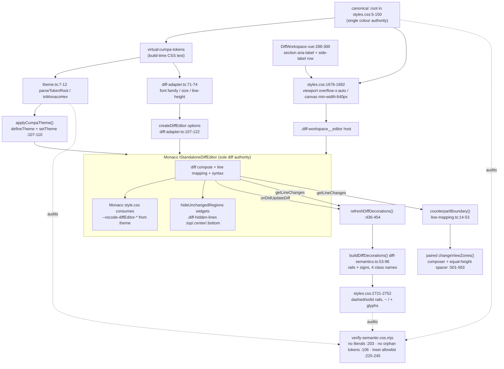

# Phase 10: Diff Reading Surface - Research

**Researched:** 2026-09-13
**Domain:** Monaco `IStandaloneDiffEditor` presentation control (theme keys, public options, model decorations, view zones) inside an existing Vue 3 + Vite web UI governed by a canonical CSS token root and a live drift gate
**Confidence:** HIGH

## Summary

Phase 10 is almost entirely a **reconciliation** phase, not a greenfield one. Phase 08 already shipped the complete Monaco theme mapping that the UI-SPEC's "Theme mapping" table demands — all 20 diff-related keys exist verbatim at `src/web/monaco/theme.ts:65-100`, and `tests/unit/monaco-theme.test.ts:114` enforces the key set *exhaustively*. The four decoration class names the UI-SPEC names (`monaco-diff-change-bar--base/--head`, `monaco-diff-change-sign--base/--head`) already exist at `src/web/monaco/diff-semantics.ts:75,81,89`, already carry the dashed/solid rails and `−`/`+` glyphs at `src/web/styles.css:2721-2752`, and already have forced-colors repair at `src/web/styles.css:2914-2930`. Side-identity copy (`BASE`/`HEAD`/`PREIMAGE`/`POSTIMAGE`, `− REMOVED`/`+ ADDED`) already renders at `src/web/components/DiffWorkspace.vue:49-53,291-300`. The 640px canvas, localized overflow, and paired comment zones already work and are already pinned by tests.

The real work is a small set of **specific, verifiable divergences** between what ships today and what the approved UI-SPEC requires. Four of them are substantive: (1) three public diff options the UI-SPEC mandates are unset, and Monaco's defaults for two of them are actively wrong for this surface — `renderGutterMenu` defaults `true` and is gated *only* on itself (`diffEditorWidget.js:205-206`), so a 35px interactive gutter lane (`gutterFeature.js:38`) renders today on a read-only review diff; (2) `styles.css:2759-2763` overrides Monaco's own hidden-region band paint with a *different* colour than the theme key already supplies, making the band `--surface-gap` (#111821) instead of the UI-SPEC-mandated `--surface-panel` (#161b22); (3) Monaco's `ariaLabel` is a hard-coded base/head string (`diff-adapter.ts:108`) that lies on exact-patch sources; (4) responsive Monaco code typography (14px/28px wide, 12px/24px mobile) has no implementation at all — `fontSize`/`lineHeight` are set once at construction (`diff-adapter.ts:110-112`) and never updated.

The dominant risk is not Monaco — it is the **drift gate plus the exhaustive tests**. `scripts/verify-semantic-css.mjs` fails on any canonical token without a consumer (`:106`), any inset `box-shadow` not matched by *exact selector and exact value string* (`:225-229,245`), and any colour literal outside the root (`:203`). Two tokens this phase touches sit on exactly one consumer each: `--surface-gap` is consumed *only* by the very rule that must change (`styles.css:2760`), and `--diff-hunk-background` is consumed *only* by a prototype (`Phase6DiffSemanticsPrototype.vue:614`), never by production. Any hunk-separation or band change must land its replacement consumer in the same commit.

**Primary recommendation:** Treat this as four narrow, independently verifiable edits — diff options, theme/CSS authority reconciliation, source-correct `ariaLabel`, responsive typography — and make **the Monaco theme the single authority for anything Monaco already paints**, deleting Cumpa CSS overrides rather than re-tuning them. Every deletion must re-home its orphaned token in the same change, or the gate fails.

## Architectural Responsibility Map

| Capability | Primary Tier | Secondary Tier | Rationale |
|------------|-------------|----------------|-----------|
| Diff computation, line mapping, syntax highlighting | Browser / Monaco | — | DIFF-01 makes Monaco the sole authority; `getLineChanges()` + `onDidUpdateDiff()` are the only inputs (`diff-adapter.ts:132-138,437`) |
| Changed-line fills, intraline fills, gutter fills, hidden-region band | Browser / Monaco theme | — | Monaco's own stylesheet consumes `--vscode-diffEditor-*` vars from the registered theme (`monaco .../diffEditor/style.css:62,75-84`); Cumpa sets those keys at `theme.ts:80-93` |
| Signed rails and `−`/`+` signs | Browser / Cumpa model decorations | Browser / CSS | Non-colour redundancy Monaco does not supply; decorations at `diff-semantics.ts:70-93`, paint at `styles.css:2721-2752` |
| Side identity labels | Browser / Vue | Browser / CSS | Outside Monaco's DOM; Monaco exposes no pane-label API |
| Responsive code typography | Browser / Monaco `updateOptions()` | — | CSS on rendered spans desynchronizes Monaco layout maths; must go through public options |
| Canvas geometry, 640px floor, localized overflow | Browser / CSS | — | `styles.css:1676-1692`; Monaco owns only *inside* the editor host |
| Comment anchor placement and paired zones | Browser / Cumpa adapter over Monaco | — | `changeViewZones()` pairs at `diff-adapter.ts:501-516,546-563` |
| Colour values | Build / canonical `:root` | — | `virtual:cumpa-tokens` → `theme.ts:3-12`; gate forbids literals elsewhere |

## Standard Stack

No new dependencies. This phase uses only what is installed.

### Core
| Library | Version | Purpose | Why Standard |
|---------|---------|---------|--------------|
| `monaco-editor` | 0.55.1 | Sole diff authority | Already the project constraint; DIFF-01 forbids any alternative |
| Vue 3 + Vite | in-repo | Host component and token virtual module | Existing stack |
| Vitest / Playwright | in-repo / 1.61.1 | Unit + browser proof | Existing stack |

**Installation:** none — `npm install` adds nothing for this phase.

**Version verification:** `monaco-editor` resolved at `0.55.1` from `node_modules/monaco-editor/package.json` [VERIFIED: local resolution]. Node v24.15.0, npm 11.12.1, Playwright 1.61.1, git 2.54.0 [VERIFIED: probed].

## Package Legitimacy Audit

**Not applicable.** This phase installs no external packages. No registry lookup, slopsquat check, or postinstall audit is required. The planner must not introduce one; adding a dependency here would violate the UI-SPEC's "Design System" table (`component library: none`, `third-party registry: none`).

**Packages removed due to [SLOP] verdict:** none
**Packages flagged as suspicious [SUS]:** none

## Architecture Patterns

### System Architecture Diagram



### Pattern 1: Monaco theme keys are the paint authority; Cumpa CSS is only for what Monaco does not paint
**What:** Monaco's bundled stylesheet already consumes `--vscode-diffEditor-*` custom properties derived from the registered theme. Cumpa sets those keys in `theme.ts`. Any Cumpa CSS rule that re-paints the same surface is a second authority and will drift.
**When to use:** Always, for line fills, intraline fills, gutter fills, hidden-region band, diagonal fill, borders.
**Example:**
```css
/* Source: node_modules/monaco-editor/esm/vs/editor/browser/widget/diffEditor/style.css:75-85 */
.monaco-editor .diff-hidden-lines .center {
	background: var(--vscode-diffEditor-unchangedRegionBackground);
	color: var(--vscode-diffEditor-unchangedRegionForeground);
	height: 24px;
	box-shadow: inset 0 -5px 5px -7px var(--vscode-diffEditor-unchangedRegionShadow), inset 0 5px 5px -7px var(--vscode-diffEditor-unchangedRegionShadow);
}
```
```typescript
// Source: src/web/monaco/theme.ts:91-93 — already supplies all three
'diffEditor.unchangedRegionBackground': color('--surface-panel'),
'diffEditor.unchangedRegionForeground': color('--diff-hunk-foreground'),
'diffEditor.unchangedRegionShadow': UNPAINTED_COLOR,
```

### Pattern 2: Non-colour redundancy rides on model decorations, never on theme colour
**What:** `buildDiffDecorations()` emits `linesDecorationsClassName` for the rail and `glyphMarginClassName` for the sign, keyed by side.
**When to use:** Any cue that must survive grayscale or forced-colors.
**Example:**
```typescript
// Source: src/web/monaco/diff-semantics.ts:70-93
decorations.push({
  range: { startLineNumber: range.start, startColumn: 1, endLineNumber: range.end, endColumn: 1 },
  options: { isWholeLine: true, linesDecorationsClassName: `monaco-diff-change-bar--${suffix}` },
});
decorations.push({
  range: { startLineNumber: range.start, startColumn: 1, endLineNumber: range.start, endColumn: 1 },
  options: { glyphMarginClassName: `monaco-diff-change-sign--${suffix}` },
});
```

### Pattern 3: Responsive Monaco typography goes through `updateOptions()`, driven by `matchMedia`
**What:** The UI-SPEC forbids CSS font overrides on rendered code spans because they desynchronize Monaco's layout maths. Precedent for `matchMedia`-driven responsive state already exists.
**Example:**
```typescript
// Source (precedent): src/web/App.vue:1038-1043
filesDrawerMedia = window.matchMedia('(max-width: 1099px)');
commentsDrawerMedia = window.matchMedia('(max-width: 1439px)');
compactIdentityMedia = window.matchMedia('(max-width: 767px)');
filesDrawerMedia.addEventListener('change', handleViewportChange);
```
```typescript
// Source (precedent for updateOptions on the diff editor): src/web/monaco/diff-adapter.ts:175-179
this.diffEditor.updateOptions({
  hideUnchangedRegions: this.contextMode === 'collapsed' ? HIDE_UNCHANGED_REGIONS : { enabled: false },
});
```

### Anti-Patterns to Avoid
- **Re-tuning a Cumpa CSS rule that duplicates a Monaco theme key.** Delete the rule; fix the token. Two authorities for one pixel is how `styles.css:2760` drifted from `theme.ts:91`.
- **Adding a theme colour key without updating `tests/unit/monaco-theme.test.ts:26-64`.** Line 114 is an exhaustive set equality — a new key fails the unit test immediately.
- **Renaming any of the four decoration classes.** They are referenced in four places: the builder, the CSS, the forced-colors repair, and two test layers.
- **`!important` arms race with Monaco's stylesheet.** Monaco uses `!important` on `.diff-hidden-lines .center a:hover .codicon` (`style.css:93`); win by supplying the theme key it reads, not by escalating specificity.
- **Building an `@@` hunk header or any HTML hunk table.** Explicit DIFF-01 violation; the UI-SPEC names decorations + Monaco hidden-region bands as the only sanctioned mechanism.

## Don't Hand-Roll

| Problem | Don't Build | Use Instead | Why |
|---------|-------------|-------------|-----|
| Hidden-region controls and copy | Custom expand/collapse buttons | Monaco `hideUnchangedRegions` native widgets | Monaco owns titles, roles, drag, keyboard, and `{N} hidden lines` count (`hideUnchangedRegionsFeature.js:259,277,279,282`); a fork loses accessibility |
| Preventing narrow-screen inline flip | Width listener that re-sets `renderSideBySide` | `useInlineViewWhenSpaceIsLimited: false` | Monaco derives the flip internally (`diffEditorOptions.js:30,38-39`); fighting it from outside races the observable |
| Hunk-boundary geometry | Manual first/last-line arithmetic from Git hunks | `getLineChanges()` ranges already merged by `mergeRanges()` (`diff-semantics.ts:31-48`) | Git hunk parsing is a second diff authority → DIFF-01 violation |
| Counterpart line for paired zones | New line mapper | `counterpartBoundary()` (`line-mapping.ts:14-53`) | Already correct, already unit-tested, already handles empty-side ranges |
| Colour conversion for Monaco | Hand-written hex conversion | `toMonacoHex()` / `parseTokenRoot()` (`theme.ts:5-12`) | Shared parser is what makes byte-identity provable |

**Key insight:** Every capability this phase touches already has exactly one correct owner in the codebase. The failure mode here is not *missing* implementation — it is *duplicate* implementation drifting apart, which is precisely what `styles.css:2760` vs `theme.ts:91` demonstrates today.

## Current Implementation Inventory

Every place Monaco presentation is controlled today.

### A. Editor options — `src/web/monaco/diff-adapter.ts:107-122`

| Option | Set today | UI-SPEC contract | Gap |
|--------|-----------|------------------|-----|
| `readOnly` | `true` (`:117`) | `true` | none |
| `originalEditable` | `false` (`:116`) | `false` | none |
| `renderSideBySide` | `true` (`:118`) | `true` | none |
| `renderSideBySideInlineBreakpoint` | `0` (`:119`) | `0` | none |
| `glyphMargin` | `true` (`:113`) | `true` | none |
| `renderIndicators` | `false` (`:121`) | `false` | none |
| `minimap` | `{enabled:false}` (`:114`) | disabled | none |
| `hideUnchangedRegions` | `HIDE_UNCHANGED_REGIONS` (`:120`, const `:64-69`) | `3` / `8` / `10` | none |
| `fontFamily`/`fontSize`/`lineHeight` | from tokens (`:110-112`) | `13px/26px` default | responsive variants missing |
| `ariaLabel` | `'Immutable base and head side-by-side diff'` (`:108`) | source-correct per file | **wrong on exact patches** |
| `useInlineViewWhenSpaceIsLimited` | **unset** → default `true` | `false` | **missing** |
| `renderGutterMenu` | **unset** → default `true` | `false` | **missing, renders dead lane** |
| `renderMarginRevertIcon` | **unset** → default `true` | `false` | **missing** (currently inert) |
| `diffWordWrap` | **unset** → default `'inherit'` | `'off'` | **missing** |
| `diffAlgorithm` | **unset** → default `'advanced'` | `'advanced'` | pin explicitly |

Monaco defaults verified at `node_modules/monaco-editor/esm/vs/editor/common/config/diffEditor.js:5-36` [VERIFIED: local source]:
`renderMarginRevertIcon: true` (`:8`), `renderGutterMenu: true` (`:9`), `renderIndicators: true` (`:13`), `diffWordWrap: 'inherit'` (`:17`), `diffAlgorithm: 'advanced'` (`:18`), `renderSideBySideInlineBreakpoint: 900` (`:33`), `useInlineViewWhenSpaceIsLimited: true` (`:34`), `compactMode: false` (`:35`).

### B. Theme — `src/web/monaco/theme.ts:64-104`

39 colour keys (37 mapped + 2 unpainted sentinels). **Every key named in the UI-SPEC "Theme mapping" table already exists**, byte-identical to the token root:
`editor.background`→`--surface-canvas` (`:65`), `editorGutter.background`→`--surface-sidebar` (`:67`), `editorLineNumber.foreground`→`--text-line-number` (`:68`), `diffEditor.insertedLineBackground` (`:80`), `removedLineBackground` (`:81`), `insertedTextBackground` (`:82`), `removedTextBackground` (`:83`), `diffEditorGutter.insertedLineBackground` (`:84`), `removedLineBackground` (`:85`), `diffEditor.border`→`--diff-region-border` (`:88`), `diagonalFill`→`--diff-empty-background` (`:89`), `unchangedCodeBackground`→`--diff-unchanged-background` (`:90`), `unchangedRegionBackground`→`--surface-panel` (`:91`), `unchangedRegionForeground`→`--diff-hunk-foreground` (`:92`), `unchangedRegionShadow`→transparent (`:93`), `focusBorder`→`--focus-ring` (`:100`).

**Theme mapping requires no change.** Only additions (see Q6) would.

### C. Decorations — `src/web/monaco/diff-semantics.ts:53-96`

Four class names, emitted per merged changed range:
- `monaco-diff-change-bar--base` / `--head` — `isWholeLine` + `linesDecorationsClassName` (`:75`)
- `monaco-diff-change-sign--base` / `--head` — `glyphMarginClassName` at range start (`:81`) and, for ranges of ≥4 lines, at range end (`:85-92`)

Ranges come from `getLineChanges()`, clamped to model bounds (`:26-28`) and merged when touching or overlapping (`:31-48`). No Git parsing anywhere.

### D. View zones — `src/web/monaco/diff-adapter.ts:472-563`

`rebuildAnchoredLayout()` (`:472`) computes the counterpart line via `counterpartBoundary()` (`:495-500`), adds a composer zone on the anchored side and an **equal-height spacer** on the other (`:501-504`), then positions both (`:508`/`:513`). `growPairedZones()` (`:556-563`) sets *both* heights and re-layouts *both*. The anchor rail is a separate whole-line decoration `monaco-anchor-line` (`:518-523`).

### E. CSS overriding Monaco's DOM — `src/web/styles.css:2721-2797`

| Lines | Rule | Purpose | Status |
|-------|------|---------|--------|
| 2721-2725 | `.monaco-diff-change-bar--base` | 2px dashed deletion rail | correct, keep |
| 2727-2730 | `.monaco-diff-change-bar--head` | 2px solid addition rail | correct, keep |
| 2732-2742 | `.monaco-diff-change-sign--*::before` | sign typography, `pointer-events:none` | correct, keep |
| 2744-2752 | sign `content: '−'` / `'+'` | non-colour redundancy | correct, keep |
| 2754-2757 | `.diagonal-fill` | flat empty-counterpart repair | correct, keep (UI-SPEC explicitly sanctions "plus existing flat-fill CSS repair") |
| 2759-2763 | `.diff-hidden-lines .center` | band paint | **conflicts with theme — see Q1** |
| 2765-2768 | `.diff-hidden-lines .top/.bottom` | border colour | keep |
| 2770-2778 | hidden-region hover/drag | quiets Monaco's `--vscode-focusBorder` hover | keep; **incomplete — see Q6** |
| 2780-2782 | `.monaco-selection-contrast-foreground` | selection contrast | keep |
| 2784-2787 | `.selected-text` | selection border | keep |
| 2789-2791 | `.monaco-anchor-line` | 3px accent anchor rail | keep; **gate-allowlisted verbatim** |
| 2793-2797 | `.monaco-diff-pane--*:focus-within` | 2px inset focus ring | keep |
| 2799-2808 | `prefers-reduced-motion` | blanket `*` reset | keep, no-touch |
| 2810-2940 | `forced-colors: active` | system-colour repair incl. rails/signs/anchor/focus (`:2914-2938`) | keep, no-touch |

### F. Geometry — `src/web/styles.css:1666-1692` and `DiffWorkspace.vue:288-320`

`.diff-workspace__viewport { overflow-x: auto; overflow-y: hidden; max-width: 100% }` (`:1676-1682`) is the **only** permitted horizontal scroll owner. `.diff-workspace__canvas { min-width: 640px; grid-template-rows: 32px minmax(0,1fr) }` (`:1684-1692`). Side labels are a 2-column grid with a 1px gap acting as the separator (`:1694-1700`), padded `var(--space-2) var(--space-4)` = 8px/16px (`:1706`).

## Runtime State Inventory

Not a rename/refactor/migration phase — this is a presentation change to an existing surface. Categories checked anyway because the drift gate and build cache make two of them non-obvious:

| Category | Items Found | Action Required |
|----------|-------------|------------------|
| Stored data | None — the diff surface persists no presentation state. Per-file Monaco view state and `contextMode` live in an in-memory `Map` discarded on reload (`diff-adapter.ts:81,384-394`). | none |
| Live service config | None — no external service holds diff presentation config. | none |
| OS-registered state | None. | none |
| Secrets/env vars | None. Two unrelated browser specs are skipped for missing markers (`CUMPA_MARKETPLACE_URL_MARKER`, `CUMPA_RUNTIME_CUSTODY_DIR`) and remain out of scope per `10-CONTEXT.md:42`. | none |
| Build artifacts | **`dist/web/` is real state.** `verify:semantic-css` audits the *generated* stylesheet (`verify-semantic-css.mjs:385-401`) and `test:browser` rebuilds first. Both scripts already force `npm run build:web` first, so a stale `dist/` cannot fake a pass. | none — already guarded |

## Common Pitfalls

### Pitfall 1: Orphaning a canonical token and failing the gate
**What goes wrong:** `verify-semantic-css.mjs:106` fails with `canonical tokens have no consumer: …` the moment a token's last `var(--x)` / `color('--x')` reference disappears.
**Why it happens:** Two tokens relevant to this phase sit on a **single** consumer each:
- `--surface-gap` (`styles.css:8`) → consumed only at `styles.css:2760`, the exact rule Q1 recommends deleting. Verified: `grep -n -- "--surface-gap" src/web/styles.css` returns only `:8` (declaration) and `:2760` (sole use).
- `--diff-hunk-background` (`styles.css:77`) → consumed only at `src/web/prototypes/Phase6DiffSemanticsPrototype.vue:614`. It survives the gate only because `webSources` globs every `.vue` under `src/web` (`verify-semantic-css.mjs:411-414,417`). **Production has no consumer.** This is the deferral Phase 08 recorded ("Defer a contract role to its owning phase when no current consumer exists", `08-07-SUMMARY.md:24`) — Phase 10 is the owner.

**How to avoid:** Land every deletion together with its replacement consumer in the same change. Never delete `styles.css:2760` without simultaneously re-homing `--surface-gap`.
**Warning signs:** Gate message naming a token you did not think you touched.

### Pitfall 2: The inset `box-shadow` allowlist matches on exact value strings
**What goes wrong:** `verify-semantic-css.mjs:245` does `insetAllowlist.get(selector) !== shadow.value` — a **string equality** against a map keyed by exact selector (`:225-229`). Only three inset shadows are permitted repo-wide, one of them `['.monaco-editor .monaco-anchor-line', 'inset var(--selected-rail-width) 0 var(--interactive-accent)']`.
**Why it happens:** An "inset hunk boundary" is the natural CSS idiom for a boundary that does not change box metrics, and `box-shadow: inset …` is the natural implementation.
**How to avoid:** If the hunk boundary uses an inset shadow, `scripts/verify-semantic-css.mjs:225-229` **must** gain the new selector/value pair verbatim. Prefer a non-shadow mechanism (Q4) to avoid widening the allowlist at all. Also note `:237` — a rule may declare `box-shadow` at most once.
**Warning signs:** `inset shadow is not allowlisted for <selector>`.

### Pitfall 3: The Monaco theme colour test is an exhaustive set equality
**What goes wrong:** `tests/unit/monaco-theme.test.ts:114` asserts `Object.keys(colors).filter(not unpainted).sort()` **equals** the map's keys. Adding one key fails it.
**Why it happens:** Adding e.g. `editorLink.activeForeground` (Q6) looks like a pure theme addition.
**How to avoid:** Any theme key added in `theme.ts:64-104` must be added to `THEME_COLOR_ROOT_MAP` at `tests/unit/monaco-theme.test.ts:26-64` in the same change. This test is **not** in the ROADMAP's expected-impact list — flag it to the planner.
**Warning signs:** Vitest diff showing one extra key in the received array.

### Pitfall 4: `renderSideBySideInlineBreakpoint: 0` protects only while width > 0
**What goes wrong:** Monaco derives `couldShowInlineViewBecauseOfSize = renderSideBySide && width <= renderSideBySideInlineBreakpoint` (`diffEditorOptions.js:30`), then `renderSideBySide = option && !(useInlineViewWhenSpaceIsLimited && couldShow… && !screenReaderMode)` (`:38-39`). With breakpoint `0`, `width <= 0` is false for any laid-out editor — so today's config *does* hold side-by-side. But if the editor ever measures **width 0** (host hidden behind a mobile drawer, `display:none`, or laid out before first paint), `0 <= 0` is **true** and `useInlineViewWhenSpaceIsLimited: true` flips the surface to inline — silently violating DIFF-03.
**Why it happens:** The current code relies on an arithmetic edge rather than stating intent.
**How to avoid:** Set `useInlineViewWhenSpaceIsLimited: false` explicitly, as the UI-SPEC requires. It removes the zero-width hazard entirely.
**Warning signs:** One pane missing after a mobile drawer toggle; `.monaco-diff-pane--base` present but zero-size.

### Pitfall 5: Monaco's `!important` beats Cumpa's override on hidden-region link hover
**What goes wrong:** `styles.css:2774` sets `color: var(--diff-hunk-foreground)` on `.diff-hidden-lines .center a:hover .codicon`, but Monaco's own rule is `color: var(--vscode-editorLink-activeForeground) !important` (`monaco .../diffEditor/style.css:91-94`). Monaco wins. `editorLink.activeForeground` is **not** in Cumpa's theme (verified: absent from `theme.ts`), so it falls back to the inherited `vs-dark` blue — an unthemed accent leak on a surface the UI-SPEC says must not acquire accent on hover.
**How to avoid:** Supply the theme key instead of escalating specificity (Q6).
**Warning signs:** Blue codicon on hover over the "Show Unchanged Region" control.

### Pitfall 6: Side-label padding and the 32px canvas row disagree
**What goes wrong:** The UI-SPEC grants a bounded `9px 18px` side-label padding exception. With metadata line-height 18px (`--line-height-metadata: 18px`), that is `9 + 18 + 9 = 36px` of content box against a `32px` grid row (`styles.css:1691`). Today's `8px 16px` already computes to 34px and is being compressed by the row.
**How to avoid:** Move the row to `36px` in the same change as the padding, and re-check `.diff-workspace__gutter-action` top offsets — the affordance is absolutely positioned within `.diff-workspace__canvas` (`styles.css:1722-1726`) while its `top` is computed from `host.offsetTop` in the adapter (`diff-adapter.ts:258,352`). Changing the label row height shifts `host.offsetTop`, which is already handled dynamically, but the paired-zone alignment test and the 32px affordance size assertion (`anchored-workspace.spec.ts:1256-1257`) should be re-run.
**Warning signs:** Clipped label text; gutter `+` button vertically offset from its line.

### Pitfall 7: Forced-colors and reduced-motion blocks are no-touch regions
**What goes wrong:** `styles.css:2799-2808` (reduced motion) and `:2810-2940` (forced colors) exist precisely to **stop** using canonical palette values and defer to system keywords. A blanket token find-and-replace across the file breaks them.
**How to avoid:** Treat both blocks as no-touch except for deliberate additions. Only nine system keywords are permitted (`verify-semantic-css.mjs:123-126`), and `:219` fails on any system keyword used outside the forced-colors block. New diff visuals that carry meaning need a matching repair at `:2914-2938`.
**Warning signs:** `system colors are only allowed in the forced-colors repair block`.

### Pitfall 8: Structural test selectors into the side-label markup
**What goes wrong:** `tests/integration/anchored-workspace.spec.ts:1223,1225` selects `.diff-workspace__side-labels > span:first-child > span:first-child` — a **positional** selector into the exact nesting at `DiffWorkspace.vue:292-299`. Any re-wrapping of the label markup breaks it. This spec is **not** in the ROADMAP's expected-impact list.
**How to avoid:** Preserve the `div > span > span` nesting, or update both selectors deliberately.

### Pitfall 9: Monaco silently ignores unknown option and theme keys
**What goes wrong:** `validateDiffEditorOptions` (`diffEditorOptions.js:120-149`) reads only known keys; a typo is dropped with no error. Theme colours likewise.
**How to avoid:** Prove options through the mocked-construction unit test (`tests/unit/monaco-diff-adapter.test.ts:66-73` already uses `expect.objectContaining` on the `createDiffEditor` call) and prove paint through a real-browser computed-style assertion, never by reading source.

## Code Examples

### Verified: Monaco 0.55.1 diff option surface
```typescript
// Source: node_modules/monaco-editor/esm/vs/editor/editor.api.d.ts (0.55.1)
useInlineViewWhenSpaceIsLimited?: boolean;
renderSideBySideInlineBreakpoint?: number | undefined;
renderGutterMenu?: boolean;
renderMarginRevertIcon?: boolean;
diffWordWrap?: 'off' | 'on' | 'inherit';
diffAlgorithm?: 'legacy' | 'advanced';
renderIndicators?: boolean;
compactMode?: boolean;
```

### Verified: the gutter menu lane renders independently of `readOnly`
```javascript
// Source: node_modules/monaco-editor/.../diffEditor/diffEditorWidget.js:205-206
return this._options.shouldRenderGutterMenu.read(reader)
    ? this._instantiationService.createInstance(readHotReloadableExport(DiffEditorGutter), this.elements.root, …)
// Source: .../diffEditor/diffEditorOptions.js:57
this.shouldRenderGutterMenu = derived(this, reader => this._options.read(reader).renderGutterMenu);
// Source: .../diffEditor/features/gutterFeature.js:38
const width = 35;
```
`renderGutterMenu` defaults `true` and Cumpa never sets it — so a 35px interactive lane renders today on a read-only diff. By contrast `renderMarginRevertIcon` is already inert: `shouldRenderOldRevertArrows` returns false when `readOnly` (`diffEditorOptions.js:49-51`).

### Verified: hidden-region DOM and native strings (Monaco 0.55.1)
```javascript
// Source: .../diffEditor/features/hideUnchangedRegionsFeature.js:276-283
this._nodes = h('div.diff-hidden-lines', [
    h('div.top@top', { title: localize(126, 'Click or drag to show more above') }),
    h('div.center@content', …, [ $('a', { title: localize(127, 'Show Unchanged Region'), role: 'button', … }) ]),
    h('div.bottom@bottom', { title: localize(128, 'Click or drag to show more below'), role: 'button' }),
]);
// :394 — const linesHiddenText = localize(129, '{0} hidden lines', lineCount);
```
All four strings the UI-SPEC names are Monaco-owned and already correct. `compactMode` defaults `false` (`diffEditor.js:35`) and Cumpa never enables it, so the alternate `.diff-hidden-lines-compact` widget (`:246-249`) never renders — no styling needed for it.

### Existing: paired-zone growth keeps both sides equal
```typescript
// Source: src/web/monaco/diff-adapter.ts:556-563
private growPairedZones(heightInPx: number): void {
  if (this.originalZone === undefined || this.modifiedZone === undefined) return;
  this.originalZone.zone.heightInPx = heightInPx;
  this.modifiedZone.zone.heightInPx = heightInPx;
  this.originalEditor.changeViewZones((accessor) => accessor.layoutZone(this.originalZone?.id ?? ''));
  this.modifiedEditor.changeViewZones((accessor) => accessor.layoutZone(this.modifiedZone?.id ?? ''));
}
```

## DIFF-02 Requirement → Mechanism → Risk

| UI-SPEC visual requirement | Exact mechanism | Changes what | Real risk |
|---|---|---|---|
| Side identity labels (`BASE`/`HEAD`, `PREIMAGE`/`POSTIMAGE`, `− REMOVED`/`+ ADDED`) | Vue markup `DiffWorkspace.vue:291-300`, source from `visibleSides` `:49-53` | CSS `styles.css:1694-1720`, row height `:1691` | `responsive-session.spec.ts:595,1223-1225` assert concatenated text `/BASE− REMOVEDHEAD\+ ADDED/`; `anchored-workspace.spec.ts:1223,1225` use positional child selectors. **Copy and nesting must survive.** |
| Section + Monaco accessible names source-correct | `section aria-label` already correct (`DiffWorkspace.vue:288`); Monaco `ariaLabel` hard-coded (`diff-adapter.ts:108`) | adapter must accept a per-file label and `updateOptions` it | Monaco reads `ariaLabel` on the *diff* editor; changing it per file needs a call in `setFile()` (`:168-210`). Low risk, no test pins the current string. |
| Line numbers both sides, `--text-line-number` | `editorLineNumber.foreground` `theme.ts:68` | nothing | none — already correct |
| Line fills / intraline fills | `theme.ts:80-83` | nothing | none — already correct; `monaco-theme.test.ts:121-130` additionally asserts intraline is 8-digit (alpha) and differs from line fill |
| Gutter fills | `theme.ts:84-85` | nothing | none |
| 2px dashed base rail / 2px solid head rail | decorations `diff-semantics.ts:75` + CSS `styles.css:2721-2730` | nothing | **Class rename breaks 4 sites**: builder, CSS, forced-colors `:2914-2925`, unit test `monaco-diff-semantics.test.ts:48,63`, e2e `responsive-session.spec.ts:588-589,618-619` |
| Visible `−` / `+` signs | `glyphMarginClassName` `diff-semantics.ts:81,89` + `content` `styles.css:2744-2752`; requires `glyphMargin:true` `diff-adapter.ts:113` | nothing | Same 4-site coupling; e2e reads `::before` content `responsive-session.spec.ts:620-621` |
| Empty counterpart flat, no hatch | `diffEditor.diagonalFill` `theme.ts:89` + repair `styles.css:2754-2757` | nothing | Removing the `!important` repair re-exposes Monaco's hatch |
| Hidden-region band uses canonical keys | `theme.ts:91-93` already correct | **delete `styles.css:2759-2763`** | Orphans `--surface-gap` → gate fails unless re-homed (Q1) |
| Hidden-region controls keep Monaco names | Monaco-owned; nothing to do | nothing | Any custom control is a DIFF-01/accessibility regression |
| Hunk separation (quiet inset boundaries) | New `isWholeLine` decorations on first/last changed line from `getLineChanges()` | `diff-semantics.ts` + CSS + unit test | Unit test `monaco-diff-semantics.test.ts:44-74` asserts **exact decoration arrays** including `optionKeys`. Extra decorations **will** fail it — this is the one unit test the ROADMAP says should stay unchanged but **cannot** if boundaries are added (Q4). |
| Meaning without colour alone | rails (dashed/solid) + signs (`−`/`+`) + labels + line numbers | nothing | Forced-colors repair `styles.css:2914-2930` must keep pace with any new cue |

## Geometry and Overflow Enforcement (DIFF-03)

- **640px floor:** `.diff-workspace__canvas { min-width: 640px }` (`styles.css:1689`).
- **Local overflow owner:** `.diff-workspace__viewport { overflow-x: auto }` (`styles.css:1680`).
- **Asserted by:**
  - `responsive-session.spec.ts:442` — `document.scrollWidth <= document.clientWidth` (the no-document-overflow probe).
  - `responsive-session.spec.ts:498-500` — same, per width, across `[1440,1280,1100,1099,768,767,640,320]` (`:60`).
  - `responsive-session.spec.ts:511` — `canvas.clientWidth >= 640`.
  - `responsive-session.spec.ts:512-525` — at 320px: viewport scrolls locally, `window.scrollX` stays `0`.
  - `anchored-workspace.spec.ts:1203-1208` — **strongest**: every element under `.review-main` *not* inside `.diff-workspace__viewport` must have `scrollWidth <= clientWidth`; the expected list is `[]`.
  - `anchored-workspace.spec.ts:1211` — canvas ≥ 640.
  - `anchored-workspace.spec.ts:1213-1228` — at 320px both panes and both labels reachable by local scroll.

Any new diff-surface element that can exceed its container (a wide hunk label, an un-truncated band) will surface as a **named class in the `outerOverflowOwners` array** at `anchored-workspace.spec.ts:1207`. That is the canary.

## Test Impact

### Must stay byte-unchanged
| File | Why safe |
|---|---|
| `tests/unit/line-mapping.test.ts` | Tests `counterpartBoundary()` only; this phase does not touch line mapping |
| `tests/unit/monaco-diff-adapter.test.ts:51-59` | Theme-before-construct ordering unaffected |
| `tests/unit/monaco-diff-adapter.test.ts:61-74` | Uses `expect.objectContaining` on font options — **new options do not break it** |
| `tests/integration/monaco-anchor.spec.ts:74-83` | Paired-zone ≤1px alignment; preserved as long as no unilateral zone is added and code line height is unchanged |

### Must change
| File:line | Current assertion | Why it moves |
|---|---|---|
| `tests/e2e/responsive-session.spec.ts:595` | `toHaveText(/BASE− REMOVEDHEAD\+ ADDED/)` | Only if label markup/copy changes; otherwise keep. Re-verify after padding change. |
| `tests/e2e/responsive-session.spec.ts:596` | first label span `font-weight: 600` | Keep; UI-SPEC metadata weight is `600` |
| `tests/e2e/responsive-session.spec.ts:618-621` | rail styles + sign `content` | Keep; extend for hunk boundary + hidden-region band |
| `tests/e2e/responsive-session.spec.ts:1223-1225` | second side-label text assertion | Same as `:595` |
| `tests/e2e/anchored-review.spec.ts:145-146` | `getByText('BASE'/'HEAD', exact)` | Strengthen to assert source-correct labels; breaks if label text is merged into one node |
| `tests/e2e/complete-review-draft.spec.ts:155-156` | identical pair | Same |
| **`tests/unit/monaco-theme.test.ts:26-64,114`** | exhaustive theme-key set | **Only if a theme key is added (Q6). Not in the ROADMAP list — flag.** |
| **`tests/unit/monaco-diff-semantics.test.ts:44-74,112-135`** | exact decoration arrays incl. `optionKeys` | **Only if hunk-boundary decorations are added (Q4). ROADMAP says "unchanged" — this is a genuine conflict the planner must resolve.** |
| **`tests/integration/anchored-workspace.spec.ts:1223,1225`** | positional label selectors | **Only if label nesting changes. Not in the ROADMAP list — flag.** |
| **`scripts/verify-semantic-css.mjs:225-229`** | inset allowlist | **Only if a new inset shadow is introduced (Q4).** |

### tdd_mode is enabled
`workflow.tdd_mode: true` in `.planning/config.json`. Write the failing browser assertion (computed style / option presence) before the implementation edit for each visual change.

## State of the Art

| Old approach | Current approach | When changed | Impact |
|---|---|---|---|
| `experimental.collapseUnchangedRegions` | `hideUnchangedRegions.enabled` | Monaco ≥0.44 | Legacy key still accepted as a fallback (`diffEditorOptions.js:138`) — do not use it |
| `diffAlgorithm: 'smart' \| 'experimental'` | `'legacy' \| 'advanced'` | Monaco 0.4x | Old names still alias (`diffEditorOptions.js:129`) — pin `'advanced'` |
| `renderIndicators` built-in `+`/`−` | Cumpa model decorations | Phase ≤08 | `renderIndicators:false` at `diff-adapter.ts:121`; keep |

**Deprecated/outdated:**
- `IDiffEditor.getLineChanges()` remains public and is the UI-SPEC-sanctioned source; no migration needed for this phase.
- `compactMode` exists in 0.55.1 but defaults `false` and must stay off — it suppresses first/last region controls (`hideUnchangedRegionsFeature.js:111-113`) and hides original line numbers (`diffEditorOptions.js:87`), both DIFF-02/DIFF-03 regressions.

## Project Constraints (from CLAUDE.md)

- Monaco is the sole diff renderer; Git CLI is the sole Git authority. No second implementation of either.
- Node 24 LTS, TypeScript end to end, ESM.
- Vitest for contracts, Playwright for the browser review flow.
- No new dependency unless the native path proves insufficient.
- GSD workflow enforcement: edits flow through a GSD command, not ad-hoc.
- Conventions and architecture sections are unpopulated — follow patterns found in the code.

## Environment Availability

| Dependency | Required By | Available | Version | Fallback |
|------------|------------|-----------|---------|----------|
| Node.js | build, unit tests, gate | ✓ | v24.15.0 | — |
| npm | scripts | ✓ | 11.12.1 | — |
| Playwright | browser proof | ✓ | 1.61.1 | — |
| git | fixture repos in e2e | ✓ | 2.54.0 | — |
| `monaco-editor` | the whole phase | ✓ | 0.55.1 | — |

**Missing dependencies with no fallback:** none.
**Missing dependencies with fallback:** none.

Relevant scripts [VERIFIED: `package.json`]:
- `npm run test:unit` → `node scripts/run-focused-vitest.mjs tests/unit`
- `npm run test:browser` → `npm run build:web && playwright test` (fresh build forced)
- `npm run verify:semantic-css` → `npm run build:web && node scripts/verify-semantic-css.mjs`
- `npm run build:web` → `vite build`

## Security Domain

`security_enforcement: true`, `security_asvs_level: 1`.

### Applicable ASVS Categories

| ASVS Category | Applies | Standard control |
|---------------|---------|------------------|
| V2 Authentication | no | Local-only surface, no auth in scope |
| V3 Session Management | no | No session tokens in the diff surface |
| V4 Access Control | no | Fastify already binds `127.0.0.1` only; unchanged |
| V5 Input Validation / Output Encoding | **yes** | Diff text reaches the DOM only through Monaco `createModel` (`diff-adapter.ts:180-189`), which renders text, never HTML. Any new label or boundary content must use `textContent`/Vue interpolation, never `innerHTML` |
| V6 Cryptography | no | No crypto in this phase |

### Known Threat Patterns

| Pattern | STRIDE | Standard mitigation |
|---|---|---|
| Hostile file content injected as markup via a new hunk/label affordance | Tampering / XSS | Keep all diff text inside Monaco models; view-zone DOM is built with `createElement` + `setAttribute` (`diff-adapter.ts:526-535`) — preserve that, never `innerHTML` |
| Path string interpolated into an accessible name (Q3 `ariaLabel`) | Tampering | `ariaLabel` is set as a *property* via Monaco options, not parsed as HTML; Vue's `:aria-label` binding escapes. Safe as long as the label is not written through `innerHTML` |
| CSS token value reaching a JS/HTML sink | Tampering | Tokens are consumed by the CSS cascade and the build-time Monaco resolver only; no token is interpolated into markup. Carried forward from `08-02-PLAN.md:231`, accepted, low risk |
| New styling dependency | Elevation | Zero packages added this phase — the strongest available mitigation |

No high-severity finding. `security_block_on: high` is not triggered.

## Open Questions (RESOLVED)

### Q1. The hidden-region band has two conflicting paint authorities
**What we know:** Monaco's own stylesheet paints `.diff-hidden-lines .center` from `--vscode-diffEditor-unchangedRegionBackground/Foreground/Shadow` (`monaco .../diffEditor/style.css:75-85`). Cumpa already supplies all three at `theme.ts:91-93` (`--surface-panel` / `--diff-hunk-foreground` / transparent). But `styles.css:2759-2763` **re-paints the same element** with `background: var(--surface-gap)` (#111821) — a different colour from the theme's `--surface-panel` (#161b22) — plus a redundant `box-shadow: none` and a redundant `color`.
**What was unclear:** Which authority the UI-SPEC intends.
**Recommendation:** **Delete `styles.css:2759-2763` entirely** and let the theme keys govern. The UI-SPEC's theme-mapping table explicitly assigns the band to `diffEditor.unchangedRegionBackground` → `--surface-panel`, and its ownership table forbids `styles.css` from making "Monaco DOM layout overrides". All three declarations are either redundant or wrong:
- `background` → conflicts; theme already correct
- `color` → duplicates `unchangedRegionForeground`
- `box-shadow: none` → theme already sets the shadow colour to `#00000000`

**Mandatory companion change:** deleting `:2760` orphans `--surface-gap`, whose *only* consumer it is (`styles.css:8` declares, `:2760` uses — verified exhaustively). The gate fails at `verify-semantic-css.mjs:106`. Re-home `--surface-gap` onto the structural channel the UI-SPEC's 60/30/10 table already assigns it ("Side-label row, gutters, collapsed regions, quiet hunk boundaries, structural borders") — the side-label grid separator at `styles.css:1697-1699` currently uses `--border-default` for both `gap` background and `border-bottom`; the 1px inter-pane gap is the natural `--surface-gap` consumer.
**Rejected — re-point the CSS to `--surface-panel`:** leaves two authorities for one pixel; the next token change must be made twice. This is exactly how the current drift arose.
**Rejected — re-point the theme key to `--surface-gap`:** contradicts the approved UI-SPEC theme table and forces an edit to `monaco-theme.test.ts:52`.

### Q2. Responsive Monaco code typography is unimplemented
**What we know:** `fontSize`/`lineHeight` are read once from tokens at module load (`diff-adapter.ts:73-74`) and passed at construction (`:111-112`). No `updateOptions` ever changes them. The UI-SPEC requires `14px/28px` wide, `12px/24px` mobile, `13px/26px` otherwise, applied via `updateOptions()` because CSS on code spans desynchronizes Monaco's layout maths. Mockup breakpoints are `min-width:1650px` (`mockups/01-quiet-workspace.html:10`) and `max-width:760px` (`:12`).
**What was unclear:** Which breakpoints, and where the listener lives.
**Recommendation:** Add a `setCodeDensity(density)` method to the adapter that calls `this.diffEditor.updateOptions({ fontSize, lineHeight })`, driven by two `matchMedia` listeners owned by `DiffWorkspace.vue` (which already owns the `ResizeObserver` at `:276-277` and the `onBeforeUnmount` teardown at `:280-284`). Use the **mockup breakpoints `1650px` and `760px`** verbatim, not the shell's `1099/1439/767`: the UI-SPEC names them as the normative source, they are diff-local (not shell-layout) concerns, and `760` sits safely inside the `767` tested boundary so `responsive-session.spec.ts`'s `[…768, 767, 640, 320]` sweep still exercises both sides of it.
**Companion:** `--font-size-code`/`--line-height-code` remain the 13px/26px default and keep their existing consumer; the 14/28 and 12/24 values are **derived in TypeScript**, not new tokens — declaring `--font-size-code-wide` etc. would add four tokens each needing a CSS consumer, which the gate would reject.
**Rejected — CSS `@media` on `.view-line`:** explicitly forbidden by the UI-SPEC and genuinely broken; Monaco computes scroll height, view-zone offsets, and `getTopForLineNumber()` from its own `lineHeight` option, so CSS-only changes desynchronize paired-zone alignment (`monaco-anchor.spec.ts:82`).
**Rejected — reuse shell breakpoints 1099/767:** no `1650` equivalent exists, so the wide treatment would be unimplementable.

### Q3. Monaco's `ariaLabel` lies on exact-patch sources
**What we know:** `diff-adapter.ts:108` hard-codes `'Immutable base and head side-by-side diff'`. The enclosing `<section>` is already source-correct (`DiffWorkspace.vue:288` interpolates `visibleSides.originalName`/`modifiedName`, which yield `preimage`/`postimage` for `sourceKind === 'exact-patch'`, `:50-52`). The UI-SPEC requires Monaco's `ariaLabel` to use the same source-correct names because the label row is `aria-hidden="true"` (`DiffWorkspace.vue:291`).
**Recommendation:** Extend `ImmutableDiffFile` (or `setFile`'s argument) with the already-computed side names and call `this.diffEditor.updateOptions({ ariaLabel })` inside `setFile()` (`:168-210`), where the file identity is known. Keep the construction-time default as a harmless pre-first-file value. No test pins the current string, so this is low-risk.
**Rejected — compute the label inside the adapter from a `sourceKind` flag:** duplicates the `visibleSides` mapping that already exists in the component; one authority for side naming is better.
**Rejected — leave it:** the label row is `aria-hidden`, so screen-reader users would get *no* source-correct side identity on exact patches — a real accessibility defect, not a cosmetic one.

### Q4. Hunk-boundary mechanism, and the `--diff-hunk-background` orphan
**What we know:** DIFF-02 requires "hunk separation". The UI-SPEC sanctions `isWholeLine: true` model decorations on the first and last changed line returned by Monaco, painted with **inset paint rather than borders so box metrics do not change**, `1px`, consuming `--diff-region-border`. Meanwhile `--diff-hunk-background` (`styles.css:77` = #172131) has **no production consumer** — only `Phase6DiffSemanticsPrototype.vue:614`. The inset `box-shadow` idiom is gate-restricted to three exact selector/value pairs (`verify-semantic-css.mjs:225-229,245`), and `:237` permits at most one `box-shadow` per rule.
**Recommendation:** Emit two additional decorations per merged range in `buildDiffDecorations()` — `monaco-diff-hunk-start--{side}` on `range.start` and `monaco-diff-hunk-end--{side}` on `range.end`, both `isWholeLine: true` — and paint them with the **`background` shorthand carrying a gradient hairline**, not `box-shadow`:

```css
.monaco-editor .monaco-diff-hunk-start--head {
  background: linear-gradient(var(--diff-region-border) 0 1px, var(--diff-hunk-background) 1px);
}
```

This:
- changes no box metrics (satisfies the UI-SPEC's "inset paint rather than borders" rule and preserves paired-zone alignment),
- **avoids widening the inset allowlist entirely**, keeping `scripts/verify-semantic-css.mjs` untouched,
- **stays fully audited by the drift gate.** `background` is a paint-bearing property (`verify-semantic-css.mjs:161`) *and* a member of `nonPaletteColorProperties` (`:152-155`), so the rule is inspected for colour literals while `transparent` and `currentColor` remain exempt (`:183-186`). Verified: a gradient built from `var()` references plus `transparent` passes cleanly.
- gives `--diff-hunk-background` a production consumer as the quiet changed-group wash behind the boundary rows, discharging the Phase 08 deferral (`08-07-SUMMARY.md:24`) and removing the prototype's load-bearing role.
- `--diff-region-border` supplies the hairline colour; it already has a consumer (`theme.ts:88`, `styles.css:1672`) so no orphan risk either way.

**Do NOT use `background-image` for this.** `isPaintBearingProperty` (`verify-semantic-css.mjs:161`) matches `background` and `background-color` but **not** `background-image`, so a `background-image` hairline would be invisible to the colour-literal audit — smuggling unaudited paint past the very drift gate this phase must stay green under.
**Mandatory companion change:** `tests/unit/monaco-diff-semantics.test.ts:44-74,76-110,112-135,137-160,162-194` assert **exact decoration arrays** including `optionKeys`. Adding decorations *will* fail them. The ROADMAP's "keep unchanged" expectation is **incorrect for this file** — flag it to the planner as a required, deliberate update. The tests remain valuable (they pin side-ownership, merging, and clamping); they just gain the boundary entries.
**Rejected — `box-shadow: inset`:** requires editing the gate's allowlist, which weakens a drift guard for a purely cosmetic hairline, and `:237` would forbid combining it with the anchor rail's shadow if the selectors ever overlapped on one element.
**Rejected — `border-top`/`border-bottom`:** changes box metrics inside Monaco's line box, which is precisely what the UI-SPEC forbids and what would desynchronize `getTopForLineNumber()` and paired zones.
**Rejected — reuse the existing `change-bar` decoration with a modifier class:** `linesDecorationsClassName` paints the narrow decorations lane, not the line body; it cannot express a full-width horizontal boundary.

### Q5. Side-label padding exception vs the 32px canvas row
**What we know:** UI-SPEC grants a bounded `9px 18px` exception; current is `var(--space-2) var(--space-4)` = 8px/16px (`styles.css:1706`); the grid row is `32px` (`:1691`); metadata line-height is `18px`. 9+18+9 = 36 > 32.
**Recommendation:** Apply `padding: 9px 18px` as a literal bounded exception **and** change `grid-template-rows: 32px …` to `36px` in the same edit. The UI-SPEC authorizes the padding as "a bounded diff-anatomy exception, not a reusable spacing token", so no new token is created and the gate is unaffected (it audits colour, not length, literals). Re-run `anchored-workspace.spec.ts` afterwards — `:1256-1257` pins the gutter affordance at 32×32px (unrelated to the row, but adjacent) and `:1213-1228` pins label reachability at 320px.
**Rejected — keep 32px and accept clipping:** the label is the primary non-colour side cue; clipping it degrades the DIFF-02 "without colour alone" guarantee.
**Rejected — introduce `--space-*` tokens for 9/18:** the UI-SPEC explicitly forbids treating these as reusable scale values, and new tokens need consumers.

### Q6. Hidden-region link hover leaks an unthemed accent
**What we know:** Monaco sets `.diff-hidden-lines .center a:hover .codicon { color: var(--vscode-editorLink-activeForeground) !important }` (`monaco .../diffEditor/style.css:91-94`). Cumpa's competing rule at `styles.css:2774` has no `!important` and loses. `editorLink.activeForeground` is absent from `theme.ts` (verified), so it inherits the `vs-dark` default blue — an accent on a hover state the UI-SPEC says must not acquire accent.
**Recommendation:** Add `'editorLink.activeForeground': color('--diff-hunk-foreground')` to `theme.ts:64-104`. Supplying the variable Monaco already reads is cleaner than an `!important` escalation and keeps `styles.css` out of Monaco's paint.
**Mandatory companion change:** add the key to `THEME_COLOR_ROOT_MAP` at `tests/unit/monaco-theme.test.ts:26-64` — `:114`'s exhaustive set equality fails otherwise. **Not in the ROADMAP's expected-impact list — flag.**
**Rejected — add `!important` to `styles.css:2774`:** starts a specificity war with a vendored stylesheet that changes on every Monaco upgrade.
**Rejected — ignore it:** it is a visible accent leak on an interactive control, directly contrary to the UI-SPEC's 10%-accent allocation rule.

### Q7. Which unset diff options to add, and in what order of risk
**Recommendation:** Add all five named by the UI-SPEC to `diff-adapter.ts:107-122`, ranked by observable effect:
1. **`renderGutterMenu: false`** — highest impact. Verified to render a 35px lane today (`diffEditorWidget.js:205-206`, `gutterFeature.js:38`) gated *only* on this option, independent of `readOnly`. Removing it reclaims canvas width and deletes dead chrome from a read-only surface. Prove with a browser assertion that the gutter element is absent.
2. **`useInlineViewWhenSpaceIsLimited: false`** — closes the zero-width inline-flip hazard (Q/Pitfall 4). No visible change at normal widths.
3. **`diffWordWrap: 'off'`** — default is `'inherit'`, which inherits the code editors' `wordWrap`. Pinning `'off'` guarantees the horizontal-overflow contract in DIFF-03 rather than leaving it to an inherited default.
4. **`renderMarginRevertIcon: false`** — already inert under `readOnly` (`diffEditorOptions.js:49-51`); add for explicitness, expect no visual change.
5. **`diffAlgorithm: 'advanced'`** — already the default (`diffEditor.js:18`); pin to stop a future Monaco default change from altering line changes, which would move every anchor.
**Rejected — add only the ones with visible effect:** the UI-SPEC lists all five as contract; the inert ones cost nothing and document intent.
**Rejected — enable `compactMode`:** suppresses first/last hidden-region controls and hides original line numbers; DIFF-02/DIFF-03 regression.

## Assumptions Log

| # | Claim | Section | Risk if wrong |
|---|-------|---------|---------------|
| A1 | The 1px inter-pane gap in the side-label grid is an acceptable home for `--surface-gap` | Q1 | Low — any structural separator in the diff surface satisfies both the gate and the UI-SPEC's secondary allocation; the planner may choose a different structural consumer |
| ~~A2~~ | ~~`linear-gradient` hairlines will pass the drift gate~~ — **RESOLVED, now [VERIFIED]** | Q4 | None — `background` is both paint-bearing (`verify-semantic-css.mjs:161`) and non-palette-exempt (`:152-155,183-186`), so a `var()`-plus-`transparent` gradient is audited and passes. `background-image` is *not* audited and must be avoided. |
| A3 | `760px` will not conflict with the shell's `767px` drawer behaviour | Q2 | Low — the two govern different surfaces; the `[768,767,640,320]` sweep brackets both |

All other claims in this document are `[VERIFIED]` against repository files or `node_modules/monaco-editor` source, with file:line citations inline.

## Sources

### Primary (HIGH confidence)
- `src/web/monaco/{diff-adapter,diff-semantics,theme,line-mapping}.ts` — current implementation, read directly
- `src/web/styles.css` — token root, canvas geometry, Monaco overrides, forced-colors and reduced-motion blocks
- `src/web/components/DiffWorkspace.vue` — side labels, section accessible name, adapter lifecycle
- `scripts/verify-semantic-css.mjs`, `scripts/css-token-contract.mjs` — the drift gate's exact failure conditions
- `node_modules/monaco-editor@0.55.1` — `editor.api.d.ts`, `common/config/diffEditor.js`, `browser/widget/diffEditor/{diffEditorWidget,diffEditorOptions}.js`, `diffEditor/style.css`, `diffEditor/features/{hideUnchangedRegionsFeature,gutterFeature}.js`
- `tests/unit/{monaco-theme,monaco-diff-semantics,monaco-diff-adapter,line-mapping}.test.ts`, `tests/integration/{monaco-anchor,anchored-workspace}.spec.ts`, `tests/e2e/{responsive-session,anchored-review,complete-review-draft}.spec.ts`
- `.planning/phases/10-diff-reading-surface/10-UI-SPEC.md` (approved contract), `10-CONTEXT.md`, `.planning/REQUIREMENTS.md:38-40`, `.planning/config.json`
- `mockups/01-quiet-workspace.html:9-12` — normative breakpoints

### Secondary (MEDIUM confidence)
- `.planning/phases/08-semantic-visual-foundation/08-07-SUMMARY.md`, `08-UI-REVIEW.md` — token deferral rationale
- `.planning/phases/09-changed-file-tree/09-06-SUMMARY.md` — tree phase scope boundary

### Tertiary (LOW confidence)
- None. No web search was required; every question was answerable from repository and vendored-dependency source.

## Metadata

**Confidence breakdown:**
- Standard stack: HIGH — no new dependencies; versions read from installed packages
- Current-implementation inventory: HIGH — every claim carries a file:line read this session
- Monaco mechanism and defaults: HIGH — read from vendored 0.55.1 source, not documentation or memory
- Test coupling: HIGH — assertions read directly, including the three couplings absent from the ROADMAP's expected-impact list
- Gate constraints: HIGH — failure conditions read from the script
- Pitfalls: HIGH — each is derived from a verified conflict, not speculation

**Research date:** 2026-09-13
**Valid until:** 2026-10-13 (30 days — stack is pinned and local; only a Monaco upgrade would invalidate the mechanism findings)
