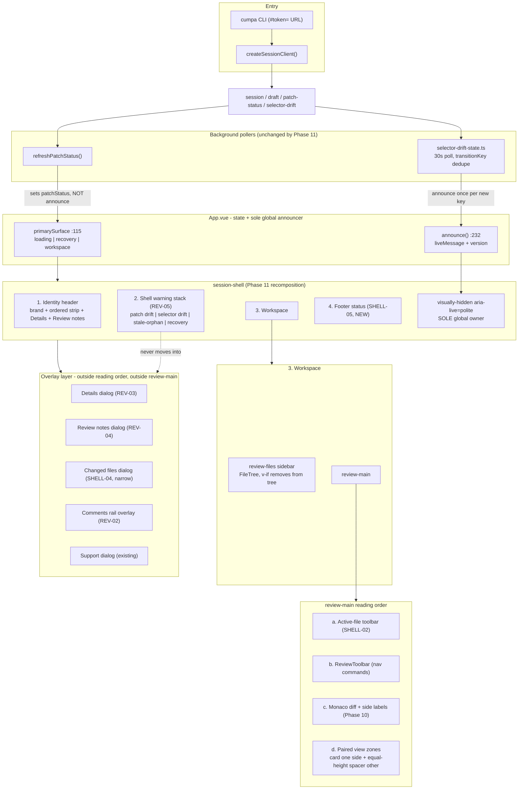

# Phase 11: Workspace Shell & Review Surfaces - Research

**Researched:** 2026-09-13
**Domain:** Vue 3 SFC shell recomposition, native browser dialog/focus semantics, ARIA live-region ownership, CSS grid responsive reflow under a custom token-drift gate
**Confidence:** HIGH (every claim about current code is a verified `file:line` read in this worktree; the two platform questions were settled by a throwaway Chromium probe, not by recall)

---

## Summary

Phase 11 is large in surface area but **much smaller in new behaviour than it looks**. Three of the ten requirements are already substantially shipped and only need copy/role edits: SHELL-03's hide/restore already works via `v-if` (`src/web/App.vue:1163`, proven by `tests/e2e/responsive-session.spec.ts:1280-1331`); REV-05's selector-drift announcement is *already* single-owner in `App.vue` (`src/web/model/selector-drift-state.ts:73-78` announces once per transition key via the `announce` callback passed at `src/web/App.vue:1060`); REV-01's paired Base/Head containment already works through height-matched Monaco view zones (`src/web/monaco/diff-adapter.ts:532-547,587-595`).

The genuinely new work is: a shell footer (none exists — verified by `grep '<footer'` returning only `CommentComposer.vue:78,85`), a stale/orphan-anchor shell notice (no such surface exists in `App.vue`), splitting `ReviewPanel.vue` (819 lines) into a comments rail and a Review-notes dialog, promoting `IdentityPanel` from a dual-mode region/dialog to an always-modal Details dialog, and unifying four contradictory breakpoint systems.

The largest risk is **not** REV-05 (which is nearly free) but the **breakpoint unification**, because the semantic CSS gate hard-codes the current media queries at `scripts/verify-semantic-css.mjs:248-251` and `tests/e2e/responsive-session.spec.ts` sweeps nine hard-coded widths in one 817-line test.

**Primary recommendation:** Sequence as six slices — (1) geometry tokens + breakpoint unification + gate script + `ModalDialog` extraction, (2) shell chrome (header/active-file toolbar/footer/sidebar toggle), (3) Details dialog, (4) `ReviewPanel` split into rail + Review notes, (5) narrow changed-files dialog, (6) REV-05 warning stack. Slice 1 blocks everything and slice 2 blocks 3 and 5; slices 3 and 4 are genuinely independent once `ModalDialog.vue` exists; slice 6 must be last because "exactly one live owner per class" is a property of the *finished* composition. **Do not migrate to native `<dialog>`** — `tests/e2e/responsive-session.spec.ts:1594-1596` pins tight Tab wrapping that the native trap cannot produce, and `:1592` pins a `.review-shell[inert]` attribute the top layer never sets (probe evidence in §Q5b).

---

## User Constraints (from CONTEXT.md)

### Locked Decisions

None. `.planning/phases/11-workspace-shell-review-surfaces/11-CONTEXT.md:36-37`:

> ### Claude's Discretion
> All implementation choices are at Claude's discretion — discuss phase was skipped per user setting. Use the ROADMAP phase goal, success criteria, the Phase 08–10 contracts, and codebase conventions to guide decisions.

**However:** `11-UI-SPEC.md` is an approved contract and is authoritative for every visible value, copy string, role, and focus target. Treat it as locked. Discretion applies only to *how* those are implemented.

### Claude's Discretion

All implementation choices, bounded by the UI-SPEC.

### Deferred Ideas (OUT OF SCOPE)

`11-CONTEXT.md:73`: "None — discuss phase skipped."

Out of scope per `11-CONTEXT.md:27`: Phase 12 packaged behaviour-continuity and accessibility evidence (CON-01); new tokens without a same-change consumer; any regression of Phase 10's Monaco contract.

---

## Phase Requirements

| ID | Description | Research Support |
|----|-------------|------------------|
| SHELL-01 | Identity header with product mark and ordered comparison strip; Base/Head for pinned, preimage/postimage for exact-patch | §Shell Composition Today (`IdentityHeader.vue:69-108`); §Pitfall 3 (two-`h1` hazard); §Test Impact rows for `pinned-session.spec.ts` |
| SHELL-02 | Active-file toolbar replacing the permanently expanded metadata header | §Shell Composition Today (`App.vue:1182-1239`); §Q2 (what moves into Details); §Pitfall 1 (`outerOverflowOwners`) |
| SHELL-03 | Hide/restore sidebar, removed from tab order while hidden | §Q4 — already shipped as `v-if`; only copy + Monaco/zone relayout are new |
| SHELL-04 | Narrow reflow with changed-files dialog, file → Base → Head order | §Q7; §Breakpoint Unification; §Pitfall 6 (skip-link target vanishes) |
| SHELL-05 | Truthful footer status line | §Q8 — entirely new; `.session-shell` grid row math in §Architecture Patterns |
| REV-01 | Inline comment mechanics unchanged, paired Base/Head containment | §Q6 — `diff-adapter.ts:532-547`; desync risk at §Pitfall 4 |
| REV-02 | Comments rail restyled, states/navigation intact | §Q3 (ReviewPanel split); `CommentsRail.vue` is dead code |
| REV-03 | Details dialog for identities, commit IDs, merge base, file metadata, keyboard help | §Q2; §Q5 (dialog primitive); `FileMetadataPane.vue` is app-orphaned |
| REV-04 | Review-notes dialog for summary + export, diff stays full width | §Q3; §Pitfall 5 (`main.review-main` editable-control scope) |
| REV-05 | Warnings stay in shell, single-owner live announcements | §Q5-REV05 — full live-region inventory; only two edits needed for selector drift |

---

## Project Constraints (from CLAUDE.md)

`.claude/CLAUDE.md` (auto-loaded) imposes:

| Directive | Effect on this phase |
|-----------|---------------------|
| Node.js 24 LTS, TypeScript end to end | No new runtime; `vue-tsc`/`typecheck:web` must stay green |
| UI: Vue 3 + Vite + Monaco Diff Editor | No component library, no dialog framework (UI-SPEC §Component Inventory agrees) |
| Contracts: Zod shared by API/persistence/export | Phase 11 touches **no** contract — it is presentation-only |
| Testing: Vitest for contracts, Playwright for browser review flow | All Phase 11 proof is Playwright; the model unit tests must stay untouched |
| Project skill `spike-findings-cumpa` | Available at `.claude/skills/`; consult for Monaco gotchas before touching the adapter |
| GSD workflow enforcement | File edits happen inside `/gsd-execute-phase`, not ad hoc |

---

## Architectural Responsibility Map

| Capability | Primary Tier | Secondary Tier | Rationale |
|------------|-------------|----------------|-----------|
| Shell layout, grid tracks, breakpoints | Browser/Client (CSS in `src/web/styles.css`) | — | Single stylesheet is the gate's audit target; no runtime layout math exists or is needed |
| Which surface is a drawer vs. dialog vs. column | Browser/Client (`matchMedia` in `App.vue:1038-1045`) | CSS | Vue needs the boolean to switch *markup* (dialog vs. nav), which CSS cannot do |
| Focus containment, ESC, focus return | Browser/Client (component-local, `SupportDialog.vue:30-43`) | — | No server involvement; must stay in Vue to satisfy the pinned tight-wrap contract |
| Live-region announcement routing | Browser/Client (`App.vue:232-235` `announce()`) | — | Already the sole global owner; REV-05 is an ownership *subtraction* problem |
| Selector-drift polling | Browser/Client (`selector-drift-state.ts`) → API | API/Backend (`GET` drift endpoint) | Unchanged by Phase 11; only the *notice's* role changes |
| Diff rendering, line mapping, view zones | Browser/Client (Monaco adapter) | — | Phase 10 owns this; Phase 11 only triggers `layout()` |
| Draft persistence, export, receipts | API/Backend + Storage | Client presentation | Phase 11 relocates presentation only; `review-draft-state.ts` must not change |

**Consequence for the planner:** every Phase 11 task is client-tier. Any task that proposes touching `src/server/`, `src/contracts/`, `src/domain/`, or `src/web/model/` is mis-assigned — with the single justified exception of `src/web/model/` if the stale/orphan *count* needs a derived selector, which it does not (`ReviewPanel.vue:441` already derives status per comment from `WorkspaceComment.status`, typed at `src/web/model/workspace-state.ts:8`).

---

## Standard Stack

### Core

| Library | Version | Purpose | Why Standard |
|---------|---------|---------|--------------|
| `vue` | 3.5.39 | Shell composition, conditional rendering, `:inert` binding | Already the project stack; `:inert` boolean binding is proven to work by `tests/e2e/responsive-session.spec.ts:1152,1160-1161` |
| `monaco-editor` | 0.55.1 | Diff + paired view zones | Phase 10 contract; must not be re-wrapped |
| `@playwright/test` | 1.61.1 | All Phase 11 proof | Chromium 149.0.7827.55 (probe-verified) |
| `typescript` | 7.0.2 | `typecheck:web` gate | — |
| `vite` | 8.1.4 | `build:web` feeding `verify:semantic-css` | — |

`[VERIFIED: package.json via node -e require]` — versions read from the installed manifest, not recalled.

### Supporting

| Library | Version | Purpose | When to Use |
|---------|---------|---------|-------------|
| — | — | — | **No new dependency is required or permitted.** UI-SPEC §Registry Safety: "No third-party registry is used." |

### Alternatives Considered

| Instead of | Could Use | Tradeoff |
|------------|-----------|----------|
| Hand-rolled focus trap (`SupportDialog.vue:30-43`) | Native `<dialog>` + `showModal()` | **Rejected.** See §Q5. Native inserts a `BODY` tab stop that breaks the pinned tight-wrap assertion, and it does not set the `.review-shell[inert]` attribute that `responsive-session.spec.ts:1592` asserts |
| Extracting a shared dialog host | Leaving two copies of `containFocus` | **Rejected.** Phase 11 adds three more dialogs; five copies of a 14-line trap is the abstraction the repo actually needs (and the UI-SPEC explicitly permits "a thin phase-specific dialog host") |
| `focus-trap` / `@vueuse/integrations` npm packages | — | **Rejected.** 14 lines already work; a dependency for this is exactly what the project constraints forbid |
| CSS-only narrow reflow | `matchMedia` + markup switch | **Rejected.** SHELL-04 requires a *dialog* at narrow, not a repositioned nav. CSS cannot change roles or focus behaviour |

**Installation:**

```bash
# none — Phase 11 adds no packages
```

---

## Package Legitimacy Audit

Phase 11 installs **no external packages**. The UI-SPEC forbids new dependencies (§Registry Safety, §Non-Goals: "no ... icon package, component library, or registry").

| Package | Registry | Age | Downloads | Source Repo | Verdict | Disposition |
|---------|----------|-----|-----------|-------------|---------|-------------|
| *(none)* | — | — | — | — | — | — |

**Packages removed due to [SLOP] verdict:** none
**Packages flagged as suspicious [SUS]:** none

If any plan proposes `npm install`, that plan contradicts the approved UI-SPEC and must be rejected before execution.

---

## Shell Composition Today (evidence for every question below)

`src/web/App.vue` is 1378 lines: script `1-1105`, template `1107-1376`, `<style src="./styles.css">` at `1378`.

### Region inventory — `App.vue` template

| # | Region | Lines | Owning markup | Contractual Playwright locators |
|---|--------|-------|---------------|--------------------------------|
| 1 | Loading shell | `1108-1113` | `main.loading-shell` + `p[role=status]` | `App.vue:1111` role=status |
| 2 | Unavailable shell | `1115-1123` | `main.unavailable-shell` + `ErrorState` | `selector-drift-ui.spec.ts:438-512` frozen-snapshot focus |
| 3 | **Session shell root** | `1125-1375` | `div.session-shell` | `responsive-session.spec.ts` throughout |
| 4 | Skip links | `1126-1128` | 3× `a.skip-link` → `#changed-files-heading`, `#cumpa-heading`, `#review-heading` | `responsive-session.spec.ts:1084-1094` |
| 5 | Identity header | `1129-1140` → `IdentityHeader.vue:69-108` | `header.session-header`, `h1`, `.pin-cue`, `.identity-disclosure` | `pinned-session.spec.ts:437-438,874-875,975-977,1147,1187-1188,1480-1481`; `responsive-session.spec.ts:868-874,977,989` |
| 6 | Patch-drift banner | `1141-1144` | `InlineNotice[tone=error][role=alert]` | `selector-drift-ui.spec.ts:413-416` |
| 7 | Selector-drift notice | `1145` → `SelectorDriftNotice.vue:41-76` | `aside.inline-notice--warning.selector-drift-notice[role=status]` | `review-panel-resolved.spec.ts:326-353`; `complete-review-draft.spec.ts` (3 refs) |
| 8 | Identity panel (region **or** dialog) | `1146` → `IdentityPanel.vue:76-206` | `section.identity-panel`, `:role="modal ? 'dialog' : 'region'"` (`IdentityPanel.vue:80`) | `pinned-session.spec.ts:500,555,904,987,1163`; `selector-drift-ui.spec.ts:529`; `responsive-session.spec.ts:1579-1600` |
| 9 | Draft recovery (replaces workspace) | `1148-1155` → `DraftRecovery.vue:108-207` | `.draft-recovery__card`, `.draft-recovery__notice` | `draft-recovery-ui.spec.ts:275-285,371` |
| 10 | **Review shell grid** | `1156-1360` | `div.review-shell`, `:inert` at `1160` | `responsive-session.spec.ts:1285-1330,1592`; `anchored-workspace.spec.ts:1197-1210` |
| 11 | Changed-files sidebar | `1162-1179` | `nav#changed-files.review-files`, `:inert`/`aria-hidden` at `1168-1169` | `responsive-session.spec.ts:1152,1160-1161,1283-1299,1315`; `anchored-workspace.spec.ts:999`; `anchored-review.spec.ts:379` |
| 12 | Review main | `1181-1303` | `main.review-main[aria-labelledby=cumpa-heading]` | `pinned-session.spec.ts:1414`; `anchored-workspace.spec.ts:1203-1209` |
| 13 | Active-file context header | `1182-1239` | `header.review-context-header`, `__context`, `__file`, `__endpoint(--base/--head)`, `__endpoint-label/-name/-oid`, `__toolbar` | `anchored-workspace.spec.ts:519-538` |
| 14 | Files toggle button | `1192-1198` | `button.ui-button[aria-controls=changed-files]`, text `Files` | `responsive-session.spec.ts:1282-1284,1096,1137,1203` |
| 15 | Review toolbar | `1223-1238` → `ReviewToolbar.vue:24-96` | `.review-toolbar`, `#review-description.sr-only` | `anchored-workspace.spec.ts:540-556` |
| 16 | Keyboard help | `1240` → `KeyboardHelp.vue:12-30` | `section.keyboard-help`, `h2#keyboard-actions-heading` | `responsive-session.spec.ts:1115,1119`; `anchored-workspace.spec.ts` |
| 17 | Empty / unavailable / error states | `1242-1283` | `.empty-state`, `.diff-state[aria-live=polite]` (`1266`) | UI-SPEC §Copywriting rows |
| 18 | Diff host | `1284-1301` → `DiffWorkspace.vue:314-346` | `.diff-workspace`, `__viewport`, `__canvas`, `__side-labels`, `__editor` | `anchored-workspace.spec.ts:1203-1225`; all Phase 10 specs |
| 19 | Comments rail | `1304-1359` | `aside#review-panel.comments-rail`, `v-show` + `:inert` (`1310-1311`) | `anchored-workspace.spec.ts:988`; `anchored-review.spec.ts:372`; `agent-ready-export.spec.ts:563`; `complete-review-draft.spec.ts:326-327` |
| 20 | Support dialog | `1361-1371` → `SupportDialog.vue:54-84` | `.support-dialog-backdrop`, `section.support-dialog[role=dialog][aria-modal=true]` | `support-dialog.spec.ts`, `support-payment.spec.ts` |
| 21 | **Global live region** | `1372-1374` | `p.visually-hidden[aria-live=polite]` + versioned `<span>` | `selector-drift-ui.spec.ts:431`; `draft-recovery-ui.spec.ts:371`; `anchored-workspace.spec.ts:1146` |

**There is no footer.** `grep -rn '<footer' src/web` returns only `CommentComposer.vue:78,85` (conversation-card footers). SHELL-05 is 100% new.

### The four breakpoint systems that currently disagree

| System | Values | Location |
|--------|--------|----------|
| `App.vue` JS media queries | `max-width: 1099px` (files drawer), `max-width: 1439px` (comments drawer), `max-width: 767px` (compact identity) | `src/web/App.vue:1038-1040` |
| `styles.css` shell queries | `768–1279px`, `max-width: 1439px`, `max-width: 1099px`, `max-width: 767px` | `src/web/styles.css:2415,2435,2467,2509` |
| `DiffWorkspace` (Phase 10) | `min-width: 1650px`, `max-width: 760px` | `src/web/components/DiffWorkspace.vue:294-295` |
| **UI-SPEC (target)** | `min-width: 1650px` → 320px sidebar; default → 294px; `max-width: 1050px` → 248px; `max-width: 760px` → narrow/dialog | `11-UI-SPEC.md:198-206` |

Phase 10's `1650/760` already match the target. **Only `App.vue` and `styles.css` need to move**, onto Phase 10's existing pair plus a new `1050px` compact tier. That is a real simplification, not just churn.

---

## Architecture Patterns

### System Architecture Diagram



The critical structural rule the diagram encodes: **overlays branch off `session-shell`, never off `review-main`.** Violating that trips `pinned-session.spec.ts:1414` (see Pitfall 5).

### Recommended structure

```
src/web/
├── App.vue                       # shell composition + sole announcer; SHRINKS
├── components/
│   ├── ui/
│   │   └── ModalDialog.vue       # NEW: one focus trap, ESC, focus return (~40 lines)
│   ├── IdentityHeader.vue        # SHELL-01 rewrite
│   ├── ShellFooter.vue           # NEW: SHELL-05 (or inline in App.vue)
│   ├── ActiveFileToolbar.vue     # NEW or extracted from App.vue:1182-1239
│   ├── DetailsDialog.vue         # NEW: hosts IdentityPanel + FileMetadataPane + KeyboardHelp
│   ├── ReviewNotesDialog.vue     # NEW: hosts SummarySection + Export* + Gitignore + attached
│   ├── ChangedFilesDialog.vue    # NEW: hosts the same FileTree instance
│   ├── CommentsRail.vue          # REPLACE dead stub with the real rail
│   ├── ReviewPanel.vue           # SPLIT then delete, or reduce to rail body
│   ├── FileMetadataPane.vue      # REVIVE (currently app-orphaned)
│   ├── SelectorDriftNotice.vue   # drop role=status (REV-05)
│   └── StaleAnchorNotice.vue     # NEW: REV-05 shell notice
└── styles.css                    # +4 tokens, breakpoint rewrite
scripts/
├── css-token-contract.mjs        # MUST add 4 tokens to CANONICAL_TOKENS
└── verify-semantic-css.mjs       # MUST update overlayAllowlist + media-context pins
```

### Pattern 1: One extracted focus-trap dialog host

**What:** A `ModalDialog.vue` that owns `role="dialog"`, `aria-modal="true"`, Tab/Shift+Tab containment, Escape, initial focus, and focus return — replacing the two existing copies.

**When to use:** Details, Review notes, Changed files. **Not** for the comments rail (non-modal overlay) and not for `SupportDialog` beyond visual inheritance (UI-SPEC: "No broad support-dialog redesign").

**Example** — the contract to preserve, from the shipped code:

```typescript
// Source: src/web/components/SupportDialog.vue:30-43 (existing, tight-wrapping)
function containFocus(event: KeyboardEvent): void {
  if (event.key !== 'Tab') return;
  const controls = Array.from(
    dialog.value?.querySelectorAll<HTMLElement>('button:not(:disabled), input:not(:disabled)') ?? [],
  );
  if (controls.length === 0) return;
  const first = controls[0]!;
  const last = controls.at(-1)!;
  if (event.shiftKey && document.activeElement === first) {
    event.preventDefault();
    last.focus();
  } else if (!event.shiftKey && document.activeElement === last) {
    event.preventDefault();
    first.focus();
  }
}
```

Two defects to fix while extracting, both real:

1. **`IdentityPanel.vue:56` only queries `button:not(:disabled)`** — it misses `input`, `textarea`, `a[href]`, `[tabindex]`. Review notes contains a `<textarea>` (summary) and Changed files contains the filter `<input>` (`FileTree.vue:159`). The selector must be widened or focus escapes the trap.
2. Neither copy restores focus to the opener; `App.vue` does it externally (`closeFiles` at `App.vue:251-254`, `closeComments` at `262-266`). The host should own it so each new dialog does not re-implement it.

### Pattern 2: Shell warning stack (REV-05)

**What:** Replace the current mutually-exclusive `v-if`/`v-else` pair at `App.vue:1141-1145` with a stacked region, because patch drift and stale anchors can coexist.

**Current (mutually exclusive — a bug for REV-05):**

```vue
<!-- Source: src/web/App.vue:1141-1145 -->
<InlineNotice v-if="patchDrifted" tone="error" role="alert">
  <h2>Implemented content changed</h2>
  <p>The repository or worktree no longer matches this exact patch. …</p>
</InlineNotice>
<SelectorDriftNotice v-else :drift="selectorDriftStatus" />
```

`v-else` means a pinned session can never show patch drift (correct — `patchDrifted` is exact-patch only) but a stale-anchor notice has nowhere to go. The stack must render independent siblings.

### Pattern 3: Non-root token redeclaration for responsive geometry

**What:** `--sidebar-width` must vary by breakpoint, but `:root` inside `@media` is a hard gate failure.

```css
/* Source: scripts/verify-semantic-css.mjs:60-65 + self-check :287-297 */
/* rootRule() fails on a :root rule nested inside @media/@supports/@layer/@container/@scope */
```

Correct shape:

```css
:root { --sidebar-width: 294px; }               /* the ONE token root */
.review-shell { grid-template-columns: var(--sidebar-width) minmax(0, 1fr); }
@media (min-width: 1650px) { .review-shell { --sidebar-width: 320px; } }
@media (max-width: 1050px) { .review-shell { --sidebar-width: 248px; } }
```

Redeclaring a custom property on a **non-`:root`** selector inside a media block is permitted: `assertTokenRoot` (`verify-semantic-css.mjs:75-89`) only inspects the `:root` rule, and nothing forbids component-scoped custom properties.

### Anti-Patterns to Avoid

- **Putting any dialog inside `.review-main`.** Trips `pinned-session.spec.ts:1414` (`main.review-main` must contain zero `input, textarea, select` on the non-reviewable path). Mount all overlays as siblings of `.review-shell`, like `SupportDialog` at `App.vue:1361`.
- **Using `class="visually-hidden"` inside `.review-main`.** The rule at `styles.css:905-916` sets `width:1px; overflow:hidden` → `scrollWidth > clientWidth` → trips the `outerOverflowOwners` canary, which only excludes `.sr-only` (`anchored-workspace.spec.ts:1205`). Inside `.review-main`, use `.sr-only` (`styles.css:448-456`), as `ReviewToolbar.vue:77` already does.
- **Truncating with `text-overflow: ellipsis` inside `.review-main`.** Same canary. The shipped strategy is wrapping: `.path-text { overflow-wrap: anywhere }` (`styles.css`). UI-SPEC's word "truncate" (`11-UI-SPEC.md:202`) must be implemented as *wrap/shrink*, not clip.
- **Adding a second `<h1>` to the header.** See Pitfall 3.
- **Adding `aria-live` to the new open/resolved counters or the stale-anchor badge.** UI-SPEC: "Do not add `aria-live` to changing counters merely because they update."
- **Reviving `CommentsRail.vue` as-is.** It is a stale pass-through (`CommentsRail.vue:5-13` declares 7 props; `ReviewPanel` now takes ~25, see `App.vue:1316-1357`) and is imported by nothing. Rewrite or delete.
- **Restructuring `.diff-workspace__side-labels`.** `anchored-workspace.spec.ts:1223,1225` uses `> span:first-child > span:first-child` and `> span:last-child > span:first-child` against `DiffWorkspace.vue:317-326`. One extra wrapper span silently breaks Phase 10's narrow-viewport reachability proof.

---

## Don't Hand-Roll

| Problem | Don't Build | Use Instead | Why |
|---------|-------------|-------------|-----|
| Focus containment | A new trap per dialog | One extracted `ModalDialog.vue` from `SupportDialog.vue:30-43` | Three new dialogs × 14 lines = three places to get `disabled` handling wrong |
| Announce-once-per-transition | New dedupe logic in a notice component | `selector-drift-state.ts:32-42` `transitionKey()` + `announce` callback | Already correct and already tested (`selector-drift-ui.spec.ts:431`) |
| Repeated-message live updates | Manual DOM churn | `App.vue:1373` `:key="liveMessageVersion"` span remount | Already solves the "identical consecutive messages" case; pinned by `anchored-workspace.spec.ts:1146` |
| Paired zone height sync | Per-card measurement | `diff-adapter.ts:587-595` `growPairedZones()` | Sets both zones to one height in one pass |
| Path rendering + accessible move label | New markup in the toolbar | `PathDisplay.vue:31-45` (already used at `App.vue:1188`) | Owns `aria-label` for renamed/copied, pinned by `anchored-workspace.spec.ts:531-538` |
| Sidebar removal from a11y tree | `aria-hidden` + `display:none` juggling | `v-if` (`App.vue:1163`) | Already proven by `responsive-session.spec.ts:1299` `toHaveCount(0)` |
| Copy-to-clipboard feedback | New status plumbing | `CopyButton.vue:53-56` (`role=status` + `role=alert`) | Already the enumerated local owner in the UI-SPEC ownership table |

**Key insight:** The dominant failure mode for this phase is *re-implementing behaviour that already exists in a different place*, then having two owners. That is literally what REV-05 is about — and the same trap applies to focus, dedupe, and truncation.

---

## Runtime State Inventory

Phase 11 is a presentation recomposition, not a rename or migration. There are no stored identifiers, external service registrations, or build artifacts keyed to the strings this phase changes. Each category was checked explicitly:

| Category | Items Found | Action Required |
|----------|-------------|------------------|
| Stored data | **None.** Drafts are versioned JSON under `.cumpa/`; the schema is owned by `src/contracts/` and `src/web/model/review-draft-state.ts`. No persisted field encodes a CSS class, ARIA role, or copy string. Verified: `grep -rn "Comparison identities\|View review scope" src/contracts src/domain src/server` → no matches | None — code edit only |
| Live service config | **None.** Cumpa binds `127.0.0.1` on an ephemeral port per launch (`.claude/CLAUDE.md` §Constraints). No external dashboards, workflows, or ACLs | None |
| OS-registered state | **None.** No scheduled task, launchd plist, or pm2 entry — the product is a `npx`/global CLI | None |
| Secrets/env vars | **None consumed by the web shell.** Two env markers gate out-of-scope specs only: `CUMPA_MARKETPLACE_URL_MARKER` and `CUMPA_RUNTIME_CUSTODY_DIR` (`11-CONTEXT.md:54`) | None |
| Build artifacts | **`dist/web/` is stale-sensitive.** `verify:semantic-css` reads `dist/web/index.html` and its linked CSS (`verify-semantic-css.mjs:17-18,385-402`), and `test:browser` = `npm run build:web && playwright test` (`package.json:41`). A token added to `styles.css` without a rebuild produces a **false gate pass/fail** | Always `npm run build:web` (or use `test:browser`/`verify:semantic-css`, which do it) before judging a failure |

---

## Environment Availability

| Dependency | Required By | Available | Version | Fallback |
|------------|------------|-----------|---------|----------|
| Node.js | all builds/tests | ✓ | 24.15.0 | — |
| Playwright Chromium | every Phase 11 proof | ✓ | 149.0.7827.55 | — |
| `@playwright/test` | test runner | ✓ | 1.61.1 | — |
| `vite` | `build:web` before gate/browser tests | ✓ | 8.1.4 | — |
| `typescript` / `vue-tsc` | `typecheck:web` | ✓ | 7.0.2 / 3.3.7 | — |
| `CUMPA_MARKETPLACE_URL_MARKER` | `tests/e2e/marketplace-review.spec.ts` | ✗ | — | Out of scope (`11-CONTEXT.md:54`) — pre-existing failure, do not "fix" |
| `CUMPA_RUNTIME_CUSTODY_DIR` | `tests/e2e/public-support-states.spec.ts` | ✗ | — | Out of scope (`11-CONTEXT.md:54`) — pre-existing failure |

**Missing dependencies with no fallback:** none.
**Missing dependencies with fallback:** the two env markers above — plans must not count these specs as Phase 11 regressions.

Playwright config note: `playwright.config.ts` runs **chromium only, `workers: 1`, `fullyParallel: false`, `retries: 0`, 30s timeout**, and already ignores `e2e/package-assets.spec.ts` and `e2e/agent-ready-export.spec.ts`. Single-spec proof is therefore cheap and deterministic:

```bash
npm run build:web && npx playwright test tests/integration/selector-drift-ui.spec.ts
```

---

## Open Questions (RESOLVED)

### Q1. What is the current shell composition, and which locators are contractual?

**Answer:** Fully enumerated in §Shell Composition Today — 21 regions with line ranges and their pinning specs. Read that table rather than re-deriving it.

**The three structural facts that drive planning:**
1. `.session-shell` is `display: grid; grid-template-rows: auto minmax(0,1fr); height: 100dvh; overflow: hidden` (`styles.css:226-234`) but has **7–9 direct children** depending on state (3 skip links, header, warning, identity panel, review-shell, support dialog, live region). Extra children land in implicit `auto` rows. Adding a footer to a template that already relies on implicit rows is fragile — the planner should make the row template explicit rather than appending a fourth `auto`.
2. `.review-shell` is `grid-template-columns: 288px minmax(0,1fr) 360px` (`styles.css:1443`) — **the comments rail is a grid column at ≥1440px**, becoming an absolute overlay only at `max-width: 1439px` (`styles.css:2444-2454`).
3. `.review-shell` sets `contain: paint` (`styles.css:1442`) — relevant if any overlay is ever moved inside it (it must not be).

---

### Q2. What moves into Details and Review notes, what owns their state, and what breaks?

#### Into **Details** (REV-03)

| Surface | Current location | Current state owner | Reroute |
|---------|------------------|---------------------|---------|
| `IdentityPanel.vue` (comparison/scope identities, commit OIDs, merge base, pathspecs, patch digest) | `App.vue:1146`, sibling of `.review-shell` | Props only: `:session`, `:modal`; emits `close`. Local refs: `closeButton`, `containFocus` (`IdentityPanel.vue:17,50`) | Becomes a child of `DetailsDialog`. `:modal` becomes **always true** |
| `KeyboardHelp.vue` | `App.vue:1240`, **inside `.review-main`** | `keyboardHelpOpen` ref in `App.vue:88`, set at `App.vue:1236` | Moves out of `.review-main` into Details; `keyboardHelpOpen` is deleted, folded into `identityOpen` |
| `FileMetadataPane.vue` | **Not mounted anywhere in the app** | — | Must be *revived* into Details |
| Selected-file status / counts / modes | `review-context-header` eyebrow + `PathDisplay` (`App.vue:1186-1190`) | `selectedFile` shallowRef (`App.vue:76`) | Duplicated read-only into Details; the toolbar keeps the visible name |

**`FileMetadataPane.vue` is app-orphaned.** Verified: `grep -rn "FileMetadataPane" src` → zero matches; the only reference is `tests/e2e/pinned-session.spec.ts:55,77,84,91,98`, which mounts it directly in a component harness. So the component *is* tested but *is not shipped*. REV-03 requires "file metadata" in Details — reviving this component satisfies it and makes those five harness assertions meaningful again. **This is the single least obvious discovery in this research.**

**What breaks if state moves:** essentially nothing, because `IdentityPanel`, `KeyboardHelp`, and `FileMetadataPane` are all **pure prop-driven** components with no writable state that `App.vue` reads back. The only shared state is `identityOpen`/`keyboardHelpOpen` booleans and the `identityPanel` template ref used for focus (`App.vue:93`, `IdentityPanel.vue:46-48,72` `defineExpose({ focusClose })`). `App.vue:827,834` branch on `identityModal` for focus handling — that branch collapses once Details is always modal.

#### Into **Review notes** (REV-04)

`ReviewPanel.vue` template is `341-819`. It must be cut at section boundaries:

| Lines | Section | Destination |
|-------|---------|-------------|
| `342` | `section.review-panel[aria-labelledby=review-heading]` root | Split into two roots |
| `343-353` | Heading `Review` + `.review-panel__heading-counts` | **Both** — rail keeps `Review` heading (pinned by `complete-review-draft.spec.ts:326-327`); counts appear in both per UI-SPEC |
| `354-373` | Revision-conflict `role=alert` | **Review notes** (it is a summary/comment mutation conflict) |
| `374-389` | Operation-failed `role=alert` | **Review notes** |
| `390-404` | `SummarySection` | **Review notes** (order item 1) |
| `405-550` | Open comments group | **Rail** |
| `551-653` | Resolved comments group | **Rail** |
| `654-674` | `ExportSection` (incl. readiness, progress, receipt, drift ack, gitignore) | **Review notes** (order items 2–4) |
| `675-818` | Attached completion | **Review notes** (order item 5) |

**State ownership is already correct and must not move.** Every buffer lives in `App.vue`'s `reviewDraft` snapshot and is passed down (`App.vue:1316-1357`): `:summary-buffer`, `:comment-buffers`, `:pending`, `:conflict`, `:export-state`, with `@update:summary-buffer`/`@update:comment-buffer` writing back through `reviewState` (`App.vue:1349-1350`). `ReviewPanel` holds only *view* state: `resolvedOpen`, `openCommentsOpen`, `pendingFocus`, and the `completionAction`/`completionSuccess`/`completionFailure` focus refs (`ReviewPanel.vue:142-144`).

**What breaks:** two things, both concrete.

1. **`focusStaleFeedback()` (`ReviewPanel.vue:150-161`) crosses the split.** It is invoked from the *attached-completion* failure UI (`ReviewPanel.vue:740`, "Review stale feedback") but acts on the *comments* UI: it sets `resolvedOpen`/`openCommentsOpen` and focuses a comment heading. After the split, the button lives in Review notes and the target lives in the rail. This needs an explicit cross-surface event (`App.vue` opens the rail, then focuses) — it cannot stay a local method.
2. **`attachedHasUnsavedText` (`ReviewPanel.vue:132-135`) reads `props.comments` buffers**, which are rail data, from the Review-notes side. Both surfaces must receive `comments` + `commentBuffers`, so the split is *presentational only* — do not try to narrow the props.

---

### Q3. Does a dialog primitive already exist?

**No shared primitive exists.** Two independent hand-rolled implementations:

| Implementation | Focus trap | ESC | Initial focus | Focus return | Scroll lock | Background inert |
|----------------|-----------|-----|---------------|--------------|-------------|------------------|
| `SupportDialog.vue:30-43,62-63` | ✓ `button, input` | ✓ `@keydown.esc.prevent` | ✓ `autofocus`-equivalent via `focusInitial()` watch (`:46-48`) | ✗ (App.vue does it) | ✗ | ✗ (App.vue sets `:inert` at `1160`) |
| `IdentityPanel.vue:50-58,83` | ✓ **`button` only** | ✗ (App.vue `:827,834`) | ✓ `focusClose()` exposed (`:46-48,72`) | ✗ (App.vue does it) | ✗ | ✗ (App.vue `:1160`) |

Neither locks scroll; neither needs to, because `.session-shell` is `overflow: hidden` at `100dvh` (`styles.css:226-234`) — the document never scrolls. **Scroll lock is a non-requirement here.** That is worth knowing before someone adds it.

**Recommendation:** extract one `ModalDialog.vue` from the `SupportDialog` shape (it is the more complete of the two), widen the focusable selector to `button:not(:disabled), [href], input:not(:disabled), select:not(:disabled), textarea:not(:disabled), [tabindex]:not([tabindex="-1"])`, and move focus-return into the host. Delete both copies. Closest analog to imitate: `SupportDialog.vue`.

**Rejected alternative:** native `<dialog>` + `showModal()` — see Q5.

---

### Q4. SHELL-03 tab-order removal: `hidden`, `inert`, `display:none`, or `v-if`?

**Answer: `v-if`. It is already implemented and already proven.**

```vue
<!-- Source: src/web/App.vue:1162-1172 -->
<nav
  v-if="isFilesDrawer || !filesCollapsed"
  ref="filesDrawer"
  class="review-files"
  :class="{ 'review-files--open': filesOpen }"
  id="changed-files"
  :inert="isFilesDrawer && !filesOpen"
  :aria-hidden="isFilesDrawer && !filesOpen ? 'true' : undefined"
  aria-label="Changed files"
  tabindex="-1"
>
```

Two mechanisms coexist deliberately and correctly:
- **Desktop hide (`filesCollapsed`)** → `v-if` **unrenders**. Asserted by `tests/e2e/responsive-session.spec.ts:1299`: `await expect(page.locator('#changed-files')).toHaveCount(0)`.
- **Narrow closed drawer (`isFilesDrawer && !filesOpen`)** → stays mounted with `inert` + `aria-hidden`, preserving tree state. Asserted at `responsive-session.spec.ts:1152` (`toHaveAttribute('inert','')`) and `1160-1161` (open → neither attribute).

This exactly matches UI-SPEC `11-UI-SPEC.md:177`: "Prefer non-rendering; if it must remain mounted to preserve tree state, apply both `inert` and `aria-hidden="true"`."

**Tests asserting tab order / inertness:**

| File:line | Assertion |
|-----------|-----------|
| `tests/e2e/responsive-session.spec.ts:1152` | `.review-files` has `inert` when drawer closed |
| `tests/e2e/responsive-session.spec.ts:1160-1161` | open drawer has neither `inert` nor `aria-hidden` |
| `tests/e2e/responsive-session.spec.ts:1299` | `#changed-files` count 0 when collapsed |
| `tests/e2e/responsive-session.spec.ts:1315` | `#changed-files` visible when restored |
| `tests/e2e/responsive-session.spec.ts:1592` | `.review-shell` has `inert` while the identity dialog is open |
| `tests/e2e/responsive-session.spec.ts:1594-1596` | **tight** Tab wrap inside the dialog |
| `tests/e2e/responsive-session.spec.ts:1573-1575`, `1359-1360` | Shift+Tab → Tab returns to the same control |
| `tests/integration/anchored-workspace.spec.ts:988,999` | `.comments-rail` and `.review-files` have `inert` |
| `tests/e2e/anchored-review.spec.ts:372,379` | same two `inert` assertions |

**Therefore SHELL-03's remaining work is not the mechanism — it is:**
1. Toggle copy per UI-SPEC `11-UI-SPEC.md:169-172`: visible `Hide files`/`Show files`/`Files`, accessible names `Hide changed files sidebar`/`Show changed files sidebar`/`Open changed files`. Today it is unconditionally `Files` (`App.vue:1198`).
2. `aria-expanded`/`aria-controls` must be present **only while the persistent host exists** (UI-SPEC `:179`). Today `aria-controls="changed-files"` is unconditional (`App.vue:1195`) even when the nav is unrendered — a dangling reference.
3. Focus return to the toggle after collapse. `toggleFiles` (`App.vue:243-249`) does not manage focus on the `filesCollapsed` branch; focus survives only because the button is not unmounted. This is incidentally correct today but must be asserted.
4. **Monaco relayout + anchor-zone re-measure on toggle** — see Pitfall 4.

---

### Q5. REV-05: every warning surface, and exactly what must change

#### Complete live-region inventory (44 matches, verified by grep across `src/web`)

| Surface | File:line | Current role | Pinned by |
|---------|-----------|--------------|-----------|
| **Global polite region** | `App.vue:1372-1374` | `aria-live="polite"` | `selector-drift-ui.spec.ts:431`; `draft-recovery-ui.spec.ts:371`; `anchored-workspace.spec.ts:1146` |
| Loading shell | `App.vue:1111` | `role="status"` | — |
| **Patch drift** | `App.vue:1141` | `role="alert"` | `selector-drift-ui.spec.ts:413-416` |
| Diff loading | `App.vue:1266` | `aria-live="polite"` | — |
| **Selector drift notice root** | `SelectorDriftNotice.vue:44` | `role="status"` ← **MUST BE REMOVED** | `review-panel-resolved.spec.ts:331-333,342` |
| Selector-drift copy feedback | `SelectorDriftNotice.vue:68` | plain `<p>`, inherits root's live-ness | `review-panel-resolved.spec.ts:341-342` |
| Draft recovery success | `DraftRecovery.vue:112` | `role="status"` | `draft-recovery-ui.spec.ts:277-280` |
| Draft recovery action feedback | `DraftRecovery.vue:162` | `role="status"` | `draft-recovery-ui.spec.ts:275-285` |
| **Draft recovery error (newer draft)** | `DraftRecovery.vue:167` | `role="alert"` | `draft-recovery-ui.spec.ts` |
| Comment composer validation/error | `CommentComposer.vue:73,74` | `role="alert"` | `anchored-workspace.spec.ts` |
| Copy feedback | `CopyButton.vue:53,56` | `role="status"` / `role="alert"` | multiple |
| Export progress | `ExportProgress.vue:22` | `role="status" aria-live="polite"` | `export-receipt-ui.spec.ts` |
| Export locked/conflict/failed/unavailable | `ExportSection.vue:88,93,113,135` | `status`/`alert`×3 | `export-receipt-ui.spec.ts:423-435` |
| Gitignore status/unavailable/appending/failed | `GitignoreStatus.vue:74,79,95,122,123` | `status`×3 / `alert`×2 | `agent-ready-export.spec.ts` |
| Review conflict / operation failed | `ReviewPanel.vue:357,378` | `role="alert"` | `review-panel-resolved.spec.ts:316-320` |
| Comment validation | `ReviewPanel.vue:458,603` | `role="alert"` | — |
| Resolving/reopening pending | `ReviewPanel.vue:544,648` | `role="status"` | — |
| Attached completion states | `ReviewPanel.vue:685,698,702,713,724,735,746,757,768,807` | `status`×3 / `alert`×7 | `agent-ready-export-safety.spec.ts` |
| Summary saving/error/retained | `SummarySection.vue:231,237,251` | `status`/`alert`/`status` | `complete-review-draft.spec.ts` |
| File metadata error/loading | `FileMetadataPane.vue:187,254` | `alert`/`status` | `pinned-session.spec.ts:55-98` harness |
| Support dialog status | `SupportDialog.vue:67` | `aria-live="polite"` | `support-dialog.spec.ts` |

#### The finding that shrinks REV-05

**`App.vue` is already the sole selector-polling announcer.** `App.vue:1060` wires it:

```typescript
// Source: src/web/App.vue:1060-1061
selectorDriftState = createSelectorDriftState(sessionClient, announce, { status: selectorDriftStatus });
selectorDriftState.start();
```

and the state machine dedupes by transition key:

```typescript
// Source: src/web/model/selector-drift-state.ts:32-42, 71-78
function transitionKey(drift: SelectorDriftResponse | undefined): string { /* role:kind:oldOid:newOid, joined by | */ }
// …
const previousKey = transitionKey(status.value);
const nextKey = transitionKey(next);
status.value = next;
if (nextKey !== '' && nextKey !== previousKey) {
  announce('Selected source changed. The open review remains pinned.');
}
```

So the *only* violation is that `SelectorDriftNotice.vue:44` **also** carries `role="status"`, making two owners for one event.

#### Exactly what must change

1. **`SelectorDriftNotice.vue:41-46`** — delete `role="status"`. Keep `<aside class="… selector-drift-notice" aria-labelledby="selector-drift-heading">` (UI-SPEC: "a non-live named `<aside aria-labelledby="selector-drift-heading">` with no explicit live role").
2. **`SelectorDriftNotice.vue:68`** — change `<p>{{ copied }}</p>` to render only when non-empty and carry its own operation-scoped live role:
   ```vue
   <p v-if="copied !== ''" role="status">{{ copied }}</p>
   ```
   Without the `v-if`, the node exists from first render and the "zero live owners before the operation" assertion cannot be satisfied.
3. **New stale/orphan shell notice** — none exists today (`grep -n "stale\|orphan" src/web/App.vue` → **no output**). Status is available per comment as `WorkspaceComment['status']` (`src/web/model/workspace-state.ts:8`: `'verified' | 'stale' | 'orphaned'`), already consumed by `ReviewPanel.vue:441,587`. `App.vue` must derive `hasUnverifiedAnchors`, render a **non-live** shell notice (heading `Some saved comment anchors cannot be verified`, body `Stale and unavailable comments remain visible as read-only history.`, action `Open comments`), and `announce()` **once** on the zero → non-zero transition — mirroring `transitionKey` dedupe, not re-announcing on every refresh.
4. **Patch drift stays `role="alert"`** in the shell (`App.vue:1141`) and `App.vue`'s global region must remain silent for it. Already true — `refreshPatchStatus` (`App.vue:900-910`) never calls `announce`. **No change.**
5. **Draft recovery stays as-is.** `DraftRecovery.vue:167` `role="alert"` owns the newer-draft block; `draft-recovery-ui.spec.ts:277-278` pins exactly one live owner inside `.draft-recovery__card`. **No change** — but the `v-if` at `App.vue:1149` means recovery *replaces* the workspace; the UI-SPEC calls this a primary-surface replacement, not a live class, so keep it.
6. **Warning stack structure** — replace the `v-if`/`v-else` at `App.vue:1141-1145` with independent siblings so patch drift, selector drift, and stale anchors can coexist.

#### Selector assertions that must be updated

| File:line | Today | Must become |
|-----------|-------|-------------|
| `tests/e2e/review-panel-resolved.spec.ts:331` | `expect(drift).toHaveAttribute('role', 'status')` | assert the root has **no** live role |
| `tests/e2e/review-panel-resolved.spec.ts:332-333` | `driftLiveOwners` → `toHaveCount(1)` | `toHaveCount(0)` before the copy operation |
| `tests/e2e/review-panel-resolved.spec.ts:342` | `toHaveCount(1)` after copy | stays `1` — now the adjacent `<p role="status">`, not the root |
| `tests/integration/selector-drift-ui.spec.ts` | selects the notice via role | UI-SPEC mandates selecting `aside.selector-drift-notice` or its labelled-heading relationship, not `getByRole('status')` |

`review-panel-resolved.spec.ts:344-353` (icon count, `border-left-width: 3px`, heading text, `inline-notice--warning` class) must all stay byte-unchanged — those are visual/semantic, not live-region, assertions.

---

### Q5b. Why not native `<dialog>` + `showModal()`? (probe evidence)

I ran a throwaway probe against this repo's own Chromium (removed afterward; `git status` clean). Results:

```
Chromium 149.0.7827.55
dialog::backdrop { background: var(--surface-scrim) }  →  "rgba(13, 17, 23, 0.68)"   ← token DOES resolve
showModal()  →  document.activeElement = #close (autofocus honoured)
Escape       →  dialog.open = false, document.activeElement = #open (focus returned to opener)

Tab  from #second: ["BUTTON#second", "BODY#", "BUTTON#close", "BUTTON#second", "BODY#"]
Shift+Tab      :  ["BUTTON#second", "BUTTON#close", "BODY#"]
```

Two conclusions:

1. **MDN is stale on `::backdrop` inheritance.** `https://developer.mozilla.org/en-US/docs/Web/CSS/Reference/Selectors/::backdrop` states "`::backdrop` neither inherits from nor is inherited by any other elements" `[CITED: developer.mozilla.org/en-US/docs/Web/CSS/Reference/Selectors/::backdrop]`. In Chromium 149 it **does** inherit from the originating element, so `var(--surface-scrim)` resolves correctly `[VERIFIED: local Chromium probe]`. Had this not been checked, either choice would have been made on bad information.

2. **Native modal wrapping is not tight — it passes through `BODY`.** `tests/e2e/responsive-session.spec.ts:1594-1596` asserts:
   ```typescript
   await copyButtons.last().focus();
   await page.keyboard.press('Tab');
   await expect(close).toBeFocused();
   ```
   Native `<dialog>` would land on `BODY` first. Satisfying this would require *weakening an existing passing assertion* to accommodate a UA quirk — forbidden. Additionally `responsive-session.spec.ts:1592` asserts `.review-shell[inert]`, which native top-layer inertness does not set.

**Decision: keep the hand-rolled trap, extract it once.** Native `<dialog>` gives no property this repo needs that the existing 14 lines do not already provide, and costs two contract regressions. `[VERIFIED: local Chromium probe + tests/e2e/responsive-session.spec.ts:1592,1594-1596]`

Everything MDN confirms about modal semantics still applies to the hand-rolled host as a *specification of correct behaviour*: initial focus should be explicit rather than "first focusable"; Escape must close the topmost dialog only; background content must be inert `[CITED: developer.mozilla.org/en-US/docs/Web/HTML/Reference/Elements/dialog]`.

---

### Q6. Comments rail and inline cards: what keeps paired containment, and what desynchronizes it?

**Mechanism — height-matched Monaco view zones, not CSS.**

```typescript
// Source: src/web/monaco/diff-adapter.ts:532-546
const anchoredZone = this.createComposerZone(anchor);
const spacerZone = this.createSpacerZone(anchoredZone.heightInPx ?? 280);
const anchoredZoneId = this.addZone(anchoredEditor, anchoredZone);
const spacerZoneId  = this.addZone(counterpartEditor, spacerZone);
```

- The real card is a view zone in **one** editor; an `aria-hidden` spacer of identical height goes in the other (`diff-adapter.ts:556-567`).
- Containment per pane comes from the container classes set once at `diff-adapter.ts:150-151`: `.monaco-diff-pane--base` on the original editor, `.monaco-diff-pane--head` on the modified editor. The card is *inside* the editor, so it cannot cross the sash by construction.
- Height sync: `DiffWorkspace.vue:105-108` measures and calls `setAnchorZoneHeight`, which reaches `growPairedZones` (`diff-adapter.ts:587-595`) setting **both** zones and re-laying out both.

```typescript
// Source: src/web/components/DiffWorkspace.vue:105-108
function resizeAnchorZoneToContent(zone: HTMLElement): void {
  const contentHeight = zone.firstElementChild?.scrollHeight ?? zone.scrollHeight;
  adapter?.setAnchorZoneHeight(Math.max(280, contentHeight + 16));
}
```

**What desynchronizes it — three concrete shell hazards:**

1. **Width change without re-measure.** `DiffWorkspace.vue:300` is `new ResizeObserver(() => adapter?.layout())` — it re-lays out Monaco but **never re-runs `resizeAnchorZoneToContent`**. `resizeAnchorZoneToContent` is called only from `renderAnnotation` (`DiffWorkspace.vue:138-140,159-160`). So **toggling the sidebar (SHELL-03) or opening the rail while an inline card is open changes the card's wrap height without updating either zone.** The card overflows or leaves a gap, and Base/Head alignment drifts. Fix: expose a re-measure and call it from the resize path.
2. **Measuring while hidden.** `scrollHeight` is 0 inside a `display:none` subtree, clamping to the 280px floor. If any Phase 11 change makes `.review-shell` or `.review-main` `display:none` while a dialog is open (instead of the current `:inert` at `App.vue:1160`), every subsequent card measures wrong. **Keep `:inert`; never `display:none` the workspace.**
3. **Restyling the card without re-measuring.** Phase 11 restyles `.conversation-card` (`DiffWorkspace.vue:124-137` builds it via `h()`). Padding/line-height changes are fine because measurement happens in `nextTick` after render — but only on the render path. Combined with hazard 1, a restyle plus a resize is the realistic failure.

**Tests that pin this:**

| File:line | Pins |
|-----------|------|
| `tests/integration/anchored-workspace.spec.ts:404-414` | `expectAnchoringNotToReflow`: `codeOrigin`, `gutters`, `panes`, `sashes`, `document` all unchanged |
| `tests/integration/anchored-workspace.spec.ts:416-425` | `expectConversationCardNotToReflow`: same set for the accepted card |
| `tests/integration/anchored-workspace.spec.ts:387-388` | `.monaco-diff-pane--base, .monaco-diff-pane--head` geometry |
| `tests/integration/anchored-workspace.spec.ts:398-399` | `.monaco-anchor-zone` rects |
| `tests/integration/anchored-workspace.spec.ts:1211` | `diffCanvas.rect.width >= 640` (Phase 10's minimum canvas) |
| `tests/integration/monaco-anchor.spec.ts` | anchor decoration + zone contract |

---

### Q7. Narrow-viewport reflow: current implementation, Phase 09 dialog fit, reading order

**Current implementation is hybrid CSS + `matchMedia`, and the narrow files surface is a slide-in drawer, not a dialog.**

- JS: `App.vue:1038-1045` creates three `MediaQueryList`s and `handleViewportChange` (`App.vue:888-898`) sets `isFilesDrawer`/`isCommentsDrawer`/`isNarrow`/`isCompact`, force-closes `filesOpen`, dispatches `resize` to the workspace state, and calls `diffWorkspace.value?.layout()`.
- CSS: at `max-width: 1099px` (`styles.css:2467-2507`) `.review-shell` becomes `display: block`, `.review-files` becomes `position: absolute; left: 8px; width: min(288px, calc(100vw - 16px))` with a `translateX(calc(-100% - 8px))` transform and `display: none` when not `--open`.
- `commentsOpen` initialises from the media query: `App.vue:1041` `commentsOpen.value = !commentsDrawerMedia.matches` — **so the rail is open by default at ≥1440px**, where it is a grid column that narrows the diff.

**Phase 09's changed-files dialog fit.** `FileTree.vue:148` already renders its own `<nav class="file-tree-pane" aria-label="Changed files">` containing the heading (`:150` `h2#changed-files-heading`), the filter label/input (`:158-166`, label uses `.visually-hidden`, placeholder `Find file…`), and the roving tree (`:184-185`). Because the tree is fully self-contained and prop-driven (`App.vue:1174` passes `:files`, `:initial-selected-file-id` and listens to `@select`/`@activate`), **hosting the identical element inside a dialog is a host swap, not a fork** — exactly what UI-SPEC `:210` demands ("the same `FileTree` interior state").

Two defects to fix during the swap:
- **Nested duplicate `nav` landmarks.** `App.vue:1162-1170` renders `<nav id="changed-files" aria-label="Changed files">` wrapping `FileTree.vue:148`'s `<nav aria-label="Changed files">`. Two identically-named navigation landmarks, one inside the other. Collapse to one.
- **Initial focus.** `openFiles()` (`App.vue:237-241`) focuses the drawer container. UI-SPEC `:211` requires initial focus on `Filter files` (`FileTree.vue:159`).

**What enforces file → Base → Head reading order.** Nothing declarative — it is DOM order plus one CSS grid-area rule:

```css
/* Source: src/web/styles.css:2476-2481 */
.review-context-header__context {
  grid-template-columns: minmax(0, 1fr) minmax(0, 1fr);
  grid-template-areas:
    "file file"
    "base head";
}
```

DOM order in `App.vue:1184-1221` is already file (`__file`, `:1184-1199`) → base endpoint (`:1201`/`:1211`) → head endpoint (`:1205`/`:1216`), and the grid areas preserve it visually. **The hazard is CSS `order`/`grid-area` reordering, or `flex-direction: row-reverse`, which would make the visual order disagree with DOM order.** Phase 11 must not introduce any of those in the context header. The exact-patch branch (`:1200-1209`) already uses `Preimage`/`Postimage` labels in the same positions, satisfying UI-SPEC `:148`'s "file → Preimage → Postimage".

**Recommendation for the rail default state.** Delete `commentsDrawerMedia` entirely, make the rail an overlay at every width, and default it **closed**. Justification: UI-SPEC `:198` requires "full-width diff" in the desktop composition and `:273` requires the rail to "always overlay the right edge … underlying diff bounds do not change". A default-open grid column contradicts both. Cost: `responsive-session.spec.ts:1335-1338` must open the rail before asserting its 360px width and overflow, rather than finding it open.

---

### Q8. `--sidebar-width` (and the other three deferred tokens)

**Where it must be declared:** the single canonical `:root` in `src/web/styles.css`. Not in a media query — `rootRule()` (`verify-semantic-css.mjs:60-65`) fails on any `:root` nested inside a grouping at-rule, and the gate's own self-check proves it for `@supports`, `@layer`, `@container`, and `@scope` (`verify-semantic-css.mjs:287-297`).

**Which rules consume it**, given the shipped literals:

| Current literal | File:line | Becomes |
|-----------------|-----------|---------|
| `grid-template-columns: 288px minmax(0, 1fr) 360px` | `styles.css:1443` | `grid-template-columns: var(--sidebar-width) minmax(0, 1fr)` (rail leaves the grid) |
| `grid-template-columns: minmax(0, 1fr) 360px` | `styles.css:1447` | `grid-template-columns: minmax(0, 1fr)` |
| `grid-template-columns: 256px minmax(0, 1fr)` | `styles.css:2437` | removed; replaced by `--sidebar-width` redeclaration |
| `width: min(288px, calc(100vw - 16px))` | `styles.css:2488` | `width: min(var(--sidebar-width), calc(100vw - 16px))` — or removed if narrow becomes a dialog |

**The gate requires three coordinated edits, not one.** This is the single most likely way to break the build:

1. `scripts/css-token-contract.mjs:1-27` — add `--control-height-compact`, `--dialog-max-height`, `--dialog-width`, `--sidebar-width` to `CANONICAL_TOKENS`. Required because `assertTokenRoot(sourceRoot, 'source CSS', true)` (`verify-semantic-css.mjs:406`) enforces an **exact** set: `verify-semantic-css.mjs:83-85` fails on "a non-canonical custom property".
2. `src/web/styles.css` `:root` — declare all four.
3. Consume all four in the same change — `assertDeclaredTokensConsumed` (`verify-semantic-css.mjs:91-107`) fails with "canonical tokens have no consumer" otherwise. It scans `styles.css` minus the root body, plus every `.css`/`.vue` under `src/web`, plus `src/web/monaco/theme.ts` (`verify-semantic-css.mjs:411-417`).

**Safe by construction:** none of the four names match the colour-token regex `/^…--(?:surface|text|border|interactive|focus|selection|scrollbar|destructive|status|diff|monaco|syntax)-/` (`css-token-contract.mjs:28`), so `assertCanonicalTokenValues` will not demand a hex value. `tests/unit/token-contract.test.ts` derives its fixture from `CANONICAL_TOKENS` (`:33,109`) with no hard-coded count, so it follows automatically. `scripts/token-root-plugin.mjs:38` re-validates the set at build time via `assertCanonicalTokenSet` — also automatic.

**Values** (UI-SPEC `11-UI-SPEC.md:68-71`): `--sidebar-width: 294px` (320px ≥1650, 248px ≤1050); `--dialog-width: min(560px, calc(100% - 24px))`; `--dialog-max-height: 85dvh`; `--control-height-compact: 30px`.

#### Mockup verification (closes assumption A1)

Every Phase 11 numeric was confirmed against the normative mockup in this repo, not taken on the UI-SPEC's word:

| Value | Verified source |
|-------|-----------------|
| `--sidebar-width: 294px` default | `mockups/01-quiet-workspace.html:9` — `.workspace{display:grid;grid-template-columns:294px minmax(0,1fr);min-height:0}` |
| `320px` at `min-width: 1650px` | `mockups/01-quiet-workspace.html:10` — `@media(min-width:1650px){.workspace{grid-template-columns:320px minmax(0,1fr)}…}` |
| `248px` at `max-width: 1050px` | `mockups/01-quiet-workspace.html:11` — `@media(max-width:1050px){.workspace{grid-template-columns:248px minmax(0,1fr)}…}` |
| narrow single column, sidebar unrendered | `mockups/01-quiet-workspace.html:12` — `@media(max-width:760px){.workspace,.workspace.hide-files{grid-template-columns:minmax(0,1fr)}.sidebar{display:none}…}` |
| `--dialog-width: min(560px, calc(100% - 24px))` | `mockups/01-quiet-workspace.html:9` — literal `min(560px,calc(100% - 24px))` |
| `--dialog-max-height: 85dvh` | `mockups/01-quiet-workspace.html:9` — literal `85dvh` |
| `--control-height-compact: 30px` | `mockups/01-quiet-workspace.html:9` — two `min-height:30px` compact controls |
| standard control `36px`, focus `2px` / offset `3px` | `mockups/01-quiet-workspace.html:9` — `button{…min-height:36px}`, `outline:2px solid var(--focus)`, `outline-offset:3px` |

**Bonus finding — the footer row is explicit in the mockup.** `mockups/01-quiet-workspace.html:9` sets the shell to
`body{…height:100dvh;display:grid;grid-template-rows:auto auto minmax(0,1fr) auto;overflow:hidden}` — **four rows**: header, secondary band, workspace, footer. The shipped `.session-shell` declares only two (`styles.css:231`). Adopt the mockup's explicit four-row template rather than appending an implicit `auto` (see Pitfall 9).

**Footer shape is also specified:** `.bottom{display:flex;align-items:center;justify-content:space-between;padding:9px 18px;border-top:1px solid var(--border);…font-size:12px;gap:16px}` — matching UI-SPEC's left/right status pair. The prototype's `.reading-status{display:none}` at `max-width:1050px` (`mockups/01-quiet-workspace.html:11`) is the hiding behaviour the UI-SPEC deliberately departs from: SHELL-05 keeps the footer visible at narrow widths.

---

### Q9. Which tests must change vs. stay byte-unchanged

#### MUST change

| File:line | Assertion | Why it moves |
|-----------|-----------|--------------|
| `tests/e2e/pinned-session.spec.ts:437-438` | `.session-header h1` == `Cumpa: Base fixture · {oid} → Head fixture · {oid}` | SHELL-01 replaces the composite h1 with brand + ordered `BASE … → HEAD …` strip |
| `tests/e2e/pinned-session.spec.ts:874-875` | same, matrix case | same |
| `tests/e2e/pinned-session.spec.ts:975-977` | `toHaveCount(1)` + same text | same |
| `tests/e2e/pinned-session.spec.ts:1147` | `toContainText` composite heading | same |
| `tests/e2e/pinned-session.spec.ts:1187-1188` | regex on composite heading | same |
| `tests/e2e/pinned-session.spec.ts:1480-1481` | `toContainText('Cumpa: Base fixture')` | same |
| `tests/e2e/pinned-session.spec.ts:500,555` | `getByRole('region', { name: 'Review scope' })` | REV-03: Details is always modal → `role="dialog"`, name `Details` |
| `tests/e2e/pinned-session.spec.ts:904,987,1163` | `getByRole('region', { name: 'Comparison identities' })` | same |
| `tests/integration/selector-drift-ui.spec.ts:416` | `getByRole('button', { name: 'View patch scope' })` | trigger copy becomes `Details` |
| `tests/integration/selector-drift-ui.spec.ts:529` | `getByRole('region', { name: 'Patch scope' })` | same as above — **note: the roadmap says this file stays unchanged; that is true of its *warning* assertions, not its *panel-role* assertions** |
| `tests/e2e/agent-ready-export-safety.spec.ts` (`View review scope`, `View patch scope`) | trigger copy | → `Details` |
| `tests/e2e/responsive-session.spec.ts:868-874` | `.session-header h1` contains `Cumpa: Base responsive fixture` | SHELL-01 |
| `tests/e2e/responsive-session.spec.ts:977,989` | typography table row keyed on `.session-header h1` | SHELL-01 changes what that element is |
| `tests/e2e/responsive-session.spec.ts:1096,1137,1203,1282` | `getByRole('button', { name: 'Files', exact: true })` | SHELL-03 copy → `Hide files`/`Show files` on desktop |
| `tests/e2e/responsive-session.spec.ts:1162,1183,1195,1261` | `Close files` | UI-SPEC `:172` → `Close` / `Close changed files` |
| `tests/e2e/responsive-session.spec.ts:1115,1119` | `Keyboard actions` heading visible/absent standalone | keyboard help moves inside Details |
| `tests/e2e/responsive-session.spec.ts:1335-1338` | rail visible + 360px at 1440 without opening | rail becomes default-closed overlay |
| `tests/e2e/responsive-session.spec.ts:1369,1378-1379,1428-1429,1528-1529,1548` | widths 1439/1280/1279/1099/768 | breakpoints move to 760/1050/1650 |
| `tests/e2e/responsive-session.spec.ts:1579-1600` | narrow identity sheet named `Comparison identities` | → `Details` at all widths |
| `tests/e2e/review-panel-resolved.spec.ts:331-333` | drift root `role="status"`, 1 live owner | REV-05 (see Q5) |
| `tests/integration/anchored-workspace.spec.ts:545` | `getByRole('button', { name: 'Keyboard help' })` | if the toolbar trigger is folded into Details |
| `tests/integration/anchored-workspace.spec.ts` (`Close keyboard help`, `Close files`) | copy | same |
| `tests/integration/export-receipt-ui.spec.ts:184` | `getByRole('button', { name: 'Review' }).click()` then export assertions | REV-04: export lives behind `Review notes`, not `Review` |
| `tests/e2e/anchored-review.spec.ts` (`Close files`) | copy | SHELL-03 |

#### MUST stay byte-unchanged

| File:line | Assertion | Why |
|-----------|-----------|-----|
| `tests/integration/complete-review-panel.spec.ts:1-33` | **entire file** | It is a pure `createReviewDraftState` model test with **zero DOM selectors**. The roadmap lists it under "update presentation selectors" — **that expectation is wrong**; there is nothing to update. Flag this to the planner |
| `tests/integration/draft-recovery-ui.spec.ts:275-285` | `recoveryLiveOwners` count 1, `.draft-recovery__notice[role=status]`, backup path, receipt status | REV-05 explicitly preserves `DraftRecovery` |
| `tests/integration/draft-recovery-ui.spec.ts:371` | global region contains `New local draft for this frozen exact patch.` | global ownership preserved |
| `tests/integration/selector-drift-ui.spec.ts:413-415` | patch-drift body copy | UI-SPEC keeps it verbatim |
| `tests/integration/selector-drift-ui.spec.ts:431-435` | global region text + `body` must not contain `/\bpinned\b/i` for exact patch | see Pitfall 2 |
| `tests/e2e/review-panel-resolved.spec.ts:344-353` | icon counts, `border-left-width: 3px`, heading names, `inline-notice--warning` | visual, not live |
| `tests/integration/anchored-workspace.spec.ts:404-425` | `expectAnchoringNotToReflow` / `expectConversationCardNotToReflow` | Phase 10 + REV-01 core |
| `tests/integration/anchored-workspace.spec.ts:1203-1211` | `outerOverflowOwners` == `[]`, canvas ≥ 640px | Pitfall 1 |
| `tests/integration/anchored-workspace.spec.ts:1223-1225` | positional `> span:first-child > span:first-child` side labels | Pitfall 7 |
| `tests/integration/monaco-anchor.spec.ts` | whole file | Phase 10 contract |
| `tests/e2e/complete-review-draft.spec.ts:326-327` | `getByRole('complementary', { name: 'Review' })` + `h2` level-2 `Review` | REV-02 keeps the rail's `Review` identity |
| `tests/e2e/file-tree.spec.ts` | whole file | Phase 09 contract; host swap must not fork the tree |
| `tests/e2e/support-payment.spec.ts`, `tests/integration/support-dialog.spec.ts` | whole files | UI-SPEC: "No broad support-dialog redesign" |
| `tests/api/**`, `tests/git/**`, `tests/unit/**` (except `token-contract` which auto-follows) | all | Phase 11 touches no contract |

#### Page-global assertions the new shell could trip

| File:line | Assertion | Hazard |
|-----------|-----------|--------|
| `tests/e2e/pinned-session.spec.ts:1414` | `page.locator('main.review-main').locator('input, textarea, select')` → count 0 | **Scoped in Phase 09 for exactly this reason.** Any dialog (Review notes' textarea, Changed files' filter input) mounted inside `.review-main` breaks it |
| `tests/integration/anchored-workspace.spec.ts:1203-1208` | zero elements inside `.review-main` with `scrollWidth > clientWidth`, excluding `.diff-workspace__viewport` and `.sr-only` | Any `.visually-hidden` or ellipsis-truncated node added to the active-file toolbar |
| `tests/integration/selector-drift-ui.spec.ts:434` | `expect(page.locator('body')).not.toContainText(/\bpinned\b/iu)` for exact patch | The new footer must read `Local review · frozen patch` for exact patch. Any shared pinned-worded shell copy leaks into `body` |
| `tests/integration/anchored-workspace.spec.ts:531-534` | `getByRole('heading', { level: 1, name: 'renamed from … to …' })` | If SHELL-01's brand becomes a second `h1`, or the active-file heading is demoted from `h1` |
| `tests/e2e/anchored-review.spec.ts:294,385`; `anchored-workspace.spec.ts:283,469,473,477,1018,1049-1139` | `getByRole('heading', { level: 1, name: '<path>' })` (~15 occurrences) | Same hazard — the active-file heading must stay `h1` |
| `tests/e2e/responsive-session.spec.ts:1084-1094` | three skip links resolve to `#changed-files-heading`, `#cumpa-heading`, `#review-heading` at 320px | `#changed-files-heading` is owned by `FileTree.vue:150`, which is unrendered when collapsed and, under SHELL-04, lives in a closed dialog at 320px |
| `tests/e2e/responsive-session.spec.ts:440-442`, `498`, `1196`, `1311`, `1330`, `1577` | `document.scrollWidth <= clientWidth` at every swept width | Any new shell row (footer, warning stack) that forces horizontal overflow |

---

## Common Pitfalls

### Pitfall 1: The `outerOverflowOwners` empty-array canary

**What goes wrong:** A new active-file toolbar element inside `.review-main` reports `scrollWidth > clientWidth`, and `anchored-workspace.spec.ts:1208` fails with a class name in the array.

**Why it happens:** `anchored-workspace.spec.ts:1203-1207` walks **every descendant** of `.review-main`, excluding only `.diff-workspace__viewport` descendants and `.sr-only`. Both `overflow: hidden` + `text-overflow: ellipsis` **and** the `.visually-hidden` utility (`styles.css:905-916`, `width: 1px; overflow: hidden; white-space: nowrap`) produce `scrollWidth > clientWidth`.

**How to avoid:** Inside `.review-main`, (a) use `.sr-only` (`styles.css:448-456`) for hidden text, never `.visually-hidden` — as `ReviewToolbar.vue:77` already does; (b) contain long paths by wrapping (`overflow-wrap: anywhere`, the `.path-text` strategy), never by clipping.

**Warning signs:** the failure prints the offending `className`, so the array contents name the culprit directly.

### Pitfall 2: The exact-patch `/\bpinned\b/i` body assertion

**What goes wrong:** `selector-drift-ui.spec.ts:434` asserts the **entire `body`** contains no word "pinned" during an exact-patch session.

**Why it happens:** Exact-patch sessions must never borrow pinned-comparison language (UI-SPEC §Copywriting: "never call preimage/postimage Base/Head").

**How to avoid:** Every new shell string must be branched on `isExactPatchSession` (`App.vue`). The footer is the immediate risk: `Local review · pinned commits` vs `Local review · frozen patch` (UI-SPEC `:187-188`). Also check the Details dialog, the stale-anchor notice, and any `aria-label`.

**Warning signs:** the assertion fails with the whole body text — search it for "pinned".

### Pitfall 3: Two `<h1>` elements

**What goes wrong:** ~17 assertions of the form `getByRole('heading', { level: 1, name: '<path>' })` become ambiguous or resolve to the wrong node.

**Why it happens:** `IdentityHeader.vue:71` renders `<h1>` and `App.vue:1187` renders `<h1 id="cumpa-heading">`. Today they coexist because their *names* differ. SHELL-01 changes the header's name to something short like `Cumpa`, which stays unambiguous — but only by luck.

**How to avoid:** Render the product mark as a **non-heading** (`<p>`/`<span>` with the decorative `‹/›` glyph `aria-hidden`, accessible brand name `Cumpa`) inside `header.session-header`. The banner landmark does not need a heading. This leaves exactly one `h1` — the active file — which is what SHELL-02 wants and what every `level: 1` assertion already expects. **Do not demote `#cumpa-heading` to `h2`.**

**Also fix:** `responsive-session.spec.ts:977,989` keys a typography-role table on `.session-header h1`. If that element ceases to be an `h1`, that row must be re-pointed at the new brand element, and `.review-context-header__file h1` (already in the same table at `:977`) keeps the page-heading role.

### Pitfall 4: Paired view-zone desync on layout change

**What goes wrong:** After hiding/showing the sidebar with an inline comment open, the Base card and the Head spacer have different effective heights; `expectAnchoringNotToReflow` (`anchored-workspace.spec.ts:404-414`) fails on `panes` or `codeOrigin`.

**Why it happens:** `DiffWorkspace.vue:300`'s `ResizeObserver` calls `adapter.layout()` only. `resizeAnchorZoneToContent` (`:105-108`) runs solely from `renderAnnotation` (`:138-140,159-160`). A width change re-wraps the card's text without updating `heightInPx` on either zone.

**How to avoid:** Have the resize path re-measure the live composer zone, e.g. `resizeObserver = new ResizeObserver(() => { adapter?.layout(); renderAnnotation(); })` or a dedicated `remeasureAnchorZone()`. Call it from `toggleFiles` (`App.vue:243-249`) too, which currently triggers no layout at all on the `filesCollapsed` branch.

**Warning signs:** visible vertical drift between panes after toggling files with a comment open.

### Pitfall 5: Mounting dialogs inside `.review-main`

**What goes wrong:** `pinned-session.spec.ts:1414` fails — `main.review-main` must contain zero `input, textarea, select` on the non-reviewable path.

**Why it happens:** Review notes contains the summary `<textarea>`; Changed files contains `FileTree.vue:159`'s filter `<input>`. `KeyboardHelp` is *already* mounted inside `.review-main` at `App.vue:1240` — the precedent is there to copy by mistake.

**How to avoid:** Mount every overlay as a sibling of `.review-shell` under `.session-shell`, exactly where `SupportDialog` sits (`App.vue:1361-1371`). Moving `KeyboardHelp` out is required anyway by REV-03.

### Pitfall 6: The narrow skip-link target disappears

**What goes wrong:** At 320px, `Skip to changed files` → `#changed-files-heading` points at nothing, because `FileTree.vue:150` (which owns that id) lives inside a closed dialog.

**Why it happens:** `responsive-session.spec.ts:1084-1094` asserts only that `page.url()` hash changes, so the test passes even with a dead anchor. **The test will not catch this.** It is a real accessibility regression that the suite is blind to.

**How to avoid:** Either point the narrow skip link at the `Files` opener, or render a persistent `#changed-files-heading` in the shell. Decide deliberately; do not let the green test imply correctness. Same class of problem for `#review-heading` (owned by `ReviewPanel.vue:345`) once the rail defaults closed.

### Pitfall 7: Positional side-label selectors

**What goes wrong:** `anchored-workspace.spec.ts:1223,1225` uses `.diff-workspace__side-labels > span:first-child > span:first-child` and `> span:last-child > span:first-child`.

**Why it happens:** Those map to `DiffWorkspace.vue:317-326`'s exact two-level `<span>` nesting. Any wrapper, reorder, or extra sibling silently changes what is measured.

**How to avoid:** Restyle `.diff-workspace__side-labels` via CSS only. Do not touch its markup. Phase 10 owns the 37px side-label track.

### Pitfall 8: The semantic CSS gate hard-codes the current breakpoints

**What goes wrong:** `npm run verify:semantic-css` fails with "overlay shadow for `.comments-rail--open` is outside its permitted responsive query" the moment breakpoints move.

**Why it happens:**

```javascript
// Source: scripts/verify-semantic-css.mjs:248-251
if ((selector === '.comments-rail--open' && !rule.context.some((item) => item.includes('max-width: 1439px')))
  || (selector === '.review-files--open' && !rule.context.some((item) => item.includes('max-width: 1099px')))) {
  fail(`overlay shadow for ${selector} is outside its permitted responsive query`);
}
```

Plus `overlayAllowlist` (`verify-semantic-css.mjs:230-233`) enumerates exactly seven selectors: `.identity-panel`, `.keyboard-help`, `.ui-tooltip__content`, `.diff-workspace__gutter-action::after`, `.comments-rail--open`, `.review-files--open`, `.support-dialog`. Every new dialog panel that uses `var(--shadow-overlay)` must be added, and retired selectors removed.

**How to avoid:** Treat `scripts/verify-semantic-css.mjs` as a **first-class deliverable of slice 1**, edited in the same change as the CSS. Also remember `verify:semantic-css` runs `build:web` first (`package.json:36`) and audits `dist/web` (`verify-semantic-css.mjs:17-18`) — a stale `dist/` gives a misleading verdict.

### Pitfall 9: `.session-shell` implicit grid rows

**What goes wrong:** The footer lands in an unexpected row, or the warning stack pushes the workspace off-screen, because `.session-shell` declares only two rows (`styles.css:231` `grid-template-rows: auto minmax(0, 1fr)`) while having up to nine children — implicit `auto` rows absorb the rest.

**Why it happens:** With `height: 100dvh; overflow: hidden` (`styles.css:228-233`), any extra `auto` row steals height from the `minmax(0, 1fr)` workspace track with no scrollbar to reveal the loss.

**How to avoid:** Adopt the mockup's explicit four-row template — `mockups/01-quiet-workspace.html:9` uses `grid-template-rows: auto auto minmax(0, 1fr) auto` for exactly this composition (header, secondary band, workspace, footer). Assign the skip links, identity panel, support dialog, and live region out of flow so they never claim a row. Then verify at the narrowest swept width (320px) that `.diff-workspace__canvas` still measures ≥ 640px (`anchored-workspace.spec.ts:1211`).

### Pitfall 10: `ReviewPanel` cross-surface coupling

**What goes wrong:** After splitting, `Review stale feedback` (`ReviewPanel.vue:740` → `focusStaleFeedback` at `:150-161`) does nothing, because it mutates rail-local state (`resolvedOpen`, `openCommentsOpen`) from inside the Review-notes surface.

**How to avoid:** Promote it to an `App.vue`-mediated event: Review notes emits, `App.vue` opens the rail, then focuses the comment heading after `nextTick`. `App.vue` already owns the analogous `@show` → `dispatchWorkspace({ type: 'show-comment' })` path at `:1348`.

---

## Code Examples

### Current desktop grid that must be re-derived (`--sidebar-width` consumer)

```css
/* Source: src/web/styles.css:1436-1448 */
.review-shell {
  position: relative;
  display: grid;
  min-width: 0;
  max-width: 100%;
  min-height: 0;
  contain: paint;
  grid-template-columns: 288px minmax(0, 1fr) 360px;
}

.review-shell--files-collapsed {
  grid-template-columns: minmax(0, 1fr) 360px;
}
```

### Current overlay rail — the shape the rail should have at *every* width

```css
/* Source: src/web/styles.css:2444-2463 (currently only inside @media (max-width: 1439px)) */
.comments-rail {
  position: absolute;
  z-index: 7;
  inset-block: 0;
  right: 8px;
  width: min(360px, calc(100vw - 16px));
  max-width: calc(100vw - 16px);
  transform: translateX(calc(100% + 8px));
  transition: transform 120ms ease-out;
  box-shadow: none;
}

.comments-rail--open {
  transform: translateX(0);
  box-shadow: var(--shadow-overlay);
}

.comments-rail:not(.comments-rail--open) {
  display: none;
}
```

### Announce-once dedupe to mirror for the stale/orphan transition

```typescript
// Source: src/web/model/selector-drift-state.ts:71-78
activeRequest = client.getSelectorDrift()
  .then((next) => {
    const previousKey = transitionKey(status.value);
    const nextKey = transitionKey(next);
    status.value = next;
    if (nextKey !== '' && nextKey !== previousKey) {
      announce('Selected source changed. The open review remains pinned.');
    }
  })
```

### The global live region (do not duplicate; do not add a second)

```vue
<!-- Source: src/web/App.vue:1372-1374 -->
<p class="visually-hidden" aria-live="polite">
  <span :key="liveMessageVersion" :data-announcement-version="liveMessageVersion">{{ liveMessage }}</span>
</p>
```

The `:key` remount is what makes two identical consecutive messages announce twice — pinned by `anchored-workspace.spec.ts:1146` ("repeated identical settlement messages create distinct live-region updates"). Preserve it.

---

## Recommended Plan Decomposition

Ten requirements, ~4000 lines of touched surface. Sequence matters more than parallelism here because slices 1 and 2 change the coordinate system every later slice measures against.

### Slice 1 — Geometry tokens, breakpoint unification, gate script **(SERIAL, first, blocking)**

- Add `--sidebar-width`, `--dialog-width`, `--dialog-max-height`, `--control-height-compact` to `scripts/css-token-contract.mjs:1-27` **and** `styles.css:root` **and** their consumers, in one change.
- Collapse `App.vue:1038-1040` and `styles.css:2415,2435,2467,2509` onto `760 / 1050 / 1650`, matching `DiffWorkspace.vue:294-295`.
- Update `scripts/verify-semantic-css.mjs:230-233,248-251`.
- Update the width sweep in `responsive-session.spec.ts`.

**Why first:** every later slice asserts geometry. Doing this after slice 2 means measuring twice. **Blocks everything.**

### Slice 2 — Shell chrome: header, active-file toolbar, footer, sidebar toggle (SHELL-01, 02, 03, 05) **(SERIAL, second)**

- `IdentityHeader.vue` rewrite: brand as non-heading, ordered `BASE/HEAD` or `PREIMAGE/POSTIMAGE` strip, `Details` + `Review notes` triggers, state cue `Pinned comparison` / `Frozen patch`.
- Active-file toolbar: absorb the file toggle with correct three-state copy; remove the permanently expanded metadata header.
- New shell footer with the exact-patch branch.
- Toggle copy + conditional `aria-expanded`/`aria-controls` + relayout/re-measure on toggle.
- Update `pinned-session.spec.ts` heading assertions and `responsive-session.spec.ts` copy assertions.

**Why second, why not parallel with slice 3:** the header is where the Details and Review-notes triggers live. Building the dialogs before their triggers exist means two agents editing `IdentityHeader.vue`.

### Slice 3 — Dialog host + Details (REV-03) **(can start once slice 2 lands)**

- Extract `ModalDialog.vue` from `SupportDialog.vue:30-43`; widen the focusable selector; own focus return; delete the `IdentityPanel` copy.
- Compose Details: `IdentityPanel` (always modal) → `FileMetadataPane` (**revived**) → `KeyboardHelp` (moved out of `.review-main`).
- Update `pinned-session.spec.ts:500,555,904,987,1163`, `selector-drift-ui.spec.ts:416,529`, `responsive-session.spec.ts:1115,1119,1579-1600`.

### Slice 4 — ReviewPanel split: rail + Review notes (REV-02, REV-04) **(can run alongside slice 3; different files)**

- Cut `ReviewPanel.vue` at the section boundaries in Q2's table.
- Rail: overlay at all widths, default closed; keep `#review-panel`, `aria-labelledby="review-heading"`, `.comments-rail__comment`, `complementary` role.
- Review notes: `ModalDialog` + summary → counts → export → gitignore → attached, in UI-SPEC order.
- Promote `focusStaleFeedback` to an `App.vue`-mediated event.
- Delete the dead `CommentsRail.vue` stub (or replace it with the real rail).
- Update `export-receipt-ui.spec.ts:184`.

**Conflict risk with slice 3:** both add a `ModalDialog` consumer. Land `ModalDialog.vue` itself in slice 3 and have slice 4 consume it, or extract it in slice 1. **Extracting it in slice 1 is cleaner and removes the only real parallelism hazard.**

### Slice 5 — Narrow reflow + changed-files dialog (SHELL-04) **(after slices 1–3)**

- Swap the narrow drawer for a `ModalDialog` hosting the same `FileTree` element.
- Initial focus on `Filter files` (`FileTree.vue:159`); select-file closes, opens, focuses the active-file heading after Monaco ready.
- Collapse the duplicated `nav` landmark.
- Resolve the narrow skip-link target (Pitfall 6) **deliberately**.

### Slice 6 — REV-05 warning stack **(LAST — must be last)**

- Independent sibling warning stack replacing `App.vue:1141-1145`'s `v-if`/`v-else`.
- Remove `role="status"` from `SelectorDriftNotice.vue:44`; add scoped `role="status"` + `v-if` at `:68`.
- New stale/orphan shell notice + its once-per-transition `announce()`.
- Update `review-panel-resolved.spec.ts:331-333`; update the notice selector in `selector-drift-ui.spec.ts` per UI-SPEC.

**Why last:** REV-05 is an *ownership* property of the finished composition. Asserting "exactly one live owner per class" while slices 3–5 are still moving surfaces around guarantees false failures. Verify it once, against the final shell.

### Serialization summary

```
Slice 1 (tokens/breakpoints/gate + ModalDialog extraction)   ← blocks all
        ↓
Slice 2 (shell chrome)                                        ← blocks 3, 5
        ↓
   ┌────┴────┐
Slice 3      Slice 4        ← parallel; disjoint files once ModalDialog exists
(Details)    (rail split)
   └────┬────┘
        ↓
Slice 5 (narrow dialog)
        ↓
Slice 6 (REV-05)                                              ← must be last
```

**Independent:** 3 and 4 (different components, no shared file once `ModalDialog.vue` is pre-extracted).
**Must be serialized:** 1 → 2 → {3,4} → 5 → 6. Slice 1 redefines geometry; slice 2 owns the triggers; slice 5 needs the dialog host and the breakpoints; slice 6 measures the finished whole.

**TDD note (`workflow.tdd_mode: true`):** for each slice, write the updated Playwright assertion first against the new selector/copy, watch it fail, then implement. Use single-spec runs (`npm run build:web && npx playwright test <file>`) — the full browser suite is 12,082 lines across 21 specs at `workers: 1` and is the main agent's job, not each slice's.

---

## State of the Art

| Old Approach | Current Approach | When Changed | Impact |
|--------------|------------------|--------------|--------|
| Hand-rolled modal with manual `aria-modal`, trap, ESC | Native `<dialog>` + `showModal()` | Baseline ~2022 | **Not adopted here** — pinned tight-wrap + explicit `.review-shell[inert]` assertions make it a regression. Documented decision, not ignorance |
| `::backdrop` inherits nothing | `::backdrop` inherits from its originating element | Chrome 122, Feb 2024 | MDN's `::backdrop` page is stale on this. Verified true in Chromium 149 by local probe |
| `aria-hidden` + `tabindex="-1"` sweeps to hide subtrees | `inert` attribute | Baseline 2023 | Already adopted (`App.vue:1160,1168`, `1310`) |
| `100vh` on mobile | `100dvh` | Baseline 2022 | Already adopted (`styles.css:229-230`, with `100vh` fallback) |

**Deprecated/outdated in this repo:**
- `CommentsRail.vue` — a 59-line pass-through declaring 7 props against a component that now takes ~25 (`App.vue:1316-1357`). Imported by nothing. Dead.
- `EmptyState.vue` — 11 lines, imported by nothing.
- `FileMetadataPane.vue` — not dead, but app-orphaned: referenced only by `pinned-session.spec.ts:55-98`. REV-03 should re-mount it.

---

## Security Domain

`workflow.security_enforcement: true`, `security_asvs_level: 1`. Phase 11 is a presentation recomposition: it adds no endpoint, no parser, no persistence path, no new input sink.

### Applicable ASVS categories

| ASVS Category | Applies | Standard Control |
|---------------|---------|-----------------|
| V2 Authentication | no | Local-only, `127.0.0.1`, ephemeral port, `#token=` session handshake — unchanged by this phase |
| V3 Session Management | no | Session identity is CLI-launched; Phase 11 never reads or writes it |
| V4 Access Control | no | No new route or capability |
| V5 Input Validation | **yes (inherited)** | The one reflected-content path is path/label display. `controlSafeDisplay()` (`src/domain/path-bytes.ts`, used at `IdentityHeader.vue:5,31`, `IdentityPanel.vue:5,22-32`, `SelectorDriftNotice.vue:5,55`) neutralises control bytes. **Any new surface that renders a path, label, or OID must route through it.** The Details dialog and the new footer are the at-risk additions |
| V6 Cryptography | no | Receipt SHA-256 values are computed server-side and only displayed |
| V7 Error Handling | **yes (inherited)** | UI-SPEC forbids vague errors and forbids leaking absolute paths. `pinned-session.spec.ts:1415` asserts `page.getByText(repository.root)` count 0 — the new shell must not surface an absolute repository root anywhere |

### Known threat patterns for Vue 3 + local Fastify

| Pattern | STRIDE | Standard Mitigation |
|---------|--------|---------------------|
| Control characters / RTL overrides in branch, worktree, or file names rendered into the shell | Spoofing | `controlSafeDisplay()` on every displayed identity — already the repo convention |
| `v-html` introducing XSS from file paths or comment bodies | Tampering | Vue interpolation escapes by default. **Do not introduce `v-html`**; verified: `grep -rn "v-html" src/web` → no matches today |
| Absolute filesystem path disclosure in receipts or reveal-failure copy | Information Disclosure | UI-SPEC: reveal failure "exposes no absolute path or OS diagnostic"; pinned by `pinned-session.spec.ts:1415` |
| A dialog that traps focus but cannot be dismissed | Denial of Service (a11y) | Every `ModalDialog` must honour Escape and expose a visible close control |

**No new threat is introduced by Phase 11.** The security task for the planner is a negative one: verify that the recomposed surfaces still route displayed identities through `controlSafeDisplay()` and still contain no `v-html`.

---

## Assumptions Log

| # | Claim | Section | Risk if Wrong |
|---|-------|---------|---------------|
| ~~A1~~ | ~~UI-SPEC mockup line numbers resolve to the stated values~~ | Q8 | **RESOLVED — verified directly against `mockups/01-quiet-workspace.html`.** See §Q8 "Mockup verification". No residual risk. |
| A2 | The `BODY` tab stop observed in the native-`<dialog>` probe is UA-stable and not an artifact of the minimal probe page | Q5b | Low — the decision to keep the hand-rolled trap is independently justified by the `.review-shell[inert]` assertion at `responsive-session.spec.ts:1592`, which native dialog cannot satisfy regardless |
| A3 | Making the comments rail default-closed at ≥1440px is what the UI-SPEC intends | Q7 | Medium. UI-SPEC `:198` says "full-width diff" and `:273` says the rail "always overlays"; neither states the default. A wrong call costs one test edit (`responsive-session.spec.ts:1335-1338`), not a redesign |
| A4 | No test asserts the exact count of `CANONICAL_TOKENS` | Q8 | Verified against `tests/unit/token-contract.test.ts:33,109` (both derive from the array). Low |

`[ASSUMED]` item A3 involves a judgement the planner may want to confirm. A1 is resolved; A2 and A4 are verified-adjacent and low-risk.

---

## Sources

### Primary (HIGH confidence)

- **This worktree, read directly** — every `file:line` citation above was produced by `read`/`grep` against `/Users/alessandro/.omp/wt/restyle-dc04bec` during this session. Principal files: `src/web/App.vue`, `src/web/styles.css`, `src/web/components/{IdentityHeader,IdentityPanel,SelectorDriftNotice,DraftRecovery,ReviewPanel,ReviewToolbar,DiffWorkspace,SupportDialog,KeyboardHelp,FileTree,PathDisplay,CommentsRail}.vue`, `src/web/monaco/diff-adapter.ts`, `src/web/model/{selector-drift-state,workspace-state}.ts`, `scripts/{verify-semantic-css,css-token-contract}.mjs`, `playwright.config.ts`, `package.json`, and the nine named spec files.
- **Local Chromium probe** (throwaway, removed; `git status` verified clean) — `::backdrop` custom-property resolution, `showModal()` initial focus, Escape focus restoration, and native Tab/Shift+Tab cycle through `BODY`. Chromium 149.0.7827.55 via `@playwright/test` 1.61.1.
- `.planning/phases/11-workspace-shell-review-surfaces/11-UI-SPEC.md` — approved contract, authoritative for values and copy.
- `mockups/01-quiet-workspace.html:9-12` — normative numerics read directly and cross-checked against every value the UI-SPEC states (see §Q8 "Mockup verification").
- `.planning/REQUIREMENTS.md:22-26,44-48`; `.planning/ROADMAP.md:113-136`; `.planning/config.json`.

### Secondary (MEDIUM confidence)

- `[CITED: developer.mozilla.org/en-US/docs/Web/HTML/Reference/Elements/dialog]` — modal semantics: `showModal()` focus placement, `autofocus`, Escape closing the topmost dialog, background inertness.
- `[CITED: developer.mozilla.org/en-US/docs/Web/CSS/Reference/Selectors/::backdrop]` — backdrop pseudo-element; **its inheritance claim is contradicted by the probe above and should not be relied on.**

### Tertiary (LOW confidence)

- None. No claim in this document rests on WebSearch or unverified recall.

---

## Metadata

**Confidence breakdown:**

| Area | Level | Reason |
|------|-------|--------|
| Shell composition and locators | HIGH | Every region read at `file:line`; no inference |
| Test impact enumeration | HIGH | Grepped and read; counts are actual |
| Live-region ownership (REV-05) | HIGH | Full 44-match inventory; the "already single-owner" finding is read from `selector-drift-state.ts:71-78` |
| Dialog primitive decision | HIGH | Empirically probed rather than recalled; the deciding assertion is quoted |
| Token/gate coupling | HIGH | Read the gate's exact-set assertion and its self-checks |
| Breakpoint and geometry values | HIGH | Each value read out of `mockups/01-quiet-workspace.html:9-12` directly, not trusted from the UI-SPEC transcription |
| Rail default-open decision | MEDIUM | Derived from two UI-SPEC statements, not stated outright (see A3) |

**Research date:** 2026-09-13
**Valid until:** 2026-10-13 (30 days — internal codebase facts; invalidated early by any commit to `src/web/`, `scripts/verify-semantic-css.mjs`, or the named specs)
