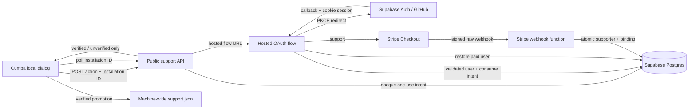

# Phase 02: Move the Implementation to Supabase - Research

**Researched:** 2026-08-14
**Domain:** Supabase Auth/Postgres/Edge Functions migration with GitHub OAuth and Stripe Checkout
**Confidence:** MEDIUM

<user_constraints>
## User Constraints (from CONTEXT.md)

### Locked Decisions

### Supabase footprint
- **D-01:** Supabase broadly owns the hosted implementation: Postgres, Auth, and Edge Functions. Stripe remains the payment and webhook provider.
- **D-02:** Remove the standalone Render deployment, Fastify support service, direct `pg` runtime, recovery-email infrastructure, and Resend integration after equivalent Supabase paths pass verification. Do not retain a fallback implementation or shared Fastify compatibility layer.
- **D-03:** Keep the published Cumpa package behind narrow hosted HTTPS capabilities. Support OAuth runs on a hosted Supabase surface; the ephemeral loopback browser does not receive or persist a Supabase auth session.
- **D-04:** Authentication is required only after a user chooses a support action. Launching and using every review feature remains anonymous and unrestricted.

### OAuth supporter identity
- **D-05:** GitHub is the only OAuth provider in this phase.
- **D-06:** A user who chooses to support Cumpa signs in with GitHub before Stripe Checkout. Server-controlled Stripe metadata binds the Checkout and verified webhook fulfillment to the authenticated Supabase user ID; do not match payment ownership by email.
- **D-07:** On another installation, Restore opens the same hosted GitHub OAuth flow. After authentication, the hosted service automatically binds a paid supporter to the requesting installation; the local dialog closes when status polling observes verification.
- **D-08:** OAuth fully replaces recovery email, magic links, recovery tokens, and Resend. There is no email fallback or operator-assisted claim flow in this phase.
- **D-09:** Preserve unlimited-installation restoration. Locally persist only installation identity and verified supporter status; do not persist GitHub profile data, payer email, or OAuth tokens in Cumpa state.

### Requirements cutover
- **D-10:** Phase 02 intentionally supersedes the email-magic-link mechanism in `REC-01` and the recovery-token mechanism in `REC-02`. Research and planning must revise those requirement details to GitHub OAuth while preserving privacy, non-enumeration of supporter status to unauthenticated callers, secure single-user account binding, and installation-bound restoration.
- **D-11:** `REC-03` remains unchanged: one verified supporter may restore status on unlimited installations without device management or transfer flows.
- **D-12:** All PAY and SUP behavior remains unchanged except the support action now authenticates before Checkout and the Restore action uses OAuth.

### Environment model
- **D-13:** Run only a Supabase-compatible Postgres database locally. Auth and Edge Function development/integration use a hosted non-production Supabase project rather than a complete local Supabase stack.
- **D-14:** Maintain exactly two hosted Supabase projects: development and production. Development owns non-production OAuth, Edge Function, and Stripe test-mode integration.
- **D-15:** Version database migrations and Edge Functions in Git. Merges to `main` automatically deploy the production Supabase changes through CI; do not require manual promotion or Supabase Git integration.

### Cutover and data
- **D-16:** Assume no production supporter records exist. Supabase is the first real hosted launch; do not build import, dual-write, or data-reconciliation machinery for Render/PostgreSQL.
- **D-17:** Supabase replaces the blocked Render provider checkpoint and becomes the only hosted acceptance target. Real Stripe test-mode, GitHub OAuth, webhook, automatic restore, package-safety, and status-polling evidence must pass against Supabase; do not deploy Render first or substitute local-only proof.
- **D-18:** Retain only the hosted data needed for authority and operations: Supabase user ID, Stripe event/customer/session/payment identifiers required for fulfillment proof and idempotency, verification timestamps, and bound installation IDs. Do not copy GitHub profile fields or payer email into supporter records.
- **D-19:** Make a clean API cutover. Update Cumpa and Supabase together; remove legacy email-recovery routes and schemas rather than providing temporary or permanent compatibility. Existing machine-local verified status remains valid across the package upgrade.

### the agent's Discretion
- Exact Supabase schema names, Edge Function boundaries, hosted support-page layout, OAuth callback mechanics, development-project deployment trigger, CI provider, and polling cadence, provided the locked platform, privacy, environment, and clean-cutover decisions above remain intact.

### Deferred Ideas (OUT OF SCOPE)

None — GitHub OAuth intentionally replaces the prior recovery mechanism within this migration phase; app-wide authentication and additional OAuth providers remain outside the phase boundary.
</user_constraints>

<phase_requirements>
## Phase Requirements

| ID | Description | Research Support |
|----|-------------|------------------|
| PAY-01 | The application offers exactly one optional, one-time support payment priced at USD $49.99 through Stripe-hosted Checkout. | Plans 02-03, 02-05, and 02-06 implement and prove authenticated server-created Checkout at the fixed price; Plan 02-11 approves it live. |
| PAY-02 | Paying does not unlock, restrict, or alter any application feature except automatic support-dialog visibility. | Plans 02-05 and 02-06 preserve anonymous unrestricted review; Plan 02-11 approves canonical production behavior. |
| PAY-03 | The application treats only server-side, signature-verified Stripe webhook fulfillment as proof of payment; a client redirect or local claim is insufficient. | Plans 02-01 through 02-04 establish the SDK, database, webhook, and local monotonic boundary; Plans 02-06, 02-08, 02-10, and 02-11 prove cutover and production. |
| PAY-04 | The local application and published package contain no Stripe secret key or webhook secret. | Plans 02-01, 02-06, 02-07, 02-09, 02-10, and 02-11 constrain dependencies, inspect the package, delete legacy surfaces, and approve production evidence. |
| SUP-01 | The application shows the support dialog on every launch until support status is verified for that installation. | Plan 02-05 preserves launch behavior; Plans 02-06 and 02-11 prove it in packed development and production applications. |
| SUP-02 | The dialog clearly describes the payment as optional support for application development and links to the fixed Stripe payment page. | Plans 02-03 and 02-05 retain fixed server-priced Checkout and dialog copy/action; Plans 02-06 and 02-11 prove the hosted journey. |
| SUP-03 | An unpaid user can dismiss the dialog and use the complete application without restriction. | Plan 02-05 preserves dismissal and unrestricted review; Plans 02-06 and 02-11 prove it hosted. |
| SUP-04 | After the hosted service verifies payment for the current installation, the open dialog closes automatically without requiring a relaunch or manual refresh. | Plan 02-05 implements polling-driven automatic close; Plans 02-06 and 02-11 prove webhook-to-polling behavior. |
| SUP-05 | Once support status is verified and persisted, that installation no longer shows the dialog on launch. | Plan 02-05 preserves the machine-wide state contract; Plans 02-06 and 02-11 prove restart suppression. |
| REC-01 | A supporter can restore support status on another installation by entering the email associated with the Stripe payment and completing an emailed magic link. Phase 2 mechanism superseded per D-10: support-scoped GitHub OAuth replaces email plus magic link. | Plans 02-01 through 02-06 implement and prove GitHub identity; Plans 02-07 through 02-09 remove the email mechanism; Plan 02-11 approves production restore. |
| REC-02 | Recovery responses do not disclose whether an email has paid, and recovery tokens are high-entropy, single-use, short-lived, and bound to the requesting installation. Phase 2 mechanism superseded per D-10: privacy-safe, one-use, expiring, installation-bound OAuth intent and authenticated user binding replace recovery responses and tokens while preserving non-enumeration. | Plans 02-01 through 02-06 implement the authority and local boundary; Plans 02-07 through 02-09 remove legacy recovery; Plan 02-11 proves hostile paths. |
| REC-03 | A paid email can restore support status on unlimited installations; no device-management or transfer flow is required. | Plans 02-02, 02-03, 02-05, and 02-06 implement repeated installation binding; Plans 02-10 and 02-11 carry it through production. |
</phase_requirements>

## Summary

Move the hosted authority, not the local-first product, to Supabase. Preserve the local installation ID and monotonic verified flag exactly; replace the Phase 1 hosted client surface with two operations: initiate a hosted `support` or `restore` flow, and poll an installation's public verified/unverified status. Existing code already centralizes those operations behind `src/server/support-client.ts`, `src/server/capabilities.ts`, and `src/server/support-store.ts`. [VERIFIED: `src/server/support-client.ts`, `src/server/capabilities.ts`, `src/server/support-store.ts`]

Use three narrow Edge Function trust boundaries: a public initiation/status API, a public OAuth redirect/callback flow, and a public Stripe webhook whose authenticity comes exclusively from Stripe signature verification. The hosted OAuth flow owns its Supabase session and never redirects tokens or authorization codes to Cumpa's loopback server. Supabase's server-side guidance requires a cookie-aware client and warns against trusting an unvalidated session; validate the callback user with `getClaims()` or `getUser()`. [CITED: https://supabase.com/docs/guides/auth/server-side/creating-a-client]

Create Stripe Checkout server-side only after GitHub authentication. Put the Supabase user ID and installation/intent identifier in server-controlled Checkout metadata, then make the signed webhook the sole fulfillment path. Stripe explicitly recommends webhook-based fulfillment, idempotence, and handling repeated/concurrent events. [CITED: https://docs.stripe.com/checkout/fulfillment.md?payment-ui=stripe-hosted]

**Primary recommendation:** Implement the authoritative database transaction and hosted development proof first, then cut the local client/UI contracts and delete the legacy service only after equivalent Supabase evidence passes.

## Project Constraints (from `.claude/CLAUDE.md`)

- Node.js 24 LTS and TypeScript remain the application baseline; do not introduce another application runtime into Cumpa. Edge Functions use their native Deno/TypeScript runtime only at the hosted boundary. [VERIFIED: `.claude/CLAUDE.md`]
- Ordinary Cumpa remains a loopback-only Fastify application bound to `127.0.0.1`; hosted support must not turn it into a LAN or hosted review service. [VERIFIED: `.claude/CLAUDE.md`]
- Shared local HTTP and persistence contracts remain Zod-validated and corrupt data fails explicitly. [VERIFIED: `.claude/CLAUDE.md`]
- Versioned JSON under the machine-wide support store remains the local supporter source; this phase does not add a browser database or local Supabase client session. [VERIFIED: `.claude/CLAUDE.md`, `src/server/support-store.ts`]
- Tests use Vitest for contracts/server logic and Playwright for the browser flow. [VERIFIED: `.claude/CLAUDE.md`]
- Support discovery must not increase CLI startup work or make the hosted service a startup dependency. [VERIFIED: `.kimi-code/skills/spike-findings-cumpa/references/cli-source-discovery.md`]

## Architectural Responsibility Map

| Capability | Primary Tier | Secondary Tier | Rationale |
|------------|--------------|----------------|-----------|
| Review experience | Browser / local server | Local filesystem/Git | Remains anonymous and local-first. |
| Installation identity/status | Local server | Machine-wide JSON | Existing local store owns persistence; hosted state only promotes it. |
| GitHub login/session | Supabase Auth / hosted flow | GitHub OAuth | The loopback app must never receive the Supabase session. |
| Flow intent | Supabase Postgres | Edge Function | Opaque, expiring, one-use state binds OAuth completion to action and installation. |
| Checkout creation | Edge Function | Stripe | Only authenticated server code may create metadata-bound Checkout. |
| Payment fulfillment | Stripe webhook Edge Function | Supabase Postgres | Signed events atomically create supporter and installation authority. |
| Public installation status | Edge Function | Supabase Postgres | Returns only a boolean-style state for a high-entropy installation identifier. |
| Production deployment | CI | Supabase CLI | Git is the migration/function source; `main` deploys production. |

## Recommended Architecture



### Function boundaries

1. **`support-api` (`verify_jwt = false`)** — `POST /start` validates `{action, installationId}`, stores only a token hash in an expiring one-use intent, and returns the hosted flow URL; `GET /status` returns only `verified` or `unverified`. It must not accept a user ID, email, or client-authored Stripe metadata.
2. **`support-flow` (`verify_jwt = false`)** — server-side redirect/callback endpoint. It creates a request-scoped, cookie-backed Supabase client, starts GitHub OAuth with PKCE, validates the callback's state/intent and authenticated user, consumes the intent once, then either creates Checkout or restores the installation. GitHub recommends `state`, exact callback matching, and S256 PKCE. [CITED: https://docs.github.com/en/apps/oauth-apps/building-oauth-apps/authorizing-oauth-apps]
3. **`stripe-webhook` (`verify_jwt = false`)** — reads the request body as text, verifies Stripe's signature, rejects irrelevant/unpaid/wrong-product sessions, and calls one transaction/RPC for idempotent settlement. Supabase's official Stripe example uses raw text and `constructEventAsync`; disabling Supabase JWT verification does not remove the Stripe signature boundary. [CITED: https://supabase.com/docs/guides/functions/examples/stripe-webhooks] [CITED: https://raw.githubusercontent.com/supabase/supabase/master/examples/edge-functions/supabase/functions/stripe-webhooks/index.ts]

A redirect-only hosted flow is preferable to a hosted SPA for this phase: it keeps the surface small and avoids shipping Supabase tokens to Cumpa. Supabase documents that Edge Function HTML serving needs a custom domain; otherwise `text/html` is rewritten to `text/plain`, so do not plan a rich Edge-hosted UI without explicitly provisioning a custom domain. [CITED: https://supabase.com/docs/guides/functions/limits]

## Postgres Authority Model

Recommended private/locked-down tables:

| Table | Minimum fields | Invariants |
|-------|----------------|------------|
| `support_intents` | token hash, installation ID, action, expiry, consumed timestamp | Token hash unique; action constrained; consume once; short expiry. |
| `checkout_sessions` | Stripe session ID, Supabase user ID, installation ID, intent ID, created/fulfilled timestamps | Session unique; row created before redirect; authenticated user is server-derived. |
| `supporters` | Supabase user ID, source Stripe session/customer/payment identifiers actually needed, verified timestamp | One authoritative supporter per `auth.users.id`; no GitHub profile or email. |
| `installation_bindings` | installation ID, Supabase user ID, verified timestamp, source session or restore marker | Installation ID unique; repeat restore by a paid user is idempotent. |
| `stripe_events` | Stripe event ID, type, object ID, processed timestamp | Event ID unique; duplicate delivery is a success/no-op. |

Reference Supabase users by the `auth.users` primary key only; Supabase recommends public application tables reference `auth.users` rather than relying on other Auth schema objects. [CITED: https://supabase.com/docs/guides/auth/managing-user-data]

Enable RLS on every table in an exposed schema and create no `anon` or `authenticated` data policies for these authority tables. Supabase notes that exposed tables require RLS, while privileged server keys bypass RLS and must never be exposed in browsers. [CITED: https://supabase.com/docs/guides/database/postgres/row-level-security] Keep mutations behind narrowly granted `security definer` functions with an empty/fixed `search_path`; revoke execution from `public`, `anon`, and `authenticated`, and grant only the server role. Unique constraints—not preflight reads—enforce idempotency.

### Atomic transitions

- **Checkout creation:** consume a valid support intent for the authenticated user, create a pending checkout record, then create Stripe Checkout. A Stripe API failure leaves a retryable/expired pending record rather than verified authority.
- **Webhook fulfillment:** lock/insert the event ID, validate the already-recorded Checkout/user/installation binding, upsert supporter authority, bind the installation, mark the session fulfilled, and commit together.
- **Restore:** consume a restore intent, verify `supporters.user_id = authenticated user`, and upsert the requesting installation in one transaction. Return the same generic completion page whether already bound or newly bound.

## GitHub OAuth and Session Boundary

Use one GitHub OAuth App per hosted Supabase project because development and production have distinct callback URLs; Supabase's GitHub provider setup uses the project's `/auth/v1/callback` URL. [CITED: https://supabase.com/docs/guides/auth/social-login/auth-github] Configure only GitHub, disable email/magic-link and other providers, request no repository scopes, and never store the GitHub access token or profile fields.

Use PKCE, an HTTP-only secure SameSite cookie for the code verifier/session, and a separate opaque intent/state value that binds the action and installation. Supabase documents that the PKCE authorization code is single-use, expires after five minutes, and must be exchanged by the same browser context holding the verifier. [CITED: https://supabase.com/docs/guides/auth/sessions/pkce-flow] Exact production redirect URLs should be allowlisted rather than broad wildcards. [CITED: https://supabase.com/docs/guides/auth/redirect-urls]

The callback must derive the Supabase user from the validated session and ignore user IDs in query/body data. The local loopback receives only a hosted flow URL and later observes installation status; it never receives an OAuth code, access token, refresh token, cookie, GitHub identity, or email.

## Stripe Checkout and Webhook Contract

Create a Checkout Session after authentication with:

- `mode: "payment"` and exactly one server-selected USD $49.99 price/line item;
- `client_reference_id` set to a non-secret server-controlled reference (prefer the Supabase user ID or internal checkout row ID);
- server-only metadata containing the Supabase user ID, installation ID, and internal checkout/intent ID;
- hosted success/cancel URLs that do not grant authority;
- no email-based ownership or client-supplied product/amount metadata.

Stripe's Checkout API provides `client_reference_id` for reconciling a session with an internal system and supports server-authored metadata. [CITED: https://docs.stripe.com/api/checkout/sessions/create]

The webhook must read the unmodified body, verify the signing secret, and respond quickly. Stripe documents raw-body signature verification and automatic retries. [CITED: https://docs.stripe.com/webhooks] At minimum accept `checkout.session.completed`; if delayed payment methods are enabled, also handle `checkout.session.async_payment_succeeded` and do not fulfill an unpaid session. Retrieve/expand authoritative line items when needed and re-check mode, currency, amount/price, quantity, payment status, and recorded metadata before settlement. Browser redirects never set verified state.

## Standard Stack

### Core

| Library/tool | Verified version | Purpose | Provenance |
|--------------|------------------|---------|------------|
| Supabase CLI | 2.114.0 | Database-only local start, migrations, config, secrets, function deployment | Registry checked 2026-08-14; official CLI docs. [CITED: https://supabase.com/docs/reference/cli/usage] |
| `@supabase/supabase-js` | 2.112.3 | Auth/session and server API client in Edge Functions | Registry checked 2026-08-14; official examples use the client. [CITED: https://supabase.com/docs/guides/auth/server-side/creating-a-client] |
| `@supabase/ssr` | 0.12.4 | Cookie adapter for hosted server-side OAuth | Registry checked 2026-08-14; official server-side Auth guide. [CITED: https://supabase.com/docs/guides/auth/server-side/creating-a-client] |
| `stripe` | 22.5.0 | Checkout creation and WebCrypto-compatible webhook verification | Already pinned by the Phase 1 service; official Supabase example uses the Stripe npm package. [VERIFIED: `services/support/package.json`] [CITED: https://supabase.com/docs/guides/functions/examples/stripe-webhooks] |
| PostgreSQL migrations | Supabase-managed | Schema, constraints, transactional authority | Supabase CLI supports timestamped migrations and remote push. [CITED: https://supabase.com/docs/guides/deployment/database-migrations] |

Do not add Supabase packages to the published Cumpa runtime unless the narrow local client truly needs them; plain HTTPS remains sufficient locally. Import server-only packages only from Edge Function code.

**Registry checks:** `npm view` on 2026-08-14 returned the versions above; none reported a `postinstall` script. [VERIFIED: npm registry]

## Package Legitimacy Audit

The GSD legitimacy seam flagged every candidate `SUS` solely as “too-new,” despite official Supabase/Stripe documentation and established source repositories. The planner must insert a human verification checkpoint before installation, per workflow policy.

| Package | Registry | Weekly downloads checked | Source | Verdict | Disposition |
|---------|----------|--------------------------|--------|---------|-------------|
| `supabase` | npm | 3,341,382 | official Supabase CLI docs/repository | SUS: too-new | Flagged—human verify before pinning |
| `@supabase/supabase-js` | npm | 25,021,069 | official Supabase Auth docs/repository | SUS: too-new | Flagged—human verify before pinning |
| `@supabase/ssr` | npm | 6,759,812 | official Supabase server-side Auth docs/repository | SUS: too-new | Flagged—human verify before pinning |
| `stripe` | npm | 17,546,670 | official Stripe docs/repository | SUS: too-new | Already used; human verify before changing/pinning |

**Packages removed due to SLOP verdict:** none.  
**Packages flagged as suspicious:** all four above because the automated age heuristic returned `SUS`; authoritative provenance reduces supply-chain uncertainty but does not waive the required checkpoint.

## Local and Hosted Environment Separation

| Concern | Local workstation | Hosted development | Production |
|---------|-------------------|--------------------|------------|
| Postgres | `supabase db start` only; apply migrations to its DB URL | Supabase development DB | Supabase production DB |
| Auth | None locally | Development Supabase Auth + development GitHub OAuth App | Production Supabase Auth + production GitHub OAuth App |
| Edge Functions | Pure logic may run in Deno tests, but integration targets hosted dev | Deployed development functions | CI-deployed production functions |
| Stripe | No authoritative local integration | Test-mode Checkout/webhook/secrets | Live-mode Checkout/webhook/secrets |
| Cumpa hosted URL | Development capability URL during verification | Development function/domain | Production capability URL in release configuration |

The CLI documents `supabase db start` as starting the local Postgres database without the full local stack; use that command to honor D-13. [CITED: https://supabase.com/docs/reference/cli/usage] `supabase migration up --db-url ...` can exercise migrations against the database-only instance. [CITED: https://supabase.com/docs/reference/cli/usage]

### Secret/config ownership

- **CI:** `SUPABASE_ACCESS_TOKEN`, production project ref, and production database credential or supported link token. Supabase documents `SUPABASE_ACCESS_TOKEN` for CLI CI use. [CITED: https://supabase.com/docs/reference/cli/usage]
- **Supabase project secrets:** Stripe secret key and webhook signing secret; provider OAuth client secret belongs in Auth provider configuration. Edge Functions receive Supabase project variables automatically, but privileged service credentials remain server-only. [CITED: https://supabase.com/docs/guides/functions/secrets]
- **Published Cumpa package:** only the public hosted support capability URL; no Supabase privileged key, GitHub client secret, Stripe secret, webhook secret, or project management token.
- **GitHub repository environments:** keep development and production secrets distinct; production deployment runs only from protected `main` workflow context.

## Migration and Clean-Cutover Order

1. **Provision and record provider prerequisites:** exactly two Supabase projects, two GitHub OAuth Apps, development Stripe test-mode webhook, production secret slots, exact callback/redirect URLs, and ownership/runbook details.
2. **Add the Supabase substrate in Git:** `supabase/config.toml`, timestamped migrations, shared pure validation/fulfillment modules, and the three functions. Do not change Cumpa's public client yet.
3. **Prove the database authority locally:** run database-only Postgres, apply migrations from zero, exercise constraints/RPCs/idempotency, and reset/reapply. Supabase recommends versioning schema changes as migration files and pushing them through the CLI rather than making remote dashboard-only changes. [CITED: https://supabase.com/docs/guides/deployment/database-migrations]
4. **Deploy to hosted development:** push migrations/config/secrets/functions, configure GitHub, create Stripe test Checkout, deliver signed webhooks, and verify support plus restore across two fresh installation IDs.
5. **Cut the local contract:** replace email recovery methods/schemas/routes/UI states with `start(action, installationId)` plus status polling. Preserve existing verified local JSON without migration.
6. **Run the full D-17 acceptance evidence against hosted development:** OAuth, Checkout, webhook, restore, cancellation/delay, idempotency, status polling, and packed artifact safety.
7. **Delete legacy implementation completely:** `services/support`, `render.yaml`, direct `pg`, Resend/email code, recovery routes/schemas/tests, Render docs/scripts/environment names, and obsolete Payment Link configuration. No fallback or alias remains.
8. **Install production CI before release:** on merges to `main`, apply production migrations first, push versioned Auth/function config as supported, deploy functions, and fail closed on any step. Use an explicit/pinned Supabase CLI version; Supabase documents CLI deployment from GitHub Actions. [CITED: https://supabase.com/docs/guides/functions/deploy]
9. **Production smoke proof and retirement:** exercise a controlled production path, verify logs/database state, then remove Render/Resend/provider resources. D-16 means no data migration or reconciliation task exists.

## Existing-Code Impact Map

| Existing area | Required action | Evidence |
|---------------|-----------------|----------|
| `src/server/support-store.ts` | Keep schema and behavior unchanged so previously verified local state survives. | Store contains installation ID plus verified state/timestamp only. [VERIFIED: `src/server/support-store.ts`] |
| `src/server/support-client.ts` | Replace synchronous Checkout URL and email recovery methods with async hosted-flow initiation and status. Keep HTTPS, timeout, and response bounds. | Current client owns Checkout/status/recovery transport. [VERIFIED: `src/server/support-client.ts`] |
| `src/server/capabilities.ts` | Preserve monotonic local promotion; replace recovery challenge orchestration with hosted action URL. | Current refresh never demotes verified local state. [VERIFIED: `src/server/capabilities.ts`] |
| `src/contracts/api.ts` | Delete email/challenge/token schemas; add action/start response schemas; keep installation status. | Current contracts encode Phase 1 email recovery. [VERIFIED: `src/contracts/api.ts`] |
| `src/server/routes.ts`, `src/web/api/client.ts` | Cleanly replace recovery endpoints/client calls; no deprecated aliases. | Both expose current recovery request/status. [VERIFIED: `src/server/routes.ts`, `src/web/api/client.ts`] |
| `src/web/App.vue` | Support and Restore both open hosted flow; reuse waiting/polling/visibility refresh and verified thank-you. | Existing cadence is 2/3/5/8/10 seconds then 15 seconds, with visibility refresh. [VERIFIED: `src/web/App.vue`] |
| `src/web/components/SupportDialog.vue` | Remove email/recovery-pending states; preserve dismissal, focus, inert background, waiting, and thank-you. | Current component already owns these states/accessibility behavior. [VERIFIED: `src/web/components/SupportDialog.vue`] |
| `services/support/**`, `render.yaml` | Delete after Supabase development proof; translate strong fulfillment tests before deletion. | These contain Fastify/pg/Resend/Render authority. [VERIFIED: `services/support`, `render.yaml`] |
| `docs/support-service-operations.md` | Replace Render/Resend runbook with dev/prod Supabase provisioning, deployment, rollback, secret rotation, evidence, and backup guidance. | Current document is provider-specific. [VERIFIED: `docs/support-service-operations.md`] |
| package safety tests | Extend deny-list and packed-artifact assertions to Supabase/GitHub/Stripe privileged identifiers. | Existing safety test excludes Phase 1 service/secrets. [VERIFIED: project package tests] |

## Runtime State Inventory

| Category | Items Found | Action Required |
|----------|-------------|-----------------|
| Stored data | Existing machine-local `support.json` may contain verified status; D-16 says no production hosted supporter rows exist. | Preserve local schema; no hosted import, dual write, or reconciliation. |
| Live service config | Supabase dev/prod Auth settings, redirect allowlists, GitHub OAuth Apps, Stripe endpoints/secrets, and legacy Render/Resend resources live outside Git. | Provision/verify both projects; document identifiers; retire legacy resources only after proof. |
| OS-registered state | None identified: support is package/local-file based and no launchd/system service is part of this feature. [VERIFIED: repository search] | None. |
| Secrets/env vars | Existing Render/Resend/Postgres/Payment Link variables become obsolete; Supabase/Stripe/GitHub/CI secrets are new. | Rotate/remove old variables and add environment-scoped new secrets; never copy secrets into package assets. |
| Build artifacts/installed packages | Packed npm assets and previously built service artifacts may retain old routes/names. | Rebuild/package after deletion and inspect tar contents; deployed legacy service is separately retired. |

## Security Domain

### Applicable ASVS Categories

| ASVS category | Applies | Standard control |
|---------------|---------|------------------|
| V2 Authentication | Yes | Supabase GitHub OAuth, PKCE, validated user lookup, exact redirects. |
| V3 Session Management | Yes | Secure HTTP-only SameSite cookies, request-scoped server client, short flow lifetime; no loopback token. |
| V4 Access Control | Yes | Server-derived user ID, RLS on exposed tables, privileged RPC/function mutations only. |
| V5 Validation | Yes | Zod/explicit Edge validators, database constraints, allowlisted actions, exact 43-character base64url installation IDs. |
| V6 Cryptography | Yes | Supabase/Auth PKCE, Stripe SDK signature verification, cryptographic random opaque intent tokens; never custom crypto. |
| V8 Data Protection | Yes | Minimal identifiers, no profile/email/token storage, secrets restricted to Supabase/CI. |
| V9 Communications | Yes | HTTPS-only local hosted client; secure cookies; exact hosted origins. |
| V10 Malicious Code | Yes | Package legitimacy checkpoint, lockfile/pins, packed artifact inspection. |
| V12 Files/Resources | Yes | Bounded response bodies and existing timeouts; no hosted content is executed locally. |
| V13 API/Web Services | Yes | Generic errors, method/content-type limits, non-enumerating public status. |

### Threat patterns

| Pattern | STRIDE | Required mitigation |
|---------|--------|---------------------|
| Forged OAuth callback/CSRF | Spoofing | PKCE + state + one-use hashed intent + exact redirect allowlist. |
| User/installation substitution | Tampering | Derive user server-side; validate installation ID; bind action/install in intent and Checkout row. |
| Forged/replayed Stripe event | Spoofing/Replay | Raw-body signature, unique event/session constraints, atomic idempotent transaction. |
| Browser-success fulfillment | Elevation | Only webhook settlement writes verified authority. |
| Supporter enumeration | Information disclosure | No email/user lookup API; status reveals only one high-entropy installation's boolean state; generic restore completion. |
| Secret leakage in package/logs | Information disclosure | Server secrets only, structured redacted logs, `npm pack` inspection. |
| Privileged table access | Elevation | RLS, no client policies, revoke RPCs from public roles, server role only. |
| Function abuse | Denial of service | Supabase/Auth rate limits plus application throttling/expiry/bounded bodies; monitor failures. Supabase exposes configurable Auth rate limits. [CITED: https://supabase.com/docs/guides/auth/rate-limits] |

## Don't Hand-Roll

| Problem | Don't build | Use instead | Why |
|---------|-------------|-------------|-----|
| OAuth protocol/session validation | Custom OAuth client or token parser | Supabase Auth + `supabase-js`/`@supabase/ssr` | PKCE, cookie rotation, callback validation, provider integration. |
| Webhook signatures | HMAC parsing/comparison | Stripe SDK `constructEventAsync` | Canonical raw-body verification and algorithm handling. |
| Payment authority | Browser success callbacks | Signed Stripe webhook + DB transaction | Redirects are replayable and not authoritative. |
| Idempotency | Read-then-insert checks | PostgreSQL unique constraints and transaction/RPC | Handles retries and concurrency. |
| Migration deployment | Dashboard edits/custom runner | Supabase CLI migration files | Reproducible local/dev/prod schema history. |
| Local auth proxy | Loopback callback/session storage | Hosted OAuth flow and status polling | Directly violates D-03 and increases secret/token exposure. |
| Email identity matching | Stripe/GitHub email comparison | Supabase user ID in server-controlled metadata | Emails change, differ across providers, and violate D-06/D-18. |

## Common Pitfalls

1. **Using static Payment Links:** they cannot satisfy authenticated, server-controlled user/install binding. Create Checkout Sessions after OAuth.
2. **Exposing a privileged Supabase key:** no service-role/secret key belongs in Cumpa or a browser bundle; secret keys bypass RLS. [CITED: https://supabase.com/docs/guides/database/postgres/row-level-security]
3. **Treating `verify_jwt = false` as no security design:** it is necessary for OAuth entry/webhooks, but each handler needs its own proof—state/session for OAuth, Stripe signature for webhook, high-entropy capability for status.
4. **Parsing webhook JSON before signature verification:** Stripe requires the raw body. [CITED: https://docs.stripe.com/webhooks]
5. **Returning HTML from a default Edge Function domain:** Supabase may rewrite `text/html` without a custom domain. Use redirects/minimal plain completion unless a domain is explicitly provisioned. [CITED: https://supabase.com/docs/guides/functions/limits]
6. **Creating remote schema/config only in dashboards:** drift makes dev/prod unreproducible. Capture migrations/config in Git and deploy in CI. [CITED: https://supabase.com/docs/guides/deployment/database-migrations]
7. **Demoting a locally verified installation on network failure/unverified response:** preserve Phase 1 monotonic local state.
8. **Keeping compatibility aliases “temporarily”:** D-19 requires deleting recovery routes/schemas and D-02 forbids the Fastify fallback.
9. **Assuming hosted mocks prove OAuth/webhooks:** D-17 requires actual hosted development GitHub OAuth, Stripe test Checkout, signed delivery, automatic restore, and polling evidence.
10. **Deploying functions before migrations:** new code may address absent tables/RPCs. Production CI applies migrations first and stops on failure.

## Code Examples

### Database-only local migration

```bash
# Supabase CLI reference documents database-only startup and URL-targeted migration.
supabase db start
supabase migration up --db-url "$LOCAL_SUPABASE_DB_URL"
```

Source: [CITED: https://supabase.com/docs/reference/cli/usage]

### Raw Stripe webhook verification

```ts
const signature = req.headers.get("stripe-signature")
if (!signature) return new Response("Missing signature", { status: 400 })

const event = await stripe.webhooks.constructEventAsync(
  await req.text(),
  signature,
  Deno.env.get("STRIPE_WEBHOOK_SIGNING_SECRET")!,
  undefined,
  Stripe.createSubtleCryptoProvider(),
)
```

Source pattern: [CITED: https://raw.githubusercontent.com/supabase/supabase/master/examples/edge-functions/supabase/functions/stripe-webhooks/index.ts]

### Hardened authority RPC outline

```sql
create or replace function private.restore_installation(
  p_user_id uuid,
  p_installation_id text
) returns boolean
language plpgsql
security definer
set search_path = ''
as $$
begin
  if not exists (
    select 1 from public.supporters s
    where s.user_id = p_user_id
  ) then
    return false;
  end if;

  insert into public.installation_bindings (installation_id, user_id, verified_at)
  values (p_installation_id, p_user_id, now())
  on conflict (installation_id) do update
    set user_id = excluded.user_id,
        verified_at = excluded.verified_at;
  return true;
end;
$$;

revoke all on function private.restore_installation(uuid, text) from public, anon, authenticated;
grant execute on function private.restore_installation(uuid, text) to service_role;
```

This is a recommended project pattern, not copied from official docs; the planner must adapt schema names and prevent rebinding an installation already owned by a different account unless product policy explicitly permits it.

### Narrow local capability

```ts
type SupportAction = "support" | "restore"

interface HostedSupportClient {
  start(action: SupportAction, installationId: string): Promise<{ flowUrl: string }>
  status(installationId: string): Promise<"unverified" | "verified">
}
```

Keep transport async, bounded, HTTPS-only, and free of Supabase session semantics.

## Test Strategy

`workflow.nyquist_validation` is explicitly `false`, so no formal Validation Architecture/Wave 0 section is required. Nevertheless, D-17 makes hosted acceptance evidence a phase deliverable.

### Automated layers

- **Pure Edge logic:** Deno tests for input validation, Stripe event classification, metadata/product checks, generic errors, and response shaping; do not mock away signature verification in its dedicated test.
- **Database-only integration:** apply migrations from empty state; test intent expiry/one-use behavior, duplicate and concurrent event settlement, restore for paid/unpaid users, binding constraints, RLS denial for public roles, and migration replay/reset.
- **Cumpa Vitest:** update API Zod schemas, hosted client HTTPS/time/size/error behavior, monotonic local promotion, existing verified store compatibility, and deleted recovery endpoints.
- **Browser integration/Playwright:** Support/Restore open hosted URLs in a new tab; workspace remains usable; waiting is dismissible; cancellation/delay does not show failure; visibility/polling eventually displays verified thank-you; no app feature gates on auth/payment.
- **Package safety:** inspect `npm pack --json` plus the tar contents/client assets for legacy service files and Supabase/GitHub/Stripe privileged secret names/values.

### Mandatory hosted-development evidence

1. Fresh installation chooses Support and is sent to GitHub before Stripe.
2. OAuth callback resolves one Supabase user and creates Checkout with server-controlled user/install metadata.
3. Signed Stripe test webhook creates supporter authority and one installation binding.
4. Local polling promotes the machine-wide store and suppresses future prompt/status indicates verified.
5. A second fresh installation chooses Restore, authenticates the same GitHub account, and becomes verified without email or device management.
6. A non-supporter authenticating for Restore gets a generic non-enumerating result and remains unverified.
7. Replayed/concurrent webhook delivery is a successful no-op with one authority result.
8. Wrong signature, amount/currency/product, user metadata, expired intent, and reused intent fail closed.
9. Cancelled/delayed Checkout never shows false failure or grants verification.
10. Packed Cumpa contains no hosted secrets, service implementation, OAuth tokens, or privileged Supabase credentials.

## CI and Operations

Recommended production workflow on `main`:

1. check out the exact commit and install a pinned Supabase CLI;
2. authenticate/link non-interactively using protected production secrets;
3. apply production migrations;
4. push versioned project config if the chosen Auth settings are supported by CLI config;
5. deploy all Edge Functions with per-function JWT verification declared in `supabase/config.toml`;
6. run a non-mutating health/schema check and record deployed commit/function versions.

Use a separate manual or protected workflow to deploy hosted development; do not let feature branches write production. Supabase documents `supabase functions deploy` and GitHub Actions setup. [CITED: https://supabase.com/docs/guides/functions/deploy]

Operational documentation must cover secret rotation, Stripe webhook endpoint rotation, GitHub App callback changes, migration failure/forward-fix procedure, log correlation by intent/session/event ID, provider outage behavior, and deletion/retention. Supabase provides Edge Function logs in the dashboard/CLI, subject to platform retention/limits. [CITED: https://supabase.com/docs/guides/functions/logging] Supabase backup coverage varies by plan; daily backups and PITR availability must be confirmed for the selected production plan rather than assumed. [CITED: https://supabase.com/docs/guides/platform/backups]

## Environment Availability

| Dependency | Required by | Available | Version | Fallback |
|------------|-------------|-----------|---------|----------|
| Node.js | Cumpa/tests/scripts | Yes | 24.15.0 | — |
| npm | dependency/package checks | Yes | 11.12.1 | — |
| Deno | Edge pure tests | Yes | 2.7.14 | Hosted dev function invocation |
| Docker CLI | local Supabase Postgres container | Yes | 29.4.0 | Existing external compatible Postgres URL |
| PostgreSQL client | local DB verification | Yes | 18.3 | Supabase CLI DB commands |
| Supabase CLI | migrations/deployment | No | — | Pin/install project-local CLI after human legitimacy checkpoint |
| Supabase dev/prod projects | hosted Auth/Functions/DB | Not observable | — | None; provisioning is required |
| GitHub OAuth Apps | OAuth | Not observable | — | None; two apps are required |
| Stripe test/live configuration | payment/webhook | Not observable | — | Test mode for development; production is blocked without live configuration |

**Missing dependency with no fallback:** hosted development/prod projects and their provider configurations must be provisioned before real acceptance.  
**Missing dependency with fallback:** the CLI is absent globally; install the pinned approved CLI in the project/CI rather than relying on a workstation global.

## State of the Art

| Old Phase 1 approach | Phase 2 approach | Impact |
|----------------------|------------------|--------|
| Render Fastify + direct `pg` | Supabase Edge Functions + Postgres | Remove separate hosted Node service and provider deployment. |
| Resend magic-link recovery | Hosted GitHub OAuth | Account-bound recovery without stored payer/profile email. |
| Static Payment Link-oriented configuration | Authenticated server-created Checkout Session | Server controls user/install ownership metadata. |
| Recovery challenge/token polling | Hosted flow initiation + installation status polling | Smaller local API; OAuth session remains hosted. |
| Manual Render deployment/provider proof | Git-versioned migrations/functions and production CI | Reproducible clean cutover; Supabase is sole acceptance target. |

## Assumptions Log

| # | Claim | Section | Risk if wrong |
|---|-------|---------|---------------|
| A1 | `@supabase/ssr` 0.12.4 works in the chosen Edge Function cookie adapter without runtime incompatibility. [ASSUMED] | Standard Stack/OAuth | Hosted callback implementation changes; prove in dev before locking. |
| A2 | Production Stripe live-mode account/product activation is available. [ASSUMED] | Environment | Production launch is blocked; test-mode development remains possible. |
| A3 | The database-only local image exposes enough Auth schema structure for the chosen FK migration. [ASSUMED] | Local environment | Local migration setup needs an explicit auth schema fixture or adjusted FK verification. |

## Open Questions (RESOLVED)

1. **Production Stripe activation and Price representation — owned by Plan 02-11 live-production checkpoint**
   - Resolution: production launch remains blocked until the Plan 02-11 checkpoint records an active live Stripe account, one live one-time USD $49.99 Price, and the production webhook endpoint. Development uses a separate test Price. Both identifiers remain server-only configuration; the client never selects price or amount.
2. **Auth provider settings as code — owned by Plan 02-06 policy plus Plans 02-10/02-11 evidence**
   - Resolution: version every Supabase Auth non-secret setting supported by the pinned CLI/config. The Supabase-only operations runbook names each unavoidable GitHub provider/dashboard setting and expected value; Plans 02-10 and 02-11 require redacted development/production dashboard-drift evidence tied to the deployed commit. Dashboard configuration is evidence-backed, not an alternative deployment path.
3. **Retention of Stripe operational identifiers — owned by Plan 02-06 runbook policy**
   - Resolution: retain only the event/customer/session/payment identifiers required by D-18 for idempotent fulfillment proof and incident correlation. The runbook must define deletion/review policy before production without inventing a compliance duration; no payer email, GitHub profile, OAuth token, or additional analytics identifier is retained.

## Multi-Source Coverage Audit

| Source | ID | Feature / requirement | Owning plans | Status |
|---|---|---|---|---|
| GOAL | — | Supabase-only hosted authority with fixed webhook-authoritative support, machine-wide suppression, GitHub OAuth restore, and verified production cutover | 02-02–02-11 | COVERED |
| REQ | PAY-01 | One optional one-time USD $49.99 Stripe-hosted Checkout | 02-03, 02-05, 02-06, 02-11 | COVERED |
| REQ | PAY-02 | Payment changes no feature except dialog visibility | 02-05, 02-06, 02-11 | COVERED |
| REQ | PAY-03 | Only signature-verified server webhook fulfillment proves payment | 02-01–02-04, 02-06, 02-08, 02-10, 02-11 | COVERED |
| REQ | PAY-04 | Local app/package contain no Stripe secret or webhook secret | 02-01, 02-06, 02-07, 02-09–02-11 | COVERED |
| REQ | SUP-01 | Dialog appears on launch until installation verification | 02-05, 02-06, 02-11 | COVERED |
| REQ | SUP-02 | Dialog states optional development support and links fixed Stripe payment | 02-03, 02-05, 02-06, 02-11 | COVERED |
| REQ | SUP-03 | Unpaid dismissal leaves every application feature unrestricted | 02-05, 02-06, 02-11 | COVERED |
| REQ | SUP-04 | Hosted verification automatically closes open dialog | 02-05, 02-06, 02-11 | COVERED |
| REQ | SUP-05 | Persisted verification suppresses later launch dialogs | 02-05, 02-06, 02-11 | COVERED |
| REQ | REC-01 | D-10-superseded GitHub OAuth restoration mechanism | 02-01, 02-03, 02-05–02-11 | COVERED |
| REQ | REC-02 | D-10-superseded private one-use installation-bound OAuth intent | 02-01–02-11 | COVERED |
| REQ | REC-03 | Unlimited verified installations without device management | 02-02, 02-03, 02-05, 02-06, 02-10, 02-11 | COVERED |
| RESEARCH | — | Exact package provenance blocking gate | 02-01 | COVERED |
| RESEARCH | — | Database-only local start plus RED, two clean applies, SQL/RLS/grant evidence | 02-02 | COVERED |
| RESEARCH | — | Hosted GitHub session, server-priced Checkout, raw signed webhook, service-role RPC boundary | 02-03 | COVERED |
| RESEARCH | — | Narrow HTTPS local transport and monotonic machine-wide authority | 02-04 | COVERED |
| RESEARCH | — | Complete accessible browser caller cutover without hosted startup dependency | 02-05 | COVERED |
| RESEARCH | — | Real development OAuth/Stripe/restore/E2E/package acceptance | 02-06 | COVERED |
| RESEARCH | — | Exact clean-cutover deletion slices with no fallback/import/dual-write | 02-07–02-09 | COVERED |
| RESEARCH | — | Schema-first main CI, Auth drift evidence, and identifier-retention policy | 02-10 | COVERED |
| RESEARCH | — | Live Price/account/provider availability and actual production approval | 02-11 | COVERED |
| CONTEXT | D-01 | Supabase owns Postgres/Auth/Functions; Stripe remains provider | 02-01–02-03, 02-10, 02-11 | COVERED |
| CONTEXT | D-02 | Remove standalone hosted stack only after equivalence | 02-06–02-11 | COVERED |
| CONTEXT | D-03 | Narrow HTTPS capability; no loopback Supabase session | 02-01, 02-03–02-06, 02-11 | COVERED |
| CONTEXT | D-04 | Authentication only after Support/Restore action | 02-03–02-06, 02-11 | COVERED |
| CONTEXT | D-05 | GitHub is the only OAuth provider | 02-03, 02-05, 02-06, 02-10, 02-11 | COVERED |
| CONTEXT | D-06 | Authenticate before Checkout; user-ID metadata ownership | 02-02, 02-03, 02-06, 02-11 | COVERED |
| CONTEXT | D-07 | Restore automatically binds paid account to installation | 02-02, 02-03, 02-05, 02-06, 02-11 | COVERED |
| CONTEXT | D-08 | OAuth fully replaces email/magic-link/token recovery | 02-02–02-11 | COVERED |
| CONTEXT | D-09 | Persist only installation identity and verified state locally | 02-02–02-06, 02-11 | COVERED |
| CONTEXT | D-10 | Supersede only REC-01/REC-02 mechanisms with private installation-bound OAuth | 02-01–02-06, 02-11 | COVERED |
| CONTEXT | D-11 | REC-03 unlimited installations unchanged | 02-02, 02-03, 02-05, 02-06, 02-11 | COVERED |
| CONTEXT | D-12 | PAY/SUP unchanged except auth/restore handoff | 02-03, 02-05, 02-06, 02-11 | COVERED |
| CONTEXT | D-13 | Locally run database-only Supabase-compatible Postgres | 02-02 | COVERED |
| CONTEXT | D-14 | Exactly development and production hosted projects | 02-06, 02-10, 02-11 | COVERED |
| CONTEXT | D-15 | Version migrations/functions; main CI deploys production | 02-02, 02-03, 02-10, 02-11 | COVERED |
| CONTEXT | D-16 | No data import, dual write, or reconciliation | 02-02, 02-07–02-09, 02-11 | COVERED |
| CONTEXT | D-17 | Supabase is the sole real hosted acceptance target | 02-06, 02-11 | COVERED |
| CONTEXT | D-18 | Retain only authority/operational identifiers | 02-02, 02-03, 02-06, 02-10, 02-11 | COVERED |
| CONTEXT | D-19 | Clean API cutover; existing verified local state remains valid | 02-02, 02-04–02-09, 02-11 | COVERED |

## Sources

### Primary official sources

- [Supabase database migrations](https://supabase.com/docs/guides/deployment/database-migrations) — migration creation/push and avoiding dashboard-only drift.
- [Supabase CLI reference](https://supabase.com/docs/reference/cli/usage) — database-only start, migration targeting, config and CI authentication.
- [Deploying Edge Functions](https://supabase.com/docs/guides/functions/deploy) — CLI and GitHub Actions deployment.
- [Edge Function secrets](https://supabase.com/docs/guides/functions/secrets) — hosted secret/default environment behavior.
- [Edge Function Auth](https://supabase.com/docs/guides/functions/auth) — current authorization patterns and per-function decisions.
- [GitHub social login](https://supabase.com/docs/guides/auth/social-login/auth-github) — provider and callback setup.
- [Server-side Auth client](https://supabase.com/docs/guides/auth/server-side/creating-a-client) — cookie adapter and validated-user guidance.
- [PKCE flow](https://supabase.com/docs/guides/auth/sessions/pkce-flow) — verifier/code constraints.
- [Redirect URLs](https://supabase.com/docs/guides/auth/redirect-urls) — exact production redirects.
- [Managing user data](https://supabase.com/docs/guides/auth/managing-user-data) — referencing `auth.users`.
- [Row Level Security](https://supabase.com/docs/guides/database/postgres/row-level-security) — exposed-table and privileged-key boundaries.
- [Function limits](https://supabase.com/docs/guides/functions/limits) — runtime and HTML/custom-domain constraint.
- [Function logging](https://supabase.com/docs/guides/functions/logging) — operational observation.
- [Backups](https://supabase.com/docs/guides/platform/backups) — plan-dependent backup/PITR behavior.
- [Supabase Stripe webhook example](https://supabase.com/docs/guides/functions/examples/stripe-webhooks) — Edge signature pattern.
- [Stripe Checkout fulfillment](https://docs.stripe.com/checkout/fulfillment.md?payment-ui=stripe-hosted) — webhook authority/idempotency.
- [Stripe webhooks](https://docs.stripe.com/webhooks) — raw-body signatures and retries.
- [Stripe Checkout Sessions create](https://docs.stripe.com/api/checkout/sessions/create) — metadata/client reference.
- [GitHub OAuth authorization](https://docs.github.com/en/apps/oauth-apps/building-oauth-apps/authorizing-oauth-apps) — state, S256 PKCE, callbacks/scopes.

### Internal sources

- `.planning/phases/02-move-the-implementation-to-supabase/02-CONTEXT.md` — locked boundary and decisions.
- `.planning/REQUIREMENTS.md` — PAY/SUP/REC contracts.
- `.planning/phases/01-add-voluntary-stripe-support-payment-and-email-recovery/01-CONTEXT.md` and `01-05-SUMMARY.md` — carried behavior and blocked provider proof.
- `src/server/support-store.ts`, `support-client.ts`, `capabilities.ts`, `routes.ts` — local authority/capability patterns.
- `src/contracts/api.ts`, `src/web/api/client.ts`, `src/web/App.vue`, `src/web/components/SupportDialog.vue` — contracts and UX/polling behavior.
- `services/support/**`, `render.yaml`, `docs/support-service-operations.md` — legacy authority and removal surface.

## Metadata

**Confidence breakdown:**
- Standard stack: **MEDIUM** — current registry versions and official docs were checked; legitimacy seam flags package age and Edge runtime adapter needs hosted proof.
- Architecture: **HIGH** — directly constrained by locked decisions, existing capability boundaries, and official OAuth/webhook security models.
- Migration order: **HIGH** — clean cutover/no-data decisions are explicit and dependencies enforce the sequence.
- Pitfalls/security: **HIGH** — supported by official Supabase, Stripe, and GitHub documentation plus existing Phase 1 invariants.
- Environment/provider readiness: **MEDIUM** — local tools were probed; hosted resources are not observable from this checkout.

**Research date:** 2026-08-14  
**Valid until:** 2026-08-21 (fast-moving Supabase/npm versions; re-check package and CLI versions before implementation)
