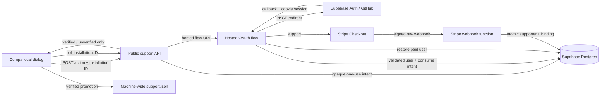

# Phase 02: Move the Implementation to Supabase - Research

**Researched:** 2026-08-16
**Domain:** Supabase Auth/Postgres/Edge Functions migration with GitHub OAuth and Stripe Checkout
**Confidence:** MEDIUM

<user_constraints>
## User Constraints (from CONTEXT.md)

### Locked Decisions

### Supabase footprint
- **D-01:** Supabase broadly owns the hosted implementation: Postgres, Auth, and Edge Functions. Stripe remains the payment and webhook provider.
- **D-02:** Remove the standalone Render deployment, Fastify support service, direct `pg` runtime, recovery-email infrastructure, and Resend integration after equivalent Supabase paths pass verification. Do not retain a fallback implementation or shared Fastify compatibility layer.
- **D-03:** Keep the published Cumpa package behind narrow hosted HTTPS capabilities. Support OAuth runs on a hosted Supabase surface; the ephemeral loopback browser does not receive or persist a Supabase auth session.
- **D-04:** Authentication is required only after a user chooses a support action. Launching and using every review feature remains anonymous and unrestricted.

### OAuth supporter identity
- **D-05:** GitHub is the only OAuth provider in this phase.
- **D-06:** A user who chooses to support Cumpa signs in with GitHub before Stripe Checkout. Server-controlled Stripe metadata binds the Checkout and verified webhook fulfillment to the authenticated Supabase user ID; do not match payment ownership by email.
- **D-07:** On another installation, Restore opens the same hosted GitHub OAuth flow. After authentication, the hosted service automatically binds a paid supporter to the requesting installation; the local dialog closes when status polling observes verification.
- **D-08:** OAuth fully replaces recovery email, magic links, recovery tokens, and Resend. There is no email fallback or operator-assisted claim flow in this phase.
- **D-09:** Preserve unlimited-installation restoration. Locally persist only installation identity and verified supporter status; do not persist GitHub profile data, payer email, or OAuth tokens in Cumpa state.

### Requirements cutover
- **D-10:** Phase 02 intentionally supersedes the email-magic-link mechanism in `REC-01` and the recovery-token mechanism in `REC-02`. Research and planning must revise those requirement details to GitHub OAuth while preserving privacy, non-enumeration of supporter status to unauthenticated callers, secure single-user account binding, and installation-bound restoration.
- **D-11:** `REC-03` remains unchanged: one verified supporter may restore status on unlimited installations without device management or transfer flows.
- **D-12:** All PAY and SUP behavior remains unchanged except the support action now authenticates before Checkout and the Restore action uses OAuth.

### Environment model
- **D-13:** Ordinary local development runs without a hosted Supabase dependency and without `CUMPA_SUPPORT_SERVICE_URL`. Cumpa must register no support capability, make no Supabase/Auth/Edge Function/Stripe calls, and hide or disable Support/Restore UI while preserving every review feature. Database migrations and RPC authority may still be verified against local PostgreSQL; do not require a complete local Supabase stack.
- **D-14:** Maintain exactly one hosted Supabase project: production. Before first public launch, use that still-empty project for the one-time GitHub OAuth and Stripe test-mode acceptance matrix, then promote it in place by replacing test OAuth/Stripe configuration with production configuration. Do not create or retain a hosted development/staging project.
- **D-15:** Version database migrations and Edge Functions in Git. After local and CI checks pass, protected `main` deployments apply directly to the sole production project and run only non-destructive production smoke checks. Do not require manual database/function promotion or Supabase Git integration; initial test-to-live provider secret/configuration promotion remains an explicit launch operation.

### Cutover and data
- **D-16:** Assume no production supporter records exist. Supabase is the first real hosted launch; do not build import, dual-write, or data-reconciliation machinery for Render/PostgreSQL.
- **D-17:** Supabase replaces the blocked Render provider checkpoint and becomes the only hosted authority. Before first public launch, real Stripe test-mode, GitHub OAuth, webhook, automatic restore, package-safety, hostile-path, and status-polling evidence must pass against the still-empty sole project. After its in-place production promotion, verification is limited to non-destructive smoke checks; do not run the destructive/test payment matrix against live authority or substitute local-only proof for the one-time hosted acceptance.
- **D-18:** Retain only the hosted data needed for authority and operations: Supabase user ID, Stripe event/customer/session/payment identifiers required for fulfillment proof and idempotency, verification timestamps, and bound installation IDs. Do not copy GitHub profile fields or payer email into supporter records.
- **D-19:** Make a clean API cutover. Update Cumpa and Supabase together; remove legacy email-recovery routes and schemas rather than providing temporary or permanent compatibility. Existing machine-local verified status remains valid across the package upgrade.

### the agent's Discretion
- Exact Supabase schema names, Edge Function boundaries, hosted support-page layout, OAuth callback mechanics, CI provider, polling cadence, and safe non-destructive production smoke checks, provided the locked single-project, local-disablement, privacy, and clean-cutover decisions above remain intact.

### Deferred Ideas (OUT OF SCOPE)

None — GitHub OAuth intentionally replaces the prior recovery mechanism within this migration phase; app-wide authentication and additional OAuth providers remain outside the phase boundary.
</user_constraints>

<phase_requirements>
## Phase Requirements

| ID | Description | Research Support |
|----|-------------|------------------|
| PAY-01 | The application offers exactly one optional, one-time support payment priced at USD $49.99 through Stripe-hosted Checkout. | Plans 02-03, 02-05, 02-07, 02-12, and 02-13 implement, accept, release, and verify authenticated fixed-price Checkout. |
| PAY-02 | Paying does not unlock, restrict, or alter any application feature except automatic support-dialog visibility. | Plans 02-05, 02-06, 02-07, 02-12, and 02-13 preserve and verify unrestricted review. |
| PAY-03 | The application treats only server-side, signature-verified Stripe webhook fulfillment as proof of payment; a client redirect or local claim is insufficient. | Plans 02-01 through 02-04 establish the authority; Plans 02-07, 02-08, 02-12, and 02-13 prove acceptance, promotion, deployment, and final lineage. |
| PAY-04 | The local application and published package contain no Stripe secret key or webhook secret. | Plans 02-01, 02-06, 02-07, and 02-09 through 02-13 constrain dependencies, remove legacy surfaces, and inspect ordinary plus configured packages. |
| SUP-01 | The application shows the support dialog on every launch until support status is verified for that installation. | Plan 02-05 preserves launch behavior; Plans 02-07, 02-12, and 02-13 prove it in accepted and configured production packages. |
| SUP-02 | The dialog clearly describes the payment as optional support for application development and links to the fixed Stripe payment page. | Plans 02-03 and 02-05 retain server-priced Checkout and dialog behavior; Plans 02-07, 02-12, and 02-13 prove the released journey. |
| SUP-03 | An unpaid user can dismiss the dialog and use the complete application without restriction. | Plans 02-05 through 02-07 and 02-13 prove dismissal and unrestricted review. |
| SUP-04 | After the hosted service verifies payment for the current installation, the open dialog closes automatically without requiring a relaunch or manual refresh. | Plans 02-05 and 02-07 prove polling-driven automatic close; Plan 02-13 audits the accepted evidence. |
| SUP-05 | Once support status is verified and persisted, that installation no longer shows the dialog on launch. | Plans 02-05 and 02-07 prove machine-wide restart suppression; Plan 02-13 audits it. |
| REC-01 | A supporter can restore support status on another installation by entering the email associated with the Stripe payment and completing an emailed magic link. Phase 2 mechanism superseded per D-10: support-scoped GitHub OAuth replaces email plus magic link. | Plans 02-01 through 02-07 implement and accept GitHub identity; Plans 02-09 through 02-11 remove email recovery; Plans 02-12 and 02-13 release and verify OAuth restoration. |
| REC-02 | Recovery responses do not disclose whether an email has paid, and recovery tokens are high-entropy, single-use, short-lived, and bound to the requesting installation. Phase 2 mechanism superseded per D-10: privacy-safe, one-use, expiring, installation-bound OAuth intent and authenticated user binding replace recovery responses and tokens while preserving non-enumeration. | Plans 02-01 through 02-07 implement and accept the new authority; Plans 02-09 through 02-11 remove legacy recovery; Plans 02-12 and 02-13 verify the released boundary. |
| REC-03 | A paid email can restore support status on unlimited installations; no device-management or transfer flow is required. | Plans 02-02, 02-03, 02-05, and 02-07 prove repeated installation binding; Plans 02-12 and 02-13 carry it through production. |
</phase_requirements>

### Planning boundary after completed Plans 02-01 through 02-05

Plans 02-01 through 02-05 are completed facts, not candidates for replanning:

- **02-01:** approved the exact existing Supabase CLI, Supabase Auth/SSR, and Stripe pins within their restricted tooling/Edge Function locations. [VERIFIED: `02-01-SUMMARY.md`]
- **02-02:** established the versioned private schema, RLS/grants, six service-role authority RPCs, and two clean local database applications with 39 pgTAP assertions. [VERIFIED: `02-02-SUMMARY.md`]
- **02-03:** implemented the three Edge Function boundaries and 15 passing Deno tests for bounded initiation/status, hosted GitHub PKCE, server-priced Checkout, and raw-signature webhook settlement. [VERIFIED: `02-03-SUMMARY.md`]
- **02-04:** cut the local API/client contract to hosted action initiation plus verified-only status refresh while preserving monotonic machine-wide state. [VERIFIED: `02-04-SUMMARY.md`]
- **02-05:** cut the browser contract to hosted Support/Restore handoffs and polling-only promotion while preserving dialog accessibility and unrestricted review behavior. [VERIFIED: `02-05-SUMMARY.md`]

Plans 02-06 through 02-13 complete the locked environment model without reopening the completed schema, RPC, function, transport, or browser contracts. Plan 02-06 proves complete ordinary-local disablement; 02-07 performs the one-time acceptance against the sole still-empty project; 02-08 removes every recorded acceptance fixture and promotes that same clean project in place; 02-09 through 02-11 retire the legacy implementation in sequential slices; 02-12 deploys and releases from protected main; and 02-13 performs final non-destructive verification.

## Summary

Move the hosted authority, not the local-first product, to Supabase. Preserve the local installation ID and monotonic verified flag exactly; replace the Phase 1 hosted client surface with two operations: initiate a hosted `support` or `restore` flow, and poll an installation's public verified/unverified status. Existing code already centralizes those operations behind `src/server/support-client.ts`, `src/server/capabilities.ts`, and `src/server/support-store.ts`. [VERIFIED: `src/server/support-client.ts`, `src/server/capabilities.ts`, `src/server/support-store.ts`]

Use three narrow Edge Function trust boundaries: a public initiation/status API, a public OAuth redirect/callback flow, and a public Stripe webhook whose authenticity comes exclusively from Stripe signature verification. The hosted OAuth flow owns its Supabase session and never redirects tokens or authorization codes to Cumpa's loopback server. Supabase's server-side guidance requires a cookie-aware client and warns against trusting an unvalidated session; validate the callback user with `getClaims()` or `getUser()`. [CITED: https://supabase.com/docs/guides/auth/server-side/creating-a-client]

Create Stripe Checkout server-side only after GitHub authentication. Put the Supabase user ID and installation/intent identifier in server-controlled Checkout metadata, then make the signed webhook the sole fulfillment path. Stripe explicitly recommends webhook-based fulfillment, idempotence, and handling repeated/concurrent events. [CITED: https://docs.stripe.com/checkout/fulfillment.md?payment-ui=stripe-hosted]

**Primary recommendation:** Preserve completed Plans 02-01 through 02-05, finish the missing local-disabled capability gate, prove the full matrix once against the still-empty sole project in Stripe test mode, delete the legacy backend only after that evidence is approved, then promote the same project in place and allow only protected direct deployments plus non-destructive smoke checks.

## Project Constraints (from `.claude/CLAUDE.md`)

- Node.js 24 LTS and TypeScript remain the application baseline; do not introduce another application runtime into Cumpa. Edge Functions use their native Deno/TypeScript runtime only at the hosted boundary. [VERIFIED: `.claude/CLAUDE.md`]
- Ordinary Cumpa remains a loopback-only Fastify application bound to `127.0.0.1`; hosted support must not turn it into a LAN or hosted review service. [VERIFIED: `.claude/CLAUDE.md`]
- Shared local HTTP and persistence contracts remain Zod-validated and corrupt data fails explicitly. [VERIFIED: `.claude/CLAUDE.md`]
- Versioned JSON under the machine-wide support store remains the local supporter source; this phase does not add a browser database or local Supabase client session. [VERIFIED: `.claude/CLAUDE.md`, `src/server/support-store.ts`]
- Tests use Vitest for contracts/server logic and Playwright for the browser flow. [VERIFIED: `.claude/CLAUDE.md`]
- Support discovery must not increase CLI startup work or make the hosted service a startup dependency. [VERIFIED: `.kimi-code/skills/spike-findings-cumpa/references/cli-source-discovery.md`]

## Architectural Responsibility Map

| Capability | Primary Tier | Secondary Tier | Rationale |
|------------|--------------|----------------|-----------|
| Review experience | Browser / local server | Local filesystem/Git | Remains anonymous and local-first. |
| Installation identity/status | Local server | Machine-wide JSON | Existing local store owns persistence; hosted state only promotes it. |
| GitHub login/session | Supabase Auth / hosted flow | GitHub OAuth | The loopback app must never receive the Supabase session. |
| Flow intent | Supabase Postgres | Edge Function | Opaque, expiring, one-use state binds OAuth completion to action and installation. |
| Checkout creation | Edge Function | Stripe | Only authenticated server code may create metadata-bound Checkout. |
| Payment fulfillment | Stripe webhook Edge Function | Supabase Postgres | Signed events atomically create supporter and installation authority. |
| Public installation status | Edge Function | Supabase Postgres | Returns only a boolean-style state for a high-entropy installation identifier. |
| Production deployment | CI | Supabase CLI | Git is the migration/function source; `main` deploys production. |

## Recommended Architecture



### Function boundaries

1. **`support-api` (`verify_jwt = false`)** — `POST /start` validates `{action, installationId}`, stores only a token hash in an expiring one-use intent, and returns the hosted flow URL; `GET /status` returns only `verified` or `unverified`. It must not accept a user ID, email, or client-authored Stripe metadata.
2. **`support-flow` (`verify_jwt = false`)** — server-side redirect/callback endpoint. It creates a request-scoped, cookie-backed Supabase client, starts GitHub OAuth with PKCE, validates the callback's state/intent and authenticated user, consumes the intent once, then either creates Checkout or restores the installation. GitHub recommends `state`, exact callback matching, and S256 PKCE. [CITED: https://docs.github.com/en/apps/oauth-apps/building-oauth-apps/authorizing-oauth-apps]
3. **`stripe-webhook` (`verify_jwt = false`)** — reads the request body as text, verifies Stripe's signature, rejects irrelevant/unpaid/wrong-product sessions, and calls one transaction/RPC for idempotent settlement. Supabase's official Stripe example uses raw text and `constructEventAsync`; disabling Supabase JWT verification does not remove the Stripe signature boundary. [CITED: https://supabase.com/docs/guides/functions/examples/stripe-webhooks] [CITED: https://raw.githubusercontent.com/supabase/supabase/master/examples/edge-functions/supabase/functions/stripe-webhooks/index.ts]

A redirect-only hosted flow is preferable to a hosted SPA for this phase: it keeps the surface small and avoids shipping Supabase tokens to Cumpa. Supabase documents that Edge Function HTML serving needs a custom domain; otherwise `text/html` is rewritten to `text/plain`, so do not plan a rich Edge-hosted UI without explicitly provisioning a custom domain. [CITED: https://supabase.com/docs/guides/functions/limits]

## Postgres Authority Model

Recommended private/locked-down tables:

| Table | Minimum fields | Invariants |
|-------|----------------|------------|
| `support_intents` | token hash, installation ID, action, expiry, consumed timestamp | Token hash unique; action constrained; consume once; short expiry. |
| `checkout_sessions` | Stripe session ID, Supabase user ID, installation ID, intent ID, created/fulfilled timestamps | Session unique; row created before redirect; authenticated user is server-derived. |
| `supporters` | Supabase user ID, source Stripe session/customer/payment identifiers actually needed, verified timestamp | One authoritative supporter per `auth.users.id`; no GitHub profile or email. |
| `installation_bindings` | installation ID, Supabase user ID, verified timestamp, source session or restore marker | Installation ID unique; repeat restore by a paid user is idempotent. |
| `stripe_events` | Stripe event ID, type, object ID, processed timestamp | Event ID unique; duplicate delivery is a success/no-op. |

Reference Supabase users by the `auth.users` primary key only; Supabase recommends public application tables reference `auth.users` rather than relying on other Auth schema objects. [CITED: https://supabase.com/docs/guides/auth/managing-user-data]

Enable RLS on every table in an exposed schema and create no `anon` or `authenticated` data policies for these authority tables. Supabase notes that exposed tables require RLS, while privileged server keys bypass RLS and must never be exposed in browsers. [CITED: https://supabase.com/docs/guides/database/postgres/row-level-security] Keep mutations behind narrowly granted `security definer` functions with an empty/fixed `search_path`; revoke execution from `public`, `anon`, and `authenticated`, and grant only the server role. Unique constraints—not preflight reads—enforce idempotency.

### Atomic transitions

- **Checkout creation:** consume a valid support intent for the authenticated user, create a pending checkout record, then create Stripe Checkout. A Stripe API failure leaves a retryable/expired pending record rather than verified authority.
- **Webhook fulfillment:** lock/insert the event ID, validate the already-recorded Checkout/user/installation binding, upsert supporter authority, bind the installation, mark the session fulfilled, and commit together.
- **Restore:** consume a restore intent, verify `supporters.user_id = authenticated user`, and upsert the requesting installation in one transaction. Return the same generic completion page whether already bound or newly bound.

## GitHub OAuth and Session Boundary

The sole hosted project has one stable Supabase callback URL, `https://<project-ref>.supabase.co/auth/v1/callback`. Configure the temporary prelaunch GitHub OAuth credentials against that URL for acceptance, then replace them with the production OAuth credentials/settings in the same Supabase project; no second project or simultaneous project callback is required. Supabase documents both the project callback shape and provider credential update through its dashboard or Management API. [CITED: https://supabase.com/docs/guides/auth/social-login/auth-github] Configure only GitHub, disable email/magic-link and other providers, request no repository scopes, and never store the GitHub access token or profile fields. GitHub OAuth App callback settings are editable, so an in-place configuration change is supported. [CITED: https://docs.github.com/en/apps/oauth-apps/maintaining-oauth-apps/modifying-an-oauth-app]

Use PKCE, an HTTP-only secure SameSite cookie for the code verifier/session, and a separate opaque intent/state value that binds the action and installation. Supabase documents that the PKCE authorization code is single-use, expires after five minutes, and must be exchanged by the same browser context holding the verifier. [CITED: https://supabase.com/docs/guides/auth/sessions/pkce-flow] Exact production redirect URLs should be allowlisted rather than broad wildcards. [CITED: https://supabase.com/docs/guides/auth/redirect-urls]

The callback must derive the Supabase user from the validated session and ignore user IDs in query/body data. The local loopback receives only a hosted flow URL and later observes installation status; it never receives an OAuth code, access token, refresh token, cookie, GitHub identity, or email.

## Stripe Checkout and Webhook Contract

Create a Checkout Session after authentication with:

- `mode: "payment"` and exactly one server-selected USD $49.99 price/line item;
- `client_reference_id` set to a non-secret server-controlled reference (prefer the Supabase user ID or internal checkout row ID);
- server-only metadata containing the Supabase user ID, installation ID, and internal checkout/intent ID;
- hosted success/cancel URLs that do not grant authority;
- no email-based ownership or client-supplied product/amount metadata.

Stripe's Checkout API provides `client_reference_id` for reconciling a session with an internal system and supports server-authored metadata. [CITED: https://docs.stripe.com/api/checkout/sessions/create]

The webhook must read the unmodified body, verify the signing secret, and respond quickly. Stripe documents raw-body signature verification and automatic retries. [CITED: https://docs.stripe.com/webhooks] At minimum accept `checkout.session.completed`; if delayed payment methods are enabled, also handle `checkout.session.async_payment_succeeded` and do not fulfill an unpaid session. Retrieve/expand authoritative line items when needed and re-check mode, currency, amount/price, quantity, payment status, and recorded metadata before settlement. Browser redirects never set verified state.

## Standard Stack

### Core

| Library/tool | Verified version | Purpose | Provenance |
|--------------|------------------|---------|------------|
| Supabase CLI | 2.114.0 | Database-only local start, migrations, config, secrets, function deployment | Registry checked 2026-08-14; official CLI docs. [CITED: https://supabase.com/docs/reference/cli/usage] |
| `@supabase/supabase-js` | 2.112.3 | Auth/session and server API client in Edge Functions | Registry checked 2026-08-14; official examples use the client. [CITED: https://supabase.com/docs/guides/auth/server-side/creating-a-client] |
| `@supabase/ssr` | 0.12.4 | Cookie adapter for hosted server-side OAuth | Registry checked 2026-08-14; official server-side Auth guide. [CITED: https://supabase.com/docs/guides/auth/server-side/creating-a-client] |
| `stripe` | 22.5.0 | Checkout creation and WebCrypto-compatible webhook verification | Already pinned by the Phase 1 service; official Supabase example uses the Stripe npm package. [VERIFIED: `services/support/package.json`] [CITED: https://supabase.com/docs/guides/functions/examples/stripe-webhooks] |
| PostgreSQL migrations | Supabase-managed | Schema, constraints, transactional authority | Supabase CLI supports timestamped migrations and remote push. [CITED: https://supabase.com/docs/guides/deployment/database-migrations] |

Do not add Supabase packages to the published Cumpa runtime unless the narrow local client truly needs them; plain HTTPS remains sufficient locally. Import server-only packages only from Edge Function code.

**Registry checks:** `npm view` on 2026-08-14 returned the versions above; none reported a `postinstall` script. [VERIFIED: npm registry]

## Package Legitimacy Audit

The GSD legitimacy seam flagged every candidate `SUS` solely as “too-new,” despite official Supabase/Stripe documentation and established source repositories. The planner must insert a human verification checkpoint before installation, per workflow policy.

| Package | Registry | Weekly downloads checked | Source | Verdict | Disposition |
|---------|----------|--------------------------|--------|---------|-------------|
| `supabase` | npm | 3,341,382 | official Supabase CLI docs/repository | SUS: too-new | Flagged—human verify before pinning |
| `@supabase/supabase-js` | npm | 25,021,069 | official Supabase Auth docs/repository | SUS: too-new | Flagged—human verify before pinning |
| `@supabase/ssr` | npm | 6,759,812 | official Supabase server-side Auth docs/repository | SUS: too-new | Flagged—human verify before pinning |
| `stripe` | npm | 17,546,670 | official Stripe docs/repository | SUS: too-new | Already used; human verify before changing/pinning |

**Packages removed due to SLOP verdict:** none.  
**Packages flagged as suspicious:** all four above because the automated age heuristic returned `SUS`; authoritative provenance reduces supply-chain uncertainty but does not waive the required checkpoint.

## Local-Disabled and Single-Project Environment Model

| Concern | Ordinary local development | One-time prelaunch acceptance | Production and post-launch |
|---------|----------------------------|-------------------------------|----------------------------|
| Postgres | Optional database-only local PostgreSQL for migrations/RPCs; no hosted dependency | The still-empty sole project receives the exact versioned migrations | The same project retains the accepted schema; protected `main` applies later migrations directly |
| Auth | None; no OAuth request or session | Temporary GitHub OAuth test/development credentials on the sole project | Replace in place with production GitHub OAuth credentials and exact production redirects |
| Edge Functions | Pure tests only; ordinary Cumpa does not call them | Deploy the exact candidate commit to the sole project for the one-time matrix | Protected `main` deploys directly to the same project; smoke is non-destructive only |
| Stripe | No Checkout, webhook, or Stripe call | Test-mode key, test Price, and test webhook signing secret on the sole project | Replace all three with live-mode values; never run the test/destructive matrix against live authority |
| Cumpa hosted URL | `CUMPA_SUPPORT_SERVICE_URL` omitted | Set only in the isolated acceptance runtime/package under test | Explicit production capability URL; never required for ordinary local review development |

The CLI documents database migrations as versioned files applied with `supabase db push`, and warns that remote dashboard schema edits bypass migration history. [CITED: https://supabase.com/docs/guides/deployment/database-migrations] Completed Plan 02-02 already proved the schema/RPC authority locally without requiring hosted Auth or Edge Functions. [VERIFIED: `02-02-SUMMARY.md`]

### Required local-disabled runtime behavior

Current source still constructs `createSupportCapability(createSupportStore(), createHostedSupportClient())` in the default app/CLI factories even when `CUMPA_SUPPORT_SERVICE_URL` is absent; the client then becomes a no-op, but support routes and UI capability remain registered. [VERIFIED: `src/server/app.ts`, `src/cli/run.ts`, `src/server/support-client.ts`, `src/server/routes.ts`] This is the remaining D-13 gap, not a reason to reopen Plans 02-04 or 02-05.

The revised plans must gate capability construction before creating the support store/client:

1. when `CUMPA_SUPPORT_SERVICE_URL` is absent or invalid, pass no support capability to every session/app factory;
2. register no `/api/support/*` routes, start no support polling, and expose no Support/Restore controls or launch prompt;
3. make zero Supabase/Auth/Edge Function/Stripe network calls;
4. keep every branch/worktree/patch review, draft, export, and completion feature unchanged;
5. when the explicit production HTTPS URL is present, reuse the completed 02-04/02-05 action/status and browser contracts unchanged.

### Secret and configuration ownership

- **Protected CI:** one `SUPABASE_PROJECT_REF`, access token, and database credential/link secret for the sole project. There is no development ref and no second hosted secret set.
- **Supabase project:** Stripe API key, Price ID, and webhook signing secret are Edge Function secrets; GitHub client ID/secret live in Auth provider configuration. Supabase states that remote function secret updates become available immediately without a redeploy, so promotion must occur during a no-traffic launch window and be verified as one controlled operation. [CITED: https://supabase.com/docs/guides/functions/secrets]
- **Stripe:** test and live modes have different API keys and isolated objects; a test Price cannot be used in live mode, and webhook signing secrets are per endpoint. [CITED: https://docs.stripe.com/keys] The production Price ID, live key, and live webhook signing secret therefore must replace—not coexist with or be mixed with—the temporary test values used by the functions.
- **Published Cumpa package:** only the public support capability URL may be present; no Supabase privileged key, GitHub client secret, Stripe key, webhook secret, OAuth token, or project-management credential.

## Evidence-Safe Single-Project Launch and Clean-Cutover Order

1. **Preserve completed substrate:** accept Plans 02-01 through 02-05 package/schema/function/local-contract/browser baseline.
2. **Prove complete ordinary-local disablement:** with both runtime and protected release inputs absent, verify no support capability/routes/UI/polling/network activity while the complete review product remains usable.
3. **Prepare exactly one still-empty hosted project:** calculate SHA-256 of the complete ref, record only the fingerprint plus display suffix, apply migrations before functions, and configure temporary GitHub OAuth plus the complete Stripe test-mode set.
4. **Run the one-time D-17 matrix:** use paid and distinct unpaid GitHub identities plus fresh isolated installation stores for real OAuth, test Checkout, signed webhook, automatic verification, repeated restore, non-enumeration, hostile paths, package safety, polling, persistence, and unrestricted review. Record exact redacted stable handles and counts for every acceptance-created Auth and authority fixture.
5. **Approve and clean fixtures before promotion:** require separate evidence approval; compare every current Auth/authority row with the recorded handle multisets, abort on any mismatch, delete only exact recorded fixtures, and prove Auth plus every authority table is empty. Stripe test objects remain isolated in test mode.
6. **Promote the same clean project in place:** before every hosted mutation, hash the complete supplied ref and compare the approved fingerprint. Replace temporary GitHub settings and the complete Stripe test set with release/live settings in a no-traffic window; never mix or copy test objects.
7. **Retire legacy implementation sequentially:** after approved promotion, 02-09 removes only the hosted runtime, schema, routes, and Render configuration; 02-10 removes the service toolchain, workspace entry, and root dependencies; 02-11 removes obsolete hosted-service and email-recovery tests, replaces operations/verifier coverage, clears generated/package remnants, and proves absence. No fallback, import, dual write, or reconciliation.
8. **Land protected direct deployment and configured package release:** protected `main` runs all local gates, repeats the full-ref fingerprint guard before every hosted mutation, applies migrations before functions, and emits immutable run ID/URL plus redacted outputs. The protected release build embeds only the public HTTPS capability URL in the generated package entrypoint; installed users set no environment variable and ordinary source/local builds remain disabled.
9. **Run only non-destructive production smoke:** validate immutable run/artifact lineage, migration/function/configuration reads, configured package Support/Restore visibility, package-secret absence, and a fresh generic-unverified status observation whose before/after Auth/authority counts are unchanged.
10. **Close with evidence-only coverage:** match the same fingerprint through final verification and attribute PAY-01..04, SUP-01..05, D-10-superseded REC-01/02, REC-03, and D-01..D-19 without repeating OAuth/payment/restore/hostile/destructive live behavior.
11. **Retire any external legacy resources:** only after approved replacement, promotion, sequential repository deletion, protected deployment, configured release, and non-destructive smoke. D-16 prohibits import, dual write, or reconciliation.

## Existing-Code Impact Map

| Existing area | Required action | Evidence |
|---------------|-----------------|----------|
| `src/server/support-store.ts` | Keep schema and behavior unchanged so previously verified local state survives. | Store contains installation ID plus verified state/timestamp only. [VERIFIED: `src/server/support-store.ts`] |
| `src/server/support-client.ts` | Completed in 02-04; keep the bounded HTTPS action/status transport unchanged when explicitly configured. | Missing URL currently yields a no-op client, but D-13 requires omitting the capability above this layer. [VERIFIED: `src/server/support-client.ts`, `02-04-SUMMARY.md`] |
| `src/server/capabilities.ts` | Completed in 02-04; preserve verified-only monotonic local promotion. | No later plan should reopen its payment/restore authority contract. [VERIFIED: `src/server/capabilities.ts`, `02-04-SUMMARY.md`] |
| `src/contracts/api.ts`, `src/server/routes.ts`, `src/web/api/client.ts` | Completed action/start/status clean cutover; preserve it for configured production mode. | Routes already register only when `capabilities.support` exists. [VERIFIED: `src/server/routes.ts`, `02-04-SUMMARY.md`] |
| `src/web/App.vue`, `src/web/components/SupportDialog.vue` | Completed hosted handoff/polling UI; add only capability-aware hiding/disablement so absent support never prompts or polls. | Do not redo the accessible configured-mode dialog contract. [VERIFIED: `02-05-SUMMARY.md`] |
| `src/server/app.ts`, `src/cli/run.ts` | Gate default support construction on a valid explicit `CUMPA_SUPPORT_SERVICE_URL` across every ordinary, attached, range, and exact-patch launch path. | Current factories always construct a capability, which conflicts with D-13. [VERIFIED: `src/server/app.ts`, `src/cli/run.ts`] |
| `services/support/**`, `render.yaml`, legacy support E2E tests | Delete only after approved one-time acceptance and in-place promotion against the sole project: 02-09 owns hosted runtime/schema/routes/Render removal, 02-10 owns service toolchain/workspace/root dependency removal, and 02-11 owns obsolete hosted-service/email-recovery tests plus docs/generated/package absence proof. | These contain Fastify/pg/Resend/Render authority and its obsolete verification surface. [VERIFIED: `services/support`, `render.yaml`, `tests/e2e/support-recovery.spec.ts`] |
| `docs/support-service-operations.md` | Replace Render/Resend and dev/prod instructions with one-project prelaunch acceptance, in-place provider promotion, protected direct deployment, rollback/forward-fix, and non-destructive smoke guidance. | Current document is provider-specific. [VERIFIED: `docs/support-service-operations.md`] |
| package safety tests | Keep packed-artifact denial of Supabase/GitHub/Stripe privileged identifiers and prove the support URL is absent in ordinary local development. | Existing safety boundary remains PAY-04 authority. [VERIFIED: project package tests] |
| package safety tests | Extend deny-list and packed-artifact assertions to Supabase/GitHub/Stripe privileged identifiers. | Existing safety test excludes Phase 1 service/secrets. [VERIFIED: project package tests] |

## Runtime State Inventory

| Category | Items Found | Action Required |
|----------|-------------|-----------------|
| Stored data | Existing machine-local `support.json` may contain verified status; D-16 says no production hosted supporter rows exist. | Preserve local schema; no hosted import, dual write, or reconciliation. |
| Live service config | One Supabase project carries temporary prelaunch Auth/Stripe settings, then production settings; redirect allowlists, GitHub OAuth configuration, Stripe endpoints/secrets, and legacy Render/Resend resources live outside Git. | Record before/after redacted equality for the same project ref; retire legacy resources only after proof. |
| OS-registered state | None identified: support is package/local-file based and no launchd/system service is part of this feature. [VERIFIED: repository search] | None. |
| Secrets/env vars | Ordinary local development omits `CUMPA_SUPPORT_SERVICE_URL`; the sole hosted project and CI carry production Supabase/Stripe/GitHub credentials after launch. Existing Render/Resend/Postgres/Payment Link variables become obsolete. | Replace the complete temporary test set during the no-traffic promotion; verify no mixed test/live values, then rotate/remove obsolete credentials without copying secrets into package assets. |
| Build artifacts/installed packages | Packed npm assets and previously built service artifacts may retain old routes/names. | Rebuild/package after deletion and inspect tar contents; deployed legacy service is separately retired. |

## Security Domain

### Applicable ASVS Categories

| ASVS category | Applies | Standard control |
|---------------|---------|------------------|
| V2 Authentication | Yes | Supabase GitHub OAuth, PKCE, validated user lookup, exact redirects. |
| V3 Session Management | Yes | Secure HTTP-only SameSite cookies, request-scoped server client, short flow lifetime; no loopback token. |
| V4 Access Control | Yes | Server-derived user ID, RLS on exposed tables, privileged RPC/function mutations only. |
| V5 Validation | Yes | Zod/explicit Edge validators, database constraints, allowlisted actions, exact 43-character base64url installation IDs. |
| V6 Cryptography | Yes | Supabase/Auth PKCE, Stripe SDK signature verification, cryptographic random opaque intent tokens; never custom crypto. |
| V8 Data Protection | Yes | Minimal identifiers, no profile/email/token storage, secrets restricted to Supabase/CI. |
| V9 Communications | Yes | HTTPS-only local hosted client; secure cookies; exact hosted origins. |
| V10 Malicious Code | Yes | Package legitimacy checkpoint, lockfile/pins, packed artifact inspection. |
| V12 Files/Resources | Yes | Bounded response bodies and existing timeouts; no hosted content is executed locally. |
| V13 API/Web Services | Yes | Generic errors, method/content-type limits, non-enumerating public status. |

### Threat patterns

| Pattern | STRIDE | Required mitigation |
|---------|--------|---------------------|
| Forged OAuth callback/CSRF | Spoofing | PKCE + state + one-use hashed intent + exact redirect allowlist. |
| User/installation substitution | Tampering | Derive user server-side; validate installation ID; bind action/install in intent and Checkout row. |
| Forged/replayed Stripe event | Spoofing/Replay | Raw-body signature, unique event/session constraints, atomic idempotent transaction. |
| Browser-success fulfillment | Elevation | Only webhook settlement writes verified authority. |
| Supporter enumeration | Information disclosure | No email/user lookup API; status reveals only one high-entropy installation's boolean state; generic restore completion. |
| Secret leakage in package/logs | Information disclosure | Server secrets only, structured redacted logs, `npm pack` inspection. |
| Privileged table access | Elevation | RLS, no client policies, revoke RPCs from public roles, server role only. |
| Function abuse | Denial of service | Supabase/Auth rate limits plus application throttling/expiry/bounded bodies; monitor failures. Supabase exposes configurable Auth rate limits. [CITED: https://supabase.com/docs/guides/auth/rate-limits] |

## Don't Hand-Roll

| Problem | Don't build | Use instead | Why |
|---------|-------------|-------------|-----|
| OAuth protocol/session validation | Custom OAuth client or token parser | Supabase Auth + `supabase-js`/`@supabase/ssr` | PKCE, cookie rotation, callback validation, provider integration. |
| Webhook signatures | HMAC parsing/comparison | Stripe SDK `constructEventAsync` | Canonical raw-body verification and algorithm handling. |
| Payment authority | Browser success callbacks | Signed Stripe webhook + DB transaction | Redirects are replayable and not authoritative. |
| Idempotency | Read-then-insert checks | PostgreSQL unique constraints and transaction/RPC | Handles retries and concurrency. |
| Migration deployment | Dashboard edits/custom runner | Supabase CLI migration files | Reproducible local history and one protected production history. |
| Local auth proxy | Loopback callback/session storage | Hosted OAuth flow and status polling | Directly violates D-03 and increases secret/token exposure. |
| Email identity matching | Stripe/GitHub email comparison | Supabase user ID in server-controlled metadata | Emails change, differ across providers, and violate D-06/D-18. |

## Common Pitfalls

1. **Using static Payment Links:** they cannot satisfy authenticated, server-controlled user/install binding. Create Checkout Sessions after OAuth.
2. **Exposing a privileged Supabase key:** no service-role/secret key belongs in Cumpa or a browser bundle; secret keys bypass RLS. [CITED: https://supabase.com/docs/guides/database/postgres/row-level-security]
3. **Treating `verify_jwt = false` as no security design:** it is necessary for OAuth entry/webhooks, but each handler needs its own proof—state/session for OAuth, Stripe signature for webhook, high-entropy capability for status.
4. **Parsing webhook JSON before signature verification:** Stripe requires the raw body. [CITED: https://docs.stripe.com/webhooks]
5. **Returning HTML from a default Edge Function domain:** Supabase may rewrite `text/html` without a custom domain. Use redirects/minimal plain completion unless a domain is explicitly provisioned. [CITED: https://supabase.com/docs/guides/functions/limits]
6. **Creating remote schema/config only in dashboards:** schema drift makes the sole authority unreproducible. Capture migrations and supported function configuration in Git; record redacted Auth/provider settings that necessarily live outside Git. [CITED: https://supabase.com/docs/guides/deployment/database-migrations]
7. **Demoting a locally verified installation on network failure/unverified response:** preserve Phase 1 monotonic local state.
8. **Keeping compatibility aliases “temporarily”:** D-19 requires deleting recovery routes/schemas and D-02 forbids the Fastify fallback.
9. **Treating local mocks as the launch gate:** D-17 requires one real hosted GitHub OAuth and Stripe test-mode matrix against the still-empty sole project before launch and legacy deletion.
10. **Mixing test and live provider facts during promotion:** Stripe test/live keys and objects are isolated; update the live key, Price, and webhook signing secret as one controlled set while public calls are disabled, then verify mode/config before release. [CITED: https://docs.stripe.com/keys]
11. **Repeating the acceptance matrix after launch:** test cards, hostile mutations, restore matrices, or synthetic webhook fulfillment must not write live authority. Post-launch verification is read-only/non-mutating smoke only. Stripe directs simulated transactions to its sandbox/test environment, not live mode. [CITED: https://docs.stripe.com/testing]
12. **Assuming rollback means reversing production migrations:** an already-applied schema may be consumed by live data and newer functions. Prefer an additive forward fix; redeploy known-good functions only when they remain compatible with the applied schema. Never use destructive `db reset`, down migrations, or acceptance cleanup against production.
13. **Deploying functions before migrations:** functions may address absent tables/RPCs. The protected serialized `main` job applies migrations first and stops on failure.

## Code Examples

### Database-only local migration

```bash
# Supabase CLI reference documents database-only startup and URL-targeted migration.
supabase db start
supabase migration up --db-url "$LOCAL_SUPABASE_DB_URL"
```

Source: [CITED: https://supabase.com/docs/reference/cli/usage]

### Raw Stripe webhook verification

```ts
const signature = req.headers.get("stripe-signature")
if (!signature) return new Response("Missing signature", { status: 400 })

const event = await stripe.webhooks.constructEventAsync(
  await req.text(),
  signature,
  Deno.env.get("STRIPE_WEBHOOK_SIGNING_SECRET")!,
  undefined,
  Stripe.createSubtleCryptoProvider(),
)
```

Source pattern: [CITED: https://raw.githubusercontent.com/supabase/supabase/master/examples/edge-functions/supabase/functions/stripe-webhooks/index.ts]

### Hardened authority RPC outline

```sql
create or replace function private.restore_installation(
  p_user_id uuid,
  p_installation_id text
) returns boolean
language plpgsql
security definer
set search_path = ''
as $$
begin
  if not exists (
    select 1 from public.supporters s
    where s.user_id = p_user_id
  ) then
    return false;
  end if;

  insert into public.installation_bindings (installation_id, user_id, verified_at)
  values (p_installation_id, p_user_id, now())
  on conflict (installation_id) do update
    set user_id = excluded.user_id,
        verified_at = excluded.verified_at;
  return true;
end;
$$;

revoke all on function private.restore_installation(uuid, text) from public, anon, authenticated;
grant execute on function private.restore_installation(uuid, text) to service_role;
```

This is a recommended project pattern, not copied from official docs; the planner must adapt schema names and prevent rebinding an installation already owned by a different account unless product policy explicitly permits it.

### Narrow local capability

```ts
type SupportAction = "support" | "restore"

interface HostedSupportClient {
  start(action: SupportAction, installationId: string): Promise<{ flowUrl: string }>
  status(installationId: string): Promise<"unverified" | "verified">
}
```

Keep transport async, bounded, HTTPS-only, and free of Supabase session semantics.

## Test Strategy

`workflow.nyquist_validation` is explicitly `false`, so no formal Validation Architecture/Wave 0 section is required. Nevertheless, D-17 makes hosted acceptance evidence a phase deliverable.

### Automated layers

- **Pure Edge logic:** Deno tests for input validation, Stripe event classification, metadata/product checks, generic errors, and response shaping; do not mock away signature verification in its dedicated test.
- **Database-only integration:** apply migrations from empty state; test intent expiry/one-use behavior, duplicate and concurrent event settlement, restore for paid/unpaid users, binding constraints, RLS denial for public roles, and migration replay/reset.
- **Cumpa Vitest:** update API Zod schemas, hosted client HTTPS/time/size/error behavior, monotonic local promotion, existing verified store compatibility, and deleted recovery endpoints.
- **Browser integration/Playwright:** Support/Restore open hosted URLs in a new tab; workspace remains usable; waiting is dismissible; cancellation/delay does not show failure; visibility/polling eventually displays verified thank-you; no app feature gates on auth/payment.
- **Package safety:** inspect `npm pack --json` plus the tar contents/client assets for legacy service files and Supabase/GitHub/Stripe privileged secret names/values.

### Mandatory sole-project prelaunch evidence

1. Fresh installation chooses Support and is sent to GitHub before Stripe.
2. OAuth callback resolves one Supabase user and creates Checkout with server-controlled user/install metadata.
3. Signed Stripe test webhook creates supporter authority and one installation binding.
4. Local polling promotes the machine-wide store and suppresses future prompt/status indicates verified.
5. A second fresh installation chooses Restore, authenticates the same GitHub account, and becomes verified without email or device management.
6. A non-supporter authenticating for Restore gets a generic non-enumerating result and remains unverified.
7. Replayed/concurrent webhook delivery is a successful no-op with one authority result.
8. Wrong signature, amount/currency/product, user metadata, expired intent, and reused intent fail closed.
9. Cancelled/delayed Checkout never shows false failure or grants verification.
10. Packed Cumpa contains no hosted secrets, service implementation, OAuth tokens, or privileged Supabase credentials.

## CI and Operations

Use one serialized protected-`main` workflow for the sole production project. Run Node/package, Deno, two-clean-apply database/RLS/grant, browser-disabled, security, legacy-absence, and package gates before exposing protected inputs. In the protected job, hash the complete `SUPABASE_PROJECT_REF` with SHA-256 and compare it with the approved prelaunch/promotion fingerprint immediately before every hosted mutation; the display suffix is never an authorization check. Apply migrations, inspect migration/RLS/grant state, then deploy all three Edge Functions from the same commit.

The same protected workflow performs the production package release. `CUMPA_RELEASE_SUPPORT_SERVICE_URL` is a protected non-secret production variable consumed only by `scripts/build-bin.mjs`; the generated package entrypoint validates and embeds that public HTTPS URL before dynamically importing the CLI. Installed production users therefore need no environment variable, while ordinary source/local builds without the release input register no support capability and make no hosted call per D-13.

Initial GitHub/Stripe test-to-live configuration replacement is the single explicit in-place launch operation from D-15. After promotion, the workflow and final verification allow only migration/function/configuration observations plus a fresh generic-unverified installation status read whose before/after authority counts are unchanged. No OAuth, Checkout, webhook, payment, restore, replay, hostile, cleanup, reset, or down-migration action runs against live authority.

Operational documentation covers protected-main landing, schema-first ordering, full-ref fingerprint lineage, additive forward fixes, compatible function redeploy, secret/provider rotation, incident correlation, D-18 retention, provider outage behavior, package release, and immutable run evidence. It contains no development-project workflow, manual schema promotion, fallback provider, or dual write.

## Environment Availability

| Dependency | Required by | Available | Version | Fallback |
|------------|-------------|-----------|---------|----------|
| Node.js | Cumpa/tests/scripts | Yes | 24.15.0 | — |
| npm | dependency/package checks | Yes | 11.12.1 | — |
| Deno | Edge pure tests | Yes | 2.7.14 | Hosted functions use their native runtime |
| Docker CLI | optional database-only local PostgreSQL verification | Yes | 29.4.0 | Existing compatible PostgreSQL URL |
| PostgreSQL client | database-only local verification | Yes | 18.3 | Supabase CLI database commands |
| Supabase CLI | migrations/deployment | Installed by approved project tooling | 2.114.0 | None |
| Sole Supabase production project | one-time prelaunch acceptance, in-place promotion, protected production deployment | Provisioning/evidence required | one project only | None; a second project is forbidden |
| GitHub OAuth configuration | temporary prelaunch credentials then release credentials on the same project | Human/provider setup required | one active GitHub provider set at a time | None |
| Stripe configuration | test-mode acceptance then isolated live-mode configuration on the same project | Human/provider setup required | complete test set replaced by complete live set | None |
| Public support capability URL | protected release build only | Derived from the sole production deployment | HTTPS | Ordinary source/local builds intentionally omit it |

Ordinary local development requires none of the hosted rows above: without `CUMPA_SUPPORT_SERVICE_URL` or the protected release-build input, Cumpa constructs no support capability, exposes no support route or UI, schedules no polling, and makes no Supabase/Auth/Edge Function/Stripe request. Database migrations/RPCs may still be exercised against local PostgreSQL without a complete local Supabase stack.

## State of the Art

| Old Phase 1 approach | Phase 2 approach | Impact |
|----------------------|------------------|--------|
| Render Fastify + direct `pg` | Supabase Edge Functions + Postgres | Remove separate hosted Node service and provider deployment. |
| Resend magic-link recovery | Hosted GitHub OAuth | Account-bound recovery without stored payer/profile email. |
| Static Payment Link-oriented configuration | Authenticated server-created Checkout Session | Server controls user/install ownership metadata. |
| Recovery challenge/token polling | Hosted flow initiation + installation status polling | Smaller local API; OAuth session remains hosted. |
| Manual Render deployment/provider proof | Git-versioned migrations/functions and production CI | Reproducible clean cutover; Supabase is sole acceptance target. |

## Assumptions Log

| # | Claim | Section | Risk if wrong |
|---|-------|---------|---------------|
| A1 | `@supabase/ssr` 0.12.4 works in the chosen Edge Function cookie adapter without runtime incompatibility. [ASSUMED] | Standard Stack/OAuth | Hosted callback implementation changes; prove in dev before locking. |
| A2 | Production Stripe live-mode account/product activation is available. [ASSUMED] | Environment | Production launch is blocked; test-mode development remains possible. |
| A3 | The database-only local image exposes enough Auth schema structure for the chosen FK migration. [ASSUMED] | Local environment | Local migration setup needs an explicit auth schema fixture or adjusted FK verification. |

## Open Questions (RESOLVED)

1. **Production Stripe activation and Price representation — owned by 02-08 promotion and 02-12 deployment**
   - Resolution: the one-time 02-07 acceptance uses only Stripe test-mode objects. Plan 02-08 leaves those objects isolated in test mode, deletes every acceptance-created Supabase fixture, proves zero Auth/authority rows, and replaces the complete test secret set with one coherent live account, one live one-time USD $49.99 Price, and one production webhook endpoint. No test object or identifier is copied to live mode.
2. **Auth provider settings and target identity — owned by 02-07, 02-08, 02-12, and 02-13**
   - Resolution: exactly one Supabase project has one active GitHub provider set at a time: temporary prelaunch settings, then release settings in place. Evidence stores SHA-256 of the complete project ref plus a display suffix; every hosted mutation hashes the complete supplied ref and compares the fingerprint. Supported non-secret Auth settings remain versioned; unavoidable provider-dashboard facts are recorded only as redacted handles.
3. **Production client capability enablement — owned by 02-12**
   - Resolution: the protected release workflow supplies the public HTTPS capability URL to `scripts/build-bin.mjs`, which embeds it only in the generated production entrypoint before dynamic CLI import. Installed users set no environment variable. Ordinary source/local builds receive no release input and remain completely support-disabled per D-13.
4. **Retention of Stripe operational identifiers — owned by the operations runbook**
   - Resolution: retain only event/customer/session/payment identifiers required by D-18 idempotent fulfillment proof and incident correlation. No payer email, GitHub profile, OAuth token, additional analytics identifier, or acceptance fixture survives promotion.

## Multi-Source Coverage Audit

| Source | ID | Feature / requirement | Owning plans | Status |
|---|---|---|---|---|
| GOAL | — | Supabase-only hosted authority, webhook-authoritative support, machine-wide suppression, GitHub OAuth restore, ordinary-local disablement, and configured production client cutover | 02-01–02-13 | COVERED |
| REQ | PAY-01 | One optional one-time USD $49.99 Stripe-hosted Checkout | 02-03, 02-05, 02-07, 02-12, 02-13 | COVERED |
| REQ | PAY-02 | Payment changes no feature except dialog visibility | 02-05–02-07, 02-12, 02-13 | COVERED |
| REQ | PAY-03 | Only signature-verified server webhook fulfillment proves payment | 02-01–02-04, 02-07, 02-08, 02-12, 02-13 | COVERED |
| REQ | PAY-04 | Local app/package contain no Stripe secret or webhook secret | 02-01, 02-06, 02-07, 02-09–02-13 | COVERED |
| REQ | SUP-01 | Dialog appears on configured production launch until installation verification | 02-05, 02-07, 02-12, 02-13 | COVERED |
| REQ | SUP-02 | Dialog states optional support and links fixed Checkout | 02-03, 02-05, 02-07, 02-12, 02-13 | COVERED |
| REQ | SUP-03 | Unpaid dismissal leaves every review feature unrestricted | 02-05–02-07, 02-13 | COVERED |
| REQ | SUP-04 | Hosted verification automatically closes the open dialog | 02-05, 02-07, 02-13 | COVERED |
| REQ | SUP-05 | Persisted verification suppresses later launch dialogs | 02-05, 02-07, 02-13 | COVERED |
| REQ | REC-01 | D-10 GitHub OAuth restoration replaces email/magic link | 02-01–02-07, 02-09–02-13 | COVERED |
| REQ | REC-02 | D-10 one-use expiring installation-bound OAuth intent and non-enumeration replace recovery tokens | 02-01–02-07, 02-09–02-13 | COVERED |
| REQ | REC-03 | One paid account restores unlimited installations | 02-02, 02-03, 02-05, 02-07, 02-12, 02-13 | COVERED |
| RESEARCH | — | Complete ordinary-local disablement without hosted capability or call | 02-06, 02-13 | COVERED |
| RESEARCH | — | One-time real sole-project acceptance with human OAuth identities and exact fixture manifest | 02-07 | COVERED |
| RESEARCH | — | Exact fixture cleanup, zero authority, and in-place test-to-live promotion | 02-08 | COVERED |
| RESEARCH | — | Sequential source, toolchain, docs/generated/package retirement without fallback | 02-09–02-11 | COVERED |
| RESEARCH | — | Full-ref SHA-256 lineage before hosted mutations and evidence review | 02-07, 02-08, 02-12, 02-13 | COVERED |
| RESEARCH | — | Protected-main schema-first actual deployment with immutable run evidence | 02-12 | COVERED |
| RESEARCH | — | Release-only public capability embedding; no end-user environment variable | 02-12, 02-13 | COVERED |
| RESEARCH | — | Non-destructive production smoke and final coverage/security verification | 02-12, 02-13 | COVERED |
| CONTEXT | D-01 | Supabase owns Postgres/Auth/Functions; Stripe remains provider | 02-01–02-03, 02-07, 02-08, 02-12, 02-13 | COVERED |
| CONTEXT | D-02 | Remove standalone stack after equivalent proof; no fallback | 02-07–02-13 | COVERED |
| CONTEXT | D-03 | Narrow HTTPS capability; no loopback Supabase session | 02-01, 02-03–02-07, 02-12, 02-13 | COVERED |
| CONTEXT | D-04 | Authentication only after Support/Restore action | 02-03–02-07, 02-12, 02-13 | COVERED |
| CONTEXT | D-05 | GitHub is the only OAuth provider | 02-03, 02-05, 02-07, 02-08, 02-12, 02-13 | COVERED |
| CONTEXT | D-06 | Authenticate before Checkout; user-ID metadata ownership | 02-02, 02-03, 02-07, 02-13 | COVERED |
| CONTEXT | D-07 | Paid account automatically binds restoring installation | 02-02, 02-03, 02-05, 02-07, 02-13 | COVERED |
| CONTEXT | D-08 | OAuth replaces email/magic links/tokens/Resend | 02-03, 02-05, 02-07, 02-09–02-13 | COVERED |
| CONTEXT | D-09 | Unlimited restore with minimal local state | 02-02–02-07, 02-09, 02-13 | COVERED |
| CONTEXT | D-10 | REC-01/REC-02 use GitHub OAuth semantics | 02-01–02-07, 02-09–02-13 | COVERED |
| CONTEXT | D-11 | Unlimited-installation restoration unchanged | 02-02, 02-03, 02-05, 02-07, 02-13 | COVERED |
| CONTEXT | D-12 | PAY/SUP preserved except action authentication/restore OAuth | 02-03–02-07, 02-09, 02-12, 02-13 | COVERED |
| CONTEXT | D-13 | Ordinary local runs with no capability, UI, route, polling, or hosted call | 02-06, 02-12, 02-13 | COVERED |
| CONTEXT | D-14 | Exactly one project used for acceptance then promoted in place | 02-07, 02-08, 02-12, 02-13 | COVERED |
| CONTEXT | D-15 | Versioned schema/functions deploy from protected main, schema first | 02-02, 02-03, 02-12, 02-13 | COVERED |
| CONTEXT | D-16 | No import, dual write, or reconciliation | 02-02, 02-08–02-13 | COVERED |
| CONTEXT | D-17 | One hosted acceptance before promotion; non-destructive checks after | 02-07, 02-08, 02-12, 02-13 | COVERED |
| CONTEXT | D-18 | Retain only authority/operational identifiers; no PII/secrets in package/evidence | 02-02, 02-03, 02-07, 02-08, 02-11–02-13 | COVERED |
| CONTEXT | D-19 | Clean API cutover; existing verified local state remains valid | 02-02, 02-04–02-13 | COVERED |

## Sources

### Primary official sources

- [Supabase database migrations](https://supabase.com/docs/guides/deployment/database-migrations) — migration creation/push and avoiding dashboard-only drift.
- [Supabase CLI reference](https://supabase.com/docs/reference/cli/usage) — database-only start, migration targeting, config and CI authentication.
- [Deploying Edge Functions](https://supabase.com/docs/guides/functions/deploy) — CLI and GitHub Actions deployment.
- [Edge Function secrets](https://supabase.com/docs/guides/functions/secrets) — hosted secret/default environment behavior.
- [Edge Function Auth](https://supabase.com/docs/guides/functions/auth) — current authorization patterns and per-function decisions.
- [GitHub social login](https://supabase.com/docs/guides/auth/social-login/auth-github) — provider and callback setup.
- [Server-side Auth client](https://supabase.com/docs/guides/auth/server-side/creating-a-client) — cookie adapter and validated-user guidance.
- [PKCE flow](https://supabase.com/docs/guides/auth/sessions/pkce-flow) — verifier/code constraints.
- [Redirect URLs](https://supabase.com/docs/guides/auth/redirect-urls) — exact production redirects.
- [Managing user data](https://supabase.com/docs/guides/auth/managing-user-data) — referencing `auth.users`.
- [Row Level Security](https://supabase.com/docs/guides/database/postgres/row-level-security) — exposed-table and privileged-key boundaries.
- [Function limits](https://supabase.com/docs/guides/functions/limits) — runtime and HTML/custom-domain constraint.
- [Function logging](https://supabase.com/docs/guides/functions/logging) — operational observation.
- [Backups](https://supabase.com/docs/guides/platform/backups) — plan-dependent backup/PITR behavior.
- [Supabase Stripe webhook example](https://supabase.com/docs/guides/functions/examples/stripe-webhooks) — Edge signature pattern.
- [Stripe Checkout fulfillment](https://docs.stripe.com/checkout/fulfillment.md?payment-ui=stripe-hosted) — webhook authority/idempotency.
- [Stripe webhooks](https://docs.stripe.com/webhooks) — raw-body signatures and retries.
- [Stripe Checkout Sessions create](https://docs.stripe.com/api/checkout/sessions/create) — metadata/client reference.
- [GitHub OAuth authorization](https://docs.github.com/en/apps/oauth-apps/building-oauth-apps/authorizing-oauth-apps) — state, S256 PKCE, callbacks/scopes.

### Internal sources

- `.planning/phases/02-move-the-implementation-to-supabase/02-CONTEXT.md` — locked boundary and decisions.
- `.planning/REQUIREMENTS.md` — PAY/SUP/REC contracts.
- `.planning/phases/01-add-voluntary-stripe-support-payment-and-email-recovery/01-CONTEXT.md` and `01-05-SUMMARY.md` — carried behavior and blocked provider proof.
- `src/server/support-store.ts`, `support-client.ts`, `capabilities.ts`, `routes.ts` — local authority/capability patterns.
- `src/contracts/api.ts`, `src/web/api/client.ts`, `src/web/App.vue`, `src/web/components/SupportDialog.vue` — contracts and UX/polling behavior.
- `services/support/**`, `render.yaml`, `docs/support-service-operations.md` — legacy authority and removal surface.

## Metadata

**Confidence breakdown:**
- Standard stack: **MEDIUM** — current registry versions and official docs were checked; legitimacy seam flags package age and Edge runtime adapter needs hosted proof.
- Architecture: **HIGH** — directly constrained by locked decisions, existing capability boundaries, and official OAuth/webhook security models.
- Migration order: **HIGH** — clean cutover/no-data decisions are explicit and dependencies enforce the sequence.
- Pitfalls/security: **HIGH** — supported by official Supabase, Stripe, and GitHub documentation plus existing Phase 1 invariants.
- Environment/provider readiness: **MEDIUM** — local tools were probed; hosted resources are not observable from this checkout.

**Research date:** 2026-08-14  
**Valid until:** 2026-08-21 (fast-moving Supabase/npm versions; re-check package and CLI versions before implementation)
