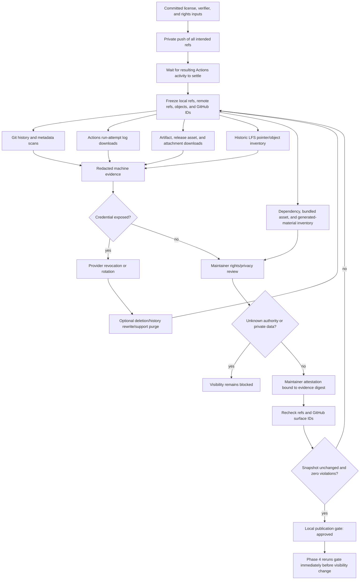

# Phase 3: Public Disclosure and GPL Readiness - Research

**Researched:** 2026-09-05
**Domain:** Pre-publication disclosure audit, credential remediation, rights provenance, and GPL-3.0-or-later readiness
**Confidence:** MEDIUM

<user_constraints>
## User Constraints (from CONTEXT.md)

### Locked Decisions

None explicitly recorded.

### Claude's Discretion

All implementation choices are at Claude's discretion — discuss phase was skipped per user setting. Use ROADMAP phase goal, success criteria, and codebase conventions to guide decisions.

### Deferred Ideas (OUT OF SCOPE)

None — discuss phase skipped.
</user_constraints>

<phase_requirements>
## Phase Requirements

| ID | Description | Research Support |
|----|-------------|------------------|
| SRC-02 | Public visibility remains blocked until all intended refs, history, Actions logs and artifacts, releases, attachments, and LFS objects pass a credential, secret, and private-data review, with exposed credentials revoked or rotated first. | Frozen ref and GitHub-surface manifests, full-history and downloaded-surface scans, explicit remediation records, and a fail-closed publication gate. |
| LIC-01 | Cumpa application source and npm releases consistently declare `GPL-3.0-or-later` and include the complete GPLv3 license text. | Exact SPDX/package metadata, canonical root license text, scoped MIT exception for the marketplace skill, and source/package assertions. |
| LIC-03 | Maintainers verify authority to license first-party contributions and resolve incompatible or unknown third-party and generated material before publication. | Author/material/dependency inventory, notice and compatibility dispositions, maintainer attestations, and blocking rules for unknown authority. |
</phase_requirements>

## Phase Success Criteria Coverage

| # | Required outcome | Research-backed implementation |
|---|------------------|--------------------------------|
| 1 | Maintainers can inspect every intended ref/history plus Actions logs/artifacts, releases, attachments, and LFS objects; unresolved exposure blocks visibility. | The Disclosure Surface Matrix defines authoritative collection, completeness proof, and fail-closed conditions for each named surface. [VERIFIED: `.planning/ROADMAP.md` Phase 3 criterion 1] |
| 2 | Exposed credentials are revoked or rotated before visibility changes; unresolved secrets/private data stop publication. | Credential remediation is provider-side, precedes removal, is separately attested, and remains a gate violation until a clean rescan. [VERIFIED: `.planning/ROADMAP.md` Phase 3 criterion 2] |
| 3 | First-party authority is traceable and incompatible/unknown third-party or generated material is resolved. | The rights ledger covers authors, ownership, copied/generated material, dependencies, bundled bytes, licenses, notices, and exact dispositions. [VERIFIED: `.planning/ROADMAP.md` Phase 3 criterion 3] |
| 4 | Application source/package inputs declare `GPL-3.0-or-later` and include complete GPLv3 text before public visibility. | Exact package/lock metadata, canonical root text, scoped MIT boundary, and byte/inventory checks are prescribed. [VERIFIED: `.planning/ROADMAP.md` Phase 3 criterion 4] |

## Summary

Phase 3 should implement a **fail-closed, versioned disclosure evidence pipeline**, not a one-time prose checklist. The pipeline must freeze the exact local and GitHub state intended for publication, inspect every required Git and GitHub surface, emit only redacted evidence, require explicit human dispositions for privacy and rights questions, and refuse approval when any surface, finding, credential remediation, or authority decision is incomplete. GitHub documents that making a private repository public exposes the code and Actions history/logs, while GitHub secret scanning does not cover Actions logs or artifacts. [CITED: https://docs.github.com/en/repositories/managing-your-repositorys-settings-and-features/managing-repository-settings/setting-repository-visibility] [CITED: https://docs.github.com/en/code-security/concepts/secret-security/secret-scanning]

The current repository is **not yet approvable**. It has 831 reachable commits attributed to one author identity whose personal Gmail address would be disclosed, 48 Actions runs, 19 retained artifacts, no authoritative historic LFS audit, no root license, no `package.json.license`, and no scoped license for the independently MIT-licensed marketplace skill. Tracked history also contains absolute home paths, TrustLayer repository/branch/OID references, and production deployment identifiers that require explicit privacy classification. [VERIFIED: `git rev-list --all --count`, `git shortlog -sne --all`, GitHub REST API, `package.json`, `.kimi-code/skills/cumpa/SKILL.md`, `.planning/debug/empty-branch-comparison.md`]

The final scan/gate bundle should live in the already-gitignored `.cumpa/publication/` directory, not be committed to `main`. Every push to `main` currently triggers the production workflow, so committing a final scan report would create a new run/log/artifact after the scan and immediately make the report stale. Commit and privately push all source, license, verifier, and reviewed notice changes first; wait for resulting workflows; then freeze, scan, attest, and gate locally. Phase 4 must rerun the same gate after its final private push and immediately before changing visibility. [VERIFIED: `.github/workflows/deploy-supabase-production.yml:3-5`, `.gitignore`]

**Primary recommendation:** Build one read-only collector/verifier that binds complete machine inventories to a separate maintainer attestation and produces `approved_for_public_visibility: true` only when every required surface is complete, every finding is resolved or explicitly accepted for public disclosure, exposed credentials have prior revocation/rotation evidence, rights are approved, licensing inputs are exact, and the frozen snapshot is unchanged.

## Architectural Responsibility Map

| Capability | Primary Tier | Secondary Tier | Rationale |
|------------|--------------|----------------|-----------|
| Intended Git refs, commits, trees, blobs, and author metadata | Repository / Git storage | GitHub Git service | Installed Git is the project source of truth; remote refs must be reconciled separately. [VERIFIED: `.claude/CLAUDE.md`, `git ls-remote origin`] |
| Actions runs, attempts, logs, and artifacts | GitHub Actions service | Local audit workspace | These objects live outside Git object history and require authenticated REST downloads while the repository is private. [CITED: https://docs.github.com/en/rest/actions/workflow-runs] [CITED: https://docs.github.com/en/rest/actions/artifacts] |
| Releases, release assets, collaboration text, and attachments | GitHub repository service | Local audit workspace | Releases/assets and regular tags are distinct; attachment URLs must be derived from all bodies/comments and downloaded. [CITED: https://docs.github.com/en/rest/releases/releases] |
| Historic LFS pointers and objects | Git LFS storage | Git repository refs | `git lfs ls-files --all` includes prior versions no longer in the current tree; object availability/integrity remains an LFS concern. [CITED: https://github.com/git-lfs/git-lfs/blob/main/docs/man/git-lfs-ls-files.adoc] |
| Credential revocation or rotation | Credential provider / GitHub settings | Evidence aggregator | A scanner cannot revoke a provider credential; provider action must precede history cleanup or approval. [CITED: https://docs.github.com/en/authentication/keeping-your-account-and-data-secure/removing-sensitive-data-from-a-repository] |
| Privacy acceptability and first-party licensing authority | Maintainer / qualified legal governance | Automated inventory | Tools can enumerate authors and strings but cannot decide consent, employer ownership, confidentiality, or legal authority. [CITED: https://opensource.guide/legal/] |
| Dependency, vendored, asset, and generated-material disposition | Maintainer / qualified legal governance | Lockfile, source, and package inventories | Metadata identifies candidates; actual shipped bytes and retained notices determine the review scope. [CITED: https://opensource.guide/legal/] |
| GPL declaration and package license inputs | Repository and npm package metadata | Verifier | SPDX supplies the exact identifier/text and npm consumes an SPDX license expression. [CITED: https://spdx.org/licenses/GPL-3.0-or-later.html] [CITED: https://docs.npmjs.com/cli/v11/configuring-npm/package-json/#license] |
| Public-visibility decision | Phase 4 GitHub settings action | Phase 3 local publication gate | Visibility change is external and consequential; Phase 3 supplies a fresh gate but must not perform the change. [CITED: https://docs.github.com/en/repositories/managing-your-repositorys-settings-and-features/managing-repository-settings/setting-repository-visibility] |

## Project Constraints (from `.claude/CLAUDE.md`)

- Use Node.js 24 and TypeScript/ESM conventions; do not introduce another application runtime. [VERIFIED: `.claude/CLAUDE.md`, `package.json`]
- Invoke installed Git with argument arrays as the source of truth; do not reimplement Git ref, history, rename, or object semantics. [VERIFIED: `.claude/CLAUDE.md`]
- Keep repository-local generated state under gitignored `.cumpa/`; committed planning documents may describe the policy but must not contain raw secrets or unapproved private data. [VERIFIED: `.claude/CLAUDE.md`, `.gitignore`]
- Reuse the existing evidence style: versioned records, strict input validation, status plus `violations`, commit/input SHA-256 bindings, and self-digest verification. [VERIFIED: `scripts/verify-supabase-support.mjs`]
- Do not redesign review, protocol, or hosted-support behavior in this milestone. [VERIFIED: `.planning/REQUIREMENTS.md` Out of Scope]

## Phase Boundary

### Phase 3 owns

1. Exact GPL application/source inputs: root `LICENSE`, `package.json.license`, lockfile consistency, public license explanation, and explicit scoped MIT treatment for `.kimi-code/skills/cumpa/`. [VERIFIED: SRC-02, LIC-01, LIC-03]
2. Reusable read-only disclosure collection and gate verification. [VERIFIED: Phase 3 ROADMAP success criteria 1-2]
3. Rights/material inventory and explicit maintainer dispositions. [VERIFIED: Phase 3 ROADMAP success criterion 3]
4. Credential-remediation evidence and a passing gate over the exact privately hosted state. [VERIFIED: Phase 3 ROADMAP success criteria 1-4]

### Later phases own

- Phase 4 changes repository visibility, establishes the npm namespace, sets version `1.5.0`, finalizes public documentation/package contents, and excludes the independently MIT-licensed skill from npm. [VERIFIED: Phase 4 ROADMAP and PKG-03/PKG-04/PKG-06/REL-01]
- Phase 5 publishes the stable package through trusted publishing and proves exact Corresponding Source. [VERIFIED: Phase 5 ROADMAP and LIC-02/PKG-05/REL-02]
- Phase 6 publishes the separately MIT-licensed marketplace skill. [VERIFIED: Phase 6 ROADMAP and SKL-01 through SKL-04]

Do not make the repository public, create releases/tags, publish npm packages, or rewrite/delete remote data automatically in Phase 3. Those are external actions with consequences and require explicit checkpoints. [CITED: https://docs.github.com/en/repositories/managing-your-repositorys-settings-and-features/managing-repository-settings/setting-repository-visibility] [CITED: https://docs.github.com/en/authentication/keeping-your-account-and-data-secure/removing-sensitive-data-from-a-repository]

## Repository Evidence Snapshot

This is research-time evidence, not the final approval snapshot. The collector must rerun immediately before approval because local `main`, remote refs, runs, artifacts, and settings can change. [VERIFIED: live Git/GitHub inspection]

| Surface | Observed 2026-09-05 | Planning consequence |
|---------|---------------------|----------------------|
| Repository visibility | `Ship-With-AI/cumpa` is private; default branch is `main`. [VERIFIED: GitHub REST API] | Keep it private through collection, remediation, approval, and the Phase 4 preflight. |
| Published refs | Remote advertises only `HEAD` and `refs/heads/main`; no tags. Local refs observed were `main`, `origin/HEAD`, and `origin/main`. [VERIFIED: `git ls-remote origin`, `git for-each-ref`] | Final evidence must freeze both intended local tips and actual remote tips; a zero-tag result needs a recorded manifest, not an assumption. |
| Local/remote relation | Local `main` was 13 commits ahead and 0 behind `origin/main`. [VERIFIED: `git rev-list --left-right --count origin/main...main`] | A gate over the current remote alone is insufficient; all intended commits must be privately pushed before the final Phase 4 gate. |
| Reachable Git history | 831 commits; one `git shortlog` identity accounts for all 831. No `Co-authored-by`, `Signed-off-by`, or `Generated-by` commit-message matches were found. [VERIFIED: Git commands] | One Git identity narrows the authority review but does not prove copyright ownership or employer/client permission. |
| Commit email privacy | All 831 commits expose `alessandro.magionami@gmail.com` in author metadata if their history is public. GitHub says changing the configured email only affects future commits. [VERIFIED: `git shortlog -sne --all`] [CITED: https://docs.github.com/en/account-and-profile/how-tos/email-preferences/setting-your-commit-email-address] | Maintainer must explicitly accept this disclosure or complete a coordinated history rewrite and rescan. |
| Tracked private-data candidates | `.planning/debug/empty-branch-comparison.md` contains TrustLayer repository paths, branch names, and commit OIDs; historical planning files contain `/Users/alessandro/...` paths. [VERIFIED: repository search] | These are unresolved until a maintainer records `accepted-public` or removes them from all intended history. |
| Hosted identifiers | v1.4 evidence includes the canonical Supabase public origin, GitHub run IDs, and deployment fingerprints. Project policy permits the complete canonical public origin but forbids bare project refs, credentials, OAuth/PII values, provider IDs, and provider secrets. [VERIFIED: `docs/support-service-operations.md`, `.planning/milestones/v1.4-phases/`] | Preserve the existing exact-origin allowance only through an explicit finding disposition; scan all other hosted identifiers. |
| Actions | 48 workflow runs and 19 non-expired retained artifacts. Artifact names include production release/evidence outputs. [VERIFIED: GitHub Actions REST API] | Download every run attempt's logs and every artifact; metadata counts alone do not satisfy SRC-02. |
| Releases and collaboration | 0 releases, 0 regular tags, 0 issues/PRs, and 0 commit comments; wiki and Discussions are disabled. [VERIFIED: GitHub REST API and `gh repo view`] | Record complete paginated responses and disabled settings; repeat at freeze time and still parse any newly created attachment-bearing content. |
| Action credential names | No repository-level Action secrets. The `production` environment exposes five secret names (`STRIPE_SECRET_KEY`, `STRIPE_WEBHOOK_SECRET`, `SUPABASE_ACCESS_TOKEN`, `SUPABASE_DB_PASSWORD`, `SUPABASE_GITHUB_CLIENT_SECRET`) and five variable names. Values were not requested. [VERIFIED: GitHub REST API] | Match scan findings to providers without ever copying secret values into evidence. A configured secret name alone is not evidence that its value leaked. |
| Organization secret visibility | Current credentials received HTTP 403 when listing organization Action secrets. [VERIFIED: GitHub REST API] | Do not broaden auth automatically. Require an organization-owner attestation or an explicitly authorized read-only inventory if workflow-accessible organization secrets matter to a finding. |
| LFS | No current `.gitattributes`/`.lfsconfig` and no historic standard LFS pointer marker found, but `git-lfs` is not installed. [VERIFIED: file/history inspection and local command lookup] | Absence indicators are useful preliminary evidence but do not replace `git lfs ls-files --all --json`; final LFS status remains blocked until the tool runs successfully. |
| License files | No root `LICENSE`, `COPYING`, `NOTICE`, `THIRD_PARTY*`, REUSE config, or `package.json.license`. [VERIFIED: root file inventory and `package.json`] | LIC-01 currently fails. |
| MIT skill boundary | `.kimi-code/skills/cumpa/` has `SKILL.md` only, no scoped license, and is currently included by `package.json.files`. [VERIFIED: repository inventory and `package.json:13-16`] | Add a scoped MIT license and explain the boundary now; Phase 4 removes the skill from the npm package. |
| Dependency metadata | 254 lockfile package entries declare licenses; none lack a license field. Counts include MIT 191, Apache-2.0 26, MPL-2.0 12, ISC 10, BSD-3-Clause 5, BlueOak-1.0.0 5, BSD-2-Clause 2, and four other/compound entries. [VERIFIED: `package-lock.json` query] | This is inventory evidence only. It does not prove actual bundled-byte provenance, compatibility, or notice compliance. |
| Bundled notices | The web build contains Monaco workers/assets including `codicon` font bytes, while `node_modules/monaco-editor/ThirdPartyNotices.txt` contains incorporated third-party notices and license terms. [VERIFIED: `dist/web/assets/`, `node_modules/monaco-editor/ThirdPartyNotices.txt`] | Rights review must trace bundled assets and preserve applicable notices; do not infer sufficiency from Monaco's package-level MIT field. |

## Recommended Evidence and Gate Architecture

### Storage split

| Artifact | Location | Committed? | Content rule |
|----------|----------|------------|--------------|
| GPL and scoped-license inputs | `LICENSE`, `package.json`, `package-lock.json`, `.kimi-code/skills/cumpa/LICENSE`, `README.md` | Yes | Public, canonical license declarations only. |
| Third-party notice source | `THIRD_PARTY_NOTICES.md` | Yes | Reviewed notices/source references for material actually conveyed; no scanner output or private data. |
| Rights review summary | `.planning/phases/03-public-disclosure-and-gpl-readiness/03-RIGHTS-REVIEW.md` | Yes, before the final private push | Public-safe inventory/dispositions and approval references; exact sensitive details stay local. |
| Collector/verifier | `scripts/verify-public-disclosure.mjs` | Yes | Read-only by default; external destructive operations are prohibited. |
| Download workspace | OS temporary directory created with `mkdtemp` | No | Raw logs/artifacts/attachments, mode-restricted, never printed, deleted after review/evidence generation. |
| Redacted machine evidence | `.cumpa/publication/disclosure-evidence.json` | No | IDs, counts, statuses, paths/rule IDs, and SHA-256 bindings; never raw credential values or deterministic hashes of secret values. |
| Maintainer attestation | `.cumpa/publication/maintainer-attestation.json` | No | Exact evidence digest, intended refs, privacy/rights dispositions, credential remediation references, reviewer, and approval time. |
| Final gate | `.cumpa/publication/publication-gate.json` | No | Exact evidence/attestation digests, frozen state, violation count, and `approved_for_public_visibility`. |

The local final bundle avoids a self-invalidating audit loop: committing or pushing the report would change Git history and the current workflow would create another Actions surface. [VERIFIED: `.github/workflows/deploy-supabase-production.yml:3-5`] The committed verifier and public-safe rights/license inputs remain reviewable, while Phase 4 consumes a fresh local gate after its last private push. [RECOMMENDED]

### Evidence record minimum fields

```json
{
  "version": 1,
  "kind": "cumpa.public-disclosure-evidence",
  "status": "blocked",
  "repository": {
    "owner": "Ship-With-AI",
    "name": "cumpa",
    "visibility": "private",
    "default_branch": "main"
  },
  "snapshot": {
    "intended_refs_sha256": "<64 hex>",
    "remote_refs_sha256": "<64 hex>",
    "reachable_objects_sha256": "<64 hex>",
    "before_after_equal": true
  },
  "tools": [],
  "surfaces": [],
  "findings": [],
  "violations": [],
  "artifacts": { "evidence_sha256": "<self digest with this field blanked>" }
}
```

This follows the repository's existing version/status/violations/input-digest/self-digest convention. [VERIFIED: `scripts/verify-supabase-support.mjs:315-341,381-407,531-545`]

Each surface record should include: surface kind, authoritative endpoint/command, complete/incomplete status, item count, sorted immutable identifiers, raw response/archive SHA-256, scan report SHA-256, scanner exit classification, and unresolved finding count. [RECOMMENDED]

### Gate invariant

The verifier should compute approval rather than trust an editable boolean:

```text
approved_for_public_visibility =
  repository_is_still_private
  AND snapshot_before_equals_snapshot_after
  AND every_required_surface_is_complete
  AND every_finding_status_in(resolved, accepted-public)
  AND every_exposed_credential_has_prior_revoked_or_rotated_evidence
  AND rights_attestation_matches_exact_evidence_digest
  AND gpl_and_scoped_license_inputs_are_exact
  AND violations.length == 0
```

Missing fields, unknown statuses, count mismatches, API/download errors, scan errors, skipped oversized/binary content, stale digests, unavailable LFS objects, or a changed ref/run/artifact set must yield `approved_for_public_visibility: false`. [RECOMMENDED]

### Status vocabulary

- `pass`: authoritative inventory/scan completed with no findings.
- `resolved`: a finding has exact remediation or false-positive evidence and passed a rescan.
- `accepted-public`: maintainer explicitly approved disclosure of non-secret information for the exact location/scope.
- `blocked`: unresolved, unknown, inaccessible without an accepted non-exposure disposition, or failed.

Do not collapse `unknown`, `not-run`, `expired`, `404`, `403`, scanner warnings, or missing tools into `pass`. [RECOMMENDED]

## Architecture Patterns

### System Architecture Diagram



### Recommended Project Structure

```text
LICENSE                                      # Complete canonical GPLv3 text
THIRD_PARTY_NOTICES.md                       # Reviewed notices/source references
README.md                                    # GPL application + scoped MIT skill explanation
package.json                                 # exact GPL-3.0-or-later metadata
package-lock.json                            # root metadata consistency
.kimi-code/skills/cumpa/LICENSE              # complete scoped MIT license
scripts/verify-public-disclosure.mjs         # read-only collector/check/gate CLI
.planning/phases/03-public-disclosure-and-gpl-readiness/
└── 03-RIGHTS-REVIEW.md                      # public-safe disposition ledger
.cumpa/publication/                          # ignored, redacted generated evidence
├── disclosure-evidence.json
├── maintainer-attestation.json
└── publication-gate.json
```

### Pattern 1: Freeze → collect → attest → recheck → gate

**What:** Freeze all identifiers before downloads, collect/scan, obtain human decisions tied to the evidence digest, then enumerate refs and GitHub IDs again before approval. [RECOMMENDED]

**When to use:** At Phase 3 completion and again after Phase 4's final private push. [RECOMMENDED]

**Why:** Otherwise a commit, push, workflow rerun, artifact upload, comment, or release created during review can escape the scanned set. GitHub exposes Actions history/logs after visibility changes. [CITED: https://docs.github.com/en/repositories/managing-your-repositorys-settings-and-features/managing-repository-settings/setting-repository-visibility]

### Pattern 2: Separate automation from authority

**What:** Machine evidence proves what was enumerated and what scanners reported; maintainer attestation decides intended-ref scope, acceptable public personal/operational data, first-party authority, compatibility, and remediation sufficiency. [RECOMMENDED]

**When to use:** For every privacy and licensing disposition. [CITED: https://opensource.guide/legal/]

### Pattern 3: Redact at collection time

**What:** Invoke Gitleaks with 100% redaction, never print raw downloaded content, store locations/rule IDs rather than secret values, and never store a deterministic hash of a secret value. [RECOMMENDED]

**When to use:** Git history, commit/tag metadata, Actions logs/artifacts, releases/assets, and attachments. [CITED: https://github.com/gitleaks/gitleaks]

### Anti-Patterns to Avoid

- **Scanner-only approval:** Gitleaks detects secret patterns; it does not determine confidential names, personal email consent, employer ownership, copied/generated provenance, or legal compatibility. Use explicit human dispositions. [CITED: https://github.com/gitleaks/gitleaks] [CITED: https://opensource.guide/legal/]
- **Current-tree-only scan:** The publication includes reachable history and GitHub-hosted data. Freeze all intended refs, use Gitleaks Git mode, and enumerate non-Git surfaces separately. [CITED: https://github.com/gitleaks/gitleaks] [CITED: https://docs.github.com/en/code-security/concepts/secret-security/secret-scanning]
- **Commit the final evidence:** It changes the audited ref and triggers another production workflow run. Keep the final bundle under `.cumpa/publication/`. [VERIFIED: current workflow trigger and `.gitignore`]
- **Preemptive history rewrite:** Rewriting changes hashes, invalidates signatures/evidence, risks recontamination, and may require GitHub Support. Classify findings first; rewrite only when necessary and explicitly approved. [CITED: https://docs.github.com/en/authentication/keeping-your-account-and-data-secure/removing-sensitive-data-from-a-repository]
- **Treat lockfile `license` strings as legal approval:** Inspect actual source/package bytes, notice files, license expressions, bundled assets, and generated outputs. [CITED: https://opensource.guide/legal/]

## Standard Stack

### Core

| Tool / Library | Version | Purpose | Why Standard Here |
|----------------|---------|---------|-------------------|
| Node.js built-ins (`node:child_process`, `node:crypto`, `node:fs`, `node:os`, `node:path`) | 24.15.0 observed; project baseline `>=24` | Stream Git/GitHub output, create secure temp storage, hash evidence, and validate files | Already required; no new runtime or npm dependency. [VERIFIED: local versions, `package.json`] |
| Git CLI | 2.50.1 observed | Ref/object/history authority and immutable identifiers | Required project source of truth. [VERIFIED: `.claude/CLAUDE.md`, local version] |
| GitHub CLI | 2.90.0 observed | Authenticated private-repository REST enumeration and downloads | Reuses current authenticated access without handling token values in application code. [VERIFIED: local version, GitHub API calls] |
| Gitleaks | 8.30.1, published 2026-03-21 | Secret detection over Git history and downloaded directories/archives | Current upstream release; Git mode defaults to `git log -p -U0 --full-history --all`. [VERIFIED: official GitHub release/source] |
| Git LFS | 3.8.0, published 2026-08-28 | Historic LFS pointer/object inventory and integrity checks | Upstream `--all --json` support covers prior objects no longer in the current tree. [VERIFIED: official GitHub release/docs] |
| npm | 11.12.1 observed | Package metadata/lockfile synchronization and pack inventory | Existing project package manager and authoritative package-shape tool. [VERIFIED: local version, `.claude/CLAUDE.md`] |

### Supporting

| Tool | Version | Purpose | When to Use |
|------|---------|---------|-------------|
| Existing protected-value policy | Current repository version | Preserve project-specific Stripe/Supabase/GitHub and protected-input concepts | Supplement Gitleaks for project-specific identifiers; do not reuse its package-only scope as history coverage. [VERIFIED: `scripts/verify-production-artifacts.mjs:6-7`] |
| Info-ZIP `unzip` | 6.00 observed | Optional archive-member inventory without shell interpolation | Only if the collector needs member manifests beyond Gitleaks archive traversal; reject unsafe paths before extraction. [VERIFIED: local version] |
| SHA-256 via `node:crypto` | Node 24 | Evidence/input integrity bindings | Integrity only; do not describe an unsigned digest as authentication. [VERIFIED: existing verifier pattern] |

### Alternatives Considered

| Instead of | Could Use | Tradeoff |
|------------|-----------|----------|
| Gitleaks plus explicit non-Git downloads | GitHub secret scanning alone | Public repositories are scanned automatically, but that occurs too late for a pre-publication gate; private access depends on Secret Protection, and Actions logs/artifacts are outside its documented scope. [CITED: https://docs.github.com/en/code-security/concepts/secret-security/secret-scanning] |
| Installed Git/Git LFS CLIs | Custom Git/LFS parsing | Reimplements authoritative semantics and historic object handling; prohibited by project constraints. [VERIFIED: `.claude/CLAUDE.md`] |
| Versioned JSON plus attestation | Prose-only checklist | Prose cannot prove page/download completeness, bind exact inputs, or automatically fail stale snapshots. [RECOMMENDED] |
| Repository-local notice inventory | New license/SBOM npm dependency | Adds supply-chain and package-legitimacy scope; current lockfile and installed package notice files can be inventoried with Node and human review. [RECOMMENDED] |
| Targeted remediation | Rewrite all history by default | History rewrite has documented destructive side effects and is unnecessary for findings explicitly accepted for public disclosure. [CITED: https://docs.github.com/en/authentication/keeping-your-account-and-data-secure/removing-sensitive-data-from-a-repository] |

**Installation:** No npm packages are recommended. Before execution, supply the official pinned Gitleaks 8.30.1 and Git LFS 3.8.0 binaries, verify their reported versions, and record their release/checksum provenance. [VERIFIED: official upstream releases]

## Package Legitimacy Audit

Not applicable — Phase 3 should install no external npm/PyPI/crates packages. Gitleaks and Git LFS are operator binaries verified against their official upstream repositories/releases, not application dependencies. [VERIFIED: https://github.com/gitleaks/gitleaks/releases/tag/v8.30.1, https://github.com/git-lfs/git-lfs/releases/tag/v3.8.0]

## Disclosure Surface Matrix

| Surface | Authoritative collection | Required proof | Block conditions |
|---------|--------------------------|----------------|------------------|
| Intended local refs | `git for-each-ref --sort=refname` plus maintainer include/exclude classification | Sorted ref/type/OID manifest and digest | Unclassified local branch/tag/note/stash that could be published; ref changes during scan |
| Remote refs | `git ls-remote --heads --tags origin` plus explicit `refs/pull/*` query | Remote URL, sorted ref/OID manifest, digest | Local intended tip not privately present, unexpected remote ref, failed fetch/query |
| Reachable commits/objects | `git rev-list --all --count`, `git rev-list --objects --all`, commit/tag metadata export | Counts and manifest digests before/after | Digest/count changes, command error, object unreadable |
| Git secrets | `gitleaks git --redact=100 --ignore-gitleaks-allow --report-format json` with no baseline/log override | Tool/config/version/report digest; exit 0 or finding exit 1 classified | Any other exit; unreviewed finding; allowlist/baseline suppression |
| Git private data | Project-specific pattern scan plus review of author/committer/tag metadata and non-text inventory | Redacted candidate ledger and maintainer dispositions | Personal/internal/operational data not individually resolved or accepted |
| Workflow runs | Paginated `GET /repos/{owner}/{repo}/actions/runs` | `total_count`, every run ID/attempt/head SHA/status, page digests | Accumulated count mismatch, pagination/download failure, running/queued workflow at freeze |
| Run logs | `GET .../runs/{run_id}/attempts/{attempt_number}/logs` for every attempt | Per-attempt archive digest and scan result | Deleted/inaccessible logs without explicit non-exposure disposition; scan error/finding |
| Actions artifacts | Paginated repository artifact list; download every non-expired artifact ZIP | Every artifact ID/name/size/expiry/digest/download digest and archive scan | Count mismatch, expired/410/undownloadable artifact without disposition, unsafe/skipped content, finding |
| Releases/assets | Authenticated paginated releases endpoint, including drafts; download each asset; tags separately | Release/asset IDs, bodies, state, digests; tag manifest | Missing page/asset, unreviewed draft/body/asset, release/tag mismatch |
| Issues/PRs/comments/reviews | Paginated APIs for all states; GraphQL for Discussions; wiki setting/clone when enabled; commit comments | IDs, bodies, comments/reviews, settings and response digests | Incomplete collaboration surface or unreviewed text |
| Attachments | Extract attachment URLs from every collected body/comment/release/wiki/discussion record; download with redirects | Source record ID, normalized URL, HTTP status, payload digest and scan | Unfetchable attachment still exposed, unreviewed payload, URL parser gap |
| Historic LFS | `git lfs ls-files --all --json`, fetch all, and `git lfs fsck --dry-run --objects --pointers` across intended revisions | Pointer path/OID/size inventory, local availability/integrity results | Tool missing, excluded paths, object missing/corrupt, pointer noncanonical, unreviewed binary |
| Repository settings | Authenticated repository metadata | Owner/name/database ID/default branch/visibility, wiki/discussion/issues settings | Not private during audit; identity mismatch; setting changes |
| Configured credential names | Repository/environment secret and variable APIs; org-owner attestation where relevant | Names and scopes only, never values | A detected credential cannot be mapped to a provider/owner for revocation |

GitHub's workflow-run API lists runs and supports run/attempt log downloads; the artifact API lists, downloads, and deletes artifacts; the releases API includes draft releases for callers with push access and states that ordinary tags are separate. [CITED: https://docs.github.com/en/rest/actions/workflow-runs] [CITED: https://docs.github.com/en/rest/actions/artifacts] [CITED: https://docs.github.com/en/rest/releases/releases]

## Automation, Attestation, and External Actions

| Class | Items | Rule |
|-------|-------|------|
| Automatable, read-only | Ref/object manifests; Git/metadata scans; API pagination; log/artifact/release/attachment downloads; archive and binary inventories; LFS inventory/integrity; package/license assertions; dependency/notice inventory; SHA-256 bindings; snapshot recheck | Collector may perform automatically, must fail closed, and must never mutate remote state. [RECOMMENDED] |
| Maintainer or qualified reviewer attestation | Intended publish refs; acceptance of personal email/home paths/internal references/public origin; first-party copyright/employer/client authority; copied/vendored/generated/AI material provenance; dependency compatibility and notice sufficiency; false positives; credential remediation proof | Attestation must identify reviewer, time, exact evidence digest, exact finding IDs, and rationale/evidence references. [CITED: https://opensource.guide/legal/] |
| External consequential action | Private push of intended refs; provider credential revocation/rotation; Actions run/artifact/release deletion; history rewrite/force push; collaborator/fork cleanup; GitHub Support purge; visibility change | Never hide inside the collector. Present explicit checkpoint, command/UI target, consequence, and required rescan. [CITED: https://docs.github.com/en/authentication/keeping-your-account-and-data-secure/removing-sensitive-data-from-a-repository] |

## Credential and Private-Data Blocking Rules

1. **Rotate/revoke first.** For every real credential finding, record provider, non-secret credential identifier, locations, `revoked` or `rotated`, timestamp, verifier, and an evidence reference before deletion or history rewriting. [CITED: https://docs.github.com/en/authentication/keeping-your-account-and-data-secure/removing-sensitive-data-from-a-repository]
2. **Never persist the credential.** Store Gitleaks fingerprint/location/rule ID and remediation reference, not raw match bytes, command lines containing values, or hashes of the secret value. [RECOMMENDED]
3. **Rescan after remediation.** Rotation fixes exploitability, not disclosure; if the value or private data must be removed, complete the approved cleanup and rerun every affected surface. [CITED: https://docs.github.com/en/authentication/keeping-your-account-and-data-secure/removing-sensitive-data-from-a-repository]
4. **No blanket allowlists.** A false positive is `resolved` only when the exact finding has a reviewer/rationale; a non-secret private-data candidate is `accepted-public` only for its exact scope. [RECOMMENDED]
5. **History cleanup is coordinated.** A rewrite must inventory PR refs, cached views, forks/clones, collaborators, signatures, branch protections, LFS orphan output, Actions evidence bound to old SHAs, and local worktrees before force-pushing. GitHub may need to purge cached/PR/LFS remnants. [CITED: https://docs.github.com/en/authentication/keeping-your-account-and-data-secure/removing-sensitive-data-from-a-repository]
6. **Current concrete review items block by default.** The Gmail author identity, absolute `/Users/alessandro` paths, TrustLayer references/OIDs, and production identifiers need explicit dispositions before approval. [VERIFIED: repository/history inspection]
7. **The canonical Supabase origin is not automatically a violation.** Existing policy explicitly permits its complete URL while forbidding the bare ref and protected values; record an exact `accepted-public` disposition rather than globally suppressing `.supabase.co`. [VERIFIED: `docs/support-service-operations.md:9-13`]

## Rights and Third-Party Review

### First-party authority ledger

The 831-commit/one-author result is a starting inventory, not a legal conclusion. GitHub's Open Source Guide says existing copyright holders, employers, and contribution licensing must be considered when adding/changing a license. [VERIFIED: Git history] [CITED: https://opensource.guide/legal/]

The attestation must answer:

- Does the listed author personally own the contributions, or does an employer/client/school own or control any part? [CITED: https://opensource.guide/legal/]
- If another entity may own rights, what assignment, policy, permission, or disclaimer authorizes GPL-3.0-or-later publication? [CITED: https://spdx.org/licenses/GPL-3.0-or-later.html]
- Were snippets, templates, fixtures, schemas, assets, fonts, SQL, workflow content, or documentation copied/adapted from third parties, and where are their terms/notices? [CITED: https://opensource.guide/legal/]
- What code/material was AI-assisted or generated, what source/tool produced it, and does the maintainer accept responsibility and have authority to publish it? [CITED: https://opensource.guide/legal/]
- Are there contributions represented outside Git author metadata (squashed work, pair programming, supplied patches, generated inputs)? [RECOMMENDED]

Any unknown answer keeps the gate blocked; automation must not declare the maintainer the sole copyright holder. [RECOMMENDED]

### Material/dependency ledger

For every first-party, dependency, vendored, generated, or bundled material class, record:

| Field | Required content |
|-------|------------------|
| Identity | Package/path/asset/generator and exact version or digest |
| Origin | Canonical source repository/package URL and source path |
| Shipped form | Source, installed runtime dependency, browser bundle, worker, font/asset, generated code, documentation, or excluded dev-only input |
| License evidence | SPDX expression plus exact upstream license/notice file digest |
| Obligations | Copyright/license retention, NOTICE/attribution, source-location, modified-file marking, or other condition |
| GPL disposition | Compatible/dual-license choice, separate aggregate, replace/remove, or blocked for qualified review |
| Resolution evidence | Committed notice/source link/removal diff and reviewer approval |

The current lockfile's 254 populated license fields do not close this ledger. In particular, `lightningcss` platform packages report MPL-2.0, `dompurify` reports `(MPL-2.0 OR Apache-2.0)`, and `argparse` reports Python-2.0; these need exact source/license selection and shipped-form classification rather than name-only assumptions. [VERIFIED: `package-lock.json`]

MPL 2.0 can participate in a GPL larger work only under its Section 3.3 conditions, and Mozilla states that minified JavaScript is executable form whose recipients must be told how to obtain the MPL-covered source. Inspect whether each MPL file is marked “Incompatible With Secondary Licenses” and preserve required notices/source directions. [CITED: https://www.mozilla.org/en-US/MPL/2.0/FAQ/]

The generated Monaco browser assets make `node_modules/monaco-editor/ThirdPartyNotices.txt` a concrete notice input. Preserve all applicable third-party notices in the public notice source rather than hand-summarizing them. [VERIFIED: bundled assets and Monaco notice file]

**Legal boundary:** The collector can verify inventory completeness and exact bytes, but only the maintainer or a qualified reviewer should approve authority, compatibility, and notice sufficiency. [CITED: https://opensource.guide/legal/]

## GPL Readiness

### Required declarations

1. Create root `LICENSE` from the verbatim complete SPDX/GNU GPLv3 text, including Sections 0-17 and “How to Apply These Terms to Your New Programs”; do not paraphrase it. [CITED: https://spdx.org/licenses/GPL-3.0-or-later.html]
2. Set `package.json` to the exact SPDX expression `"license": "GPL-3.0-or-later"`; synchronize the root package metadata in `package-lock.json`. npm documents SPDX expressions for the `license` field. [CITED: https://docs.npmjs.com/cli/v11/configuring-npm/package-json/#license]
3. State in `README.md` that the Cumpa application is GPL-3.0-or-later and that `.kimi-code/skills/cumpa/` is an independently MIT-licensed component governed by its scoped license. [VERIFIED: LIC-01 plus Phase 6 skill boundary]
4. Add the complete MIT license at `.kimi-code/skills/cumpa/LICENSE` with the correct copyright holder/year; the scoped license prevents the root GPL declaration from ambiguously claiming the independent skill. [VERIFIED: Phase 6 requirements and current missing file]
5. Create reviewed `THIRD_PARTY_NOTICES.md` from actual conveyed material and retained upstream notices. Phase 4 must ensure it and the GPL text are in the package candidate while removing the skill. [VERIFIED: current bundle/notice evidence and Phase 4 success criterion 2]

### Verification contract

The Phase 3 verifier should assert:

- `package.json.license === "GPL-3.0-or-later"` and the lockfile root metadata agrees. [RECOMMENDED]
- Root `LICENSE` bytes match the pinned canonical text/digest; required section markers alone are not sufficient. [CITED: https://spdx.org/licenses/GPL-3.0-or-later.html]
- `README.md` names both scopes without implying the MIT skill licenses the application. [RECOMMENDED]
- `.kimi-code/skills/cumpa/LICENSE` matches the canonical MIT text plus approved holder/year. [CITED: https://spdx.org/licenses/MIT.html]
- `npm pack --dry-run --ignore-scripts --json` inventory includes the expected license/notice inputs; Phase 4 repeats this against the real built tarball and asserts the skill is absent. [RECOMMENDED]
- The rights ledger has no unknown/incompatible/unresolved material and references the notice source digest. [RECOMMENDED]

GPLv3 Sections 4-6 govern license notices and source/object conveyance, and Section 6 defines Corresponding Source duties for object distributions. Phase 3 prepares consistent inputs; Phase 5 proves exact Corresponding Source for the compiled release. [CITED: https://spdx.org/licenses/GPL-3.0-or-later.html] [VERIFIED: LIC-02 phase mapping]

## Affected Paths

| Path | Planned responsibility |
|------|------------------------|
| `LICENSE` | New complete canonical GPLv3 text. |
| `package.json` | Add exact `GPL-3.0-or-later` license metadata and the notice input needed by future packages; do not change public package identity/version in this phase. |
| `package-lock.json` | Keep root metadata consistent after the package manifest change. |
| `README.md` | Add concise application GPL / marketplace-skill MIT scope explanation only; Phase 4 owns installation/release documentation. |
| `.kimi-code/skills/cumpa/LICENSE` | Add complete scoped MIT license. |
| `THIRD_PARTY_NOTICES.md` | Preserve reviewed notices/source references for conveyed dependencies, workers, fonts/assets, and generated output. |
| `scripts/verify-public-disclosure.mjs` | Read-only collect/check/gate implementation with strict schemas, redaction, temp cleanup, and no remote mutations. |
| `.planning/phases/03-public-disclosure-and-gpl-readiness/03-RIGHTS-REVIEW.md` | Public-safe authority/material/dependency disposition summary, completed before the final private push. |
| `.cumpa/publication/*.json` | Generated ignored evidence, attestation, and final gate; never commit. |

## Code Examples

### Freeze Git manifests without shell interpolation

```javascript
// Source: project Git boundary + Node.js standard library
import { spawn } from 'node:child_process';
import { createHash } from 'node:crypto';

const args = [
  'for-each-ref',
  '--sort=refname',
  '--format=%(refname)%00%(objectname)%00%(objecttype)',
];
const child = spawn('git', args, { cwd: repositoryPath, stdio: ['ignore', 'pipe', 'pipe'] });
const digest = createHash('sha256');
child.stdout.on('data', (chunk) => digest.update(chunk));
// Capture stderr, require exit code 0, and retain count + digest in the evidence record.
```

Use argument arrays and stream large outputs/downloads; do not construct shell command strings or buffer every artifact in memory. [VERIFIED: project Git constraints and existing Node patterns]

### Gitleaks scans

```bash
# Source: https://github.com/gitleaks/gitleaks
# No --log-opts: v8.30.1 defaults to --full-history --all.
gitleaks git \
  --redact=100 \
  --ignore-gitleaks-allow \
  --report-format json \
  --report-path .cumpa/publication/git-gitleaks.json \
  /absolute/path/to/repository

# Scan downloaded logs, artifacts, release assets, and attachments, including bounded nested archives.
gitleaks dir \
  --redact=100 \
  --ignore-gitleaks-allow \
  --max-archive-depth 3 \
  --report-format json \
  --report-path .cumpa/publication/github-surfaces-gitleaks.json \
  /private/temp/audit-directory
```

Gitleaks exit code 1 means findings were detected, not that collection failed; record it as a completed blocked scan. Any other nonzero exit or warning that content was skipped is a collector failure. [VERIFIED: Gitleaks CLI documentation/source]

### Required inventory commands

```bash
# Git topology/history
# Run fetch only at an explicit private-remote checkpoint.
git fetch --prune --tags origin
git ls-remote --heads --tags origin
git ls-remote origin 'refs/pull/*'
git for-each-ref --sort=refname --format='%(refname)%00%(objectname)%00%(objecttype)'
git rev-list --all --count
git rev-list --objects --all

# Git LFS
git lfs ls-files --all --json
git lfs fetch --all origin
# Run --dry-run fsck over every intended revision/range derived by the collector.
git lfs fsck --dry-run --objects --pointers <revision-or-range>

# GitHub surface examples; collector must paginate and compare totals.
gh api --paginate 'repos/Ship-With-AI/cumpa/actions/runs?per_page=100'
gh api --paginate 'repos/Ship-With-AI/cumpa/actions/artifacts?per_page=100'
gh api --paginate 'repos/Ship-With-AI/cumpa/releases?per_page=100'
```

`git lfs ls-files --all` inspects full history and includes earlier LFS object versions; `fsck --objects --pointers` checks object hashes/existence and pointer canonicality for supplied revisions. [CITED: https://github.com/git-lfs/git-lfs/blob/main/docs/man/git-lfs-ls-files.adoc] [CITED: https://github.com/git-lfs/git-lfs/blob/main/docs/man/git-lfs-fsck.adoc]

### Strict final check

```bash
node scripts/verify-public-disclosure.mjs check \
  --gate .cumpa/publication/publication-gate.json \
  --repository Ship-With-AI/cumpa \
  --require-visibility private \
  --require-current
```

`--require-current` should re-enumerate ref tips and GitHub surface IDs/counts and fail on any delta; it must not change visibility. [RECOMMENDED]

## Don't Hand-Roll

| Problem | Don't Build | Use Instead | Why |
|---------|-------------|-------------|-----|
| Git history/ref semantics | A JavaScript Git parser | Installed Git CLI with argument arrays | Publication must match Git's actual reachable refs/objects. [VERIFIED: project constraint] |
| Secret detection rules | A homegrown universal token regex | Pinned Gitleaks default rules plus narrow existing project-specific protected-value policy | Provider formats, entropy, archive traversal, and redaction are mature scanner concerns. [CITED: https://github.com/gitleaks/gitleaks] |
| Historic LFS parsing/fetching | Pointer/object protocol implementation | Pinned Git LFS CLI | `--all`, fetch, and fsck already encode LFS semantics. [CITED: https://github.com/git-lfs/git-lfs/blob/main/docs/man/git-lfs-ls-files.adoc] |
| GitHub pagination/download URLs | Scraped web pages | Authenticated GitHub REST/GraphQL APIs through `gh api` | Draft/private objects and expiring download redirects require authenticated APIs. [CITED: GitHub REST docs] |
| License text | A summarized or edited GPL/MIT file | Verbatim canonical SPDX/GNU texts | Changing license text can alter meaning and fails exact completeness. [CITED: https://spdx.org/licenses/GPL-3.0-or-later.html] |
| Legal compatibility/authority engine | Regex-based “compatible” boolean | Complete inventory plus maintainer/qualified legal disposition | Ownership, employer agreements, dual-license choice, and notice sufficiency are contextual legal decisions. [CITED: https://opensource.guide/legal/] |
| Secret remediation | Automatic delete/rewrite/force-push | Provider rotation plus explicit human-run GitHub/Git cleanup | Destructive cleanup has remote, clone, PR, signature, and LFS consequences. [CITED: GitHub sensitive-data remediation docs] |
| Evidence framework | New database/service | Versioned JSON, SHA-256, and existing `.cumpa/` storage | The data is local, bounded, and consumed by one verifier. [VERIFIED: existing project patterns] |

**Key insight:** Tools should prove inventory and byte-level integrity; humans should decide disclosure and rights; external providers should perform credential and visibility actions. Combining these roles hides gaps and makes unsafe automation likely. [RECOMMENDED]

## Common Pitfalls

### Pitfall 1: “Gitleaks passed, therefore publication is safe”
**What goes wrong:** Private repository names, personal emails, home paths, client material, unsupported binary content, or unlicensed/generated material can remain with zero secret-pattern findings. [VERIFIED: current repository candidates]
**Why it happens:** Secret scanners answer a narrower question than privacy and authority review. [CITED: https://github.com/gitleaks/gitleaks]
**How to avoid:** Keep separate secret, private-data, and rights ledgers; require attestation for the latter two. [RECOMMENDED]
**Warning signs:** Final report has only a scanner exit code and no author/material/surface manifests.

### Pitfall 2: Missing GitHub-hosted surfaces
**What goes wrong:** Git history is clean while Actions logs/artifacts or release/attachment payloads expose data after visibility changes. [CITED: GitHub visibility and secret-scanning docs]
**Why it happens:** GitHub secret scanning covers Git and collaboration text, not Actions logs/artifacts. [CITED: https://docs.github.com/en/code-security/concepts/secret-security/secret-scanning]
**How to avoid:** Paginate and download every required surface through authenticated APIs; bind IDs/counts/digests. [RECOMMENDED]
**Warning signs:** No per-attempt logs, artifact IDs, release asset IDs, or attachment URL inventory.

### Pitfall 3: Treating zero/404/expired as pass
**What goes wrong:** Missing content is silently labeled clean even though collection never inspected it. [RECOMMENDED]
**Why it happens:** API absence, retention, authorization, and true zero results are conflated. [CITED: GitHub Actions artifact API]
**How to avoid:** Record HTTP state and authoritative count; require explicit non-exposure disposition for unavailable objects. [RECOMMENDED]
**Warning signs:** Surface status says `pass` without endpoint response digest/count.

### Pitfall 4: Rotating after cleanup
**What goes wrong:** A valid credential remains exploitable during a slow or incomplete rewrite/purge. [CITED: GitHub sensitive-data remediation docs]
**Why it happens:** Removal is mistaken for revocation. [CITED: same]
**How to avoid:** Provider revoke/rotate first, then remove if required, then rescan. [CITED: same]
**Warning signs:** Cleanup commit predates the provider remediation record.

### Pitfall 5: Stale final evidence
**What goes wrong:** A new commit, workflow attempt, artifact, comment, or release appears after scanning. [RECOMMENDED]
**Why it happens:** Evidence is committed/pushed after collection or Phase 4 changes the repository without rerunning the gate. [VERIFIED: current push trigger]
**How to avoid:** Keep final evidence local, compare before/after snapshots, rerun after Phase 4's last private push, and change visibility immediately after a current gate. [RECOMMENDED]
**Warning signs:** Gate ref SHA differs from remote default-branch SHA or surface ID sets changed.

### Pitfall 6: Unclear root GPL versus MIT skill scope
**What goes wrong:** Recipients cannot tell which license governs the independently distributed skill, and the current npm files list includes it. [VERIFIED: `package.json`, skill directory]
**Why it happens:** A root license is treated as sufficient for a mixed-scope repository. [RECOMMENDED]
**How to avoid:** Add a scoped MIT license and README boundary now; Phase 4 excludes the skill from npm. [VERIFIED: Phase 4/6 requirements]
**Warning signs:** Only one root license exists and the skill directory has no notice.

### Pitfall 7: Lockfile-license complacency
**What goes wrong:** Bundled workers/fonts/minified code omit upstream notices/source directions even though every lockfile row has a license string. [VERIFIED: Monaco assets/notices]
**Why it happens:** Metadata is mistaken for actual conveyed-byte provenance. [CITED: Mozilla MPL FAQ]
**How to avoid:** Trace package/source/asset/generator to shipped bytes and preserve exact applicable notices. [RECOMMENDED]
**Warning signs:** No bundle/asset rows or upstream notice digests in the rights ledger.

### Pitfall 8: Unsafe archive/log handling
**What goes wrong:** Archive traversal, decompression bombs, symlinks, terminal escapes, or accidental stdout printing can compromise the audit host or leak the very secret being reviewed. [ASSUMED]
**Why it happens:** Authored artifacts/logs are treated as trusted text. [ASSUMED]
**How to avoid:** Use bounded archive depth/size/count, reject absolute and `..` paths before extraction, avoid following symlinks, process raw bytes, sanitize any displayed text, mode-restrict temp files, and always clean up. [RECOMMENDED]
**Warning signs:** `unzip` extracts directly into the repository or raw matches appear in terminal output.

## State of the Art

| Old Approach | Current Approach | When Changed | Impact |
|--------------|------------------|--------------|--------|
| `gitleaks detect` / `protect` | `gitleaks git`, `dir`, and `stdin` | Gitleaks 8.19.0 deprecated the old commands | Use current commands in plans and scripts. [CITED: https://github.com/gitleaks/gitleaks] |
| Current-tree LFS inspection | `git lfs ls-files --all --json` | Current Git LFS | Includes previous historic LFS versions, not only HEAD. [CITED: upstream Git LFS docs] |
| Public visibility followed by platform scanning | Private pre-publication local/API audit, then visibility | Required by SRC-02 | Public automatic secret scanning is a safety net, not the approval gate. [CITED: GitHub secret-scanning docs] |
| Package license metadata alone | Exact SPDX metadata + canonical text + rights/notices ledger + packed-byte verification | Current npm/SPDX guidance | Makes source and distribution inputs mutually checkable. [CITED: npm and SPDX docs] |

**Deprecated/outdated:**
- Gitleaks `detect` and `protect`: hidden/deprecated since 8.19.0; use `git`/`dir`. [CITED: https://github.com/gitleaks/gitleaks]
- Baseline suppression for initial disclosure: inappropriate because Phase 3 must review old findings, not ignore them. [RECOMMENDED]
- `GPL-3.0+`: use the exact current SPDX identifier `GPL-3.0-or-later`. [CITED: https://spdx.org/licenses/GPL-3.0-or-later.html]

## Environment Availability

| Dependency | Required By | Available | Version | Fallback |
|------------|-------------|-----------|---------|----------|
| Node.js | Collector/verifier | ✓ | 24.15.0 | — |
| npm | License/pack inventory | ✓ | 11.12.1 | — |
| Git | Ref/history/object manifest | ✓ | 2.50.1 (Apple Git-155) | — |
| GitHub CLI/auth | Private GitHub API inventory/download | ✓ | 2.90.0 | — |
| Gitleaks | Full history and downloaded-surface secret scan | ✗ | Required 8.30.1 | Supply official pinned binary before collection |
| Git LFS | Historic LFS inventory/fetch/fsck | ✗ | Required 3.8.0 | Supply official pinned binary before collection |
| Info-ZIP | Optional member inventory | ✓ | 6.00 | Use Gitleaks archive traversal when member extraction is unnecessary |
| Organization secret-list permission | Optional workflow credential-name completeness | ✗ | HTTP 403 with current auth | Organization-owner attestation or explicitly authorized read-only access |

**Missing dependencies with no fallback:**
- Gitleaks 8.30.1 is required before a secret-scan result can pass. [VERIFIED: command lookup]
- Git LFS 3.8.0 is required before the explicit LFS surface can pass. [VERIFIED: command lookup]

**Missing dependencies with fallback:**
- Organization secret-list access can be replaced by an organization-owner attestation when no unresolved scan finding depends on an unknown organization secret. Do not request broader OAuth scope automatically. [RECOMMENDED]

## Security Domain

Security enforcement is enabled at ASVS level 1. [VERIFIED: `.planning/config.json`]

### Applicable ASVS Categories

| ASVS Category | Applies | Standard Control |
|---------------|---------|------------------|
| V2 Authentication | Yes | Reuse authenticated `gh`; never read/store its token or place credentials on command lines. External provider actions require maintainer authentication. [CITED: GitHub Actions secrets guidance] |
| V3 Session Management | No | No application sessions are added or changed in this phase. [VERIFIED: phase boundary] |
| V4 Access Control | Yes | Require private-repository read access; treat 403/404 as incomplete unless an exact non-exposure disposition exists; do not escalate scopes automatically. [RECOMMENDED] |
| V5 Input Validation | Yes | Strictly validate GitHub JSON, record schemas/status enums, ref names/OIDs, download sizes, archive paths/depth, and every digest before use. [RECOMMENDED] |
| V6 Cryptography | Yes | Use Node SHA-256 for integrity bindings and provider-native credential rotation; never invent encryption/signatures or call a self-digest authenticated. [RECOMMENDED] |

### Known Threat Patterns

| Pattern | STRIDE | Standard Mitigation |
|---------|--------|---------------------|
| Raw credential copied into report/stdout | Information Disclosure | `--redact=100`, no raw match/hash, restricted temp directory, sanitized summaries. |
| Incomplete pagination or skipped download | Tampering / Information Disclosure | Compare accumulated IDs to authoritative totals; any failure blocks. |
| Ref or GitHub surface changes during scan | Tampering | Before/after manifests and exact-ID recheck immediately before gate/visibility. |
| Archive traversal, symlink, or decompression bomb | Elevation / Denial of Service | Bounded archive depth/size/count; validate names; no repository extraction; no symlink following. |
| Malicious log terminal-control content | Spoofing / Information Disclosure | Treat downloaded content as bytes; never echo raw logs/findings; escape UI output. |
| Evidence file modified after approval | Tampering | Self-digest plus cross-file digests; attestation binds exact evidence; gate recomputes all invariants. |
| Organization/API permission gap mistaken for absence | Elevation / Information Disclosure | Record 403 distinctly and require owner attestation/authorized inventory when relevant. |
| Destructive cleanup hidden in verifier | Tampering / Denial of Service | Collector is read-only; rotation/deletion/rewrite/visibility are explicit human checkpoints. |

## Assumptions Log

| # | Claim | Section | Risk if Wrong |
|---|-------|---------|---------------|
| A1 | Downloaded archives/logs should be treated as potentially hostile even though they originate from this repository's workflows. [ASSUMED] | Common Pitfalls / Security Domain | Without defensive limits, a malformed or unexpectedly large artifact could affect the audit host. |

No legal ownership, compatibility, privacy acceptability, or remediation sufficiency is assumed; those remain explicit attestation fields. [RECOMMENDED]

## Open Questions

1. **Which exact refs are intended for publication?**
   - What we know: Remote currently exposes only `main`; local `main` is ahead and no tags exist. [VERIFIED: Git inspection]
   - What's unclear: Whether any local-only refs/notes are intended, and when all Phase 3/4 commits will be privately pushed.
   - Recommendation: Maintainer signs the sorted intended-ref manifest; Phase 4 reruns the gate after its final private push.

2. **Are the existing personal/internal/operational identifiers acceptable public disclosures?**
   - What we know: Personal Gmail author metadata, home paths, TrustLayer refs/OIDs, and hosted production evidence are present. [VERIFIED: repository/history inspection]
   - What's unclear: Consent/confidentiality for each class.
   - Recommendation: Default each class to `blocked`; accept exact scopes explicitly or perform coordinated history remediation and full rescan.

3. **Who owns or can license all first-party contributions?**
   - What we know: One Git author identity covers all reachable commits. [VERIFIED: `git shortlog`]
   - What's unclear: Employer/client/school ownership, supplied/copied material, and AI/generated provenance are not proven by Git metadata.
   - Recommendation: Require maintainer/qualified legal attestation with evidence references before `approved`.

4. **Which upstream notice/source obligations apply to the actual package bytes?**
   - What we know: Lockfile metadata is complete, but Monaco bundles workers/assets and supplies a substantial third-party notice file; MPL and compound expressions exist. [VERIFIED: lockfile/build/node_modules inspection]
   - What's unclear: Exact production bundle membership and final notice/source directions until the Phase 4 package candidate is built.
   - Recommendation: Phase 3 resolves current source/bundle inventory and creates the notice source; Phase 4 reruns byte-level package mapping before visibility/package approval.

5. **Does an unresolved credential require remote history/data deletion after rotation?**
   - What we know: GitHub says rotation comes first and history rewriting has major side effects. [CITED: GitHub remediation docs]
   - What's unclear: No real credential finding has yet been produced because Gitleaks and the required downloads have not run.
   - Recommendation: Make deletion/rewrite a finding-specific maintainer checkpoint, never the default.

## Sources

### Primary (HIGH confidence: direct project evidence)

- `package.json`, `package-lock.json`, `.gitignore`, `.github/workflows/deploy-supabase-production.yml` — current package/license/storage/push-trigger facts.
- `scripts/verify-production-artifacts.mjs`, `scripts/verify-supabase-support.mjs` — current protected-value and evidence-integrity patterns.
- `.kimi-code/skills/cumpa/SKILL.md`, `dist/web/assets/`, `node_modules/monaco-editor/ThirdPartyNotices.txt` — current mixed-scope and bundled-material evidence.
- `.planning/debug/empty-branch-comparison.md`, `.planning/milestones/v1.4-phases/`, `docs/support-service-operations.md` — current disclosure candidates and established public-origin policy.
- Git commands and authenticated GitHub REST/GraphQL/CLI queries executed 2026-09-05 — refs, commit authors, visibility, Actions, releases, collaboration surfaces, settings, and secret-name inventories.

### Secondary (MEDIUM confidence: official/upstream documentation; seam-classified)

- https://docs.github.com/en/repositories/managing-your-repositorys-settings-and-features/managing-repository-settings/setting-repository-visibility — public visibility consequences.
- https://docs.github.com/en/authentication/keeping-your-account-and-data-secure/removing-sensitive-data-from-a-repository — revoke/rotate-first and rewrite/purge limitations.
- https://docs.github.com/en/code-security/concepts/secret-security/secret-scanning — Git/collaboration scan scope and private/public availability.
- https://docs.github.com/en/rest/actions/workflow-runs — run enumeration and attempt/log endpoints.
- https://docs.github.com/en/rest/actions/artifacts — artifact enumeration, download, expiry, and deletion endpoints.
- https://docs.github.com/en/rest/releases/releases — authenticated draft release and asset inventory; tags separate.
- https://docs.github.com/en/actions/how-tos/write-workflows/choose-what-workflows-do/use-secrets — secret scopes/access and log-masking limitations.
- https://docs.github.com/en/account-and-profile/how-tos/email-preferences/setting-your-commit-email-address — historic versus future commit email behavior.
- https://github.com/gitleaks/gitleaks and current source `sources/git.go` — scan modes, redaction/archive options, and default full-history/all-ref Git command.
- https://github.com/git-lfs/git-lfs/blob/main/docs/man/git-lfs-ls-files.adoc — historic LFS inventory.
- https://github.com/git-lfs/git-lfs/blob/main/docs/man/git-lfs-fsck.adoc — pointer/object consistency checks.
- https://spdx.org/licenses/GPL-3.0-or-later.html — exact SPDX ID and complete GPLv3 text.
- https://spdx.org/licenses/MIT.html — scoped MIT text.
- https://docs.npmjs.com/cli/v11/configuring-npm/package-json/#license — npm SPDX license metadata.
- https://www.mozilla.org/en-US/MPL/2.0/FAQ/ — MPL/GPL combinations, notices, and minified JavaScript.
- https://opensource.guide/legal/ — copyright-holder, employer, dependency, asset, privacy, and AI review topics.

### Tertiary (LOW confidence)

- None.

## Metadata

**Confidence breakdown:**
- Repository evidence: HIGH — directly inspected local Git/files and authenticated GitHub state; counts remain time-sensitive.
- Standard stack: HIGH — existing runtime/tools plus versions verified against local binaries and official releases.
- Disclosure architecture: MEDIUM — derived from authoritative platform scope and current workflow behavior; final completeness depends on execution-time API access/downloads.
- GPL identifier/text and npm metadata: HIGH — exact SPDX/npm primary documentation.
- Rights/compatibility conclusions: MEDIUM — inventory method is grounded, but final legal/privacy decisions intentionally require maintainer or qualified review.
- Pitfalls/security: MEDIUM — most are official/current; hostile-archive treatment is conservatively assumed.

**Research date:** 2026-09-05
**Valid until:** 2026-09-12 for GitHub/tool versions and live repository counts; SPDX/GPL findings are stable but must still be checked against exact source bytes.
