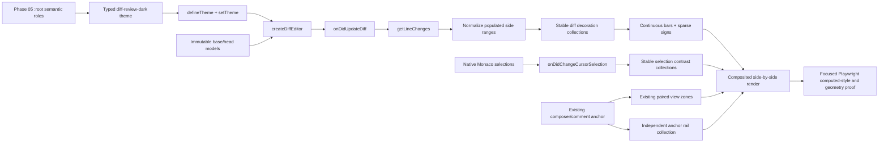

# Phase 06: Monaco Diff Semantics - Research

**Researched:** 2026-07-27
**Domain:** Monaco Editor 0.55.1 theming, diff decorations, composited interaction states, and Chromium verification
**Confidence:** HIGH

<user_constraints>
## User Constraints (from CONTEXT.md)

### Locked Decisions

### Diff layer language
- **D-01:** Whole-line addition and deletion treatments stay restrained; intraline changed spans carry stronger emphasis so exact changes lead without reducing code readability.
- **D-02:** Base/deletion and Head/addition must remain distinguishable without red-versus-green recognition through persistent signed gutter cues: `−` for deletion and `+` for addition, reinforced by the existing BASE/HEAD labels and side-by-side position.
- **D-03:** Multi-line changes use a continuous gutter change bar with sparse signed markers at the start and end of long contiguous blocks rather than repeating a sign on every row.
- **D-04:** Unchanged context stays close to the normal canvas, empty counterpart regions use a slightly more recessed neutral, and the hunk accent is reserved for reveal controls and separators. Avoid decorative textures or prominent blocks that compete with changed code.

### Overlapping state precedence
- **D-05:** Diff meaning is the persistent base layer. Interaction states should use distinct geometry—edges, outlines, rails, or affordance emphasis—rather than replacing addition or deletion meaning with another opaque row fill.
- **D-06:** Text selection uses a restrained blue fill plus a crisp visible edge. Signed gutter markers and the continuous change bar keep diff meaning identifiable beneath or beside the selection.
- **D-07:** The active line uses a subtle full-width edge plus stronger line-number emphasis. Hover should emphasize or reveal the existing comment affordance instead of applying another row background.
- **D-08:** A persistent comment anchor uses an inset rail or marker. Keyboard focus remains the existing two-pixel outer focus ring on the focused editor or control, so anchor location and focus location remain simultaneously legible.

### Claude's Discretion

Exact Monaco theme identifiers, syntax-token colors, opacity values, gutter/widget colors, border weights, and the implementation of sparse start/end signs remain flexible. Research and planning should choose the smallest documented Monaco surface that satisfies D-01 through D-08, the Phase 05 semantic contract, and composited contrast requirements without changing editor geometry or behavior. Syntax/canvas balance and detailed widget treatment were not selected for discussion and remain at Claude's discretion within the roadmap contract.

### Deferred Ideas (OUT OF SCOPE)

None — discussion stayed within phase scope.
</user_constraints>

<phase_requirements>
## Phase Requirements

| ID | Description | Research Support |
|----|-------------|------------------|
| DIFF-01 | User sees the Monaco diff canvas, syntax tokens, gutters, widgets, and surrounding workspace rendered from one coordinated dark semantic palette. | One typed `diff-review-dark` theme maps the Phase 05 root roles before editor construction; five approved syntax roles extend the same root and are parity-tested. [VERIFIED: `.planning/phases/06-monaco-diff-semantics/06-UI-SPEC.md`, `src/web/styles.css:1-78`] |
| DIFF-02 | User can distinguish added, deleted, intraline-changed, hunk, unchanged, and empty diff regions while code remains readable over every layer. | Exact 15% whole-line, 35% intraline, neutral unchanged/empty, and purple hunk mappings are defined below, with real-browser source-over contrast checks. [VERIFIED: `06-UI-SPEC.md:155-261`] |
| DIFF-03 | User can distinguish Base from Head and deletion from addition without relying on red and green alone. | Public `getLineChanges()` drives continuous bars and sparse literal `−`/`+` gutter decorations; existing BASE/HEAD labels and side position remain. [VERIFIED: `06-CONTEXT.md:D-02-D-03`, `DiffWorkspace.vue:254-271`, Monaco 0.55.1 `ILineChange`] |
| DIFF-04 | User sees legible line-number gutters, active-line emphasis, and the existing comment affordance without code movement or gutter reflow. | Theme roles control line numbers/active-line edge; decoration lanes and the existing absolutely positioned 32px action avoid new width, padding, injected text, or view zones. [VERIFIED: `styles.css:1043-1114`, `diff-adapter.ts:92-103`, `06-UI-SPEC.md:359-372`] |
| DIFF-05 | User can distinguish text selection, active lines, hover targets, comment anchors, keyboard focus, and addition or deletion meaning when those states overlap. | Separate collections and CSS channels preserve the required back-to-front precedence; a Chromium overlap matrix verifies computed styles, actual composites, and unchanged geometry. [VERIFIED: `06-UI-SPEC.md:337-387,509-533`] |
</phase_requirements>

## Summary

Phase 06 is a browser-only presentation integration at the existing `PublicMonacoDiffAdapter` boundary. The adapter already owns one immutable side-by-side editor, original/modified model identity, `onDidUpdateDiff`, `getLineChanges()`, glyph-margin allocation, paired comment view zones, hidden-region state, keyboard commands, and bounded disposal. The correct implementation adds theme registration before line 92's `createDiffEditor(...)`, then derives visual-only decorations from Monaco's public line changes and selections; it does not add another diff algorithm, change model text, or move review behavior into Vue. [VERIFIED: `src/web/monaco/diff-adapter.ts:67-179,252-299,401-491`; [Monaco 0.55.1 definitions](https://unpkg.com/monaco-editor@0.55.1/monaco.d.ts)]

The smallest maintainable cut is two narrow Monaco helpers—one typed theme contract and one pure semantic-decoration builder—integrated by `diff-adapter.ts`, with all CSS hooks kept in the single global `styles.css`. Theme literals are required because Monaco theme data is typed color data rather than a CSS-token consumer; a focused contract test must prove byte-for-byte parity with the one Phase 05 root so the typed object cannot become a parallel palette. [VERIFIED: `06-UI-SPEC.md:132-201`; [official Monaco theme sample](https://github.com/microsoft/monaco-editor/blob/main/website/src/website/data/playground-samples/customizing-the-appearence/tokens-and-colors/sample.js)]

Two Monaco implementation details require explicit handling beyond theme keys. First, `editor.selectionForeground` is documented as the selected-text color for high-contrast mode, so regular `vs-dark` selection needs a public inline decoration collection that applies the approved white foreground. Second, Monaco 0.55.1 implements empty alignment regions with a `.diagonal-fill` CSS gradient; setting `diffEditor.diagonalFill` alone changes the stripe color but does not remove the texture. The global stylesheet therefore needs pinned, browser-asserted hooks for `.selected-text`, `.diagonal-fill`, and the collapsed-region boundary, while all semantic data and editor behavior remain on documented public APIs. [VERIFIED: `node_modules/monaco-editor/esm/vs/platform/theme/common/colors/editorColors.js:35-40`; `node_modules/monaco-editor/esm/vs/editor/browser/widget/diffEditor/style.css:61-101,317-326`]

**Primary recommendation:** Define/select `diff-review-dark` synchronously before `createDiffEditor`, keep diff/selection/anchor decorations in independent stable collections, render bars/signs only in existing Monaco margin lanes, and make focused Chromium computed-style plus geometry assertions the phase gate. [VERIFIED: `06-CONTEXT.md:D-01-D-08`, `06-UI-SPEC.md:491-535`]

## Architectural Responsibility Map

| Capability | Primary Tier | Secondary Tier | Rationale |
|------------|--------------|----------------|-----------|
| Monaco theme registration and token colors | Browser / Client | CDN / Static bundle | Theme data is compiled into the Vite browser bundle and must be selected before the in-browser editor is constructed. [VERIFIED: `DiffWorkspace.vue:238-245`, `diff-adapter.ts:87-103`] |
| Diff computation and line/character mapping | Browser / Monaco | — | Monaco remains authoritative; `getLineChanges()` supplies presentation ranges and existing `counterpartBoundary()` consumes them. [VERIFIED: `diff-adapter.ts:107-112,422-427`; `line-mapping.ts:14-52`] |
| Sparse gutter semantics | Browser / Client | — | Phase code transforms public `ILineChange` ranges into decorative line/glyph-lane classes without changing source text. [CITED: https://unpkg.com/monaco-editor@0.55.1/monaco.d.ts] |
| Selection, active line, focus, and anchor composition | Browser / Client | — | Monaco theme states plus phase-owned CSS/decoration classes render separate channels in the same editor DOM. [VERIFIED: `06-UI-SPEC.md:337-387`] |
| Comment composer layout and persistence | Existing Browser / API boundaries | Repository-local JSON storage | This phase preserves the existing paired view zones, Vue rendering, API, and persistence; only the anchor rail and action presentation change. [VERIFIED: `diff-adapter.ts:401-491`, `DiffWorkspace.vue:124-250`, `06-CONTEXT.md:7-10`] |
| Verification | Browser / Chromium | Node test runner | Playwright drives real Monaco through the existing Vite prototype and full workspace seams; no server/storage contract changes are needed. [VERIFIED: `tests/integration/monaco-anchor.spec.ts:22-194`, `playwright.config.ts:3-21`] |

## Project Constraints (from `.claude/CLAUDE.md`)

- Use Node.js 24 LTS and TypeScript end to end; do not introduce another runtime or language. [VERIFIED: `.claude/CLAUDE.md:11-21`]
- Preserve Vue 3, Vite, and Monaco Diff Editor as the browser UI stack. [VERIFIED: `.claude/CLAUDE.md:17,38-43`]
- Preserve Monaco public APIs, side-by-side rendering, line mapping, accessibility labels, hidden regions, decorations, and view zones. [VERIFIED: `.claude/CLAUDE.md:56-62`]
- Keep Vitest for deterministic contracts and Playwright for the real browser review flow. [VERIFIED: `.claude/CLAUDE.md:21,42`]
- Do not alter API, Git, Zod, persistence, CLI, export, or server behavior in this presentation-only phase. [VERIFIED: `06-UI-SPEC.md:539-549`]
- Project-local skills are absent under the configured skill roots, so no additional SKILL.md conventions apply. [VERIFIED: project skill discovery and `.claude/CLAUDE.md:105-109`]

## Standard Stack

### Core

| Library / facility | Version | Purpose | Why Standard Here |
|--------------------|---------|---------|-------------------|
| `monaco-editor` | 0.55.1 pinned | Diff editor, typed theme, public line changes, selection/decorations, view zones | Already the shipped renderer and locked project boundary; npm registry and official repository identity were checked. [VERIFIED: `package.json:39`; npm registry; https://github.com/microsoft/monaco-editor] |
| Vue | 3.5.39 pinned | Existing `DiffWorkspace` lifecycle and comment-zone rendering | Preserve the existing component and event flow; no new component is needed. [VERIFIED: `package.json:41`, `DiffWorkspace.vue`] |
| Global CSS semantic root | repository source | Phase 05 tokens, Monaco class hooks, focus/anchor/selection geometry | The project has one global BEM-like stylesheet and explicitly forbids another token root or styling system. [VERIFIED: `styles.css:1-78`, `05-CONTEXT.md:D-05-D-06`] |

### Supporting

| Library / facility | Version | Purpose | When to Use |
|--------------------|---------|---------|-------------|
| `@playwright/test` | 1.61.1 pinned | Real Chromium rendering, computed styles, geometry, keyboard/pointer flows | Required for first-paint, Monaco DOM, overlap, accessibility-name, and no-reflow proof. [VERIFIED: `package.json:45`, `playwright.config.ts:12-20`; npm registry] |
| Vitest | 4.1.10 pinned | Theme/root parity and pure range-to-decoration contracts | Use for deterministic object/range tests that do not require layout. [VERIFIED: `package.json:51`, `tests/unit/line-mapping.test.ts`] |
| `scripts/verify-semantic-css.mjs` | repository source | Exact root token allowlist and raw-color confinement | Extend its canonical token list/values for the five syntax roles; keep it as the Phase 05 regression gate. [VERIFIED: `scripts/verify-semantic-css.mjs:9-56,193-211,288-317`] |

### Alternatives Considered

No alternative renderer, theme system, CSS framework, icon package, or diff library should be planned: each is explicitly outside the locked phase boundary. [VERIFIED: `REQUIREMENTS.md:54-64`, `06-UI-SPEC.md:539-549`]

**Installation:** none. This phase uses only already-pinned dependencies and must not modify `package.json` or `package-lock.json`. [VERIFIED: `06-UI-SPEC.md:51-62,267-282`]

## Package Legitimacy Audit

No external package is installed by this phase, so an install legitimacy checkpoint is not applicable. Existing `monaco-editor@0.55.1` and `@playwright/test@1.61.1` resolve to Microsoft's official repositories, are already lockfile-pinned, and expose no `scripts.postinstall` value in the npm metadata checked during this research. The seam labels current releases `SUS` solely because they are less than fourteen days old; that signal does not require an install checkpoint when the plan performs no install or upgrade. [VERIFIED: npm registry and package-legitimacy seam]

## Architecture Patterns

### System Architecture Diagram



The diagram is a browser-only data flow; no API, database, Git, or persistence arrow changes in Phase 06. [VERIFIED: `06-CONTEXT.md:7-10`, `06-UI-SPEC.md:539-549`]

### Recommended Project Structure

```text
src/web/
├── monaco/
│   ├── diff-adapter.ts          # existing construction/lifecycle boundary; integrate visual state
│   ├── diff-semantics.ts        # new pure ILineChange/Selection → decorations mapping
│   ├── theme.ts                 # new typed theme data + synchronous register/select helper
│   ├── configure.ts             # unchanged worker/language configuration
│   └── line-mapping.ts          # unchanged durable anchor mapping
├── components/
│   └── DiffWorkspace.vue        # normally unchanged; existing labels/action/host remain
├── prototypes/
│   └── MonacoStabilityPrototype.vue # extend deterministic visual fixtures/states
└── styles.css                   # add five root roles and pinned Monaco hooks

tests/
├── unit/
│   ├── monaco-theme.test.ts     # new exact root/theme parity contract
│   └── monaco-diff-semantics.test.ts # new sparse sign/range edge cases
└── integration/
    └── monaco-anchor.spec.ts    # extend real Chromium semantics/overlap/geometry proof
```

This split keeps editor creation in the existing adapter while isolating two deterministic visual transforms that otherwise make the already 525-line adapter harder to verify. [VERIFIED: `diff-adapter.ts` current structure; established `line-mapping.ts` helper pattern]

### Component Responsibilities

| File / symbol | Required change | Must remain unchanged |
|---------------|-----------------|-----------------------|
| `src/web/monaco/theme.ts` (new) | Export stable `DIFF_REVIEW_THEME_ID`, `IStandaloneThemeData`, and `applyDiffReviewTheme()` that calls `defineTheme` then `setTheme`. [CITED: official Monaco theme sample] | No runtime CSS parsing, random/per-editor names, network data, or fallback theme. |
| `PublicMonacoDiffAdapter.constructor` | Call the theme helper immediately before `monaco.editor.createDiffEditor`; add `renderIndicators: false`; create stable independent decoration collections and phase-owned Base/Head container classes. [VERIFIED: `diff-adapter.ts:87-136`; Monaco `IDiffEditorBaseOptions`] | Existing options, ARIA label, read-only flags, side-by-side breakpoint, hidden-region constants, actions, models, and geometry. |
| `PublicMonacoDiffAdapter.onDidUpdateDiff` | Atomically replace semantic bar/sign decorations from `getLineChanges()` in the existing update callback. [CITED: Monaco `onDidUpdateDiff`, `getLineChanges`, `IEditorDecorationsCollection.set`] | Existing update count, anchor layout rebuild, affordance refresh, and `onChange()` ordering. |
| `rebuildAnchoredLayout` / `anchorDecoration` | Reuse a dedicated anchor collection and style `.monaco-anchor-line` as a 3px inset rail. [VERIFIED: `diff-adapter.ts:401-449`] | Paired zone creation, counterpart mapping, heights, focus handoff, and accepted-comment/composer rendering. |
| Selection refresh helper | On `onDidChangeCursorSelection` and model changes, call `.set()` with every non-empty selection using `monaco-selection-contrast-foreground` and `inlineClassNameAffectsLetterSpacing: false`. [CITED: Monaco 0.55.1 `onDidChangeCursorSelection`, `getSelections`, `IModelDecorationOptions`] | Native selection ranges, copy behavior, fill, and focus ownership. |
| `src/web/styles.css :root` | Add only five syntax roles: keyword `#D2A8FF`, string `#A5D6FF`, number `#F2CC60`, type `#79C0FF`, invalid `#FFA198`. [VERIFIED: `06-UI-SPEC.md:132-147`] | One root, existing role names, typography/spacing, and no alias layer. |
| Monaco CSS hooks in `styles.css` | Style bars/signs, selection edge/foreground, active anchor rail, focused pane perimeter, hidden-region boundary, and flat diagonal fill using semantic variables. [VERIFIED: `06-UI-SPEC.md:306-387`; installed Monaco CSS] | No padding, lane width, font metrics, row fill for interaction, transition, or component-scoped palette. |
| `scripts/verify-semantic-css.mjs` | Add the five root names/values and narrow allowed inset-rail selector if the anchor uses an inset shadow. [VERIFIED: script exact allowlist/expected-values behavior] | Raw-color confinement, one-root enforcement, generated-CSS inspection, and existing self-checks. |
| `DiffWorkspace.vue` | Expected no edit; its exact BASE/HEAD labels, action button, host, copy, and lifecycle are already sufficient. [VERIFIED: `DiffWorkspace.vue:238-275`] | All DOM, ARIA, copy, events, ResizeObserver, and review behavior. |

### Pattern 1: Synchronous Typed Theme Registration

**What:** Keep one constant theme object that `satisfies monaco.editor.IStandaloneThemeData`; redefine/select the same identifier before constructing any editor. `defineTheme` is documented to define a new theme or update an existing one, so identical repeated calls are the idempotent path. [CITED: https://unpkg.com/monaco-editor@0.55.1/monaco.d.ts]

**Why literal mapping, not runtime token extraction:** Monaco requires theme color strings and token foregrounds without CSS custom-property semantics. A literal typed object is smaller and failure-free at first paint; the root/theme parity test is the guard against divergence. [VERIFIED: `IStandaloneThemeData` shape; `06-UI-SPEC.md:132-151`]

**Required color map:**

| Group | Exact Monaco roles and values |
|-------|-------------------------------|
| Canvas/text | `editor.background #0D1117`; `editor.foreground #E6EDF3`; `editorGutter.background #010409`; `editorLineNumber.foreground #8B949E`; `editorLineNumber.activeForeground #E6EDF3`; `editorCursor.foreground #58A6FF`; `editorWhitespace.foreground #484F5880`; indent guides `#21262D` / `#30363D`. [VERIFIED: `06-UI-SPEC.md:155-173`] |
| Selection/active | `editor.selectionBackground #388BFD59`; `editor.inactiveSelectionBackground #388BFD40`; `editor.selectionForeground #FFFFFF`; transparent line highlight background; line highlight border `#484F58`; overview border `#30363D`. [VERIFIED: `06-UI-SPEC.md:168-173`] |
| Diff | inserted/removed lines `#2EA04326` / `#F8514926`; inserted/removed text `#2EA04359` / `#F8514959`; text borders and overview `#3FB950` / `#F85149`; gutter backgrounds use the corresponding 15% layers; center border `#30363D`. [VERIFIED: `06-UI-SPEC.md:174-184`] |
| Context/empty | `diffEditor.diagonalFill #010409`; unchanged code `#0D1117`; unchanged region background/foreground `#161B22` / `#A371F7`; unchanged shadow transparent. Also map `editorLink.activeForeground #A371F7` because Monaco's collapsed-region hover CSS otherwise replaces the purple hunk cue with an inherited link color. [VERIFIED: `06-UI-SPEC.md:185-189`; installed Monaco `style.css:75-101`] |
| Widgets/focus/scroll | Widget and hover backgrounds `#21262D`, foregrounds `#E6EDF3`, borders `#30363D`; `focusBorder #58A6FF`; scrollbar rest/hover/active `#30363D80` / `#484F58A6` / `#484F58`. [VERIFIED: `06-UI-SPEC.md:190-201`] |

Token rules use Monaco prefix tokens (`keyword`, not a glob string such as `keyword.*`) and regular font style except `invalid` underline. Map default/callable tokens to `E6EDF3`, comments/operators/punctuation to `B1BAC4`, keywords/storage/control/tag to `D2A8FF`, strings/attribute names to `A5D6FF`, numeric constants to `F2CC60`, types/classes/interfaces/namespaces to `79C0FF`, and invalid tokens to `FFA198` underline. [VERIFIED: `06-UI-SPEC.md:203-220`; [official token theme sample](https://github.com/microsoft/monaco-editor/blob/main/website/src/website/data/playground-samples/customizing-the-appearence/tokens-and-colors/sample.js)]

### Pattern 2: Public Diff Ranges to Independent Decorations

**What:** Convert only the line-number fields already returned by `getLineChanges()` into decoration ranges. On each side, reject empty ranges where `end < start`, clamp to the current model, merge touching ranges, then create one full-range line-decoration bar plus sparse single-line glyph decorations. [VERIFIED: Monaco `ILineChange`; repository insertion/deletion fixtures in `tests/unit/line-mapping.test.ts:12-39`]

**Sparse rule:** one sign at the first line for 1–3 lines; first and last only for 4+ lines. Use U+2212 `−` for original/Base and ASCII `+` for modified/Head. The signs are CSS-generated content on non-interactive `glyphMarginClassName` decorations; the 2px bar uses `linesDecorationsClassName` across the range. No `before`/`after` injected text is allowed. [VERIFIED: `06-UI-SPEC.md:306-320`; Monaco `IModelDecorationOptions`]

**Collection ownership:** keep `originalDiffDecorations`, `modifiedDiffDecorations`, `originalSelectionDecorations`, `modifiedSelectionDecorations`, and anchor collections separate. Existing `rebuildAnchoredLayout()` clears `originalDecorations`/`modifiedDecorations` whenever the composer changes; sharing those references would silently erase diff signs or selection contrast. [VERIFIED: `diff-adapter.ts:378-387,401-442`]

### Pattern 3: Separate Visual Channels for Overlap

| Back-to-front | State | Implementation channel |
|---------------|-------|------------------------|
| 1 | Canvas/syntax | Typed theme foreground and neutral canvas. [VERIFIED: `06-UI-SPEC.md:341-344`] |
| 2 | Whole-line diff | Monaco 15% inserted/removed line backgrounds. [VERIFIED: `06-UI-SPEC.md:344`] |
| 3 | Intraline diff | Monaco 35% span background plus semantic border. [VERIFIED: `06-UI-SPEC.md:345`] |
| 4 | Selection | Native 35%/25% blue fill, pinned `.selected-text` inset edge, and public inline white-foreground decoration. [VERIFIED: `06-UI-SPEC.md:346,352-357`] |
| 5 | Active line | Transparent row, 1px line-highlight border, stronger active line number. [VERIFIED: `06-UI-SPEC.md:347,359-364`] |
| 6 | Comment anchor | `.monaco-anchor-line` 3px inset rail; no row fill. [VERIFIED: `06-UI-SPEC.md:348,374-379`] |
| 7 | Hover/current target | Existing absolute 32px blue bordered button only; no row hover fill. [VERIFIED: `styles.css:1070-1114`, `06-UI-SPEC.md:366-372`] |
| 8 | Keyboard focus | 2px inward pane perimeter on the phase-owned Base/Head editor container class using `:focus-within`. [VERIFIED: `06-UI-SPEC.md:381-387`; Monaco public `getContainerDomNode()`] |

### Pattern 4: Preserve Comment Layout

The comment action remains absolutely positioned from `getScrolledVisiblePosition()` and `host.offsetTop`; bars and signs must not change gutter width or code origin because that arithmetic assumes current editor geometry. The visual anchor rail is a model decoration only. Opening a composer still inserts the existing paired 280px view zones and may grow both zones together; Phase 06 adds no new zone, widget, height, margin, or padding. [VERIFIED: `diff-adapter.ts:218-228,401-491`; `DiffWorkspace.vue:107-121,259-271`]

### Pattern 5: Pinned DOM Hooks Only Where Theme/Public APIs End

Use documented APIs for theme data, ranges, collections, selection events, focus containers, and view zones. Three presentation gaps require installed-version CSS hooks: `.selected-text` for the crisp selection edge; `.diagonal-fill` to remove Monaco's built-in gradient rather than merely recolor it; and `.diff-hidden-lines .center` for a 1px boundary because Monaco exposes background/foreground/shadow but no border color. Each selector must be covered by a Chromium existence/computed-style assertion so a future Monaco upgrade fails visibly. [VERIFIED: installed Monaco 0.55.1 `style.css:61-101,317-326`; theme color registry]

### Anti-Patterns to Avoid

- **Late theme application:** defining or setting the theme after `createDiffEditor` permits a base-theme first paint and violates DIFF-01. [VERIFIED: `06-UI-SPEC.md:149-153,495-500`]
- **One decoration collection for every concern:** anchor rebuilds clear current collections; semantic states need independent ownership. [VERIFIED: `diff-adapter.ts:401-442`]
- **Injected signs:** `before`/`after` decoration text enters Monaco's rendered content path and risks geometry/accessibility changes; use margin class pseudo-content. [VERIFIED: `06-UI-SPEC.md:312-320,553-564`]
- **Opaque interaction fills:** hover, focus, active line, or anchor row backgrounds erase the persistent diff layer. [VERIFIED: D-05-D-08]
- **Theme-only empty treatment:** `diffEditor.diagonalFill` does not remove the installed gradient. [VERIFIED: Monaco 0.55.1 `style.css:318-326`]
- **Raw-color component rules:** colors belong only in the root and typed theme; CSS hooks consume semantic variables. [VERIFIED: `06-UI-SPEC.md:132-147`]

## Don't Hand-Roll

| Problem | Don't Build | Use Instead | Why |
|---------|-------------|-------------|-----|
| Textual diff or hunk detection | A second line/word diff algorithm | `onDidUpdateDiff()` + `getLineChanges()` | Monaco's mapping already drives rendering and anchor alignment; a second computation can disagree. [VERIFIED: `diff-adapter.ts:107-112,422-427`] |
| Editor theme engine | CSS overlays for canvas/token colors or a runtime palette parser | `defineTheme`/`setTheme` with typed data | Theme APIs own tokenization, diff, widgets, gutters, and high-contrast integration. [CITED: official Monaco theme docs/source] |
| Selection renderer | Replacing native selection rectangles or copying text into widgets | Native selection fill plus public inline foreground decorations | Preserves multi-selection, copy, keyboard, and Monaco geometry. [CITED: Monaco `onDidChangeCursorSelection`, `createDecorationsCollection`] |
| Gutter layout | New DOM columns, injected content, view zones, or width options | `linesDecorationsClassName` and `glyphMarginClassName` in the already-enabled lanes | Avoids code origin and scrollbar changes. [CITED: Monaco `IModelDecorationOptions`; `diff-adapter.ts:95`] |
| Comment positioning | A second line-comment widget/view-zone system | Existing absolute Vue action and paired view zones | Current behavior already handles scrolling, resizing, focus, file state, and counterpart alignment. [VERIFIED: `DiffWorkspace.vue`, `diff-adapter.ts:401-491`] |
| Contrast library | A new dependency | Small deterministic sRGB/source-over helpers in the browser spec | The matrix is finite and existing tests already use dependency-free WCAG math. [VERIFIED: `responsive-session.spec.ts:236-256`] |

**Key insight:** Phase 06 is a composition problem, not a rendering replacement. Monaco already computes and lays out the diff; the phase should supply semantic theme data and non-geometric decoration classes, then prove that the layers coexist. [VERIFIED: `06-CONTEXT.md:7-10`]

## Common Pitfalls

### Pitfall 1: Theme selected after construction
**What goes wrong:** The editor briefly renders inherited `vs-dark`, or the first adapter differs from later adapters. [VERIFIED: `06-UI-SPEC.md:149-153,495-500`]
**How to avoid:** Call the idempotent theme helper on the line immediately before `createDiffEditor`. Assert call order and inspect the first browser frame/computed canvas. [CITED: Monaco `defineTheme`/`setTheme`]

### Pitfall 2: Empty-side phantom sign
**What goes wrong:** Monaco represents a pure insertion/deletion with `end < start` on the empty counterpart; blindly constructing a `Range` can paint a sign on the blank model's synthetic line 1. [VERIFIED: `tests/unit/line-mapping.test.ts:12-39`]
**How to avoid:** Filter invalid/empty side ranges before clamping, and unit-test added-file/deleted-file cases. [VERIFIED: same fixture semantics]

### Pitfall 3: Decorations accumulate or erase one another
**What goes wrong:** Repeated diff updates/file switches duplicate signs, while anchor lifecycle clears unrelated cues. [VERIFIED: `diff-adapter.ts:378-442`; existing ten-recompute test]
**How to avoid:** Allocate stable concern-specific collections once, replace with `.set()`, clear on detach/dispose, and assert exact counts after ten updates plus A → B → A. [CITED: Monaco `IEditorDecorationsCollection.set/clear`]

### Pitfall 4: `editor.selectionForeground` assumed to work in `vs-dark`
**What goes wrong:** Syntax colors remain under translucent selection, and the darkest diff/selection composites can lose the specified selected-text contrast. [VERIFIED: Monaco color registry documents this role as high-contrast selected text; `06-UI-SPEC.md:352-357`]
**How to avoid:** Maintain non-empty selection inline decorations in both panes and assert every selected token computes to `rgb(255, 255, 255)`. [VERIFIED: `06-UI-SPEC.md:495-520`]

### Pitfall 5: Recoloring the diagonal texture instead of removing it
**What goes wrong:** Empty counterparts still display a decorative hatch because Monaco's CSS alternates `diagonalFill` and transparency. [VERIFIED: Monaco 0.55.1 `style.css:318-326`]
**How to avoid:** Keep the required theme key and set the pinned `.diagonal-fill` hook to `background-image: none` plus `--diff-empty-background`; assert computed `background-image: none`. [VERIFIED: source implementation]

### Pitfall 6: Hunk hover inherits interactive blue
**What goes wrong:** Monaco's collapsed-region hover explicitly uses `editorLink.activeForeground`, undermining the purple-only hunk contract. [VERIFIED: Monaco 0.55.1 `style.css:91-101`]
**How to avoid:** Map that visible inherited role to the existing hunk foreground and test reveal controls at rest/hover/focus. [VERIFIED: `06-UI-SPEC.md:D-04 and exact color contract`]

### Pitfall 7: Geometry changes hidden in CSS
**What goes wrong:** Border/padding/width/injected text moves code origin, sash, scroll width, comment action, or paired zones. [VERIFIED: `06-UI-SPEC.md:522-527`]
**How to avoid:** Use outline/inset channels and existing lanes; record baseline and overlap-state bounding boxes for content x-origin, gutters, panes, sash, scroll dimensions, action, and zones. [VERIFIED: `06-UI-SPEC.md:524-527`]

### Pitfall 8: Contrast checked against raw colors
**What goes wrong:** Tests pass individual hex pairs but miss selection over translucent diff or intraline composites. [CITED: https://www.w3.org/WAI/WCAG22/Understanding/contrast-minimum.html]
**How to avoid:** Parse computed `rgb/rgba`, source-over layers in render order, use unrounded WCAG sRGB luminance, require 4.5:1 text and 3:1 meaningful indicators. [CITED: W3C Contrast Minimum and Non-text Contrast]

### Pitfall 9: Private Monaco DOM becomes an unguarded dependency
**What goes wrong:** A future Monaco update silently drops selection edges, flat empty regions, or hidden-region boundaries. [VERIFIED: those hooks are installed-version CSS implementation details]
**How to avoid:** Confine hooks to the global stylesheet, document the pinned 0.55.1 source, and make Playwright fail if selectors/effects disappear. [VERIFIED: project pinned dependency]

### Pitfall 10: Scope leaks into Phase 07/08
**What goes wrong:** Comment cards, header, rails, responsive restructuring, forced-colors completion, or 400% zoom expand this paint-focused phase. [VERIFIED: `06-UI-SPEC.md:539-549`]
**How to avoid:** Verify Phase 06 cues remain structurally present and usable, but record final forced-colors/zoom/responsive acceptance for Phase 08 and detailed review-surface styling for Phase 07. [VERIFIED: roadmap phase ownership]

## Code Examples

### Typed, idempotent theme prerequisite

```typescript
// Source: Monaco 0.55.1 defineTheme/setTheme APIs and 06-UI-SPEC.md
import * as monaco from 'monaco-editor';

export const DIFF_REVIEW_THEME_ID = 'diff-review-dark';

export const DIFF_REVIEW_THEME = {
  base: 'vs-dark',
  inherit: true,
  rules: [
    { token: '', foreground: 'E6EDF3' },
    { token: 'comment', foreground: 'B1BAC4' },
    { token: 'keyword', foreground: 'D2A8FF' },
    { token: 'invalid', foreground: 'FFA198', fontStyle: 'underline' },
  ],
  colors: {
    'editor.background': '#0D1117',
    'diffEditor.insertedLineBackground': '#2EA04326',
    'diffEditor.insertedTextBackground': '#2EA04359',
  },
} satisfies monaco.editor.IStandaloneThemeData;

export function applyDiffReviewTheme(): void {
  monaco.editor.defineTheme(DIFF_REVIEW_THEME_ID, DIFF_REVIEW_THEME);
  monaco.editor.setTheme(DIFF_REVIEW_THEME_ID);
}

// In PublicMonacoDiffAdapter constructor, immediately before construction:
applyDiffReviewTheme();
this.diffEditor = monaco.editor.createDiffEditor(host, existingOptions);
```

The implementation must include the full exact rules/color table, not only the abbreviated example. [VERIFIED: `06-UI-SPEC.md:155-220`]

### Stable sparse decorations from public changes

```typescript
// Source: Monaco 0.55.1 ILineChange and IModelDecorationOptions
function decorationsForRange(
  start: number,
  end: number,
  side: 'base' | 'head',
): monaco.editor.IModelDeltaDecoration[] {
  if (end < start) return [];
  const signLines = end - start + 1 >= 4 ? [start, end] : [start];
  return [
    {
      range: new monaco.Range(start, 1, end, 1),
      options: {
        isWholeLine: true,
        linesDecorationsClassName: `monaco-diff-change-bar--${side}`,
      },
    },
    ...signLines.map((line) => ({
      range: new monaco.Range(line, 1, line, 1),
      options: { glyphMarginClassName: `monaco-diff-sign--${side}` },
    })),
  ];
}
```

The production helper must merge touching side ranges and clamp against the attached model before constructing ranges. [VERIFIED: locked contiguous-block contract and model lifecycle]

### Selection foreground without replacing native selection

```typescript
// Source: Monaco 0.55.1 selection/decorations APIs
function refreshSelectionContrast(
  editor: monaco.editor.IStandaloneCodeEditor,
  collection: monaco.editor.IEditorDecorationsCollection,
): void {
  const decorations = (editor.getSelections() ?? [])
    .filter((selection) => !selection.isEmpty())
    .map((selection) => ({
      range: selection,
      options: {
        inlineClassName: 'monaco-selection-contrast-foreground',
        inlineClassNameAffectsLetterSpacing: false,
      },
    }));
  collection.set(decorations);
}
```

Register the refresh on cursor-selection and model-change events for both panes, and invoke it after file/view-state restoration. [VERIFIED: `06-UI-SPEC.md:352-357,495-520`; Monaco public event APIs]

## State of the Art

| Old / current project approach | Phase 06 approach | Impact |
|--------------------------------|-------------------|--------|
| No project-defined Monaco theme; inherited defaults render the editor. [VERIFIED: no `defineTheme`/`setTheme` in production code] | One typed, idempotent `diff-review-dark` theme selected before construction. [CITED: official Monaco theme API] | Coordinated first paint and exact semantic roles. |
| Monaco's default repeated `+`/`−` indicators. [VERIFIED: `renderIndicators` defaults true in 0.55.1 types] | `renderIndicators: false` plus phase-owned continuous bars and sparse literal signs. [VERIFIED: locked D-02/D-03] | Better block scanning and non-color meaning without gutter reflow. |
| One anchor decoration collection per side recreated during composer rebuild. [VERIFIED: `diff-adapter.ts:401-442`] | Stable independent collections for diff, selection, and anchor concerns. [CITED: `IEditorDecorationsCollection.set`] | Atomic replacement and no cross-state erasure. |
| `deltaDecorations` remains available but is deprecated. [CITED: Monaco 0.55.1 definitions] | Continue using `createDecorationsCollection`. [CITED: same] | Owner-scoped, model-cleared collections match current public API. |
| Empty alignment region shows Monaco's diagonal CSS texture. [VERIFIED: installed Monaco CSS] | Pinned CSS removes the image and applies inset neutral. [VERIFIED: UI contract] | Empty means absence, not loading/error/decoration. |

**Deprecated/outdated:** `ICodeEditor.deltaDecorations` should not be introduced; Monaco 0.55.1 marks it deprecated in favor of `createDecorationsCollection`. [CITED: https://unpkg.com/monaco-editor@0.55.1/monaco.d.ts]

## Assumptions Log

| # | Claim | Section | Risk if Wrong |
|---|-------|---------|---------------|
| — | None. All implementation claims are grounded in the locked phase artifacts, current repository code, pinned Monaco 0.55.1 declarations/source, or official W3C/Monaco documentation. | — | — |

## Open Questions

1. **Which additional inherited Monaco color roles appear in the actual read-only diff path?**
   - What we know: the UI specification supplies the complete mandatory map, and installed source proves `editorLink.activeForeground` is also visible on collapsed-region hover. [VERIFIED: installed Monaco CSS]
   - What's unclear: browser-only widgets or language-specific token scopes may expose another inherited `vs-dark` role for a fixture/state not visible from static inspection. [VERIFIED: `06-UI-SPEC.md:201` explicitly requires discovery]
   - Recommendation: treat this as an implementation verification loop, not a design decision—exercise find/hover/context controls and map any visible fallback to the nearest existing semantic role, adding no new palette value. [VERIFIED: `06-UI-SPEC.md:201`]

No blocking product or architecture decision remains. [VERIFIED: `STATE.md:77-82`, locked context]

## Environment Availability

| Dependency | Required By | Available | Version | Fallback |
|------------|-------------|-----------|---------|----------|
| Node.js | TypeScript/Vite/test tooling | ✓ | 24.15.0 | None needed. [VERIFIED: local probe] |
| npm | Existing scripts and lockfile | ✓ | 11.12.1 | None needed. [VERIFIED: local probe] |
| Monaco Editor | Browser implementation | ✓ | 0.55.1 pinned and installed | No replacement permitted. [VERIFIED: `package.json`, `node_modules`] |
| Playwright CLI / Chromium project | Focused browser verification | ✓ | 1.61.1 CLI; Chromium project configured | No manual-only fallback for phase acceptance. [VERIFIED: local probe, `playwright.config.ts`] |
| External service/database | None | Not required | — | Phase is browser/static code only. [VERIFIED: phase boundary] |

**Missing dependencies with no fallback:** none. [VERIFIED: environment probes]

**Missing dependencies with fallback:** none. [VERIFIED: environment probes]

## Validation Architecture

`.planning/config.json` sets `workflow.nyquist_validation` to `false`, so this phase has no GSD Wave 0 Nyquist gate. The locked UI specification nevertheless requires targeted real-Chromium verification; the planner must include the focused checks below and must not substitute theme-object/source-text inspection for browser evidence. [VERIFIED: `.planning/config.json:16-22`; `06-UI-SPEC.md:491-535`]

### Test Framework

| Property | Value |
|----------|-------|
| Framework | Playwright 1.61.1 (Chromium, one worker) plus Vitest 4.1.10 for pure contracts. [VERIFIED: `package.json`, `playwright.config.ts`] |
| Config file | `playwright.config.ts`; `vitest.config.ts`. [VERIFIED: repository files] |
| Quick browser command | `npm run test:browser -- tests/integration/monaco-anchor.spec.ts` [VERIFIED: `package.json:29`] |
| Focused unit command | `./node_modules/.bin/vitest run tests/unit/monaco-theme.test.ts tests/unit/monaco-diff-semantics.test.ts` [VERIFIED: installed Vitest and existing test convention] |
| Source/generated CSS gate | `npm run build:web && node scripts/verify-semantic-css.mjs` [VERIFIED: Phase 05 established command] |
| Optional full-workspace regression | `npm run test:browser -- tests/integration/anchored-workspace.spec.ts` [VERIFIED: existing real workspace test] |

### Phase Requirements → Test Map

| Req ID | Behavior | Test Type | Automated Command | File Exists? |
|--------|----------|-----------|-------------------|-------------|
| DIFF-01 | Theme defined/selected before construction; exact root parity; canvas/token/gutter/widget first paint | unit + Chromium integration | focused Vitest command, then Monaco Playwright file | ❌ add unit theme file; ✅ extend integration file |
| DIFF-02 | Whole-line/intraline/hunk/unchanged/empty layers and actual composited token contrast | Chromium integration | Monaco Playwright file | ✅ extend fixture/spec |
| DIFF-03 | Continuous bars; 1–3 line first sign; 4+ first/last signs; literal Base `−` and Head `+`; grayscale-independent labels/geometry | unit + Chromium integration | both focused commands | ❌ add unit semantic file; ✅ extend integration file |
| DIFF-04 | Rest/active line numbers, 32px action, no code/gutter/action movement | Chromium integration | Monaco Playwright file plus optional anchored workspace file | ✅ extend existing files |
| DIFF-05 | Selection/active/hover/anchor/focus overlap matrix remains simultaneously legible | Chromium integration | Monaco Playwright file | ✅ extend fixture/spec |

### Browser Fixture Matrix

Use deterministic TypeScript and JSON fixtures covering comments, keywords, strings, numbers, types, identifiers/functions, operators/punctuation, and invalid tokens; include 1-line, 3-line, and 4+-line blocks, intraline replacement, collapsed/revealed context, added/deleted files, and normal unchanged code. [VERIFIED: `06-UI-SPEC.md:495-507`]

For each relevant token, read rendered foreground and all background layers, parse exact alpha, source-over in the required order, and calculate unrounded WCAG relative luminance. Require text `>= 4.5:1` and meaningful edge/bar/sign/rail/focus boundaries `>= 3:1`. Reuse the existing `srgbChannel`/`contrastRatio` convention but extend it to `rgba` and source-over rather than comparing raw literals. [VERIFIED: `responsive-session.spec.ts:236-256`; [W3C Contrast Minimum](https://www.w3.org/WAI/WCAG22/Understanding/contrast-minimum.html); [W3C Non-text Contrast](https://www.w3.org/WAI/WCAG22/Understanding/non-text-contrast.html)]

Exercise at least deletion+intraline+active, addition+selection+active, deletion+selection+anchor, addition+active+hover action, focused anchored selection in each pane, and inactive selection after external focus. For every case assert presence and computed effect of diff bar/sign, selection edge/white text, active edge/number, anchor rail, action, and focused-pane perimeter. [VERIFIED: `06-UI-SPEC.md:509-520`]

Record geometry before and after states: code-content x-origin, gutter width, line height, editor and pane bounds, 50/50 split, sash, scroll dimensions, comment-action position, and paired-zone top/height. Only ordinary scroll movement and the already-existing paired-zone insertion may differ. [VERIFIED: `06-UI-SPEC.md:522-527`]

### Sampling Rate

- **Per implementation task:** focused Vitest files and/or `monaco-anchor.spec.ts`, whichever covers the changed contract. [VERIFIED: targeted test architecture]
- **After theme/CSS integration:** build web and run `verify-semantic-css.mjs`, then the Monaco Playwright file. [VERIFIED: Phase 05 gate and UI spec]
- **Phase gate:** both focused unit contracts, source/generated semantic audit, Monaco Chromium contract, and existing Monaco behavior assertions green; do not run unrelated project-wide suites for this phase plan. [VERIFIED: user constraint and UI spec]

### Test Gaps to Create During Implementation

- [ ] `tests/unit/monaco-theme.test.ts` — exact identifier, base/inherit, complete roles/rules, five root role values, and byte parity for every duplicated semantic value. [VERIFIED: UI contract]
- [ ] `tests/unit/monaco-diff-semantics.test.ts` — empty counterpart, 1/3/4+ line sparse markers, touching-range merge, model clamp, Base/Head class ownership. [VERIFIED: D-02/D-03]
- [ ] Extend `src/web/prototypes/MonacoStabilityPrototype.vue` with deterministic semantic/overlap fixtures and expose only test controls/state needed to drive real Monaco. [VERIFIED: existing prototype pattern]
- [ ] Extend `tests/integration/monaco-anchor.spec.ts` with theme, pinned DOM hook, semantic layer, contrast, overlap, geometry, non-interactive marker, and repeated-update assertions while retaining all ten current behavior tests. [VERIFIED: existing spec and UI verification contract]
- [ ] Update the exact `listenerCount === 13` assertion after adding stable selection/model listeners; continue asserting the count remains constant over recomputation. [VERIFIED: `monaco-anchor.spec.ts:150-162`]

## Security Domain

This phase adds no authentication, session, authorization, cryptography, API input, persistence field, remote asset, or network boundary. Security enforcement still applies to the browser rendering boundary: user-controlled repository text must remain Monaco model text, never become phase-owned HTML, CSS, injected decoration text, or a dynamic selector. [VERIFIED: phase boundary; `diff-adapter.ts:150-166`; `06-UI-SPEC.md:539-549`]

### Applicable ASVS Categories

| ASVS Category | Applies | Standard Control |
|---------------|---------|-----------------|
| V2 Authentication | no | No auth boundary changes. [VERIFIED: phase boundary] |
| V3 Session Management | no | No HTTP/session behavior changes. [VERIFIED: phase boundary] |
| V4 Access Control | no | No authorization decision changes. [VERIFIED: phase boundary] |
| V5 Input Validation / Encoding | yes, preservation-only | Keep repository content in immutable Monaco models; use fixed class names and CSS pseudo-content for visual signs; never interpolate file text into HTML/CSS. [VERIFIED: current model construction and UI guardrails] |
| V6 Cryptography | no | No cryptographic operation or secret changes. [VERIFIED: phase boundary] |

### Known Threat Patterns for the Stack

| Pattern | STRIDE | Standard Mitigation |
|---------|--------|---------------------|
| Repository text interpreted as markup via a custom widget/injected HTML | Tampering / Elevation | Do not build custom content widgets or use `innerHTML`; preserve Monaco model/token rendering. [VERIFIED: no custom renderer requirement] |
| Dynamic file/side values embedded into CSS selectors/classes | Tampering | Use fixed `base`/`head` class constants and numeric Monaco ranges only. [VERIFIED: `DiffSide` closed union and fixed adapter classes] |
| Remote theme/font/icon dependency leaking local review activity | Information Disclosure | Keep typed theme, Codicons, fonts, and CSS fully local; add no dependency or URL. [VERIFIED: requirements out-of-scope table] |

## Sources

### Primary (HIGH confidence)

- Repository phase contract: `.planning/phases/06-monaco-diff-semantics/06-CONTEXT.md`, `06-UI-SPEC.md`, `.planning/REQUIREMENTS.md`, `.planning/ROADMAP.md`. [VERIFIED: direct reads]
- Repository implementation: `src/web/monaco/diff-adapter.ts`, `line-mapping.ts`, `DiffWorkspace.vue`, `styles.css`, semantic CSS audit, Monaco integration tests/prototype. [VERIFIED: direct reads]
- Pinned Monaco 0.55.1 declarations: https://unpkg.com/monaco-editor@0.55.1/monaco.d.ts — typed themes, options, diff events/changes, decorations, selections, focus, and containers. [CITED: official package artifact]
- Pinned installed Monaco 0.55.1 source/CSS — registered theme roles, high-contrast selection foreground description, hidden-region styles, diagonal fill implementation. [VERIFIED: installed official package source]

### Secondary (MEDIUM confidence)

- Monaco official theme sample: https://github.com/microsoft/monaco-editor/blob/main/website/src/website/data/playground-samples/customizing-the-appearence/tokens-and-colors/sample.js. [CITED: official repository]
- Monaco integrator accessibility guide: https://github.com/microsoft/monaco-editor/wiki/Accessibility-Guide-for-Integrators. [CITED: official repository wiki]
- Monaco editor accessibility guide: https://github.com/microsoft/monaco-editor/wiki/Monaco-Editor-Accessibility-Guide. [CITED: official repository wiki]
- W3C WCAG 2.2 Use of Color: https://www.w3.org/WAI/WCAG22/Understanding/use-of-color.html. [CITED: W3C]
- W3C WCAG 2.2 Contrast Minimum: https://www.w3.org/WAI/WCAG22/Understanding/contrast-minimum.html. [CITED: W3C]
- W3C WCAG 2.2 Non-text Contrast: https://www.w3.org/WAI/WCAG22/Understanding/non-text-contrast.html. [CITED: W3C]

### Tertiary (LOW confidence)

- None. [VERIFIED: assumptions log]

## Metadata

**Confidence breakdown:**
- Standard stack: HIGH — versions are pinned/installed and official repository/registry identity was checked. [VERIFIED: package files and registry]
- Architecture: HIGH — integration points and lifecycle are directly present in current code and locked phase artifacts. [VERIFIED: repository code]
- Monaco API surface: HIGH — checked against the pinned 0.55.1 declaration and installed implementation, not latest-only docs. [VERIFIED: package artifact]
- Pitfalls: HIGH — each critical pitfall follows from current adapter ownership, installed Monaco CSS/registry code, or locked browser acceptance. [VERIFIED: cited sources]
- Accessibility thresholds: HIGH — sourced from W3C WCAG 2.2 guidance and the phase's exact composited matrix. [CITED: W3C and UI spec]

**Research date:** 2026-07-27
**Valid until:** 2026-08-26 for this lockfile-pinned phase; re-check pinned DOM hooks immediately if Monaco changes from 0.55.1. [VERIFIED: dependency pin and hook risk]
