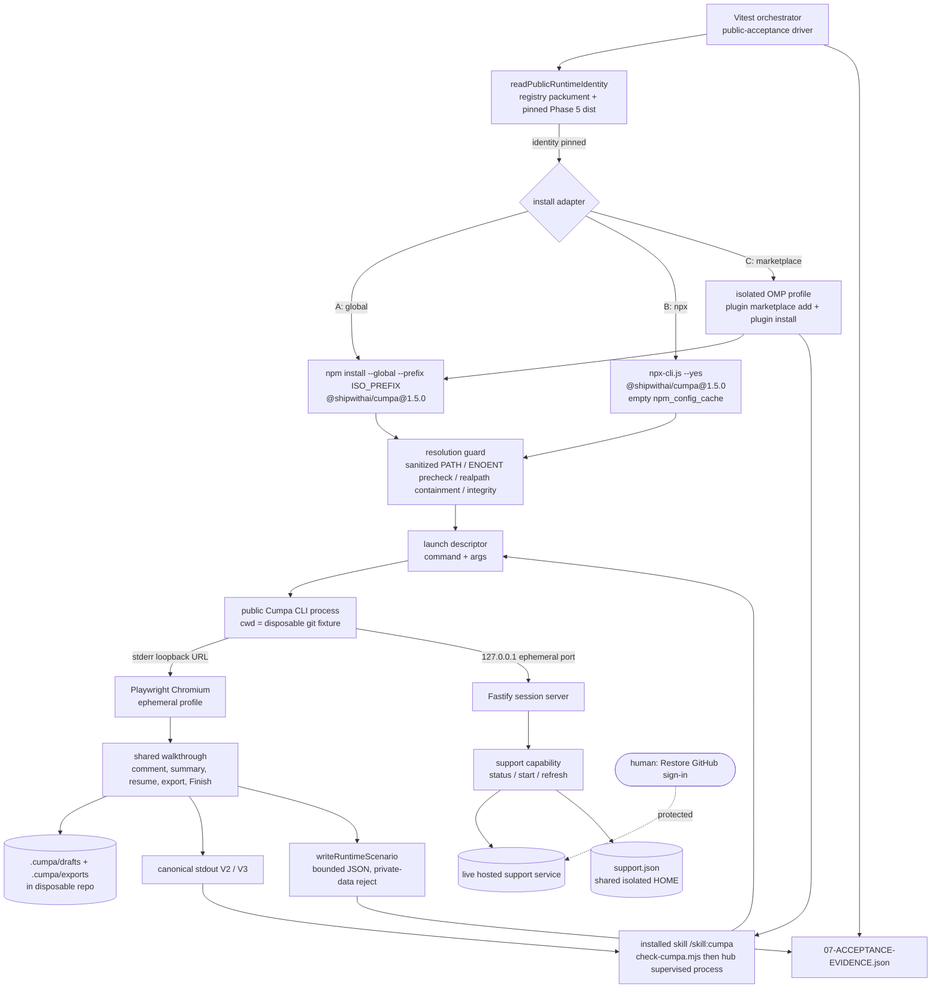

# Phase 7: Clean Public-Artifact Acceptance - Research

**Researched:** 2026-09-12
**Domain:** Public-artifact acceptance engineering — isolated npm installation environments, Playwright-driven real-browser review acceptance, live hosted voluntary-support states, isolated coding-agent (OMP) marketplace profile, bounded evidence records
**Confidence:** MEDIUM-HIGH (HIGH on repository seams and install/isolation mechanics; MEDIUM on live-Restore automation boundary; LOW-flagged on two OMP/npm filesystem details called out in Assumptions Log)

<user_constraints>
## User Constraints (from CONTEXT.md)

### Locked Decisions (verbatim, `.planning/phases/07-clean-public-artifact-acceptance/07-CONTEXT.md:19-39`)

#### Clean-environment coverage
- **D-01:** Use **isolated local environments**, not a fresh machine/VM and not both approaches. The user explicitly selected this after asking what clean-environment acceptance means.
- **D-02:** Separate fresh HOME/settings, npm cache/configuration/install prefix, and browser profile state for the installation paths. Run outside the Cumpa checkout against disposable review repositories. Preserve the user's existing installations, caches, settings, skills, authentication, and review data; prevent accidental resolution to an existing Cumpa executable or shared cached package.
- **D-03:** Report the actual host platform and isolation boundary. Local isolation is not fresh-machine proof or an operating-system/browser compatibility matrix. Do not claim platforms or agent runtimes that were not exercised.

#### Marketplace agent proof
- **D-04:** Use **OMP** for ACC-03: an isolated OMP profile installs the public native marketplace collection, discovers the installed Cumpa skill, invokes the separately installed exact `1.5.0` CLI, waits through browser review and Finish, and consumes the validated canonical result.
- **D-05:** Claude Code, Codex, Pi, and OMP remain the documented targets from Phase 6, but this phase selects OMP for the new clean-profile end-to-end proof. Do not reopen the waived Phase 6 four-agent installation/authentication/discovery/prerequisite/lifecycle exercise or turn its waived rows into passed results. OMP success establishes no new runtime proof for the other three targets.
- **D-06:** Preserve the published skill's separate-install and supervision contract: no automatic CLI installation/upgrade, npx fallback inside the skill, duplicate review logic, agent-authored review in place of the browser, automatic feedback application, or review-completion claim based only on readiness. The independent npx acceptance path remains required by ACC-02.

#### Verified-support proof
- **D-07:** Obtain genuinely verified support through **Restore with an already-paid GitHub account**. The user handles any required protected sign-in during execution. Do not make a new support purchase, fabricate a paid flag, mock a successful hosted response, or manually seed production payment data to claim real verification.
- **D-08:** Availability of a usable paid account and successful restoration are execution prerequisites, not observations made during this discussion. If restoration cannot be completed, finish reachable checks but leave verified-state acceptance and ACC-04 blocked/incomplete. Never substitute earlier unavailable/dismissal evidence for the missing verified-state result.
- **D-09:** Preserve the real hosted authority and ordinary Restore effects. No new payment, deployment, provider configuration change, or manual database mutation is selected. All three installation paths still need evidence of unrestricted review/export across the required support states; the chosen proof source does not narrow ACC-04.

#### Review walkthrough
- **D-10:** Use an **automated walkthrough of the actual browser**, not a mandatory hands-on review or automation followed by a separate manual acceptance pass. Human intervention is limited to protected steps such as the Restore sign-in.
- **D-11:** Exercise and validate the existing review contract: comments, accepted summary, persistence/resume, readable Markdown and canonical JSON exports, and attached Finish/result delivery. Reuse the existing range and exact-patch acceptance scenarios where applicable; do not replace them with launch-only or version-only checks. The agent must receive actual canonical output after successful terminal completion, not a fixture or synthesized result.

#### Scope and authority
- **D-12:** This discussion authorizes local planning records only. It starts no installer, agent/provider request, login, browser acceptance, payment, publication, push, or deployment. Phase 5 and Phase 6 publication authorities are consumed and cannot be reused. Keep subsequent source work on the established main-only path without GSD branches/worktrees; preserve unrelated user work and immutable historical release evidence.

### the agent's Discretion (verbatim, `07-CONTEXT.md:41-43`)

> No extra product decisions were delegated through a "you decide" response. The researcher and planner should resolve ordinary implementation details from existing patterns: public-install adapters, browser automation reuse, isolated OMP profile and supported authentication handling, disposable review fixtures, bounded evidence, and owned scratch cleanup. Do not invent a new release/test framework, duplicate application contracts, or request the waived four-agent sign-ins. Identify genuine protected execution prerequisites without silently reducing acceptance scope.

### Deferred Ideas (OUT OF SCOPE) (verbatim, `07-CONTEXT.md:109-113`)

> None — discussion stayed within phase scope. A fresh machine/VM, an unobserved cross-platform matrix, new purchases, and an additional mandatory hands-on review were not selected. These are not promises of future work. The existing Phase 6 four-agent waiver remains intact.
</user_constraints>

<phase_requirements>
## Phase Requirements

| ID | Description (`.planning/REQUIREMENTS.md:36-39`) | Research Support |
|----|-------------|------------------|
| ACC-01 | A clean environment can install `@shipwithai/cumpa@1.5.0` globally and complete the existing browser-review workflow without using a source checkout, a workspace link, or a local tarball. | Public-install adapter replacing `readRuntimeArtifact()`/tarball input in `tests/helpers/runtime-artifact.ts:258-287,384-460`; PATH/prefix realpath guard; existing browser walkthrough in `tests/e2e/package-assets.spec.ts` + `tests/e2e/agent-ready-export.spec.ts` |
| ACC-02 | A clean environment with an empty npm cache can run `npx --yes @shipwithai/cumpa@1.5.0` and complete the existing browser-review workflow without a prior or local installation. | Empty-`npm_config_cache` + sanitized-PATH launch descriptor; `npx-cli.js` invocation pattern proven at `scripts/verify-npm-release.mjs:534,582-584`; `_cacache`/`_npx` post-run observation |
| ACC-03 | A clean agent profile can install the public marketplace skill, invoke the separately installed `@shipwithai/cumpa@1.5.0` CLI, finish a browser review, and receive its validated canonical result. | Frozen OMP public install actions at `.planning/phases/06-independent-mit-marketplace-skill/06-MARKETPLACE-CANDIDATE.json:100-120`; skill lifecycle contract `.kimi-code/skills/cumpa/SKILL.md:37-60,101-106`; `hub`-supervised attached-CLI Finish → canonical stdout |
| ACC-04 | All released installation paths preserve unrestricted review and export behavior regardless of voluntary-support payment state. | Live hosted status/start/refresh flow in `src/server/support-client.ts:66-80`, `src/server/capabilities.ts:147-168`, `src/server/routes.ts:132-144`; per-HOME store in `src/server/support-store.ts:59-66`; dialog modes in `src/web/components/SupportDialog.vue:20-82` |
</phase_requirements>

## Summary

Phase 7 is not new application work; it is an **install-source substitution plus a support-state extension** on an acceptance harness that already exists and already passes. The repository owns a complete isolated-installation + real-browser + canonical-export acceptance stack: a Vitest driver (`tests/package/agent-ready-export.test.ts`) that verifies an artifact, shells out to a dedicated Playwright config (`playwright.runtime-artifact.config.ts`), and writes a bounded scenario bridge back (`writeRuntimeScenario`, `tests/helpers/runtime-artifact.ts:470-495`). The two Playwright suites already exercise the full D-11 contract against an *installed* package: installed browser asset graph, line comments, accepted summary, relaunch/resume with byte-identical draft, Markdown + canonical JSON export pair, attached Finish emitting canonical V2/V3 on stdout with exit 0, and unchanged source control. What blocks ACC-01..ACC-04 is narrow and precise: (1) `readRuntimeArtifact()` **requires** a locally packed tarball plus producer evidence (`CUMPA_RUNTIME_CUSTODY_DIR`, `CUMPA_RUNTIME_ARCHIVE_BASENAME`, `CUMPA_RUNTIME_ARCHIVE_SHA256`, `CUMPA_RUNTIME_EVIDENCE`) and `installRuntimeArtifact()` installs `artifact.archivePath`; (2) the CLI is launched as `node --import <fetch-guard> <nodeEntrypointPath>`, which both bypasses the npm-generated bin and *denies all non-loopback fetch*, so it can only ever prove support-unavailable; (3) there is no npx launch path and no agent-runtime path.

The prescribed shape is three thin **install adapters** that all produce the same launch descriptor consumed by one **shared walkthrough**. Adapter A (`global`) runs `npm install --global --prefix <isolated> @shipwithai/cumpa@1.5.0` against `https://registry.npmjs.org/` under a fresh HOME/cache/config/prefix and launches `<prefix>/bin/cumpa`. Adapter B (`npx`) launches `node <npm-root>/bin/npx-cli.js --yes @shipwithai/cumpa@1.5.0` under a brand-new empty `npm_config_cache` with a sanitized PATH. Adapter C (`marketplace`) reuses Adapter A's installed binary on the isolated PATH, then drives an isolated-HOME OMP profile that adds `Ship-With-AI/skills`, installs `ship-with-ai@ship-with-ai-skills`, and invokes `/skill:cumpa`. The one genuinely new capability is ACC-04's live support matrix: the current non-loopback fetch guard must be **dropped** from the public-install runs (it proves unavailable/dismissed only, per `07-CONTEXT.md:92`), the real hosted service must answer `/api/support/refresh`, and verified state must be reached through a real Restore with the user performing the GitHub sign-in.

One structural discovery governs the ACC-04 plan: support state is **per-HOME**, not per-install (`resolveSupportStatePath` derives `$HOME/Library/Application Support/Cumpa/support.json` on darwin, `src/server/support-store.ts:59-66`), and `installationId` is randomly generated per state file (`support-store.ts:110`). Giving each install path its own HOME would require three independent Restores against three distinct installation IDs. The correct design is a **single shared isolated "machine-state" HOME** used by all three paths for support state, with npm cache/config/prefix and the npx cache kept strictly per-path — this matches the product's own installation-wide semantics, keeps ACC-01/ACC-02 cleanliness claims intact (those are about install source and npm cache, not about the support state file), and makes one protected Restore sufficient for all three paths.

**Primary recommendation:** Add one `tests/helpers/public-runtime.ts` install-adapter module that returns the existing `InstalledRuntimeArtifact` shape plus a `{ command, args }` launch descriptor, thread that descriptor through `startGeneratedCli`/`startAttachedCli`, parametrize the existing Playwright runtime config with per-source projects, share one isolated support HOME across all three paths, drop the fetch guard from public runs, and gate only the GitHub Restore sign-in as human-protected — changing no application code and adding no new test framework.

## Architectural Responsibility Map

| Capability | Primary Tier | Secondary Tier | Rationale |
|------------|-------------|----------------|-----------|
| Fetch + verify public artifact identity | Public npm registry | Acceptance harness (Node) | Registry is the authority for `dist.tarball`/`dist.shasum`/`dist.integrity`; harness only compares against pinned Phase 5 values (`scripts/verify-npm-release.mjs:511-517`) |
| Isolated install (HOME/cache/config/prefix) | Node child-process env + npm CLI | — | Already implemented twice: `runtime-artifact.ts:309-331`, `verify-npm-release.mjs:450-464` |
| Resolution guard (no developer binary) | Acceptance harness PATH construction | OS `PATH` | The harness must *replace* PATH, not inherit it; inheritance is the current behavior and the live leak |
| Review/diff/persistence/export semantics | Installed Cumpa CLI + Fastify server | Browser (Monaco) | Application contract; harness must not duplicate it (`07-CONTEXT.md:43`) |
| Browser walkthrough | Playwright Chromium (ephemeral profile) | — | Satisfies D-02 "fresh browser profile state" without touching the real browser profile |
| Support status authority | Hosted Supabase service | `support.json` per HOME | `support-client.ts:66-80` reads hosted; `support-store.ts:127-142` persists installation-wide |
| Restore sign-in | Human (paid GitHub account) | Hosted flow URL | Protected; cannot be automated or mocked (D-07) |
| Skill discovery + CLI supervision | OMP runtime (isolated profile) | Published marketplace collection | `SKILL.md:101-106` mandates `hub` named supervised process, readiness ≠ completion |
| Evidence record | Acceptance harness | Planning directory | Bounded JSON, no credentials/live auth URLs/private paths (`runtime-artifact.ts:487-490`) |

## Dependencies (no new packages)

**This phase installs no new project dependency.** No entry is added to `package.json` `dependencies` or `devDependencies`; the harness reuses `@playwright/test 1.61.1`, `vitest 4.1.10`, and `zod 4.4.3` already present (`package.json` devDependencies/dependencies). Therefore `## Standard Stack` and a full `## Package Legitimacy Audit` are intentionally omitted — there is nothing new to legitimize.

The one package *fetched from a registry* is the artifact under acceptance itself, and it is identity-pinned by immutable Phase 5 evidence rather than by a legitimacy heuristic:

| Field | Pinned value | Source |
|---|---|---|
| Package | `@shipwithai/cumpa@1.5.0` | `.planning/phases/05-bootstrap-trusted-stable-publication/05-RELEASE-EVIDENCE.json` (`package`) |
| Tarball URL | `https://registry.npmjs.org/@shipwithai/cumpa/-/cumpa-1.5.0.tgz` | `scripts/verify-npm-release.mjs:514` |
| Byte length | `3514800` | `05-RELEASE-EVIDENCE.json` (`registry.downloadedArchive.byteLength`) |
| SHA-256 | `dc8f792920833415d309015d5f4c31501016e9a4a6cc945bb69dde2453137141` | `05-RELEASE-EVIDENCE.json` (`registry.downloadedArchive.sha256`) |
| npm shasum (SHA-1) | `2d58866c862283f2c41b3f4f7d51282b2ca96472` | same |
| npm integrity | `sha512-gUBrMYwL8u75k1JX1OxO2dwfUsjQGHAqPUjh8e5Ep6gVs52wwEZFwkl49fBU2eggU9S7J1r27SCa8W1X/iHn5g==` | same |

[VERIFIED: `.planning/phases/05-bootstrap-trusted-stable-publication/05-RELEASE-EVIDENCE.json`] Any install whose resolved integrity differs from that value is a substitution and must fail the run, not be reported.

## Requirement Coverage

| Req | How proven | Existing asset reused | What is new |
|---|---|---|---|
| **ACC-01** | Isolated `npm install --global --prefix <tmp>/prefix @shipwithai/cumpa@1.5.0 --registry https://registry.npmjs.org/` under fresh HOME/cache/config; assert installed manifest (`name`/`version 1.5.0`/`license MIT`/`engines.node >=24`/`bin.cumpa`), assert `realpath(<prefix>/bin/cumpa)` is inside `realpath(<prefix>)`, assert resolved integrity equals the pinned sha512; then run the **full** D-11 walkthrough by launching `<prefix>/bin/cumpa` | `runtime-artifact.ts:309-331` (protected env), `:94-102` (installed manifest schema), `:333-358` (dependency tree assertions), `package-assets.spec.ts`, `agent-ready-export.spec.ts` | Install source = public registry label instead of `artifact.archivePath` (`runtime-artifact.ts:405-407`); PATH replacement + pre-install `cumpa` absence assertion; launch via the npm-generated bin instead of `node --import guard <entrypoint>` |
| **ACC-02** | Fresh `mkdtemp` cache asserted empty (`readdirSync(cache).length === 0`) immediately before the run; sanitized PATH with no `cumpa`; cwd = disposable review repo with no `node_modules/.bin`; isolated prefix containing no global cumpa; launch `node <npmRoot>/bin/npx-cli.js --yes @shipwithai/cumpa@1.5.0`; post-run assert `<cache>/_npx/**/node_modules/@shipwithai/cumpa/package.json` version `1.5.0` and `<cache>/_cacache` populated; then the same D-11 walkthrough | `verify-npm-release.mjs:534,582-584` (npx-cli.js + isolated env), `verify-npm-release.mjs:450-464` | Cache-emptiness assertions, registry-fetch observation, and the first npx-launched **browser** walkthrough (Phase 5 proved `--version` only, `05-VERIFICATION.md:33`) |
| **ACC-03** | Isolated OMP profile (fresh HOME + `PI_CODING_AGENT_DIR` + XDG roots) runs the exact frozen public actions `omp plugin marketplace add Ship-With-AI/skills` then `omp plugin install --scope project ship-with-ai@ship-with-ai-skills`; prove discovery at `ship-with-ai/skills/cumpa` from the installed plugin tree (not the checkout copy); the agent runs the skill's own `check-cumpa.mjs` against the separately installed exact CLI on the isolated PATH, starts a `hub` named supervised process, waits for real terminal exit, and reports parsed `kind: "cumpa/export"` | `06-MARKETPLACE-CANDIDATE.json:100-120` (frozen commands/discovery/invocation), `SKILL.md:37-60,101-106`, `.kimi-code/skills/cumpa/scripts/check-cumpa.mjs` | First actual clean-profile OMP execution (Phase 6 rows are **waived, not passed** — `06-VERIFICATION.md:56-57`); proof that the *installed* skill copy (not `.kimi-code/skills/cumpa/`) was loaded |
| **ACC-04** | For each of the three paths, observe review+export succeed in three real support states: **unpaid/unverified** (live hosted `{status:"unverified"}`, prompt shown, dismissible), **dismissed** (after `Not now`, dialog hidden, review/export continue), **verified** (real Restore completed; `/api/support/status` returns `verified`, dialog opens in `verified` mode, review/export still unrestricted). Detect verified without writing the store — read `support.json` read-only and/or assert the API/UI | `support-client.ts:66-80`, `capabilities.ts:147-168`, `routes.ts:132-144`, `SupportDialog.vue:20-82`, `open-runtime-session.ts:5-24` | Drop the non-loopback fetch guard (`runtime-artifact.ts:440-452`) from public runs; shared isolated support HOME across the three paths; `openRuntimeSession` must **report** the observed status instead of silently auto-dismissing it |

## Existing Assets & Reuse Seams

### Focus 1 — How the isolated install harness works today, and exactly what must change

`tests/helpers/runtime-artifact.ts` is the single source of installation isolation. Current behavior, function by function:

| Symbol | Location | Current behavior | Phase 7 disposition |
|---|---|---|---|
| `readRuntimeArtifact(env)` | `:258-287` | Requires `CUMPA_RUNTIME_CUSTODY_DIR`, `CUMPA_RUNTIME_ARCHIVE_BASENAME`, `CUMPA_RUNTIME_ARCHIVE_SHA256`, `CUMPA_RUNTIME_EVIDENCE`; validates archive realpath stays inside custody (`:184-199`), hashes bytes with dev/ino/size stability checks (`:201-224`), and cross-checks producer evidence (`:233-257`) | **Not usable for Phase 7.** A public install has no local archive and no producer-evidence file. Do not loosen it; add a sibling reader for the public identity instead |
| `rehashRuntimeArtifact` | `:289-293` | Re-hashes the local archive to prove it was not mutated mid-run | Replace with "registry identity re-assertion": re-fetch the packument and compare `dist.integrity`/`dist.shasum` to the pinned Phase 5 values |
| `inheritedEnvironment(env)` | `:295-307` | Copies **`PATH`**, `TMPDIR`, `TMP`, `TEMP`, `LANG`, `LC_ALL`, `TZ` (+ `SystemRoot`/`COMSPEC`/`PATHEXT` on win32) and hard-fails if `PATH` is absent | **This is the live leak.** It preserves the developer's real `PATH`. On this host `command -v cumpa` resolves to `/Users/alessandro/.local/share/fnm/node-versions/v24.15.0/installation/bin/cumpa` [VERIFIED: `command -v cumpa`, 2026-09-12]. Phase 7 must build a *replacement* PATH, not inherit one |
| `protectedEnvironment(root, source)` | `:309-331` | Creates `<root>/{home,cache,prefix,config}` at mode `0700`, writes empty `npmrc`/`npmrc-global` with `wx` + `0600`, and sets `HOME`, `USERPROFILE`, `npm_config_cache`, `npm_config_userconfig`, `npm_config_globalconfig`, `npm_config_prefix`, `npm_config_registry=https://registry.npmjs.org/` | **Reuse verbatim.** Export it (currently module-private) so the public adapter can build identical isolation. Note `npm_config_registry` is already the public registry — no change needed |
| `runRuntimeCommand(cmd, args, {cwd, env})` | `:360-382` | POSIX: `execFileSync` with `stdio: ['ignore','pipe','pipe']`. win32: argv smuggled through `CUMPA_TEST_COMMAND_ARG_*` env vars into `cmd.exe /d /s /c` to avoid quoting injection | **Reuse verbatim** for `npm install`, `npm ls`, and `--version`/`--help` probes |
| `installRuntimeArtifact(artifact)` | `:384-460` | `mkdtemp` root → `protectedEnvironment` → `npm install --global --prefix <prefix> --ignore-scripts --no-audit --no-fund --registry <public> **artifact.archivePath**` (`:405-407`) → `npm ls --global --json --all --long` with strict problem/version checks (`:408-418`) → resolves `packageRoot` and `executablePath` per platform (`:419-421`) → validates installed manifest (`:423-425`) → sets `env.HOME`/`env.USERPROFILE` to the isolated HOME (`:426-428`) → writes the non-loopback **fetch-denial preloader** (`:429-452`) → returns `{root, packageRoot, executablePath, nodeEntrypointPath, fetchGuardPath, blockedFetchesPath, env, proof, cleanup}` | **Fork into a public adapter.** Change exactly three things: the install *spec* becomes the label `@shipwithai/cumpa@1.5.0`; the fetch guard becomes optional (omitted for live support runs); and the returned object gains a `launch: { command, args }` descriptor |
| `writeRuntimeScenario(scenario, record, env)` | `:470-495` | Writes `<bridge>.<scenario>.json` via `wx` temp + `linkSync`, mode `0600`, and **rejects** records containing keys matching `path|origin|email|credential|token|secret` or literals `/Users/` / `C:\` (`:487-490`) | **Reuse verbatim** — this is the bounded-evidence guard the phase needs. Add `'public-global' | 'public-npx' | 'marketplace'` to the scenario union (`:471`) |

**Required change set for a public install source (prescriptive):**

1. **New module `tests/helpers/public-runtime.ts`** exporting:
   - `readPublicRuntimeIdentity(): PublicRuntimeIdentity` — fetches `https://registry.npmjs.org/@shipwithai%2fcumpa/1.5.0` using the bounded redirect/size-limited fetcher pattern at `scripts/verify-npm-release.mjs:487-509`, validates `dist` against the pinned Phase 5 values using the `exactDist` shape at `:511-517`, and returns `{ packageLabel: '@shipwithai/cumpa@1.5.0', tarball, shasum, integrity }`. Fails closed on any mismatch.
   - `installPublicRuntime(identity, options): InstalledPublicRuntime` — same body as `installRuntimeArtifact` with the substitutions above.
2. **Export `protectedEnvironment`** (and a new `sanitizedPath()`) from `runtime-artifact.ts` rather than copying them. Do **not** add a third copy of the isolation code (a second already exists at `verify-npm-release.mjs:450-464`).
3. **Do not reuse `verifyPublicNpmRelease` wholesale.** It hard-fails unless npm is exactly `11.19.1` (`verify-npm-release.mjs:552`); this host has npm `11.12.1` [VERIFIED: `npm --version`, 2026-09-12]. It also runs `npm audit signatures --include-attestations`, which is Phase 5 provenance scope, not Phase 7. Reuse only its packument-fetch and `exactDist` patterns.

**The resolution guard (mandatory, three independent assertions):**

```
1. Sanitized PATH. Build PATH from exactly: <prefix>/bin, dirname(realpath(process.execPath)),
   dirname(realpath(npm)), and the minimal system dirs (/usr/bin:/bin:/usr/sbin:/sbin).
   Never copy process.env.PATH (contrast runtime-artifact.ts:297).
2. Pre-install absence. spawnSync('cumpa', ['--version'], { env: isolatedEnv, shell: false })
   MUST fail with ENOENT before the install runs. A success here means leakage — abort.
3. Post-install containment. realpathSync(executablePath).startsWith(`${realpathSync(prefix)}${sep}`)
   MUST hold, and lstatSync(packageRoot).isSymbolicLink() MUST be false
   (the existing check at runtime-artifact.ts:422 already covers the symlink case, which is
   what a `npm link`ed workspace would produce).
```

**Fail-loudly conditions for accidental local resolution (all must abort the run, never downgrade to a warning):**

| Condition | Detection |
|---|---|
| Developer's global cumpa resolved | Guard assertion 2 above succeeds instead of ENOENT |
| Workspace link / `npm link` resolution | `lstatSync(packageRoot).isSymbolicLink() === true` (`runtime-artifact.ts:422`) or `realpath(packageRoot)` outside `realpath(prefix)` |
| Local tarball substituted | Resolved integrity ≠ pinned `sha512-gUBrMY…`, or `resolved` URL ≠ `https://registry.npmjs.org/@shipwithai/cumpa/-/cumpa-1.5.0.tgz` |
| Wrong version | Installed manifest version ≠ `1.5.0` (`installedManifestSchema`, `runtime-artifact.ts:94-102`) and `cumpa --version` stdout ≠ `1.5.0\n` (`package-assets.spec.ts:95`) |
| Checkout `dist/` leakage | Assert `realpath(packageRoot)` is not inside `realpath(projectRoot)`; assert forbidden entries absent (`package-assets.spec.ts:112-114` already checks `src`, `tests`, `.planning`, `.cumpa`, `.github`, `.git`, `.kimi-code`) |

**Reading the resolved integrity:** npm records `resolved` + `integrity` for a global install in `<prefix>/lib/node_modules/.package-lock.json` (darwin/linux) — this is the same structure `readInstalledTarget` reads for a project install (`verify-npm-release.mjs:520-533`). Treat the *global* location as `[ASSUMED]` (Assumptions Log A1) and have the plan include one read-only probe task that confirms the file exists before depending on it. The registry-side binding (step 1 above) is the independent, non-assumed proof and must be present regardless.

### Focus 3 — What the browser walkthrough already covers, and the smallest reuse seam

`playwright.runtime-artifact.config.ts` is the acceptance suite entry: `testDir: './tests'`, `testMatch` exactly the two runtime specs (`:6-9`), `fullyParallel: false`, `forbidOnly: true`, `retries: 0`, `workers: 1`, `reporter: 'line'`, `timeout: 30_000`, and **one** project `chromium` / `Desktop Chrome` / `headless: true` (`:16-25`). It is invoked by the Vitest driver at `tests/package/agent-ready-export.test.ts:180` via `node node_modules/@playwright/test/cli.js test --config playwright.runtime-artifact.config.ts`, with `CUMPA_AGENT_READY_EVIDENCE_REPORT`/`_RUN_ID` set as the scenario bridge (`:178-179`).

**Answer to "parametrized or hardcoded": hardcoded to a local tarball.** Both specs call `readRuntimeArtifact()` at module/`beforeAll` scope with no parameter — `package-assets.spec.ts:32` (`const artifact = readRuntimeArtifact()`) and `agent-ready-export.spec.ts:267`. Neither the config nor the helpers expose any CLI-launch parameter: the launch command is hardcoded in two private functions, `startGeneratedCli` (`agent-ready-export.spec.ts:95-118`) and `startAttachedCli` (`:120-155`), both of which spawn `process.execPath` with `['--import', installed.fetchGuardPath, installed.nodeEntrypointPath]` (`:103`, `:134`). `package-assets.spec.ts:129` does the same.

**Smallest reuse seam — a launch descriptor plus Playwright projects:**

1. Extend the installed-runtime object with `launch: { readonly command: string; readonly args: readonly string[] }`:
   - global adapter → `{ command: installed.executablePath, args: [] }` (on win32, `cumpa.cmd` via the existing `runRuntimeCommand` win32 branch, `runtime-artifact.ts:365-381`)
   - npx adapter → `{ command: process.execPath, args: [join(npmRoot,'bin','npx-cli.js'), '--yes', '@shipwithai/cumpa@1.5.0'] }`
2. Change three lines only: `startGeneratedCli`, `startAttachedCli`, and the `package-assets.spec.ts` spawn become `spawn(installed.launch.command, [...installed.launch.args], { … })`. Everything downstream (`waitForLoopbackUrl` regex `http://127\.0\.0\.1:\d+/#token=[A-Za-z0-9_-]{43,}`, `agent-ready-export.spec.ts:189`; the `CUMPA_LAUNCH_OPTIONS` pinned-selection env var, `:107-111`; the fake `open` shim at `:275-288`) is unchanged.
3. Parametrize the suite by **Playwright projects** in a new `playwright.public-acceptance.config.ts` (keep the tarball config untouched so Phase 4/5 history stays runnable): projects `public-global`, `public-npx`, `marketplace`, each carrying `metadata: { installSource }`, read in `beforeAll` via `test.info().project.metadata.installSource`. This requires generalizing `assertChromium` (`agent-ready-export.spec.ts:261-264`), which currently asserts `testInfo.project.name === 'chromium'` — change it to assert `browser.browserType().name() === 'chromium'` only.
4. Raise `timeout` for the verified-support test (30 s is far below a human sign-in) and add a headed project for it — see Support-State Proof.

**`CUMPA_LAUNCH_OPTIONS` is a real product env var, not a test hook** (`src/cli/run.ts:759-767`): when set it parses `{cwd, base:{label,revision}, head:{label,revision}}` and calls `launchPinnedSession`, bypassing the interactive picker. It ships in the released `dist`, so it works identically for the public install. `CUMPA_BROWSER_OPEN_MARKER` is test-only; browser launch is intercepted by prepending a fake `open` executable to PATH, which works because `createBrowserUrlOpener` (`src/cli/run.ts:119-137`) defaults to `open(url)` from the `open` package and resolves `open` from PATH on darwin.

**Existing assertions that satisfy each D-11 element** (all in `tests/e2e/agent-ready-export.spec.ts` unless noted):

| D-11 element | Existing assertion | Location |
|---|---|---|
| Line comment saved on a real Monaco line | `addHeadComment` clicks `Add comment to head line 10`, fills the composer, asserts `/api/draft/mutations` returns **201** | `:225-245` |
| Accepted summary | `saveSummary` fills `Review summary (Markdown)`, asserts `/api/draft/mutations` returns **200** | `:247-253` |
| Persisted draft bytes | `readOnlyDraft` asserts exactly one `.cumpa/drafts/*.json`, `summary === expected`, one comment matching `{body, state:'open', anchor:{side:'head', line:10, selectedText}}` | `:256-262`, `:336-339` |
| Persistence / resume across a **new process** | Relaunch, assert `.review-summary__preview` contains the summary, `.comments-rail__comment` contains the body, and `readOnlyDraft(fixture).bytes` is **byte-equal** to the pre-relaunch bytes | `:341-351` |
| Markdown export | Reads `.cumpa/exports/<baseOid>..<headOid>/review.md`; asserts `Buffer.from(renderReviewMarkdown(json)) === markdown` | `:369-378`, `:404`, `:437` |
| Canonical JSON export | `ExportReviewResultSchema.parse` on a **201** `/api/export` receipt, `ReviewExportV1Schema.parse(parseCanonicalReviewExport(json))`, `acceptedDraftRevision` + `summary.markdown` match, comment bodies present, directory contains exactly `['review.json','review.md']` | `:352-366`, `:400-436` |
| Export idempotence / re-export | `Export review again` → `201 exported` on darwin-arm64, else `409 {kind:'reExportUnsupported'}` with byte-identical files | `:380-399` |
| Draft isolation across comparisons | Different head ref shows no prior summary/comments | `:424-437` |
| Attached Finish → canonical V2 | `/api/review-completion/finish` **201**, process exit **0**, stdout parses to `schemaVersion: 2` with `range.requestedBase/Head`, stdout has no trailing `\n`, stderr contains the URL | `:527-545` |
| Attached exact-patch → canonical V3 | `ReviewExportV3Schema.parse`, `patch.digest`/`validationTarget`/`snapshot.status==='unchanged'`, recomputed `patch.reviewKey`, grounded blob OIDs, anchored comment | `:643-700` |
| Concurrent attached isolation | Two `agent-[0-9a-f]{32}.json` drafts, distinct; same `range.reviewKey`; each stdout silent until its own Finish | `:559-610` |
| Finish blocked on unsaved composer | Finish disabled, forced click writes zero bytes to stdout, diagnostic text shown, re-enabled after discard | `:463-517` |
| Reviewed repo untouched | `assertSourceControlUnchanged(before, after)` (helper `tests/helpers/source-control-snapshot.ts:145-172`), which ignores `.cumpa/` and permits only the approved `/.cumpa/\n` gitignore append (`:28`, `:88-102`) | `:438`, `:702` |
| Installed browser asset graph | Every file under `dist/web/assets` fetched `ok: true`, zero `requestfailed`, all five workers (`editor`,`css`,`html`,`json`,`ts`) present, codicon font present | `package-assets.spec.ts:174-186` |
| Installed CLI surface | `cumpa --version` === `1.5.0\n`, `--help` matches `/--version\b/`, manifest equals expected, `LICENSE`/`THIRD_PARTY_NOTICES.md` digests match, forbidden dirs absent | `package-assets.spec.ts:95-114` |

**Gap:** the attached-mode scenarios currently prove Finish→canonical JSON, and the ordinary-mode scenario proves Markdown+JSON export files. ACC-03 needs the *attached* path driven by the agent, and ACC-01/ACC-02 need both. Plan both scenario sets per install path; do not drop the exact-patch scenario (D-11 says reuse range **and** exact-patch).

## Architecture Patterns

### System Architecture Diagram



### Recommended file layout

```
tests/helpers/public-runtime.ts        # NEW: identity + 3 install adapters + launch descriptor
tests/helpers/runtime-artifact.ts      # EXPORT protectedEnvironment + sanitizedPath; scenario union += public sources
tests/helpers/open-runtime-session.ts  # RETURN the observed support status instead of silently dismissing
tests/e2e/public-acceptance.spec.ts    # NEW: walkthrough parametrized by project metadata (reuses the two runtime specs' helpers)
playwright.public-acceptance.config.ts # NEW: projects public-global / public-npx / marketplace (+ headed verified project)
tests/package/public-acceptance.test.ts# NEW: orchestrator; verifies identity, runs Playwright per project, writes evidence
```

### Pattern 1: Install adapter behind one launch descriptor

**What:** Each install path is a function `(identity, options) => InstalledPublicRuntime` whose only externally visible differences are `launch.command`, `launch.args`, and the `install` proof block. The walkthrough never branches on install source.
**When to use:** Always — it is the only way ACC-01/ACC-02/ACC-03 can share one verified D-11 contract without duplicating assertions three times.
**Example (shape, derived from `runtime-artifact.ts:384-460`):**
```ts
// Source: tests/helpers/runtime-artifact.ts:384-460 (installRuntimeArtifact), adapted
export interface InstalledPublicRuntime {
  readonly source: 'public-global' | 'public-npx' | 'marketplace';
  readonly root: string;
  readonly packageRoot?: string;          // absent for the npx path (cache-resident)
  readonly launch: { readonly command: string; readonly args: readonly string[] };
  readonly env: NodeJS.ProcessEnv;        // isolated npm state + SHARED support HOME
  readonly proof: {
    readonly packageLabel: '@shipwithai/cumpa@1.5.0';
    readonly resolvedTarball: string;
    readonly resolvedIntegrity: string;
    readonly resolvedBinaryUnderIsolatedPrefix: true;
    readonly manifestSha256?: string;
  };
  cleanup(): void;
}
```

### Pattern 2: Shared support HOME, per-path npm state

**What:** One `mkdtemp` "machine-state" directory supplies `HOME`/`USERPROFILE` (and `XDG_STATE_HOME` on linux) to all three launched CLIs, so `resolveSupportStatePath` (`src/server/support-store.ts:59-66`) resolves to **one** `support.json` with **one** `installationId`. Each path still gets its own `npm_config_cache`, `npm_config_prefix`, `npm_config_userconfig`, `npm_config_globalconfig`.
**When to use:** ACC-04. Without it, one Restore verifies one installation ID and the other two paths remain unverified, forcing either three protected sign-ins or a faked state (prohibited by D-07).
**Note:** `installRuntimeArtifact` currently hardwires `env.HOME = npmEnv.HOME` (`runtime-artifact.ts:437-438`). The adapter must accept an injected `supportHome` instead.

### Pattern 3: Registry-side identity binding before install

**What:** Fetch the exact packument and compare `dist.tarball`/`dist.shasum`/`dist.integrity` to the pinned Phase 5 values *before* installing, using the bounded fetcher (`scripts/verify-npm-release.mjs:487-509`) with its `https:` + `registry.npmjs.org` host assertion and redirect/size limits.
**When to use:** Every path, once per run. This is the only substitution proof that does not depend on npm's internal lockfile layout.

### Anti-Patterns to Avoid

- **Loosening `readRuntimeArtifact`** to make tarball inputs optional. It is the Phase 4/5 immutability guard; a public run must use a separate reader (`07-CONTEXT.md:91`).
- **Keeping the non-loopback fetch guard on a live-support run.** `runtime-artifact.ts:440-452` rejects every non-loopback `fetch`. With it installed, `client.status()` always returns `undefined` (`support-client.ts:49-52` swallows the rejection), so `promote()` never verifies (`capabilities.ts:149-152`) — the run can *only* observe unavailable. `07-CONTEXT.md:92` forbids carrying that setup into the live proof.
- **Launching `node --import … nodeEntrypointPath`.** That bypasses the npm-generated bin, so ACC-01 would not prove the installed executable works and ACC-02 could not be expressed at all.
- **Inheriting `process.env.PATH`.** See `runtime-artifact.ts:297` — the real `cumpa` is on this host's PATH.
- **Writing `support.json` directly, or stubbing `/api/support/*`.** D-07/`07-CONTEXT.md:94`: real Restore is the only entry into verified state.
- **Calling `check-cumpa.mjs` or the CLI directly for ACC-03.** A direct helper call proves no discovery or handoff (`07-CONTEXT.md:99`). The agent must load the *installed* skill and supervise the process.
- **Adding branches/worktrees.** D-12 plus `.planning/config.json` (`git.branching_strategy: "none"`, `workflow.use_worktrees: false`).
- **Reusing Phase 6's waived rows as passed.** D-05, `06-VERIFICATION.md:56-57`.

## Don't Hand-Roll

| Problem | Don't build | Use instead | Why |
|---|---|---|---|
| Isolated npm HOME/cache/prefix/config | A third copy of the env builder | Export + reuse `protectedEnvironment` (`runtime-artifact.ts:309-331`) | Two copies already exist (`verify-npm-release.mjs:450-464`); a third drifts on mode bits and `wx` npmrc creation |
| Cross-platform command execution with safe argv | Custom shell quoting | `runRuntimeCommand` (`runtime-artifact.ts:360-382`) | Already solves win32 argv smuggling without shell interpolation |
| Bounded registry fetch | Ad-hoc `fetch` loop | The `fetchBytes` pattern (`verify-npm-release.mjs:487-509`) | Enforces `https:` + exact host, ≤3 redirects, 30 s abort, byte limits |
| Disposable review repository | Hand-built git setup | `createDirtyGitFixture(kind, index)` (`tests/helpers/git-fixture.ts:360-381`) | Supplies base/head/alternate refs, a registered worktree, staged/unstaged/untracked/NUL/space-in-name entries, hardened git env (`:6-24`), and `cleanup()` |
| Proving the reviewed repo and checkout were untouched | Manual `git status` parsing | `captureSourceControlSnapshot` / `assertSourceControlUnchanged` (`tests/helpers/source-control-snapshot.ts:111-172`) | Byte-compares tracked and untracked entries, tolerates only the approved `.cumpa/` gitignore append |
| Canonical export validation | Re-implementing the schema | `ReviewExportV1Schema`/`V3Schema` + `parseCanonicalReviewExport` + `renderReviewMarkdown` (`src/contracts/draft.ts`, `src/export/*`) | Duplicating the contract is explicitly prohibited (`07-CONTEXT.md:43`) |
| Redacting evidence | New redactor | `writeRuntimeScenario`'s reject regex (`runtime-artifact.ts:487-490`) | Already blocks `path|origin|email|credential|token|secret` keys and absolute-home literals |
| Support-state modelling | New state machine | `SupportStateV1Schema` + `SupportCapability` (`support-store.ts:7-20`, `capabilities.ts:147-168`) | `verifiedAt` iff `verified` is enforced by `superRefine`; store is installation-wide |
| Version compatibility gate for the skill path | New checker | The published `check-cumpa.mjs` (`.kimi-code/skills/cumpa/scripts/check-cumpa.mjs`) | SKL-02 contract; accepts stable `1.x` ≥ `1.5.0`, rejects prereleases, prints the exact install command on failure |
| Marketplace install commands | Invented CLI flags | Frozen actions at `06-MARKETPLACE-CANDIDATE.json:113-120` | Already reviewed and version-bound; deviation breaks the Phase 6 binding |

**Key insight:** every mechanical part of this phase exists and is already proven against a local tarball. The only genuinely new engineering is (a) the install-source swap with its resolution guard, (b) the live support-state matrix, and (c) the isolated OMP profile. Anything else built from scratch is duplicated risk.

## Support-State Proof

### How the three states are modelled

| State | Store (`support-store.ts`) | API (`routes.ts`) | UI (`SupportDialog.vue` / `App.vue`) |
|---|---|---|---|
| **unverified / unpaid** | `{version:1, installationId:<43 chars base64url>, status:'unverified'}`, `verifiedAt` absent (`:7-20`); file created lazily at first `state()` with atomic `O_EXCL|O_NOFOLLOW` temp+rename (`:89-107`, `:116-134`) | `GET /api/support/status` and `POST /api/support/refresh` both return `{status:'unverified'}` (`:132-133`, `:141-144`) | Dialog auto-opens; `invitation` mode with `Support Cumpa — $49.99`, `Restore support`, `Not now` (`SupportDialog.vue:68-74`) |
| **dismissed** | **Not persisted** — `dismissedForSession` is a Vue ref (`App.vue:113`, `:995-998`); dismissal is per browser session, not per installation | unchanged (`unverified`) | `.support-dialog-backdrop` hidden; review/export controls unaffected |
| **verified** | `status:'verified'` + ISO `verifiedAt`, written once by `markVerified` and idempotent thereafter (`:136-148`); only reachable from `promote()` when the **hosted** status is `verified` (`capabilities.ts:149-152`) | both endpoints return `{status:'verified'}` | `openSupportDialog` sets mode `verified` → status line `Support is verified on this machine.` (`SupportDialog.vue:21`) and body `Thank you for supporting Cumpa. Cumpa remains fully usable.` (`:80`). Mid-session promotion shows `thankYou` and auto-closes after 1.5 s (`App.vue:923-931`) |

Support only exists at all when the launcher supplies an HTTPS service URL: `createConfiguredSupportCapability` returns `undefined` unless `CUMPA_SUPPORT_SERVICE_URL` parses as `https:` (`src/server/app.ts:46-56`), and `build-bin.mjs:25-28` bakes `if (process.env.CUMPA_SUPPORT_SERVICE_URL === undefined) process.env.CUMPA_SUPPORT_SERVICE_URL = '<origin>'` into `dist/bin/cumpa.mjs` when the release origin is configured. The published 1.5.0 launcher is configured (the acceptance scanner requires `support: { configured: true, originSha256 }`, `tests/package/agent-ready-export.test.ts:64`), so a public install talks to the real service with **no** env var needed. [VERIFIED: `scripts/build-bin.mjs:21-28`, `tests/package/agent-ready-export.test.ts:64`]

### How `openRuntimeSession` auto-dismisses — and why it must change

`tests/helpers/open-runtime-session.ts:5-24` races two responses: `POST /api/support/refresh`, or a `GET /api/session` whose `support?.enabled !== true`. If the refresh wins and is `ok()` with `status === 'unverified'`, it clicks `Not now` and waits for the backdrop to hide (`:19-22`). It returns `void`.

Consequence: **every existing suite silently collapses unverified into dismissed.** ACC-04 needs the two states distinguished. Prescribed change (single, backward-compatible):

```ts
// tests/helpers/open-runtime-session.ts — return the observation
export interface RuntimeSessionSupportObservation {
  readonly enabled: boolean;
  readonly observedStatus?: 'unverified' | 'verified';
  readonly dismissed: boolean;
}
export async function openRuntimeSession(
  page: Page, url: string,
  options: { readonly dismissUnverified?: boolean } = {},   // default true — existing callers unchanged
): Promise<RuntimeSessionSupportObservation> { /* … */ }
```
With `dismissUnverified: false`, the unverified test can assert the dialog is visible and the live status is `unverified` **before** dismissing, then assert unrestricted review/export, then dismiss and assert unrestricted review/export again — one launch, two observed states.

### What real Restore does end to end

1. Browser: `Restore support` → `restoreSupport()` → `startSupportAction('restore')` (`App.vue:1018-1020`). It calls `window.open('', '_blank')` **first** and nulls `opener` (`:1000-1002`), then `POST /api/support/start {action:'restore'}`, then `hostedTab.location.replace(result.flowUrl)` on `{kind:'ready'}` (`:1005-1008`).
2. Server: `SupportCapability.start` calls `client.start(action, installationId)` (`capabilities.ts:155-158`) → `POST <service>/functions/v1/support-api/start` with `{action, installationId}` (`support-client.ts:67-72`). The response must parse `{flowUrl: url}` **and** satisfy `flow.protocol === 'https:' && flow.origin === service.origin` (`:55-62`, `:73`), else `{kind:'unavailable'}`. Requests are 5 s-timeout, ≤8192-byte, JSON-only (`:5-7`, `:15-25`, `:42-53`).
3. Human: GitHub sign-in with the already-paid account inside the hosted tab. **Protected.**
4. Polling: `scheduleSupportPoll` runs `refreshSupportStatus` at 2/3/5/8/10 s then 15 s (`App.vue:951-964`); a background `setInterval` re-checks every 30 s and on `visibilitychange` (`:967-970`). Each `POST /api/support/refresh` → `promote(await client.status(installationId))` → `GET /functions/v1/support-api/status?installationId=…` (`support-client.ts:75-79`); `status === 'verified'` triggers `store.markVerified(new Date().toISOString())` (`capabilities.ts:150`).
5. UI settles to `thankYou` then closes; a later `openSupportDialog` shows `verified` mode.

| Step | Automatable? | Notes |
|---|---|---|
| Click `Restore support`, capture the request body `{action:'restore'}` | **Yes** | `page.waitForRequest(url => url.endsWith('/api/support/start'))` — pattern at `tests/integration/support-dialog.spec.ts:64-75` |
| Capture the hosted tab and its `flowUrl` origin | **Yes** | `context.waitForEvent('page')`; assert origin equals the service origin. **Never record the full URL** — it is a live auth URL |
| GitHub sign-in with the paid account | **No — protected** | D-07. Recommended: run this one test **headed** so the human completes sign-in inside Playwright's ephemeral context (keeps D-02 "fresh browser profile state" and avoids leaking to the real browser profile, which is the only place a real GitHub session exists) |
| Poll until verified | **Yes** | `expect.poll(() => /api/support/status body)` or wait for a `refresh` response with `{status:'verified'}` |
| Assert verified UI + unrestricted review/export | **Yes** | `verified` mode strings above; then the full D-11 walkthrough |

### Observable evidence per state (what to record)

| State | Observation that proves *unrestricted* review/export |
|---|---|
| unverified | live `refresh` → `{status:'unverified'}`; dialog visible in `invitation` mode; comment mutation **201**; summary mutation **200**; `/api/export` **201** with `kind:'exported'`; `review.json` + `review.md` present and mutually consistent; attached Finish **201** → exit **0** → canonical `schemaVersion: 2` on stdout |
| dismissed | backdrop hidden after `Not now`; the same mutation/export/Finish observations succeed in the same session |
| verified | `GET /api/support/status` → `{status:'verified'}`; `support.json` read-only shows `status:'verified'` with a `verifiedAt` timestamp; dialog `verified` mode text observed; the same mutation/export/Finish observations succeed |

**Detecting verified without writing the store:** read the store path resolved as `resolveSupportStatePath({ platform: process.platform, home: sharedSupportHome, env: isolatedEnv })` (`support-store.ts:59-66`) with plain `readFileSync`, and independently assert `GET /api/support/status`. Record only `{ status, verifiedAtPresent: true }` — **never** the `installationId` (it is a stable machine correlator) and never `verifiedAt` verbatim if the plan prefers minimal disclosure.

**Explicit limitation to carry into the evidence record:** the existing non-loopback fetch-denial guard (`runtime-artifact.ts:440-452`) plus the Playwright `route(… abort('blockedbyclient'))` block (`agent-ready-export.spec.ts:718-726`) prove **unavailable/dismissed only**. The current passing assertion is literally `support: { unavailable: true, dismissed: true, unrestricted: true }` (`agent-ready-export.spec.ts:307`) — that is *not* live unpaid status and *not* successful paid restoration. Phase 7 must not reuse those rows to claim ACC-04 (`07-CONTEXT.md:92`, D-08).

## OMP Marketplace Path

### What the published skill expects

`.kimi-code/skills/cumpa/SKILL.md` (byte-identical to the published copy, SHA-256 `8974c947bceaf2921fdd74ea900c8af6a85c1c9f94428f66f53eea923d630220`, `06-PUBLICATION-EVIDENCE.json` `reviewedFileHashes`) specifies, for OMP (`:101-106`):

- Discovery: the native `ship-with-ai` marketplace collection whose installed tree contains `skills/cumpa`; invoke `/skill:cumpa`. "Pi and OMP are separate targets; no Skills CLI `-a omp` route is assumed."
- Supervision: `hub` starts a **stable named** supervised process; loopback readiness is observed **separately** from waiting for exit; retain the name, wait for actual terminal status, then read the canonical result file. "Never treat a successful `start` or readiness event as a completed review."
- Preflight (`:37-45`): resolve the **installed skill's** directory from the agent's loaded skill location (not the reviewed repo), run `node "<installed-skill-directory>/scripts/check-cumpa.mjs"` as the **first** operation, and on failure stop and *display* (never execute) `npm install --global @shipwithai/cumpa@1.5.0`.
- Launch (`:53-60`): `env -u CMUX_WORKSPACE_ID cumpa < "$CUMPA_REQUEST" > "$CUMPA_RESULT"`, stderr watched for `http://127\.0\.0\.1:[0-9]+`.
- Handoff acceptance (`:62`): exit `0` **and** one non-empty parseable JSON object with `kind: "cumpa/export"`. Exit `1`/`130`/empty stdout/invalid JSON = no accepted review.
- Prohibited (`:19`, D-06): automatic install/upgrade, npx fallback inside the skill, source checkout or local tarball substitution.

`check-cumpa.mjs` spawns `cumpa --version` with `shell: false`, accepts stable `1.x` where minor ≥ 5 (regex at line 17 plus the `match[1].length > 1 || match[1] >= '5'` gate), rejects prereleases, and on any failure writes the exact install command + prerequisites to stderr with `exitCode = 1`. It resolves `cumpa` **from PATH** — so the isolated OMP profile's PATH must contain the isolated prefix's `bin` and nothing that could resolve the developer's binary.

### Isolated OMP profile

Phase 6 already froze the exact public install actions (`06-MARKETPLACE-CANDIDATE.json:100-120`, `agentVersion: "18.1.16"`, `authRoute: "temporary:PI_CODING_AGENT_DIR"`):

```sh
env -u ANTHROPIC_API_KEY -u ANTHROPIC_OAUTH_TOKEN -u CLAUDE_CODE_OAUTH_TOKEN \
    -u OPENAI_API_KEY -u OPENAI_CODEX_OAUTH_TOKEN \
    HOME="$TARGET_ROOT/omp/home" PI_CODING_AGENT_DIR="$TARGET_ROOT/omp/agent" \
    XDG_CONFIG_HOME="$TARGET_ROOT/omp/xdg-config" XDG_DATA_HOME="$TARGET_ROOT/omp/xdg-data" \
    XDG_STATE_HOME="$TARGET_ROOT/omp/xdg-state" XDG_CACHE_HOME="$TARGET_ROOT/omp/xdg-cache" \
    omp plugin marketplace add Ship-With-AI/skills                              # :114
… omp plugin install --scope project ship-with-ai@ship-with-ai-skills           # :115
… omp                                                                            # :116
```
`discoveryPath: "ship-with-ai/skills/cumpa"`, `invocationIdentity: "/skill:cumpa"` (`:118-119`). **Use these verbatim** — deviating breaks the Phase 6 command-matrix binding, and Phase 6 never executed them (`publicInstalls: {status:"waived-not-run"}`, `06-PUBLICATION-EVIDENCE.json`).

Harness facts confirming the source is installable as a marketplace: `Ship-With-AI/skills` is `owner/repo` GitHub shorthand, classified as a Git marketplace source, and requires a catalog at `.omp-plugin/marketplace.json` or the Claude-compatible `.claude-plugin/marketplace.json` [CITED: `omp://marketplace.md` §Marketplace sources]. The repository has `.claude-plugin/marketplace.json` with catalog `name: ship-with-ai-skills` and a single plugin entry `{name: "ship-with-ai", source: "./"}`, left **unchanged** by the 0.3.0 publication (`06-02-SUMMARY.md:52`, `06-RESEARCH.md:96-97`) — which is why `ship-with-ai@ship-with-ai-skills` is the correct install identifier. Project-scope installs land in the nearest project `.omp/plugins/installed_plugins.json`; user-scope in `~/.omp/plugins/installed_plugins.json` (or `$XDG_DATA_HOME/omp/plugins/`) [CITED: `omp://marketplace.md` §Concepts]. Plugin-provider skills are discovered one level under `skills/` as `<skills-root>/<skill-name>/SKILL.md`, and `/skill:<name>` commands exist only when `skills.enableSkillCommands` is true [CITED: `omp://skills.md` §Discovery pipeline, §Interactive `/skill:<name>` commands].

`PI_CONFIG_DIR` is documented as the "Config root **dirname under home** (default `.omp`)" and `OMP_PROFILE`/`PI_PROFILE` select named profiles; `PI_CODING_AGENT_DIR` is a "full agent-directory override for the default profile only" [CITED: `omp://environment-variables.md:513-517`]. XDG redirection applies "only [when the] target `omp` root (or named-profile root) already exists" [CITED: `omp://environment-variables.md:520`]. Because of that conditional, a **fresh `HOME` is the load-bearing isolation control**; the XDG vars in the frozen command are belt-and-braces. Whether `PI_CODING_AGENT_DIR` alone fully isolates plugin/marketplace state in OMP `18.1.16` is `[ASSUMED]` (Assumptions Log A2) — the plan must include a read-only verification task that lists installed plugins under the isolated profile and confirms the user's real `~/.omp` was not modified (compare a before/after `mtime`+digest of `~/.omp/plugins/installed_plugins.json` and `marketplaces.json`, read-only).

Marketplace mutations "update disk state and invalidate discovery caches but do not refresh the active session"; `/reload-plugins` refreshes skills and slash commands, and a restart is needed for new tools/hooks/extension modules [CITED: `omp://marketplace.md`]. Since the frozen actions start a **new** `omp` after installing (`:116`), no reload is required.

### Proving genuine discovery + separate install + canonical consumption

| Claim | Proof (all three required) |
|---|---|
| The **installed** skill was loaded, not the checkout copy | The session's skill list resolves `cumpa`; `skill://cumpa` (or the invocation preamble's `[Skill directory: <baseDir>]`, `omp://skills.md` §user-invocation) resolves to a `baseDir` under the isolated plugin tree; assert `realpath(baseDir)` is **not** inside `realpath(<cumpa-checkout>)` and its `SKILL.md` SHA-256 equals `8974c947bceaf2921fdd74ea900c8af6a85c1c9f94428f66f53eea923d630220` |
| The CLI was **separately** installed and invoked | `check-cumpa.mjs` ran first and printed `1.5.0`; the supervised process's resolved executable realpath is under the isolated npm prefix; no install/upgrade/npx command appears in the profile's command history |
| The review actually completed | `hub` process reached terminal exit status `0` (not merely "ready"); the result file is one non-empty JSON object; `parseCanonicalReviewExport` + `ReviewExportV2Schema` accept it; the agent's report contains the summary and comment bodies that Playwright typed |
| Readiness ≠ completion was honored | Two distinct recorded observations with a timestamp gap: loopback-URL readiness, then terminal exit |

**Human-gated prerequisites for ACC-03:** a fresh OMP profile has no provider credentials. The frozen commands deliberately unset `ANTHROPIC_*`/`OPENAI_*` (`:114-116`), so the isolated profile needs its own model/provider authentication, performed by the user. Model access and any auth-broker configuration (`OMP_AUTH_BROKER_URL`/`OMP_AUTH_BROKER_TOKEN`, resolved relative to `<config-dir>` respecting `PI_CONFIG_DIR`, `omp://environment-variables.md:124-125`) are the user's to supply. If unavailable, ACC-03 is **blocked**, and the phase must say so rather than fall back to a direct helper invocation.

## Evidence Record

### Shape of the two prerequisite records

`05-RELEASE-EVIDENCE.json` — `kind: "cumpa.npm-release-evidence/v1"`, `status: "published-verified"`. Top-level blocks: `package` (name/version/license/nodeEngine/bin), `candidate` (sourceSha, sourceTree, workflow, runId, runAttempt, job IDs, artifactId, artifactDigestSha256, artifactTransportBytes, evidenceSha256, nested `archive` with basename/byteLength/sha256/npmShasumSha1/npmIntegritySha512), `registry` (dist-tags, `downloadedArchive` identity, `approvedByteLengthSha256Sha1Sha512Match`, `exactVersionMetadataVerified`), `attestation` (verificationTool, command, exit code, nested `inspection` with SLSA subject/claims), `consumers` (`global` and `npx` blocks each recording `installCommand`/`command`, `exitCode`, `stdout`, `freshHomeCachePrefixAndConfigs`, `credentialsInherited: false`, `localTarballFallback: false`, `ownedTemporaryStateRemoved`; plus `additionalVerifierChecks`, `npmVersion`, `npxVersion`), and `cleanup` (per-item boolean removal flags). Note it proves `--version` only, not the browser workflow (`05-VERIFICATION.md:33`).

`06-PUBLICATION-EVIDENCE.json` — `kind: "cumpa.marketplace-publication/v1"`, `status: "published-and-public-bytes-verified"`. Blocks: repository identity + `repositoryId`, `baselineOid`/`candidateOid`, `collectionVersion {from,to}`, `reviewedFileHashes` (path → SHA-256), `verificationWaiver` (verbatim instruction, approver, `status: "waived-not-run"`, targets, scope), `publicationAssent`/`automaticEffectsAssent` (verbatim assent, approver, scope, `state: "consumed"`), `pushCommand` (argv + `environmentOverrides`, credentials described but not inspected) + `pushCommandSha256`, `pushEffects` + `effectsSha256`, `publicationAttempts[]` (append-only lifecycle with exit code and output digest), `publicInstalls {status:"waived-not-run", targets}`, `publicVerification`, `phase7Acceptance: "not performed"`, `postPushObservation` with `limitations`, `securityReview`, `custody`, `cleanup`.

Both records share the house style Phase 7 must follow: a versioned `kind`, explicit `status`, digests instead of bytes, boolean per-check flags, an explicit `limitations`/`cleanup` block, and **no** credentials, live URLs, absolute private paths, or raw provider payloads.

### Proposed `07-ACCEPTANCE-EVIDENCE.json`

```jsonc
{
  "kind": "cumpa.public-artifact-acceptance/v1",
  "status": "passed | partially-blocked",           // never "passed" with any blocked row
  "acceptedAt": "<ISO 8601>",

  "host": {                                          // D-03: actual platform, honestly
    "platform": "darwin", "arch": "arm64",
    "osRelease": "25.6.0",
    "node": "v24.15.0", "npm": "11.12.1", "git": "2.54.0",
    "playwright": "1.61.1", "browser": "chromium <version>"
  },
  "isolationBoundary": {
    "kind": "isolated-local-environments",           // D-01
    "freshMachineOrVm": false,
    "perPath": ["home-or-support-home", "npm_config_cache", "npm_config_prefix",
                "npm_config_userconfig", "npm_config_globalconfig"],
    "sharedSupportHome": true,                       // one installation-wide support.json
    "browserProfile": "playwright-ephemeral-context",
    "ranOutsideCheckout": true,
    "userStatePreserved": { "installations": true, "caches": true, "settings": true,
                            "skills": true, "authentication": true, "reviewData": true },
    "limitations": [
      "Local process isolation only; not fresh-machine proof.",
      "One host platform exercised; no OS or browser compatibility matrix is claimed.",
      "OMP is the only agent runtime exercised; Claude Code, Codex and Pi remain unexercised."
    ]
  },

  "artifactIdentity": {                              // registry-side binding, pinned to Phase 5
    "packageLabel": "@shipwithai/cumpa@1.5.0",
    "resolvedTarball": "https://registry.npmjs.org/@shipwithai/cumpa/-/cumpa-1.5.0.tgz",
    "resolvedShasumSha1": "<sha1>", "resolvedIntegritySha512": "sha512-…",
    "matchesReleaseEvidence": true,
    "releaseEvidenceSha256": "95863383e21642a05e7666fb675c10da6315beaf43a52b2b720b473bdac3225d"
  },

  "paths": [
    {
      "id": "public-global",                         // ACC-01
      "installCommand": "npm install --global --prefix <isolated-prefix> @shipwithai/cumpa@1.5.0 --registry https://registry.npmjs.org/",
      "launchCommand": "<isolated-prefix>/bin/cumpa",        // logical token, not an expanded path
      "resolvedBinaryUnderIsolatedPrefix": true,
      "resolvedBinaryIsSymlink": false,
      "developerBinaryAbsentBeforeInstall": true,
      "sourceCheckoutUsed": false, "workspaceLinkUsed": false, "localTarballUsed": false,
      "reportedVersion": "1.5.0",
      "installedManifestSha256": "<sha256>",
      "dependencyCount": 0, "dependencyInventorySha256": "<sha256>",
      "review": { "commentAccepted": true, "summaryAccepted": true,
                  "resumePreservedDraftBytes": true, "isolatedDrafts": true },
      "export": { "markdown": true, "canonicalJson": true, "schemaVersion": 1,
                  "markdownDerivedFromJson": true,
                  "reviewJsonSha256": "<sha256>", "reviewMarkdownSha256": "<sha256>",
                  "reExport": "exported | reExportUnsupported" },
      "finish": { "attachedRange": { "exitCode": 0, "schemaVersion": 2, "stdoutSha256": "<sha256>" },
                  "attachedExactPatch": { "exitCode": 0, "schemaVersion": 3, "grounded": true } },
      "supportStates": [
        { "state": "unverified", "source": "live-hosted", "reviewUnrestricted": true, "exportUnrestricted": true, "finishUnrestricted": true },
        { "state": "dismissed",  "source": "live-hosted", "reviewUnrestricted": true, "exportUnrestricted": true, "finishUnrestricted": true },
        { "state": "verified",   "source": "live-restore", "reviewUnrestricted": true, "exportUnrestricted": true, "finishUnrestricted": true }
      ],
      "sourceControl": { "reviewFixtureUnchanged": true, "cumpaCheckoutUnchanged": true },
      "cleanup": { "complete": true }
    },
    {
      "id": "public-npx",                            // ACC-02
      "launchCommand": "npx --yes @shipwithai/cumpa@1.5.0",
      "npmCacheEmptyBeforeRun": true, "npmCacheEntryCountBefore": 0,
      "priorGlobalInstallAbsent": true, "localNodeModulesBinAbsent": true,
      "registryFetchObserved": true,
      "npxResolvedPackageVersion": "1.5.0",
      "…": "same review / export / finish / supportStates / sourceControl / cleanup blocks"
    },
    {
      "id": "marketplace",                           // ACC-03
      "agentRuntime": { "name": "omp", "version": "18.1.16" },
      "profile": { "isolated": true, "authRoute": "temporary:PI_CODING_AGENT_DIR",
                   "userProfileUnchanged": true },
      "marketplace": { "source": "Ship-With-AI/skills",
                       "catalog": "ship-with-ai-skills",
                       "plugin": "ship-with-ai", "collectionVersion": "0.3.0",
                       "commitOid": "984e28c5838176ec15d2af8b996d0307e45b28d5",
                       "installScope": "project" },
      "skillDiscovery": { "discoveryPath": "ship-with-ai/skills/cumpa",
                          "invocationIdentity": "/skill:cumpa",
                          "loadedFromInstalledTree": true,
                          "loadedFromCumpaCheckout": false,
                          "skillMdSha256": "8974c947bceaf2921fdd74ea900c8af6a85c1c9f94428f66f53eea923d630220" },
      "separateCliInstall": { "preflightCheckerRan": true, "preflightReportedVersion": "1.5.0",
                              "autoInstallAttempted": false, "npxFallbackUsed": false },
      "supervision": { "namedProcess": true, "readinessObserved": true,
                       "terminalExitObserved": true, "exitCode": 0,
                       "readinessTreatedAsCompletion": false },
      "canonicalResult": { "received": true, "kind": "cumpa/export", "schemaVersion": 2,
                           "validated": true, "fixtureOrSynthesized": false,
                           "resultSha256": "<sha256>" },
      "…": "same review / export / supportStates / sourceControl / cleanup blocks"
    }
  ],

  "blocked": [                                        // D-08: honest, never faked
    { "item": "ACC-04 verified state", "reason": "restore-unavailable",
      "paths": ["public-global","public-npx","marketplace"], "substituted": false }
  ],

  "humanActions": [                                   // no credentials, no live URLs
    { "action": "restore-github-sign-in", "performedBy": "operator",
      "outcome": "completed | not-completed", "credentialsRecorded": false,
      "flowUrlRecorded": false, "flowOriginMatchedService": true }
  ],

  "exclusions": ["credentials", "live authentication URLs", "support installationId",
                 "hosted service origin cleartext", "private absolute paths",
                 "raw provider payloads", "browser profile contents"],
  "limitations": [
    "Phase 5 consumer evidence covered --version only; this record covers the browser workflow.",
    "Phase 6 four-agent runtime rows remain waived and are not reopened or converted.",
    "Verified-support observation reflects one hosted installation identity on one host."
  ],
  "cleanup": { "temporaryHomesRemoved": true, "npmCachesRemoved": true,
               "prefixesRemoved": true, "reviewFixturesRemoved": true,
               "ompProfileRemoved": true, "realUserStateUntouched": true, "complete": true }
}
```

**Bounding rules (enforced, not aspirational):** write through `writeRuntimeScenario`-style redaction — its regex already rejects any key matching `path|origin|email|credential|token|secret` and any `/Users/` or `C:\` literal (`runtime-artifact.ts:487-490`). Use **logical tokens** (`<isolated-prefix>`) instead of expanded paths, mirroring the Phase 6 `$MARKETPLACE_CHECKOUT` convention (`06-PUBLICATION-EVIDENCE.json` `pushCommand.cwd`). Emit with `wx` + `0600` + `linkSync` atomic publication (`runtime-artifact.ts:491-494`). Assert the serialized text contains none of the private values before writing, as `tests/package/agent-ready-export.test.ts:208-210` already does.

## Common Pitfalls

### Pitfall 1: PATH leakage to the developer's real Cumpa binary
**What goes wrong:** The public install "succeeds" but the launched process is the developer's existing global install — or worse, `npx` finds `cumpa` on PATH and skips the registry entirely.
**Why it happens:** Both isolation helpers copy the real `PATH` verbatim (`runtime-artifact.ts:297`, `verify-npm-release.mjs:445`). On this host `cumpa` is already on PATH at the fnm node bin directory, and `npm prefix -g` is that same real installation [VERIFIED: `command -v cumpa`, `npm prefix -g`, 2026-09-12].
**How to avoid:** Replace PATH (never inherit); assert `spawnSync('cumpa')` is ENOENT before install; assert `realpath(executablePath)` is inside `realpath(prefix)`; assert `lstat(packageRoot).isSymbolicLink() === false`.
**Warning signs:** a pre-install `cumpa --version` that succeeds; `npx` completing suspiciously fast; a `packageRoot` realpath outside the isolated prefix.

### Pitfall 2: npx reusing a cache, a global install, or a local `node_modules/.bin`
**What goes wrong:** ACC-02's "empty npm cache… without a prior or local installation" is claimed while npx actually reused `~/.npm/_npx` or a project-local bin.
**Why it happens:** `npm_config_cache` defaults to `~/.npm` [VERIFIED: `npm config get cache` → `/Users/alessandro/.npm`], and npx prefers a local `node_modules/.bin` entry, then PATH, before fetching.
**How to avoid:** `mkdtemp` the cache and assert `readdirSync(cache).length === 0` immediately before the run; sanitize PATH; set cwd to the disposable fixture (which has no `node_modules`); assert `<cache>/_npx/**/@shipwithai/cumpa/package.json` reports `1.5.0` and `<cache>/_cacache` is populated **after** the run.
**Warning signs:** an empty `_cacache` afterwards; `_npx` absent; sub-second startup with no network activity.

### Pitfall 3: Auto-dismissal masking the support state
**What goes wrong:** ACC-04 reports three states while only one was observed, because `openRuntimeSession` clicked `Not now` before anything was asserted (`open-runtime-session.ts:17-22`).
**Why it happens:** Silent dismissal was correct for the tarball suites and is invisible to callers (return type `void`).
**How to avoid:** Return the observation; assert unverified *before* dismissing; treat dismissed as a separate recorded row; never accept `unavailable` in place of a live `unverified` (`refreshSupportStatus` sets `supportStatus = 'unavailable'` on any thrown error, `App.vue:932-934` — that is the guard-on failure mode, not a real unpaid status).
**Warning signs:** a support row whose `source` is not `live-hosted`; `blockedFetchesPath` existing during a supposedly live run.

### Pitfall 4: Claiming unexercised platforms, runtimes, or states
**What goes wrong:** The record implies a cross-platform matrix, four working agent runtimes, or a verified state that was never reached.
**Why it happens:** Phase 6's command matrix *names* four targets and Phase 5's evidence *names* global and npx consumers, so it is easy to paraphrase them as passed. They are `waived-not-run` (`06-PUBLICATION-EVIDENCE.json` `publicInstalls`) and `--version`-only (`05-VERIFICATION.md:33`).
**How to avoid:** D-03/D-05 wording in `isolationBoundary.limitations`; one honest `host` block; the `blocked` array with `substituted: false`; `status: "partially-blocked"` whenever any row is blocked.
**Warning signs:** any `passed` status alongside a non-empty `blocked` array; a `native`/`target` matrix with more than one row.

### Pitfall 5: Mutating the reviewed repository or the Cumpa checkout
**What goes wrong:** A convenience commit, `git add`, ref move, or stray `.cumpa/` write in the fixture — or in the Cumpa checkout — invalidates the acceptance.
**Why it happens:** Drivers run from the checkout while the CLI runs in the fixture; it is easy to point a command at the wrong root.
**How to avoid:** Snapshot both roots with `captureSourceControlSnapshot` and assert `assertSourceControlUnchanged` (already done for the fixture at `agent-ready-export.spec.ts:438,702` and for `projectRoot` at `tests/package/agent-ready-export.test.ts:156,196`). Preserve native Git authority and never mutate the repository for convenience (`.kimi-code/skills/spike-findings-cumpa/references/cli-source-discovery.md` §What to Avoid; `SKILL.md:9`).
**Warning signs:** new refs or commits in the fixture; a non-empty `git status` in the checkout at the end of the run.

### Pitfall 6: Reusing the Phase 4/5 tarball harness unchanged
**What goes wrong:** `readRuntimeArtifact()` throws `CUMPA_RUNTIME_CUSTODY_DIR is required` (`runtime-artifact.ts:150-153,261`), and someone "fixes" it by pointing at a freshly packed local tarball — which is exactly what ACC-01 forbids.
**How to avoid:** Leave `runtime-artifact.ts`'s reader untouched; add a public identity reader; keep `playwright.runtime-artifact.config.ts` intact so the tarball suites still run.

### Pitfall 7: Assuming npm 11.19.1 tooling
**What goes wrong:** Reusing `verifyPublicNpmRelease` aborts with `unsupported npm version` (`verify-npm-release.mjs:552`) on this host's npm `11.12.1`.
**How to avoid:** Reuse the patterns, not the function; record the actual `npm`/`npx` versions in the `host` block as Phase 5 did (`consumers.npmVersion`/`npxVersion`).

## Security Domain

ASVS level 1, block-on high (`.planning/config.json` → `workflow.security_enforcement: true`, `security_asvs_level: 1`, `security_block_on: "high"`).

### Applicable ASVS categories

| ASVS Category | Applies | Standard control for this phase |
|---|---|---|
| V2 Authentication | yes | GitHub sign-in for Restore is performed by the human in an ephemeral browser context; no credential is read, stored, or forwarded by the harness. OMP provider auth lives only in the isolated profile (`authRoute: temporary:PI_CODING_AGENT_DIR`) and the frozen commands unset `ANTHROPIC_*`/`OPENAI_*` (`06-MARKETPLACE-CANDIDATE.json:114-116`) |
| V3 Session Management | yes | Loopback session token stays in the URL fragment (`#token=`) and never enters evidence; the URL is matched by regex and only its presence in stderr is asserted (`agent-ready-export.spec.ts:189,546`). The hosted `flowUrl` is a live auth URL — record only that its origin equalled the service origin |
| V4 Access Control | yes | Server binds `127.0.0.1` only; Playwright aborts non-loopback requests where applicable; the isolated prefix/HOME are mode `0700` and npmrc files mode `0600` (`runtime-artifact.ts:313-330`) |
| V5 Input Validation | yes | Every boundary is Zod-validated: registry `dist` shape, installed manifest (`runtime-artifact.ts:94-102`), `npm ls` tree (`:89-92`), API responses (`SupportStatusSchema`, `ExportReviewResultSchema`), canonical exports (`ReviewExportV1/V3Schema`), and the scenario bridge |
| V6 Cryptography | yes | SHA-256/SHA-1/SHA-512 digests only, via `node:crypto`. Never hand-roll; integrity comparison is exact string equality against pinned Phase 5 values |
| V7 Error Handling & Logging | yes | Diagnostics must be origin-redacted before surfacing, as `runChild` already does (`tests/package/agent-ready-export.test.ts:80-86` replaces the origin with `[support-origin]`) and as `pack-runtime.mjs:525-527` does on failure |
| V12 Files & Resources | yes | Atomic `wx` + `linkSync` publication, `O_NOFOLLOW` where the product does it, symlink rejection, realpath containment, bounded response sizes (8192 B hosted, `support-client.ts:5`) |
| V14 Configuration | yes | No new permanent configuration source; the support origin is already baked into the published launcher and must never be re-supplied via argv or written to a local `.env` (`docs/distribution-operations.md` §Temporary configuration) |

### Known threat patterns for this stack

| Pattern | STRIDE | Standard mitigation |
|---|---|---|
| Substituted install source (local tarball / workspace link / checkout `dist`) | Tampering | Registry-side `dist.integrity` equality + realpath containment + symlink rejection + forbidden-entry check |
| Slopsquat / wrong-scope package | Tampering | Exact pinned label `@shipwithai/cumpa@1.5.0` and pinned tarball URL; no name resolution from search |
| Shared-cache poisoning across runs | Tampering | Per-path `mkdtemp` cache asserted empty before use; never `~/.npm` |
| Credential exfiltration into durable evidence | Information Disclosure | `writeRuntimeScenario` reject regex + explicit pre-write private-value scan + logical path tokens |
| Live auth URL persisted | Information Disclosure | Record `flowOriginMatchedService: true` only; never the URL, never `installationId` |
| Hosted-origin cleartext in records | Information Disclosure | Origin appears only as a SHA-256 fingerprint, per `docs/support-service-operations.md` §Default project origin |
| Clobbering the user's real npm prefix / OMP profile / skills | Tampering, DoS | Isolated prefix + fresh HOME; read-only before/after digest comparison of `~/.omp/plugins/installed_plugins.json` and `marketplaces.json`; never `npm install -g` without `--prefix` |
| Install-script execution from the registry | Elevation | `--ignore-scripts` on every harness install (`runtime-artifact.ts:406`). **Note:** Phase 5 additionally proved a *scripts-enabled* global install (`05-RELEASE-EVIDENCE.json` `consumers.global.installScripts: "enabled"`), so ACC-01's user-realistic path may enable scripts; if so, record `installScripts` explicitly for each row rather than implying one policy |
| Non-loopback exposure of the review server | Information Disclosure | Product binds `127.0.0.1` with an ephemeral port; assert the loopback URL shape, never bind elsewhere |
| Unbounded registry/hosted response | DoS | Bounded fetcher with size + redirect + timeout limits (`verify-npm-release.mjs:487-509`); hosted client caps at 8192 B / 5 s |

Open low-severity carry-forward: the skill's PATH-based compatibility check does not authenticate the selected binary, and the explicit provenance disclaimer is absent (`06-PUBLICATION-EVIDENCE.json` `securityReview.nonblockingLowDisclosureGap`). Phase 7 does not change the skill; it should not silently close or reopen that finding, but the harness's own realpath containment assertion is the acceptance-side compensating control.

## Execution Prerequisites

| Prerequisite | Human-gated? | Blocked-if-unavailable consequence (honest degradation) |
|---|---|---|
| Public npm registry reachable; `@shipwithai/cumpa@1.5.0` resolvable with the pinned integrity | No | **All of ACC-01..ACC-04 blocked.** Record `status: "partially-blocked"` with `blocked: [{item:"all paths", reason:"registry-unavailable"}]`. Never fall back to a local tarball or checkout `dist` |
| `npm` + `npx` present (record actual versions; do **not** require 11.19.1) | No | Blocked as above. Record the observed `npm`/`npx` versions in `host` |
| Chromium available to Playwright under the driver's real HOME (`PLAYWRIGHT_BROWSERS_PATH` forwarded, `tests/package/agent-ready-export.test.ts:71`) | No — but installation is a separate action | Browser walkthrough blocked → ACC-01/02/03 blocked. Do **not** substitute a headless HTTP-only check for the real browser (D-10). Report `reason: "chromium-unavailable"`. Note the *driver* keeps the real HOME; only the CLI child gets the isolated HOME, so a fresh HOME does not hide the browser cache |
| Disposable git fixture creatable under `tmpdir()` with git ≥ 2.43.0 | No | Blocked; never review the Cumpa checkout itself as a substitute |
| **Paid GitHub account usable for Restore** | **Yes** | ACC-04 **verified row blocked**, per D-08. Unverified + dismissed rows still pass and are recorded. `blocked: [{item:"ACC-04 verified state", reason:"paid-account-unavailable", substituted:false}]`. Never reuse the existing unavailable/dismissed evidence as the verified result |
| **Human completes the Restore GitHub sign-in during the run** | **Yes** | Same as above. The test must time out into an explicit blocked row, not into a pass. Requires a headed browser and a timeout far above the config's 30 s |
| Hosted support service reachable and answering `/functions/v1/support-api/status` | No | Live unverified observation degrades to `unavailable`; that is **not** ACC-04 evidence. Mark unverified + verified rows blocked with `reason: "hosted-support-unreachable"` |
| **OMP model/provider authentication for the isolated profile** | **Yes** | ACC-03 blocked. Do not substitute a direct `check-cumpa.mjs` or CLI invocation (`07-CONTEXT.md:99`) |
| `omp` CLI available and able to add `Ship-With-AI/skills` as a marketplace and install `ship-with-ai@ship-with-ai-skills` | No | ACC-03 blocked with `reason: "marketplace-install-failed"`. Do not hand-copy `skills/cumpa` into the profile — that proves no marketplace install |
| Public marketplace commit `984e28c5838176ec15d2af8b996d0307e45b28d5` still reachable with collection `0.3.0` | No | ACC-03 blocked; record the observed commit/version rather than the expected one if they differ |
| No `CUMPA_SUPPORT_SERVICE_URL` override in the harness environment | No (harness-controlled) | If set, the run would test a non-published configuration. Assert it is unset so the baked launcher origin is exercised |

**Automatable work (no human gate):** identity fetch and pinning; all three isolated installs; resolution guards; all D-11 review/export/Finish assertions; unverified and dismissed support rows; marketplace plugin add/install and skill discovery assertions; supervised-process readiness/exit observation; canonical-result validation; evidence assembly; cleanup and verification of cleanup.

## Cleanup Protocol

Scratch state is created exclusively under `mkdtemp` roots and removed by the owner that created it. Nothing outside those roots is created, moved, or deleted.

| Owned state | Created by | Removed by | Notes |
|---|---|---|---|
| Isolated install roots (`<tmp>/cumpa-public-*/{home,cache,prefix,config}`) | `protectedEnvironment` via the adapter (`runtime-artifact.ts:309-331`) | `cleanup()` → `rmSync(root, {recursive, force})` then `existsSync` re-assert, failing loudly if anything remains (`:388-394`) | Mode `0700`; created inside a `try` whose `catch` calls `cleanup()` before rethrowing (`:456-459`) |
| npx cache (`<tmp>/…/cache` with `_npx`, `_cacache`) | npx under `npm_config_cache` | same `cleanup()` | Must be a **fresh** dir per run; never `~/.npm` |
| Shared support HOME (`support.json`) | Product, on first `state()` (`support-store.ts:116-134`) | Same cleanup, **after** its digest/status is recorded | Retain only `{status, verifiedAtPresent}` in evidence — never `installationId` |
| Disposable git review repos | `createDirtyGitFixture` → `mkdtemp(tmpdir(), 'cumpa-git-')` (`git-fixture.ts:59`) | `fixture.cleanup()` in a `finally` (pattern at `agent-ready-export.spec.ts:440-442`) | Includes the registered worktree and `.cumpa/` drafts/exports |
| `.cumpa/drafts` + `.cumpa/exports` in the fixture | Product | With the fixture | Retain digests only (`reviewJsonSha256`, `reviewMarkdownSha256`, `stdoutSha256`) |
| Fake `open` shim + terminal/marker logs | `beforeAll` (`agent-ready-export.spec.ts:270-288`) | Inside the install root's `cleanup()` | Keeps the user's real default browser and browser profile untouched |
| Isolated OMP profile (`<tmp>/…/omp/{home,agent,xdg-*}`) | The frozen env-prefixed commands (`06-MARKETPLACE-CANDIDATE.json:114-116`) | Explicit `rmSync` of the OMP root, then `existsSync` re-assert | Verify the user's real `~/.omp` marketplaces/plugins are byte-unchanged (read-only before/after digest) |
| Scenario bridge files (`<bridge>.<scenario>.json`) | `writeRuntimeScenario` (`:491-494`) | `rmSync(directory, …)` in the orchestrator's `finally` (`tests/package/agent-ready-export.test.ts:211-213`) | Consumed into the durable record first |
| Playwright output dir | `outputDir: node_modules/.cache/cumpa-runtime-playwright` (`playwright.runtime-artifact.config.ts:5`) | Existing project convention | Inside the checkout's ignored cache; do not add new checkout paths |

**Never touched:** the user's real `HOME`, `~/.npm`, `npm prefix -g` (`/Users/alessandro/.local/share/fnm/node-versions/v24.15.0/installation`), the existing global `cumpa`, `~/.omp` (config/plugins/marketplaces/auth), browser profiles, GitHub/npm/provider credentials, any real repository, and any pre-existing `.cumpa/` review data. No `npm uninstall -g`, no `npm cache clean`, no `omp plugin uninstall` against the real profile.

**Retained as evidence (not cleaned):** `.planning/phases/07-clean-public-artifact-acceptance/07-ACCEPTANCE-EVIDENCE.json` and the phase's planning records. **Immutable, never modified:** `05-RELEASE-EVIDENCE.json`, `06-PUBLICATION-EVIDENCE.json`, and the Phase 4/5 archive custody records (D-12). Cleanup completeness is itself asserted and recorded (`cleanup.complete: true`), mirroring `runtime-artifact.ts:481` which *refuses to write* a scenario whose cleanup is not complete.

## Project Constraints (from CLAUDE.md / AGENTS.md)

No `AGENTS.md` exists. `./.claude/CLAUDE.md` (project instructions) imposes:

| Directive | Phase 7 implication |
|---|---|
| Runtime: Node.js 24 LTS, TypeScript end to end | Harness additions are TypeScript ESM; `engines.node >=24` is asserted on the installed manifest |
| Git semantics: invoke the installed Git CLI as the source of truth | Use `createDirtyGitFixture`'s hardened git invocation; never reimplement merge-base/worktree logic |
| Server: Fastify bound only to `127.0.0.1` on an ephemeral port | Assert the loopback URL shape; never expose a LAN service |
| Contracts: Zod schemas shared by API, drafts, and export | Validate every boundary with the existing schemas; add no parallel interface |
| Persistence: versioned JSON in a gitignored repo-local `.cumpa/` | Draft/export assertions read that location read-only |
| Testing: Vitest for contracts, Playwright for the browser review flow | Keep the Vitest-driver → Playwright-suite split; introduce no third framework |
| Project skill: `Skill("spike-findings-cumpa")` | Preserve native Git authority; do not mutate the reviewed repository for convenience |
| GSD workflow enforcement | File changes go through the phase's execute step, not ad-hoc edits |
| `.planning/config.json`: `git.branching_strategy: "none"`, `workflow.use_worktrees: false`, `workflow.nyquist_validation: false`, `security_enforcement: true`, `security_asvs_level: 1`, `security_block_on: "high"`, `commit_docs: true` | Main-only, no worktrees; `## Validation Architecture` omitted; ASVS L1 section included; planning records are committed |

Phase-inherited constraints: MIT distribution boundary and separate CLI/skill installation lifecycles (`.planning/phases/03-distribution-contract-legal-boundary/03-CONTEXT.md`, `docs/distribution-operations.md` §Unchanged product and licensing boundaries); this phase is not a deployment task (`docs/support-service-operations.md` §Production boundary); Phase 5 and Phase 6 publication authorities are consumed (D-12).

## Assumptions Log

| # | Claim | Section | Risk if wrong |
|---|---|---|---|
| A1 | npm writes `resolved` + `integrity` for a global install into `<prefix>/lib/node_modules/.package-lock.json` (the structure `readInstalledTarget` reads for project installs, `verify-npm-release.mjs:520-533`) | Existing Assets & Reuse Seams | The local integrity cross-check is unavailable. Mitigated: the registry-side `dist.integrity` binding (Pattern 3) is the independent proof. Plan should include a read-only probe task |
| A2 | A fresh `HOME` plus `PI_CODING_AGENT_DIR` and the XDG roots fully isolate OMP `18.1.16` marketplace/plugin/auth state, leaving the user's real `~/.omp` untouched. `PI_CONFIG_DIR` is documented as a *dirname under home*, and XDG redirection applies only when the target root already exists (`omp://environment-variables.md:513-520`) | OMP Marketplace Path | The user's real profile could be mutated (violates D-02). Mitigated: read-only before/after digest comparison of `~/.omp/plugins/installed_plugins.json` and `marketplaces.json` as an explicit plan task |
| A3 | The published 1.5.0 launcher has a baked `CUMPA_SUPPORT_SERVICE_URL`, so a public install reaches the live hosted service with no env var. Inferred from `build-bin.mjs:21-28` and the candidate acceptance requirement `support: {configured: true}` (`tests/package/agent-ready-export.test.ts:64`); the launcher bytes were not inspected in this session | Support-State Proof | If unconfigured, `createConfiguredSupportCapability` returns `undefined` (`app.ts:46-56`), no support UI exists, and ACC-04 collapses to "support disabled". Plan must probe this first: launch once and check `SessionResponse.support?.enabled` |
| A4 | Playwright projects can carry `metadata` readable from `beforeAll` via `test.info().project.metadata` | Existing Assets & Reuse Seams | Fall back to a `CUMPA_PUBLIC_INSTALL_SOURCE` env var and one Playwright invocation per source from the orchestrator (which already invokes Playwright as a child, `tests/package/agent-ready-export.test.ts:180`) |
| A5 | The hosted `flowUrl` can be captured from Playwright's `context.waitForEvent('page')` because `App.vue:1000-1008` opens a blank tab then `location.replace`s it | Support-State Proof | If the tab is not observable, hand the human the `start` response origin-checked URL out of band — still a protected step, still no URL in evidence |
| A6 | A headed Chromium context is acceptable for the single verified-support test so the human can sign into GitHub inside the ephemeral profile | Support-State Proof | If headed runs are unavailable, the human must sign in via their real browser, which weakens the "fresh browser profile state" claim for that one step; record that deviation honestly |
| A7 | `.claude-plugin/marketplace.json` still exists at the published commit with catalog `ship-with-ai-skills` and plugin entry `ship-with-ai` — sourced from Phase 6 records (`06-02-SUMMARY.md:52`, `06-RESEARCH.md:96-97`), not re-fetched in this session | OMP Marketplace Path | `omp plugin marketplace add Ship-With-AI/skills` would fail catalog classification. Plan should re-verify the catalog before the ACC-03 install |

## Open Questions

1. **Should ACC-01 install with scripts enabled or disabled?**
   - Known: the harness uses `--ignore-scripts` (`runtime-artifact.ts:406`); Phase 5 separately proved a scripts-**enabled** global install (`05-RELEASE-EVIDENCE.json` `consumers.global.installScripts: "enabled"`); the package declares no install scripts.
   - Unclear: which one ACC-01's "clean environment can install… globally" means.
   - Recommendation: run the user-realistic scripts-enabled install for the ACC-01 row and record `installScripts: "enabled"` explicitly per row, so the record never implies a policy it did not exercise.

2. **Can one shared support HOME be reconciled with "clean environment" per path?**
   - Known: support state is per-HOME with a random `installationId` (`support-store.ts:59-66,110`); ACC-01/ACC-02 cleanliness is defined in terms of install source and npm cache, not machine state.
   - Unclear: whether the operator reads "clean environment" as also requiring a distinct support identity per path.
   - Recommendation: share one support HOME, state it explicitly in `isolationBoundary.sharedSupportHome`, and note that three separate identities would require three protected sign-ins. Confirm with the operator before execution; do **not** silently fake the other two.

3. **Does the verified state need to be observed on all three paths in the same run?**
   - Known: ACC-04 says "all released installation paths"; D-09 says the proof source does not narrow ACC-04.
   - Unclear: sequencing — one Restore then all three paths, or per-path re-observation.
   - Recommendation: one Restore against the shared HOME, then observe `verified` + unrestricted review/export on each of the three paths in the same run, recording three `supportStates` rows.

4. **How is "the installed skill, not the checkout copy" asserted inside a live OMP session?**
   - Known: the user-invocation preamble appends `[Skill directory: <baseDir>]` (`omp://skills.md` §user-invocation); discovery is realpath/symlink-safe.
   - Unclear: the most reliable programmatic capture of `baseDir` from outside the session.
   - Recommendation: have the agent report the resolved skill directory and its `SKILL.md` SHA-256 as part of its output, and independently assert from the harness that no `cumpa` skill exists in the isolated project's `.omp`/`.claude`/`.agents`/`.pi` skill roots other than the installed plugin tree.

5. **Is `1.5.0` still the `latest` dist-tag?**
   - Known: `05-RELEASE-EVIDENCE.json` recorded `dist-tags: {bootstrap: "1.5.0-bootstrap.0", latest: "1.5.0"}`.
   - Unclear: current registry state (not queried; D-12 authorizes planning records only).
   - Recommendation: irrelevant to correctness because every command pins the exact version, but record the observed `latest` tag alongside the pinned resolution for honesty.

## Sources

### Primary — repository (HIGH confidence, [VERIFIED] by direct read)
- `.planning/phases/07-clean-public-artifact-acceptance/07-CONTEXT.md:1-118` — locked decisions D-01..D-12, canonical refs, code insights
- `.planning/REQUIREMENTS.md:34-48` — ACC-01..ACC-04 exact text; `:82-85` traceability
- `.planning/ROADMAP.md:140-152` — Phase 7 goal and four success criteria
- `.planning/config.json` — nyquist disabled, ASVS L1/block-on-high, no branching, no worktrees, `commit_docs: true`
- `tests/helpers/runtime-artifact.ts:1-496` — isolation, install, guard, proof, scenario bridge
- `tests/helpers/open-runtime-session.ts:1-24` — startup race and auto-dismissal
- `tests/helpers/git-fixture.ts:1-60,355-390` — hardened git env, `DirtyGitFixture` shape
- `tests/helpers/source-control-snapshot.ts:28,88-172` — unchanged-repo assertions
- `tests/e2e/agent-ready-export.spec.ts:1-766` — every D-11 assertion, launch hardcoding, support-unavailable scenario
- `tests/e2e/package-assets.spec.ts` — installed CLI surface, asset graph, forbidden entries
- `tests/package/agent-ready-export.test.ts:1-300` — orchestrator, scanner schema, bridge, redaction, cleanup
- `playwright.runtime-artifact.config.ts:1-25`, `vitest.runtime-artifact.config.ts` — suite configuration
- `scripts/verify-npm-release.mjs:440-600` — public registry fetch, `exactDist`, isolated global + npx consumers, lock integrity check, npm 11.19.1 pin
- `scripts/build-bin.mjs:1-33` — baked `CUMPA_SUPPORT_SERVICE_URL` in the released launcher
- `src/server/support-store.ts:1-149`, `src/server/support-client.ts:1-83`, `src/server/capabilities.ts:147-168`, `src/server/routes.ts:132-144`, `src/server/app.ts:46-56` — support state, hosted API, gating
- `src/web/App.vue:900-1000`, `src/web/components/SupportDialog.vue:5-82` — support lifecycle, polling, dialog modes
- `src/cli/run.ts:108-137,743-770` — browser opener (PATH-resolved `open`), `CUMPA_LAUNCH_OPTIONS`
- `.kimi-code/skills/cumpa/SKILL.md`, `.kimi-code/skills/cumpa/scripts/check-cumpa.mjs` — published skill contract and preflight
- `.planning/phases/05-bootstrap-trusted-stable-publication/05-RELEASE-EVIDENCE.json`, `05-VERIFICATION.md:32-33,50-51,147` — pinned identity, `--version`-only consumer scope
- `.planning/phases/06-independent-mit-marketplace-skill/06-PUBLICATION-EVIDENCE.json`, `06-VERIFICATION.md:17-20,56-58`, `06-MARKETPLACE-CANDIDATE.json:100-122`, `06-02-SUMMARY.md:49-53` — collection identity, frozen OMP commands, waiver scope
- `README.md`, `docs/distribution-operations.md`, `docs/support-service-operations.md`, `.claude/CLAUDE.md`, `package.json` — public commands, evidence policy, deployment boundary, project constraints
- `.kimi-code/skills/spike-findings-cumpa/references/cli-source-discovery.md` — native Git authority, no repository mutation

### Primary — host observations (HIGH confidence, [VERIFIED] 2026-09-12)
- `command -v cumpa` → `/Users/alessandro/.local/share/fnm/node-versions/v24.15.0/installation/bin/cumpa` (the PATH-leak hazard is real, not hypothetical)
- `npm prefix -g` → `/Users/alessandro/.local/share/fnm/node-versions/v24.15.0/installation`; `npm config get cache` → `/Users/alessandro/.npm`
- `node --version` `v24.15.0`; `npm --version` `11.12.1`; `git --version` `2.54.0 (Apple Git-157)`; `uname -sm` `Darwin arm64`

### Secondary — harness documentation (MEDIUM confidence, [CITED])
- `omp://marketplace.md` — source classification, catalog paths, `plugin install --scope`, installed-plugin state locations, reload semantics
- `omp://skills.md` — plugin-provider discovery shape, `/skill:<name>` registration, user-invocation `[Skill directory: …]` preamble
- `omp://environment-variables.md:124-125,513-522` — `PI_CONFIG_DIR`, `OMP_PROFILE`, `PI_CODING_AGENT_DIR`, XDG redirection precondition, auth-broker config-dir resolution

### Not consulted
No external web search was performed: every question was answerable from repository evidence, immutable Phase 5/6 records, harness documentation, or read-only host probes. No installs, npx runs, publications, logins, payments, deployments, acceptance runs, formatters, linters, or test-suite executions were performed (D-12).

## Metadata

**Confidence breakdown:**
- Existing assets & reuse seams: **HIGH** — every seam read line by line; the tarball hardcoding and PATH leak are directly quoted
- Install adapters & resolution guard: **HIGH** — two working isolation implementations already exist in-repo; the guard composes existing primitives. One filesystem detail is `[ASSUMED]` (A1) with an independent fallback
- Browser walkthrough reuse: **HIGH** — all D-11 assertions located with line numbers; the change set is three spawn sites plus one project-name assertion
- Support-state proof: **MEDIUM** — state machine, endpoints, store paths, and UI strings are verified; the automation boundary around the human GitHub sign-in and tab capture is `[ASSUMED]` (A5, A6), and the launcher's baked origin is inferred rather than byte-inspected (A3)
- OMP marketplace path: **MEDIUM** — commands, discovery path, and invocation identity are frozen in Phase 6 records and corroborated by harness docs, but were **never executed** (waived), and profile-isolation completeness is `[ASSUMED]` (A2, A7)
- Evidence format: **HIGH** — modelled directly on the two prerequisite records and the existing redaction guard
- Prerequisites & cleanup: **HIGH** — every owned-state lifecycle traced to its creating and removing call site

**Research date:** 2026-09-12
**Valid until:** 2026-10-12 for repository seams and pinned artifact identity (immutable release evidence); **7 days** for registry `latest` tag, marketplace collection HEAD, hosted-service availability, and OMP CLI behavior.
