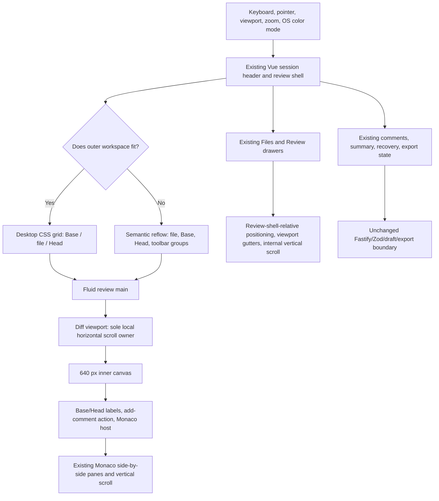

# Phase 08: Accessible Responsive Continuity - Research

**Researched:** 2026-07-28
**Domain:** Responsive browser workspace ownership, WCAG 2.2 AA presentation, forced-colors durability, and unchanged review-flow continuity
**Confidence:** HIGH

<user_constraints>
## User Constraints (from CONTEXT.md)

### Locked Decisions

- **D-01:** When the existing Base | file | Head header no longer fits, reflow it to active file identity first, Base/Head endpoints second, and the existing toolbar last. This keeps the current file as the primary orientation cue while preserving comparison context and all controls.
- **D-02:** Keep Base and Head paired left/right while each endpoint remains usable. At the smallest effective widths, stack Base above Head with explicit labels rather than truncate meaningful selector identities. Preserve Base-before-Head reading order and the established relationship to the Monaco panes.
- **D-03:** Reflow the toolbar only at semantic-group boundaries. Keep each previous/next pair intact, preserve file navigation before change navigation before Review/Keyboard Help, and move whole groups to later rows as needed. Do not split pairs unpredictably or replace visible controls with a menu.
- **D-04:** Allow the complete active path to wrap without hiding content, while retaining quieter directory text and stronger filename emphasis. For renamed or copied files, stack the existing old → new identity when necessary at the smallest widths rather than depending on ellipsis or hover-only disclosure.

### the agent's Discretion

Exact responsive breakpoints, endpoint minimums, wrapping thresholds, row/column gaps, and the smallest-width stack geometry remain flexible. Drawer width behavior, non-header long-content wrapping, forced-color system-color mappings, composited-contrast adjustments, and validation scenario details were not selected for discussion; research and planning should choose the smallest standards-aligned implementation that satisfies A11Y-01 through A11Y-03, RESP-01, and CONT-01. All such choices remain bounded by the inherited semantic-token, non-color-cue, unclipped-focus, side-by-side Monaco, and unchanged-workflow contracts.

### Deferred Ideas (OUT OF SCOPE)

None — discussion stayed within phase scope.
</user_constraints>

<phase_requirements>
## Phase Requirements

| ID | Description | Research Support |
|----|-------------|------------------|
| A11Y-01 | User can read normal text and identify meaningful UI indicators at WCAG 2.2 AA contrast after translucent diff, selection, and state layers are composited. | Use the existing semantic palette, add one shared control-boundary token, promote essential copy where measured composites fail, and verify rendered RGBA source-over composites: 4.5:1 for normal text and 3:1 for meaningful non-text indicators. [VERIFIED: `.planning/REQUIREMENTS.md`, `08-UI-SPEC.md`; CITED: https://www.w3.org/WAI/WCAG22/Understanding/contrast-minimum.html; CITED: https://www.w3.org/WAI/WCAG22/Understanding/non-text-contrast.html] |
| A11Y-02 | User has a persistent, unclipped focus indicator on every operable control and editor surface. | Preserve the global 2 CSS px focus treatment, add local inset fallbacks only at clipping boundaries, audit the UI-spec focus inventory by keyboard, and verify both focused state and geometry against clipping ancestors. [VERIFIED: `src/web/styles.css`, `08-UI-SPEC.md`; CITED: https://www.w3.org/WAI/WCAG22/Understanding/focus-visible.html; CITED: https://www.w3.org/WAI/WCAG22/Understanding/focus-not-obscured-minimum.html] |
| A11Y-03 | User can identify durable text labels, markers, borders, and focus when forced-colors mode is active. | Extend the existing targeted `@media (forced-colors: active)` rules with system colors for application-owned boundaries, rails, signed Base/Head cues, anchors, status edges, and focus; retain Monaco's automatic high-contrast behavior. [VERIFIED: `src/web/styles.css`, `node_modules/monaco-editor/monaco.d.ts`; CITED: https://developer.mozilla.org/en-US/docs/Web/CSS/Reference/At-rules/@media/forced-colors] |
| RESP-01 | User can complete the review on narrow viewports and at 400% zoom without page-level horizontal scrolling; only the diff viewport owns local two-dimensional scrolling. | Move the fixed 640 CSS px floor from the review page to a presentational inner diff canvas, make its viewport the sole horizontal scroll owner, reflow header/toolbars/drawers/text, and assert document width separately from canvas overflow. [VERIFIED: `DiffWorkspace.vue`, `styles.css`, `08-UI-SPEC.md`; CITED: https://www.w3.org/WAI/WCAG22/Understanding/reflow.html] |
| CONT-01 | User can complete the existing review workflow unchanged across responsive and accessible presentation contexts. | Keep component state, events, command bindings, persistence, line mapping, and export mechanics unchanged; reuse existing packaged full-flow tests and add targeted narrow/keyboard/zoom presentation coverage around them. [VERIFIED: `App.vue`, `ReviewToolbar.vue`, `diff-adapter.ts`, existing Playwright suites] |
</phase_requirements>

## Summary

Phase 08 should be implemented as a presentation-boundary correction, not as a new responsive application mode. The current page-wide 640 CSS px floor sits on `.diff-workspace` and is reinforced by narrow-layout rules that keep `.review-main` at 640 px; that makes the application page, rather than a dedicated diff viewport, own the overflow. The correct cut is two presentational wrappers in `DiffWorkspace.vue`: a fluid viewport and an inner 640 px canvas containing the Base/Head labels, add-comment action, and Monaco host. The context-help row remains outside that canvas. [VERIFIED: `src/web/components/DiffWorkspace.vue`, `src/web/styles.css`, `08-UI-SPEC.md`]

The surrounding workspace can then reflow without changing its information architecture. Reorder the header DOM to file identity, Base endpoint, Head endpoint so narrow reading order follows D-01/D-02, and restore the desktop Base | file | Head visual arrangement with CSS grid areas. Keep toolbar groups atomic, anchor drawers to the existing review-shell row instead of a hard-coded 64 px top offset, let meaningful strings wrap, and remove the fixed-width warning pseudo-content. No component state machine, API, draft, command, Monaco line-mapping, or export change is required. [VERIFIED: `src/web/App.vue`, `ReviewToolbar.vue`, `PathDisplay.vue`, `styles.css`]

Accessibility work should remain semantic-token driven. Add the specified `--control-boundary` role, measure actual rendered composites rather than raw tokens, preserve the global focus contract with inset exceptions only where necessary, and expand the existing forced-colors block using CSS system colors. Chromium emulation gives repeatable forced-colors coverage on this macOS workstation, while a real Windows high-contrast pass remains a non-blocking manual follow-up when that environment is available. [VERIFIED: `src/web/styles.css`, environment audit; CITED: https://developer.mozilla.org/en-US/docs/Web/CSS/Reference/Values/system-color]

**Primary recommendation:** Make the inner Monaco canvas—not `.review-main`, `.review-shell`, or the document—the only 640 px horizontal overflow island, then verify every accessibility requirement against rendered browser states while running the existing end-to-end review contracts unchanged.

## Architectural Responsibility Map

| Capability | Primary Tier | Secondary Tier | Rationale |
|------------|--------------|----------------|-----------|
| Header and toolbar reflow | Browser / Client | — | Existing Vue markup and global CSS own presentation order; no API data shape changes. [VERIFIED: `App.vue`, `ReviewToolbar.vue`] |
| Local side-by-side diff scrolling | Browser / Client | Monaco editor | Application CSS owns the viewport/canvas boundary while Monaco continues to own pane geometry, vertical scrolling, line mapping, and diff semantics. [VERIFIED: `DiffWorkspace.vue`, `diff-adapter.ts`] |
| Drawer containment and narrow sizing | Browser / Client | — | Existing inertness, focus restoration, and state remain in Vue; CSS should only change containing block, offsets, caps, and internal overflow. [VERIFIED: `App.vue`, `styles.css`] |
| Contrast, focus, grayscale, and forced-colors presentation | Browser / Client | Browser/OS accessibility mode | Semantic CSS and public app-owned Monaco overlay classes provide durable cues; the user agent supplies forced system colors and Monaco high-contrast detection. [VERIFIED: `styles.css`, `monaco.d.ts`; CITED: https://developer.mozilla.org/en-US/docs/Web/CSS/Reference/At-rules/@media/forced-colors] |
| Review comments, summary, persistence, and export | API / Backend | Browser / Client | These mechanics are already validated and are explicitly unchanged; Phase 08 only proves that existing controls remain reachable and operable. [VERIFIED: `.planning/PROJECT.md`, `08-UI-SPEC.md`, existing e2e suites] |
| Security and validation boundaries | API / Backend | Browser / Client | Existing Zod/API contracts and Vue text interpolation remain authoritative; responsive CSS must not introduce a second data or rendering path. [VERIFIED: repository project constraints and current components] |

## Project Constraints (repository context)

- Use Node.js 24 LTS and TypeScript end to end; the browser stack remains Vue 3, Vite, and Monaco Diff Editor. [VERIFIED: `.claude/CLAUDE.md`, `package.json`]
- Preserve native Git as the source of truth, loopback-only Fastify serving, shared Zod contracts, repository-local versioned JSON persistence, and text-only v1 review scope. Phase 08 should not touch any of these boundaries. [VERIFIED: `.claude/CLAUDE.md`, `.planning/PROJECT.md`]
- Preserve Monaco side-by-side rendering, public line-change geometry, application-owned decorations/view zones, and existing keyboard commands. [VERIFIED: `diff-adapter.ts`, `08-UI-SPEC.md`]
- Reuse the existing centralized semantic token and global stylesheet convention; do not add a component styling system, alternate palette, runtime breakpoint state, remote assets, or a UI framework. [VERIFIED: `src/web/styles.css`, `08-UI-SPEC.md`]
- Use Playwright for real browser flow validation and existing Vitest coverage for non-browser contracts; research itself ran no formatter, linter, test, or project-wide suite. [VERIFIED: project constraint and this research session]
- No `AGENTS.md` directives were supplied for this repository; the loaded `.claude/CLAUDE.md` project context is the applicable repository instruction source. [VERIFIED: injected repository context]

## Existing System Findings

### Exact seams to change

| File / symbol | Current condition | Prescriptive Phase 08 action |
|---------------|-------------------|-------------------------------|
| `src/web/components/DiffWorkspace.vue` template | Labels, add-comment action, editor host, and help copy are direct children of a `.diff-workspace` section. [VERIFIED: codebase] | Add only `.diff-workspace__viewport` and `.diff-workspace__canvas`; put labels/action/editor in canvas and keep help outside viewport. Do not change script, props, events, focus targets, or ARIA. |
| `src/web/App.vue` session context | DOM order is Base, file, Head while narrow reading order must be file, Base, Head. [VERIFIED: codebase and D-01/D-02] | Reorder the three existing blocks and add/use stable modifier classes or grid areas; preserve their content and handlers byte-for-byte. |
| `src/web/styles.css` `.review-main` / `.diff-workspace` | Narrow rules retain a 640 px main/workspace floor and the workspace hides overflow. [VERIFIED: codebase] | Make all ancestors fluid with `min-width: 0`; transfer the 640 px floor and horizontal overflow ownership to canvas/viewport. |
| `src/web/styles.css` `.session-context` | Endpoint names/OIDs and active paths use no-wrap ellipsis. [VERIFIED: codebase] | Use the locked responsive ordering and allow semantic wrapping with `overflow-wrap: anywhere`; retain directory/filename emphasis. |
| `src/web/styles.css` `.review-toolbar` | Toolbar can wrap, but group atomicity and the smallest-row arrangement are not fully contractual. [VERIFIED: codebase] | Keep each existing group non-wrapping and let whole groups wrap in source order; do not collapse controls into a menu. |
| `src/web/styles.css` drawer media rules | Drawers use hard-coded `top: 64px`; narrow review drawer uses a 32 px total gutter. [VERIFIED: codebase] | Make `.review-shell` the containing block, use `top: 0; bottom: 0`, and use an 8 px viewport gutter with the existing 288/360 px caps. |
| `src/web/styles.css` path/receipt metadata | Several meaningful values are ellipsized, horizontally scrolled, or clipped outside the diff. [VERIFIED: codebase] | Make non-diff user text wrap; use one-column receipt metadata at narrow widths and `overflow-wrap: anywhere` for hashes/paths. |
| `src/web/styles.css` focus rules | A global 2 px outline exists, but some clipped/scrolling surfaces can consume its outer pixels. [VERIFIED: codebase] | Keep the global contract and add inset/negative-offset variants only to identified clipping boundaries; preserve a distinct outermost state. |
| `src/web/styles.css` forced-colors block | Generic controls and selected tabs/files are covered, but app-owned Monaco signs/bars/pane focus, anchors, comment selection, status edges, and several state markers are not explicit. [VERIFIED: codebase] | Add targeted system-color rules for those public application classes without opting the subtree out of user colors. |
| `tests/integration/anchored-workspace.spec.ts` | One assertion encodes the obsolete page-level `review-main >= 640` behavior; geometry coverage stops above 320 px. [VERIFIED: codebase] | Replace it with document/viewport/canvas ownership assertions and include 1099, 767, 640, and 320 px boundaries. |
| `tests/e2e/responsive-session.spec.ts` | It already owns packaged responsive, drawer, palette, focus, and forced-color checks, but some assertions use synthetic states or opaque-only contrast math. [VERIFIED: codebase] | Extend it with real application states, rendered composite math, exact 8 px drawer gutters, keyboard focus geometry, grayscale, and browser forced-colors emulation. |

### Seams to preserve

- `src/web/monaco/diff-adapter.ts` must keep `renderSideBySide: true`, public original/modified editor access, existing aria labels, immutable models, line-change mapping, view-zone ownership, and command wiring. The new canvas must retain the Monaco host and action in one coordinate space because existing action positioning uses `host.offsetTop`. [VERIFIED: codebase]
- `ReviewToolbar.vue`, `PathDisplay.vue`, and `PathText.vue` already expose the required semantic groups and directory/filename structure; CSS and parent ordering are sufficient. [VERIFIED: codebase]
- Existing drawer logic already uses `inert`, `aria-hidden`, Escape handling, and opener focus restoration. Do not rewrite it for responsive behavior. [VERIFIED: `App.vue`]
- Existing full-flow suites already exercise draft recovery, selector drift, comment lifecycle, summary, packaged export, relaunch, and receipts. Phase 08 should reuse these contracts rather than fork presentation-specific persistence behavior. [VERIFIED: test inventory]

## Standard Stack

### Core

| Library | Installed version | Purpose in this phase | Why standard here |
|---------|-------------------|-----------------------|-------------------|
| Vue | 3.5.39 | Preserve the existing semantic DOM and component event boundaries. | Already owns the shipped browser workspace; only two presentational wrappers and one DOM reorder are needed. [VERIFIED: `package.json`, codebase] |
| Monaco Editor | 0.55.1 | Continue side-by-side diff rendering, pane accessibility, focus, vertical scroll, and line geometry. | It is the established diff authority and its installed API defaults include automatic high-contrast detection and automatic accessibility support. [VERIFIED: `package.json`, `node_modules/monaco-editor/monaco.d.ts`] |
| CSS media queries and system colors | Browser platform | Reflow, 400% zoom behavior, reduced motion, and forced-colors adaptation. | Native layout and accessibility media features avoid a second runtime layout mode. [CITED: https://developer.mozilla.org/en-US/docs/Web/CSS/Reference/At-rules/@media/forced-colors] |
| Playwright | 1.61.1 | Real Chromium viewport, keyboard, focus, forced-colors, and packaged-flow checks. | Existing project test boundary; its official API supports viewport resizing, media emulation, focus assertions, and browser evaluation. [VERIFIED: `package.json`; CITED: https://github.com/microsoft/playwright/blob/main/docs/src/api/class-page.md] |

### Supporting

| Library / API | Installed version | Purpose | When to use |
|---------------|-------------------|---------|-------------|
| Vite | 8.1.4 | Serve/build the existing browser assets. | Reuse current integration and packaged browser harnesses; no configuration change is indicated. [VERIFIED: `package.json`] |
| Chrome DevTools Protocol `Emulation.setEmulatedVisionDeficiency` | Browser-provided | Emulate achromatopsia for deterministic grayscale cue checks. | Use through a Playwright Chromium CDP session in the targeted browser suite, then reset to `none`. [CITED: https://chromedevtools.github.io/devtools-protocol/tot/Emulation/#method-setEmulatedVisionDeficiency] |
| Existing CSS custom properties | Repository-local | Keep color roles centralized and auditable. | Add only `--control-boundary: #8B949E`; reuse existing roles for all other Phase 08 changes. [VERIFIED: `08-UI-SPEC.md`, `styles.css`] |

### Alternatives Considered

| Instead of | Could use | Tradeoff |
|------------|-----------|----------|
| Native CSS reflow | JavaScript `matchMedia` state or duplicate mobile components | Rejected: creates a second layout/state path and risks divergent focus, commands, and persistence. [VERIFIED: `08-UI-SPEC.md`] |
| Inner fixed-width diff canvas | Stack or replace Monaco panes on mobile | Rejected: violates the inherited side-by-side contract and changes review mechanics. [VERIFIED: CONTEXT.md, UI spec] |
| Targeted forced-colors rules | Blanket `forced-color-adjust: none` | Rejected: prevents user-agent color substitution and can defeat user-selected accessibility colors. [CITED: https://developer.mozilla.org/en-US/docs/Web/CSS/Reference/Properties/forced-color-adjust] |
| Existing Playwright harness | New accessibility or screenshot dependency | Rejected: no package is needed for the specified layout, focus, computed-style, keyboard, or emulation assertions. [VERIFIED: package/test inventory] |

**Installation:** None. This phase must not install external packages. [VERIFIED: `08-UI-SPEC.md` and current stack]

## Package Legitimacy Audit

Not applicable: the prescribed implementation uses only already-installed project dependencies and browser APIs, and recommends no package installation. No package legitimacy checkpoint is required. [VERIFIED: stack and implementation analysis]

## Architecture Patterns

### System Architecture Diagram



The diagram assigns all new behavior to CSS presentation boundaries; review data and persistence still cross the existing API boundary unchanged. [VERIFIED: codebase and UI spec]

### Recommended Project Structure

```text
src/web/
├── App.vue                              # Header DOM order; existing drawer/focus behavior preserved
├── components/
│   └── DiffWorkspace.vue               # Two presentational overflow wrappers only
├── monaco/
│   └── diff-adapter.ts                  # No behavioral change; public Monaco authority preserved
└── styles.css                           # Tokens, responsive ownership, wrapping, focus, forced colors

tests/
├── integration/
│   ├── anchored-workspace.spec.ts       # Layout and scroll-ownership geometry at boundary widths
│   └── monaco-anchor.spec.ts            # Existing overlap/line-geometry regression retained
└── e2e/
    ├── responsive-session.spec.ts       # Rendered accessibility and responsive matrix
    ├── complete-review-draft.spec.ts    # Existing workflow/keyboard/persistence continuity
    └── agent-ready-export.spec.ts       # Existing packaged export/relaunch continuity
```

### Pattern 1: Semantic DOM Order, CSS Visual Order

**What:** Put file identity first in the DOM, followed by Base then Head. Use grid areas to render the established Base | file | Head desktop composition and let narrow layouts follow semantic source order.

**When to use:** Always for the session context; do not use CSS `order` to make keyboard/assistive reading order disagree with the narrow visual order.

```css
/* Source: locked D-01/D-02 and existing project CSS convention */
.session-context {
  display: grid;
  grid-template-areas: "base file head";
  grid-template-columns: minmax(0, 1fr) minmax(0, 1.4fr) minmax(0, 1fr);
}

.session-context__file { grid-area: file; }
.session-context__endpoint--base { grid-area: base; }
.session-context__endpoint--head { grid-area: head; }

@media (max-width: 1099px) {
  .session-context {
    grid-template-areas:
      "file file"
      "base head";
    grid-template-columns: minmax(0, 1fr) minmax(0, 1fr);
  }
}

@media (max-width: 767px) {
  .session-context {
    grid-template-areas: "file" "base" "head";
    grid-template-columns: minmax(0, 1fr);
  }
}
```

The 1099/767 boundaries align with the existing responsive system and the UI-spec acceptance matrix, avoiding additional nearby breakpoint conventions. [VERIFIED: `styles.css`, `08-UI-SPEC.md`]

### Pattern 2: Fluid Viewport Around a Fixed Comparison Canvas

**What:** Keep the app shell fluid and put the unavoidable two-column width on an inner canvas. The viewport alone scrolls horizontally.

**When to use:** Only around the visual diff section; no other application region receives a fixed width or horizontal scrolling.

```vue
<!-- Source: 08-UI-SPEC.md; presentational structure only -->
<section class="diff-workspace" aria-label="File diff">
  <div class="diff-workspace__viewport">
    <div class="diff-workspace__canvas">
      <!-- existing Base/Head labels -->
      <!-- existing add-comment action -->
      <!-- existing Monaco host -->
    </div>
  </div>
  <!-- existing context keyboard help remains outside the canvas -->
</section>
```

```css
.diff-workspace,
.diff-workspace__viewport {
  min-width: 0;
  max-width: 100%;
}

.diff-workspace__viewport {
  overflow-x: auto;
  overflow-y: hidden;
}

.diff-workspace__canvas {
  position: relative;
  min-width: 640px;
}
```

W3C's Reflow guidance explicitly treats a two-dimensional code/change comparison as a valid local exception, but the exception must be restricted to that section rather than applied to the whole page. [CITED: https://www.w3.org/WAI/WCAG22/Understanding/reflow.html]

### Pattern 3: CSS-Only Progressive Reflow

**What:** Reflow in layers: desktop three-column identity; mid-width file-first plus paired endpoints; smallest width file, Base, Head; toolbar atomic groups on following rows. Drawers overlay within the review-shell row and keep internal vertical scrolling.

**When to use:** At every UI-spec boundary width—1440, 1280, 1100, 1099, 768, 767, 640, and 320 CSS px—and at true 400% browser zoom from a 1280 CSS px starting viewport. [VERIFIED: `08-UI-SPEC.md`]

Implementation rules:

1. Remove the `min-width: 640px` ownership from `.review-main` and `.diff-workspace`; ensure grid/flex ancestors use `min-width: 0`.
2. Remove the narrow fixed-width warning pseudo-element because the diff viewport itself communicates local horizontal reachability without adding copy. [VERIFIED: UI spec]
3. Make each `.review-toolbar__group` an indivisible flex item (`flex-wrap: nowrap; flex: 0 0 auto`) while the toolbar wraps groups in existing source order.
4. Give `.review-shell` `position: relative`; anchor overlay drawers with block inset `0` instead of a header-height constant.
5. Cap Files at 288 px and Review at 360 px, with `max-width: calc(100vw - 16px)` and 8 px edge gutters. Let drawer bodies—not the document—own vertical overflow. [VERIFIED: UI spec]
6. Remove/relax `body { min-width: 320px; }` so the shell never creates a document floor; validate the exact rendered layout before relying on overflow clipping. [VERIFIED: current CSS; recommendation derived from RESP-01]

### Pattern 4: Rendered Composite Contrast Audit

**What:** Measure the foreground against the background the browser actually renders after source-over compositing every translucent ancestor and pseudo-layer. Do not compare token literals in isolation.

**When to use:** Required body/control labels, meaningful boundaries/icons, Base/Head signs and bars, selected rails, anchors, focus, notices, comment states, and overlapping Monaco diff/selection/anchor states.

The test helper should:

1. Obtain computed `color`, `background-color`, opacity, and relevant `::before`/`::after` colors for the target state.
2. Composite RGBA layers from back to front using source-over alpha.
3. Convert sRGB channels to relative luminance and compute `(L1 + 0.05) / (L2 + 0.05)`.
4. Require at least 4.5:1 for normal text and at least 3:1 for meaningful non-text state indicators; do not round a failing value upward. [CITED: https://www.w3.org/WAI/WCAG22/Understanding/contrast-minimum.html; CITED: https://www.w3.org/WAI/WCAG22/Understanding/non-text-contrast.html]

Use a small test-only helper in the existing Playwright file; do not add a runtime contrast subsystem. Drive real selected/resolved/error/recovery/export states through routes and controls instead of applying test-only classes. [VERIFIED: existing test seams; recommendation]

### Pattern 5: Persistent Focus With Local Inset Fallbacks

**What:** Retain the existing global 2 px outline and 2 px offset. At an identified clip boundary, give only that target a visible inset/negative-offset 2 px ring plus sufficient scroll padding; in forced colors, map the ring to `Highlight`.

**When to use:** Monaco pane focus, scrollable tree/review items at viewport edges, drawer close controls, inline composer actions, tabs, receipt/recovery actions, and any control whose outer ring is clipped in an overflow ancestor.

Focus verification must use actual keyboard traversal/commands, assert the intended element is focused, and compare its focus indicator rectangle or inset pixels with every clipping ancestor. `locator.focus()`/`toBeFocused()` can support isolated checks, but a Tab/command journey is necessary to prove order and persistent visibility. [CITED: https://github.com/microsoft/playwright/blob/main/docs/src/api/class-page.md; CITED: https://www.w3.org/WAI/WCAG22/Understanding/focus-visible.html]

### Pattern 6: Targeted Forced-Colors Mapping

**What:** Let the browser force ordinary colors, then use system color keywords for meaningful app-owned semantics that would otherwise disappear when backgrounds and shadows are suppressed.

```css
/* Source: MDN forced-colors/system-color guidance + 08-UI-SPEC.md */
@media (forced-colors: active) {
  :focus-visible,
  .monaco-diff-pane:focus-within {
    outline-color: Highlight;
  }

  .monaco-diff-change-bar--base,
  .monaco-diff-change-bar--head {
    background: CanvasText;
  }

  .monaco-diff-change-bar--base { border-style: dashed; }
  .monaco-diff-change-bar--head { border-style: solid; }

  .monaco-diff-change-sign--base::before { content: "−"; color: CanvasText; }
  .monaco-diff-change-sign--head::before { content: "+"; color: CanvasText; }

  .monaco-anchor-line { outline-color: LinkText; }
  .review-comment--selected { border-color: Highlight; }
}
```

Use `Canvas`, `CanvasText`, `ButtonFace`, `ButtonText`, `ButtonBorder`, `GrayText`, `LinkText`, and `Highlight` by semantic role. Never blanket-apply `forced-color-adjust: none`, never simulate private Monaco DOM, and never rely on box shadow or background image as the only forced-color cue because forced colors may suppress them. [CITED: https://developer.mozilla.org/en-US/docs/Web/CSS/Reference/At-rules/@media/forced-colors; CITED: https://developer.mozilla.org/en-US/docs/Web/CSS/Reference/Values/system-color]

### Anti-Patterns to Avoid

- **Page-level `min-width: 640px`:** It makes the document the horizontal scroll owner. Keep that floor only on `.diff-workspace__canvas`.
- **`overflow-x: hidden` as proof of reflow:** It can hide clipped content while making a width assertion pass. Assert reachability, text wrapping, and drawer geometry in addition to `scrollWidth`.
- **CSS visual order that contradicts DOM order:** It produces an incoherent keyboard/screen-reader sequence. Reorder the three existing header blocks semantically first.
- **Runtime mobile state:** It duplicates presentation logic and risks focus/command divergence. Use native CSS media queries.
- **Ellipsis or hover-only disclosure for meaningful identities:** It violates D-02/D-04. Wrap paths, selectors, OIDs, hashes, and receipt values.
- **Breaking toolbar pairs:** Previous/next pairs are one semantic unit; wrap only whole groups.
- **Hard-coded header-height drawer offsets:** The header grows at narrow widths. Anchor drawers to `.review-shell`, not `top: 64px`.
- **Changing Monaco to inline/single-pane at narrow width:** Side-by-side is a locked product contract; local scrolling is the chosen exception.
- **Testing raw token contrast:** Alpha diff/selection/state layers change the result. Test computed composites for real states.
- **Color-only Base/Head distinction:** Preserve literal minus/plus signs and dashed-versus-solid bar treatment in normal and forced colors.
- **Blanket `forced-color-adjust: none`:** It overrides the user's palette and makes the application responsible for every high-contrast color.
- **Synthetic state classes as the only accessibility evidence:** Route or interact into the real state so the test covers actual markup and cascade.
- **Private Monaco selectors:** Continue to style public application-owned overlays and pane classes only.
- **New copy or focus destinations:** Remove the obsolete warning; do not add responsive-only instructions, menus, commands, or tabbable elements.

## Don't Hand-Roll

| Problem | Don't build | Use instead | Why |
|---------|-------------|-------------|-----|
| Responsive mode selection | JavaScript breakpoint store or duplicated mobile tree | CSS grid/flex/media queries | One semantic tree preserves state, focus, commands, and ARIA. [VERIFIED: UI spec] |
| Diff rendering at narrow width | Custom stacked diff renderer | Existing Monaco side-by-side editor inside local canvas | Monaco remains the line-mapping and diff authority. [VERIFIED: project constraints] |
| High-contrast palette | Parallel dark/high-contrast theme engine | `forced-colors`, system colors, Monaco auto-detection | User-agent/OS colors are the authority; author backgrounds may be suppressed. [CITED: MDN forced-colors] |
| Accessible disclosure | Truncation plus custom tooltip | Native wrapping and existing visible labels | Complete identities remain perceivable without pointer hover. [VERIFIED: D-02/D-04] |
| Focus management | New responsive focus trap or DOM replacement | Existing inert/Escape/opener restoration plus CSS ring geometry | Drawer behavior is already correct; only its presentation boundary changes. [VERIFIED: `App.vue`] |
| Runtime contrast checker | Shipping color-analysis code | Small deterministic Playwright helper over computed styles | Contrast verification belongs in validation, not product runtime. [CITED: W3C contrast guidance] |
| Grayscale rendering mode | Product filter/toggle | Chromium CDP achromatopsia emulation in tests | The requirement is cue independence, not a product grayscale mode. [CITED: Chrome DevTools Protocol] |

**Key insight:** The hard parts—diff semantics, keyboard commands, focus restoration, draft persistence, and export—already exist. Phase 08 succeeds by assigning overflow and color responsibilities to the correct browser layers, not by introducing substitutes for those systems.

## Detailed Implementation Guidance

### Header, endpoints, and toolbar

- Change `App.vue` source order to active file, Base, Head. Retain explicit Base/Head labels and every existing button/attribute. [VERIFIED: D-01/D-02 and current template]
- At 768–1099 px, use a full-width file row followed by paired Base/Head columns; at 767 px and below, stack file, Base, Head. At 1100 px and above, use grid areas for Base | file | Head. [VERIFIED: UI-spec matrix]
- Replace endpoint/path ellipsis with `white-space: normal`, `min-width: 0`, and `overflow-wrap: anywhere`. Keep `.path-text__directory` quiet and `.path-text__filename` strong through existing semantic roles. [VERIFIED: D-04 and current PathText structure]
- For renamed/copied paths, allow old, arrow, and new to wrap; at the smallest breakpoint make old/new full-row items while retaining the visible arrow and existing accessible label. [VERIFIED: `PathDisplay.vue`, D-04]
- Preserve toolbar source order: file navigation, change navigation, Review/Keyboard Help. Apply no-wrap inside each group and wrap only at group boundaries. [VERIFIED: `ReviewToolbar.vue`, D-03]

### Diff overflow ownership

- `.review-main`, `.diff-workspace`, and the new viewport must all be fluid (`width: 100%`, `min-width: 0`, `max-width: 100%`).
- `.diff-workspace__viewport` must be the only horizontal overflow owner and expose its scroll offset in the integration test.
- `.diff-workspace__canvas` keeps `min-width: 640px`, Base/Head labels, action, and host in one positioned coordinate system.
- Keep the Monaco panes' existing vertical scroll owners and gutter/sash/view-zone geometry unchanged. [VERIFIED: `anchored-workspace.spec.ts`, `monaco-anchor.spec.ts`, UI spec]
- Keep context keyboard help outside the canvas so it wraps within the outer content width rather than extending page width. [VERIFIED: UI spec]

### Drawers and non-diff content

- Make `.review-shell` the positioned containing block so its top edge is naturally below the variable-height session header; remove the 64 px assumption. [VERIFIED: current shell grid and drawer CSS]
- At narrow widths, Files uses `width: min(288px, calc(100vw - 16px))` and Review uses `width: min(360px, calc(100vw - 16px))`; offset the active edge by 8 px. [VERIFIED: UI spec]
- Preserve internal vertical scrolling and all existing inert/aria-hidden/Escape/opener restoration behavior. [VERIFIED: current App.vue]
- Give flex/grid children containing user text `min-width: 0; max-width: 100%`; allow comment bodies, forms, actions, notice copy, selector identities, paths, and hashes to wrap. Use a one-column receipt definition list below 768 px. [VERIFIED: UI spec and current components]

### Contrast corrections

- Add `--control-boundary: #8B949E` at `:root` and use it for form fields, checkboxes, and necessary outlined control boundaries. Do not scatter the literal. [VERIFIED: UI spec]
- Measure first. Promote required semantic body text from a failing muted/semantic tint to `--text-primary` while retaining semantic hue on an adjacent icon, edge, sign, or label. Do not globally flatten informational color roles. [VERIFIED: UI spec]
- Cover composite scenarios, not merely components: normal/hover/focus/disabled controls; selected file; changed and selected Monaco lines; selection + anchor + diff overlap; selected/resolved/stale/orphaned comments; error/warning/success/info notices; drift/recovery; and export receipt. [VERIFIED: UI spec and current state inventory]

### Focus corrections

- Inventory every target listed in the UI spec: three skip links; identity controls; Files opener/close/tree; toolbar; Monaco panes/context/add-comment; composer/confirmation/accepted heading; Review/Summary/Open/Resolved/actions; drift/reload/gitignore/export/receipt; recovery/help. [VERIFIED: UI spec]
- Preserve the global 2 px ring and 2 px offset. Add a 2 px inset/negative-offset ring only when an overflow ancestor clips the outer ring; keep the state distinct from hover, selection, and error. [VERIFIED: UI spec and current CSS]
- Add scroll padding where keyboard focus can land against a scrollport edge. Focus must stay visible without requiring pointer movement. [CITED: https://www.w3.org/WAI/WCAG22/Understanding/focus-not-obscured-minimum.html]
- Monaco keeps its existing inset pane focus treatment; forced colors maps it to `Highlight`. [VERIFIED: current CSS and UI spec]

### Forced colors and grayscale

- Extend the existing forced-colors block rather than create a second stylesheet or theme. [VERIFIED: codebase convention]
- Map ordinary text/surfaces to Canvas/CanvasText, controls to ButtonFace/ButtonText/ButtonBorder, disabled controls to GrayText, links/anchors to LinkText, focus/selection rails to Highlight, and durable state edges to CanvasText or ButtonBorder. [VERIFIED: UI spec; CITED: MDN system colors]
- Preserve Base deletion/addition distinctions with literal minus/plus signs and dashed/solid CanvasText bars. [VERIFIED: UI spec]
- Verify grayscale after driving real states. In achromatopsia, every meaningful state must still have text, icon/sign, pattern, boundary, or position—not hue alone. [VERIFIED: A11Y-01/UI spec; CITED: CDP vision-deficiency API]
- Do not add a Monaco high-contrast theme or force `accessibilitySupport`: installed Monaco defaults `autoDetectHighContrast` to true and accessibility support to automatic. [VERIFIED: installed `monaco.d.ts`]

## Common Pitfalls

### Pitfall 1: The document appears overflow-free only because content is clipped

**What goes wrong:** `documentElement.scrollWidth <= clientWidth` passes while paths, drawers, focus rings, or controls are unreachable.

**Why it happens:** Applying `overflow-x: hidden` high in the tree masks the oversized descendant rather than reflowing it.

**How to avoid:** Pair the document-width assertion with visible text, bounding-box containment, drawer gutter, focus geometry, and local diff `scrollWidth > clientWidth` assertions.

**Warning signs:** Missing path suffixes, clipped toolbar pairs, an absent focus edge, or a diff viewport whose `scrollLeft` cannot change.

### Pitfall 2: Moving the 640 px floor but breaking editor height

**What goes wrong:** The viewport scrolls horizontally, but Monaco collapses vertically or the help row enters the canvas.

**Why it happens:** New grid wrappers omit `min-height: 0` or place the context-help row in the fixed canvas.

**How to avoid:** Preserve the existing grid row responsibilities: flexible viewport/editor row plus outer help row; keep vertical scrolling inside the established Monaco panes.

**Warning signs:** Zero-height editor host, page-level vertical scroll replacing pane scroll, or help text moving with horizontal scroll.

### Pitfall 3: Header looks correct but reads in the wrong order

**What goes wrong:** CSS visually puts the file first on narrow screens while DOM/focus order remains Base, file, Head.

**Why it happens:** Using grid/flex `order` without changing source order.

**How to avoid:** Change DOM to file, Base, Head and use desktop grid areas only for the established wide visual arrangement.

**Warning signs:** Accessibility tree or textContent order differs from the narrow visual sequence.

### Pitfall 4: Drawer offsets drift when the header wraps

**What goes wrong:** A drawer covers identity/toolbar content or starts too low.

**Why it happens:** `top: 64px` assumes a one-row header.

**How to avoid:** Position overlays relative to `.review-shell`, whose own top is already below the auto-sized header.

**Warning signs:** Geometry failures at 1099/767 px, long selectors, or 400% zoom despite passing at ordinary short content.

### Pitfall 5: Raw colors pass while composites fail

**What goes wrong:** A foreground token passes against `--surface-canvas`, but fails over translucent diff, selection, comment, or state layers.

**Why it happens:** Alpha source-over changes the actual background luminance.

**How to avoid:** Calculate the rendered composite in the real browser state and test the exact target/layer pair.

**Warning signs:** Opaque-only helper functions, checks limited to `:root`, or missing overlap cases.

### Pitfall 6: Forced-colors CSS erases semantic differences

**What goes wrong:** Both sides become identical solid bars, focus vanishes with shadow, or statuses become indistinguishable when backgrounds are removed.

**Why it happens:** Author color and shadow carried the only distinction.

**How to avoid:** Preserve literal signs, border styles, labels, edge patterns, and system-color focus/selection mappings.

**Warning signs:** Rules depend on background image/box shadow alone or opt out with `forced-color-adjust: none`.

### Pitfall 7: Programmatic focus tests miss the keyboard contract

**What goes wrong:** An isolated element can be focused, but Tab order, commands, drawer restoration, or focus visibility during scrolling is broken.

**Why it happens:** `locator.focus()` bypasses the user journey and may not exercise the same modality/style path.

**How to avoid:** Use programmatic focus only for targeted geometry; run the full command/Tab/Escape sequence with keyboard input.

**Warning signs:** No assertion for opener restoration, pane focus, command navigation, or composer/confirmation transition.

### Pitfall 8: Presentation work mutates workflow mechanics

**What goes wrong:** Responsive branches add duplicate components, handlers, draft state, or mobile-only commands.

**Why it happens:** Reflow is solved with conditional rendering rather than CSS.

**How to avoid:** Limit Vue changes to the approved wrappers and header source order; treat any script/API/schema change as a scope violation unless a demonstrated defect requires it.

**Warning signs:** New refs, emits, endpoint calls, media-query listeners, or persistence fields in a Phase 08 diff.

## Test Strategy (Nyquist workflow section disabled)

`.planning/config.json` explicitly sets `workflow.nyquist_validation` to `false`, so this research intentionally omits the formal `## Validation Architecture` artifact section. The phase still needs targeted proof because its acceptance criteria are browser-observable. [VERIFIED: `.planning/config.json`, UI spec]

### Layer 1: Anchored workspace geometry

Extend `tests/integration/anchored-workspace.spec.ts` rather than creating a parallel geometry harness.

At 1440, 1280, 1100, 1099, 768, 767, 640, and 320 CSS px, assert:

- `document.documentElement.scrollWidth <= document.documentElement.clientWidth`;
- `.review-main` is no wider than its containing review shell;
- `.diff-workspace__viewport.clientWidth <=` the available main width;
- at 320, `.diff-workspace__canvas.scrollWidth` (or bounding width) is at least 640 and the viewport has `scrollWidth > clientWidth`;
- changing viewport `scrollLeft` moves canvas content while document scroll remains zero;
- Base/Head panes, gutter bands, sash, line zones, and code origins retain existing side-by-side geometry;
- context help remains within the fluid outer width;
- app-owned add-comment action remains aligned to the same canvas/host coordinate system. [VERIFIED: existing test helpers and UI spec]

Replace—not supplement—the assertion that currently expects `.review-main` to stay at least 640 px. That expectation encodes the defect RESP-01 removes. [VERIFIED: existing test]

### Layer 2: Packaged accessibility and responsive states

Extend `tests/e2e/responsive-session.spec.ts`, using its existing packaged CLI/browser route harness.

1. **Reflow matrix:** verify header visual/source order, endpoint visibility, toolbar group rectangles, full path text, renamed/copied stack, and no page overflow at all boundary widths.
2. **Long-content matrix:** use long selectors, OIDs, moved paths, comment copy, warning/error content, and receipt hashes; assert wrapping and reachability rather than only computed `overflow` values.
3. **Drawer matrix:** at 320 px, Files width is at most 288 px with its active-edge 8 px gutter; Review is at most 304 px with 8 px on each side; both start below the actual header and scroll internally.
4. **Contrast matrix:** replace/extend opaque-only math with source-over compositing and drive real selected, resolved, stale/orphaned, recovery/drift, and export states.
5. **Focus matrix:** traverse the UI-spec inventory by Tab and commands, use `toBeFocused`, and assert the rendered ring is not clipped by ancestor rectangles.
6. **Forced colors:** call `page.emulateMedia({ forcedColors: 'active' })`, verify computed system colors and durable non-color cues, then restore ordinary media. [CITED: Playwright official API]
7. **Grayscale:** use a Chromium CDP session and `Emulation.setEmulatedVisionDeficiency` with `achromatopsia`; verify signs, dashed/solid bars, labels, boundaries, rails, and focus survive; reset with `none`. [CITED: CDP official protocol]
8. **Reduced motion:** keep existing reduced-motion coverage and ensure drawer/focus reachability does not depend on animation completion. [VERIFIED: existing CSS and UI spec]

### Layer 3: Workflow continuity

Reuse the existing real packaged suites as unchanged behavioral contracts:

- `tests/e2e/complete-review-draft.spec.ts` for file/change navigation, line-comment lifecycle, summary, conflicts, recovery, and persisted draft behavior. [VERIFIED: test inventory]
- `tests/e2e/agent-ready-export.spec.ts` for export, canonical artifacts, relaunch, and receipt behavior. [VERIFIED: test inventory]
- `tests/integration/monaco-anchor.spec.ts` for immutable models, side-specific signed bars, line mapping, selection/anchor/focus overlap, view zones, and resize geometry. [VERIFIED: test inventory]

Add one Phase 08 browser journey that uses only keyboard input at 320 px: skip links → Files → file navigation → change navigation → pane/context → add/edit/resolve comment → Review → summary/tab states → export/receipt → Escape/opener restoration. Repeat the same journey at true 400% browser zoom manually because Playwright viewport resizing is not equivalent to browser zoom. [VERIFIED: UI-spec acceptance contract]

### Manual acceptance matrix

Automated checks are necessary but not sufficient for visual clipping. Before phase sign-off, inspect:

| Context | Required observations |
|---------|-----------------------|
| 1440 and 1280 px | Stable Base | file | Head arrangement; no unnecessary scroll; drawers/rails and Monaco geometry unchanged. |
| 1100/1099 and 768/767 px | Breakpoint transitions have no overlap, missing group, hard-coded drawer gap, or DOM/visual-order mismatch. |
| 640 and 320 px | No page horizontal scroll; only diff viewport scrolls; all non-diff content and focus remain reachable. |
| 1280 px at real 400% zoom | Effective reflow behaves like 320 CSS px; complete keyboard workflow remains operable. [CITED: W3C Reflow] |
| Grayscale | Every meaningful state retains text, shape, sign, pattern, boundary, or position. |
| Chromium forced colors | System-color mappings and non-color cues remain visible; no author-color opt-out. |
| Real Windows High Contrast, when available | Confirm OS/browser integration beyond emulation; log as manual evidence, not as a macOS execution blocker. |

### Phase gate

The planner should make the gate conjunctive: document overflow is absent; diff-local overflow is present; focus inventory passes; contrast composites pass; forced-colors/grayscale cues pass; side-by-side Monaco geometry passes; and the existing packaged review/persistence/export flows remain green. Passing only a screenshot or only the old behavioral suite is insufficient. [VERIFIED: five phase requirements]

## Code Examples

### Browser forced-colors emulation

```ts
// Source: Playwright official page API
await page.emulateMedia({ forcedColors: 'active' });
// Assert app-owned markers, borders, signs, selection, and focus.
await page.emulateMedia({ forcedColors: 'none' });
```

Source: [Playwright `page.emulateMedia`](https://github.com/microsoft/playwright/blob/main/docs/src/api/class-page.md). [CITED: official documentation]

### Chromium grayscale emulation

```ts
// Source: Chrome DevTools Protocol Emulation domain
const session = await page.context().newCDPSession(page);
await session.send('Emulation.setEmulatedVisionDeficiency', {
  type: 'achromatopsia',
});
// Assert non-color distinctions in real application states.
await session.send('Emulation.setEmulatedVisionDeficiency', { type: 'none' });
```

Source: [CDP `Emulation.setEmulatedVisionDeficiency`](https://chromedevtools.github.io/devtools-protocol/tot/Emulation/#method-setEmulatedVisionDeficiency). [CITED: official protocol]

### Local scroll-ownership assertion

```ts
// Source: existing Playwright geometry pattern, adapted for RESP-01
const geometry = await page.evaluate(() => {
  const root = document.documentElement;
  const viewport = document.querySelector<HTMLElement>('.diff-workspace__viewport')!;
  const canvas = document.querySelector<HTMLElement>('.diff-workspace__canvas')!;

  return {
    documentFits: root.scrollWidth <= root.clientWidth,
    viewportOwnsOverflow: viewport.scrollWidth > viewport.clientWidth,
    canvasWidth: canvas.getBoundingClientRect().width,
  };
});

expect(geometry.documentFits).toBe(true);
expect(geometry.viewportOwnsOverflow).toBe(true);
expect(geometry.canvasWidth).toBeGreaterThanOrEqual(640);
```

This assertion must be paired with reachability and bounding-box checks so hidden clipping cannot masquerade as reflow. [VERIFIED: existing integration style; recommendation]

### Source-over alpha composition for test-only contrast

```ts
// Source: W3C contrast computation combined with standard source-over alpha
function compositeChannel(foreground: number, alpha: number, background: number) {
  return foreground * alpha + background * (1 - alpha);
}
```

Apply the result through the W3C sRGB-to-relative-luminance and contrast-ratio formula, and fail values below the threshold without rounding. [CITED: https://www.w3.org/WAI/WCAG22/Understanding/contrast-minimum.html]

## State of the Art

| Old approach in this workspace | Current prescribed approach | Basis | Impact |
|--------------------------------|-----------------------------|-------|--------|
| Page/main remains at least 640 px on narrow screens | Fluid page with a single local 640 px diff canvas | Phase 08 RESP-01 and WCAG Reflow local exception | Narrow and 400% users can reach all non-diff UI without page-level horizontal scrolling. [VERIFIED: UI spec; CITED: W3C Reflow] |
| Header identities use no-wrap ellipsis | Semantic source order plus complete wrapping and breakpoint grid areas | D-01 through D-04 | File and comparison identity remain visible without hover disclosure. [VERIFIED: CONTEXT.md] |
| Drawer top assumes a 64 px header | Drawer anchors to the actual review-shell row | Existing grid architecture + responsive header growth | Overlay geometry remains correct with wrapped headers and zoom. [VERIFIED: codebase analysis] |
| Some forced-color behavior relies on generic browser forcing | Explicit system-color mappings for durable application-owned cues | MDN forced-colors guidance + A11Y-03 | Signed sides, selected rails, anchors, status edges, and focus survive author-background suppression. [CITED: MDN forced-colors] |
| Opaque token contrast checks | Real-state rendered composite checks | WCAG contrast thresholds and alpha-layered UI | Tests detect failures created by overlapping diff/selection/state layers. [CITED: W3C Contrast Minimum/Non-text Contrast] |
| Synthetic visual fixtures as primary evidence | Real route/control state transitions plus focused geometry checks | Existing packaged Playwright architecture | Validation covers the actual cascade, markup, and state semantics. [VERIFIED: test architecture]

**Deprecated/outdated in Phase 08:**

- `.review-main { min-width: 640px; }` and `.diff-workspace { min-width: 640px; }` as narrow-layout policy: replace with the inner canvas boundary. [VERIFIED: codebase and RESP-01]
- Fixed pseudo-copy instructing users to widen the window: remove it; local diff overflow is the durable interaction model. [VERIFIED: UI spec]
- `top: 64px` drawer placement: replace with review-shell-relative positioning. [VERIFIED: codebase analysis]
- Meaningful non-diff ellipsis/nowrap/horizontal-scroll rules: replace with wrapping; horizontal scrolling remains exclusive to the diff viewport. [VERIFIED: D-04, RESP-01]

## Environment Availability

| Dependency | Required by | Available | Version | Fallback |
|------------|-------------|-----------|---------|----------|
| Node.js | Existing Vite/Playwright/browser harness | Yes | 24.15.0 | — |
| npm | Existing project scripts and packaged harness | Yes | 11.12.1 | — |
| Playwright CLI | Responsive/accessibility browser validation | Yes | 1.61.1 | — |
| Playwright Chromium | Viewport, forced-colors, keyboard, and CDP grayscale checks | Yes | cached browser revision 1228 | — |
| Real Windows High Contrast environment | Final OS-level manual confidence pass | No on this macOS workstation | — | Chromium forced-colors emulation is the automated fallback; record a real Windows pass when available. |

**Missing dependencies with no fallback:** None. [VERIFIED: environment audit]

**Missing dependencies with fallback:** Real Windows High Contrast is not locally available; Chromium `forcedColors: 'active'` covers repeatable automated assertions, while real OS testing remains recommended manual evidence. [VERIFIED: workstation and Playwright availability; CITED: Playwright official API]

## Security Domain

### Applicable ASVS Categories

| ASVS category | Applies | Standard control |
|---------------|---------|------------------|
| V2 Authentication | No | The product is a loopback-only local single-user application and Phase 08 adds no authentication boundary. Preserve existing serving constraints. [VERIFIED: project constraints] |
| V3 Session Management | No | Phase 08 changes presentation only and adds no session/token mechanism. [VERIFIED: implementation scope] |
| V4 Access Control | No new control | Preserve existing loopback/API behavior; do not create responsive-only routes or data paths. [VERIFIED: implementation scope] |
| V5 Validation, Sanitization and Encoding | Yes | Keep existing Zod request/draft/export validation and Vue text interpolation; never convert paths, comments, selector names, or receipt values to `v-html` to solve wrapping. [VERIFIED: project stack and current components] |
| V6 Stored Cryptography | No | Phase 08 handles no secrets or cryptographic material and must not change export hashing/persistence. [VERIFIED: project scope] |
| V14 Configuration | Yes | Preserve Content Security Policy/static asset constraints, local-only assets, reduced-motion handling, and browser accessibility defaults. No remote fonts/icons or UI registries. [VERIFIED: UI spec and project constraints] |

### Known Threat Patterns for this stack

| Pattern | STRIDE | Standard mitigation |
|---------|--------|---------------------|
| Untrusted repository path/comment/selector rendered as HTML | Tampering / Elevation of privilege | Preserve Vue interpolation/text bindings; do not add `v-html`, CSS-generated untrusted content, or HTML string assembly. [VERIFIED: current PathDisplay/PathText and project architecture] |
| Responsive duplicate tree sends duplicate mutations | Tampering | Keep one component instance and one event/API path; use CSS reflow only. [VERIFIED: CONT-01] |
| Hidden/clipped destructive action causes user confusion | Spoofing / Repudiation usability risk | Ensure every action and confirmation remains visible, labeled, focused, and reachable at 320/400%; preserve confirmation/focus behavior. [VERIFIED: A11Y-02, RESP-01, CONT-01] |
| Remote UI asset or package introduces supply-chain/network surface | Tampering / Information disclosure | Install no package and use no remote font/icon/registry asset. [VERIFIED: UI spec] |

Security enforcement is enabled at level 1 in `.planning/config.json`; the phase does not alter trust boundaries, but its plan should explicitly forbid unsafe rendering or duplicate mutation paths. [VERIFIED: config and architecture]

## Planning Recommendations

Use three dependency-ordered implementation plans or waves:

1. **Responsive ownership and semantic order:** `App.vue`, `DiffWorkspace.vue`, and structural responsive CSS; update anchored geometry assertions in the same plan. This establishes the only valid scroll boundary before color/focus testing.
2. **Accessible state durability:** add `--control-boundary`, measured contrast corrections, long-content wrapping, focus clipping fixes, forced-colors mappings, and real-state responsive-session coverage. This plan depends on the final geometry from wave 1.
3. **Continuity and acceptance:** exercise the full boundary-width matrix, keyboard-only 320 journey, true 400% zoom, grayscale, forced colors, overlap states, and unchanged packaged draft/export contracts. Fix only presentation regressions found here; any state/API/schema change requires explicit re-scoping.

Each task should name the exact CSS ownership invariant it establishes and the browser assertion that proves it. Avoid a generic “make responsive” task because it obscures whether document fit, local overflow, drawer containment, text reachability, and Monaco geometry were each proven. [VERIFIED: identified failure modes]

## Assumptions Log

| # | Claim | Section | Risk if wrong |
|---|-------|---------|---------------|
| — | None. Recommendations are grounded in repository code/context or cited official platform documentation. | — | — |

## Open Questions

1. **When will a real Windows High Contrast environment be available?**
   - What we know: This workstation is macOS; installed Playwright Chromium supports deterministic `forcedColors: 'active'` emulation. [VERIFIED: environment audit; CITED: Playwright official API]
   - What's unclear: The phase cannot schedule an actual Windows OS/browser pass locally.
   - Recommendation: Treat Chromium emulation as the automated gate and record a real Windows manual pass when an environment becomes available; do not block implementation planning or invent a custom high-contrast theme.

2. **Which existing semantic text pairings fail after real compositing?**
   - What we know: The stylesheet contains translucent diff/selection/state layers and the UI spec requires measured rather than presumed corrections. [VERIFIED: `styles.css`, UI spec]
   - What's unclear: Research did not run the browser/test suite or pre-decide failures because the user explicitly constrained this task to research only.
   - Recommendation: Make measurement the first action of the accessibility-state task, then change only failing semantic roles or affected selectors; preserve hue on a neighboring icon/edge/sign when text is promoted.

## Sources

### Primary (HIGH confidence)

- `.planning/phases/08-accessible-responsive-continuity/08-CONTEXT.md` — locked responsive decisions and scope.
- `.planning/phases/08-accessible-responsive-continuity/08-UI-SPEC.md` — exact accessibility, responsive, forced-colors, focus, continuity, and acceptance contracts.
- `.planning/REQUIREMENTS.md`, `.planning/ROADMAP.md`, `.planning/PROJECT.md`, `.planning/STATE.md` — requirement language, phase goal, validated product contracts, and milestone status.
- `src/web/App.vue`, `src/web/components/DiffWorkspace.vue`, `ReviewToolbar.vue`, `PathDisplay.vue`, `PathText.vue`, `src/web/styles.css`, `src/web/monaco/diff-adapter.ts` — current implementation seams and invariants.
- Existing integration/e2e tests — current geometry, palette, focus, forced-color, comment/draft/export, and packaged-flow validation patterns.
- Installed Monaco 0.55.1 type definitions — `autoDetectHighContrast` and accessibility defaults.
- [W3C WCAG 2.2 Understanding 1.4.3 Contrast (Minimum)](https://www.w3.org/WAI/WCAG22/Understanding/contrast-minimum.html) — normal-text threshold and no-rounding guidance.
- [W3C WCAG 2.2 Understanding 1.4.11 Non-text Contrast](https://www.w3.org/WAI/WCAG22/Understanding/non-text-contrast.html) — component/state indicator threshold.
- [W3C WCAG 2.2 Understanding 1.4.10 Reflow](https://www.w3.org/WAI/WCAG22/Understanding/reflow.html) — 320 CSS px/400% equivalence and local two-dimensional comparison exception.
- [W3C WCAG 2.2 Understanding 2.4.7 Focus Visible](https://www.w3.org/WAI/WCAG22/Understanding/focus-visible.html) — persistent visible focus.
- [W3C WCAG 2.2 Understanding 2.4.11 Focus Not Obscured (Minimum)](https://www.w3.org/WAI/WCAG22/Understanding/focus-not-obscured-minimum.html) — visibility and scroll-padding technique.
- [MDN `forced-colors`](https://developer.mozilla.org/en-US/docs/Web/CSS/Reference/At-rules/@media/forced-colors) — forced paint behavior and author adaptation.
- [MDN `forced-color-adjust`](https://developer.mozilla.org/en-US/docs/Web/CSS/Reference/Properties/forced-color-adjust) — opt-out semantics and user-choice warning.
- [MDN system colors](https://developer.mozilla.org/en-US/docs/Web/CSS/Reference/Values/system-color) — semantic system-color roles.
- [Playwright page API](https://github.com/microsoft/playwright/blob/main/docs/src/api/class-page.md) — viewport, media emulation, focus, and page evaluation.
- [Chrome DevTools Protocol Emulation domain](https://chromedevtools.github.io/devtools-protocol/tot/Emulation/#method-setEmulatedVisionDeficiency) — achromatopsia emulation.

### Secondary (MEDIUM confidence)

- GSD research seam digests for W3C/MDN accessibility guidance and Playwright/Monaco official documentation, classified MEDIUM by `classify-confidence` and cross-checked against repository types/code. [VERIFIED: GSD research cache]

### Tertiary (LOW confidence)

- None.

## Metadata

**Confidence breakdown:**
- Standard stack: HIGH — no new dependency; installed versions and platform APIs were inspected directly.
- Architecture: HIGH — exact Vue/CSS/Monaco seams and locked UI structure were inspected.
- Accessibility standards: HIGH — thresholds and behaviors come from W3C, MDN, Playwright, CDP, and installed Monaco definitions.
- Pitfalls: HIGH — derived from current fixed widths, clipping/overflow rules, drawer offsets, alpha layers, and existing test gaps.
- Environment: HIGH — runtime, package manager, Playwright, browser cache, and host OS were directly probed.

**Research date:** 2026-07-28
**Valid until:** 2026-08-27 (stable phase scope and pinned repository stack; re-check browser/Playwright behavior if dependencies change)
