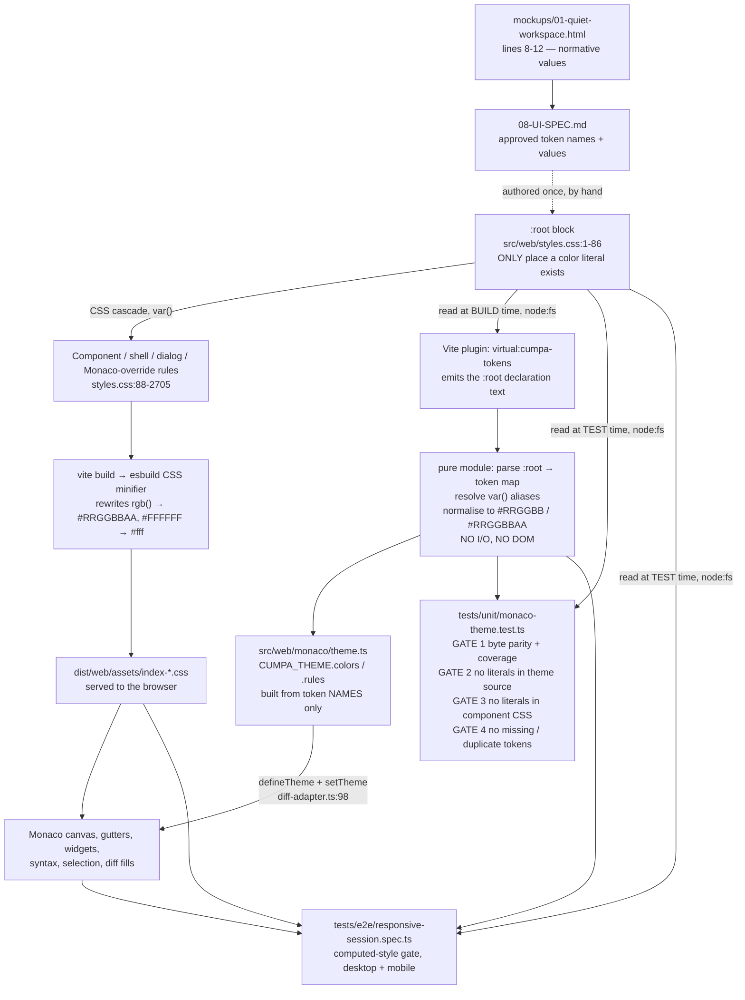

# Phase 08: Semantic Visual Foundation - Research

**Researched:** 2026-09-13
**Domain:** CSS custom-property design-token contracts + Monaco `IStandaloneThemeData` derivation + automated drift gating (Vite / Vitest / Playwright)
**Confidence:** HIGH

---

<user_constraints>
## User Constraints (from CONTEXT.md)

### Locked Decisions

None recorded. `.planning/config.json` has `workflow.skip_discuss: true`, so `08-CONTEXT.md:25-26` states:

> ### Claude's Discretion
> All implementation choices are at Claude's discretion — discuss phase was skipped per user setting. Use ROADMAP phase goal, success criteria, and codebase conventions to guide decisions.

**However**, `08-UI-SPEC.md` is an *approved, verified* design contract and is authoritative for values. Treat it as locked. Notably:

- `08-UI-SPEC.md:30` — `mockups/01-quiet-workspace.html` is the **single normative source** for Phase 08 numeric values; palette on line 8, geometry/density on line 9, overrides on lines 10-12.
- `08-UI-SPEC.md:44` — "Monaco resolver reads same root declarations. Monaco color entries receive root value unchanged. Tokenizer APIs may remove the required leading `#`, but parsed color bytes must remain identical."
- `08-UI-SPEC.md:45` — "Phase 08 is token-contract-only. May rename/centralize tokens and wire existing consumers to them, but must **not** alter tree markup/density, Monaco layout, shell composition, dialogs, comments, export, or receipt behavior."
- `08-UI-SPEC.md:211` — "One `src/web/styles.css :root` containing semantic color, type, spacing, radius, density tokens."
- `08-UI-SPEC.md:220` — "Do not add a token wrapper component, theme provider, component library, icon dependency, or third-party registry."
- `08-UI-SPEC.md:239` — Keep `color-scheme: dark`; do not add a light theme.
- `08-UI-SPEC.md:169` — The Phase 09-only tree badge palette is intentionally absent from the Phase 08 shared root.

### Claude's Discretion

- Token *naming* scheme (the UI-SPEC proposes names; they are the recommended target).
- How Monaco resolves values from the root (this document recommends one mechanism).
- Exact shape of the parity gate.
- Mapping of Monaco color keys that the UI-SPEC does not name (whitespace, indent guides, inactive selection, scrollbar hover/active, overview ruler border) — see Open Questions.

### Deferred Ideas (OUT OF SCOPE)

- Changed-file tree surface restyling — **Phase 09** (`08-CONTEXT.md:18`). `mockups/01b-quiet-workspace-tree.html` is Phase 09 input, *not* Phase 08 authority (`08-UI-SPEC.md:30`).
- Diff reading-surface treatment — **Phase 10**.
- Shell / dialog / comment surface composition — **Phase 11**.
- Behavior-continuity and packaging evidence — **Phase 12**.
- Broader contrast / zoom / reflow recertification — `DEFER-04` (`08-UI-SPEC.md:246`).
</user_constraints>

---

<phase_requirements>
## Phase Requirements

| ID | Description (`.planning/REQUIREMENTS.md:16-18`) | Research Support |
|----|-------------|------------------|
| VIS-01 | One canonical semantic token root re-derived from the mockup's values — surfaces, borders, muted text, accent, status colors, diff fills — with no second palette or hard-coded color left in component styles. | *Structural precondition already met*: `src/web/styles.css` has exactly one `:root` (lines 1-86), 78 custom properties, **zero** custom-property declarations outside it, **zero** duplicates (verified by grep). Only one production color literal survives outside the root: `src/web/styles.css:623`. Work is value re-derivation + renaming + a gate. See *Architecture Patterns*, *Pitfall 5*. |
| VIS-02 | Monaco colors match the re-derived root byte-for-byte. | Monaco parses theme colors with `Color.fromHex` (`node_modules/monaco-editor/esm/vs/editor/standalone/browser/standaloneThemeService.js:73`) → hex-only. Recommended mechanism resolves theme values from `styles.css :root` at build time via a Vite virtual module (empirically verified in this repo). See *Pattern 1*, *Pitfall 1*. |
| VIS-03 | Mockup's type scale, row density, spacing, and radius applied consistently across shell, sidebar, diff surface, dialogs, controls. | Current scale is the v1.1 GitHub-dark scale (`styles.css:57-80`); UI-SPEC mandates 4 type sizes, `--space-1..12`, and mockup radii. Consumption counts and the retirement list are in *Runtime State Inventory*. `--space-2xl` / `--space-3xl` have **zero** `var()` consumers today. |
</phase_requirements>

---

## Project Constraints (from `.claude/CLAUDE.md`)

| Directive | Consequence for Phase 08 |
|-----------|--------------------------|
| Node.js 24 LTS, TypeScript end to end | Verified `v24.15.0` installed; `package.json` `engines.node: ">=24"`. |
| UI: Vue 3 + Vite + Monaco Diff Editor | No new UI stack. Token mechanism must work inside the existing Vite pipeline. |
| Testing: Vitest for contracts, Playwright for browser flow | Parity gate belongs in Vitest (`tests/unit/`); computed-style gate stays in Playwright. |
| Contracts: Zod shared by API/persistence/export | **Not applicable** — tokens are not runtime I/O; do not introduce Zod for the token table. |
| "Components consume semantic variables; isolated component hex values are not introduced" (`DESIGN.md:21`) | Already honoured except `styles.css:623`. |
| GSD workflow enforcement | Work proceeds through `/gsd-execute-phase`. |
| `workflow.tdd_mode: true`, `workflow.security_enforcement: true`, ASVS level 1, `workflow.nyquist_validation: false` | RED/GREEN gates eligible; Security Domain section required; Validation Architecture section omitted. |

**Stale project doc — action required.** `DESIGN.md:9-21` documents the *outgoing* v1.1 GitHub-dark palette as normative ("Canvas/inset: `#0D1117` / `#010409`", "Interactive accent/focus: `#2F81F7` / `#58A6FF`", "Removed state: `#F85149`; added state: `#3FB950`", "Syntax roles: keyword `#D2A8FF`, string `#A5D6FF`, number `#F2CC60`, type `#79C0FF`") and `DESIGN.md:25-31` documents the outgoing type scale (16/24 section headings, 20/28 page headings, the `clamp(2rem, 8vw, 3.5rem)` display role). Leaving it unchanged leaves a **documented second palette**, which is precisely what VIS-01 forbids. Phase 08 owns the token contract, therefore Phase 08 owns this doc cutover.

---

## Summary

This phase is **not** a greenfield token-system build. The repository already ships a single semantic token root and a CSS↔Monaco parity test; both are correct in *structure* and wrong in *values* and *authority*.

Concretely: `src/web/styles.css:1-86` is the one and only `:root` (78 custom properties, no duplicates, nothing declared elsewhere — verified). `tests/unit/monaco-theme.test.ts` already parses that root with `node:fs` (line 107), resolves `var()` aliases (line 115), normalises `rgb(… / n%)` to `#RRGGBBAA` (lines 132-142), and asserts every Monaco color key and every token rule against it (lines 132-158). It passes today (focused run: 2/2 green). What it does *not* do is prevent drift at the source: `src/web/monaco/theme.ts:45-86` still hard-codes 36 literal hex colors and `theme.ts:9-44` hard-codes 42 literal token-rule foregrounds, so the test is a **mirror** of two independently-authored literal tables rather than a gate on one source of truth. Nothing rejects a new color literal appearing in component CSS either.

So Phase 08 has three mechanical jobs. (1) **Re-derive values.** The current palette is GitHub-dark (`#010409`, `#8B949E`, `#B1BAC4`, `#2F81F7`, `#3FB950`, `#F85149`, `#D2A8FF`, `#F2CC60`, `#484F58`, translucent `rgb(56 139 253 / 35%)` selection); the mockup's is quieter and largely opaque (`#10151c`, `#a7b1bd`, `#79b8ff`, `#7ee787`, `#ffa198`, `#ffb5ab`, `#b4d7ff`, `#1a2b43`). Every one of the 18 non-`:root` UI-SPEC values was verified present in `mockups/01-quiet-workspace.html`. (2) **Make the root the only place literals live**, so `theme.ts` builds from token *names*. (3) **Harden the gate** to reject literals at source, missing/duplicate tokens, and stray component-CSS colors.

The single hard technical constraint is that Monaco cannot consume `var()`: `standaloneThemeService.js:73` calls `Color.fromHex(themeData.colors[id])`, and `Color.fromHex` (`color.js:181-183`) is `Color.Format.CSS.parseHex(hex) || Color.red` — it accepts only `#RGB`, `#RGBA`, `#RRGGBB`, `#RRGGBBAA` (`color.js:603-646`) and **silently paints red** on anything else. A `var(--x)` string or an `rgb(…)` string in a theme color does not throw; it renders red. Three mechanisms can bridge CSS → literal hex; this document recommends a ~20-line Vite virtual module that reads `styles.css` at build time, verified working end-to-end in this repo under both `vitest run` and `vite build`.

**Primary recommendation:** Keep `src/web/styles.css :root` as the one place any color literal is authored. Add a shared Vite plugin that exposes that `:root` text as a virtual module so `src/web/monaco/theme.ts` can build `colors`/`rules` from **token names only** (zero literals in theme source, resolved at build time — no DOM, no runtime timing). Keep node-side consumers (the Vitest gate and the Playwright spec) reading `styles.css` directly with `node:fs` through the same pure parser/normaliser module. Map every Monaco color 1:1 to a root token with **no alpha arithmetic in the mapping** — if a translucent Monaco value is needed, declare it as its own root token with the alpha baked in.

---

## Architectural Responsibility Map

| Capability | Primary Tier | Secondary Tier | Rationale |
|------------|-------------|----------------|-----------|
| Authoring semantic token values | CDN / Static (`styles.css`, build-time asset) | — | The `:root` block is the single normative artifact; it must be statically analysable so component CSS, media-query overrides, and the build minifier all see the same declarations. |
| Component/shell/dialog color consumption | Browser / Client (CSS cascade) | — | `var(--token)` resolution is a browser concern; no JS involvement today and none should be added (`08-UI-SPEC.md:220` forbids a theme provider). |
| Monaco theme literal resolution | Build (Vite plugin → inlined into client bundle) | Browser / Client (`applyCumpaTheme` at `diff-adapter.ts:98`) | Monaco needs literal hex before first paint. Resolving at build removes DOM dependency, stylesheet-ordering risk, and cross-browser `getComputedStyle` serialisation differences. |
| CSS↔Monaco byte-parity enforcement | CI / Test (Vitest, `environment: 'node'`) | — | `vitest.config.ts:5` sets `environment: 'node'`; the gate must be DOM-free. It already reads `styles.css` with `node:fs` (`monaco-theme.test.ts:107`). |
| Rendered computed-style verification | CI / Test (Playwright, chromium) | — | Only a real browser proves the cascade, the build minifier's color rewriting, and `forced-colors`/`prefers-reduced-motion` behaviour. |
| Token→hex normalisation logic | Shared pure module (no tier) | — | Needed by the build tier (Monaco) and the test tier (both gates). Must be I/O-free so all three runtimes (browser bundle, Vitest, Playwright) can import it. |

**Tier misassignment to avoid:** placing token resolution in the *Browser* tier (runtime `getComputedStyle`) — see *Alternative C*. It reads as the "obvious" answer and is wrong here for four independent reasons.

---

## Standard Stack

### Core

No new dependencies. Everything required is installed.

| Library | Version | Purpose | Why Standard |
|---------|---------|---------|--------------|
| `monaco-editor` | 0.55.1 (`package.json`) | `editor.defineTheme` / `IStandaloneThemeData` | Already the diff surface; `theme.ts:1` imports it. [VERIFIED: node_modules] |
| `vite` | 7.2.4 (`package.json` devDeps) | Build; virtual-module plugin host | `vite.config.ts` already the web build (`build:web` script). [VERIFIED: package.json] |
| `vitest` | 4.1.10 (runtime banner) | Parity gate | `vitest.config.ts`, `environment: 'node'`. [VERIFIED: focused run banner] |
| `@playwright/test` | 1.61.1 | Computed-style gate | `playwright.config.ts`, chromium-only, `workers: 1`. [VERIFIED: `--version`] |
| `typescript` | 7.0.2 (`package.json`) | `typecheck:web` via `tsconfig.web.json` | Explicit `files` list — see *Pitfall 7*. [VERIFIED: package.json] |

### Supporting

| Library | Version | Purpose | When to Use |
|---------|---------|---------|-------------|
| — | — | — | **Do not add any.** No CSS-in-JS, no `postcss-*`, no `stylelint`, no design-token compiler (Style Dictionary / Theo / Tokens Studio), no `culori`/`colord`. `08-UI-SPEC.md:220` forbids new dependencies, and the required transforms are ~15 lines. |

### Alternatives Considered

| Instead of | Could Use | Tradeoff |
|------------|-----------|----------|
| Hand-written `:root` + Vitest gate | Style Dictionary / Tokens Studio codegen | Adds a dependency, a build step, and a generated file that still needs a freshness gate. Buys nothing: the gate is mandatory either way (success criterion 3). Rejected. |
| Vitest regex gate for stray CSS literals | `stylelint` + `declaration-property-value-disallowed-list` | Repo has **no** lint tooling at all (verified: no eslint/stylelint/biome/oxlint config, and `package.json` scripts contain no lint step). Introducing a linter to enforce one rule adds a dependency, a config, and a new CI verb. The check is ~20 lines of Vitest. Rejected. |
| Pure-function normaliser | `culori` / `colord` | One `rgb(r g b / n%)` → `#RRGGBBAA` conversion. Already implemented in-repo at `monaco-theme.test.ts:132-142`. Rejected. |

**Installation:** none.

**Version verification:** not applicable — no packages are added. Existing versions read from `package.json` and confirmed against installed binaries (`node --version` → `v24.15.0`, `npm --version` → `11.12.1`, `git --version` → `2.54.0`, Playwright CLI → `1.61.1`).

---

## Package Legitimacy Audit

**Not applicable — this phase installs zero external packages.**

| Package | Registry | Age | Downloads | Source Repo | Verdict | Disposition |
|---------|----------|-----|-----------|-------------|---------|-------------|
| *(none)* | — | — | — | — | — | — |

**Packages removed due to [SLOP] verdict:** none
**Packages flagged as suspicious [SUS]:** none

No `gsd-tools query package-legitimacy check` invocation is required: the recommended approach and every rejected alternative that survives review add no dependency. If a planner deviates and proposes `stylelint`, Style Dictionary, or a color library, the legitimacy gate must be run before that install and a `checkpoint:human-verify` task inserted.

---

## Architecture Patterns

### System Architecture Diagram



Primary trace: a value is authored once in `styles.css :root`; the CSS cascade carries it to every surface; the Vite plugin carries the same declaration text into the Monaco theme at build time; both test tiers re-read the same `:root` and reject divergence.

### Recommended Project Structure

```
src/web/
├── styles.css                  # :root lines 1-86 — SINGLE literal location (existing file, values re-derived)
├── theme/
│   ├── token-contract.ts       # NEW. Pure: parseTokenRoot(cssText), resolveAlias, toMonacoHex.
│   │                           #      No node:fs, no DOM, no monaco import → importable from
│   │                           #      the browser bundle, Vitest, AND Playwright.
│   └── virtual-tokens.d.ts     # NEW. Ambient decl for 'virtual:cumpa-tokens' (REQUIRED, see Pitfall 7)
├── monaco/
│   └── theme.ts                # MODIFIED. Zero color literals; colors/rules built from token names.
build/
└── token-root-plugin.ts        # NEW. ~20-line Vite plugin, imported by vite.config.ts AND vitest.config.ts
```

`token-contract.ts` must **not** import `node:fs` or `monaco-editor`. The browser bundle, the Vitest gate, and the Playwright spec all import it; only the *callers* differ in how they obtain the CSS text (virtual module vs. `readFileSync`).

---

### Pattern 1 (RECOMMENDED): Vite virtual module reads `:root` at build time

**What:** A Vite plugin resolves a synthetic id, reads `src/web/styles.css` with `node:fs`, extracts the `:root` declaration text, and emits it as an ES module. Rollup inlines the result into the client bundle; nothing is parsed at runtime in production beyond a small pure transform, and the CSS text is not shipped twice.

**When to use:** This phase. It is the only design in which a color literal exists exactly once in the tree, which is how VIS-01 ("no second palette") and `08-UI-SPEC.md:211` ("One `src/web/styles.css :root`") read.

**Verified in this repo** — both runtimes, with throwaway probes since removed:

- Under Vitest (`environment: 'node'`, plugin declared in the vitest config): probe test passed and the emitted map contained `{"--surface-canvas":"#0D1117","--surface-inset":"#010409", …}` for all 78 properties.
- Under a real `vite build`: `✓ 3 modules transformed`, and the output chunk contained the object literal inlined — `console.log({ "--surface-canvas": "#0D1117", …` — proving static inlining with no runtime file read.

```ts
// build/token-root-plugin.ts
import { readFileSync } from 'node:fs';
import { resolve } from 'node:path';

import type { Plugin } from 'vite';

const VIRTUAL_ID = 'virtual:cumpa-tokens';
const RESOLVED_ID = `\0${VIRTUAL_ID}`;

/** Exposes the single canonical :root declaration text to the client bundle at build time. */
export function tokenRootPlugin(repositoryRoot: string): Plugin {
  return {
    name: 'cumpa-token-root',
    resolveId(id) {
      return id === VIRTUAL_ID ? RESOLVED_ID : null;
    },
    load(id) {
      if (id !== RESOLVED_ID) {
        return null;
      }
      const file = resolve(repositoryRoot, 'src/web/styles.css');
      this.addWatchFile(file); // dev HMR when the root changes
      const source = readFileSync(file, 'utf8');
      const root = source.match(/:root\s*\{([\s\S]*?)\n\}/u)?.[1];
      if (root === undefined) {
        throw new Error('src/web/styles.css must declare the canonical :root token block');
      }
      return `export const TOKEN_ROOT_CSS = ${JSON.stringify(root)};\n`;
    },
  };
}
```

Register in **both** configs (the same plugin instance factory, not two copies):

```ts
// vite.config.ts  — note existing `root: resolve(import.meta.dirname, 'src/web')`
plugins: [vue(), tokenRootPlugin(import.meta.dirname)],

// vitest.config.ts — plugins ARE honoured here (verified)
plugins: [tokenRootPlugin(import.meta.dirname)],
```

**Emit the declaration *text*, not a pre-parsed map.** Parsing belongs in `token-contract.ts` so the browser path and the two node paths run byte-identical logic. If the plugin parsed and the tests parsed separately, the parsers could drift — reintroducing exactly the class of bug this phase exists to kill.

**Failure mode:** the plugin is registered in `vite.config.ts` but forgotten in `vitest.config.ts` (or vice versa) → `Cannot find module 'virtual:cumpa-tokens'` at import time. Loud and immediate, caught by the first gate run. This is the *only* failure mode, and it fails closed.

---

### Pattern 2 (REQUIRED): map every Monaco color 1:1 to a token — no alpha arithmetic

**What:** `CUMPA_THEME.colors[key]` resolves to exactly one root token, with no multiplier applied in the mapping.

**Why this matters more than it looks.** Today the *test* owns the alpha decisions, not the source: `monaco-theme.test.ts:30,34,58,59` carry `{ token: '--border-strong', alpha: 0.5 }`, `{ token: '--selection-background', alpha: 0.25 }`, `{ token: '--border-strong', alpha: 0.65 }`. The theme independently hard-codes the *results* (`'#484F5880'`, `'#388BFD40'`, `'#484F58A6'`). If Phase 08 keeps that shape and merely moves the multipliers into `theme.ts`, the gate degenerates into asserting that `Math.round(0.5 * 255)` equals `Math.round(0.5 * 255)` — a tautology that catches nothing.

**Do instead:** when Monaco needs a translucent value, declare it in the root with the alpha already baked in (the repo already does this for the two continuity tokens: `styles.css:46` `--diff-addition-intraline-background: rgb(46 160 67 / 45%)`, `styles.css:49` `--diff-deletion-intraline-background: rgb(248 81 73 / 45%)`, both preserved verbatim by `08-UI-SPEC.md`). Then `theme.ts` performs only a syntax conversion, and the gate is a pure byte comparison.

```ts
// src/web/monaco/theme.ts  (shape — no literals present)
import { TOKEN_ROOT_CSS } from 'virtual:cumpa-tokens';

import { parseTokenRoot, toMonacoHex } from '../theme/token-contract';

const TOKENS = parseTokenRoot(TOKEN_ROOT_CSS);

/** Resolves a semantic token to the #RRGGBB[AA] form Monaco's Color.fromHex requires. */
const color = (token: string): string => toMonacoHex(TOKENS, token);

export const CUMPA_THEME = {
  base: 'vs-dark',
  inherit: true,
  rules: [
    { token: '', foreground: color('--text-primary').slice(1) },   // token rules omit '#'
    { token: 'comment', foreground: color('--text-muted').slice(1) },
    // …
  ],
  colors: {
    'editor.background': color('--surface-canvas'),                 // colors REQUIRE '#'
    'editor.foreground': color('--text-primary'),
    // …
  },
} satisfies monaco.editor.IStandaloneThemeData;
```

The `#`-present / `#`-absent asymmetry is real and load-bearing: `colors` go through `Color.fromHex` (`standaloneThemeService.js:73`), while `rules[].foreground` is consumed as a bare 6-hex string by `tokenization.js:50-58,101` (`colorMap.getId(rule.foreground)`). Monaco's own bundled themes confirm the convention — `themes.js` uses `{ token: '', foreground: '000000', background: 'fffffe' }`. This is exactly what `08-UI-SPEC.md:44` means by "Tokenizer APIs may remove the required leading `#`, but parsed color bytes must remain identical."

---

### Alternative A (REJECTED): keep literals in a TS module, gate equality against CSS

Put the palette in `src/web/theme/token-contract.ts` as the source of truth; `styles.css :root` declares the same values; the Vitest gate asserts byte equality.

- **Pro:** zero build machinery. Works identically in browser, Vitest, and Playwright with no plugin, no `virtual:` declaration, no config edits.
- **Con:** every literal exists **twice**. VIS-01 says "no second palette", and `08-UI-SPEC.md:211` says "One `src/web/styles.css :root`". A reviewer can legitimately call the TS table a second palette even with a gate holding them equal.
- **Failure mode:** none functionally — the gate holds them identical. The failure is contractual, not mechanical, and it is the specific thing this phase is chartered to eliminate.
- **Verdict:** rejected on contract grounds. This is the best fallback if the virtual-module plugin is vetoed for build-complexity reasons; it satisfies criteria 2 and 3 but weakens criterion 1's "rather than maintaining a second palette".

### Alternative B (REJECTED): `import css from '../styles.css?raw'`

The obvious lazy route — no plugin needed.

- **Empirically broken here.** Probe under this repo's Vitest: `typeof css === 'string'` but `css.length === 0`. Vitest stubs `.css` module resolution and `?raw` does **not** bypass it; setting `test.css: true` did not help (probe still returned `LEN=0`, and the default import also returned `""`).
- **Failure mode — the dangerous one:** it works in `vite build` (real CSS text) and silently yields `''` under Vitest. The gate would then compare an empty token map against itself and pass, while production Monaco painted correctly — i.e. a *green gate that verifies nothing*. Inverted, a parse of `''` throws and the phase looks broken for the wrong reason.
- **Secondary cost:** even when it works, it ships the full 2,705-line / ~50 KB `styles.css` text into the JS bundle in addition to the CSS asset.
- **Verdict:** rejected. Verified non-functional.

### Alternative C (REJECTED): runtime `getComputedStyle(document.documentElement)`

Read tokens from the live cascade inside `applyCumpaTheme()`.

Four independent defects, each disqualifying:

1. **No DOM in the gate.** `vitest.config.ts:5` is `environment: 'node'`. `tests/unit/monaco-theme.test.ts` would need jsdom *and* a real stylesheet load, and `tests/unit/monaco-diff-adapter.test.ts` constructs the adapter (which calls `applyCumpaTheme` at `diff-adapter.ts:98`) — it would start requiring a DOM too. The ROADMAP explicitly requires `monaco-diff-adapter.test.ts` to keep passing **unchanged**.
2. **Cross-browser serialisation.** Chromium serialises custom-property colors to hex; other engines return `rgb(…)` / `rgba(…)`. `Color.fromHex` returns `Color.red` for those (`color.js:182`) — **no throw, no warning**. The editor would render red gutters in Firefox/Safari and the chromium-only Playwright project (`playwright.config.ts:16-24`) would never catch it.
3. **Ordering fragility.** `styles.css` is injected by a Vue SFC style block (`App.vue:1378` `<style src="./styles.css">`), not a static `<link>` — `src/web/index.html:1-13` contains no stylesheet link at all. Theme registration happens in the adapter constructor at component mount, so today's order happens to work; any future code-split or lazy-mount of `DiffWorkspace` reorders it, and the failure is a silent red repaint.
4. **No build-time gate.** Drift becomes browser-only and invisible to `test:unit`.

**Verdict:** rejected. Build-time resolution removes all four.

### Alternative D (REJECTED): codegen script writes `tokens.css` from a TS source

`scripts/build-tokens.mjs` emits `src/web/theme/tokens.css`; `styles.css` `@import`s it.

- Adds a build step to `build:web`, a generated artifact in git, and a "is the checked-in file fresh?" gate — which is the *same* gate Alternative A needs, plus machinery.
- **Failure mode:** a contributor edits the generated `tokens.css` directly; the next codegen silently reverts their change.
- **Verdict:** rejected. Strictly dominated by Pattern 1.

### Anti-Patterns to Avoid

- **`var()` in a Monaco theme color.** `colors: { 'editor.background': 'var(--surface-canvas)' }` does not throw — `Color.fromHex` returns `Color.red` (`color.js:182`). Renders a red canvas.
- **`rgb(…)` in a Monaco theme color.** Same silent-red failure; `parseHex` (`color.js:603-646`) accepts only lengths 4, 5, 7, 9.
- **A `#` prefix on a token rule foreground.** `rules[].foreground` is a bare hex string (`themes.js`, `tokenization.js:50-58`). Adding `#` corrupts syntax colors.
- **Adding a `ThemeProvider` component or a `useTokens()` composable.** Explicitly forbidden by `08-UI-SPEC.md:220`.
- **Introducing the Phase 09 tree-badge palette.** `08-UI-SPEC.md:169` — absent from the Phase 08 root by design; `mockups/01b-quiet-workspace-tree.html` is not Phase 08 authority (`08-UI-SPEC.md:30`).
- **Renaming CSS class selectors while renaming tokens.** See *Pitfall 6*.
- **Adding a light theme or removing `color-scheme: dark`** (`styles.css:2`, `08-UI-SPEC.md:239`).

---

## Don't Hand-Roll

| Problem | Don't Build | Use Instead | Why |
|---------|-------------|-------------|-----|
| Injecting token values into the client bundle | Custom bundler step, runtime `fetch('/styles.css')`, or a `<script>` shim | Vite plugin `resolveId`/`load` (Pattern 1) | Universal Vite hooks; work identically in `serve`, `build`, and Vitest — all three verified in this repo. |
| CSS → hex color conversion | A general CSS color parser | ~15 lines handling exactly `#RGB`/`#RRGGBB`/`#RRGGBBAA` and `rgb(r g b / n%)` — the only two notations present in the root | The logic already exists at `monaco-theme.test.ts:132-142`; move it into `token-contract.ts`. A general parser is dead flexibility. |
| `var()` alias resolution inside the root | A CSS-variable graph resolver | The existing 5-line recursive lookup at `monaco-theme.test.ts:113-118` | Only 3 aliases exist today (`styles.css:52,53,54`). |
| Rejecting stray CSS color literals | A stylelint install + config | ~20 lines of Vitest over `styles.css` minus the `:root` block | No lint tooling exists in this repo at all; see *Alternatives Considered*. |
| Alpha/opacity composition | `color-mix()` math or JS multipliers in the mapping | A dedicated root token with alpha baked in (Pattern 2) | Keeps the gate a byte comparison instead of a tautology. |
| Monaco color-key enumeration | A hand-maintained "keys I remembered" list | `Object.keys(CUMPA_THEME.colors)` asserted `toEqual` the mapping keys — the existing technique at `monaco-theme.test.ts:137` | Makes an unmapped new key a test failure rather than an untested hole. |

**Key insight:** in this domain, custom solutions fail *silently*. Monaco swallows every malformed color into `Color.red`; Vitest swallows `.css` imports into `''`; browsers disagree on custom-property serialisation. Every mechanism choice here should be judged by whether its failure mode is loud. Build-time resolution plus a totality-asserting gate fails loud; runtime extraction and `?raw` fail silent.

---

## Runtime State Inventory

This phase renames and re-values design tokens, so the rename/refactor inventory applies. Grep finds `var()` call sites; it does not find the non-CSS places a token name or value is encoded.

| Category | Items Found | Action Required |
|----------|-------------|------------------|
| **Stored data** | **None** — verified. Tokens are presentation-only. No token name or color value is persisted: `.cumpa/` drafts, canonical review JSON, and Markdown export carry review content, not styling. No datastore keys, collection names, or user ids involve these strings. | none |
| **Live service config** | **None** — verified. Cumpa binds `127.0.0.1` on an ephemeral port with no external service, dashboard, or remote config. No Datadog/n8n/Cloudflare-style out-of-git configuration exists in this project. | none |
| **OS-registered state** | **None** — verified. The CLI is launched on demand; no scheduled task, launchd plist, systemd unit, or pm2 process name embeds a token name. | none |
| **Secrets / env vars** | **None** — verified. No env var or secret key references a token name or palette value. | none |
| **Build artifacts / installed packages** | **`dist/web/assets/index-BhYA4s1F.css` is stale** and contains the outgoing palette in **minifier-rewritten form** (`--diff-addition-background:#2ea04338`, `--shadow-overlay:0 8px 24px #0006`, `--selection-background:#388bfd59`, `--text-on-emphasis:#fff`). The Playwright suites run against `npm pack` output (`responsive-session.spec.ts:33-36` packs to a temp dir and executes `dist/bin/cumpa.mjs`), **not** the source tree. | Rebuild (`npm run build`) before any browser-spec run. A stale `dist/` makes the e2e gate assert the old palette and appear to "pass". |
| **Hard-coded token names outside CSS** (project-specific extra category) | `tests/unit/monaco-theme.test.ts:23-61` (36 `THEME_COLOR_ROOT_MAP` entries) and `:68-104` (42 `TOKEN_ROOT_MAP` entries) reference token names by string. `tests/e2e/responsive-session.spec.ts:836-906` hard-codes a `canonical` map of **every** token name *and* value; `:907-913` hard-codes a `retired` list of 29 previously-removed names asserted to resolve to `''`. | Every renamed token must be updated in all four tables, and each **removed** name must be appended to the `retired` list at `responsive-session.spec.ts:907-913` or the gate stops proving removal. |

### Token cutover ledger

Verified `var()` consumer counts in `src/web/styles.css` (the ROADMAP's "apply consistently" scope) and the UI-SPEC disposition:

| Current token (`styles.css`) | Current value | `var()` uses | UI-SPEC disposition |
|---|---|---|---|
| `--surface-canvas` | `#0D1117` | — | **kept, value unchanged** (`#0d1117`) |
| `--surface-panel` | `#161B22` | — | **kept, value unchanged** (`#161b22`) |
| `--surface-raised` | `#21262D` | — | **kept, value unchanged** (`#21262d`) |
| `--surface-inset` (`:4`) | `#010409` | — | **retired** → split into `--surface-sidebar` `#10151c`, `--surface-empty` `#12171e`, `--surface-gap` `#111821` |
| `--surface-interactive` / `-hover` / `-active` (`:7-9`) | `#21262D` / `#292E36` / `#30363D` | — | planner discretion; UI-SPEC names only `--surface-raised` for hover |
| `--text-secondary` (`:11`) | `#B1BAC4` | 13 | **retired** → `--text-muted` `#a7b1bd` (UI-SPEC comment/metadata role) |
| `--text-muted` (`:12`) | `#8B949E` | — | **re-valued** `#8B949E` → `#a7b1bd`; new `--text-line-number` `#8794a5`, `--text-hunk` `#adc8e6` |
| `--text-on-emphasis` (`:13`) | `#FFFFFF` | — | **kept** (`#fff`; minifier already emits `#fff`) |
| `--border-muted` (`:14`) | `#21262D` | 1 | **retired** → `--border-gap` `#252d38`, `--border-hunk` `#293849` |
| `--border-default` (`:15`) | `#30363D` | — | **kept, value unchanged** (`#30363d`) |
| `--border-strong` (`:16`) | `#484F58` | 6 | **retired** → `--border-control` `#4e5b6b`, `--border-overlay` `#596678` |
| `--control-boundary` (`:17`) | `#8B949E` | 1 | **retired** → `--border-control` `#4e5b6b` |
| `--interactive-accent` (`:18`) | `#2F81F7` | — | **re-valued** → `#79b8ff` |
| `--interactive-accent-emphasis` (`:19`) | `#1F6FEB` | — | **kept** (`#1f6feb`); new `--interactive-accent-emphasis-hover` `#2b7afa` |
| `--focus-ring` (`:20`) | `#58A6FF` | — | **kept, value unchanged** (`#58a6ff`) |
| `--selection-background` (`:21`) | `rgb(56 139 253 / 35%)` | — | **re-valued** → opaque `#1a2b43`; new `--text-selection-background` `#254d79` |
| `--selection-border` (`:22`) | `#58A6FF` | — | **re-valued** → `#345477` |
| `--destructive-foreground` (`:23`) | `#F85149` | — | **re-valued** → `#ffa198` |
| `--destructive-emphasis` (`:24`) | `#B62324` | — | **kept** — approved continuity addition (`08-UI-SPEC.md` cites `styles.css:24`) |
| `--status-warning-foreground` (`:27`) | `#D29922` | — | **kept** — approved continuity addition (cites `styles.css:27`) |
| `--status-resolved-foreground` (`:33`) | `#A371F7` | — | **kept** — approved continuity addition (cites `styles.css:33`) |
| `--status-information-*` (`:31-32`) | `#58A6FF` / `rgb(56 139 253 / 15%)` | 16 | planner discretion; UI-SPEC has no information role — map to accent/focus tokens |
| `--diff-addition-foreground` (`:44`) | `#3FB950` | — | **re-valued** → `#7ee787` |
| `--diff-addition-background` (`:45`) | `rgb(46 160 67 / 22%)` | — | **re-valued** → `#122b22` |
| `--diff-addition-intraline-background` (`:46`) | `rgb(46 160 67 / 45%)` | — | **kept verbatim** — approved continuity addition (cites `styles.css:46`) |
| `--diff-deletion-foreground` (`:47`) | `#F85149` | — | **re-valued** → `#ffa198` |
| `--diff-deletion-background` (`:48`) | `rgb(248 81 73 / 22%)` | — | **re-valued** → `#321c23` |
| `--diff-deletion-intraline-background` (`:49`) | `rgb(248 81 73 / 45%)` | — | **kept verbatim** — approved continuity addition (cites `styles.css:49`) |
| `--diff-hunk-foreground` (`:50`) | `#A371F7` | — | **re-valued** → `--text-hunk` `#adc8e6`; new `--surface-hunk` `#172131`, `--border-hunk` `#293849` |
| `--diff-empty-background` / `--diff-unchanged-background` (`:52-53`) | `var(--surface-inset)` | — | re-point to `--surface-empty` `#12171e` / `--surface-canvas` |
| `--syntax-keyword-foreground` (`:39`) | `#D2A8FF` | — | **re-valued** → `#ffb5ab` |
| `--syntax-string-foreground` (`:40`) | `#A5D6FF` | — | **re-valued** → `#b4d7ff` |
| `--syntax-number-foreground` (`:41`) | `#F2CC60` | — | **re-valued** → `#79b8ff` (UI-SPEC merges number/type) |
| `--syntax-type-foreground` (`:42`) | `#79C0FF` | — | **re-valued** → `#79b8ff` |
| `--syntax-invalid-foreground` (`:43`) | `#FFA198` | — | **kept, value unchanged** (`#ffa198`) |
| `--font-size-section-heading` / `--line-height-section-heading` (`:61-62`) | `16px` / `24px` | 2 | **retired** — UI-SPEC permits exactly four authored sizes (12, 13 Monaco, 14, 21) |
| `--font-size-page-heading` / `--line-height-page-heading` (`:65-66`) | `20px` / `28px` | 1 | **re-valued** → `21px` / `31.5px` |
| `--font-size-display` / `--line-height-display` (`:63-64`) | `clamp(2rem, 8vw, 3.5rem)` / `1.05` | 1 (`:230-231`) | not in UI-SPEC's four sizes — needs an explicit decision (see Open Questions) |
| `--line-height-metadata` (`:58`) | `16px` | — | **re-valued** → `18px` (12 × 1.5) |
| `--line-height-body` (`:60`) | `20px` | 7 | **re-valued** → `21px` (14 × 1.5) |
| `--radius-compact` (`:69`) | `4px` | 5 | **re-valued** → `5px` (mockup file row) |
| `--radius-control` (`:70`) | `6px` | 9 | **kept, value unchanged** (`6px`) |
| `--radius-overlay` (`:71`) | `8px` | 3 | **re-valued** → `10px` (dialog); new `8px` scrollbar-thumb radius |
| `--radius-pill` (`:72`) | `999px` | 1 (`:1668`) | planner discretion; not in UI-SPEC |
| `--space-xs`/`sm`/`md`/`lg`/`xl` (`:74-78`) | `4/8/16/24/32px` | 33/51/44/14/3 | **renamed** → `--space-1/2/4/6/8`; new `--space-3` `12px`, `--space-5` `20px` |
| `--space-2xl` (`:79`) | `48px` | **0** | **rename to `--space-12`** (UI-SPEC "approved continuity") **or delete** — it has no consumer |
| `--space-3xl` (`:80`) | `64px` | **0** | **delete** — not in UI-SPEC and has no consumer |
| `--shadow-overlay` (`:73`) | `0 8px 24px rgb(0 0 0 / 40%)` | — | UI-SPEC: "borders, not shadows"; keep or retire, but `responsive-session.spec.ts` asserts it in 3 places |

New UI-SPEC tokens with no current counterpart: `--surface-sidebar`, `--surface-empty`, `--surface-gap`, `--surface-hunk`, `--text-line-number`, `--text-hunk`, `--border-control`, `--border-overlay`, `--border-hunk`, `--border-gap`, `--interactive-accent-emphasis-hover`, `--text-selection-background`, `--scrollbar-thumb`, plus the status `*-background`/`*-border` triads. **All 18 non-`:root` UI-SPEC values were verified present in `mockups/01-quiet-workspace.html`** (`#10151c`, `#12171e`, `#111821`, `#172131`, `#8794a5`, `#adc8e6`, `#4e5b6b`, `#596678`, `#293849`, `#252d38`, `#1f6feb`, `#2b7afa`, `#1a2b43`, `#345477`, `#254d79`, `#536174`, `#ffb5ab`, `#b4d7ff`), as were the 12 mockup `:root` values.

---

## Common Pitfalls

### Pitfall 1: Monaco silently paints `Color.red` for any non-hex theme color
**What goes wrong:** `colors: { 'editor.background': 'var(--surface-canvas)' }` or `'rgb(13 17 23)'` produces a red editor instead of an error.
**Why it happens:** `standaloneThemeService.js:73` → `Color.fromHex(value)`; `color.js:181-183` → `Color.Format.CSS.parseHex(hex) || Color.red`; `parseHex` (`color.js:603-646`) accepts only lengths 4, 5, 7, 9 (`#RGB`, `#RGBA`, `#RRGGBB`, `#RRGGBBAA`).
**How to avoid:** route every theme color through one `toMonacoHex()` that throws on unrecognised input, and assert in the gate that each value matches `/^#[0-9A-F]{6}([0-9A-F]{2})?$/`.
**Warning signs:** red gutters, red canvas, or red widget backgrounds; `monaco-anchor.spec.ts:222` asserting `gutterBackground` would flip to `rgb(255, 0, 0)`.

### Pitfall 2: Vite's CSS minifier rewrites color notation, so authored text ≠ shipped text
**What goes wrong:** the gate compares authored CSS text to a browser-observed value and fails, or an e2e expectation is written in the authored notation and never matches.
**Why it happens:** `vite build` minifies CSS through esbuild. Verified against the checked-in `dist/web/assets/index-BhYA4s1F.css`: `rgb(46 160 67 / 22%)` → `#2ea04338`; `rgb(0 0 0 / 40%)` → `#0006`; `rgb(56 139 253 / 35%)` → `#388bfd59`; `rgb(1 4 9 / 68%)` → `#010409ad`; `#FFFFFF` → `#fff`. Grep for `rgb(` in the built CSS returns **zero** matches — every `rgb()` in the root was rewritten. Case is also lowered (`#0D1117` → `#0d1117`), and alpha percentages are rounded to a byte (`45%` → `0x73`, i.e. `Math.round(0.45 × 255) = 115`).
**How to avoid:** never compare *text*. Normalise both sides to `#RRGGBB[AA]` bytes (the existing `themeHex` at `monaco-theme.test.ts:132-142` already does this, including the same `Math.round(alpha * 255)`). Derive every Playwright expectation from `styles.css` through the shared normaliser, which is exactly what `08-UI-SPEC.md:292` requires ("Expected values must come from the canonical root or one shared contract export, never a separately maintained palette").
**Warning signs:** an e2e diff showing `#0006` vs `rgb(0 0 0 / 40%)`, or uppercase-vs-lowercase hex mismatches.

### Pitfall 3: stale `dist/` makes the browser gate assert the old palette and pass
**What goes wrong:** token values change, `npm run test:browser` passes, and nothing is actually verified.
**Why it happens:** `responsive-session.spec.ts:31-36` packs the repo to a temp dir and runs `dist/bin/cumpa.mjs`; the specs exercise the **built** bundle, not `src/`. A stale `dist/web/assets/index-*.css` still carries the outgoing palette (confirmed: the checked-in artifact contains `--interactive-accent:#2f81f7`).
**How to avoid:** every plan task that asserts browser behaviour must run `npm run build` (or at minimum `npm run build:web`) first. `prepack` does this for `npm pack`, but only if the pack path is actually taken.
**Warning signs:** a token rename that "passes" e2e without any spec edit.

### Pitfall 4: the parity test is currently a mirror, not a gate — it can be made tautological
**What goes wrong:** Phase 08 moves the alpha multipliers from `monaco-theme.test.ts:30,34,58,59` into `theme.ts`, and the gate then asserts `f(x) === f(x)`.
**Why it happens:** the gate and the source would share the derivation. Nothing detects a wrong derivation, only a divergent one.
**How to avoid:** (a) eliminate alpha multipliers from the mapping entirely (Pattern 2); (b) keep the three checks that *cannot* be tautological — theme source contains no literal, the color-key set is exactly the mapped-key set (`monaco-theme.test.ts:137` technique), component CSS contains no literal outside the root; (c) add a handful of table-driven cases pinning `toMonacoHex` itself (`rgb(46 160 67 / 45%)` → `#2EA04373`, `#FFFFFF` → `#FFFFFF`).
**Warning signs:** a gate that stays green after you deliberately corrupt a root value.

### Pitfall 5: naive "no hard-coded colors" regexes produce false positives
**What goes wrong:** the new check fires on `white-space: nowrap`, on `--shadow-overlay`'s legitimate in-root `rgb()`, or on `color-mix(in srgb, var(--x) 50%, transparent)`.
**Why it happens:** matching color *words* anywhere in the file rather than in declaration-value position. `src/web/styles.css` contains `white-space` at lines 305, 381, 692, 2304 and elsewhere.
**How to avoid:** scan only the value side of `prop: value;` declarations, exclude the `:root` block (lines 1-86) before scanning, and allowlist exactly what the repo legitimately uses. The complete real inventory, verified by grep:
- **The one true offender:** `src/web/styles.css:623` — `.support-dialog-backdrop { background: rgb(1 4 9 / 68%); }`. This is `--surface-inset` at 68% alpha (dist confirms `#010409ad`). Since `--surface-inset` is retired, this must become a root token (e.g. a scrim token) or `color-mix(in srgb, var(--surface-canvas) 68%, transparent)`.
- **Allowlist — keywords actually used outside the root:** `transparent` (`styles.css:482,918,920,1266,1704,1712,1728,1742,2411`) and `currentColor` (`styles.css:481,570,919,1008`).
- **Allowlist — forced-colors system keywords, complete set used in `@media (forced-colors: active)` at `styles.css:2574-2705`:** `Canvas`, `CanvasText`, `ButtonFace`, `ButtonText`, `ButtonBorder`, `GrayText`, `Highlight`, `HighlightText`, `LinkText`.
- **No special case needed for SVG data URIs:** grep for `data:image` across `src/web/**/*.{vue,css}` returns **zero** matches. `UiIcon.vue:26,28` uses `fill="none"` + `stroke="currentColor"` only. No `url()` contains a color. (If one is ever added, treat `url(...)` contents as opaque.)
- **No component-local `<style>` blocks exist in production.** The only `<style>` tags in `src/web` are `App.vue:1378` (`<style src="./styles.css">`, unscoped → global) and the two DEV-only prototypes (`MonacoStabilityPrototype.vue:359`, `Phase6DiffSemanticsPrototype.vue:462`). Both prototype blocks already contain **zero** color literals — every color goes through `color-mix(in srgb, var(--token) …)` (15 occurrences). Scanning them costs nothing and closes a drift backdoor.
- **Named CSS colors:** grep for `white|black|red|green|blue|gray|grey` in value position outside the root returns **zero** matches.

### Pitfall 6: token renames must not touch CSS class selectors — e2e selectors depend on them
**What goes wrong:** a "tidy up while renaming" pass renames `.diff-workspace__viewport`, `.inline-notice--warning`, `.monaco-diff-change-bar--head`, `.ui-button--primary`, `.state-card`, `.diagonal-fill`, etc., and a large share of the browser suite fails on selector misses rather than on colors.
**Why it happens:** the specs target classes directly, and some class names are also Monaco-internal (`.monaco-editor .diagonal-fill`, `.diff-hidden-lines .center` at `styles.css:2518-2541` override Monaco's own DOM — renaming those breaks the override silently rather than loudly).
**How to avoid:** Phase 08 renames **tokens only**. `08-UI-SPEC.md:45` already says so. The decoration class names are contractual with `src/web/monaco/diff-semantics.ts:75,81,89` (`monaco-diff-change-bar--${suffix}`, `monaco-diff-change-sign--${suffix}`).
**Warning signs:** Playwright "locator resolved to 0 elements" rather than a color mismatch.

### Pitfall 7: `tsconfig.web.json` uses an explicit `files` list and has no `vite/client` types
**What goes wrong:** `npm run typecheck:web` fails with `TS2307: Cannot find module 'virtual:cumpa-tokens' or its corresponding type declarations`.
**Why it happens:** `tsconfig.web.json` sets `"types": ["node"]` and enumerates exactly five `files` (`diff-adapter.ts`, `diff-semantics.ts`, `line-mapping.ts`, `theme.ts`, `workspace-command.ts`). A `.d.ts` that is not listed is not picked up.
**How to avoid:** add `src/web/theme/virtual-tokens.d.ts` **and** `src/web/theme/token-contract.ts` to the `files` array. **Verified both directions** with a throwaway probe replicating this exact `compilerOptions`: with the ambient declaration in `files`, `tsc --noEmit` passes; with it omitted, it fails `TS2307`. The minimal declaration:
```ts
declare module 'virtual:cumpa-tokens' {
  export const TOKEN_ROOT_CSS: string;
}
```
**Warning signs:** `build:web` (Vite) succeeds while `typecheck:web` (tsc) fails — they are separate scripts and only tsc sees the `files` list.

### Pitfall 8: the existing `:root` regex is brittle and does not detect duplicates
**What goes wrong:** `08-UI-SPEC.md:285` requires the gate to "reject missing or duplicate required semantic tokens", but `new Map([...matchAll(...)])` at `monaco-theme.test.ts:110` silently keeps the last of a duplicate pair.
**Why it happens:** `Map` construction from entries de-duplicates by overwrite. Also `/:root\s*\{([\s\S]*?)\}/u` (line 108) stops at the first `}` — correct today (the root has no nested braces, verified) but it would silently truncate if a nested at-rule were ever added.
**How to avoid:** collect entries as an array first and assert `entries.length === new Set(names).size`; anchor the block match on `\n}` (as Pattern 1's plugin does). Baseline for the gate: exactly **one** `:root` in `styles.css`, **78** custom properties (lines 3-80), **zero** declared outside lines 1-86, **zero** duplicates — all verified by grep.

### Pitfall 9: `forced-colors` and `prefers-reduced-motion` blocks must survive the token cutover
**What goes wrong:** the `@media (forced-colors: active)` block at `styles.css:2574-2705` is edited to use tokens, defeating its purpose — the whole point is to *stop* using the palette and defer to system colors. Or `responsive-session.spec.ts` regressions appear at `:1184-1190` (`forcedColorAdjust !== 'none'`) and `:1005-1007` (`transitionDuration === '0s'`).
**Why it happens:** a blanket find-and-replace of color values across the file.
**How to avoid:** treat `styles.css:2563-2572` (`prefers-reduced-motion`) and `styles.css:2574-2705` (`forced-colors`) as no-touch regions apart from selector-list continuity. `08-UI-SPEC.md:245` requires exactly this behaviour; the nine system keywords already in use are listed in *Pitfall 5*.

### Pitfall 10: the ROADMAP's "expected test impact" understates the blast radius
**What goes wrong:** the plan updates only `monaco-theme.test.ts` and `responsive-session.spec.ts` (the two files the ROADMAP names) and the browser suite fails in three other files.
**Why it happens:** there are **67** `toHaveCSS` color assertions across **7** browser spec files, not 2. See the exhaustive table in *Which Tests Change*.
**How to avoid:** treat the three additional assertions in `tests/integration/anchored-workspace.spec.ts` and `tests/integration/monaco-anchor.spec.ts` as in-scope from the start.

---

## Which Tests Change

Verified counts of `toHaveCSS('<color-property>', …)` assertions, by file:

| File | Color assertions | Phase 08 impact |
|---|---|---|
| `tests/e2e/responsive-session.spec.ts` | 40 | **Must change** (named in ROADMAP). Rewrite the `canonical` map (`:836-906`) to derive from the shared contract export; extend `retired` (`:907-913`) with every removed name; update the 3 changing literals at `:957` (`rgb(248, 81, 73)` → `#ffa198`), `:962` (same), `:964` (`rgb(139, 148, 158)` → `#a7b1bd`). |
| `tests/unit/monaco-theme.test.ts` | n/a (36 + 42 token-name mappings) | **Must change** (named in ROADMAP). Rename mapped tokens; drop the `alpha` multipliers; add the three new non-tautological gates. Currently **green** (focused run: 2 passed). |
| `tests/integration/monaco-anchor.spec.ts` | 5 | **Must change — not named in ROADMAP.** `:222` `gutterBackground: 'rgb(1, 4, 9)'` and `:246` `.diagonal-fill` `background-color: 'rgb(1, 4, 9)'` both track the retired `--surface-inset`/`editorGutter.background`; `:276` `box-shadow: 'rgb(47, 129, 247) 3px 0px 0px 0px inset'` tracks `--interactive-accent` `#2F81F7` → `#79b8ff` = `rgb(121, 184, 255)`. |
| `tests/integration/anchored-workspace.spec.ts` | 1 | **Must change — not named in ROADMAP.** `:1265` `box-shadow: 'rgb(47, 129, 247) 3px 0px 0px 0px inset'` — same accent re-value. |
| `tests/e2e/pinned-session.spec.ts` | 8 | **Passes unchanged.** All asserted values are unchanged by the UI-SPEC: `rgb(13, 17, 23)` (`--surface-canvas`), `rgb(22, 27, 34)` (`--surface-panel`), `rgb(48, 54, 61)` (`--border-default`) at `:344,345,1067,1068,1070,1195`. |
| `tests/integration/draft-recovery-ui.spec.ts` | 5 | **Passes unchanged.** `rgb(13, 17, 23)`, `rgb(22, 27, 34)`, `rgb(48, 54, 61)`, `rgb(88, 166, 255)` (`--focus-ring`, unchanged) at `:202-210`. |
| `tests/integration/export-receipt-ui.spec.ts` | 6 | **Passes unchanged.** Same three unchanged surface/border values at `:265-270`. |
| `tests/e2e/review-panel-resolved.spec.ts` | 0 colors | **Passes unchanged.** Asserts only `box-shadow: 'none'`, `min-width`, `border-left-width`, `border-radius` (`:200,224,241,258,259,320,346`). |

**Must keep passing unchanged (verified zero color/token coupling — grep for `rgb(`, `#hex`, and `--token` returns no matches):** `tests/unit/monaco-diff-semantics.test.ts`, `tests/unit/monaco-diff-adapter.test.ts`, `tests/unit/workspace-state.test.ts`, and the API / Git / draft / persistence / export contract suites. This is consistent with the ROADMAP's expectation and is now positively verified rather than assumed.

---

## Code Examples

### Pure, I/O-free token contract (importable from browser, Vitest, and Playwright)

```ts
// src/web/theme/token-contract.ts
export type TokenMap = ReadonlyMap<string, string>;

const DECLARATION = /(--[\w-]+)\s*:\s*([^;]+);/gu;

/** Parses the canonical :root declaration text; rejects duplicate semantic tokens. */
export function parseTokenRoot(rootCss: string): TokenMap {
  const entries = [...rootCss.matchAll(DECLARATION)].map(
    (match) => [match[1], match[2].trim()] as const,
  );
  const tokens = new Map(entries);
  if (tokens.size !== entries.length) {
    throw new Error('canonical root declares a duplicate semantic token');
  }
  return tokens;
}

function resolve(tokens: TokenMap, token: string): string {
  const value = tokens.get(token);
  if (value === undefined) {
    throw new Error(`canonical root is missing ${token}`);
  }
  const alias = value.match(/^var\((--[\w-]+)\)$/u)?.[1];
  return alias === undefined ? value : resolve(tokens, alias);
}

const byte = (value: number): string =>
  Math.round(value).toString(16).padStart(2, '0').toUpperCase();

/**
 * Normalises a root color to the #RRGGBB[AA] form Monaco's Color.fromHex accepts.
 * Only the two notations the canonical root uses are supported, deliberately.
 */
export function toMonacoHex(tokens: TokenMap, token: string): string {
  const value = resolve(tokens, token);

  const hex = value.match(/^#([0-9a-f]{6})$/iu)?.[1];
  if (hex !== undefined) {
    return `#${hex.toUpperCase()}`;
  }

  const rgb = value.match(/^rgb\((\d+)\s+(\d+)\s+(\d+)\s*\/\s*(\d+)%\)$/u);
  if (rgb === null) {
    throw new Error(`${token} must resolve to #RRGGBB or rgb(r g b / n%), got ${value}`);
  }
  return `#${byte(Number(rgb[1]))}${byte(Number(rgb[2]))}${byte(Number(rgb[3]))}${byte(
    (Number(rgb[4]) / 100) * 255,
  )}`;
}
```
Derived from the proven in-repo implementation at `tests/unit/monaco-theme.test.ts:113-142`, which produces byte-identical results to the esbuild minifier (verified against `dist/web/assets/index-BhYA4s1F.css`).

### Node-side loader shared by both gates

```ts
// used by tests/unit/monaco-theme.test.ts and tests/e2e/responsive-session.spec.ts
import { readFileSync } from 'node:fs';
import { resolve as resolvePath } from 'node:path';

import { parseTokenRoot } from '../../src/web/theme/token-contract.js';

export function canonicalRoot(repositoryRoot: string) {
  const source = readFileSync(resolvePath(repositoryRoot, 'src/web/styles.css'), 'utf8');
  const root = source.match(/:root\s*\{([\s\S]*?)\n\}/u)?.[1];
  if (root === undefined) {
    throw new Error('styles.css must declare the canonical :root token block');
  }
  return parseTokenRoot(root);
}
```
Playwright can import this directly — `responsive-session.spec.ts:3-15` already imports `readFileSync` from `node:fs`, and `monaco-theme.test.ts:107` already reads `styles.css` this way. Note that Playwright's transform does **not** run Vite plugins, so the e2e spec must use this `node:fs` path and **cannot** import `virtual:cumpa-tokens`.

### The three non-tautological drift gates

```ts
// tests/unit/monaco-theme.test.ts — sketch of the added assertions

it('keeps every color literal inside the canonical root', () => {
  const css = readFileSync(STYLES, 'utf8');
  const outsideRoot = css.slice(css.indexOf('\n}') + 2); // drop the :root block

  const ALLOWED = new Set([
    'transparent', 'currentColor',
    'Canvas', 'CanvasText', 'ButtonFace', 'ButtonText', 'ButtonBorder',
    'GrayText', 'Highlight', 'HighlightText', 'LinkText',
  ]);

  const literals = [...outsideRoot.matchAll(/:\s*([^;{}]+);/gu)]
    .flatMap(([, value]) => [
      ...value.matchAll(/#[0-9a-f]{3,8}\b|\b(?:rgba?|hsla?|oklch|lab)\(/giu),
    ].map((match) => match[0]))
    .filter((literal) => !ALLOWED.has(literal));

  expect(literals).toEqual([]);
});

it('builds the Monaco theme from token names, never literals', () => {
  const source = readFileSync(THEME_SOURCE, 'utf8');
  expect(source).not.toMatch(/#[0-9a-f]{3,8}\b/iu);
  expect(source).not.toMatch(/\b(?:rgba?|hsla?)\(/iu);
});

it('normalises canonical notations to Monaco bytes', () => {
  // pins the transform itself so the parity comparison is not self-referential
  const tokens = new Map([
    ['--opaque', '#0d1117'],
    ['--translucent', 'rgb(46 160 67 / 45%)'],
  ]);
  expect(toMonacoHex(tokens, '--opaque')).toBe('#0D1117');
  expect(toMonacoHex(tokens, '--translucent')).toBe('#2EA04373');
});
```

Keep the existing totality assertion — `expect(Object.keys(colors).filter(…).sort()).toEqual(mappedKeys)` at `monaco-theme.test.ts:137` — which makes an unmapped new Monaco color key a failure. Extend the same technique to the 42 token rules (already present at `:151`).

---

## State of the Art

| Old Approach | Current Approach | When Changed | Impact |
|--------------|------------------|--------------|--------|
| Two independently-authored literal palettes (`styles.css :root` + `theme.ts` colors/rules) reconciled by a mirror test | One literal location; the consumer derives at build time; the test gates source shape, coverage, and bytes | This phase | Removes the class of bug where both tables are edited consistently-but-wrongly, and where a *new* literal slips in ungated. |
| GitHub-dark palette adapted for v1.1 (`DESIGN.md:9-21`) | Mockup-derived quiet palette (`mockups/01-quiet-workspace.html:8-12`) | This phase | ~20 values change; translucent selection becomes opaque; number and type syntax roles merge to `#79b8ff`. |
| Monaco `IStandaloneThemeData` hand-authored | Same API, values injected | unchanged | `monaco-editor` 0.55.1's `defineTheme`/`setTheme` contract is stable; only the value source changes. |

**Deprecated / outdated:**
- `DESIGN.md:9-31` — documents the outgoing palette and the outgoing five-size type scale as normative. Must be updated in this phase (see *Project Constraints*), otherwise it is a documented second palette.
- `--space-2xl` (`styles.css:79`) and `--space-3xl` (`styles.css:80`) — **zero** `var()` consumers; dead tokens.
- `--font-size-section-heading` / `--line-height-section-heading` (`styles.css:61-62`) — only 2 consumers (`:251`, `:1337`); retired by the UI-SPEC's four-size rule.
- `--surface-inset` `#010409`, `--text-secondary` `#B1BAC4`, `--border-strong` `#484F58`, `--control-boundary` `#8B949E` — all superseded; the first is also the source of the lone stray literal at `styles.css:623`.

---

## Assumptions Log

| # | Claim | Section | Risk if Wrong |
|---|-------|---------|---------------|
| A1 | Putting the Vite plugin in `vitest.config.ts` does not perturb the existing `tests/git`, `tests/api`, `tests/cli`, `tests/package` suites also matched by `vitest.config.ts:6-12`. | Pattern 1 | Low. The plugin only responds to one synthetic id and returns `null` otherwise, so no other module graph is touched. Verified in isolation but not against the full Vitest include set (project-wide runs are the main agent's job). |
| A2 | `01-quiet-workspace.html` line 9 is the correct authority for the density/geometry values the UI-SPEC cites, as opposed to a later override line. | Runtime State Inventory | Low. Every cited value was verified present in the file; the specific line attribution comes from `08-UI-SPEC.md`, which is approved and verified. |
| A3 | Opaque `--text-selection-background: #254d79` reads acceptably as a Monaco selection (Monaco paints selection behind glyphs, so opacity is not required for legibility). | Open Questions | Medium. If it reads as a block, the fix is a translucent root token, not theme-side alpha math. Requires the Phase 08 visual check at the reference viewports (success criterion 4). |
| A4 | `--font-size-display` / `--line-height-display` may be retained as an explicitly-labelled continuity token despite the UI-SPEC's "exactly four authored type sizes". | Open Questions | Medium. It has a live consumer (`styles.css:230-231`, loading/unavailable states) that the UI-SPEC's four sizes do not cover. Retiring it changes those states' appearance — arguably Phase 11 territory. |

No package-name, compliance, retention, or security-standard claim in this document is `[ASSUMED]`.

---

## Open Questions

1. **Monaco color keys the UI-SPEC does not name.**
   - What we know: `CUMPA_THEME.colors` has 36 keys (`theme.ts:45-86`); the UI-SPEC's normative palette names ~30 tokens. Unnamed keys: `editorWhitespace.foreground`, `editorIndentGuide.background1`, `editorIndentGuide.activeBackground1`, `editor.inactiveSelectionBackground`, `editorOverviewRuler.border`, `scrollbarSlider.hoverBackground`, `scrollbarSlider.activeBackground`.
   - What's unclear: whether to reuse the nearest UI-SPEC token or add labelled continuity tokens.
   - Recommendation: **reuse existing UI-SPEC tokens** (e.g. whitespace and indent guides → `--border-gap` / `--border-default`; overview-ruler border → `--border-default`; scrollbar states → `--scrollbar-thumb` and `--border-control`). Introducing values absent from the mockup would violate "re-derived from the mockup's values". `08-UI-SPEC.md:290` requires these roles be *covered* by the gate, not that they get bespoke values.

2. **Does `--font-size-display` survive?**
   - What we know: `styles.css:63-64`, one consumer at `:230-231` (loading / unavailable state headings). `DESIGN.md:27` calls it "the only display role". The UI-SPEC permits exactly four authored sizes and does not include it.
   - What's unclear: whether removing it is Phase 08's token cleanup or a Phase 11 surface change.
   - Recommendation: **retain it as an explicitly-labelled continuity token** for this phase (matching how the UI-SPEC handles `--status-warning-foreground`, `--status-resolved-foreground`, `--destructive-emphasis`, and the two intraline fills). Removing a live visual role is surface restyling, which `08-UI-SPEC.md:45` puts out of scope.

3. **Does `--shadow-overlay` survive?**
   - What we know: `styles.css:73`; `08-UI-SPEC.md` says borders rather than shadows separate work areas; `responsive-session.spec.ts:603,627,1231` assert `'rgba(0, 0, 0, 0.4) 0px 8px 24px 0px'` and `:862` asserts the token value `'0 8px 24px #0006'`.
   - Recommendation: **retain unchanged** in Phase 08 and let Phase 11 (dialogs/overlays) decide. Removing it now changes dialog appearance and breaks 4 assertions for no token-contract benefit.

4. **Disposition of `--status-information-*` (16 consumers) and `--radius-pill` (1 consumer).**
   - What we know: neither appears in the UI-SPEC palette. `--status-information-foreground` is `#58A6FF`, identical to `--focus-ring`.
   - Recommendation: re-point `--status-information-foreground` to `--focus-ring`/`--interactive-accent` and keep an information *background* token, rather than deleting a role with 16 live consumers. Keep `--radius-pill`. Both are single-consumer-class continuity decisions well within Claude's discretion.

5. **Where does the scrim at `styles.css:623` land?**
   - Recommendation: a named root token (e.g. `--surface-scrim`) declared as `rgb(1 4 9 / 68%)` → re-derived against the new canvas, or `color-mix(in srgb, var(--surface-canvas) 68%, transparent)`. Either satisfies the gate; a root token is simpler to assert.

---

## Environment Availability

| Dependency | Required By | Available | Version | Fallback |
|------------|------------|-----------|---------|----------|
| Node.js | Entire toolchain (`engines.node: ">=24"`) | ✓ | v24.15.0 | — |
| npm | `build`, `test:*`, `npm pack` in browser specs | ✓ | 11.12.1 | — |
| Git CLI | `tests/helpers/git-fixture.js` used by the browser specs | ✓ | 2.54.0 (Apple Git-157) | — |
| Vite | `build:web`, token plugin host | ✓ | 7.2.4 (`package.json`) | — |
| Vitest | Parity gate | ✓ | 4.1.10 (run banner) | — |
| Playwright runner | `test:browser` | ✓ | 1.61.1 | — |
| Playwright chromium browser | `test:browser` | ✓ | `chromium-1234` (plus older revisions) in `~/Library/Caches/ms-playwright` | — |
| TypeScript | `typecheck:web`, `build:node` | ✓ | 7.0.2 (`package.json`) | — |
| `monaco-editor` | Theme target | ✓ | 0.55.1 | — |

**Missing dependencies with no fallback:** none.
**Missing dependencies with fallback:** none.

---

## Security Domain

`workflow.security_enforcement: true`, `workflow.security_asvs_level: 1`, `workflow.security_block_on: "high"` (`.planning/config.json`).

This phase changes presentation token values and adds a build-time Vite plugin. It touches no authentication, session, authorization, network, or persistence path.

### Applicable ASVS Categories

| ASVS Category | Applies | Standard Control |
|---------------|---------|-----------------|
| V2 Authentication | no | No credential, identity, or login path is touched. Cumpa is local-only, bound to `127.0.0.1`. |
| V3 Session Management | no | No session state is touched; the token-gated URL contract (`responsive-session.spec.ts:150`) is unchanged. |
| V4 Access Control | no | No authorization decision is touched. |
| V5 Input Validation | **yes** | The Vite plugin and `parseTokenRoot` consume a **first-party, repository-controlled** file at build time, not user input. Control: fail closed — throw when the `:root` block is absent, when a required token is missing, when a duplicate is declared, or when a value is not in an accepted notation. This is correctness-as-validation, not a trust-boundary control; no Zod schema is warranted (and `08-UI-SPEC.md:220` forbids added machinery). |
| V6 Cryptography | no | No cryptographic operation. Existing SHA-1/SHA-512 distribution checks (`STATE.md:74`) are untouched. |
| V7 Error Handling & Logging | marginal | Plugin/parser errors surface as build failures with the offending token named. No secret or path beyond the repo appears in messages. |
| V12 Files & Resources | **yes** | The plugin reads exactly one hard-coded, repository-relative path (`src/web/styles.css`) resolved from the config's own directory. Control: no dynamic or caller-supplied path; no glob; no write. |
| V14 Configuration | **yes** | A new build-time code path enters `vite.config.ts` and `vitest.config.ts`. Control: no new dependency (verified — zero packages added), so no supply-chain surface is added; the plugin is first-party source reviewed in this repo. |

### Known Threat Patterns for TypeScript / Vite / Monaco

| Pattern | STRIDE | Standard Mitigation |
|---------|--------|---------------------|
| Malicious or typosquatted build-time dependency executing during `vite build` | Tampering / Elevation | **Not applicable — zero packages added.** If a planner deviates and proposes `stylelint` or a token compiler, run the package-legitimacy gate and add `checkpoint:human-verify` before install. |
| Build plugin reading outside the project (path traversal via a caller-supplied path) | Information Disclosure | Hard-code the single relative path; resolve from the config directory; never accept a path parameter from module-import syntax. |
| CSS/token value flowing into an HTML or JS sink (injection via a theme value) | Tampering | Values reach only `monaco.editor.defineTheme`, which parses them through `Color.fromHex` and discards anything non-hex (`color.js:181-183`). Nothing is interpolated into `innerHTML` or a `<style>` string by Phase 08. The gate additionally pins every theme value to `/^#[0-9A-F]{6}([0-9A-F]{2})?$/`. |
| Contrast/state regression removing a security-relevant affordance (focus ring, destructive confirmation) | Repudiation / usability-security | Preserve the focus contract (`styles.css:102-105`, asserted at `responsive-session.spec.ts:1315-1318`) and the `forced-colors` block (`styles.css:2574-2705`). Status meaning must survive grayscale via text/sign/rail, per `08-UI-SPEC.md:241`. |
| Silent theme degradation masking UI state (Monaco's `Color.red` fallback) | Tampering (integrity of displayed state) | Throw at build time on any non-hex theme value rather than letting Monaco swallow it — see Pitfall 1. |

No high-severity finding. Nothing here meets `security_block_on: "high"`.

---

## Sources

### Primary (HIGH confidence)
- `src/web/styles.css` — the canonical `:root` (lines 1-86, 78 properties), the lone stray literal (line 623), `transparent`/`currentColor` sites, `@media (prefers-reduced-motion)` (2563-2572), `@media (forced-colors: active)` (2574-2705), Monaco override rules (2485-2545). [VERIFIED: direct read + grep]
- `src/web/monaco/theme.ts` — 36 literal `colors`, 42 literal `rules`, `applyCumpaTheme` (lines 88-91). [VERIFIED: direct read]
- `src/web/monaco/diff-adapter.ts:98` — `applyCumpaTheme()` in the adapter constructor, before `createDiffEditor`. [VERIFIED]
- `src/web/monaco/diff-semantics.ts:75,81,89` — decoration class-name contract. [VERIFIED]
- `src/web/App.vue:1378` — `<style src="./styles.css">`; `src/web/index.html` has no stylesheet `<link>`. [VERIFIED]
- `tests/unit/monaco-theme.test.ts` — existing parity gate; `rootTokens` (106-111), `rootColor` (113-118), `themeHex` (120-130), totality assertions (137, 151). **Focused run: 2 passed.** [VERIFIED: executed]
- `tests/e2e/responsive-session.spec.ts` — pack-and-run harness (31-36), `canonical` token map (836-906), `retired` list (907-913, consumed at 952-954), focus contract (1315-1318), forced-colors checks (1184-1190). [VERIFIED]
- `node_modules/monaco-editor/esm/vs/editor/standalone/browser/standaloneThemeService.js:73,79` — `Color.fromHex(themeData.colors[id])`. [VERIFIED]
- `node_modules/monaco-editor/esm/vs/base/common/color.js:181-183,603-646` — `fromHex` → `parseHex(hex) || Color.red`; accepted lengths 4/5/7/9. [VERIFIED]
- `node_modules/monaco-editor/esm/vs/editor/common/languages/supports/tokenization.js:50-58,101` — token-rule `foreground` consumed as a bare hex string. [VERIFIED]
- `node_modules/monaco-editor/esm/vs/editor/standalone/common/themes.js` — `{ token: '', foreground: '000000' }` convention (no `#`). [VERIFIED]
- `dist/web/assets/index-BhYA4s1F.css` — esbuild color rewriting: `#2ea04338`, `#0006`, `#388bfd59`, `#010409ad`, `#fff`; zero `rgb(` remaining. [VERIFIED: grep]
- `mockups/01-quiet-workspace.html` — `:root` palette (line 8: 12 values) and all 18 additional UI-SPEC values; breakpoints `min-width:1650px`, `max-width:1050px`, `max-width:760px` (lines 10-12). [VERIFIED: grep]
- `.planning/phases/08-semantic-visual-foundation/08-UI-SPEC.md` — approved design contract. [VERIFIED: direct read]
- `.planning/REQUIREMENTS.md:16-18,85-87` — VIS-01/02/03. [VERIFIED]
- `.planning/config.json` — `tdd_mode: true`, `nyquist_validation: false`, `security_enforcement: true`, `security_asvs_level: 1`, `skip_discuss: true`. [VERIFIED]
- `vite.config.ts`, `vitest.config.ts`, `playwright.config.ts`, `tsconfig.web.json`, `package.json`, `scripts/run-focused-vitest.mjs`, `DESIGN.md`. [VERIFIED: direct read]

### Session experiments (HIGH confidence — executed in this repo, artifacts removed)
- **Vite virtual module under Vitest:** plugin in a vitest config, `environment: 'node'` → test passed; emitted map contained all 78 root properties with source casing (`"--surface-canvas": "#0D1117"`).
- **Vite virtual module under `vite build`:** `✓ 3 modules transformed`; output chunk contained the inlined object literal → static inlining confirmed, no runtime file read.
- **`styles.css?raw` under Vitest:** `typeof === 'string'` but `length === 0`; default import `""`; `test.css: true` did not fix it. Mechanism rejected.
- **`tsc --noEmit` with `tsconfig.web.json`'s exact `compilerOptions`:** ambient `declare module 'virtual:cumpa-tokens'` listed in `files` → PASS; omitted → `TS2307`.
- **Structural audit of `styles.css`:** exactly 1 `:root`, 78 custom properties (lines 3-80), 0 declared outside lines 1-86, 0 duplicates.
- **Color-literal audit:** 1 production offender (`styles.css:623`); 0 `data:image` URIs; 0 named CSS colors in value position outside the root; 0 color literals in the two prototype `<style scoped>` blocks (15 `color-mix(... var(--token) ...)` uses instead).
- **Browser-spec color-assertion census:** 67 `toHaveCSS` color assertions across 7 files; 3 assertions in 2 files beyond the ROADMAP's named scope require updating.

### Secondary (MEDIUM confidence)
- None required. Every finding was resolved against first-party repository source, installed `node_modules`, or an executed experiment.

### Tertiary (LOW confidence)
- None.

---

## Metadata

**Confidence breakdown:**
- **Standard stack — HIGH.** No new dependencies; all versions read from `package.json` and confirmed against installed binaries.
- **Architecture — HIGH.** The recommended mechanism was executed end-to-end in this repository under both Vitest and `vite build`; each rejected alternative was rejected on a verified, reproduced defect (Vitest `?raw` → empty string; `environment: 'node'` → no DOM; `Color.fromHex` → silent `Color.red`) rather than on judgement alone.
- **Pitfalls — HIGH.** Every pitfall cites a file:line in this repo or an executed probe. The minifier rewriting, the stale `dist/`, the `tsconfig.web.json` `files` trap, and the 67-assertion blast radius were each measured, not estimated.
- **Value re-derivation — HIGH.** All 30 UI-SPEC palette values were confirmed present in `mockups/01-quiet-workspace.html`.
- **Open questions — MEDIUM.** Five genuinely open decisions remain (unnamed Monaco keys, display type role, overlay shadow, information/pill tokens, scrim placement); each has a recommendation and none blocks planning.

**Research date:** 2026-09-13
**Valid until:** 2026-10-13 (30 days — the stack is pinned by lockfile and the authority is a checked-in mockup; nothing here depends on a fast-moving external source)
