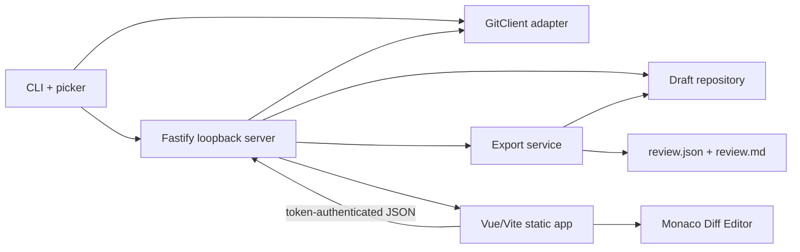

# Architecture Research

**Project:** Diff Review  
**Researched:** 2026-07-11

## System Shape



Keep this a modular monolith. One CLI process owns one repository-bound review server and serves one compiled Vue application. There is no daemon, database, remote service, or plug-in framework in v1.

## Suggested Source Boundaries

```text
src/
  cli/          command parsing, repository discovery, picker, browser launch, signals
  git/          GitClient process adapter and parsers
  domain/       comparison, changed-file, anchor, comment, review schemas
  server/       Fastify construction, routes, auth/origin guard, error mapping
  storage/      review identity, atomic draft load/save, export writer
  web/          Vue application, API client, file tree, diff/comment components
  shared/       transport schemas and error codes shared by server and web
```

Dependencies point inward: CLI/server/web depend on domain schemas; domain code does not import Fastify, Vue, Monaco, filesystem, or process APIs. Git and storage are adapters behind small interfaces.

## Comparison Flow

1. CLI discovers the repository root and common Git directory.
2. `GitClient` parses local branches and `git worktree list --porcelain -z` into selector entries.
3. User chooses ordered base and head entries.
4. Resolve both selections to full commit IDs. A worktree entry uses its committed `HEAD`; run status separately only to produce an ignored-dirty-state warning.
5. Reject equal commit IDs.
6. Resolve all merge bases. Reject unrelated histories; reject or explicitly surface multiple merge bases rather than choosing silently.
7. Pin `comparison = { selectedBase, selectedHead, baseCommit, headCommit, mergeBase }` for the process lifetime.
8. Enumerate changed paths between merge base and head with NUL-delimited Git output and rename detection.
9. For a requested file, return metadata plus the exact old/new blob bytes addressed by object ID. Never read a selected worktree filesystem for reviewed content.
10. Decode supported UTF-8 text under explicit byte/line limits. The Vue client creates Monaco original/modified models and attaches line comments to those immutable models.

Git's official `--merge-base A B` form is equivalent to comparing `$(git merge-base A B)` with `B`. `git worktree list --porcelain -z` is documented as stable for scripts and handles unusual paths safely.

## Git Command Rules

- `spawn` with `shell: false`; never concatenate a command string.
- Set `GIT_CONFIG_NOSYSTEM` only if a reproducibility decision explicitly requires it; otherwise respect the user's Git configuration where safe.
- Disable pagers and color for machine output.
- Prefer `-z`/NUL-delimited formats for paths.
- Validate selector values by resolving them through Git; do not treat them as filesystem paths or options.
- Insert `--` before pathspecs and use object IDs after resolution.
- Disable external diff commands and text conversion for reviewed blob fidelity.
- Bound stdout/stderr and convert nonzero exits into stable domain error codes.
- Test spaces, tabs, newlines, Unicode, leading dashes, renames, deleted files, detached worktrees, bare repos, and unrelated histories.

## Domain Model

The canonical review JSON should contain:

```text
ReviewDocument
  schemaVersion
  reviewId
  createdAt / updatedAt / exportedAt?
  repository { displayName, gitCommonDirectoryFingerprint }
  comparison {
    selectedBase { kind, label, branch?, worktreePath? }
    selectedHead { kind, label, branch?, worktreePath? }
    baseCommit
    headCommit
    mergeBase
  }
  summary
  comments[]

ReviewComment
  id
  body
  state: open | resolved
  createdAt / updatedAt
  anchor {
    file { oldPath?, newPath?, status }
    side: base | head
    startLine
    endLine
    blobId
    context { before[], selected[], after[], hash }
  }
```

Use `base`/`head` in the domain and translate to Monaco's `original`/`modified` terms only in the UI adapter. GitHub's public schema uses `LEFT`/`RIGHT`; explicit semantic names are less presentation-coupled for agent consumers.

The context hash should cover normalized path, side, selected text, and surrounding lines. Preserve exact displayed text separately. An applying agent first checks commit/blob identity; if the branch moved, it locates the selected/context sequence and reports ambiguity rather than editing the same line number blindly.

## Review Identity and Persistence

Derive a deterministic review ID from a schema namespace, repository-common-directory fingerprint, merge-base commit, and head commit. Store drafts under:

```text
.diff-review/
  drafts/<review-id>.json
  exports/<review-id>/review.json
  exports/<review-id>/review.md
```

The absolute repository path may be stored in the draft for local diagnostics but should not be required by an agent export. Use a repository fingerprint rather than exposing workstation paths in the canonical export.

On every accepted mutation:

1. validate the complete next document;
2. write a sibling temporary file with restrictive permissions;
3. rename atomically over the draft;
4. return the new document revision to the UI.

Include a monotonically increasing `revision` and require the UI to send the revision it edited. Return a conflict if a stale tab writes an older revision; even a single-user tool can have two browser tabs.

## HTTP Surface

Keep routes resource-oriented and repository-bound:

- `GET /api/session` — pinned comparison and draft summary
- `GET /api/files` — changed-file metadata
- `GET /api/files/:fileId` — safe opaque ID to old/new blob content and metadata
- `PUT /api/review` — replace validated summary/comments at an expected revision, or use narrow mutation routes if UI complexity warrants
- `POST /api/export` — validate current draft, re-check selected refs for drift, atomically write both formats, return relative paths
- `POST /api/shutdown` — optional token-protected clean stop

Do not accept arbitrary repository paths, Git refs, object IDs, or output paths after launch. The server operates only on the comparison fixed by the CLI and returns files through opaque IDs generated from its own changed-file list.

## Loopback Session Security

Binding to `127.0.0.1` is necessary but not sufficient. A malicious web page can target loopback services. Generate a high-entropy token at startup, place it in the browser URL fragment, let the Vue app move it into memory, and require it in an `Authorization` header for every API request. Reject unexpected `Origin` values and do not enable CORS. Use JSON-only mutation requests and restrictive response headers. Never log the token or include it in exports.

## Vue/Monaco State Ownership

- Pin one active file ID in Vue state.
- Server/domain state owns comments and summary; Monaco owns only editor/view state.
- Create models with stable URIs derived from blob ID and path; dispose them when evicted.
- Translate Monaco original/modified line positions into base/head anchors through one adapter.
- Render comment zones from persisted domain comments, not from ephemeral Monaco widgets.
- Preserve scroll/cursor state per file separately from the review draft.
- Announce comments and validation errors outside Monaco for screen-reader access.

## Export Flow

1. Revalidate the draft and reject empty actionable output only if product policy requires it; a summary-only review remains valid.
2. Re-resolve selected branch/worktree labels. If they moved, show a drift warning while retaining pinned commit identities.
3. Serialize canonical JSON with stable key and comment ordering.
4. Derive Markdown from that in-memory validated object; never maintain a second hand-edited representation.
5. Include only open comments as requested actions in Markdown; preserve resolved comments and their state in JSON.
6. Write JSON and Markdown to temporary siblings, then rename them into one export directory.
7. Return repository-relative paths and hashes so the UI can confirm exactly what was exported.

## Sources

- [Git diff documentation](https://git-scm.com/docs/git-diff) — merge-base comparison, raw output, machine-oriented numstat, binary behavior, and text conversion caveats.
- [Git worktree documentation](https://git-scm.com/docs/git-worktree) — stable `--porcelain -z` output and per-worktree `HEAD` semantics.
- [GitHub review comment API](https://docs.github.com/en/rest/pulls/comments?apiVersion=2022-11-28#create-a-review-comment-for-a-pull-request) — established commit/path/side/line anchor fields and stale-commit warning.
- [Fastify server reference](https://fastify.dev/docs/latest/Reference/Server/) — explicit host and ephemeral-port behavior.
- [Monaco published types](https://unpkg.com/monaco-editor@latest/monaco.d.ts) — diff editor, line-change, hidden-region, and view-zone APIs.
